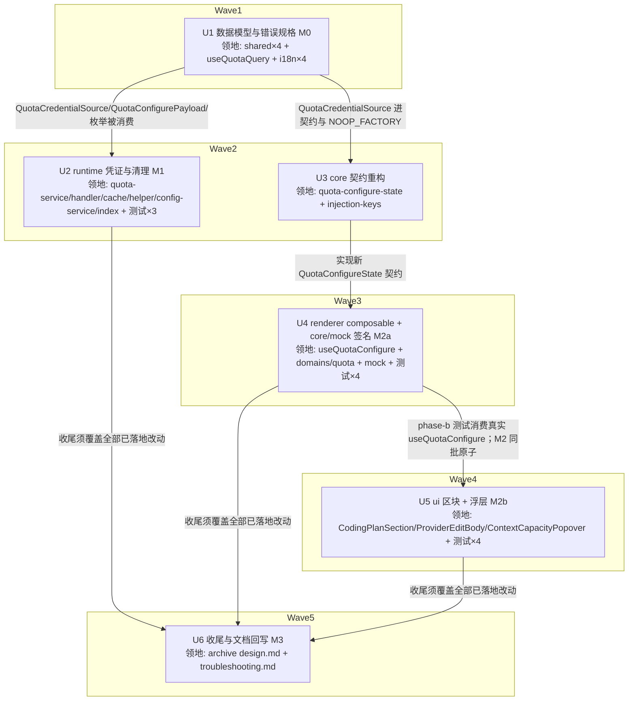

# Coding Plan 额度查询配置交互重构（方案 B）实施计划

基线: 4b42f85a2（设计 v8 终版） | 来源设计: [coding-plan-quota-config-ux.md](coding-plan-quota-config-ux.md) | 日期: 2026-09-10

> 审查证据：主审 [coding-plan-quota-config-ux.review.md](coding-plan-quota-config-ux.review.md)（r4 复审 0 must-fix）+ 影响面审 [coding-plan-quota-config-ux.impact-review.md](coding-plan-quota-config-ux.impact-review.md)（r7 复审 0 must-fix），均随 4b42f85a2 提交。

## 0 章节映射

| 内容 | 本文实际位置 |
|------|--------------|
| 背景/目标 | §1 背景：被设计的系统是什么；§2 设计目标（含 In-scope / Out-of-scope） |
| 终态/机制 | §5 终态：使用者眼里将是什么样的；§6 关键决策与权衡（D1-D13）；§7 实现机制（§7.1 契约 / §7.2 齐备性 / §7.3 runtime 改动 1-6 / §7.4 UI 改动 / §7.5 文件改动地图） |
| 验收场景表 | §8.2 验收场景（S1-S16，含 8 个反向场景；S5 探针为实施期门） |
| 下一层拆分 | §10 下一层拆分（U1-U6 + justification）；§9.1 迁移路径（M0-M3 分期） |
| 待验证检查点 | §11 待验证检查点（5 项，含 ⛔ 实施期门探针） |

## 1 目标快照（逐字摘录自设计 §2）

**改造后使用者在配置这个能力时，全程不需要猜测 —— 缺什么看得见、能不能测看得见、测的结果说得清、系统用的凭证就是界面上说的那份。**

1. **填参数时立刻知道还差什么**，不必先点一下按钮才知道错。
2. **一次点击完成「落盘 + 验证」**，不需要理解保存和测试的先后顺序。
3. **「启用」开关只表达「要不要在浮层里展示」**，不给它附加任何网络副作用。
4. **界面上说的凭证就是实际用的凭证**，任何时候都不出现「显示用 A、实际用 B」。
5. **不制造坏状态**：不产生「配置写进去了但永远查不到」，不把凭证写坏或静默删掉。

Out-of-scope：新增平台类型 / 修改任何 fetcher 的解析逻辑与端点；`ContextCapacityPopover` 的展示形态（成功态与无数据态不动）；额度缓存的 TTL / 10s throttle / pending 并发去重策略；provider 表单其余字段的「草稿 + 底部保存条」提交模型（D10）；`quota-cache.json` 的存储格式与磁盘清理。

## 2 单元列表

设计 §10 给出 U1-U6；本表把 §7.5 文件地图落到精确路径。单元与设计一一对应，不改拆分；派发批次见「批注」列（>5 文件的单元拆多批串行派发，单元仍一次 commit）。

| Unit | 职责 | 领地（精确文件路径） | 依赖 | 隔离 | 验收条款 | 批注 |
|---|---|---|---|---|---|---|
| U1 数据模型与错误规格（M0） | shared 枚举 `'no-credential'` + `QuotaCredentialSource` + `resolveQuotaCredentialSource` + `QuotaConfigurePayload`（protocol 引用）+ `ProviderInfo.quota.credentialSource` + renderer 穷举映射 + 双语 i18n key | `packages/shared/src/quota-types.ts` `packages/shared/src/provider.ts` `packages/shared/src/index.ts` `packages/shared/src/protocol.ts` `packages/renderer/src/composables/features/model/useQuotaQuery.ts` `packages/renderer/src/i18n/locales/zh-CN/settings.ts` `packages/renderer/src/i18n/locales/en-US/settings.ts` `packages/renderer/src/i18n/locales/zh-CN/panel.ts` `packages/renderer/src/i18n/locales/en-US/panel.ts` `packages/renderer/src/__tests__/i18n/quota-reason-i18n.test.ts` | — | plain | ① `cd packages/shared && npx tsc --noEmit` 绿；② `cd packages/renderer && npx vue-tsc --noEmit` 绿（穷举映射漏 key = 编译错，即验证）；③ i18n 存在性测试 `npx vitest run src/__tests__/i18n/quota-reason-i18n.test.ts` 绿；④ protocol 的 `quota.configure` payload 类型改为引用 `QuotaConfigurePayload`（grep 可证）；⑤ 零行为变更：shared/renderer diff 仅类型、导出、文案 key | 2 批：t1 shared 4 文件 → t2 renderer 5 文件 |
| U2 runtime 凭证与清理（M1） | 设计 §7.3 改动 1-6：no-credential 返回；cookie 空串=清除；删除顺序重排与失败语义；按 `credentialSource` 解析（扩 `ProviderInfoLike.quota`）；`lastFailure`/`QuotaCache` 清理（`removeEntry`）；provider 删除清理钩子（三落点）；`credentialSource` 落盘继承链；`QuotaService.configure` 签名切 payload + handler 整对象透传（保留 providerId 防御校验） | `packages/runtime/src/services/quota-service.ts` `packages/runtime/src/transport/quota-message-handler.ts` `packages/runtime/src/services/provider-extras-store.ts` `packages/runtime/src/services/quota-cache.ts` `packages/runtime/src/services/provider-config-helper.ts` `packages/runtime/src/services/config-service.ts` `packages/runtime/src/index.ts` `packages/runtime/test/services/quota-service.test.ts`（扩既有 36 用例） `packages/runtime/test/services/quota-cache.test.ts`（新建） `packages/runtime/src/services/__tests__/provider-config-helper.test.ts`（扩） | U1 | plain | ① `cd packages/runtime && npx tsc --noEmit` 绿；② `npx vitest run test/services/quota-service.test.ts` 绿，新增用例覆盖设计 §7.5 清单全项（no-credential / cookie 空串清除 / 按 source 解析 / lastFailure 清理 / 删除顺序 / credentialSource 继承链——setEnabled 式缺省 payload 不覆盖既存显式值 / 在途 fetch 守卫含「新类型首个 fetch 不被 throttle 压制」/ 失败路径节流不断）+ §7.5 分段验收 M1 形式（带 credentialSource 的 payload 直调 configure 断言 providers.json 落盘）；③ `npx vitest run test/services/quota-cache.test.ts` 绿（removeEntry 三语义：writeChain 串行化 / memoryCache 同步删 / 幂等）；④ `npx vitest run src/services/__tests__/provider-config-helper.test.ts` 绿（新增三排序用例：cleanProviderExtras 失败→主流程仍成功+secrets 保留；extras 成功+cleaner 失败→warn-only 惰性孤儿；三落点各一条）；⑤ handler configure 分支单 payload 整对象透传 + 保留 `!data.providerId` 防御（diff 可证） | 3 批：t1 核心（quota-service + extras-store + handler + quota-cache + cache 测试，5 文件）→ t2 删除链（helper + config-service + runtime index + helper 测试，4 文件）→ t3 quota-service 测试扩用例并全量跑绿收口 |
| U3 core 契约重构 | `QuotaConfigureState` 按设计 §7.1 重写（readiness / credentialSource / saveAndTest / setEnabled / 类型草稿 / 去掩码 / loadCached reason）；`NOOP_FACTORY` 完整字面量同步 | `packages/core/src/domain/settings/quota-configure-state.ts` `packages/ui/src/features/settings/injection-keys.ts` | U1 | plain | ① `cd packages/core && npx tsc --noEmit` 绿；② `cd packages/ui && npx vue-tsc --noEmit` 绿（NOOP_FACTORY 是契约完整字面量，漏成员即编译错，即验证）；③ 契约成员与设计 §7.1 列出的成员一一对应（审查面） | 1 批 |
| U4 renderer composable 重构（M2-a） | `useQuotaConfigure` 实现新契约（齐备性判定 + 凭证归属、saveAndTest 参数构造、setEnabled 无请求、类型进草稿且同值短路、去掩码、D9 十处硬编码中文 i18n 化、loadCached 修 reason）+ core `domains/quota.ts` / mock 的 `configure` 签名切 payload（M2 原子） | `packages/renderer/src/composables/features/model/useQuotaConfigure.ts` `packages/core/src/transport/api/domains/quota.ts` `packages/core/src/transport/mock/index.ts` `packages/renderer/src/__tests__/composables/use-quota-configure.test.ts`（重写） `packages/renderer/src/__tests__/api/quota-domain.test.ts`（更新） `packages/core/src/transport/api/__tests__/domains.test.ts`（更新） `packages/core/src/transport/mock/__tests__/mock-domains.test.ts`（更新，`:452` 位置参数断言改 payload 形） | U3 | plain | ① renderer `vue-tsc --noEmit` 绿 + core `tsc --noEmit` 绿；② `cd packages/renderer && npx vitest run src/__tests__/composables/use-quota-configure.test.ts` 绿（readiness 矩阵含 D13 判定/保存规则与 D5 同值短路、凭证归属、saveAndTest payload 构造、setEnabled 不发请求（mock client 断言零调用）、无掩码、configureError 走 i18n）；③ `npx vitest run src/__tests__/api/quota-domain.test.ts` + `cd packages/core && npx vitest run src/transport/api/__tests__/domains.test.ts src/transport/mock/__tests__/mock-domains.test.ts` 绿（payload 形状断言，mock-domains 改 `quota.configure({ providerId: 'p', enabled: true })`） | 2 批：t1 实现 3 文件 → t2 测试 4 文件 |
| U5 ui 区块重写 + 浮层入口（M2-b） | `CodingPlanSection` 按设计 §7.4 重写（未选类型态 D8 / 单按钮置灰 D1 / 分段控件 D3 / 字段级提示）；`ProviderEditBody` prop 拆分 + `providerCredentialPendingSave`；`ContextCapacityPopover` 失败态补「配置」（D11） | `packages/ui/src/features/settings/coding-plan/CodingPlanSection.vue` `packages/ui/src/features/settings/provider/ProviderEditBody.vue` `packages/renderer/src/components/panel/ContextCapacityPopover.vue` `packages/ui/src/features/settings/__tests__/coding-plan-section.test.ts`（重写） `packages/ui/src/features/settings/__tests__/provider-edit-body.test.ts`（更新） `packages/renderer/src/__tests__/settings/provider-edit-body-phase-b.test.ts`（更新，真实 composable 接线） `packages/renderer/src/__tests__/panel/context-capacity-quota.test.ts`（更新，失败态「配置」入口） | U4 | plain | ① ui `vue-tsc --noEmit` 绿 + renderer `vue-tsc --noEmit` 绿；② `cd packages/ui && npx vitest run src/features/settings/__tests__/coding-plan-section.test.ts` 绿（字段级提示 / 单按钮置灰矩阵 / 分段控件 / 未选类型只渲染下拉+说明）；③ `npx vitest run src/features/settings/__tests__/provider-edit-body.test.ts` 绿（prop 拆分）；④ `cd packages/renderer && npx vitest run src/__tests__/settings/provider-edit-body-phase-b.test.ts src/__tests__/panel/context-capacity-quota.test.ts` 绿（真实接线 / 失败态刷新+配置双按钮） | 2 批：t1 组件 3 文件 → t2 测试 4 文件 |
| U6 收尾与文档回写（M3） | 清残留硬编码中文（D9 终扫）、移除 U5 接线后无消费方的旧 prop、回写 `archive/v3/coding-plan-quota/design.md:322/339` [HISTORICAL] 标注与 `docs/troubleshooting.md`、设计附录 A 处置全部落地 | `docs/page-design/archive/v3/coding-plan-quota/design.md` `docs/troubleshooting.md` （若终扫发现残留：U1/U4/U5 领地内的 quota 相关源文件，属串行尾批无并行冲突） | U2,U4,U5 | plain | ① `grep -rn` 前端 quota 相关文件无硬编码中文错误消息残留；② design.md 322/339 行带 `[HISTORICAL]` 与指向本设计的引用；③ troubleshooting.md 有对应回写；④ `node scripts/check-doc-symbol-drift.mjs` 绿；⑤ `pnpm lint` 绿 | 1 批 |

**U4 与 U5 同属 M2 原子切换**（设计 §9.1：契约三方共享 + NOOP_FACTORY 完整字面量），串行落地于同一分支即满足「同一 PR」；U5 额外依赖 U4 的真实 composable（phase-b 测试）。

## 3 DAG 图

关键路径 U1→U3→U4→U5→U6 深度 5：UI 栈（类型→契约→逻辑→视图→收尾）是**真串行链**——U5 的 phase-b 测试消费 U4 的真实实现、U6 终扫须在全部代码落地后——非纯平移场景，契约先行压扁不适用（设计是行为变更，无上游行为锚点）。宽度补偿：U2（本计划最大单元）与 U3/U4 前半并行。

## 4 测试策略

命令从各包 package.json scripts 实读；vitest 一律**从子包目录运行**（项目约定）。

**增量（单元开发期，每单元收口）**：

| 包 | typecheck | 单测 |
|---|---|---|
| shared | `cd packages/shared && npx tsc --noEmit` | （无独立测试包，由下游编译验证） |
| core | `cd packages/core && npx tsc --noEmit` | `npx vitest run src/transport/api/__tests__/domains.test.ts src/transport/mock/__tests__/mock-domains.test.ts` |
| runtime | `cd packages/runtime && npx tsc --noEmit` | `npx vitest run test/services/quota-service.test.ts test/services/quota-cache.test.ts src/services/__tests__/provider-config-helper.test.ts` |
| renderer | `cd packages/renderer && npx vue-tsc --noEmit` | `npx vitest run src/__tests__/composables/use-quota-configure.test.ts src/__tests__/api/quota-domain.test.ts src/__tests__/settings/provider-edit-body-phase-b.test.ts src/__tests__/panel/context-capacity-quota.test.ts src/__tests__/i18n/quota-reason-i18n.test.ts` |
| ui | `cd packages/ui && npx vue-tsc --noEmit` | `npx vitest run src/features/settings/__tests__/coding-plan-section.test.ts src/features/settings/__tests__/provider-edit-body.test.ts` |

**全量（阶段 5 Gate A）**：根目录 `pnpm test`（--no-bail 全包）+ 各触包包 typecheck + `pnpm lint`。

**测试红线**（项目 AGENTS.md）：vitest（禁 node:test）；timer 测试用 fake timers；三视角缺一不可（每条用例至少一个用户可见 DOM 断言，ui/renderer 层）；runtime 测试禁触真实数据目录（写删目标必须 `mkdtempSync(join(tmpdir(), ...))`，既有 quota-service.test.ts 已是范本）。

**Gate B（阶段 5 真实场景）**：设计 §8.2 S1-S16，`pnpm run dev` + Playwright 连 9222 执行。机器可独立执行：S4/S5/S6/S8/S10/S13/S15（反向行为 + 状态机，不依赖有效凭证）与 S16（类型往返）。需真实凭证：S1/S2/S3/S11/S12/S14 的成功路径断言——dev 数据目录若无可用的智谱/小米/opencode 凭证，列为 blocked 上报用户，不伪造通过。

## 5 合理偏差登记表

初始为空。格式：| 编号 | 偏差 | 设计出处 | 判定为合理的理由 | 落地形态 |

## 6 状态表

| Unit | 状态(pending/in-progress/committed/blocked) | 轮次 | 证据指针 |
|---|---|---|---|
| U1 | committed | 1 | t1: shared/core/runtime `tsc --noEmit` 三绿 + `quota-credential-source.test.ts` 5/5（新文件，按 shared `__tests__` 惯例条件授权）；t2: renderer `vue-tsc --noEmit` 绿（穷举映射完备即编译过）+ `quota-reason-i18n.test.ts` 8/8 + locale-sync 163/163；deviations 4+3 条全为注释级/边界声明，无机制偏离 |
| U2 | pending | 0 | — |
| U3 | pending | 0 | — |
| U4 | pending | 0 | — |
| U5 | pending | 0 | — |
| U6 | pending | 0 | — |

## 7 残留风险与变更历史

**残留风险**：

1. ~~设计 §11 检查点 5（存量幽灵文件差集探针）是 ⛔ 实施期门——U2 落地后跑一次性只读脚本对 dev 数据目录求差集，结果记入本节。~~ **已执行（U1 期，2026-09-10，只读探针）**：严格差集（quota 行存在 ∧ `apiKeySet` 未设 ∧ `*-apikey.txt` 文件在 = 升级后静默切 provider 凭据的集合）在 `~/.xyz-agent-dev` 与 `~/.xyz-agent` **均为空**；幽灵标记两向（`apiKeySet=true` 无文件 / `cookieSet=true` 无文件）均空。唯一残留：dev 目录存在 `zhipu-router-apikey.txt` 孤儿文件（provider 条目已不存在，属已删 provider 的 secrets 残留 = D12 修复的历史实例），新逻辑下无人读取（`'provider'` 来源不读该文件），惰性无害。**判定：无需编辑体提示，检查点关闭。**
2. 设计 §11 检查点 1（`provider.apiKeySet` 聚合不区分凭证类型）依赖 S11② 真实验证——若凭证不可得，登记为待验并上报。
3. Gate B 凭证依赖场景（§4）可能部分 blocked——逐场景登记，不静默跳过。
4. **U1-t2 发现的前批遗留缺口**：`quota-reason-i18n.test.ts` 的两个断言数组历史上就不含 `not_configured` 的 key（`quotaFetchFailNotConfigured` / `quotaFailNotConfigured`——locale 双侧存在但断言数组缺）→ 归 U6 终扫批补齐（该测试文件不在 U1 领地外的任何单元，U6 收尾正好覆盖）。

**变更历史**：

- 2026-09-10 计划创建（基线 4b42f85a2）。与设计 §10 的两处计划级澄清（非偏差，是精确化）：① 测试清单中 `quota-service.test.ts` / `provider-config-helper.test.ts` 实为**扩既有文件**（36 用例 / 既有文件），`quota-cache.test.ts` 为新建；② D9 十处硬编码中文的**执行点归 U4**（文件即 U4 重写对象），U6 保留终扫职责（设计 §10 把「清硬编码中文」写在 U6，§7.5 文件地图与 D9 行号证明其实际落点在 U4 领地）。
