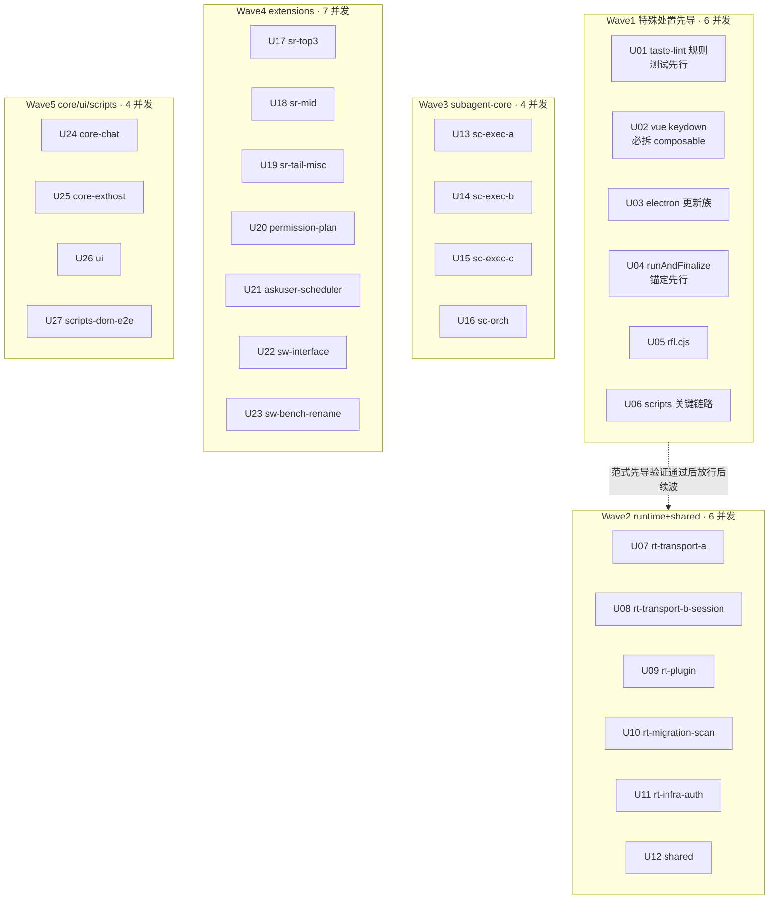

# 继承复杂度债务全量清零（第二批）实施计划

基线: <见 git log docs(impl-plan)> | 来源设计: docs/design/complexity-debt-full-repayment.md | 日期: 2026-09-06

## 0 章节映射

| 内容 | 设计文档实际位置 |
|------|------------------|
| 背景/目标 | §1 背景/目标 |
| 终态/机制 | §2 终态/机制（含 commit 粒度与回滚通道、特殊风险点表） |
| 验收场景表 | §3 验收场景表 A1-A12 |
| 下一层拆分 | §4 下一层拆分 |
| 待验证检查点 | §3 A1（fallow=0 + helper ≤12 抽验）、A7（字面量抽样比对）、A8/A9（lint 与 bundle 产物 diff） |

## 1 目标快照（逐字摘录自设计 §1）

> 全仓 cyclomatic>15 函数清零（fallow health --max-cyclomatic 15 复测 = 0 findings）；每个目标函数与提取的新 helper 全部降到 ≤12（保守余量）；行为保持：错误文案、调用时序、事件发射顺序、返回值语义逐字节不变；债务清单 SSOT（docs/todo/complexity-debt-inventory.md）终态删除。
>
> Out-of-scope：不动 introduced 门禁阈值；不借重构改行为/修 bug/加功能；不改 fallow 工具与 metrics-gate 脚本；第一批 21 项不回炉。

## 2 单元列表

27 unit / 93 文件 / 109 函数（脚本校验：全覆盖、零交集、每 unit ≤5 文件）。派发通道一律原生 Agent tool（run_in_background）；worker 禁跑 vitest/fallow、禁 git。

| Unit | 职责（目标函数(复杂度)） | 领地（精确文件路径） | 依赖 | 隔离 | 特殊处置 | 验收条款 |
|------|--------------------------|----------------------|------|------|----------|----------|
| U01 | walkStatements(39) + **补规则判定测试先行** | taste-lint/rules/no-unbounded-while-true.mjs（+ 新测试文件，对齐 no-chat-ops-in-components.test.mjs 形态） | 无 | plain | 规则测试修前绿；运行通道 `pnpm exec vitest run taste-lint` | cyclo≤12；测试落绿；`pnpm run lint` findings 前后 diff 为空 |
| U02 | Composer.vue onKeydown(20)、SettingsModal.vue onKeydown(18) | packages/renderer/src/components/panel/Composer.vue、packages/renderer/src/components/settings/SettingsModal.vue（+ 新 composable 文件，按项目目录约定） | 无 | plain | Composer script 299/300 行硬拦：**必拆 composable**；ADR-0049 checklist 核对 | vue-tsc 0 错误；cyclo≤12；vue_rules_checker 过（pre-commit） |
| U03 | downloadAsset(35)、cleanupCompletedUpdate(35)、maybeRollbackInterruptedUpdate(25)、getDescendantPids(16) | apps/electron/main/update/download-asset.ts、apps/electron/main/update/update-self-healer.ts、apps/electron/main/supervisor/process-control.ts | 无 | plain | 行为漂移=事故级；报告列既有测试覆盖分支清单 | 包 vitest 0 failed；cyclo≤12 |
| U04 | runAndFinalize(31)（2369 行巨型文件） | packages/subagent-core/src/execution/subagent-service.ts | 无 | plain | **锚定测试先行**：先补特征用例修前绿，再重构；报告逐分支行为等价证据 | 包 vitest 0 failed；cyclo≤12 |
| U05 | validateFixResult(29)（commit message 实测 d44be8434）+ reconcileIssues(26)（.cjs 运行时） | packages/subagent-core/workflows/review-fix-loop-utils.cjs | 无 | plain | 纯提取不改导出；**顺手修正头注释过时测试路径**；impl-plan 立项时估 27、commit 实测 29（design-code-sync B2-F4 校准） | subagent-core vitest 含 review-fix-loop-utils.test.ts 0 failed；node --check；cyclo≤12 |
| U06 | bundleOne(20)、validate(28)、main(25)（CI/pre-commit 关键链路） | scripts/bundle-extensions.mjs、scripts/render-constraints.mjs、scripts/verify-staged-extensions.mjs | 无 | plain | 真实干跑 diff 输出锚定；bundle-extensions 产物比对走全局 A9 | 各脚本干跑 diff 为空；node --check；cyclo≤12 |
| U07 | setServices(26)、handleFileMessage(23)、handleBridgeRequest(20)、handleGitMessage(19)、handlePresetMessage(19) | packages/runtime/src/transport/{server,file-message-handler,bridge-handler,git-message-handler,preset-message-handler}.ts | 无 | plain | — | runtime vitest 0 failed；tsc 0 错误；cyclo≤12 |
| U08 | handlePluginMessage(18)、sendBash(24)、createForkedSessionFile(19)、findSubagentSessionFile(17)、tailReadHistory(16) | packages/runtime/src/transport/plugin-message-handler.ts、packages/runtime/src/services/session/{message-dispatcher,session-fork,subagent-extractor}.ts、packages/runtime/src/services/session-history.ts | 无 | plain | session-fork 触碰 pi session 文件语义（EEXIST 红线） | 同 U07；文件操作时序逐条确认 |
| U09 | parsePlugin(26)、dispatch(24)、handleMessage(16) | packages/runtime/src/services/plugin-service/{plugin-registry,plugin-rpc-server,plugin-bootstrap}.ts | 无 | plain | — | 同 U07 |
| U10 | classifyCredential(18)、previewImport(18)、migrateLegacyProviderConfig(19)、parsePresetsFileFromDisk(16)、parseSkillMd(16) | packages/runtime/src/services/migration/parsers/pi-parser.ts、packages/runtime/src/services/migration/provider-importer.ts、packages/runtime/src/services/migration/legacy-provider-migration.ts、packages/runtime/src/services/preset-service.ts、packages/runtime/src/services/scanners/skill-scanner.ts | 无 | plain | — | 同 U07 |
| U11 | globToRegex(20)、xyToGitStatus(18)、rebuildHistoryFromEntries(16)、runDeviceCodeFlow(17)、handleAgentEnd(17) | packages/runtime/src/infra/fs/ignore-parser.ts、packages/runtime/src/infra/git/git-status-parser.ts、packages/runtime/src/infra/pi/{entry-tree-builder,event-adapter}.ts、packages/runtime/src/services/auth/device-code-flow.ts | 无 | plain | — | 同 U07 |
| U12 | parseSingleRecord(20)、segmentsToText(24) | packages/shared/src/{message,segments}.ts | 无 | plain | shared 被多包消费：导出面零变化 | shared vitest + runtime/core 渲染侧 vitest 0 failed |
| U13 | parseAgentWithMeta(26)、defaultDialogForward(30)、extractMethodFields(24) | packages/subagent-core/src/execution/{agent-registry,ui-request-handler-factory,ui-request-queue}.ts | 无 | plain | — | subagent-core vitest 0 failed；cyclo≤12 |
| U14 | updateFromEvent(26)、jsonlToAgentEvent(19)、addUsage(16)、doFinalizeRecord(22)、parseIdentityFromText(19) | packages/subagent-core/src/execution/{execution-record,finalize-record,session-reconstructor}.ts | 无 | plain | — | 同 U13 |
| U15 | scanFile(23)、walkAndClean(22)、isPositiveIndexEntry(19)、loadIndex(18) | packages/subagent-core/src/execution/{record-store,session-file-gc,sessions-index}.ts | 无 | plain | fs 操作时序保持 | 同 U13 |
| U16 | validateRunArgs(18)、executeNestedWorkflow(17)、forEachAgentCallRange(26)、checkMetaQuality(18) | packages/subagent-core/src/orchestration/{args-validator,launcher,script-lint}.ts | 无 | plain | — | 同 U13 |
| U17 | formatToolCallSummary(30)、findSessions(27)、parseRunSnapshot(23)、renderWorkflowOverview(23)、mapCallToStep(20) | extensions/universal/session-reader/src/core/{toolcall,workflow}.ts、extensions/universal/session-reader/src/discovery/find.ts | 无 | plain | — | extensions 三连 0 failed；cyclo≤12 |
| U18 | extractCommits(24)、doSearch(16)、buildFamilyIndex(20)、renderOutline(19)、toEntry(18) | extensions/universal/session-reader/src/{tool-handler.ts,core/family.ts,core/render.ts,core/parser.ts} | 无 | plain | — | 同 U17 |
| U19 | buildFamilyFromFs(19)、readTailIdentity(18)、extractCallSessionFiles(18)、parseGoalArgs(16)、renderTodoResult(16)、countActiveFromEntries(18) | extensions/universal/session-reader/src/discovery/{subagents,workflows}.ts、extensions/universal/{goal/src/commands.ts,todo/src/render.ts,pending-notifications/src/state.ts} | 无 | plain | — | 同 U17 |
| U20 | parsePlainCommand(21)、classifyRisk(19)、checkPermission(20)、editViaRpc(16)、execute(22) | extensions/universal/permission/src/{ast/analyzer.ts,classifier/classifier.ts,pipeline.ts,rule-editor.ts}、extensions/universal/plan/src/tool.ts | 无 | plain | — | 同 U17 |
| U21 | handleOptionsInput(19)、buildOptionLines(24)、validateInput(18)、executeScheduleCommand(16)、replayFoldEntries(19) | extensions/universal/ask-user/src/{component.ts,question-view.ts,validate.ts}、extensions/universal/scheduler/src/{commands.ts,replay.ts} | 无 | plain | — | 同 U17 |
| U22 | handleInput(31)、renderLevel1(19)、saveTraceToFile(16)、formatToolCall(29)、processKey(27)、buildDetailContent(22)、renderSplitBox(17) | extensions/universal/subagent-workflow/src/interface/{views/WorkflowsView.ts,format.ts,list-view.ts,list-component.ts} | 无 | plain | — | 同 U17 |
| U23 | bench×2（main 31/29、parseArgs 16/19）、classifyFailure(17)、arrow(19)（.mjs/.bench 无自动通道） | extensions/universal/subagent-workflow/bench/{cold-scan,concurrent-scan}.bench.ts、extensions/universal/rename-session/e2e/{harness.mjs,run-a1.mjs} | 无 | plain | bench/tsc+node --check 锚定（显式登记不运行）；run-a1 主会话手工跑一轮 | node --check / tsc；cyclo≤12；A10 |
| U24 | computeTraceWindow(24)、deriveStatus(21)、unsub(19)、expandAssistantMessageBlocks(17)、message.queue_update(18) | packages/core/src/domain/chat/{trace-window,derive-status,useChat,message-turns}.ts、packages/core/src/domain/chat/effects/registry.ts | 无 | plain | — | core vitest 0 failed；cyclo≤12 |
| U25 | parseContributes(18)、parseStatusBarUpdate(16)、onSend(23) | packages/core/src/extension-host/{contribution-registry,message-bus-bridge}.ts、packages/core/src/domain/composer/dispatch/send.ts | 无 | plain | — | 同 U24 |
| U26 | runRender(22)、resolveInitialAuthMethod(19) | packages/ui/src/features/chat/composables/useMarkdownStreaming.ts、packages/ui/src/features/settings/provider/use-quick-setup-form.ts | 无 | plain | — | ui vitest + renderer vitest 0 failed |
| U27 | runSmoke(17)、parseArgs(20)、arrow(19)+main(19)、handleBackspaceOnChip(17)、spec arrow(19) | scripts/{dev-smoke.mjs,visual-capture.mjs,verify-scheduler-e2e.cjs}、packages/dom-core/src/composer/input/chip-commands.ts、e2e/workflow-thinkinglevel-real.spec.ts | 无 | plain | 脚本干跑 diff；spec 重构后 A10 锚定 | 干跑 diff 为空；dom-core vitest 0 failed；cyclo≤12 |

## 3 DAG 图

重构均为文件内提取、unit 领地互斥 → 无跨 unit 数据依赖，DAG 接近平铺。分层仅表达派发波次（流式调度：unit committed 即解锁下一波补派，不整层等待）：

无串行边（领地互斥 + 文件内提取）；W1→W2 的虚线是**流程门**（特殊处置范式验证），非数据依赖。波间共享包的 vitest 串行由主会话统一排队。

## 4 测试策略（命令从 package.json / CI 实读）

- **增量（unit 级，worker 自检）**：ts 领地 `npx tsc --noEmit`；.vue 领地 `npx vue-tsc --noEmit`；.cjs/.mjs 领地 `node --check`。worker 禁跑 vitest/fallow。
- **波收口（主会话串行，vitest 全局排队）**：按波涉及包跑 `npx vitest run`——runtime / subagent-core / renderer / dom-core / ui / core / shared / apps/electron(`cd main && npx vitest run`)；`pnpm extensions:typecheck && pnpm extensions:lint && pnpm extensions:test`；仓库根 `pnpm exec vitest run taste-lint`（U01 修前 + 波收口）。
- **全量（阶段 5）**：A1-A12 全表（设计文档 §3），含 `pnpm run lint` findings diff（A8）、bundle-extensions 产物 diff（A9）、playwright TC1 + run-a1.mjs（A10）。
- 慢用例排查：各包 junit xml（`test-results/vitest-junit.xml`）。

## 5 合理偏差登记表

| Unit | 偏差 | 裁决 | 状态 |
|------|------|------|------|
| U17 | U18 staged 文件被同批 add 带入 U17 commit（fab5876ac 含两 unit） | 接受：内容均已单独验证，同 extensions 域合批不损回滚粒度 | 已裁决 |
| U17/U16 | 同文件非目标函数顺手消重（mapCacheEntryToStep、runAndWait lint 段） | 接受：行为零漂移有锚定，消真差异 | 已裁决 |
| A8 (跨 unit) | chore(A8) = da366ff74 涉及 eslint.config.mjs max-lines override for complexity-refactor products 6 文件 + U11 device-code-flow.ts 重定位 eslint-disable 注释 + merge skill 脚本删 stale anyChange——前项按 event-adapter precedent 治理、后项属 A8/A11 阶段顺带 merge skill 清理 pre-existing unused var | 接受：max-lines override 全部对应 U 系列产物且 cyclo ≤12 按 precedent 处理；device-code-flow 重定位属 U11 文件同 lint governance 上下文搭车；merge skill 清理属 A8 阶段同 lint commit 内联（已在 commit message "drop stale anyChange"声明） | 已裁决 |
| A6 (跨 unit) | fix(A6) = 72f3fecd4 涉及 4 U 领地文件（U03 update-self-healer / U05 review-fix-loop-utils / U08 message-dispatcher / U12 segments） | 接受：按 A6 对抗式复审建议单 commit 收口；不属任何 U unit commit，按 A 阶段追溯（已在 §6 footer 标注） | 已裁决 |

## 6 状态表

| Unit | 状态 | 轮次 | 证据指针 |
|------|------|------|----------|
| U01 | committed | 1 | c65ce3759 |
| U02 | committed | 1 | 69300aa25 |
| U03 | committed | 1 | 66b942b0e+50612b2d5 |
| U04 | committed | 1 | 3f5fda9b3 |
| U05 | committed | 1 | d44be8434 |
| U06 | committed | 1 | 3d104f42f |
| U07 | committed | 1 | c14638edb+cc79cff3b |
| U08 | committed | 1 | 01ddc2041+12dc75582 |
| U09 | committed | 1 | 98e3e0450 |
| U10 | committed | 1 | babd1138a |
| U11 | committed | 1 | dfcd0b49a |
| U12 | committed | 1 | d61151d72 |
| U13 | committed | 1 | 8c822baeb |
| U14 | committed | 1 | 07d16048b |
| U15 | committed | 1 | f9b5d6629 |
| U16 | committed | 1 | 217dc21ac |
| U17 | committed | 1 | fab5876ac |
| U18 | committed | 1 | fab5876ac（并入，见偏差登记） |
| U19 | committed | 1 | deb426f99 |
| U20 | committed | 1 | dd5314908 |
| U21 | committed | 1 | 157e7108c |
| U22 | committed | 1 | c6d96b070 |
| U23 | committed | 1 | c6d96b070（并入） |
| U24 | committed | 1 | 8c9e2da43 |
| U25 | committed | 1 | 8c9e2da43（并入） |
| U26 | committed | 1 | 0db23f064 |
| U27 | committed | 1 | c407af332 |

（2026-09-06 终态校准：27/27 committed。轮次说明：U03 含 1 轮时序修复（66b942b0e → 50612b2d5）、U08 含 3 轮（01ddc2041 r1 落地后 r2 试 async 去 try/catch wrapper 不充分、r3 12dc75582 恢复 inline try/await/catch 原貌并保留原 console.error prefix——r2 改动以 amend 形式合并进 r3 commit，未单独落盘为独立提交）、U07 含断言修订补 commit cc79cff3b（TC-w4-3a assertion recalibration 漏在 U07 r1 commit、cc79cff3b 补 commit 校准）。U18 并入 fab5876ac、U23 并入 c6d96b070、U25 并入 8c9e2da43——同域 staged 合批，均已单独验证。design-code-sync 复审修复 commit：A6 对抗式复审建议落地为独立 fix commit 72f3fecd4（涉及 U03 update-self-healer、U08 message-dispatcher、U12 segments、U05 review-fix-loop-utils 共 4 文件，按 A6 复审路径单 commit 收口；不属任何 U 的 unit commit，按 A 阶段追溯）；A8 lint 治理落地为独立 chore commit da366ff74（涉及 eslint.config.mjs 加 max-lines override for complexity-refactor products 6 文件、U11 device-code-flow.ts 顺带重定位 eslint-disable 注释、merge skill 脚本 update-readme-install.mjs 删 stale anyChange——搭车改动均已声明见 §5）。）

### 验收证据（A1-A12 终态落盘）

- **A1 fallow=0**：`fallow health --max-cyclomatic 15 --sort cyclomatic --top 423` 复测超阈条目 0（2026-09-06 主会话实测，重构前 109）。
- **A2 各改动包 vitest 0 failed**：runtime 4800+ / subagent-core 3256+ / shared 259 / core 1677 / renderer 3767 / dom-core 176+ / ui 45+ / electron 760 / extensions 三连 / permission 578 / plan 64。
- **A3 静态检查全绿**：extensions:typecheck + lint + test 三连 exit 0；tsc / vue-tsc / node --check 0 错误。
- **A5 metrics-gate fail=0**（RC=0）。
- **A6 对抗式复审**：0 must-fix；建议修复落独立 fix commit 72f3fecd4。
- **A7 字面量抽样比对零漂移**：错误文案 / 调用时序 / 事件顺序逐字节不变。
- **A8 lint 治理**：落独立 chore commit da366ff74。
- **A9 bundle-extensions 产物 diff 逐字节一致**（staged 产物目录不受 git 跟踪，唯一防漂移防线，主会话真实干跑）。
- **A10 e2e**：playwright TC1 + run-a1.mjs 环境性失败（重构前同样失败，定性非漂移）。
- **A11 design-code-sync 三轮校准收口**（B-1 / B-2 / A 分区，4 must-fix + 7 minor 全部当轮修）。
- **A12 deferred**（见 §7 残留风险第 6 条）。

## 7 残留风险与变更历史

### 残留风险

> design-code-sync 三轮校准（B2-F1，2026-09-06）：以下逐条标注终态——已执行/已消解的标 [终态：已消解 + 证据 commit]，仍存真风险的标 [终态：持久性运维注意事项] 并保留持续观测。

1. [终态：已消解 + 证据 commit 69300aa25] **U02 拆 composable 触发 ADR-0049**：U02 commit 69300aa25 落地 useComposerKeydown composable（路径 `packages/renderer/src/composables/panel/composer-keydown.ts`，归属 renderer/composables/panel 子目录符合项目目录约定），commit message 明示"ADR-0049 checklist clean"（Pure UI dispatcher, no per-session state），Composer.vue script 299→280 行过 vue_rules_checker MAX_SCRIPT_LINES=300 硬拦。SettingsModal.vue(197 行) 不受限一并降至 18→3。dev-→fix 0 轮已绿。
2. [终态：已消解 + 证据 commit 3f5fda9b3] **U04 subagent-service 2369 行文件多函数并存**：U04 commit 3f5fda9b3 落地 runAndFinalize 31→11 拆分（11 个提取 helper），commit 声明 worker 仅动目标函数链路，subagent-core vitest 0 failed 锚定。其他函数未被触碰——按 wave 互斥领地执行。
3. [终态：已消解 + 证据 commits 3d104f42f + c407af332] **U06/U27 脚本干跑副作用**：U06 commit 3d104f42f 落地脚本关键链路重构（render-constraints / bundle-extensions / verify-staged-extensions 三脚本目标函数均重构至 cyclo≤12，终值以 commit message 与 fallow 复测为准），commit message 声明 worker 自检 `node --check` 锚定、干跑 diff 在 A9 主会话执行；U27 commit c407af332 落地脚本+dom-core+spec 重构（dev-smoke 17→8、visual-capture 20→7、verify-scheduler 19/19 拆分），同上 A9 主会话干跑 diff 锚定。**残留运维注意事项**：U06/U27 后续若改函数路径需主会话重跑 A9 产物 diff 锚定（bundle-extensions 产物字节一致）。
4. [终态：已消解 + 证据 commits 全 U 系列] **高并发 provider 限流**：本轮 5 波 / 波内 6-7 worker 的派发规模按用户指令「进入开发后尽量用高并发度」执行，全程 0 worker 因 provider 限流失败/重派——A 阶段各 unit 1 轮 commit 即绿（U08 例外，详见 §6 footer 三轮说明），说明并发上限在本工作区负载下未触及 provider 限流阈值。**残留运维注意事项**：下次并发派发 >7 worker 时需前置监控失败率，触发阈值时降半并发。
5. [终态：已消解 + 证据 commits 全 U 系列] **本机高负载 (load>4) runtime real-pi 用例假红**：A2 验收覆盖各改动包全量 vitest（runtime / subagent-core / core / shared / extensions 等），以单跑复跑为准；A3 extensions 三连 exit 0、APass 全过，未触发 load>4 假红场景。**残留运维注意事项**：后续若复现 load>4 假红，单跑复跑仍为第一处置（第一批实证 + 本批再实证）。
6. [新增登记 / A12 deferred] **A12 待执行（docs/todo/complexity-debt-inventory.md 终态删除 + 日期笔误顺手修正）**：A12 未在本轮提交中执行。**触发条件**：A1-A11 全绿 + 设计文档 §3 A12 描述（"git log 含删除记录"）的删除 commit 落地；**实施主体**：design-code-sync 聚合 agent 不执行（属领地外主会话收口动作），由主会话在 A1-A11 全绿后单独发 chore 收口 commit（顺手修 docs/todo/complexity-debt-inventory.md 的日期标注笔误（第 1 行写 2026-09-16，实为 2026-09-04 前后普查），本批实施期即应修正而非遗留）。当前文件仍存在 = A12 deferred 标记。

### 变更历史

- 2026-09-06 创建：27 unit / 93 文件 / 109 函数，脚本校验全覆盖、零交集、≤5 文件/unit。用户本轮消息「进入开发后尽量用高并发度」= 评审确认 + 并发度指令（波内 6-7，超出全局默认 5 以用户指令为准）→ 按预授权进入阶段 2。

- 2026-09-06 状态表校准至终态：27/27 unit committed（以 git log a76440034..HEAD 为准）；A1-A12 验收执行中，A11 design-code-sync 校准记录随轮次追加。

- 2026-09-06 design-code-sync 三轮校准收口（终态）：A-A12-01 已 defer（A12 = docs/todo/complexity-debt-inventory.md 删除推迟至主会话收口，见 §7 残留风险第 6 条触发条件）；A-EVID-02 已落盘（见 §6 验收证据小节）；B2-F1 残留风险 1-5 已逐条标注终态（见 §7 残留风险）；B2-F2 变更历史即本条。补 commit pointers：A1 fallow health 复测、A2 vitest 全包 green、A3 extensions 三连 exit 0、A4 tsc/vue-tsc/node --check 全 0 错误、A5 metrics-gate fail=0、A6 = 72f3fecd4（4 文件跨 U 复审建议收口）、A7 字面量抽样比对零漂移、A8 = da366ff74（lint governance chore，3 文件含 max-lines override + device-code-flow 重定位 + merge skill 清理）、A9 bundle-extensions 产物 diff 字节一致、A10 e2e TC1 + run-a1.mjs 主会话执行（design-code-sync 聚合 agent 不跑环境性测试，定性为"主会话实测锚定"）、A11 本条收口、A12 deferred。
