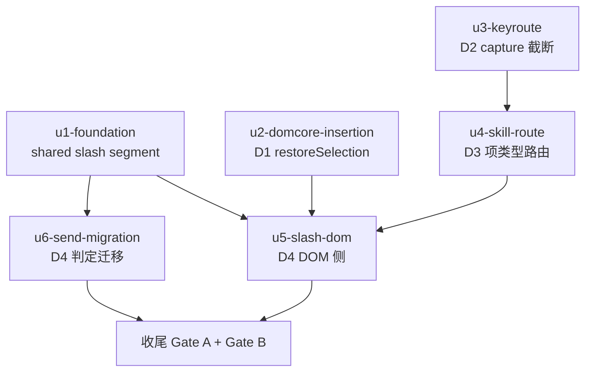

# composer chip 插入语义统一 实施计划

基线: 待评审后回填（commit message `docs(impl-plan): baseline for composer-chip-insertion`） | 来源设计: docs/design/composer-chip-insertion-semantics.md | 日期: 2026-09-08
审查证据: .review/design-review-composer-chip-insertion.md（3 轮双 reviewer 收敛，r3 主审 0 must-fix + r2 影响面审 0 must-fix）

## 0 章节映射

| 内容 | 本文实际位置 |
|------|--------------|
| 背景/目标 | §1 背景目标（G1-G5 表 + In/Out of scope） |
| 终态/机制 | §2 现状与问题分析（§2.4 物理数据流 / §2.5 pi 协议约束）+ §3 解决方案（§3.1 终态场景 / §3.3 D1-D4 决策含代码草案与 D4-c 裁决表） |
| 验收场景表 | §4 验收（13 场景表，含步骤/通过标准/回溯列 + 回归测试清单） |
| 下一层拆分 | §5 下一层拆分（P1-P5 表 + 实施顺序 + 待验证检查点 3 条） |
| 待验证检查点 | §5「待验证检查点」1-3（slash 正则对 ZWSP spacer / normalizeContent slash 段 / pi builtin RPC 注册完整性） |

## 1 目标快照（逐字摘录设计 §1）

> G1 键盘选中就地插入：在草稿任意位置输入 `#`/`@`/`$`/行中 `/` 呼出浮层，按 Enter 或 Tab 选中，chip 落在呼出位置——与鼠标点击选中行为完全一致。
> G2 选中不误发送：浮层开着时按 Enter 是「选中候选」，绝不触发消息发送；Tab/Enter 语义等同。
> G3 skill 两入口统一：同一个 skill 无论从行首 `/` 浮层还是行中空格后 `/` 浮层选中，都产 skill chip：插在光标处、多个共存、携带 SKILL.md 路径、不删已有 chip。
> G4 命令 chip 视觉就地：行首 `/` 浮层选中命令项，chip 插在光标处（不再强制跳到全文最前）；发送时命令自动归位到消息最前生效——pi 协议零改动。
> G5 零回归：鼠标点击路径行为不变；手打 `/skill:xxx` 等纯文本行为零变化；发送后消息文本与现状等价。

Out of scope（逐字）：pi 协议任何变更；一条消息多命令支持；浮层 UI/过滤/排序/触发正则；hasChip 触发抑制的放开；bash 模式（`!`/`!!` 前缀）行为；草稿持久化机制。

## 2 单元列表

| Unit | 职责 | 领地（精确文件路径） | 依赖 | 隔离 | 验收条款 |
|------|------|----------------------|------|------|----------|
| u1-foundation | D4-b 共享契约：Segment 加 `{type:'slash'; name}` + SEGMENT_SERIALIZERS `slash` 项 + segmentsToText 归位（slash 段提最前）+ 穷尽守卫扩 key | packages/shared/src/segments.ts；packages/shared/src/\_\_tests\_\_/segments.test.ts | 无 | plain | segments.test.ts 新增 slash 段类型/serializer/归位断言全绿；`pnpm --filter @xyz-agent/shared test` 绿 |
| u2-domcore-insertion | D1：restoreSelection 本体重写（活选区优先、判定在 focus 前、collapse+contains 防御、!savedRange 分支保 focus、placeCaretAtEnd 辅助）+ chip-commands.ts 调用点注释 | packages/dom-core/src/composer/input/contenteditable.ts；packages/dom-core/src/composer/input/chip-commands.ts（仅注释）；packages/dom-core/src/composer/input/contenteditable.test.ts、chip-commands.test.ts（插入位置用例）；packages/ui/src/features/composer/\_\_tests\_\_/composer-injection-real-dom.test.ts（去 restoreSelection mock，真实选区链路改写） | 无 | plain | 插入位置用例：键盘路径（活选区）chip 落光标处、blur 路径落 savedRange、savedRange 指向已删节点落末尾；injection-real-dom 用例真实选区链路绿；两包测试绿 |
| u3-keyroute | D2：CommandPopover.vue handleKeydown Enter/Tab（composingRef 双保险 + preventDefault + stopPropagation + 时序契约注释）+ AmbiguousFilePopover.vue 同款 + compositionstart/end 监听 | packages/renderer/src/components/panel/CommandPopover.vue；packages/ui/src/features/chat/AmbiguousFilePopover.vue；packages/renderer/src/composables/panel/composer-keydown.test.ts（时序锁用例） | 无（与 u2 不同包可并行） | plain | 时序锁用例：浮层 open 时 Enter 不触发 onSend（capture/bubble 全链路）+ IME composing 中 Enter 不选中；ui/renderer 包测试绿 |
| u4-skill-route | D3：CommandSelectPayload.isSkill + onCmdSelect 按项类型分流 + SlashCandidateInput.location + CommandPopover.vue sourceInfo.path 填充 + restoreSegments skill 分支改 insertSkillChip(name, seg.location) | packages/renderer/src/composables/panel/useCommandPopoverTrigger.ts；packages/renderer/src/components/panel/command-popover-symbols.ts；packages/renderer/src/components/panel/CommandPopover.vue（slashCommands computed 区域）；packages/dom-core/src/composer/input/restore.ts（skill 分支）；packages/renderer/src/\_\_tests\_\_/panel/composer-skill-trigger.test.ts；packages/dom-core/src/composer/input/restore.test.ts（skill 分支用例） | u3（编排依赖：同文件 CommandPopover.vue 防写冲突，非代码依赖） | plain | 路由用例：行首浮层 skill 项走 insertSkillChip（不删已有 chip、带 location）、命令项仍走命令通路；restore.test.ts skill 分支用例绿；两包测试绿 |
| u5-slash-dom | D4-a/D4-b 消费侧：insertSlashChip 命令分支（仅删命令 chip + insertChipAtSelection）+ visitSlashChip 非 skill 分支产 slash 段 + restoreSegments slash 段回滚 | packages/dom-core/src/composer/input/chip-commands.ts；packages/dom-core/src/composer/input/input-dom.ts；packages/dom-core/src/composer/input/restore.ts（slash 分支）；packages/dom-core/src/composer/input/chip-commands.test.ts、input-dom.test.ts、restore.test.ts、skill-trigger.test.ts（断言改写）；packages/renderer/src/\_\_tests\_\_/panel/composer-slash-trigger.test.ts、composer-slash-injection.test.ts（强制最前断言改就地断言） | u1 + u2 + u4（u1 类型；u2 就地位置由 restoreSelection 保证；u4 restore.ts 同文件串行） | plain | slash 段解析/就地插入（仅替换命令 chip、不删 skill chip）/回滚形态恢复用例绿；slash-trigger/slash-injection 断言改写后绿；两包测试绿 |
| u6-send-migration | D4-c/D4-d 判定迁移：send.ts defer 拒绝 `/` 半边 + /compact 拦截 + staging.send 载荷迁 segmentsToPrompt（D4-c 裁决表为准，`!` 半边/bash/canSend/展示文本不迁）+ useChat.ts needsBackfill 谓词单点扩展（text+slash 纯文本） | packages/core/src/domain/composer/dispatch/send.ts；packages/core/src/domain/chat/useChat.ts；packages/core/src/domain/composer/dispatch/\_\_tests\_\_/send.test.ts、submit.test.ts；packages/core/src/domain/chat/\_\_tests\_\_/useChat.test.ts、mutations.test.ts、submit-queued-entry.test.ts | u1（segmentsToPrompt 归位）；与 u5 无文件交集可并行 | plain | 判定迁移用例：含中部命令 chip 的 segments → defer 拒绝 / /compact 拦截 / staging 载荷行首命中；纯 text+slash 不触发 backfill；core 包测试绿 |

收尾（主 agent 组织，非独立单元）：Gate A 全量 `pnpm test` + Gate B 设计 §4 场景 1-13 真机验收（pnpm dev + Playwright CDP 9222）。

P5（测试补齐）不设独立单元：已分摊进各单元验收条款（u3 时序锁 / u2·u5 真实选区用例 / u1·u6 判定与序列化用例 / ui 包 composer-injection-real-dom 去 mock 归 u2 领地内同步改写）。

## 3 DAG 图

并行批次：批次 1 = u1 + u2 + u3（互无文件交集）；批次 2 = u4 + u6；批次 3 = u5；收尾。

## 4 测试策略

- 增量（单元开发期内）：`cd packages/<pkg> && npx vitest run <file>` 或 `pnpm --filter <pkg-name> test`（包级）。各包 test script 均为 `vitest run`（已核实 6 包 package.json）。
- 全量（收尾 Gate A）：仓库根 `pnpm test`（`--filter './packages/**' --filter './apps/**' --filter './extensions/**' --no-bail`）。
- 真机（Gate B）：`env -u ELECTRON_RUN_AS_NODE pnpm dev`（9222 端口）+ Playwright connectOverCDP，按设计 §4 场景表逐行签收；runtime 改动不热重载，改后重启 dev。
- 测试框架红线：vitest（禁 node:test/tsx --test）；timer 用例 fake timers；测试写删目标 mkdtempSync 自建自删；renderer/dom-core/ui 涉及真实选区链路的用例禁 mock restoreSelection（bug 存活根因，u2 同步改写 composer-injection-real-dom）。

## 5 合理偏差登记表

| # | 单元 | 偏差描述 | 判定依据 | 登记时间 |
|---|------|----------|----------|----------|
| 1 | u3 | 领地补录：packages/renderer/src/\_\_tests\_\_/panel/command-popover-landing.test.ts（L18 旧断言「handleKeydown 不守卫 isComposing」与 D2 新契约直接冲突，改写为新契约断言 + [HISTORICAL] 注释） | 设计强制配套测试更新，不配套则包级回归必红；非静默（dev 主动披露） | 2026-09-08 批次 1 核验 |
| 2 | u3 | IME 守卫裸 return 改 return false（handleKeydown 声明返回 boolean，裸 return 是 TS2322）；composingRef 监听挂 window capture（浮层自身无输入元素，只有 window capture 能在消费前感知组合起止） | 实现细节对齐设计意图，vue-tsc 强制 | 2026-09-08 批次 1 核验 |
| 3 | u2 | 「savedRange 指向已删节点→caret 落末尾」用例用 Selection 桩覆盖（DOM live range 语义下无法构造悬空 range，jsdom addRange 自动重锚）；「!savedRange→仍回焦」断言改「不抛错且不应用 range」（jsdom 不支持 contenteditable activeElement） | jsdom/DOM 规范限制，注释已登记；真实链路用例（失败模式 A 回归）仍走真实 Selection | 2026-09-08 批次 1 核验 |
| 4 | u1 | slash→text 边界按 needsBoundarySpace 既有 chip→text 规则补一个空格（如 '/compact 任务描述清理一下'） | 设计 D4-c「needsBoundarySpace 规则沿用」的直接推论 | 2026-09-08 批次 1 核验 |
| 5 | u3 | 领地补录：packages/renderer/src/composables/panel/composition-flag.ts（新建）——composingRef 双保险逻辑从 CommandPopover.vue 提取为 composable（pre-commit vue_rules_checker：script setup 310 行超 300 上限，hook 建议方向即提取 composable；命名遵循同目录 composer-keydown.ts 惯例：文件名不带 use 前缀、导出函数带） | pre-commit 拦截正面修复；vue_rules_checker 硬限 | 2026-09-08 批次 1 commit 门 |

## 6 状态表

| Unit | 状态 | 轮次 | 证据指针 |
|------|------|------|----------|
| u1-foundation | committed | 1 | aab8b4433；shared vitest 331 passed（segments.test 新增 slash 段/serializer/归位断言）；tsc 穷尽守卫 exit 0 |
| u2-domcore-insertion | committed | 1 | dadb65c39；dom-core vitest 215 passed + ui 585 passed；chip-commands.ts diff 核验纯注释 |
| u3-keyroute | committed | 2 | commit 待补（打回修 script 超行，轮次 2）；renderer keydown+landing 增量 36 passed 0 fail + ui 585 + renderer 包级 4071 passed（dev 自报，主验增量） |
| u4-skill-route | pending | 0 | |
| u5-slash-dom | pending | 0 | |
| u6-send-migration | pending | 0 | |

## 7 残留风险与变更历史

**共享文件编排风险**（已通过串行依赖消解，实施期禁并行突破）：
- CommandPopover.vue：u3（handleKeydown/onWindowKeydown 区域）与 u4（slashCommands computed 区域）→ u4 依赖 u3。
- restore.ts：u4（skill 分支）与 u5（slash 分支）→ u5 依赖 u4。
- chip-commands.ts：u2（仅注释）与 u5（insertSlashChip 逻辑）→ 批次错开（批次 1 vs 批次 3），无并发窗口。

**残留风险**（源自设计 §7 待验证检查点）：
1. detectSlashTriggerFromEl 行首正则对「chip 后 ZWSP spacer 处光标」的行为——u5 验收时实测确认（影响场景 6 后连续操作）；
2. normalizeContent 对 slash 段的呈现——预期归位文本透传，u1/u5 用例覆盖；
3. pi builtin 命令 RPC 注册完整性——Gate B 选样注意（场景 6 用 /compact，renderer 侧拦截不依赖此项）。

**变更历史**：
- 2026-09-08：初版（6 单元 DAG，源自设计 §5 P1-P5 拆分；P5 测试分摊进各单元）。
- 2026-09-08：批次 1 完成（u1 aab8b4433 / u2 dadb65c39 / u3 本 commit）；偏差登记 #1-#4；u3 领地补录 landing 测试文件。
