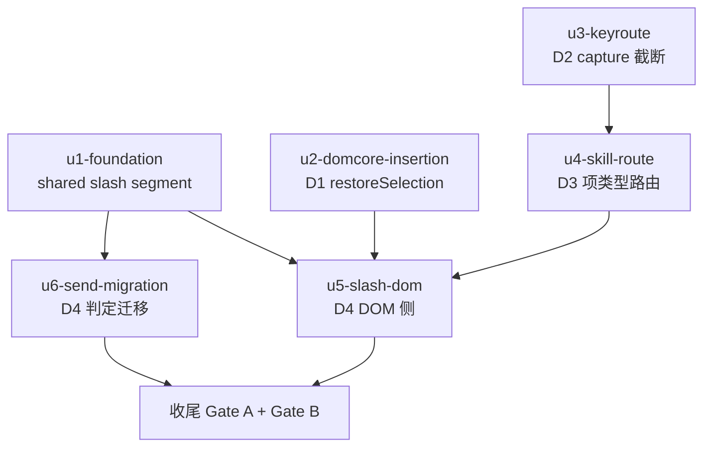

# composer chip 插入语义统一 实施计划

基线: c06edd2bf（本计划初版落盘 commit `docs(impl-plan): baseline for composer-chip-insertion`） | 来源设计: docs/design/composer-chip-insertion-semantics.md | 日期: 2026-09-08 | 坐标口径: 本计划不写绝对行号，一律符号引用（证据/指针一律用符号 + 文件路径）
审查证据: .review/design-review-composer-chip-insertion.md（cw 运行时产物，被 `.gitignore` 的 `/.review/` 条目忽略、不随仓，仅本机可读；3 轮双 reviewer 收敛，r3 主审 0 must-fix + r2 影响面审 0 must-fix）

## 0 章节映射

| 内容 | 设计文档实际位置 |
|------|------------------|
| 背景/目标 | §1 背景目标（G1-G5 表 + In/Out of scope） |
| 终态/机制 | §2 现状与问题分析（§2.4 物理数据流 / §2.5 pi 协议约束）+ §3 解决方案（§3.1 终态场景 / §3.3 D1-D4 决策含代码草案与 D4-c 裁决表） |
| 验收场景表 | §4 验收（13 场景表，含步骤/通过标准/回溯列 + 回归测试清单） |
| 下一层拆分 | §5 下一层拆分（P1-P5 表 + 实施顺序 + 待验证检查点 3 条） |
| 待验证检查点 | §5「待验证检查点」1-3（slash 正则对 ZWSP spacer / normalizeContent slash 段 / pi builtin RPC 注册完整性） |

## 1 目标快照（摘录设计 §1；**G2 有删节**）

> G1 键盘选中就地插入：在草稿任意位置输入 `#`/`@`/`$`/行中 `/` 呼出浮层，按 Enter 或 Tab 选中，chip 落在呼出位置——与鼠标点击选中行为完全一致。
> G2 选中不误发送：浮层**打开（`open`）时按 Enter 是「选中候选」，绝不触发消息发送**；Tab/Enter 语义等同；浮层未打开时 Enter 正常发送。消费条件 = 浮层 `open`（轮 4 取代轮 3 第 4 轮 RC-A-1 的「实际可见才消费」，决策因果见设计 §3.3 D2）——前提是**每个 open 态都有可见渲染**。逐态可见性：① 非空候选五路（slash/session/subagent/skill/`$` file）⇒ 列表渲染、消费；② slash/session/subagent/skill 空候选、landing `@` 无 sessionId、landing `$` 无 cwd、landing `$` 候选源非空但 query 无匹配 ⇒ 「无匹配项」行、消费；③ landing `$` 有 cwd 但候选未到（`cwdFileStatus === 'idle'`）⇒ 「加载中」行、消费；④ landing `$` 错误态 ⇒ 加载失败行、消费；⑤ landing `$` 空结果态 ⇒ 无结果行、消费。**行为变化（轮 4 显式登记，取代轮 3 第 5 轮的「已接受代价」）**：②③ 两类的 Enter 从「放行 ⇒ 发送含触发符字面量的消息（landing 首发还会创建 session）」变为「被消费 ⇒ 不发送」；方向是修正而非回归——这批状态此前什么都不渲染（用户既看不出状态也无反馈，正是 RC-A-1 否决「open 即消费」的理由），现在每个态都有可见行，且 `Escape` 仍是显式关闭入口。
> G3 skill 两入口统一：同一个 skill 无论从行首 `/` 浮层还是行中空格后 `/` 浮层选中，都产 skill chip：插在光标处、多个共存、携带 SKILL.md 路径、不删已有 chip。
> G4 命令 chip 视觉就地：行首 `/` 浮层选中命令项，chip 插在光标处（不再强制跳到全文最前）；发送时命令自动归位到消息最前生效——pi 协议零改动。
> G5 零回归：鼠标点击路径行为不变；手打 `/skill:xxx` 等纯文本行为零变化；发送后消息文本与现状等价。

Out of scope（逐字）：pi 协议任何变更；一条消息多命令支持；浮层 UI/过滤/排序/触发正则；hasChip 触发抑制的放开；bash 模式（`!`/`!!` 前缀）行为；草稿持久化机制。

**摘录口径（design-code-sync 轮 5 补）**：本节是设计 §1 的摘录，其中 G2 块为**删节本**（省略了逐态枚举内的来源/判据括注，例如「file 候选非空指…」「`fileNoResultsVisible` 要求候选源为空」；以及「不存在『open 但不可见』的状态类」「（关闭后 Enter 正常发送）」等完整句）。逐键消费边界以设计 §1 G2 / §3.3 D2 为准（**按实现写准**）：`Enter`/`Tab` 消费（有候选时选中并截断传播；空候选时仅消费事件、不关闭浮层、不发送；**IME 组合中例外**——`composingRef` / `e.isComposing` 时 Enter 放行给输入法确认候选词）；`↑`/`↓` 以候选非空为前提（非空时消费并截断传播，空候选放行）；`Esc` 以候选非空为前提（非空时关闭，空候选放行、交 reka DismissableLayer 兜底关闭）。

## 2 单元列表

| Unit | 职责 | 领地（精确文件路径） | 依赖 | 隔离 | 验收条款 |
|------|------|----------------------|------|------|----------|
| u1-foundation | D4-b 共享契约：Segment 加 `{type:'slash'; name}` + SEGMENT_SERIALIZERS `slash` 项 + segmentsToText 归位（slash 段提最前）+ 穷尽守卫扩 key | packages/shared/src/segments.ts；packages/shared/src/\_\_tests\_\_/segments.test.ts | 无 | plain | segments.test.ts 新增 slash 段类型/serializer/归位断言全绿；`pnpm --filter @xyz-agent/shared test` 绿 |
| u2-domcore-insertion | D1：restoreSelection 本体重写（活选区优先、判定在 focus 前、collapse+contains 防御、!savedRange 分支保 focus、placeCaretAtEnd 辅助）+ chip-commands.ts 调用点注释 | packages/dom-core/src/composer/input/contenteditable.ts；packages/dom-core/src/composer/input/chip-commands.ts（仅注释）；packages/dom-core/src/composer/input/contenteditable.test.ts、chip-commands.test.ts（插入位置用例）；packages/ui/src/features/composer/\_\_tests\_\_/composer-injection-real-dom.test.ts（去 restoreSelection mock，真实选区链路改写） | 无 | plain | 插入位置用例：键盘路径（活选区）chip 落光标处、blur 路径落 savedRange、savedRange 指向已删节点落末尾；injection-real-dom 用例真实选区链路绿；两包测试绿 |
| u3-keyroute | D2：CommandPopover.vue handleKeydown Enter/Tab（composingRef 双保险 + preventDefault + stopPropagation + 时序契约注释）+ AmbiguousFilePopover.vue 同款 + compositionstart/end 监听 | packages/renderer/src/components/panel/CommandPopover.vue；packages/renderer/src/composables/panel/command-popover-keyboard.ts（**轮 5 补录领地**：Enter/Tab/↑↓/Esc 决策与 `activeIndex` 收敛经未修项清零轮 `d4b964220` 提取至此，组件只留候选组装与 `defineExpose({ handleKeydown })`）；packages/ui/src/features/chat/AmbiguousFilePopover.vue；packages/renderer/src/composables/panel/composer-keydown.test.ts（时序锁用例） | 无（与 u2 不同包可并行） | plain | 时序锁用例：**浮层 `open` 时 Enter 不触发 onSend（capture/bubble 全链路）**——含空候选态（**轮 5 勘误**：本条原按轮 3 第 4 轮 RC-A-1 的「实际可见才消费」写成「浮层实际可见时消费 + 不可见时 Enter 放行」，该条件已于轮 4 被 `open` 取代，空候选态现在同样消费、由 `composer-keydown.test.ts` 的空态用例组锁定）+ IME composing 中 Enter 放行不选中；ui/renderer 包测试绿 |
| u4-skill-route | D3：CommandSelectPayload.isSkill + onCmdSelect 按项类型分流 + SlashCandidateInput.location + CommandPopover.vue sourceInfo.path 填充 + restoreSegments skill 分支改 insertSkillChip(name, seg.location) | packages/renderer/src/composables/panel/useCommandPopoverTrigger.ts；packages/renderer/src/components/panel/command-popover-symbols.ts；packages/renderer/src/components/panel/CommandPopover.vue（slashCommands computed 区域）；packages/dom-core/src/composer/input/restore.ts（skill 分支）；packages/renderer/src/\_\_tests\_\_/panel/composer-skill-trigger.test.ts；packages/renderer/src/\_\_tests\_\_/panel/command-popover-landing.test.ts（D3 行首 skill 路由的 landing 断言补丁，随 8a269dcea 落地）；packages/dom-core/src/composer/input/restore.test.ts（skill 分支用例） | u3（编排依赖：同文件 CommandPopover.vue 防写冲突，非代码依赖） | plain | 路由用例：行首浮层 skill 项走 insertSkillChip（不删已有 chip、带 location）、命令项仍走命令通路；restore.test.ts skill 分支用例绿；两包测试绿 |
| u5-slash-dom | D4-a/D4-b 消费侧：insertSlashChip 命令分支（仅删命令 chip + insertChipAtSelection）+ visitSlashChip 非 skill 分支产 slash 段 + restoreSegments slash 段回滚 | packages/dom-core/src/composer/input/chip-commands.ts；packages/dom-core/src/composer/input/input-dom.ts；packages/dom-core/src/composer/input/restore.ts（slash 分支）；packages/dom-core/src/composer/input/chip-commands.test.ts、input-dom.test.ts、restore.test.ts、skill-chip.test.ts（D4-b 断言改写：命令 chip 产 slash segment）；packages/renderer/src/\_\_tests\_\_/panel/composer-slash-trigger.test.ts（D4-b 就地断言新增于 U11c） | u1 + u2 + u4（u1 类型；u2 就地位置由 restoreSelection 保证；u4 restore.ts 同文件串行） | plain | slash 段解析/就地插入（仅替换命令 chip、不删 skill chip）/回滚形态恢复用例绿；slash-trigger 断言改写后绿（composer-slash-injection.test.ts：**u5 实施期**未改动该文件、实测无「强制最前」类断言（见偏差 #10）；**未修项清零轮 `d4b964220` 因第三入口（SearchModal ⌘K）合流新增用例组 U19/U20 SearchModal ⌘K 注入分流**——该文件已不等于「未改动」，与该轮「renderer 4 文件/64 例」口径一致，见 §7 变更历史该轮条目）；两包测试绿 |
| u6-send-migration | D4-c/D4-d 判定迁移：send.ts defer 拒绝 `/` 半边 + /compact 拦截 + staging.send 载荷迁 segmentsToPrompt（D4-c 裁决表为准，`!` 半边/bash/canSend/展示文本不迁）+ useChat.ts needsBackfill 谓词扩展（text+slash 纯文本；落在直发 + defer 重放两处同款，见偏差 #16） | packages/core/src/domain/composer/dispatch/send.ts；packages/core/src/domain/chat/useChat.ts；packages/core/src/domain/composer/dispatch/send.test.ts（staging 归位开首/defer 拒绝用例，随 8a269dcea 落地）；packages/core/src/domain/chat/\_\_tests\_\_/useChat.test.ts（D4-d sidecar 用例）；`packages/core/src/domain/composer/dispatch/submit.test.ts` **既有**（计划基线 `c06edd2bf` 即存在，本单元未改动，计划用例归并至 send.test.ts）；`dispatch/mutations.test.ts` / `dispatch/submit-queued-entry.test.ts` 未实施，用例归并至上两文件（design-code-sync 轮 2 R2-F2 登记；路径与既有性经轮 5 复核修正） | u1（segmentsToPrompt 归位）；与 u5 无文件交集可并行 | plain | 判定迁移用例：含中部命令 chip 的 segments → defer 拒绝 / /compact 拦截 / staging 载荷行首命中；纯 text+slash 不触发 backfill；core 包测试绿 |

收尾（主 agent 组织，非独立单元）：Gate A 全量 `pnpm test` + Gate B 设计 §4 场景 1-13 真机验收（pnpm dev + Playwright CDP 9222）。

P5（测试补齐）不设独立单元：已分摊进各单元验收条款（u3 时序锁 / u2·u5 真实选区用例 / u1·u6 判定与序列化用例 / ui 包 composer-injection-real-dom 去 mock 归 u2 领地内同步改写）。

## 3 DAG 图

并行批次：批次 1 = u1 + u2 + u3（互无文件交集）；批次 2 = u4 + u6；批次 3 = u5；收尾。

## 4 测试策略

- 增量（单元开发期内）：`cd packages/<pkg> && npx vitest run <file>` 或 `pnpm --filter <pkg-name> test`（包级）。各包 test script 均为 `vitest run`（已核实 6 包 package.json）。
- 全量（收尾 Gate A）：仓库根 `pnpm test`（`--filter './packages/**' --filter './apps/**' --filter './extensions/**' --no-bail`）。
- 真机（Gate B）：`env -u ELECTRON_RUN_AS_NODE pnpm dev`（9222 端口）+ Playwright connectOverCDP，按设计 §4 场景表逐行签收；runtime 改动不热重载，改后重启 dev。
- 测试框架红线：vitest（禁 node:test/tsx --test）；timer 用例 fake timers；测试写删目标 mkdtempSync 自建自删；renderer/dom-core/ui 涉及真实选区链路的用例禁 mock restoreSelection（bug 存活根因，u2 同步改写 composer-injection-real-dom）。

## 5 合理偏差登记表

| # | 单元 | 偏差描述 | 判定依据 | 登记时间 |
|---|------|----------|----------|----------|
| 1 | u3 | 领地补录：packages/renderer/src/\_\_tests\_\_/panel/command-popover-landing.test.ts（L18 旧断言「handleKeydown 不守卫 isComposing」与 D2 新契约直接冲突，改写为新契约断言 + [HISTORICAL] 注释） | 设计强制配套测试更新，不配套则包级回归必红；非静默（dev 主动披露） | 2026-09-08 批次 1 核验 |
| 2 | u3 | IME 守卫裸 return 改 return false（handleKeydown 声明返回 boolean，裸 return 是 TS2322）；composingRef 监听挂 window capture（浮层自身无输入元素，只有 window capture 能在消费前感知组合起止） | 实现细节对齐设计意图，vue-tsc 强制 | 2026-09-08 批次 1 核验 |
| 3 | u2 | 「savedRange 指向已删节点→caret 落末尾」用例用 Selection 桩覆盖（DOM live range 语义下无法构造悬空 range，jsdom addRange 自动重锚）；「!savedRange→仍回焦」断言改「不抛错且不应用 range」（jsdom 不支持 contenteditable activeElement） | jsdom/DOM 规范限制，注释已登记；真实链路用例（失败模式 A 回归）仍走真实 Selection | 2026-09-08 批次 1 核验 |
| 4 | u1 | slash→text 边界按 needsBoundarySpace 既有 chip→text 规则补一个空格（如 '/compact 任务描述清理一下'） | 设计 D4-c「needsBoundarySpace 规则沿用」的直接推论 | 2026-09-08 批次 1 核验 |
| 5 | u3 | 领地补录：packages/renderer/src/composables/panel/composition-flag.ts（新建）——composingRef 双保险逻辑从 CommandPopover.vue 提取为 composable（pre-commit vue_rules_checker：script setup 310 行超 300 上限，hook 建议方向即提取 composable；命名遵循同目录 composer-keydown.ts 惯例：文件名不带 use 前缀、导出函数带） | pre-commit 拦截正面修复；vue_rules_checker 硬限 | 2026-09-08 批次 1 commit 门 |
| 6 | u4 | 领地内提取：slash 候选构建（panel 态 buildPanelSlashCandidates + landing 态 buildLandingSlashCandidates）从 CommandPopover.vue 搬到 command-popover-symbols.ts（script 315→289；纯搬运零行为变化，unused import 同步清理） | pre-commit vue_rules_checker 300 行硬限；u3 提取后仅余 11 行余量，u4 新增回填逻辑必超 | 2026-09-08 批次 2 commit 门 |
| 7 | u6 | routeStaging 签名删 text 参数（staging.send 载荷改 segmentsToPrompt 后无消费点），同步唯一调用点；core 包 tsc 口径抓不到，renderer 跨包口径（TS6133）拦出 | 未使用参数清理；deviation #2 同因（cross-scope tsc 口径差异） | 2026-09-08 批次 2 commit 门 |
| 8 | u4 | restore.ts 调 insertSkillChip 的类型缺口：ComposerInputInstance（core/types.ts，领地外）未声明该方法，局部交叉类型收窄 + ?. 调用（对齐 session/subagent 可选成员缺省容错语义）；建议一致性审查阶段评估正式落进 types.ts | 领地锁约束下的最小实现；功能不受影响 | 2026-09-08 批次 2 核验 |
| 9 | u5 | 领地补录①：dom-core skill-chip.test.ts（旧「命令 chip 走文本拍平」断言与 D4-b 直接冲突，设计 §4 回归清单点名该文件）；领地补录②：ui composer-input-get-text.test.ts（同因旧拍平断言，设计 §4 ui 行点名）；计划 u5 领地清单漏列 | 设计 §4 回归清单明确点名；同偏差 #1/#2 先例 | 2026-09-08 批次 3 核验 |
| 10 | u5 | composer-slash-injection.test.ts 实测无「强制最前」类断言（整体 mock ComposerInput 为 spy，无 DOM 位置断言）——改写任务落在 slash-trigger U11c 新增就地断言；U11a/U11b 补确定性选区前置（防 happy-dom range.insertNode 插入已卸载 DOM 现象），断言本体未动 | 计划预判与实际测试形态不符；改写目标已达成 | 2026-09-08 批次 3 核验 |
| 11 | u5 | insertSlashChip 的 skill 兼容分支（`'/skill:'` 前缀）由「重排为显式分流、**行为逐行不变**」在 `5b5d49f37` 改为**委托 `insertSkillChip`——行为已变**：由「删全部 chip + `insertBefore(firstChild)` 强制最前」改为「光标处插入、不删其他 chip」（设计 D4-a / 失败模式 C 的收口，与行首浮层 skill 通路同形态）。**该分支的 location 仍是 `undefined`**（`'/skill:'` 前缀串不携带 SKILL.md 路径，调用点 `chip-commands.ts` 第二参显式传 `undefined`；与旧分支同——「丢 location」描述的是旧通路的破坏面之一，不是本分支改为携带 location）；回归锁 `packages/dom-core/src/composer/input/chip-commands.test.ts` 的「委托 insertSkillChip —— 就地插入 + 不删已有 chip（S-4）」用例锁定新行为（同用例断言 `dataset.chipLocation` 为 `undefined`） | 原「结构化非行为偏差」判定被 `5b5d49f37` 的实现推翻，按终态改写（design-code-sync 轮 5 复核 read `chip-commands.ts` skill 分支与对应用例；**轮 5 复审勘误**：初稿写「不丢 location」被该用例与代码证伪，本行已改正） | 2026-09-08 批次 3 核验（2026-09-10 轮 5 复核改写） |
| 12 | u6 | enqueueDuringDefer 的 segments 快照从 enqueue 前移到 `/` 判定前——判定源迁 segments 后快照必须先于判定，顺带修复「判定先行但快照在后」的顺序隐患（clearInput 丢段风险） | 实现优于设计（机制层必要配套）；区 C 审查确认 | 2026-09-08 阶段 3 审查 |
| 13 | u4/u5 | visitSlashChip slash 分支 name 取值 dataset-only（`chipName ?? ''`），丢弃旧 label 文本回退——与同函数 skill 分支既有约定同款 | 一致性优先；insertSlashChip 恒写 dataset，空值仅异构 DOM 出现 | 2026-09-08 阶段 3 审查 |
| 14 | Gate A 回流 | selection-restore.ts 从 useContenteditableInput 提取（max-lines-per-function 316→~270，lint 拦截正面修复）；ComposerInputInstance 正式声明 insertSkillChip（偏差 #8 根修：restore.ts 局部收窄删除、restore.test 四处 TS2551 源头消解）；AmbiguousFilePopover 补行为级测试 7 用例（Gate A uncovered 缺口） | Gate A failures/uncovered 修复批次（ce76e7836） | 2026-09-08 Gate A 轮 1 |
| 15 | u2 | 设计 §4 ui 行「真实选区链路去 mock」收窄：实际仅对 composer-injection-real-dom 去 mock；file-chip.test.ts / useComposerChipCommands.image.test.ts 断言均为 DOM 结构（dataset/label/spacer）不含插入位置主张，维持 mock；位置覆盖由 dom-core `chip-commands.test.ts` 的 `describe('useComposerChipCommands 插入位置（真实 restoreSelection 链路，设计 D1）')` 区段三条断言用例（失败模式 A 回归 / 键盘活选区落呼出位置 / blur 回退落 savedRange）真实链路承接 | 工程收窄合理但未同步设计清单口径（design-code-sync 轮 1 I4 裁决：登记） | 2026-09-08 design-code-sync 轮 1 |
| 16 | u6 | 轮 1 S2 修复（代码侧 804424c45 / 文档侧 bf8a55443）：`useChat.ts` 的 `submitQueuedEntry`（defer 重放路径）needsBackfill 谓词补排除 slash 段，与 `submitSegments`（直发路径）同款字面谓词 `segments.some((s) => s.type !== 'text' && s.type !== 'slash')`——该谓词全仓实为两处字面重复、无共享 helper；defer 路径 slash 段不可达（`send.ts` enqueueDuringDefer 对 segmentsToPrompt 以 `/` 开头一律拒绝），排除纯为两路径口径统一（reload sidecar 写入门控） | 判定源迁 segments 后两路径谓词必须同口径；轮 1 裁决为 doc-right 改代码，此前仅在本计划 §7 变更历史散文登记、未进本表 | 2026-09-08 design-code-sync 轮 1（2026-09-10 轮 3 由散文提升进表 + 补 commit 锚点） |
| 17 | u3 | 领地补录：`packages/renderer/src/composables/panel/command-popover-keyboard.ts`（**新建**）——键盘决策（Enter/Tab/↑↓/Esc）与 `activeIndex` 收敛自 `CommandPopover.vue` 提取为 composable（未修项清零轮 `d4b964220` 的 ④ 项：组件 `<script setup>` 299 → 255 行、模板 124 行；`activeIndex` 的越界窗口在「候选长度变化」同一拍 sync 收敛） | 与偏差 #5（`composition-flag.ts`）、#6（`command-popover-symbols.ts`）同类「pre-commit 行数硬限触发的提取」先例；设计 §5 P2 已把它写成终态落点，本表此前只在变更历史散文出现（design-code-sync 轮 5 补录，修正登记面不对称） | 2026-09-10 未修项清零轮（2026-09-10 轮 5 补录进表） |

## 6 状态表

| Unit | 状态 | 轮次 | 证据指针 |
|------|------|------|----------|
| u1-foundation | committed | 1 | aab8b4433；shared vitest 331 passed（segments.test 新增 slash 段/serializer/归位断言）；tsc 穷尽守卫 exit 0 |
| u2-domcore-insertion | committed | 1 | dadb65c39；dom-core vitest 215 passed + ui 585 passed；chip-commands.ts diff 核验纯注释 |
| u3-keyroute | committed | 2 | 16204a7c9（打回修 script 超行，轮次 2）；renderer keydown+landing 增量 36 passed 0 fail + ui 585 + renderer 包级 4071 passed（dev 自报，主验增量） |
| u4-skill-route | committed | 2 | 8a269dcea；skill-trigger 13 + landing + restore 14 绿，包级 4074；script 315→289（轮 2 提取候选构建到 symbols，偏差 #6） |
| u5-slash-dom | committed | 1 | 1fbc9c3aa；dom-core 224 + ui 585 + renderer 全量 4075 绿；检查点 1 已实测销项（spacer 处 / 不触发行首浮层，三用例锁定） |
| u6-send-migration | committed | 2 | 8a269dcea（代码随 u4 同 commit 落地；dcfe230b6 仅含本文档变更）；core 计数按双时点记：**u6 提交时点** 1775 passed + 6 todo（总 1781）；**design-code-sync 轮 3 后** 1776 passed + 6 todo（总 1782——轮 3 的 landing 首发命令 chip label 修复在 core 新增 1 例）；双口径 vue-tsc 绿（轮 2 清 routeStaging 未用参数，偏差 #7） |

轮次列口径：轮次 = 打回重做轮次（同一 commit 内可含轮 2 改动）；u3 轮 2 = 打回修 script 超行（偏差 #5）。证据指针列口径：测试计数是该单元提交时点的实测值（后续轮次会变，需当前值须重跑；u6 行已按双时点标注示例）。

## 7 残留风险与变更历史

**共享文件编排风险**（已通过串行依赖消解，实施期禁并行突破）：
- CommandPopover.vue：u3（handleKeydown/onWindowKeydown 区域）与 u4（slashCommands computed 区域）→ u4 依赖 u3。
- restore.ts：u4（skill 分支）与 u5（slash 分支）→ u5 依赖 u4。
- chip-commands.ts：u2（仅注释）与 u5（insertSlashChip 逻辑）→ 批次错开（批次 1 vs 批次 3），无并发窗口。

**残留风险**（源自设计 §5 待验证检查点 + design-code-sync 轮 5 登记；1/2 已销项）：
1. ✅ 已销项（u5，input-dom.test 三用例锁定）：detectSlashTriggerFromEl 行首正则对「chip 后 ZWSP spacer 处光标」不触发行首浮层——与 hasChip 抑制现状一致，无冲突；
2. ✅ 已销项（区 A 审查确认）：normalizeContent 经 segmentsToText 委托，归位文本透传，无反解析需求；
3. pi builtin 命令 RPC 注册完整性——Gate B 选样注意（场景 6 用 /compact，renderer 侧拦截不依赖此项）。
4. 场景 9（发送失败回滚）真机验收 blocked：kill-pi 注入手段与产品消息级发送故障模型粒度错配（pi 意外退出 → renderer 即刻重置 session 视图，restoreSegments 回滚无执行环境；800ms/300ms 两轮抢发一致）——非产品缺陷。补偿覆盖 = Gate A restore.test/send.test 单元；复验条件 = 具备消息级发送失败注入手段（如 runtime 注错）时补真机签认。
5. **renderer 搜索壳双轨（contested / info，design-code-sync 轮 5 登记）**：SearchModal ⌘K 第三入口的 `isSkill` / `location` 透传在 `d4b964220` **同时落在两份实现**——core（生产路径：`packages/core/src/domain/new-task-search/` 的 `search.ts` / `search-jump.ts` / `types.ts`）与 renderer（`packages/renderer/src/composables/features/search/useSearch.ts` / `useSearchJump.ts`）。**生产消费者是 core**：`packages/ui/src/overlays/SearchModal.vue` 从 `@xyz-agent/core` import `useSearch` / `useSearchJump`；**renderer 两份仅被测试引用、无生产消费者**（引用点：`packages/renderer/src/__tests__/composables/useSearch.test.ts` / `useSearchJump.test.ts` / `i18n/section-kind.test.ts`）。**本轮为镜像同步**（两处同改，以保两套测试口径一致）。**风险**：漏改一份即静默漂移，且两处测试同时全绿会给出「生产已锁」的错觉。**处置方向**：登记为既有迁移在途债；删除 renderer 壳需单独决策，**不在本轮**（本轮不删任何文件）。**[2026-09-11 更新] 该债已清**：renderer 壳（useSearch.ts / useSearchJump.ts / useRecents.ts / useCommandRegistry.ts 及上述三个配套测试文件）已随 renderer 过度设计清理删除（见 `docs/design/renderer-over-engineering-remediation.md` 候选 1，u01），生产单轨于 core。

**runtime 钳制用例登记（2026-09-08 记录 → 2026-09-10 复核）**：runtime `thinking-level-effective-e2e.test.ts` 原记录称「钳制用例 1/2 失败，根因为测试前提恒不成立（0.84.4 实装目录无 `reasoning:false` 模型）」；2026-09-10 于 HEAD 复跑该文件 2/2 通过——原「前提恒不成立」结论与「0 次」论断均被证伪，登记改写为下列可复现事实：

- 实跑 `cd packages/runtime && npx vitest run src/__tests__/equivalence/thinking-level-effective-e2e.test.ts` → `Test Files 1 passed (1) / Tests 2 passed (2)`，junit `failures="0" skipped="0"`（非 skip）。
- 原「0.84.4 实装目录 grep `"reasoning":false` 为 0 次」不实：`grep -ro '"reasoning":false' node_modules/@earendil-works/ | wc -l` = **257**，全部落在 `node_modules/@earendil-works/pi-ai/dist/providers/data/`（pi-ai 内置 provider 模型目录数据，39 个 JSON 中 16 个含该标注）。
- 环境依赖（该用例成立与否取决于宿主演员清单）：`spawnIsolatedPi` 把宿主 agent 目录的 `auth.json/models.json/settings.json` 拷入隔离 agentDir，`get_available_models` 因而含宿主 models.json 定义的模型；本机 `grep -c '"reasoning": *false' ~/.pi/agent/models.json` = 1（provider `omlx` 的 `Qwen3.8-27B-4bit`，因隔离目录中的 models.json 只可能来自这次拷入，该演员必来自宿主文件），第二个用例据此找到 `reasoning===false` 演员并断言钳制回执。
- **已销项（未修项清零轮，2026-09-10）**：按该候选方案实施——测试在隔离 agentDir 的 `models.json` 里 upsert 一个确定性演员（provider `e2e-thinking-probe` / model `e2e-reasoning-off-probe`，`reasoning: false` + 字面量 `apiKey`，因而恒过 pi 的 `checkProviderAuth`），用例按该演员的**显式名字**断言钳制回执（`get_available_models` 身份断言 + `setThinkingLevel('high')` ⇒ `'off'`）。对照实验：把宿主 `models.json` 整个换掉（`PI_CODING_AGENT_DIR` 指向只含 `auth.json` 的目录）仍 `2 passed`；临时关掉注入 ⇒ 用例红（`get_available_models` 47 项里一个 `reasoning:false` 都没有，正是「换台机器旧谓词必失败」的实证）。宿主依赖已消除，不再需要独立决策；第一个用例（`reasoning:true`）仍是「清单中任一 reasoning:true 模型」，若后续要求绝对确定性可用同一手法再加演员。
- 非本次改动（runtime 区间零改动）。另：ui typecheck 存量 4 错（provider-edit-body/search-modal 测试，区间外）另列清理项。

**变更历史**：
- 2026-09-08：初版（6 单元 DAG，源自设计 §5 P1-P5 拆分；P5 测试分摊进各单元）。
- 2026-09-08：批次 1 完成（u1 aab8b4433 / u2 dadb65c39 / u3 16204a7c9 轮 2）；偏差登记 #1-#5；u3 领地补录 landing 测试文件。
- 2026-09-08：批次 2 完成（u4 8a269dcea 轮 2 / u6 dcfe230b6 轮 2）；偏差登记 #6-#8；u4 领地补录 landing 测试；vue_rules_checker 全工作区口径导致 u6 commit 被 u4 在途超行连坐——编排顺序改为串行 commit。归置说明：u6 的 send.ts/useChat.ts 代码改动实际随 u4 的 8a269dcea 一并 commit（同文件串行编排所致），dcfe230b6 仅含本计划文档变更。
- 2026-09-08：批次 3 完成（u5 1fbc9c3aa 轮 1）；偏差登记 #9-#11；检查点 1 销项（spacer 处 / 不触发行首浮层，与 hasChip 抑制一致，input-dom.test 三用例锁定）；状态表全 committed → 转阶段 3 一致性审查。
- 2026-09-08：阶段 3 一致性审查轮 1 清零——三区（shared+dom-core / renderer+ui / core）独立审查：unreasonable 全空；doc_errors 2 条主 agent 亲修（① §4 dom-core 测试清单误列 skill-trigger.test.ts → 删，实际被改文件为 skill-chip.test.ts；② §5 P3 行 location 回填位置表述同步偏差 #6 提取后实际——buildPanelSlashCandidates）；reasonable 聚合登记 #12/#13 + 设计 D4-a 补「命令分支同经 restoreSelection（D1）取位」一句 + §7 检查点 2 销项；检查点 3 留 Gate B 选样注意。→ 转阶段 5 双级验收。
- 2026-09-08：Gate A 轮 1 红 → 修复批次 ce76e7836（偏差 #14；原记录曾于 a1cc7d144 误写 Gate B，design-code-sync 轮 1 勘误）：lint max-lines-per-function（selection-restore 提取）、dom-core tsc TS2551×4（types.ts 根修）、AmbiguousFilePopover 测试缺口。重验：lint 0 / 双口径 tsc 绿 / dom-core 224 + ui 592 + core composer 312 绿。**遗留风险（历史记录，2026-09-10 复核销项）**：runtime thinking-level-effective-e2e.test.ts 当时记录「1/5088 失败」——本机 provider 可用模型清单不满足测试前提的环境依赖型存量失败（runtime 区间零改动，非本次引入；Gate A shell env 泄漏导致的 runtime fail-fast 与 subagent-core 1 失败均已定性为环境问题且清 env 重跑绿）；2026-09-10 于 HEAD 复跑该文件 2/2 通过（junit failures=0 skipped=0），原「前提恒不成立」判据已证伪，详见本 §「runtime 钳制用例登记」。ui typecheck 存量 4 错（区间外文件）另列清理项。
- 2026-09-08：Gate B 执行环境事故（非被测代码问题）：v1-v4 派发的 dev app 因宿主 shell 泄漏 XYZ_AGENT_DATA_DIR=~/.xyz-agent 而运行在用户真实数据目录上（main.ts 旧 ?? 缺省填充采信外部值）。已确认零数据污染（无发送/无 JSONL 写入/drafts 未落盘/宿主 pi 进程无损），该轮验收作废。根修 ffe86df9c：main.ts isDev 块无条件钉死 XYZ_AGENT_DATA_DIR=~/.xyz-agent-dev（外部 env 不采信）+ 源码行级守护测试 5 用例（apps/electron 52 文件 918 用例绿）。同批（ffe86df9c）同步常量延迟求值守护测试注释（`apps/electron/main/update/\_\_tests\_\_/constants-lazy-path.test.ts` 的守护测试注释：`?? 兜底` → `钉死`，纯注释无功能影响，本轮补登记）。
- 2026-09-08：Gate B 真机验收完成（v5，环境加固后）：**overall = pass（12 pass / 0 fail / 1 blocked）**。场景 1-8/10-13 全 pass（含决定性证据：场景 6 JSONL compaction_start/end + 无 /compact 字面消息 = D4-c 拦截迁移生效；场景 10 staged prompt 归位开首；场景 12 重建归位；场景 5 逆向等价序列覆盖 D5 已知限制）。场景 9 blocked：kill-pi 注入手段与产品故障模型（消息级发送失败）粒度错配，renderer 即刻重置视图致 restoreSegments 无执行环境——非产品缺陷，回滚逻辑由 Gate A restore.test/send.test 单元覆盖，转残留风险登记。三重自检全过（隔离目录）；~/.xyz-agent 零写入；dev 树已清、截图存 /tmp/gate-b-shots/（41 张）。dev-flow 五阶段全部完成。
- 2026-09-08：design-code-sync 轮 1 完成且复审前置自检绿：双区审查（zoneA shared/dom-core/electron/core、zoneB renderer/ui/文档终态）聚合 12 条独立 finding（去重后）：must-fix 3（M1 变更历史 Gate B 标签勘误为 Gate A；M2 状态表 u3/u5/u6 证据指针回填真实 hash + u6 代码随 u4 落地归置说明；M3 §7 残留风险补场景 9 blocked 条目）、suggestion 4（S1 设计文档 D1/D2/D3/P1 落点同步 selection-restore.ts/composition-flag.ts/command-popover-symbols.ts；S2 defer 路径 needsBackfill 谓词同步排除 slash——doc-right 改代码；S3 u5 领地删 skill-trigger.test.ts 误列；S4 两处「最前唯一」注释改「唯一/替换语义」）、info 4（I1 §7→§5 笔误；I2 dom-core 四文件头注释路径改实际位置；I3 types.ts insertSkillChip 补 icon? 三参对齐 D3；I4 偏差 #15 登记 ui 去 mock 收窄）。修复执行：代码侧 4 条由 subagent 落盘后因配额中断，主 agent 接手验证（core composer 312 + dom-core 224 绿，core tsc + renderer vue-tsc 绿）；文档侧 7 条 subagent 未落盘，主 agent 亲修（fix 内容均有 reviewer finding + 裁决双重锚点）；check-doc-symbol-drift 绿（该检查的 `DOC_MODULE_MAP` 只覆盖 6 份 update-*/chat-stream-* 文档，**不含任何 composer 主题文档 ⇒ 对本主题零覆盖**，绿不代表本主题符号无漂移）。commit 锚点：代码侧 804424c45、文档侧 bf8a55443。
- 2026-09-08：design-code-sync 轮 2 聚焦复审通过（must-fix = 0）：轮 1 十二条修复 11 条完全通过（S2 不可达论据证据链闭环：`segments.ts` 的 slash 归位（`normalizeSegmentOrder`）→ 序列化必以 / 开头 → enqueueDuringDefer 必拒；I3 全链签名一致；M1 git 考古实锤闭环）；S4 主修复通过但 grep 暴露残留。新发现 5 条（suggestion 3 / info 2）当轮全部修完：R2-F1 D2 括注「共用」失实改实（AmbiguousFilePopover 为自建副本未迁移）；R2-F2 u6 领地测试清单修正（路径错误 + 3 个虚列登记归并去向）；R2-F3 `skill-chip.test.ts` 头注释第三处「最前唯一」残留改「唯一/替换语义」；R2-F4 u5 领地补列 skill-chip.test.ts（D4-b 断言改写，与设计 §4 口径对齐）；R2-F5 `composer-multi-skill-injection.md` D2 的 `insertSlashChip` 证据行加历史括注。生产代码「最前唯一」零残留；check-doc-symbol-drift 绿（该检查的 `DOC_MODULE_MAP` 只覆盖 6 份 update-*/chat-stream-* 文档，**不含任何 composer 主题文档 ⇒ 对本主题零覆盖**，绿不代表本主题符号无漂移）。两轮收敛：轮 1 must-fix 3/suggestion 4/info 4 → 轮 2 must-fix 0/suggestion 3/info 2（当轮清零）→ 终态 0/0/0。design-code-sync 完成。commit 锚点：39a8b08fe（含本计划 + 设计文档 + composer-multi-skill-injection.md 的 R2-F1..F5 修复）。
- 2026-09-10：design-code-sync 轮 3（全量对抗式审查 + 复审与收口）——起因：用户要求对本分支做一次全量审查（「当前改动是否已经解决了这些问题」）。首轮 4 分区（Z1 D1/D2 + 测试强度 / Z2 D3/D4 + 消费点穷尽 / Z3 现实↔计划 + 注释口径 / Z4 G1-G5 端到端）聚合 7 must-fix / 12 suggestion / 12 info，全部当轮修完。其中两条是**真实功能缺陷**（非文档问题）：① 用户气泡模板无 slash 段分支 ⇒ 由命令 chip 发出的消息里命令文本静默消失，且 live ≠ reload（修复落 `packages/ui/src/features/chat/UserBubble.vue`，回归锁 `UserBubble.test.ts`；MF-1）；② 编辑重发把命令文本翻倍（`/compact /compact …`）——`segment-rebuild.ts` 只替换首个 text 段、非 text 段原位保留，重发时序列化归位使命令出现两次（MF-2）。收口阶段追加发现同一机制面：**6 类非 text 段的序列化形态翻倍**（skill/file/mention/session/handoff/image），已修 5 类（「编辑稿中与保留段重复的序列化文本剥离，剥离不到即丢弃段」，回归锁 `packages/ui/src/lib/__tests__/segment-rebuild.test.ts` 轮 3 新增 + `UserBubble.test.ts`），**image 未修**——其序列化 `\n<path>\n` 与 `submitEdit` 的 `draftText.trim()` 交互使精确匹配不可靠，且「匹配不到即丢弃段」会让 prompt 首行变成 `/`（比翻倍更糟，被否变体），两方向（翻倍 + 删除后路径复活）登记于 `composer-multi-skill-injection.md` §3.5-⑤②。复审（RC-A 代码侧 / RC-B 文档侧）5 must-fix 全部当轮修完，其中 1 条为本轮修复自身引入的回归——浮层不可见态也吞 Enter/Tab（行首空候选 `/zzz` ⇒ 消息发不出且无提示），修复为「消费前提 = 浮层实际可见（`items.length > 0 || fileFallbackVisible`，与模板 `v-if` 逐字同条件）」（RC-A-1；设计侧 §1 G2 与 §3.3 D2 / §4 回归清单措辞同步收紧，见设计 v6）。收敛轨迹：轮 3 首轮 7 must-fix → 复审 5 must-fix → 第 4 轮 findings 全部当轮修完（最终清零待复审确认）。计划侧同步：① 偏差 #16 由轮 1 变更历史散文提升进 §5 偏差表并补 commit 锚点；② 状态表 u6 行按双时点记数（u6 提交时点 1775 passed + 6 todo / 轮 3 后 1776 passed + 6 todo），其 +1 例来源为轮 3 的落地修复 S-6：landing 首发纯命令（如 `/tasks`）的 session label 不再退化为通用兜底文案（`create-session-flow.ts` 的 `firstTextTrimmed` 在 text 段 trim 空时回退首个 slash 段，用例 TC-1b）。未修项与已接受代价：**轮 4 已清零**——① image 段「翻倍」与「删除后路径复活」两方向均已修（裸路径 token 剥离：命中 ⇒ 剥该处文本 + 保留段；未命中 ⇒ 丢弃段；见设计 D6 与 v8，回归锁 `packages/ui/src/lib/__tests__/segment-rebuild.test.ts` 40 → 46 例）；② SearchModal ⌘K 第三入口已并入 skill 通路（`SearchItem.isSkill/location` → `PendingSlash.isSkill/location` → 消费侧按项类型分流到 `insertSkillChip`，`SearchModal.confirmSel` 显式搬运；见设计 §2.1 与 §3.3 D3）；③ runtime `thinking-level-effective-e2e.test.ts` 的宿主 `models.json` 依赖已消除（测试自注入 `e2e-reasoning-off-probe` 演员并按显式名断言，宿主无该文件仍 2/2 通过；见本 §「runtime 钳制用例登记」）；④ 浮层不可见态放行发送已修（每个 open 态补可见反馈行 + 消费条件回到「open 即消费」；见设计 §1 G2 与 §3.3 D2）——这批状态的 Enter 从「放行发送」变为「消费不发送」；⑤ 候选源缩短后的 activeIndex 残余已修（键盘路由与索引收敛下沉 `packages/renderer/src/composables/panel/command-popover-keyboard.ts`，候选长度变化同一拍 sync 收敛，高亮 / Enter / ↑↓ 三处一致；见设计 v8）。**仍开放的不属未修项**：设计 D6 登记的三类恢复路径是「已接受的行为边界」（草稿恢复后命令会执行、回滚位置落在尾部、编辑重发位置近似），属语义近似而非缺陷。
- 2026-09-10：design-code-sync 轮 3 第 5 轮收尾文档修复：① 头部坐标口径改写为「本计划不写绝对行号，一律符号引用」——原表述「保留的未标时点 `file:line` 视为提交时点坐标」是被校正前的旧规则，且本计划正文现有绝对行号为 0，规则已成空转；② §7「未修项与已接受代价」补第 4 项「浮层不可见态放行发送」（轮 3 第 4 轮曾误称该条「已作为显式接受的代价登记」，实际三份文档全文检索零命中，本轮补齐）；③ §1 目标快照的 G2 摘录随设计 §1 G2 改版同步（消费条件表达式 + 逐态枚举 **①-⑧** + 后果登记）——①-⑧ 为**轮 3 第 5 轮时点**的枚举形态（**轮 5 复审勘误**：初稿写「轮 5 时点」，与同句后半「其后设计 v8 / 未修项清零轮改为 ①-⑤」自相矛盾——v8 = 轮 4，早于轮 5）；其后设计 v8 / 未修项清零轮把设计 §1 G2 与本文 §1 摘录一并改为 **①-⑤**（§1 现存文本即 ①-⑤），该次重同步此前未单列变更历史条目（design-code-sync 轮 5 复核补记于此）。
- 2026-09-10：design-code-sync 轮 3 第 6 轮（RC-3 窄范围独立确认 + 收口，must-fix 1 → 0）：RC-3 对上轮两条修复独立取证——F2 **真修复**（`segment-rebuild.test.ts` 40 例 + `UserBubble.test.ts` 26 例 = 66，与文档逐字吻合；把 `segment-rebuild.ts` 回退到 HEAD 版后实测 `43 failed | 23 passed (66)`，还原后 md5 `5729316f…` 与 `git status` 31 项均与实验前逐字节一致）；F1 **范围半条已修、归因半条未闭合**（计 1 must-fix）。本轮 8 条全部落地：① RC3-F1（must-fix）设计 §4 回归清单 ui 行等价锁归因恢复为**双因**，并撤回第 5 轮「机制 (a) 失实」的误判——该误判经段序 `[file('a.ts'), text('正文')]` 实测证伪（序列化 `a.ts 正文` 与气泡文本 `a.ts正文` 的唯一差异即边界空格）；② RC3-F2（suggestion）第 5 轮代码侧改动（`activeIndex` 收敛 / `displayName` 与 `isSkill` 同源 / slash 路消费 `selectedSkillNames`）进设计 v7⑦ 与本 §7 未修项第 5 项；③ RC3-F3（suggestion）`contenteditable.test.ts` 的 `rangeCount === 0` 断言补环境前提（jsdom 29 实测：property 形态 contenteditable 下 `el.focus()` 不迁移选区，attribute 形态下会把选区迁入元素 ⇒ 该锁绑定本环境与建元素方式）；④ RC3-F4（info）G2/D2 可见态枚举补 `$` file 非空 ⇒「五路」；⑤ RC3-F5（info）⑥「永不进入 success/error」改「本次 open 不发请求（无 cwd 或 1s 节流命中）——在途回执到达即写回，idle 为瞬态」；⑥ RC3-F6（suggestion）ui 行补 N-3a 层次限定（段/序列化层锁，非产线 DOM 块级等价）；⑦ RC3-F7（info）「展示投影 ≠ 序列化」改引 `composer-multi-skill-injection.md` §3.5-⑤ 的实有标题；⑧ RC3-F8（info）image 未修项补第二方向「删除后路径复活」（D6 / 场景 12 / 回归清单三处）；另同步 §1 G2 逐字摘录（五路 + idle 措辞）。终态测试（五包干净全跑，零失败）：shared 28 文件/335 例、dom-core 10 文件/232 例、core 116 文件/1776 + 6 todo、ui 60 文件/642 例、renderer 381 文件/4094 + 3 skipped；`check-doc-symbol-drift` 绿（该检查的 `DOC_MODULE_MAP` 只覆盖 6 份 update-*/chat-stream-* 文档，**不含任何 composer 主题文档 ⇒ 对本主题零覆盖**，绿不代表本主题符号无漂移）。收敛轨迹：轮 3 首轮 7 → 复审 5 → 第 4 轮 2 → 第 5 轮 1 → 第 6 轮 0。commit 锚点：代码侧 `5b5d49f37`、文档侧本 commit。
- 2026-09-10：**未修项清零轮**（用户指示「对这 5 条都做设计和修复」）——设计与计划此前登记的 5 条未修项全部关闭，代码 / 测试 / 文档同批落地：① image 段编辑重发改「裸路径 token 剥离」（前/后边界判定；命中 ⇒ 剥该处文本 + 保留段；未命中 ⇒ 丢弃段），`packages/ui/src/lib/__tests__/segment-rebuild.test.ts` 40 → 46 例（回退 image 分支为「恒保留」⇒ 6 条新用例全红）；② SearchModal ⌘K 第三入口并入 skill 通路（`SearchItem.isSkill/location`、`PendingSlash.isSkill/location`、消费侧按项类型分流、`SearchModal.confirmSel` 显式搬运），core `new-task-search` 14 文件/129 例 + renderer 4 文件/64 例 + ui `overlays` 25 例全绿（回退消费侧分流 ⇒ 语义用例 4 条红；回退 UI 层搬运 ⇒ 2 条红，证明该透传承重）；③ 浮层消费条件从「实际可见才消费」改回「open 即消费」——先为每个 open 态补可见反馈行（「无匹配项」/「加载中」/ 加载失败行；i18n 新增 `panel.command.noMatches` / `panel.command.loading`，中英双份），「不可见」状态类消失后 RC-A-1 的否决理由不再成立（回退消费条件 ⇒ **该空态用例组 9 例全红**，全部落在 `packages/renderer/src/composables/panel/composer-keydown.test.ts`：slash 空候选 Enter / Tab 两例 + 「此前不可见态矩阵」`it.each` 五例 + landing `$` 加载中 / query 无匹配各一例；若**连模板反馈行一并回退**，再增 `packages/renderer/src/__tests__/panel/composer-slash-trigger.test.ts` 与 `.../command-popover-symbols-format-age.test.ts` 各一例，共 11 例。原记「13 条红」在树内不可复现，轮 5 按静态枚举改写为上述两种 revert 粒度）；④ 候选源缩短的 activeIndex 越界窗口消除——键盘路由与索引收敛下沉 `packages/renderer/src/composables/panel/command-popover-keyboard.ts`（组件 `<script setup>` 299 → 255 行，模板 124 行），候选长度变化的同一拍 sync 收敛（回退该 watch ⇒ 3 条红 = `composer-slash-trigger.test.ts` 的 N-2 / N-2a / N-2b 组，含 `Cannot read properties of undefined`；与 ③ 的 9 例分属不同文件与不同机制，无重叠）；⑤ runtime 钳制用例自足化（见本 §「runtime 钳制用例登记」）。全量测试（六包，零失败）：shared 28 文件/335 例、dom-core 10 文件/232 例、core 116 文件/1781 + 6 todo、ui 60 文件/650 例、renderer 381 文件/4108 + 3 skipped、runtime 449 文件/5088 例；`check-doc-symbol-drift` 绿（该检查的 `DOC_MODULE_MAP` 只覆盖 6 份 update-*/chat-stream-* 文档，**不含任何 composer 主题文档 ⇒ 对本主题零覆盖**，绿不代表本主题符号无漂移）。commit 锚点：代码侧 `d4b964220`、文档侧本 commit。
- 2026-09-10：**design-code-sync 轮 5**（触发 = 用户要求「总结本分支最初要解决的问题 + 当前代码是否已解决 + 再跑一次对抗式审查与修复」）。三分区独立审查（A 设计↔代码 / B 现实↔本计划 / C 注释口径与机械信号）首轮 8 must-fix（两区重复命中，去重后 6）/ 12 suggestion / 6 info，全部当轮修完；代码侧聚焦复审 must-fix = 0，其新提的 2 suggestion + 4 info 一并当轮处理。**计划侧修正**：① §2 u5 行删除被证伪的「`composer-slash-injection.test.ts` 未在本分支改动（`git log --oneline 135c1dbab..HEAD` 输出为空）」——实测输出 `d4b964220`（U19/U20 第三入口注入分流），与本计划「renderer 4 文件/64 例」口径对齐；② §5 偏差 #11 由「skill 分支行为逐行不变｜结构化非行为偏差」改写为「**行为已变**：`5b5d49f37` 起该分支委托 `insertSkillChip`，由强制最前/删全部 chip 改为光标处插入/不删其他 chip（该分支的 location 仍为 `undefined`，与旧分支同——旧通路的破坏面含「丢 location」），回归锁 `chip-commands.test.ts` 的 S-4 用例（其断言 `dataset.chipLocation` 为 `undefined`）」；③ §2 u6 行路径勘误（`useChat.test.ts` 补 `__tests__/`）并把 `dispatch/submit.test.ts`（基线即存在的既有文件）从「未实施」拆分出来；④ §7「回退消费条件 ⇒ 13 条红」改按 revert 粒度写明（仅条件 ⇒ `composer-keydown.test.ts` 空态组 9 例全红；连模板反馈行一并回退 ⇒ 共 11 例），并注明 :132④ 的 3 例属另一文件/另一机制、无重叠；⑤ §1 标题由「逐字摘录」改为「摘录（G2 有删节）」并列出删节项 + 消费矩阵按键位同步；⑥ 新增 §7 残留风险第 5 项（renderer 搜索壳与 core 双轨镜像，本轮为镜像同步、生产锁在 core 侧，登记为在途迁移债）；⑦ 新增 §8「review finding id 登记」表（`.review/` 不随仓，此表为随仓登记面）；⑧ 四处「`check-doc-symbol-drift` 绿」补括注（该检查 `DOC_MODULE_MAP` 不含任何 composer 主题文档 ⇒ 对本主题零覆盖）。**代码侧真实缺陷两条**（详见设计 v9）：方向键穿透（浮层 open 时 ↑↓ 未截断传播 ⇒ 单行草稿被历史召回替换，回滚 ⇒ 2 红）与 image 编辑重发换行无界累积（轮 4 修法遗留，改为剥整个序列化单元后首/末位幂等；`segment-rebuild.test.ts` 46 → 52 例，回滚 ⇒ 6 红）。全量测试（六包，零失败）：shared 28 文件/335 例、dom-core 10 文件/232 例、core 116 文件/1781 + 6 todo、ui 60 文件/656 例、renderer 381 文件/4111 + 3 skipped、runtime 449 文件/5088 例（junit `failures=0 errors=0`，轮内零改动）。commit 锚点：代码侧 `05191ca89`、文档侧本 commit。

## 8 review finding id 登记（design-code-sync 轮 5 补）

**登记面说明**：一批 review finding 号（`S-*` / `N-*` / `RC-A-*` / `RC-B-*` / `I-*`）在 composer 相关代码注释与用例标题里被当作权威依据引用，但**这些 id 的权威定义在 `.review/` 运行时不随仓**（被 `.gitignore` 忽略），本仓三份 composer 文档此前也无定义处 ⇒ 引用无随仓可溯的语义来源。本表为**随仓登记面**：id → 场景/用例语义（取自引用点注释里已就地重述的语义）+ 引用点文件；权威定义仍以 `.review/` 运行时产物为准（本表不放权威定义，只放「引用处已经说清的语义」）。**已在本仓定义的 id 不入表**（S-2 / N-2 / N-2a / N-2b / N-3a / RC-A-1 / MF-1 / MF-2 等在设计文档或本计划变更历史有定义或展开）。登记时点 = 2026-09-10（轮 5）；行号不写（本计划坐标口径 = 符号引用）。

| id | 场景 / 用例语义（按引用点就地重述） | 引用点文件 |
|----|--------------------------------------|------------|
| `S-3` | 活选区跨边界（锚点在编辑器内、焦点在编辑器外）⇒ 不采信该 range，回落 savedRange（`restoreSelection` 分支①） | `packages/dom-core/src/composer/input/contenteditable.test.ts` |
| `S-4` | `/skill:name` 兼容命令走委托语义：产 chipType=skill、**就地插入**、不删已有 chip（对应用例标题） | `packages/dom-core/src/composer/input/chip-commands.test.ts` |
| `N-3b` | 分支②加固后，编辑器外活选区在回焦后仍越界 ⇒ 被清掉（rangeCount 归零）；`contains` 断言存在「清掉」与「原样停在编辑器外」两因，故补显式断言锁因果（回退加固行 ⇒ 该断言红） | `packages/dom-core/src/composer/input/contenteditable.test.ts` |
| `RC-A-2` | 剥离保留段的序列化文本必须**按段序单调推进游标**，不得「恒从 0 找首个合法出现」——否则用户正文里的同形字符串会被当作 chip 序列化文本删掉 | `packages/ui/src/lib/segment-rebuild.ts` |
| `RC-A-6` | 剥离后残留的**纯空白文本不得物化成 text 段**（否则 prompt 以空格开头） | `packages/ui/src/lib/segment-rebuild.ts` |
| `RC-A-9` | 跨边界活选区收敛加固面：分支①采信编辑器内活选区（savedRange 不覆盖）；分支② savedRange 为空 + 活选区越界时回焦并清掉越界活选区（缺此步时下游 `range.deleteContents()` 会作用到编辑器外 DOM） | `packages/dom-core/src/composer/input/selection-restore.test.ts` |
| `RC-A-5` / `RC-B-11` | skill 显示名剥前缀此前仅剥 `/skill:` 与 `/`，pi 裸 `skill:x` 形态原样返回（`[HISTORICAL]` 注释登记） | `packages/renderer/src/components/panel/command-popover-symbols.ts`（用例面 `packages/renderer/src/__tests__/panel/command-popover-symbols-format-age.test.ts`） |
| `N-4` | `displayName` 曾只看 `kind === 'skill'`，与 `isSkill` 判据**不同源**：kind 非 skill 但名字带 `/skill:` 的项被判为 skill（裸名比对 + 走 skill chip），显示却仍带前缀——提同源以消除潜在不一致（当前产线不可达） | `packages/renderer/src/components/panel/command-popover-symbols.ts` |
| `I-7` | landing skill 候选的 location 链（`SkillInfo.sourcePath` → 候选 location → emit payload → `insertSkillChip` dataset）必须有真实 fixture 值可断；此前 fixture 无 sourcePath，用例只能把 `location: undefined` 当期望值锁死，链路断裂仍全绿。`sourcePath` 缺失是 `location === undefined` 的**唯一**原因（与「有 sourcePath ⇒ 真实路径」成对区分两因） | `packages/renderer/src/__tests__/panel/command-popover-landing.test.ts` |
