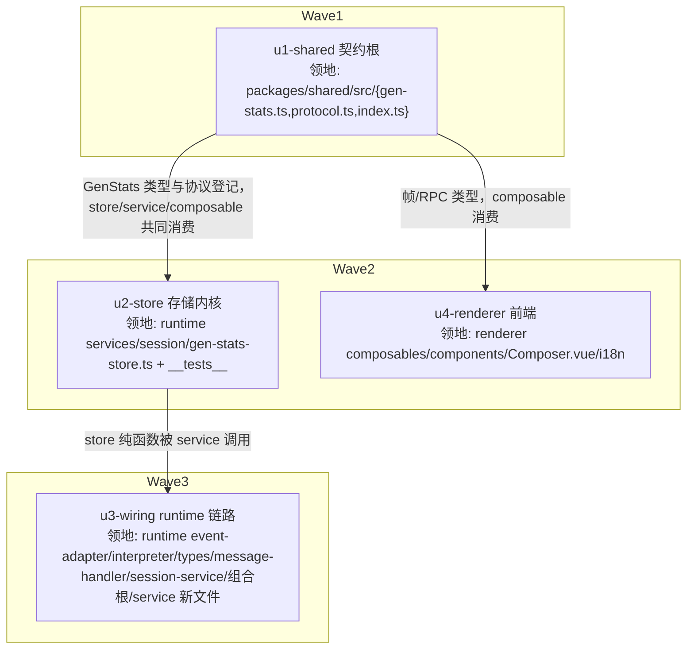

# composer-gen-stats 实施计划

基线: 0e6d264e4 | 来源设计: docs/design/composer-gen-stats.md | 日期: 2026-02-09

> 审查证据：docs/design/composer-gen-stats.review.md 第 6 轮复审「设计就绪（0 must-fix）」
> （收敛轨迹 R1:3MF+7S → R2:2MF+1S → R3:1MF+3S → R4:1MF+2S → R5:2MF → R6:0MF，全部 suggestion 当轮修复）。

## 0 章节映射（subagent task 坐标唯一来源）

| 内容 | 设计文档实际位置 |
|------|------------------|
| 背景/目标 | §1（G1-G4 目标表 + Scope） |
| 终态/机制 | §3.1 终态 + §3.3 D1-D8 决策 + §3.4 接口/数据模型 + §3.5 错误规格 |
| 验收场景表 | §4 场景 1-6 |
| 下一层拆分 | §5（P1-P4 阶段 + 文件改动地图 + 待验证检查点） |
| 待验证检查点 | §5 末「待验证检查点」4 条（D2 探针 / model 字段真实性 / cache 上报覆盖面 / get_state 对齐） |

## 1 目标快照（逐字摘录设计 §1，禁止改写）

- **G1 可见**：composer 底栏常驻显示当前速度（t/s）与缓存命中率（%），位于上下文容量左侧
- **G2 可解释**：hover 触发器出详情浮层——「本次 vs 今日均值」+ 计算口径说明
- **G3 实时**：每次 turn 完成后指标即刷新；切换 session 立即显示**该 session 当前模型**的指标（不闪「—」）；重启后指标可恢复（不依赖新 turn）
- **G4 隔离与健壮**：持久化只落在 `<dataDir>/gen-stats/`（`getDataDir()` 动态推导，测试注入 `XYZ_AGENT_DATA_DIR` 后路径随之隔离）；`~/.pi/agent/` 零新增文件；文件损坏自愈

Out-of-scope（设计 §1）：streaming 实时滚动速度（方案 D，二期）；ContextCapacityPopover 浮层 D9 占位喂数；provider 套餐额度；TUI/pi-statusline。

## 2 单元列表

| Unit | 职责 | 领地（精确文件路径） | 依赖 | 隔离 | 验收条款 |
|------|------|----------------------|------|------|----------|
| **u1-shared**（u-foundation） | GenStats 类型 SSOT（GenStatsSpeed/CacheRatio/Frame，speed 与 cacheRatio 字段 null 语义）+ protocol.ts 登记（`session.stats_update` 帧进 ServerMessageType/ServerMessageMap；`session.getGenStats` 进 ClientToServerType/PayloadMap）+ index.ts export | `packages/shared/src/gen-stats.ts`（新） `packages/shared/src/protocol.ts` `packages/shared/src/index.ts` | — | plain | ① `pnpm --filter @xyz-agent/shared typecheck`（或等效 tsc）绿；② 新增 vitest：ServerMessageMap/PayloadMap 对新帧/新 RPC 有登记条目（防 payload 漂移，仿既有协议测试 pattern）；③ 类型字段与设计 §3.4 逐字一致（speed 4 字段、cacheRatio 2 字段均 `\|null`） |
| **u2-store** | gen-stats-store.ts 存储内核纯函数族：readDayRecords/writeDayRecords（tmp+rename 原子写）/aggregateSpeed（Σtokens÷Σduration×1000）/aggregateCacheRatio（Σread÷Σtotal）/gc 30d（本地时区日 key）/safeModelFileName（safeBase 截断 64 + hash8 后缀） | `packages/runtime/src/services/session/gen-stats-store.ts`（新） `packages/runtime/src/services/session/__tests__/gen-stats-store.test.ts`（新） | u1 | plain | ① vitest 绿（runtime 子包配置 + fs-guard 生效）；② 用例覆盖：聚合算法对已知样本断言加权平均（与 pi-statusline 口径一致）、bogus 50/100 阈值语义、GC 删过期日键、文件损坏读→空+不抛、`a b`/`a_b`/大小写/超长 id 文件名不碰撞；③ 全部写删目标 `mkdtempSync(join(tmpdir(),'xyz-gen-stats-'))` + env 注入，无真实数据目录触碰 |
| **u3-wiring** | runtime 链路接线：event-adapter `handleTurnEndPi` 字段补全（output/cacheRead/cacheWrite/input/model/provider）；types.ts turn-usage kind 扩展；event-interpreter turn-start 记 turnStartedAt + turn-usage 分支调 onGenStats；gen-stats-service.ts（recordSample 含 bogus guard 50/100 + sid→modelKey 映射三写一清 + snapshot(modelKey) model 恒回填 + sessionsOfModel）；session-message-handler getGenStats async case（get_state 优先降级链 + 扩展广播逐 sid 发帧）；session-service onSessionDestroyedHandlers 清映射 + state_changed 广播处重登记+推帧（固定帧序）；组合根装配 | `packages/runtime/src/services/session/gen-stats-service.ts`（新） `packages/runtime/src/services/session/types.ts` `packages/runtime/src/services/session/event-interpreter.ts` `packages/runtime/src/infra/pi/event-adapter.ts` `packages/runtime/src/transport/session-message-handler.ts` `packages/runtime/src/services/session/session-service.ts` 组合根装配文件（runtime `src/index.ts` 或 sessionService 装配处，实施时以实际为准，超出须停下上报） `packages/runtime/src/services/session/__tests__/gen-stats-service.test.ts`（新） | u2 | plain | ① vitest 绿：service 单测（recordSample bogus 丢弃/映射三写/清理、snapshot model 恒回填含无记录分支、sessionsOfModel）；interpreter 接线测试（turn-usage → onGenStats 回调携带扩展字段、无 turn-start → durationMs=null）；② 既有 runtime 测试套件不红（event-adapter/interpreter 既有用例回归）；③ D2 探针（⛔实施期门，主 agent 协跑 dev 环境）：真实含工具调用会话验证 1 turn=1 assistant message 配对 + turn 级 duration 数值偏差 <10%，不成立则停下上报（降级方案需回到设计变更） |
| **u4-renderer** | useGenStats composable（分区 `GenStatsFrame\|null` + 帧 handler model 校验丢弃 + getGenStats 恢复腿 in-flight 去重 + registerSessionCleanup，照 useContextUsage 五件套）；GenStatsTriggers.vue 双触发器（h-7 ghost button + HoverCard 浮层；速度/缓存独立判定 null→「—」；命中率 80/50 三档语义色；速度浮层 本次/今日/7天/30天，缓存浮层 本次/今日加权 + 命中/总量 + bar）；Composer.vue 挂 ContextCapacityPopover 前；i18n zh/en | `packages/renderer/src/composables/features/model/useGenStats.ts`（新） `packages/renderer/src/components/panel/GenStatsTriggers.vue`（新） `packages/renderer/src/components/panel/Composer.vue` `packages/renderer/src/i18n/locales/zh-CN/panel.ts` `packages/renderer/src/i18n/locales/en-US/panel.ts` `packages/renderer/src/__tests__/panel/gen-stats*.test.ts`（新） | u1 | plain | ① vitest 绿：composable 测试（帧写入分区/model 不匹配丢弃/恢复腿/cleanup）+ 组件测试（三视角：渲染断言含用户可见 DOM——两触发器存在/null 显「—」/语义色分档/浮层内容）；② 现有 Composer 相关测试不红；③ taste-lint/vue_rules_checker 过（`<template>`≤400 行、禁 any、无硬编码色）；④ i18n zh/en key 对齐（既有 panel-i18n 测试 pattern） |

并行度：W2 两个单元 ≤5 ✓。u3 领地含热点文件（event-adapter/interpreter/message-handler），但 W2/W3 无其他单元触碰，plain 足够；全计划无 worktree 单元（无实验性大改，领地互斥完备）。

## 3 DAG 图

## 4 测试策略

- **框架红线**：一律 vitest（配置在子包 vitest.config.ts，从子包目录运行）；禁 `node:test`/`tsx --test`；timer 用 fake timers；renderer 测试遵守三视角（构建者白盒 + 使用者黑盒 DOM 断言 + 观察者形态）
- **数据目录红线**：runtime 测试写删目标 = `mkdtempSync(join(tmpdir(), 'xyz-gen-stats-'))` + `XYZ_AGENT_DATA_DIR` env 注入；禁触 `getSessionsDir()` 等共享推导路径；禁绕过 fs-guard
- **增量（单元期内）**：
  - shared：`cd packages/shared && npx vitest run`（协议登记用例）
  - runtime：`cd packages/runtime && npx vitest run src/services/session/__tests__/gen-stats-store.test.ts src/services/session/__tests__/gen-stats-service.test.ts` + 既有 event-adapter/interpreter 相关用例回归
  - renderer：`cd packages/renderer && npx vitest run src/__tests__/panel/`（新增 + 既有 Composer 相关）
- **全量（收尾，主 agent 执行）**：三包 vitest 全量 + `pnpm run lint` + pre-commit 全链（含 taste-lint/vue_rules_checker）；§4 场景 1-6 真实 dev 环境验收（其中场景 3 机器比对、场景 5b 文件损坏注入）

## 5 合理偏差登记表

| Unit | 偏差 | 理由 | 登记时间 |
|------|------|------|----------|
| u2 | cacheRatio 分母不含 output（task 提示笔误） | 设计 §3.1 权威口径 `cacheRead÷(input+cacheRead+cacheWrite)`，dev 正确从设计 | 2026-02-09 |
| u2 | store 导出 bogus 阈值常量+纯谓词 | SSOT 在 store、丢弃判定在 u3，领地内可测 | 2026-02-09 |
| u2 | 测试落位 src/__tests__（非包根 __tests__） | tsconfig include:['src'] 覆盖 src/__tests__，编译期断言获机器强制力（负向对照证实） | 2026-02-09 |
| u3 | 写 2 挂接用投影专用 bus 视图后置 tap（session-service.ts） | session-state-projection.ts 不在领地；bus 边界拦截 ≡ 唯一生产点汇聚，帧序构造性保证 | 2026-02-09 |
| u3 | server.ts 经 OptionalServices.genStats 装配 | 计划「组合根装配处以实际为准」条款；importService 同款范式 | 2026-02-09 |
| u3 | test/event-interpreter-w3.test.ts fixture 补新字段 | 主 agent 指示；仅修 TS2322 不改断言 | 2026-02-09 |
| u3 | snapshot 返回 Omit<GenStatsFrame,'sessionId'> | 扩展广播逐 sid 帧体复用同模型快照，类型更精确 | 2026-02-09 |
| u3 | recordSample 映射写 1 无条件登记（含 bogus 全丢 turn） | 「当前模型归属」语义与写 2/写 3 一致，降级链②命中面更准 | 2026-02-09 |
| u3 | 速度样本附加 durationMs>0 防退化 | 0ms 分母对 current 恒产 null 无信息量 | 2026-02-09 |
| u3 | 扩展广播 no-op 抑制（双丢弃 turn 不推帧） | 快照值不变推帧零信息量 | 2026-02-09 |
| u4 | RPC 直调 command（未扩 api/domains/session.ts） | 领地外最小侵入；后续可补 domain 包装收敛惯例 | 2026-02-09 |
| u4 | 帧 model 双形态兼容（精确相等+复合后缀） | model 字段真实性待验证检查点的防御；跨区核对恒复合格式，恒走精确分支 | 2026-02-09 |
| u4 | 缓存浮层无绝对 token 行 | 协议仅携带百分比（D6 前端只拿结论） | 2026-02-09 |
| u4 | 触发器无 ⚡/◔ 图标 | 禁 Emoji 纪律，纯文字与既有触发器同构 | 2026-02-09 |
| u4 | 速度浮层 2×2 grid 布局 | 对齐 ContextCapacityPopover 浮层行形态 | 2026-02-09 |
| u4 | useGenStats 增第二参 modelIdRef? | D4 前端兜底必需，受控 prop 下发（审查 R 后回写设计 §3.4） | 2026-02-09 |
| 全局 | recency 守卫 seqAtIssue 跨实例语义错配 | 继承蓝本 useContextUsage 固有边界（非本次引入），登记为已知限制，后续统一任务修两 composable | 2026-02-09 |

## 6 状态表

| Unit | 状态 | 轮次 | 证据指针 |
|------|------|------|----------|
| u1-shared | committed | 1 | commit feat(shared) u1；vitest 232 绿 + tsc 0 + 负向对照断言生效 |
| u2-store | committed | 3（r1 基础设施空转/r2 挂死接替/r3 完成+watchdog 中断续聊 1 轮） | commit feat(runtime) u2；vitest 43 绿 + tsc 0；3 deviations 已核验属实（cacheRatio 分母不含 output 系设计 §3.1 权威口径） |
| u3-wiring | committed | 2（settled watchdog 中断续聊 1 轮 + tsc 提示 1 轮） | commit feat(runtime) u3；service 22 + store 回归 43 = 65 tests 绿 + tsc 0；4 deviations 已核验合理（server.ts 组合根按计划条款/event-interpreter-w3 fixture 按主 agent 指示/snapshot Omit 签名更精确/recordSample 无条件登记语义更准）；⛔ D2 探针待真实会话验证 |
| u4-renderer | committed | 2（watchdog 中断续聊 1 轮完成） | commit feat(renderer) u4；vitest 531 绿 + vue-tsc 0；4 deviations 已核验合理（RPC 直调 command 系领地外最小侵入/model 双形态兼容/浮层无绝对 token 行系协议口径/无图标系禁 Emoji 纪律） |

## 7 残留风险与变更历史

**残留风险**：
- Gate A 重验结论（2026-02-09）：lint 5 warnings 已清零（229cb6a5f），uncovered 4 项全认领；runtime 全量存在 1 个环境性预存失败（thinking-level-effective-e2e：本地 pi 模型清单缺 reasoning:false 模型，文件不在本变更区间，单文件复跑稳定复现）——非本功能引入，登记为环境依赖残留风险（上游测试建议加环境前置检查）；renderer 3 个 it.skip 同为区间外预存
- ~~D2 探针（u3 验收③）为 ⛔实施期门~~ **已被一致性审查静态判定关闭（2026-02-09）**：审查核实 runtime 'turn-start' 唯一产出点为 assistant message_start（pi turn_start ∈ NULL_EVENTS），锚点每轮重置 ⇒ duration 口径 = 末轮 LLM 请求时长，担心的膨胀不会发生；设计 D2 已回写实装口径。剩余实测项（turn_end.message.model 形态对齐、get_state model 形状）随日常使用观察，不阻塞验收
- get_state 对「从未发消息 session」的返回形态待实测（设计待验证检查点）；若返回空/异常，降级链④兜底全 null，功能不损但「默认模型 session」的恢复腿显示延迟到首采样
- provider cacheRead 上报覆盖面未知（zai/kimi/xiaomi-mimo 待实测）——影响「—」态出现频率，不影响正确性（2026-09-07 GS-1 回写补注：pi-ai 实装 cacheRead 必填 + api 层归一 0，非 cache 模型恒显 0% 为正确行为，覆盖面问题实际消解为「哪些模型 cacheRead 恒 0」）
- **恢复腿降级链①的 FAST_TIMEOUT 10s 降级延迟（2026-09-07 登记，adversarial-review-fixes GS-9 维持）**：pi 挂死（进程在但不响应）时，getGenStats RPC 的降级链① `getState` 走 `FAST_TIMEOUT_MS = 10_000`（`rpc-client.ts:136/:994-995`，`gen-stats-service.ts` 恢复腿注释）——最坏等待 10s 才降级到链②③。量级低：前端恢复腿不阻塞 UI（切入即渲染，reply 到达再刷新）+ in-flight 去重已限并发（同 sid 并发切入只发一次）；挂死态本就无新样本，10s 后全 null 帧语义正确。维持不改（更短超时会在 pi 高负载慢响应时误降级）。

**变更历史**：
- 2026-02-09 计划创建（来源设计经 6 轮对抗审查 0 must-fix）
