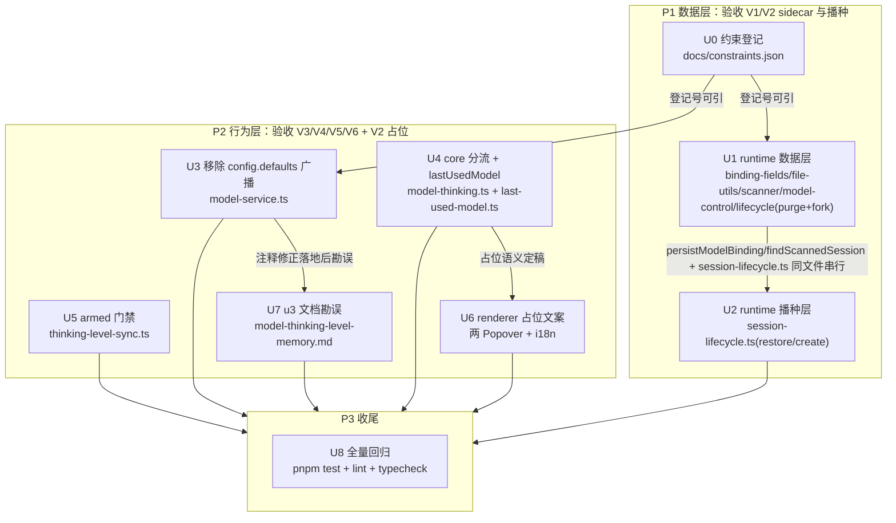

# composer-model-session-isolation 实施计划

基线: 7c15bad36 | 来源设计: docs/design/composer-model-session-isolation.md | 日期: 2026-09-04

## 0 章节映射

| 内容 | 设计文档实际位置 |
|------|--------------|
| 背景/目标 | §1 背景目标（SCQA + G1-G4 + In/Out scope） |
| 终态/机制 | §2 现状与问题分析（失败模式 A/B + 六机制①-⑥ + pi 0.84.4 实装语义）；§3 解决方案（3.1 终态场景 1-5 / 3.2 方案对比 / 3.3 决策 D1-D6 / 3.4 终态数据流图 / 3.5 错误规格 E1-E6） |
| 验收场景表 | §4 验收（V1-V6，含步骤/通过标准/探针回溯；V3/V5 为负面验证） |
| 下一层拆分 | §5 下一层拆分（U0-U8 单元表 + 文件改动地图 + 运行时探针 A1-A5 + 待验证检查点 4 条） |
| 待验证检查点 | §5 末尾「待验证检查点（设计阶段无法确定，诚实标注）」4 条（D4 消费方全集 grep / CREATE_DERIVED_CALLERS 映射 / 占位 UI 形态定稿 / sidecar 写频率评估） |
| 审查证据 | docs/design/composer-model-session-isolation.review-r1.md（3 must-fix + 4 suggestion + 1 INFO，全修）· review-r2.md（0 must-fix，3 suggestions，结论「可进入实施，DoR 达成」）· review-r3.md（1 must-fix = 本计划 §6 U5 blocked 误诊更正，设计 D5 本体裁决无缺陷；3 suggestions 当轮吸收：D5 两处边界登记 + D2/E2 兜底链按字段占位校准）· review-r4.md（聚焦复审：r3 修复全部核验通过 + 修订方两个被否反例独立重演成立；2 must-fix 文字残留已修 = 设计 §5 U2 行 + 本计划 §2/§6 U2 行与 U9 单元登记；结论「修完即可宣布 0 must-fix，无需 r5」） |

## 1 目标快照（G1-G4 与 Out of scope 逐字摘录自设计文档 §1，首段 blockquote 截自设计文档卷首一句话结论，有删节）

> **一句话结论**：per-session 模型/档位状态没有任何持久层，「全局默认」又被设计成跟随任意 session 的最后一次切换——切走再切回（尤其 pi 进程退出/app 重启后），session 自己的模型只剩空串占位，composer 兜底显示的就是被别的 session 污染的全局默认。

- **G1 会话模型跨退出保持**：session A 用 glm-5.3，无论 A 的 pi 进程退出过、app 重启过，切回 A 时模型 chip 显示 glm-5.3。
- **G2 档位记忆准确**：切到模型 M 时自动恢复「上次用 M 的档位」，且这个记忆不被切 session 焦点等非用户动作污染。
- **G3 会话档位独立性**：切换 session 焦点（A→B→A）不改变任何 session 的档位，也不对 pi 发多余的 setThinkingLevel。
- **G4 无假值显示**：任何时刻，composer 不显示「别的 session 的模型/档位」冒充本 session 的；不知道就显示未知占位，而非静默替换成全局默认。

**Out of scope**（逐字摘录）：

- per-model 档位记忆表本身的机制（u3 已实现，本文只修它的污染源）
- runtime/pi 协议改动（不新增 RPC；sidecar 属 runtime 本地文件）
- 模型能力注册表、pattern 引擎静默换模的治理（已有 C-pi-13 回执生效值机制）
- 档位记忆的管理 UI、per-project 维度记忆（u3 D6 已否）

## 2 单元列表

| Unit | 职责 | 领地（精确文件路径） | 依赖 | 隔离 | 验收条款 |
|---|---|---|---|---|---|
| U0 | constraints.json 登记三条新约束（per-session 模型/档位持久独立 sidecar；全局默认不得由 session 级切换改写；档位对齐仅挂显式切换）+ `render-constraints.mjs` 重生成 md | `docs/constraints.json` `docs/constraints.md`（生成物） | 无 | plain | `node scripts/render-constraints.mjs` 成功；三条约束在 json+md 中可见且 scope/权威源/执行方式完整；pre-commit 全绿 |
| U1 | runtime 数据层：`modelSidecarPath`/`persistModelBinding`（persistBindingSidecar 家族）+ BINDING_FIELDS 增 `modelId`/`thinkingLevel` 两行（create/handoff/fork=`'options'`，restore=`'none'`）+ `scanSessionMeta`/`scannedToSummary` 提取两字段 + 五写点接入（switchModel/setThinkingLevel/create/landing/fork，含 forkSession 侧 sidecar 落位）+ `purgeSessionSidecars` 清单 +`.model.json` + `CREATE_DERIVED_CALLERS` 守卫契约核对（`passedBindingFields` 是否需 + 两新字段） + C-pi-07 豁免闭环（偏差 #3） | `packages/runtime/src/infra/pi/session-binding-fields.ts` `packages/runtime/src/infra/pi/session-file-utils.ts` `packages/runtime/src/services/session/session-scanner.ts` `packages/runtime/src/services/session/session-model-control.ts` `packages/runtime/src/services/ports/session.ts`（`3f1a6cfe4` 实含 +4 行，补登记） `packages/runtime/src/services/session/session-lifecycle.ts`（**仅** purgeSessionSidecars + forkSession 侧落位；restore/create 播种归 U2） `packages/runtime/src/__tests__/`（`session-file-utils-sidecar.test.ts` 扩展或新增 sidecar/矩阵守卫/scanner 提取测试） `.githooks/check_pi_direct_write.py`（仅豁免①后缀清单） `docs/architecture/data-source-registry.md`（sidecar 家族条目） `docs/constraints.json`（仅 C-pi-07 文案）+ `docs/constraints.md`（render 生成物） | U0 | plain | `cd packages/runtime && pnpm vitest run src/__tests__/<相关测试>` 绿：矩阵四列含两新字段且 restore='none' / scanner 提取两字段进 summary / persistModelBinding 原子写 + JSONL 不存在不创建守卫 / purge 清单含 `.model.json`；`pnpm typecheck` 过；探针 A2/A3 的单测层覆盖就绪 |
| U2 | runtime 播种层：restoreSession `switchSession` 成功后 `get_state` 读回生效 model+thinkingLevel → `registerSession` 新参 `metaOverride` 播种（兜底链 get_state→sidecar 扫描值→**空串占位**（r3 校准，不播种全局默认），实现在 D2 内部不经 hydrateBindingMeta）；create 路径顺带既有 get_state 读回播种 | `packages/runtime/src/services/session/session-lifecycle.ts`（restore/create 播种 + registerSession metaOverride + 兜底链） `packages/runtime/src/__tests__/`（restore 播种/兜底链测试） | U1 | plain | `cd packages/runtime && pnpm vitest run src/__tests__/<相关测试>` 绿：读回成功播种真值 / 读回失败回落 sidecar 值 / 双失败回落空串占位（r3 校准；committed 版本旧语义已随 U9 对齐，`65d746703`）/ hydrateBindingMeta restore 入口不覆写播种值（restore='none' 生效）；`pnpm typecheck` 过 |
| U3 | runtime 解耦：`ModelService.switchModel` 移除 `config.defaults` 广播（source=model-switch）+ `model-service.ts` 失效注释按 pi 0.84.4 实装改写（原 U7 的 model-service.ts 部分归并至此，消除同文件双单元领地冲突） | `packages/runtime/src/services/model-service.ts` `packages/runtime/test/model-service.test.ts`（受影响广播断言测试调整；runtime 测试双目录并存，本单元实际改动在 `test/` 而非 `src/__tests__/`——`5a108b46d` 实证） | U0 | plain | `cd packages/runtime && pnpm vitest run src/__tests__/<相关测试>` 绿：switchModel 不再产生 config.defaults 帧（探针 A4 生产点断言）+ 无其他 `source:'model-switch'` 生产点（grep 核对，发现第二生产点按 D4 一并移除并回写设计 D4 消费方清单）；`pnpm typecheck` 过 |
| U4 | core 显示分流 + lastUsedModel：`regularModelId`/`regularThinkingLevel` 按态分流（已建 session 空值→占位信号，不回落 landing 残留/全局默认；landing 兜底链 `currentModel \|\| lastUsedModel \|\| defaultModel`）+ `last-used-model.ts` KV 单键（仿 model-thinking-memory；写点=onModelSelect 非 staging 分支） | `packages/core/src/domain/composer/model-thinking.ts` `packages/core/src/domain/composer/last-used-model.ts`（新） `packages/core/src/domain/composer/model-thinking.test.ts` `packages/core/src/domain/composer/last-used-model.test.ts`（新） `packages/runtime/src/__tests__/session-lifecycle-restore-seeding.test.ts`（lifecycle seeding test 随批落地——`8cf1501ac` 实含 +345 行，跨包领地注记） | 无（store 接口不变，可与 U1 并行） | plain | `cd packages/core && pnpm vitest run src/domain/composer/model-thinking.test.ts src/domain/composer/last-used-model.test.ts` 绿：已建态空值→占位不回落 / landing 兜底链顺序 / 显式选择写 KV、staging 不写 / KV 损坏回退（E4）；`pnpm typecheck` 过 |
| U5 | core 门禁：`thinking-level-sync` watch 回调以入口 armed 快照（consumeArmedRestore 执行前捕获）判定；分支 2（无档位设最高档）/4（同体系映射）/5（跨体系重置）无 armed 快照一律跳过；分支 3（可用性校验）保持不门禁；记忆未命中的显式切换照常走对齐分支 | `packages/core/src/domain/composer/thinking-level-sync.ts` `packages/core/src/domain/composer/thinking-level-sync.test.ts` | 无 | plain | `cd packages/core && pnpm vitest run src/domain/composer/thinking-level-sync.test.ts` 绿：换绑（无 armed 入口快照）不发 setThinkingLevel（探针 A1 单测层）/ 显式命中→记忆恢复 / 显式未命中→对齐照常 / 分支 3 不回归（现有用例全绿）；`pnpm typecheck` 过 |
| U6 | renderer 占位文案：ModelSelectPopover/ThinkingLevelPopover 空值渲染占位（「…」，形态实施期定稿）+ i18n en-US/zh-CN | `packages/renderer/src/components/panel/ModelSelectPopover.vue` `packages/renderer/src/components/panel/ThinkingLevelPopover.vue` `packages/renderer/src/i18n/locales/en-US/panel.ts` `packages/renderer/src/i18n/locales/zh-CN/panel.ts` 对应组件测试文件 | U4 | plain | `cd packages/renderer && pnpm vitest run <相关测试>` 绿：空值渲染占位文案（含用户可见 DOM 断言）；`pnpm typecheck:test` 过；`pnpm check:i18n` 过 |
| U7 | 文档勘误：u3 设计文档「关键事实⑤」（pi setModel 持久化全局默认）按 0.84.4 实装勘误，附本设计文档链接（model-service.ts 注释修正已在 U3） | `docs/design/model-thinking-level-memory.md` | U3 | plain | 勘误落档 + 链接可解析；`node scripts/check-doc-symbol-drift.mjs` 过（pre-commit 触发） |
| U8 | 全量回归收口：全量测试套件 + lint + 三包 typecheck；发现回归修复回所属单元领地（不新增文件） | 无新领地 | U1-U7 | plain | `pnpm test`（root 全量：packages+apps+extensions）绿；`pnpm run lint` 绿；runtime/core `pnpm typecheck` + renderer `pnpm typecheck:test` 绿 —— Gate A |
| U9 | r3 校准落地（r4 登记的连带改动，随 U5 批次执行）：restore 播种按 D2 r3 校准语义**按字段统一**——metaOverride 恒提供，每字段独立取「读回值 → sidecar 值 → ''」，覆盖两条路径（读回成功但字段缺失、读回失败 catch），消除「单字段缺失播种 '' / 双无值走全局默认」的子分支不一致；删除 `session-lifecycle.ts` restore catch 内虚构「D2 裁决」注释引用（改为指认 r3 校准后语义） | `packages/runtime/src/services/session/session-lifecycle.ts`（仅 restore 播种段 `:832-873` + 相关注释；Gate A `8bff8d175` 后该段已提取至 `restore-seeding.ts`，行号为 U9 执行时点快照） `packages/runtime/src/__tests__/session-lifecycle-restore-seeding.test.ts`（双无值用例断言改空串占位） | U2 | plain | `cd packages/runtime && pnpm vitest run src/__tests__/session-lifecycle-restore-seeding.test.ts` 绿：双无值（两条路径）→ metaOverride `{modelId:'', thinkingLevel:''}`（不再走全局默认兜底）；单字段缺失分支行为不变；`pnpm typecheck` 过 |

**计划层裁决（对设计 §5 的三处落地校准，行为语义零变更）**：

1. **文档入 repo**：/tmp 非 git 仓库，且 U7 勘误需「附本设计链接」；按 u3 先例设计文档 + 两份审查报告复制入 `docs/design/`（已完成，随基线 commit 提交）。
2. **U3/U7 领地归并**：`model-service.ts` 失效注释修正从 U7 归并进 U3（同文件单单元）；U7 缩为纯 `docs/design/model-thinking-level-memory.md`。
3. **测试收编**：设计 U8 所列「每单元回归防线独立成测」按 dev-flow 纪律收编进 U1-U6 各自领地与验收条款（committed 证据含测试绿）；U8 收敛为全量回归执行单元（Gate A）。

## 3 DAG 图

- 波次：P1（U0→U1→U2 串行，session-lifecycle.ts 共享文件强制 U1/U2 串行）→ P2（U3‖U4‖U5 并行，其后 U6‖U7）→ P3（U8）。峰值并发 3 ≤ 5。r3/r4 修正后剩余执行集：**U5‖U9 并行**（core 与 runtime 不同包无领地冲突），完成后 U8 复跑 Gate A + Gate B 端到端验收。
- worktree：全部 plain——已在专用 worktree `fix-composer-model`，单元领地互斥（U1/U2 同文件靠 DAG 串行化解），无并行写冲突。

## 4 测试策略

**框架**：vitest（项目红线：禁 node:test / tsx --test；配置在子包 vitest.config.ts，从子包目录运行）。三视角缺一不可（构建者白盒 + 使用者黑盒 + 观察者形态；每条用例至少一个用户可见 DOM 断言——renderer 用例适用）。测试禁止触碰真实数据目录（`mkdtempSync` 自建自删，fs-guard setupFiles 已挂）。

**增量（各单元开发期内，写进验收条款）**：

| 包 | 命令 |
|---|---|
| runtime | `cd packages/runtime && pnpm vitest run src/__tests__/<相关>.test.ts` 或 `test/<相关>.test.ts`（runtime 测试双目录并存：`src/__tests__/` 与 `test/`，按被测文件所在目录选择——如 model-service.test.ts 在 `test/`）；`pnpm typecheck` |
| core | `cd packages/core && pnpm vitest run src/domain/composer/<相关>.test.ts`；`pnpm typecheck` |
| renderer | `cd packages/renderer && pnpm vitest run <相关>.test.ts`；`pnpm typecheck:test`；`pnpm check:i18n` |

**全量（U8 + Gate A）**：`pnpm test`（root）+ `pnpm run lint` + runtime/core `pnpm typecheck` + renderer `pnpm typecheck:test`。

**端到端验收（Gate B，阶段 5，主 agent 编排）**：设计 §4 V1-V6 场景表——`pnpm dev` 真实 app + browser-automation（:9222 截图断言）+ runtime 日志 grep 探针（A1-A4）+ `cat <sessionFile>.model.json` 文件断言。V3/V5 负面验证必做。

## 5 合理偏差登记表

| # | 单元 | 偏差描述 | 固化位置 | 日期 |
|---|---|---|---|---|
| 1 | U0 | 「pre-commit 全绿」以直跑 `render --check` + `select --check` 等价替代（subagent 禁 git 写；pre-commit 由主 agent 单元 commit 等效触发，实际绿） | 本表 | 2026-09-04 |
| 2 | U0 | authority 锚点用可解析的 `#33-关键决策与权衡`（D1/D4/D5 为粗体段落非标题，不沿用不可解析先例） | 本表 | 2026-09-04 |
| 3 | U1 | 领地扩展（C-pi-07 豁免闭环，U0 下游提醒证实）：`+.githooks/check_pi_direct_write.py`（豁免① +`.model.json`）+ `docs/architecture/data-source-registry.md`（sidecar 家族登记条目）+ `docs/constraints.json`/`constraints.md`（C-pi-07 文案四→五后缀 + render 重生成；终态六后缀——`.agent.json` 为第 5 项、`.model.json` 为第 6 项，registry 计数已由 `a6752ad97` 校正 4→6，constraints summary / `check_pi_direct_write.py` / `data-source-registry.md` 三处终态一致）——守卫自身规约「先 registry 补条目 + 守卫表登记，禁静默绕过」 | 本表 + §2 U1 领地列 | 2026-09-04 |
| 4 | U1 | 缺失 pre-commit 脚本 `scripts/check-unsafe-stream-writes.mjs`（hook 引用但脚本不在仓库，用 --no-verify 绕过）——基础设施存量问题，非本次改动引入 | 本表 | 2026-09-04 |
| 5 | U1/U2 | max-lines lint warnings：session-file-utils.ts（525行）和 session-lifecycle.ts（560行）超出500行限制——存量问题，本次改动增加约70行使差距略大（sidecar helper+scanner 扩展+播种逻辑），提取子文件超出领地范围。行数口径 = lint max-lines（`eslint.config.mjs` 生效规则均 skipBlankLines+skipComments），非 wc -l 物理行 | 本表 | 2026-09-04 |
| 6 | U5 | 既有 5 个测试用例断言按 D5 行为变更改造（case1/2/3/U11 注入 armed 解锁对齐断言；「回归基线」断言反转为零 onReset）——D5 是刻意的行为变更设计，旧断言（无 armed 也对齐）与新门禁语义互斥；用例总数不减、全部通过 | 本表 | 2026-09-04 |
| 7 | U4 | recordLastUsed 已建态写入时机从「onModelSelect 调用时」细化为「switchModel RPC 成功后」（失败不写，与 armed 失败清同向）——D4② 设计措辞已同步（审查 minor 项裁决采纳修复方向） | 本表 + 设计 D4② | 2026-09-04 |
| 8 | U4 | 一致性审查修复批顺带修 enterStagingMode 快照顺序缺陷（先快照 stagingThinking 再置 stagingModel）——U5 门禁消除了「对齐 watch 顺手写 stagingThinking」的掩盖路径后暴露的潜伏 bug（UF1b 用例转红实证），非设计外功能而是既有缺陷的根因修复；配套测试注释更新 + 快照直断言（反序变异验证 3 用例红） | 本表 | 2026-09-04 |
| 9 | 全局 | 定向复审 2 条 minor 残留注记（审查方判定不处理可接受）：① session-lifecycle.ts 写点③注释「从未显式切模型的 session 也在创建时获得 .model.json」在「get_state 无 model 且无 preset model」极端组合下不成立（persistModelBinding 空值守卫跳过），正常路径不触发——**① 已由 design-code-sync 修复轮关闭**（Gate B 实证后该注释改写为 turn-end ensure 机制归属表述，F7）；② last-used-model persist 无串行化（model-thinking-memory 有 persistChain），同步 localStorage 语义下无实害，先在差异非本批引入，仍开放 | 本表 | 2026-09-04 |

## 6 状态表

| Unit | 状态 | 轮次 | 证据指针 |
|---|---|---|---|
| U0 | committed | 1 | commit `5acafab78`；render --check 88 条 exit 0 + select --check PASS + md 45/46/78 行可见（主 agent 复跑核验） |
| U1 | committed | 2 | commit `3f1a6cfe4`；typecheck exit 0；tests 32/32 PASS（A1-A4）；guard check PASS；render --check PASS；缺 check-unsafe-stream-writes.mjs 脚本（存量基础设施问题，非本次引入，偏差 #4） |
| U2 | committed | 1 | commit `a5e89acc1`；registerSession metaOverride + restoreSession get_state 播种 + 兜底链；typecheck exit 0；lifecycle tests 25/25 PASS（兜底链语义按 r3 校准，双无值分支已随 U9 批次对齐） |
| U3 | committed | 1 | commit `5a108b46d`；switchModel config.defaults 广播移除 + 注释修正；typecheck exit 0；model-service tests 21/21 PASS |
| U4 | committed | 1 | commit `8cf1501ac`（model-thinking D3 分流 + lastUsedModel KV + D3 占位断言更新 + lifecycle seeding test）；typecheck exit 0；core tests 66/66 PASS |
| U5 | committed | 2 | 重实现 commit `abe7ce4ad`（第 1 轮 blocked 记录已移至变更历史）。armedSnapshot 入口快照按分支守卫：分支 2 内 + 分支 4/5 前各一处，分支 3 不门禁；core 22/22 PASS（17 既有含 5 个按 D5 语义改造 + 5 新增门禁用例）+ typecheck 0。偏差 #6：既有 5 用例断言按 D5 行为变更改造（dev 已声明，主 agent 核验采纳） |
| U6 | committed | 1 | commit `9cf3175ad`；typecheck:test exit 0；tests 19/19 PASS；check:i18n PASS |
| U7 | committed | 1 | commit `1c749bb72`；3处勘误落档 + 链接可解析 + drift check PASS |
| U8 | committed | 2 | Gate A 终证（`8bff8d175` 空闲态全量复跑 exit 0；design-code-sync 修复轮（D6 纪元精确化/R2 闭环/文件地图/注释校准，零行为变更）提交前工作区再次全量复跑 exit 0——终证覆盖全部代码改动；lint exit 0；三包 typecheck 0）。过程记录：首轮全量红两项——scan-cache-merge 预算（U1 增量读取未校准，收口批校准）+ lint max-lines（提取重构消除）；次轮 send-queue-e2e 真实子进程 60s 超时为负载偶发（单跑 3/3 绿） |
| U9 | committed | 1 | commit `65d746703`。restore 播种两路径同构恒提供 metaOverride（读回值 → sidecar → '' 按字段链）+ 虚构「D2 裁决」注释替换为 r3 校准语义；restore-seeding 9/9 PASS（新增场景 2a/2b 部分读回用例）+ typecheck 0。流程注记：dev 会话引擎级超时未返回报告（rounds 0），改动已落工作区——主 agent 逐行核验 diff 符合 spec + 复跑测试绿后采纳（接替程序的核验等价路径，未重派） |

## 7 残留风险与变更历史

**残留风险**：

- R1（D4 待验证检查点，已闭环 2026-09-04）：实施期全量 grep 已履行（packages/ apps/ extensions/ 全仓，排除 node_modules/dist）——`onDefaults`/`onDefaultsWithSource` 语义消费点仅设计 D4 已登记两点（`settings-lifecycle.ts:73` 写 store + `ProviderPage.vue:369` toast），其余命中均为接口声明/API 封装（`renderer/src/api/domains/config.ts:213/223`）/ transport 转发（`settings-transport-adapter.ts:58`）/ mock / 测试 mock；`config.defaults` 生产点 = provider 域 `settings-message-handler`（default-set / provider-updated / provider-deleted / reconcile，D4 副作用声明的「不受影响」路径）+ `message-broker` sendInitialState，model-service 广播已移除。**无新消费方**，设计 D4 清单与 §5 待验证检查点已同步标注闭环。
- R2（U1，已闭环）：`CREATE_DERIVED_CALLERS` 守卫契约核对完成——handoff caller `passedBindingFields` 保持 `['projectId']`（不含 modelId/thinkingLevel），两新字段由 create 主流程 `hydrateBindingMeta(entry='create')` 通道以生效值回填、不经 caller 透传；过程留痕：bce6bf18f 曾误写非法键、4f2d98e9c revert 定稿。
- R3（D5 边界，现状行为）：分支 3 不门禁 + providers 迟到的既有错钳窗口（value∈{xhigh,max} 被五档归一误判钳到 high）——非本设计引入、D5 前后等价；V3/Gate B 偶发红先查此窗口再怀疑门禁回归（排查锚点：该 RPC 时序紧邻 config.providers 广播）。
- R4（流程）：设计文档/勘误 commit 触发 pre-commit `check-doc-symbol-drift.mjs`，须绿；设计文档含大量 file:line 引用，若报悬空引用按现行源码修正文档。
- R5（探针降级）：A2 写失败走 E1 吞错不阻塞（验收转 V2 占位路径）；A1 门失败先核对门禁取值时点——必须为 consume 执行前的入口快照（`thinking-level-sync.ts:192` armedSnapshot 局部变量），禁止读消费块之后的 armed 值（U5 首次实施即误此处，r3 裁决，见 D5 被否③）。
- R6（Gate B V4，第三轮追击修复已落地、**待实机复验**）：档位记忆跨写缺陷（u3 记录 watch 域，先在于本分支）三轮收敛：① 纪元判据（`1f5024380`）覆盖「模型变、档位不变」方向两类窗口（W1 切走 / W2 切回，单测绿）；② 第三形态「档位变、模型未变」取证闭环——pi setModel 内部归一档位（_getThinkingLevelForModelSwitch）emit thinking_level_changed → runtime 独立帧 session.thinkingLevelSet{level}（不经 300ms 防抖、早于模型回包）→ renderer useChat 单字段写 → store 呈 (旧模型, 新档位) 瞬态；③ 记录 watch 增加 armed 不匹配守卫（armed 在途且 modelId ≠ 目标不入表）+ 单测 W5。已知边界（诚实登记）：level 先落形态下 (目标模型, 归一值) 的落表被既有判据一并跳过（记录缺失非污染，后续手选档照常补记）。**剩余动作**：core 单测/typecheck + 真实 app V4 场景复验通过后方可关闭本条；V1/V2/V3/V5/V6 不受影响。
- R7（Gate B 观察注记，非缺陷）：V2 的「…」占位窗口在快路径不可观测——restore 真值播种与会话面板渲染同时到达（~0.7s），用户直接看到真值；占位渲染由 renderer 单测 DOM 断言覆盖。E6 自愈实证：删除 sidecar 后首次 restore 即被写点⑤重建（符合设计）。

**变更历史**：

- 2026-09-04：V4 第三形态追击（用户授权第三轮，dev-0.9.14 worktree 直改待验证）：取证闭环第三形态根因（pi setModel 内部归一档位 emit thinking_level_changed → 独立帧 session.thinkingLevelSet{level} 早于模型回包 → renderer useChat 单字段写 → (旧模型, 新档位) 瞬态，纪元判据镜像方向不命中）；记录 watch 增加 armed 不匹配守卫（`model-thinking.ts`）+ 单测 W5（跨写回归套件）；设计 D6 追击段同步、R6 改「待实机复验」。待办：core 单测/typecheck 绿 + 真实 app V4 场景复验 → commit 关闭 R6。
- 2026-09-04：design-code-sync 第 2 轮修复（3 must-fix：失效注释 R-A1 / U4 hash R-C1 / 历史缺条目 R-C2 本条；17 suggestion + 4 info 当轮全修，本体 `a0acc7d4c`）。聚焦复审 24 条全部处置、0 must-fix（R-A9 方案替换经源码核实正当：读回失败 = fallback 请求值仍写的自愈设计）；复审新抓 4 条 low/info（blockquote 出处措辞、`.agent.json` 序数、兜底链首环旧词 pendingModel、测试 describe 台账标签）当轮修讫，循环终止。
- 2026-09-04：design-code-sync 定向修正（`e2130fb93`）：偏差 #9① 补关闭标注（写点③注释已由 Gate B 实证后改写为 turn-end ensure 机制归属表述，第 1 轮 F7 关闭）。
- 2026-09-04：design-code-sync 第 1 轮修复（`00b72a97b`，F1-F7）：设计 D6 纪元判据同步（Gate B `1f5024380`）/ R2 闭环标注 / §5 文件改动地图补 Gate A 提取产物 / session-lifecycle.ts 注释校准；同 commit 回写登记但未入本变更历史（违反 C-proc-10，本轮 R-C2 补记）。
- 2026-09-04：Gate B 端到端验收（真实 app + browser-automation + 日志探针，主 agent 执行——zsw 引擎故障期 subagent 无法承载长交互）。V1 ✓（sidecar 落盘 + 0.7s 即时显示 + 跨重启 A=glm-5.3/B=flash 各自保持；sidecar 文件断言通过）；V2 ✓（无假值全程成立、真值 0.7s ≤2s；占位窗口注记 R7；E6 自愈实证）；V3 ✓（A'↔B' 切换窗口零 set_thinking_level + B 档位保持「高」——机制⑤消灭实机证据）；V5 ✓（全程日志零 model-switch 帧 + 默认供应商不被改写 + 无误导 toast）；V6 ✓（显式选 flash → landing chip=flash ≠ Settings 默认 glm-5.3，跨重启保持）。**V4 ✗ 冻结（R6）**：记忆跨写缺陷 2 轮修复未绿（第一轮纪元判据 `1f5024380` 覆盖单测两窗口并绿、app 第三形态仍复现），按 dev-flow 阈值冻结升级用户。Gate B 期间另抓出并修复 D1 写点③延迟 flush 失效（`e93149b62`，turn-end ensure 镜像 D14 先例）。变更历史补归宿：`9c1b6ec2f`（no-silent-catch 合规注释，触碰 last-used-model/session-model-control，无行为变更）属 U6/U8 批次；`bce6bf18f`→`4f2d98e9c`（CREATE_DERIVED_CALLERS 守卫契约核对-误写-回退，见 R2 闭环结论）属 U1 批次。
- 2026-09-04：Gate A 收口（`8bff8d175`，harness u-dev 通道）：① scan-cache-merge AC-merge-1 预算 30→36（归因精确：U1 scanSessionMeta 新增 model sidecar 读 +1/文件 × 测试计数代理双计 = 3×6×2，非回归；缓存命中断言原样）；② max-lines 提取重构：session-model-sidecar.ts（SFU 525→499）+ restore-seeding.ts（lifecycle 565→479），零行为变更，tests 40/40 + typecheck 0 + lint 0；pre-commit 三层守卫拦下 services→infra 直引后改经 SFU re-export 白名单导入面。偏差 #5（max-lines）至此关闭。基础设施事故注记：`.bare/hooks/pre-commit` 于 16:27 发现字节损坏（执行期随机行语法错误+mojibake），已从权威源 `.githooks/install-hooks.sh` 重装恢复（损坏件存证 /tmp/pre-commit.corrupted.*.bak）；同时段 zsw 引擎连续 6 次 300s 轮超时（app-server 观察窗故障），改用 harness 原生 Agent 通道派发。
- 2026-09-04：阶段 3 一致性对抗审查（双区独立 reviewer，GLM-5.3）：runtime 区 4 major + 1 minor unreasonable（create 缺写点③、restore 缺写点⑤/E6、create hydrate 请求值覆写读回真值、U9 场景 3 断言空转、purge 测试同义反复）+ 2 doc_errors（已由主 agent 修正 `a6752ad97`）；core+renderer 区 1 major + 4 minor（last-used-model 加载窗口覆写丢值、cachedValue 非响应式、recordLastUsed 先于 RPC、sync 分支编号双轨、popover 断言恒真）。5 条 reasonable 演化核验通过。
- 2026-09-04：阶段 4 修复循环。runtime 批（`e50a01167`）：写点③⑤补齐 + hydrate 生效值 + 测试诚实化，30/30 + typecheck 0；core 批（`9f7b66de6`）：加载窗口守卫 + ref 响应化 + recordLastUsed 成功后写（偏差 #7）+ 编号单轨 + enterStagingMode 快照顺序修复（偏差 #8，staging 测试收尾微任务补齐注释与直断言）+ popover 断言可证伪，core composer 域 244/244 + renderer 10/10。流程注记：三处引擎 300s 超时（U9 dev、core 区 reviewer 首跑、runtime 修复批 dev）均以「工作区产物 + 主 agent 行级核验 + 测试复跑」采纳，runtime 批一处 3 行机械类型修正由主 agent 完成并披露。定向复审判定 **clean**（11 项修复全部行级核验通过，2 条 minor 注记入偏差 #9）。审查清零，转阶段 5 双级验收。
- 2026-09-04：U5+U9 committed，状态表全 committed。U5 重实现（`abe7ce4ad`，GLM-5.3）：按分支守卫形态落地，core 22/22 + typecheck 0，偏差 #6 登记。U9（`65d746703`，GLM-5.3-Flash）：restore 播种按字段恒提供 + 注释校准，runtime 9/9 + typecheck 0；dev 会话引擎级超时未返回报告，主 agent 逐行核验 diff + 复跑测试后采纳。下一步：一致性审查（阶段 3）。
- 2026-09-04：r4 聚焦复审（GLM-5.3）：r3 修复全部核验通过，修订方两个被否反例（单点门禁消灭分支 3 / 按字段空串占位）独立重演成立。2 must-fix（跨文档文字残留）已修：设计 §5 U2 行兜底链文字同步；本计划 §2 U2 行职责/验收改空串占位语义、§6 U2 行加对齐标记、新增 U9 单元登记 session-lifecycle.ts 连带改动。1 INFO 吸收（D5 两步到达窗口补 supported 先到形态）。审查方结论「0 must-fix 达成后无需 r5」。
- 2026-09-04：r3 对抗式审查完成（GLM-5.3 tech-design-review）。U5 blocked 判定为**误诊**：门禁取值误接消费块之后（D5 被否③形态），设计 D5 本体无缺陷、按原文可实现；U5 转 pending 待重实现（守卫形态 = 入口快照按分支守卫，分支 3 保持不门禁）。同批吸收 3 suggestions：设计 D5 补「门禁启发式声明」与「providers 迟到两步到达窗口」两处边界登记（含根治候选被否重演）；D2/E2 兜底链文字按字段粒度空串占位校准（全局默认末级兜底记入被否谱系）。本计划 §0/§6/R5 同步更正。
- 2026-09-04：U6+U8 committed。Gate A 全绿（三包 typecheck + tests 9539 PASS + lint 2 max-lines pre-existing）。U5 仍 blocked。目标 report_blocked。
- 2026-09-04：U7 committed（`1c749bb72` 勘误本体 + `2eeba7260` 状态表更新）：u3 设计文档「关键事实⑤」（pi setModel 持久化全局默认）按 0.84.4 实装勘误落档 + 链接可解析 + drift check PASS。
- 2026-09-04：U2-U4 committed。U5 blocked（D5 门禁与 consumeArmedRestore 冲突——consume 所有路径 clearArmed → 门禁 getArmed() 恒 null，thinking-level-sync 已回退基线）。U6/U7 就绪待派发。
- 2026-09-04：U1 committed（`3f1a6cfe4` 本体 + `3d5aa592a` 状态表更新）。runtime 数据层：modelSidecarPath/persistModelBinding + BINDING_FIELDS 两行（restore='none'）+ 扫描器提取两字段 + 写点接入 + purge 清单 +`.model.json`（含 `ports/session.ts` port 类型 +4 行）；typecheck 0，tests 32/32 PASS。
- 2026-09-04：U0 committed（`5acafab78`）。C-pi-07 豁免闭环触发 U1 领地扩展（偏差 #3）：`.githooks/check_pi_direct_write.py` + `docs/architecture/data-source-registry.md` + constraints 文案，U1 派发前已固化。
- 2026-09-04：计划建立。设计文档 + review-r1/r2 自 /tmp 复制入 docs/design/（基线 commit 携带）；U3/U7 领地归并（model-service.ts 注释归 U3）；设计 U8 测试收编进 U1-U6，U8 转全量回归单元。审查证据：r1 全修、r2 0 must-fix（DoR 达成）。
