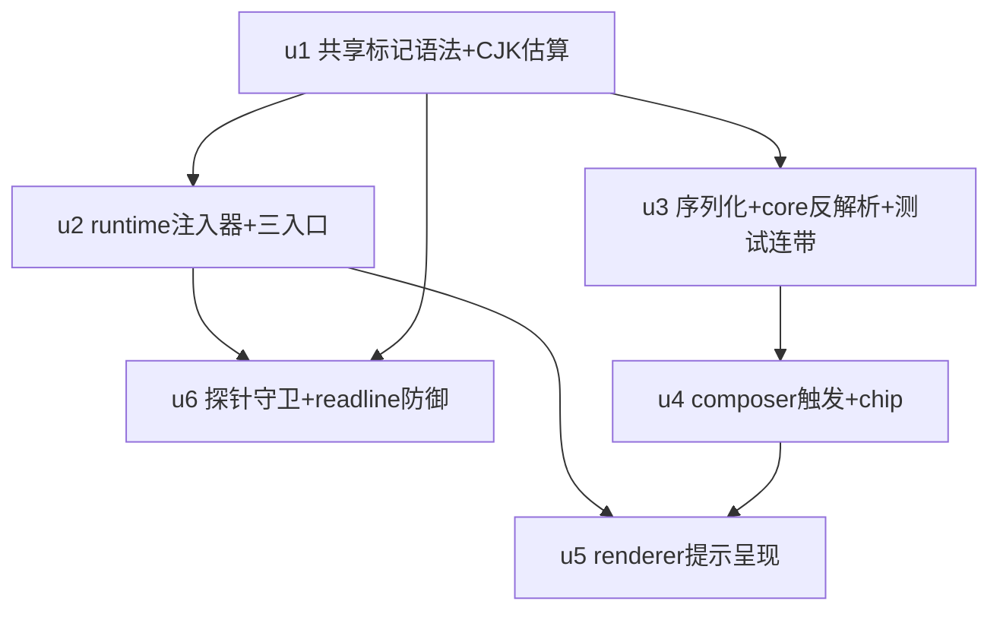

# Composer 多 Skill 注入 实施计划

基线: 5e7322415 | 来源设计: docs/design/composer-multi-skill-injection.md | 日期: 2026-09-06

## 0 章节映射

| 内容 | 设计文档实际位置 |
|------|------------------|
| 背景/目标 | §1 背景目标（G1-G5 + In/Out-of-scope） |
| 终态/机制 | §3 解决方案（3.1 终态场景 / 3.3 决策 D1-D10 / 3.4 错误规格表 / 3.5 影响面登记①-⑤） |
| 验收场景表 | §4 验收（场景 1-9，含 2b/3b，真实 pi + 真实模型） |
| 下一层拆分 | §5 下一层拆分（P1-P4 四阶段 + 文件改动地图 + 待验证检查点 2-6） |
| 待验证检查点 | §5 待验证检查点（1 已设计期核实关闭；2-6 开放） |

审查证据：`docs/design/composer-multi-skill-injection.review.md`（主审，R2 后 0 must-fix）+ `docs/design/composer-multi-skill-injection.impact-review.md`（影响面审，R2 后 0 must-fix）。

## 1 目标快照（逐字摘录设计 §1）

从使用者体验倒推，用户要能做到：

1. **G1 任意位置触发**：在输入框任意位置（空格或 tab 后——行首保持命令浮层语义不变，见 D1 仲裁）键入 `/` 唤起 skill 选择浮层（对齐 `#`/`$`/`@` 的体验），选中后 chip 插在光标处。
2. **G2 多 skill 生效**：一条消息里混排任意多个 skill chip 与正文，每个 skill 的全文都真正注入给模型——不是只有第一个生效。
3. **G3 注入可控**：多 skill 全文叠加不会把会话拖入「每轮请求必报错」的持续失败态；超预算时有安全的降级路径，且降级后 skill 仍能被模型使用（自主 read）。
4. **G4 会话可恢复显示**：发送后关闭重开 session，skill chip 仍显示为 chip（不退化为大段 XML 文本）。
5. **G5 零 pi 侵入**：不改 pi 源码、不 fork；pi 原生 `/skill:` 行首语义对「手打文本」保持不变。

Out-of-scope（逐字）：skill 目录管理/发现/设置 UI；pi 原生 `/skill:` 行首语义的任何变更；system prompt 中 `<available_skills>` 自动触发路径；prompt token 计量的精确化（用字符估算，见 D6）；行首 `/` 命令浮层的现有行为。

## 2 单元列表

| Unit | 职责 | 领地（精确文件路径） | 依赖 | 隔离 | 验收条款 |
|------|------|----------------------|------|------|----------|
| u1 | 共享标记语法与 CJK 估算模块（foundation）：`<xyz-skill/>` 标记正则/构建/解析、`<xyz-skills>` 降级块构建/解析、CJK 感知估算函数（`CJK×1.0 + 非CJK÷4`）与阈值常量 0.8（D6，单一处便于调参）；shared index.ts 显式导出 | `packages/shared/src/skill-marker.ts`（新增）、`packages/shared/src/index.ts`（导出登记）、`packages/shared/src/__tests__/skill-marker.test.ts`（新增） | 无 | plain | vitest 绿：标记序列化/解析往返无损（含 location 缺省、属性值含引号转义边界）、降级块构建/解析往返、CJK 估算边界（纯中文/纯英文/混合/空串/代码密集样本） |
| u2 | runtime 注入器与三入口挂载：`skill-injector.ts` 新增（标记解析、get_commands 权威映射、import pi stripFrontmatter 展开、预检 fail-safe、降级块生成、失效/残缺透传+提示广播契约）；`message-dispatcher.ts` 三入口（sendPrompt/steerMessage/followUpMessage）挂载在 BeforeSend hook 之后、client.prompt 之前（D9）；提示广播类型登记（范式同既有 `session.forkNotice`） | `packages/runtime/src/services/session/skill-injector.ts`（新增）、`packages/runtime/src/services/session/message-dispatcher.ts`、`packages/shared/src/protocol.ts`（**仅限** ServerMessageMapBase 新增提示广播消息类型与 payload——修订于变更历史 R2）、`packages/runtime/src/services/session/__tests__/skill-injector.test.ts`（新增）、`packages/runtime/src/services/session/__tests__/message-dispatcher.test.ts`（新增） | u1 | plain | vitest 绿：单标记/多标记展开格式与 pi 模板逐字一致（golden 断言）、超阈值降级块形态、contextWindow 获取失败 fail-safe 降级、name 无映射透传+提示、hook 破坏标记透传+提示；dispatcher 三入口各恰好调用注入器一次（结构化幂等）；protocol 新类型 payload 含 sessionId + clientUuid + 降级原因/失效 skill 名（u5 呈现面消费契约） |
| u3 | 序列化变更与 core 反解析升级（含全仓测试连带）：`segments.ts` skill 分支改产 `<xyz-skill/>`（D3）；`apply-entry-convert.ts` `parseSkillBlock` 升级两形态（标记+block）全局反解析并修复前置正文丢失缺陷（D7，三链路 SSOT）；`apply-entry-equivalence` 守卫扩展「标记消息」两链路等价；锁定旧 `/skill:` 形态的全部既有测试更新 | `packages/shared/src/segments.ts`、`packages/core/src/domain/chat/apply-entry-convert.ts`、`packages/shared/src/__tests__/segments.test.ts`、`packages/core/src/domain/chat/__tests__/apply-entry-equivalence.test.ts`、`packages/core/src/domain/chat/__tests__/apply-entry-fold-equivalence.test.ts`（若锁旧格式）、`packages/core/src/domain/chat/__tests__/apply-entry.test.ts`（若锁旧格式）、`packages/core/src/domain/chat/__tests__/store.test.ts`（若锁旧格式）、`packages/renderer/src/__tests__/panel/command-popover-landing.test.ts`、`packages/renderer/src/__tests__/panel/composer-slash-injection.test.ts`、`packages/renderer/src/__tests__/panel/turn-skill-badge.test.ts`、`packages/renderer/src/__tests__/composables/useCommandPopoverTrigger.*.test.ts`（测试文件均仅更新锁旧格式的断言，不新增功能） | u1 | plain | vitest 绿（shared+core+renderer 三包）：segmentsToText skill 分支产标记；反解析两形态均还原 skill segment 且 block 前后正文保留（正文保留断言专防现状缺陷回归）；存量 pi 原生格式（block 前置+args 在后）派生 `[skill, args-text]` 等价不变；等价性守卫含标记消息 |
| u4 | composer 触发与 chip：`input-dom.ts` 新增 skill 触发正则 `/[^\S\n]\/(\S*)$/` + query 合法性过滤（`[a-z0-9-]{1,64}` 非法即关闭）；`contenteditable.ts` 触发状态机 skill 分路 + chip 抑制解除（限 skill 浮层）；`chip-commands.ts` `insertSkillChip`（光标处、多个共存、已选禁选数据面）；`CommandPopover.vue` skill-only variant；`useCommandPopoverTrigger.ts` skill 触发路由；`Composer.vue` 转发；landing 态数据源 `useProjectSkills`/`useGlobalSkills`（检查点 4） | `packages/dom-core/src/composer/input/input-dom.ts`、`packages/dom-core/src/composer/input/contenteditable.ts`、`packages/dom-core/src/composer/input/chip-commands.ts`、`packages/renderer/src/components/panel/CommandPopover.vue`、`packages/renderer/src/composables/panel/useCommandPopoverTrigger.ts`、`packages/renderer/src/components/panel/Composer.vue`、`packages/dom-core/src/composer/input/__tests__/`（新增 skill 触发/chip 测试）、`packages/renderer/src/__tests__/panel/composer-skill-trigger.test.ts`（新增） | u3 | plain | vitest 绿：空格/tab/全角空格/NBSP 后 `/` 触发 skill-only 浮层；行首 `/` 仍命令浮层（回归）；`/usr` 输入到第二个 `/` 浮层关闭；chip 光标插入多个共存；`#`/`$`/`@` 无变化（回归）；已选 skill 禁选 |
| u5 | renderer 提示呈现：降级 badge 提示（文案区分「预算超限」vs「窗口信息获取失败」两原因）+ skill 失效 toast/消息内联提示，复用 `useToast` 机制；消费 u2 广播契约 | `packages/renderer/src/components/panel/`（badge 提示呈现，具体挂点实施时定位——设计 §3.5-⑤/文件改动地图已声明）、`packages/renderer/src/composables/`（提示消费 composable）、对应新增测试文件；若需 shared 广播事件类型登记则限 `packages/shared/src/skill-marker.ts`（提示 payload 类型，与 u1 同文件扩展需 u5 在 u1 合并后进行，禁止改 u2 领地） | u2、u4 | plain | vitest 绿：降级两文案可区分呈现（场景 2③/2b②）；失效 toast + 内联提示呈现（场景 3②）；纯文本消息无提示（负面） |
| u6 | 守卫与防御：`check-pi-semantics.mjs` 新探针（真实 pi RPC `/skill:` 展开 vs xyz-agent 展开器 golden diff）；`rpc-client.ts` readline → LF-only 读取器（D10，pi `rpc/jsonl.js` 同款） | `scripts/check-pi-semantics.mjs`、`packages/runtime/src/infra/pi/rpc-client.ts`、`packages/runtime/src/infra/pi/__tests__/`（新增 LF-only 读取器构造帧测试：U+2028/2029 不拆帧 + 旧实现复现拆帧对照组） | u1、u2 | plain | vitest 绿（读取器构造帧）；探针脚本实跑全绿 + 篡改展开器格式一处变红（场景 8，验收期主 agent 执行） |

## 3 DAG 图

波次：W1=[u1] → W2=[u2, u3] → W3=[u4, u6] → W4=[u5]。
并行度 ≤2/波（全局约束 ≤3）；领地互斥已核对（u2 碰 runtime、u3 碰 shared/core/renderer 既有测试、无交集；u4 与 u6 无交集）。

## 4 测试策略

- 框架：vitest（项目红线：禁 node:test；配置在子包 vitest.config.ts，**从子包目录运行**）
- 增量（单元开发期）：`cd packages/<pkg> && pnpm vitest run <相关测试文件>`；单元完成门槛 = 本单元领地测试文件全绿 + 受影响包全量 vitest 绿
- 全量（收尾，阶段 5 前必跑）：`pnpm run test`（根，已含 --no-bail）
- lint：`pnpm run lint`（收尾）；extensions/ 无改动，extensions 三连不适用
- 测试禁区：禁止触碰真实数据目录 `~/.xyz-agent`；写删目标必须 `mkdtempSync(join(tmpdir(), ...))` 自建自删（runtime 包有 fs-guard setupFiles 强制）
- 验收场景（§4 的 11 个）属阶段 5 Gate B，不在单元开发期执行；场景 2⑤（CJK 校准数据回填）与场景 8（探针实跑）在阶段 5 由主 agent 执行

## 5 合理偏差登记表

（阶段 3 双区一致性审查收敛后登记；设计文档措辞已按 doc_sync 建议同步修订）

| # | 偏差 | 理由 | 文档同步 |
|---|------|------|----------|
| R1 | 注入器新增第五类失效 reason `mapping_unavailable`：get_commands RPC 整体失败时全部标记透传+提示，不走降级 | 设计错误规格表盲区；降级块 location 数据源缺失，透传+提示对齐 D8 禁静默 | 设计 §3.4 已补行 |
| R2 | PS-22 探针落点从 scripts/check-pi-semantics.mjs 改为 runtime REAL_PI vitest 池 + pi-semantics.json 登记 | 登记 schema 强制 guard.test 指向 .test.ts；防漂移效果等价（审查中真实 pi 实跑逐字 diff 绿） | 设计 D5 守卫段/文件改动地图已同步，注明 CI skip 边界 |
| R3 | D6 预检从「预估展开后字符数」升级为「真实构建展开文本后估算」 | 消除展开开销估算误差；阈值公式与降级语义不变 | 无需（实现更精确，不违背 D6 声明） |
| R4 | 注入点置于 ensureActive/busy 预检之后 | 设计只约束 hook 后/prompt 前；被拒消息零注入 RPC 属合理优化（调用序测试锁定 hook→ensureActive→inject→prompt） | 无需 |
| R5 | contextWindow 无效值（非有限/≤0）并入 fail-safe 降级 | 设计 fail-safe 只提 RPC 错误；元数据异常同样按不可得处理，符合「宁可提早降级」 | 无需 |
| R6 | u5 提示形态统一为「消息内联提示行」（锚点 turn 后，双 variant）而非「chip 旁附着提示」 | badge 在 ui 包 UserBubble（领地外）；场景 2③/2b②/3② 断言全部满足且两文案互斥 | 设计场景 2③/P3/改动地图已同步 |
| R7 | SKILL_QUERY_PATTERN 用 `{0,64}`（设计写 `{1,64}`） | 空 query 合法是「刚敲 / 列全量」的必要语义，与触发正则 `\S*` 同源自洽；`{1,64}` 指 skill 名本体域 | 设计 D1 已补注 |

## 6 状态表

| Unit | 状态 | 轮次 | 证据指针 |
|------|------|------|----------|
| u1 | committed | 1 | 32/32 绿（主 agent 重跑一致）；commit 见 git log u1 |
| u2 | committed | 1 | 增量 27/27 绿（主 agent 重跑一致）；typecheck/守卫/lint 过；runtime 全量 2 存量失败=runtime 测试锁旧解析行为（u3 连带，补修中） |
| u3 | committed | 1 | segments 39 绿 + core apply-entry/equivalence/store 144 绿（主 agent 重跑一致）；三包全量见 subagent 证据；**runtime message-converter.test.ts 2 用例锁旧行为待补修（领地缺口，轮次+1）** |
| u4 | committed | 1 | dom-core 190 绿 + renderer 触发 10 绿（主 agent 重跑一致）；ui 555 绿；三包 typecheck 过 |
| u5 | committed | 1 | 9 用例绿 + renderer 全量 3752 绿 + typecheck/lint 过（主 agent 重跑一致）；u4 漏交测试文件补账 f1782203a |
| u6 | committed | 1 | LF framing 6/6 + 守卫 22 条绿（主 agent 重跑一致）；real-pi 探针抓出 u2 两缺陷（已修，见变更历史） |

## 7 残留风险与变更历史

- u5 提示呈现的具体组件挂点实施时定位（设计已声明「实施时定位」，非计划缺口）；u5 领地若需扩展必须先回报主 agent 审批 → **已关闭**：落 renderer 消息内联行（R6，见 §5 登记表），未扩领地
- u3 领地含 renderer 既有测试文件（仅断言更新）——与 u4 的领地边界：u4 禁改既有测试断言，只新增测试 → **已按此执行**
- 检查点 5（steer/followUp 的 sidecar 写入路径现状）→ **u2 实施期核实关闭**：steer/followUp 消息无 `<!--xyz:msg:-->` 标记（clientUuid 仅普通发送链路注入），其 sidecar 覆盖受限为已知边界；对应 notice 无 clientUuid 时 u5 降级为仅 toast（R6 关联，§5 登记表 + 代码注释）
- ~~待验证检查点 2/3/6（RPC 缓存、降级文案对齐、CJK 校准）分别落在 u2/u5/阶段 5~~ → **归属修正（审查 B-U2）与结论回写**：检查点 2 结论 = 实现采「无标记零 RPC；含 chip 消息每条两次往返（get_commands + get_session_stats）；无缓存」——仅 chip 消息发生往返、量级可接受，重审条件 = 用户感知发送延迟时评估缓存（结论回写自审查 A-U1）；检查点 3 归属修正为 u1/u2 领地（指引行 SSOT 在 skill-marker.ts，非 u5），主 agent 已核实关闭：pi `<available_skills>` 指引（skills.js formatSkillsForPrompt）为英文条件式「Use the read tool to load a skill's file when the task matches its description」+ 相对路径按 skill 目录解析指引；SKILL_FALLBACK_GUIDANCE「请使用 read 工具加载上述 skill 文件后再继续任务」核心动词语义对齐，指令式（必读）系用户显式插入意图的正确表达（照抄条件式反而弱化意图），降级块 location 为绝对路径使 pi 的相对路径解析指引不适用——**无需改动**；检查点 6 在阶段 5 场景 2⑤ 回填

### 变更历史

- 2026-09-06：初版（用户已豁免评审确认，直接基线）。
- 2026-09-06（W1 后）：u1 committed（32 测试绿 + shared 全量 258 绿 + typecheck/eslint 过）。u2 领地补 `packages/shared/src/protocol.ts`（仅限新增提示广播消息类型，范式 `session.forkNotice`）——u1 完成通知后主 agent 核实发现提示广播需契约登记，属计划缺口修订。u1 两条合理偏差登记：① 指引行无句号（取 D7 正文定稿，场景 2 示意图句号属排版）；② 降级块解析区间可选吞入紧随指引行（可选组，hook 删指引行时块仍可识别）。
- 2026-09-06（W3 后）：u6 PS-22 真实 pi 探针实证两处 u2 生产缺陷并打回修复（R1，28/28 + 探针绿）：① get_commands skill 项 name 恒带 `skill:` 前缀（pi agent-session.js:1996 实装），注入器映射与 block 插值改为剥前缀归一（设计未明说该形态，属设计盲区补齐）；② References 行 baseDir 恒用 `dirname(path)` 弃用 `sourceInfo.baseDir`——后者按 source 分链语义可变（.pi/skills 来源下为扫描根），与 pi 实装 `skill.baseDir=dirname(filePath)`（skills.js:236/:260）漂移。**设计 §5 检查点 1 的「sourceInfo 含 baseDir，D5 所需数据齐全」断言对 baseDir 字段不成立**——登记为设计文档待修项（阶段 3 doc_errors 预登记，设计文档 D4/D5 的 sourceInfo 表述与检查点 1 措辞需同步修正）。
- 2026-09-06（W3 收口）：u4 committed。领地扩展追认（均为契约/门禁强制，设计文件地图未覆盖的环节）：① ui ComposerInput.vue（skill-trigger 转发链契约点）+ dom-core types.ts（onSkillTrigger 回调契约）；② command-popover-open-fetch.ts（skill 浮层打开边沿同源拉 getCommands）；③ i18n locales ×2（已选文案键，禁硬编码规范）；④ 新增 command-popover-skill-candidates.ts / composer-focus-ring.ts（vue_rules_checker 300 行门禁强制拆分，Composer 存量 301 行已超限一并正面修复）。**检查点 4 关闭（结论=不保证一致）**：landing 数据源 name 取自目录名（skill-scanner.ts:75），panel 数据源取自 SKILL.md frontmatter name（pi get_commands）——不一致时 landing 选出的 chip 走 skill_missing 透传+提示（D8 安全网，非静默）；主 agent 判定可接受，登记为已知边界。u4 另登记：dom-core 测试放 input/ 同目录（该包无 __tests__/ 惯例）；skill 触发无光标时返回 null（保守侧，设计未规定）。
- 2026-09-06（W4）：u5 committed（`ce15b2267`；其两条行为偏差按审查 B-U1 补登于此与 §5 登记表 R6：① 无 clientUuid（steer/followUp）时降级类 notice 亦降级为 toast.info——无锚点不内联，再不 toast 即静默，取保守可用方向；② 提示为会话内存态不写 sidecar，刷新后消失为接受行为，subscribe reconcile 回放经签名幂等去重不重复呈现）。u4 漏交测试文件补账 `f1782203a`。状态表全 committed `4900846b1`。
- 2026-09-06（阶段 3 R1）：双区一致性审查（A 区 1U+2D+5R / B 区 3U+1D+2R；B-D1 与 A-D1 同源去重）。**W3 变更历史勘误（A-D2）**：前述「sourceInfo.baseDir 按 source 分链组装、.pi/skills 来源下为扫描根」归因不实——pi 实装 createSkillSourceInfo 各分支恒透传 dirname(filePath)，真正的可变来源是 resource-loader.js:514-518 的 extension 覆盖链（采用 extension metadata.baseDir）+ :612 兜底（无 baseDir 字段）；行为决策（恒用 dirname(path)）不变。修复批次：u2 注释归因勘误（含测试注释追补）、u4 测试场景编号勘误（自造「场景 6⑤⑥⑦」改决策号引用）、主 agent 修订设计文档五处与 impl-plan 登记表（A-U1/B-U1/B-U2 的登记缺口补齐）。剩余：检查点 6（CJK 校准）在阶段 5 场景 2⑤ 回填。
