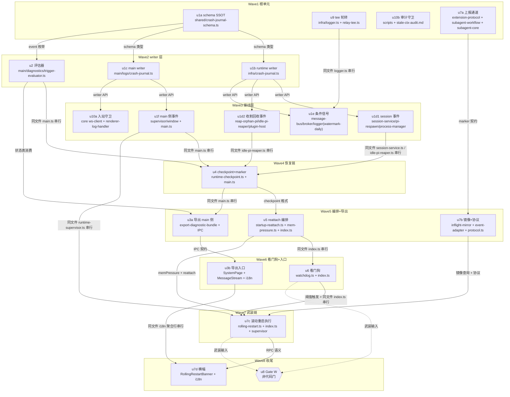

# 崩溃取证闭环与看门狗（E 组）实施计划

基线: 3aa211936 | 来源设计: docs/design/crash-forensics-and-watchdog.md（v8） | 日期: 2026-09-11

对抗审查证据：tech-design 双审循环 7 轮收敛，R7 主审 0 must-fix / 影响面审 0 must-fix，双报告显式判定「设计就绪」（终轮 suggestion + INFO 已全部清偿，收敛记录见设计文档附录 C v8，随 commit 3aa211936 提交）。

## 0 章节映射

| 内容 | 设计文档实际位置 |
|------|------------------|
| 背景/目标 | 开篇 SCQA + §1 背景目标（G-A/G-B/G-C/G-D，§1.2）+ In/Out-of-scope（§1.2 末） |
| 终态/机制 | §3.1 终态（场景一/二/三 + 失败路径）· §3.3 关键决策 D1-D9（D1 台账写入点矩阵 :126-141 · D2 评估器 · D3 checkpoint 五契约 · D4 看门狗 · D5 滚动重启执行链 · D6 诊断导出 · D7 tee 轮转 · D8 入站守卫 · D9 supersession/守卫）· §3.4 探针表 P-A1~A7 |
| 验收场景表 | §4 验收（A1-A8 + A3b/A3c，场景/步骤/通过标准三列，:250-265） |
| 下一层拆分 | §5 下一层拆分（u1-u10 三批次 + 文件改动地图 + env 旋钮 + 清理声明 + checkpoint 五契约 + 待验证检查点 + 约束登记义务 + 文档同步义务，:267-290） |
| 待验证检查点 | §5「待验证检查点」（退出码 86 跨平台 / 三类意外孤儿 reap 判据 / reattach 并发峰值 / memPressure 跨平台 API / 收割等待上界）+ §3.4 探针表「实施期门」列 |
| 触发条件清单 SSOT | 附录 A（20 条） |
| 版本与审查记录 | 附录 C（v1-v8） |

所有 dev task 的坐标以本表为准；task 内引用设计段落时用「§3.3 D<n>」形式。

## 1 目标快照（逐字摘录设计 §1.2）

- **G-A 崩溃归因一键可达**：任何一次崩溃后，用户（或接报障的开发者）导出一个诊断包，里面直接回答「哪层、哪个 session、为什么、影响了谁、最近趋势」——不再人工翻五处日志。
- **G-B 自愈可观测、触发条件有人算**：每次自愈动作（respawn / reload / 回收 / 重启 / 滚动重启）都在台账里可数；两份设计文档登记的全部重审触发条件有一个纯函数评估器周期性/按需计算，越线即出声（摘要行 + 诊断包内状态表）。
- **G-C 内存压力走计划内路径、runtime 死后自动恢复**：水位临界先降级再优雅滚动重启（relay 在途任务推迟但有界可升级）；runtime 崩溃/滚动重启后新 runtime 按 checkpoint 自动恢复崩溃前的活跃 session（不再等用户逐个触碰）。
- **G-D 批次补课清偿**：pi tee 单文件 size 上限（198MB 实证问题收口）、renderer 入站 parse 防御纵深、截断反转的 supersession 裁决、stale-ctx 审计覆盖的机器守卫。

**Out-of-scope（设计 §1.2 显式裁决，实施不得扩入）**：E3/E4 架构级增量（崩溃分类差异化 respawn、在途 turn 一键重发、草稿持久化、面板级错误边界、getAppMetrics 联动）；base64 剥离；runtime 多进程隔离；联网上报/崩溃遥测后端。

## 2 单元列表

命名规则：设计 §5 的 u1-u10 为种子；因「单个 dev subagent ≤5 文件」约束拆分为子字母（偏差登记 #1-#3）。领地均为本次已核实存在的真实路径（核实日 2026-09-11）。

| Unit | 职责 | 领地（精确文件路径；「新」=新建） | 依赖 | 隔离 | 验收条款（可机械核验） |
|------|------|----------------------------------|------|------|------------------------|
| u1a | 台账 schema SSOT（foundation）：layer/event/reason 枚举 + 字段集 + writer 接口类型 | `packages/shared/src/crash-journal-schema.ts`（新）+ `packages/shared/src/__tests__/crash-journal-schema.test.ts`（新）+ `packages/shared/src/index.ts`（导出行） | — | plain | shared vitest 绿：event 枚举 21 值 = 设计 §3.3 D1 schema（:116）逐一断言；字段全可空；JSON 往返不丢字段 |
| u1b | runtime 台账 writer：10MB×3 段级联轮转 + append API + 风暴限流复用 | `packages/runtime/src/infra/crash-journal.ts`（新）+ `packages/runtime/src/infra/__tests__/crash-journal.test.ts`（新） | u1a | plain | runtime vitest 绿：写满 10MB 触发 `.jsonl`→`.jsonl.1`→`.jsonl.2` 级联、末 3 段保留；写目标仅 tmpdir（fs-guard 合规）；append 原子性（单行 JSONL） |
| u1c | main 台账 writer 双胞胎 | `apps/electron/main/logs/crash-journal.ts`（新）+ `apps/electron/main/logs/__tests__/crash-journal.test.ts`（新） | u1a | plain | main 池 vitest 绿：同 u1b 轮转行为；与 runtime writer 共享 u1a 类型不复制定义 |
| u1d1 | session 生命周期事件接线：pi crash / auto-respawn 四态 / deleted / pi 计划内终止（杀链发起处） | `packages/runtime/src/services/session/session-service.ts`（onSessionExit 链 + removeSessionEntry :130 汇聚点）+ `packages/runtime/src/services/session/pi-respawn.ts`（四态决策点）+ `packages/runtime/src/infra/pi/process-manager.ts`（destroySession/destroyAll 杀链发起处，与杀链决策日志同点双写） | u1a,u1b | plain | runtime vitest 绿：①抑制语义下（destroySession 先删 Map）deleted/shutdown 事件仍产生（exit handler 静默路径不经过的挂点断言）；②异常退出 crash 事件含 detailDigest；③计划内 SIGTERM 记 shutdown 不记 crash（#3/#16 归因保护） |
| u1d2 | 收割/回收/worker 事件接线：reaped / reclaimed / plugin-worker crash | `packages/runtime/src/services/reap-orphan-pi.ts`（杀链命中处）+ `packages/runtime/src/services/session/idle-pi-reaper.ts`（reclaimManagedSession 摘除步）+ `packages/runtime/src/services/plugin-service/plugin-host-process.ts`（worker 退出计数器） | u1a,u1b | plain | runtime vitest 绿：三挂点各一条事件断言（reaped 含 pid/argv 判据摘要；reclaimed 含 idleMs/lastViewedAt） |
| u1e | 条件信号事件接线：frame-truncated / registry-miss / watermark-daily | `packages/runtime/src/services/message-bus/message-bus.ts`（guardOutboundPushFrame 告警档 + miss 分支）+ `packages/runtime/src/transport/message-broker.ts`（reply 超限分支）+ `packages/runtime/src/infra/logger.ts`（既有 5min 水位定时器处聚合 watermark-daily：自然日窗口 min/max/avg + coverage 起止戳） | u1a,u1b,u9 | plain | runtime vitest 绿：8MB 告警帧→frame-truncated(reason=warn-tier)；注册表 miss→registry-miss；watermark-daily 单条/日、重启后 coverage 截断、40MB→trunc-tier |
| u2 | 触发条件评估器（纯函数）+ main 每日巡检 | `apps/electron/main/diagnostics/trigger-evaluator.ts`（新，无 electron import）+ `apps/electron/main/diagnostics/__tests__/trigger-evaluator.test.ts`（新）+ `apps/electron/main/main.ts`（whenReady 启动巡检定时器 1-2 行） | u1a | plain | main 池 vitest 绿：附录 A 20 条全状态表（计数类 8 条数事件 / 趋势类 2 条消费 watermark-daily 含 coverage<50% 降权 / #17 恒 no-data 标 Gate W / 用户反馈型 requires-user-report 标注）；#8 四子句含 defer-limit 占比且分子排除 reason=absent-report；读不到台账→no-data 非静默；越线→WARN 行 + trigger-review 事件 |
| u1f | main 侧事件接线：runtime 自身死亡四挂点 + renderer 事件 | `apps/electron/main/supervisor/runtime-supervisor.ts`（onRuntimeExit 判别式【非 before-quit 且 ≠86 且 stopping=false→crash】+ planned 86 行 + liveness 第四挂点 forceRestartForLiveness 同点双写 unresponsive）+ `apps/electron/main/window/window-factory.ts`（render-process-gone→reload/oom 事件）+ `apps/electron/main/window/recovery-policy.ts`（熔断转静态页事件）+ `apps/electron/main/main.ts`（before-quit 上下文 shutdown 行） | u1c | plain | main 池 vitest 绿：判别式真值表（stopping 早退分支不写 crash；86→shutdown；liveness 路径→unresponsive）；render-process-gone→reload 事件含 reason 分类 |
| u3a | 诊断导出 main 侧：zip 打包（台账+日志尾部+水位+版本+评估器状态表+DiagnosticReports 指引）+ IPC | `apps/electron/main/diagnostics/export-diagnostic-bundle.ts`（新）+ `apps/electron/main/diagnostics/diagnostics-export-ipc.ts`（新，log-retention-ipc.ts 先例）+ `apps/electron/preload/preload.ts` + `packages/shared/src/ipc-channels.ts` + `packages/shared/src/ipc-payloads.ts` + `apps/electron/main/main.ts`（注册行） | u2,u4 | plain | main 池 vitest 绿（打包逻辑纯函数部分：文件收集清单/zip 结构/失败路径返回具体 errno）；知情提示文案常量存在 |
| u3b | 诊断导出 renderer 入口：设置→系统分区 + 死态 UI 入口 | `packages/renderer/src/components/settings/system/SystemPage.vue`（新 Section 组件 + 挂载）+ `packages/renderer/src/api/domains/diagnostics.ts`（新）+ `packages/renderer/src/components/panel/MessageStream.vue`（死态块导出入口）+ i18n settings 命名文件 `packages/renderer/src/i18n/locales/{zh-CN,en-US}/settings.ts` | u3a | plain | renderer vitest 绿：入口组件渲染断言（用户可见 DOM）；导出按钮触发 IPC 调用断言；失败路径错误提示可见 |
| u4 | checkpoint 持续维护 + marker + main 删除属主 | `packages/runtime/src/services/session/runtime-checkpoint.ts`（新：原子写 tmp+rename + 五契约 + 残留隔离 rename 幂等【ENOENT=已隔离/EACCES=原地残留】）+ `packages/runtime/src/services/session/session-service.ts`（attach/detach/respawn 维护钩子）+ `packages/runtime/src/services/session/idle-pi-reaper.ts`（5min tick 搭车刷新 lastActivityAt/lastViewedAt）+ `apps/electron/main/main.ts`（marker 启动写【单实例锁后】/will-quit 清 + before-quit 专属 await 链成功段删 checkpoint） | u1d1,u1d2 | plain | runtime+main vitest 绿：原子写中途崩溃读旧版；解析失败→checkpoint-corrupt 事件+退 lazy；失败现场 checkpoint-failed-<ts> 保留 3 份新覆盖旧；隔离 rename 幂等（同 err 重放不重复记事件）；偏漏恢复口径注释与实现一致 |
| u5 | reattach 编排 + memPressure 即时查询 | `packages/runtime/src/services/startup-reattach.ts`（新：真补集过滤【occupancy/backgroundTasks/relayChildren/idleMs/lastViewedAt】+ 分批并发 2 + staleness guard + 高水位延迟即时查询）+ `packages/runtime/src/services/startup-background-init.ts`（收割 promise 暴露）+ `packages/runtime/src/infra/mem-pressure.ts`（新：os 级 swap/空闲内存，u7c 消费）+ `packages/runtime/src/index.ts`（WS listen 后独立并行挂编排） | u4 | plain | runtime vitest 绿：过滤公式逐条真值表（含快照布尔反向形态多恢复自收敛）；live 孤儿未收割完不 spawn；高水位延迟不依赖采样环历史（冷启动零数据可用）；reattach-skipped 事件逐 session |
| u6 | 看门狗采样环 + 两级阈值 + memory-relief 降级 | `packages/runtime/src/infra/watchdog.ts`（新：60s process.memoryUsage 环 + heap_size_limit 百分比阈值 + 连续 2 周期持续才 relief + renderer LRU WS 通知）+ `packages/runtime/src/index.ts`（接线）+ `packages/renderer/src/composables/useMemoryPressure.ts`（新，LRU 收紧消费） | u1b,u5 | plain | runtime vitest 绿（fake timers）：70%/85% 阈值判定；relief 持续性条件（单周期不触发）；memory-relief 事件落台账；降级反弹缓解（执行后未回落不重复执行）；renderer composable 消费断言 |
| u7a | 在途上报通道（extension/subagent-core 侧）：绝对计数 + 初始上报 + EnginePort 快照 | `packages/extension-protocol/src/extensions/`（新 marker 常量 + 上报 schema 文件）+ `extensions/universal/subagent-workflow/src/`（聚合上报出口：生命周期事件推送 + 初始上报 count=0【extension 加载完成时点】+ select 失败折叠重试）+ `packages/subagent-core/src/execution/engine/port.ts`（`inFlightSnapshot?` 可选成员 :153 EnginePort）+ `packages/subagent-core/src/execution/engine/engines/zcode/zcode-engine.ts`（实现快照）+ `packages/subagent-core/src/execution/engine/`（core→壳事件出口，core 闭包红线：core 不 import pi SDK） | — | plain | extensions 三连绿（typecheck/lint/test）+ subagent-core vitest 绿：绝对计数非增量；初始上报时点=加载完成；出口不进 agent_settled await 链；zcode 空闲常驻≠在途（activeSessions 空判定）；pi 引擎不实现 undefined 缺省 |
| u7b | runtime 在途镜像 + marker 路由 + 协议面 | `packages/runtime/src/services/session/inflight-mirror.ts`（新：per-session 镜像 + 五 spawn 形态预置 0 + 生命周期对账重置 + errs 判别【已注入且从未收到上报】）+ `packages/runtime/src/infra/pi/event-adapter.ts`（marker 路由分支，不广播前端）+ `packages/shared/src/protocol.ts`（rollingRestart.status RPC + deferred/forced 事件类型） | u7a | plain | runtime vitest 绿：五形态预置 0 真值表；对账重置（crash/respawn/reattach/删除→0）；errs 判别不误伤常态 session；镜像条目与 session 生命周期同删 |
| u7c | 滚动重启执行链 | `packages/runtime/src/services/session/rolling-restart.ts`（新：推迟判定【pi 谓词镜像 ∪ zcode inFlightSnapshot ∪ relay-registry】/30min 上限/双维硬升级 92%+memPressure/T-30s 二次预告/状态只读 RPC/专用退出码 86/deferred 事件字段语义【null+absent-report】）+ `packages/runtime/src/index.ts`（完整 shutdown 序逐行继承 + 步骤打点 + 引擎 dispose【server.stop 后 closeLogger 前】+ 取消推迟定时器首步）+ `apps/electron/main/supervisor/restart-policy.ts`（recordPlanned 分支）+ `apps/electron/main/supervisor/runtime-supervisor.ts`（86→立即重启零退避零计数） | u7b,u6,u5 | plain | runtime+main vitest 绿：谓词推迟/硬升级/30min 到点 reason=defer-limit 三形态；Path A 保活（settled 无在途）不推迟（!hasIdleTimer）；deferred 计数在场=数字/errs=null+absent-report；planned 边不进 counting 状态机；步骤打点序列完整 |
| u7d | renderer 滚动重启横幅 | `packages/renderer/src/components/ui/RollingRestartBanner.vue`（新，复用 CrashRecoveredBar 视觉形态）+ `packages/renderer/src/composables/useRollingRestartStatus.ts`（新：重连/刷新拉取恢复）+ `packages/renderer/src/components/shell/AppShell.vue`（挂载 + 窗口级互斥）+ `packages/renderer/src/i18n/locales/{zh-CN,en-US}/rollingRestart.ts`（新命名空间）+ `packages/renderer/src/i18n/locales/{zh-CN.ts,en-US.ts}`（聚合行） | u7c,u3b | plain | renderer vitest 绿：预告/推迟中/红牌/已恢复转绿 30s 清除四态渲染断言；断连重连后拉取恢复横幅；重启完成窗口内重连横幅消失不重现 |
| u8 | **Gate W（非代码门）**：水位复审 + 武装裁决（Gate W 复审产物落设计文档变更历史；`XYZ_RUNTIME_WATCHDOG_ARMED` 默认 off） | 无代码领地 | u6,u7c 交付 | — | 交付后挂起，输入 = V6 soak 水位数据 + 评估器 watermark-daily 趋势；裁决记录落档即关闭。**不阻塞 u6/u7 代码交付**（设计 §3.2 方案 B：代码完整交付、武装挂门） |
| u9 | tee size 轮转（logger.ts 裁决推翻登记） | `packages/runtime/src/infra/logger.ts`（createPiSessionLog size 轮转 + `pi-` 前缀不变量 + 「不轮转」注释修订）+ `packages/runtime/src/infra/relay/relay-tee.ts`（同款轮转） | — | plain | runtime vitest 绿：50MB 上限触发旋段、`pi-` 前缀保持（cleanExpiredLogs 白名单可清）、正常退出尾部行完整（flush 走新流） |
| u10a | 入站 parse 守卫 + 终止阀 | `packages/core/src/transport/ws-client.ts`（80MB 守卫 + 同 session 连续 3 次终止阀 + 切走切回重试订阅）+ `packages/core/src/transport/__tests__/`（新用例）+ `apps/electron/main/logs/renderer-log-handler.ts`（结构化标记→main.jsonl inbound-frame-dropped）+ renderer 静态错误提示（复用 useCrashRecoveryNotice 邻域，实施时定位最小挂点） | u1c | plain | core+main vitest 绿：超界帧丢弃不崩；第 3 次后该 session 静态提示、其余 session 不连坐；切走切回重试一次；inbound-frame-dropped 事件 ×4 |
| u10b | stale-ctx 审计覆盖守卫 + O3-C supersession | `scripts/check-stale-ctx-audit-coverage.mjs`（新：解析 stale-ctx-audit.md §3 全仓普查清单 vs extensions/{taiji,universal,shared}/ 三组实际包列表，合并行斜杠拆分）+ `extensions/shared/ext-guards/docs/stale-ctx-audit.md`（O3-C 行 superseded-by 注记；注意权威表在该文件 §3）+ `package.json`（scripts 接线） | — | plain | 脚本行为验证：三组任一新建空包→红；普查表全含→绿；O3-C 注记 grep 可见 |

## 3 DAG 图

关键路径：u1a→u1b→u1d2→u4→u5→u6→u7c→u7d（深度 8）。**任务本质串行声明**：恢复链→武装链是设计 §5 的批次结构本体（checkpoint 先于 reattach、reattach 先于滚动重启恢复语义），且 index.ts / session-service.ts / idle-pi-reaper.ts / main.ts 为热点共享文件按「同文件共改=串行边」处理；契约先行压扁不适用（非纯平移/重构，是新写代码）。并行宽度由 W1 四根单元保障（≥3 达标）。

## 4 测试策略

**框架红线**（项目 AGENTS.md）：vitest 唯一（禁 node:test / tsx --test）；配置在子包 vitest.config.ts，从子包目录运行；timer 用例用 fake timers；runtime 测试禁止触碰真实数据目录（global-setup fail-fast + fs-guard 切面，写删目标必须 `mkdtempSync(join(tmpdir(),...))` 自建自删）；main 池只测纯逻辑（electron 依赖模块不进 vitest）。

**增量（单元开发期）**：

| 包 | 命令（从仓库根） |
|----|------------------|
| packages/shared | `cd packages/shared && pnpm vitest run <file>` |
| packages/runtime | `cd packages/runtime && pnpm vitest run <file>` |
| packages/core | `cd packages/core && pnpm vitest run <file>` |
| packages/subagent-core | `cd packages/subagent-core && pnpm vitest run <file>` |
| apps/electron main | `cd apps/electron/main && npx vitest run <file>` |
| packages/renderer | `cd packages/renderer && pnpm vitest run <file>` |
| extensions（u7a） | `pnpm extensions:typecheck && pnpm extensions:lint && cd extensions/universal/subagent-workflow && pnpm test` |
| 类型检查 | 对应包 `pnpm typecheck`（renderer 为 vue-tsc） |

**全量（阶段 5 Gate A，项目收尾场景）**：`pnpm test`（根 script：packages+apps+extensions 全池 --no-bail）+ `pnpm lint` + extensions 三连 + `bash scripts/validate-runtime-bundle.sh`（u1b/u1c/u1e/u9 动过 runtime infra 打包面，bundle 深度验证必跑）。

**门禁对应**：Gate A = 全量命令族全绿；Gate B = 设计 §4 场景表 A1-A8/A3b/A3c 在 dev app + 真实 pi 逐行执行（A4 依赖 `XYZ_RUNTIME_WATCHDOG_ARMED` / `XYZ_ROLLING_RESTART_DEFER_LIMIT_MS` 等 env 旋钮注入，不 mock 判定逻辑）。

## 5 合理偏差登记表

| # | 偏差 | 理由 | 状态 |
|---|------|------|------|
| 1 | 设计 u1 拆为 u1a/u1b/u1c/u1d1/u1d2/u1e 六个派发单元 | 全局 subagent 约束 ≤5 文件/单元；u1 原始领地 10+ 文件。单元语义与验收对应关系不变（A1/A8） | 初始登记 |
| 2 | 设计 u3 拆为 u3a（main+IPC+shared）/u3b（renderer 入口） | 跨进程三层（shared/preload/main/renderer）单单元超 5 文件 | 初始登记 |
| 3 | 设计 u7 拆为 u7a/u7b/u7c/u7d | u7 原始领地 12+ 文件，最大单元；拆后每单元 ≤5 文件 | 初始登记 |
| 4 | 设计「滚动重启编排模块并入看门狗模块」→ watchdog.ts（u6）与 rolling-restart.ts（u7c）两个模块文件 | 领地互斥需要（两单元并行度）；模块边界比设计措辞更细，行为契约不变 | 初始登记 |
| 5 | 评估器落位选「main 侧独立文件」（设计给 shared/main 两选项） | 消费双出口（导出+巡检）都在 main；main vitest 纯函数池现成；避免 shared 混入 main-only 关注点 | 初始登记 |
| 6 | 本环境 Agent 工具不暴露 model 参数，无法按全局路由表指定 glm-5.3-flash；编码统一派 `u-dev`（dev-flow 编码执行 agent，模型挂已配置 provider） | 环境无该旋钮；u-dev 即本 skill 指定编码执行体 | 初始登记 |
| 7 | u7d i18n 走独立命名空间文件 rollingRestart.ts（非 panel/sidebar 追加） | 与 u3b 的 settings.ts 键文件领地互斥，消除并行写冲突面 | 初始登记 |
| 8 | 新增 u1f（main 侧事件接线单元） | 计划自检发现 D1 矩阵 main 侧挂点（runtime crash 判别式 / planned 86 / liveness 第四挂点 / renderer reload/oom / before-quit shutdown）无领地属主；从 u7c 与 u4 中析出，取证链批内完成不被武装链阻塞 | 初始登记 |
| 9 | u2 调度序排在 u1c 之后（计划 DAG 未画此边） | u2 巡检出口需写 trigger-review 进 main.jsonl，依赖 u1c writer 先就位；编排期调度偏差，设计契约不变 | 初始登记 |
| 10 | u9 领地事实修正：relay-tee.ts 未改（计划假设其含 tee 落盘） | 实测 relay-tee.ts 是 WS 帧翻译层（无 fs import）；relay 形态 tee 文件落点 = logger.ts createPiRelayLog（relay-registry.ts:389 消费），与 createPiSessionLog 共享 createPiStreamWriter——轮转做在共享工厂自动覆盖两形态，符合设计 D7「复刻点」原意 | 实施期登记 |
| 11 | u9 旋段形态选单代 `.1`（保留末 2 段）而非台账的多段级联 | 设计 D7 原文即 `.jsonl` → `.jsonl.1` 保留末 2 段（A5 通过标准「`.1` 段存在」同证）；与本仓主日志既有单代形态对齐。台账（D1）仍是 10MB×3 段级联，两者不混同 | 实施期登记 |
| 12 | u1b 私有复刻 endAndAwait（~35 行，logger.ts 同名函数模块私有且属他人领地）+ 新增 close()/closeCrashJournal() 收口 API（暂未接线） | 领地锁定约束下的取舍；close API 是设计 D5 shutdown 链的将来挂点（u7c 接线）。**阶段 3 一致性审查项**：评估 endAndAwait 双实现是否值得抽公共 util（真差异 = 字节计数起点取盘上真实 size，属有意修正非复制走样） | 实施期登记 |
| 13 | u10b O3-C 注记落 deep-dive.md（计划领地误写 stale-ctx-audit.md）；stale-ctx-audit.md 补登 4 包（system-prompt/ask-user/todo/ext-guards，逐包源码实锚判定排除） | 计划领地笔误；补登是守卫首跑暴露的真实普查表漏登（26 包 exit 0 真实绿），按 blocker 裁决「补登不削弱」处理 | 实施期登记 |
| 14 | u7a 契约面增补 ack 常量 + 初始上报时点实现为 session_start（设计原文「extension 加载完成」在 pi 0.84.4 无 ctx 可用） | ack 使 fire-and-forget 的「送达 vs 超时」可判定（D5 errs 语义前提）；session_start = 设计「session 就绪、非懒触发」的真实意图，factory 阶段拿不到 ctx 是 pi 0.84.4 事实约束。u7b 承接 ack resolve | 实施期登记 |
| 15 | u7a 领地实际 16 文件（含 6 测试）超出 ≤5 粒度线；subagent-core/src/index.ts barrel 导出属领地字面外 | 发射点接线是出口的必要件（session-runner/pi-engine 在 execution/engine/ 领地内）；barrel 是壳层消费的唯一通路（exports 面已收窄）且无其他单元认领。拆分成本 > 一致性收益，事后追认 | 实施期登记 |
| 16 | extensions:test 1 个失败与本流水线无关：session-reader TC-m3b-real-data-guard 硬编码本机 FAM session id 静态断言，本机数据演化致过期 | 非本次改动引入（u10b 未改任何 extension 源码）；已派独立小修 fixture 化/动态发现，登记为流水线外债 | 已销账（23e2ffaf9） |
| 17 | u1f main.ts before-quit shutdown 行加 runtime.isRunning 在场性 guard（设计原文无条件写） | mock 模式/runtime 已崩/第二实例形态下 runtime 并未「关闭」，无条件写产生假 shutdown 行（设计自己反对的污染形态）；markAppQuitting 标记本身无条件。**阶段 6 回写设计措辞** | 实施期登记 |
| 18 | 接线单元产生的全部新 reason 值（scheduled/attempt/succeeded/retry-scheduled/breaker-tripped/process_exit/liveness-unhealthy/renderer-unresponsive 等）未登记 shared CRASH_JOURNAL_KNOWN_REASONS 元组 | schema SSOT 属 u1a 领地而各接线单元领地互斥；开放枚举语义下值可携带不影响功能。**已收口（阶段 3 前置任务）**：全仓 31 个 append 调用点枚举表实证，元组 6→27 值（含 u5 file-missing/restore-failed/reap-wait-timeout、u7c hard-threshold/defer-limit/inflight/absent-report、u1e/u10a 守卫值等；两类动态形态——Electron reason 透传 / `condition-<id>` 模板——刻意留 open 集不登记）；分层覆盖锁 21/21 绿。残留：设计行 `extension-stale-ctx`/`sigterm` 无生产 append 点，按设计 SSOT 保留 | 实施期登记（已收口） |
| 19 | 存量 supervisor 邻接风险（u1f 顺带发现，未修）：宽限超时 liveness 强杀的迟到 exit 落 crash 分类（stopping 已被 reset 清除）；onRuntimeExit 清 child 引用不分新旧进程代际 | 均为既有行为非本次引入；修复属行为变更超出台账接线单元 scope。登记残留风险待办 | 实施期登记 |
| 20 | u7b 的 spawn 形态预置 0 生命周期接线分发：u4（session-service 钩子：新 session/respawn，fork 归属核实）/ u5（reattach/lazy restore）；u7b 只交付 mirror API + 事件适配 + 协议 | 领地互斥约束下的必要拆分；设计契约（五形态预置 0 + 对账 + errs 判别）不变，u4/u5 任务书承接（u4 本期 scope 已剔除该项，待 u7b 落地后另派）。**收口（随 u4 后小任务 + u5 落地，全链完成）**：attach 侧 = session-service onSessionRegistered 独立第二订阅 presetZero（单汇聚点覆盖五 spawn 形态——fork 经 registerForkedSession→registerSession 同点覆盖，fork 归属核实完成）；detach = removeSessionEntry 同点位 dropSession；reclaim = reclaimSession ok 分支同点位 dropSession。**u5 侧核实完成：reattach 编排的 restore 依赖走 lifecycle.restoreSession → registerSession 同一汇聚点（session-lifecycle.ts:991），startup-reattach.ts 零额外 mirror 接线**。errs 口径修正：新条目 injected=false → errsShape=null（判「无在途」），'absent-report' 仅呈现于 setInjected 后首报前 | 实施期登记（已收口） |
| 21 | **P0 集成缺陷（u1e 交付核验发现）**：runtime 组合根 `packages/runtime/src/index.ts` 从未调用 `initCrashJournal()`——未初始化时 getCrashJournal() 返回 NOOP，真实 app 中 runtime.jsonl 永不创建，u1b/u1d1/u1d2/u1e 全部 runtime 侧事件静默丢弃（单测因显式 init(tmpdir) 掩盖），A1/A2 真实场景无法成立。同类项：HEAD 存量 lint 红（u1b crash-journal.ts 未用 import + 3 no-magic-numbers；u1d1 pi-respawn.ts 2 no-magic-numbers）挡 `pnpm lint`/Gate A | 派 u-init 接线收口任务（index.ts 启动期 init + 两文件 lint 清理 + u1e 遗留死代码 resetWatermarkDailyForTest 清理）；logger.ts max-lines 已由 u2 commit 的 eslint.config.mjs override 登记解决 | 修复中（u-init） |
| 22 | **P0 集成缺口（u10a 交付核验发现，同类第 2 处）**：renderer 侧 `installInboundFrameGuard()` 全仓零调用（需 App.vue 装配层）+ `InboundFrameDroppedNotice.vue` 零挂载（需会话视图宿主，最小挂点 Panel.vue 的 respawnPending 区或 MessageStream.vue）——A6「第 3 次后静态提示出现」「切走切回触发一次重试订阅」在运行态不可达（仅单元级可验证） | 并入 u-init（授权改 App.vue + 会话视图宿主最小挂点）；两处集成缺口（#21/#22）同源：单元级显式构造掩盖了组合根接线缺失——**阶段 3 一致性审查以此为专项扫描面**（逐单元问「生产链路谁调用它」） | 修复中（u-init） |
| 23 | u7b `presetZero` 与 `resetFor` 条目效果相同（共用 startNewEpoch：inFlight=0 + hasEverReported=false，保留 injected），仅调用方语义不同 | 任务书要求两 API，但 D5 ②③ 对条目要求语义重合、造不出真差异；已留两命名入口供 u4/u5 分点调用，代码注释登记。若审查裁决合一→删 resetFor 即可 | 实施期登记 |
| 24 | u7b 预设/对账重置**同时清 hasEverReported**（任务书只写重置为 0）；injected 只归 setInjected（防「先预设后注入」顺序 footgun） | 继承旧 epoch 的「曾上报」会让旧版 extension 组合在每次 respawn 后永久绕过 errs 判别（D5 ⑤ 偏低方向漏推迟）；清空方向 errs-safe（最坏进 errs 推迟，30min 有界） | 实施期登记 |
| 25 | u7b 坏帧/缺 sessionId **不 ack**（仅静默丢弃） | 不 ack 使 reporter 按既有折叠重试（问题可感知可自愈）；ack 会掩盖协议漂移。属 marker 契约内裁决 | 实施期登记 |
| 26 | marker 消费落 EventAdapter 旁路监听器（非 translate 内）+ translate 保留 `isInflightReportFrame → []` 守卫分支（共用判定函数） | translate 有「纯翻译器、零副作用」不变量，且 ack 需 attach 才持有的 client 句柄；旁路吞帧 + 守卫双保险防「marker 帧广播前端」（[HISTORICAL] pending 泄漏教训），两路径均有测试 | 实施期登记 |
| 27 | D3「高水位延迟 reattach 横幅告知」腿无单元属主：u5 领地仅 runtime 侧（延迟 + console.warn 已落地），横幅属 renderer 面且 impl-plan 单元表无认领（u7d 是滚动重启横幅，非 reattach 延迟横幅） | 计划制定时漏拆。**处置：并入 u7d 派发**（同属「WS 状态 → 窗口级横幅」模式，复用同一 composable/挂载形态）；u7d 任务书承接，验收补「高压延迟期横幅可见/缓解后消失」 | 实施期登记 |
| 28 | u6 relief 真实动作两半未接线（设计 D4 relief 语义的实质部分）：① runtime 侧清 history-rebuild-cache——SessionHistoryReader/HistoryRebuildCache 无 clear-all 出口；② renderer 侧真「收紧 LRU」——core lru.ts `LRU_MAX_SESSIONS=8` 编译期常量无运行时压窗 API。现状 relief 生效面 = 台账 + WS 通知 + renderer evictIfNeeded 幂等驱逐（既有 8 上限内真实但保守）；u6 领地纪律停手汇报，两处注入槽已留好 | 触发链在 Gate W armed=false 之后（默认不生效），缺口休眠不阻塞交付。**处置：① 并入 u7c**（index.ts onRelief 一行接线 + history-rebuild-cache 暴露清空 API）；**② 并入 u7d**（core lru.ts 可变上限 API + useMemoryPressure defaultReliefAction 单函数替换）。**① 已随 u7c 收口**（clearAll API + SessionHistoryReader 透传 + index.ts onRelief 接线，3 用例） | 实施期登记（① 已收口） |
| 29 | zcode 引擎在途量进不了 D5 推迟判定 + engine-pool-dispose 为打点占位：引擎物理宿主在 pi 进程（registry 为进程级 globalThis 状态，runtime 进程无实例；disposeEngines 不在 subagent-core barrel 导出），runtime 无法经 EnginePort 直查——`queryEngineInFlight?` 可选注入槽缺省 = 无在途面 | errs 方向 = zcode 在途漏判 → 高压时可能带任务滚动重启（D5 推迟是礼貌机制非正确性机制，且休眠于 Gate W 默认 off 后）。与附录 A #18 requires-user-report 同源观测缺口。dispose 占位保证设计钉死的序列位置与 A5 打点完整，注释声明引擎宿主迁移时的接线点。**阶段 3 审查复核：缺口属实、登记有效（zcode-engine.inFlightSnapshot 零调用方 + 组合根未传注入槽）→ Gate B 真机场景验证项** | 实施期登记 |
| 30 | **P0（阶段 3 审查抓出）**：`inflightMirror.setInjected` 零生产调用方——injected 恒 false → errsShape 恒 null → rolling-restart absent-report 判别（D5 ④ errs 保护）生产不可达，偏差 #18 登记的 absent-report reason 值与 A4 验收形态生产链到不了。第三次「单测自建依赖掩盖组合根未接线」同类（#21/#22 之后） | 缓解：Gate W 默认 off 滚动重启休眠，errs 方向 = 漏推迟（偏低）。**处置：已派修复任务**（onSessionRegistered 汇聚点按 spawn 注入列表判定 subagent-workflow → setInjected；含/不含两用例） | 实施期登记 |
| 31 | **P1（阶段 3 审查抓出）**：`closeCrashJournal()` 未接 shutdown 序——shutdown 窗口内台账行经异步 WriteStream 缓冲，process.exit 不等待，pi 层 shutdown/deleted 尾部行（#16 计划内排除归因依赖）存在丢失窗口；偏差 #12 声称「close API 是 u7c 接线挂点」但 u7c 落地时未接 | **处置：已并入 #30 同一修复任务**（shutdown 序 close-logger 前加 await closeCrashJournal + SHUTDOWN_STEP_SEQUENCE 扩步 + 打点测试更新） | 实施期登记 |
| 32 | **P2 批（阶段 3 审查，归阶段 6 集中清偿）**：① endAndAwait 双实现（logger.ts / crash-journal.ts 控制流逐行同构，抽共享 util 消假差异；超时报告出口注入）；② `oom` 孤儿枚举值零生产者（实际形态 renderer=reload+reason oom / runtime=保守 crash / watchdog critical 只广播——删值+矩阵行改写或补落行，v8 刚删过同类 unclean-exit）；③ 台账扩展字段绕过 schema 14 字段集无登记面（reaped/reclaimed/plugin-worker-crash 的 pid/ppid/idleMs 等中间变量旁路——schema 补可选扩展字段或注释声明开放语义）；④ pi tee 字节计数起点 logger 归 0 vs crash-journal 取盘上真实 size（reattach 重开同 date 大文件主档可 ~2×50MB 才轮转，A5 上限口径跨重启失准——统一 stat 起点或登记接受）；⑤ 设计文档漂移 6 点（oom 行改写 / D3 可信度判定归 main 侧分工 / engine-pool-dispose 占位标注 / 矩阵 reattach-skipped 补 main 列 / deleted 行号漂移 / D4 LRU 措辞）+ #17 isRunning guard 措辞草案已就绪。【①②③ 收口 2026-09-12（§7 v7）】① = 共享 util `runtime/src/infra/stream-end-await.ts`（endAndAwaitStream，超时报告出口注入，logger/crash-journal 双消费方既有测试原语义绿）；② = 裁决**删值**（零生产者核实：全仓生产代码 event:'oom' 零写入，renderer OOM 实际走 reload+reason='oom' 透传、评估器零 oom 引用；shared 枚举 21→20 + 设计 D1 矩阵 oom 行改写为裁决注记）；③ = CrashJournalEvent 接口补 7 个可选扩展字段（pid/ppid/idleMs/lastViewedAt/processId/signal/pluginIds，接口头注「开放扩展语义 + 新增须登记」）+ 三 writer 本地 extends 接口删除改用 SSOT（消双登记面） | 全部非阻塞；⑤⑥ 随阶段 6 design-code-sync 批次（skill 双 agent 审查），①-④ 同批清偿或登记接受 | 实施期登记（①②③ 已收口，见 §7 v7） |

## 6 状态表

| Unit | 状态 | 轮次 | 证据指针 |
|------|------|------|----------|
| u1a | committed | 1 | schema 20 值枚举（v7 裁决删 oom 后终态）+ 覆盖锁；shared vitest 17 passed + typecheck 绿（编排者重跑核验） |
| u1b | committed | 1 | 10MB×3 段级联轮转 + pendingLines 回放零丢行 + best-effort 降级；vitest 7 passed + typecheck 绿（编排者重跑核验） |
| u1c | committed | 2（前任限流中断 + 接替核验补 1 用例） | main.jsonl writer 同步 append 无在途写窗口；vitest 8 passed + apps/electron tsc 0（编排者重跑核验） |
| u1d1 | committed | 1 | 抑制语义下 deleted/shutdown 仍产生 + planned 不误记 crash；新增 6 用例 + 全量 5380 零回归 + typecheck 绿（编排者重跑核验） |
| u1d2 | committed | 1 | reaped（孤儿 kill 链 pid/ppid）/ reclaimed（成功收敛 idleMs/lastViewedAt）/ worker-crash（handleProcessCrash 统一收敛 + 幂等守卫）三挂点双写；16 新用例 + runtime 全量 5380 零回归 + typecheck 绿（编排者重跑核验；commit 92711090f） |
| u1e | committed | 2（前任额度中断 + 接替核验收口） | 三信号事件接线 + 守卫行为不变（26 既有用例佐证）+ 日翻转/coverage 重置/数值聚合全绿；13 tests + runtime 全量 5393/5393 + tsc 0（编排者重跑核验）；**发现 P0 集成缺陷→转 u-init 修复（见偏差 #21）** |
| u1f | committed | 2（轮次 2 补 renderer unresponsive 接线） | 判别式 8 组合真值表 + liveness 双写 + renderer oom/crashed/熔断/unresponsive（卡死期单行+responsive 复位）；18 tests + tsc 0（编排者重跑核验） |
| u7b | committed | 2（前任额度中断零产物 + 接替全新交付） | mirror API（epoch 重置清 hasEverReported，errs-safe）+ marker 旁路消费 + ack resolve + 协议 4 类型；32 用例 + shared 351 + runtime 5425（含 real-pi 池）全绿 + 双 typecheck 0（编排者重跑核验） |
| u2 | committed | 2（前任额度中断 + 接替核验收口） | 20 条全状态表 + #8 absent-report 关联窗排除 + #16 计划内排除（源码实锚）+ coverage 50% 边界；30 tests + main 池 1052/1052 + tsc 0（编排者重跑核验）；max-lines 走 eslint.config.mjs override 登记 |
| u3a | committed | 1 | 收集清单纯函数（双台账+日志尾部 256KB+detailPath 深查≤10+水位摘录+评估器 20 行状态表+summary.md 共 9 条目，缺文件降级不抛错）+ minimal-zip 手写容器（零新依赖；deflate+store 回退；实现反向解析 + 系统 unzip -t 双盲验证）+ IPC handler（log-retention-ipc 先例：零 rejection 三态 exported/canceled/error + 注册幂等）+ 知情文案常量三方共用（main/preload/u3b）；15 新用例 + main 池全量 1080/1080 + 三 tsconfig typecheck 0 + eslint 0（编排者重跑核验）；领地事实修正：注册行落 ipc-handlers.ts 聚集处而非 main.ts（log-retention-ipc 同例） |
| u3b | committed | 1 | 双入口共享 DiagnosticsExportAction（知情确认 ConfirmDialog 展示 shared 知情常量防文案分叉 + exported 成功含路径 / canceled 静默 / error 含 errno 重试指引对话框保持）+ 设置页 SystemDiagnosticsSection 挂载 + 死态块入口（领地事实修正：实际在 Panel.vue 非 MessageStream.vue——dead 态 v-if 互斥链致后者功能性不可达，授权依据 = 残留风险行「u3b 实施时定位」）+ IPC 封装调用时求值 electronAPI（避测试陷阱）；i18n zh/en 各 +10 键结构一致；7 新用例 + 相邻回归 823/823 + vue-tsc 0 + eslint 0（编排者重跑双文件 7/7） |
| u4 | committed | 2（前任限流中断产物已在盘 + 定时调度续跑编排者硬验证收口） | runtime-checkpoint 五契约（原子写 tmp+rename / corrupt→事件一次记+隔离退 lazy / 失败现场保留 3 新覆盖旧 / 隔离 rename 幂等 ENOENT=已隔离 / 不 seed 旧文件防误配对）+ main marker 三步启动序（消费残留→判可信度→写本实例）+ before-quit 成功段删除属主（killed 短路排除）+ will-quit 清 marker 与 stop 解耦 + reaper tick 搭车快照（判定路径逐字不变）；44 新用例（runtime 31 + main 13）+ 存量回归 47 绿 + 触碰文件 lint 0（编排者重跑核验） |
| u5 | committed | 2（1 轮插播修复：mem-pressure execFile 补 C-proc-09 出站 env 契约） | startup-reattach（shouldReattachEntry 真补集过滤含双向边界值 / Promise.race 有界等收割 60s 上界超时全候选 reap-wait-timeout / 高水位即时查询轮询缓解即恢复 / 分批并发 2 allSettled 容错 / 全部尝试完无条件删 checkpoint 含全跳过零候选）+ mem-pressure（os freemem + 平台 swap 探针零采样环，isMemPressureHigh 初值 Gate W 校准）+ 收割 promise 交付回调（调度即交付可选 dep）+ index.ts listen 后独立并行挂点；reattach 经 restore→registerSession 汇聚点（mirror 预置零额外接线）；47 新用例（reattach 31 + mem-pressure 16）+ runtime 全量 5515/5515 + tsc 0 + spawn-env 守卫 0 违规（编排者重跑核心四件套 73/73）；遗留：高压横幅腿→偏差 #27 并入 u7d |
| u6 | committed | 1 | watchdog 采样环（60s process.memoryUsage + v8 heap_size_limit，环 24h=1440 条）+ classifyMemoryLevel 两级阈值纯函数 + 连续 2 拍持续性 + 反弹缓解锁（未回落不重复/normal 拍重置）+ memory-relief 台账（reason=warn-tier 复用已知值）+ armed 越线拍每拍 WS 广播（`watchdog:memoryPressure` 协议类型）+ Gate W 武装门（`XYZ_RUNTIME_WATCHDOG_ARMED` 默认 off=纯观测）+ env 旋钮族；renderer useMemoryPressure（refCount 单物理订阅 + 窗口级单例态判定登记 + 收紧动作可注入，默认 chat store evictIfNeeded 幂等驱逐）；27 新用例（watchdog 20 + composable 7，fake timers）+ runtime 全量 5535/5535 + 三处 typecheck 0（编排者重跑双文件 27/27）；**设计 vs 任务书裁决 3 条按设计**（relief=告警 70% 持续触发、85% critical 归 u7c 决策；armed 门；缓解锁语义）；**relief 真实动作两半缺口→偏差 #28** |
| u7a | committed | 1 | 协议侧 SUBAGENT_INFLIGHT_MARKER + report schema（initial|delta 绝对计数）+ ack 常量；subagent-core core→shell 出口 + EnginePort.inFlightSnapshot? + zcode impl（idle-resident ≠ in-flight）；workflow shell 首报 count=0 + select 失败折叠 2s 重试；workflow 928 + extension-protocol 103 + core 13 新用例全绿（commit 663c96f48） |
| u7c | committed | 1 | rolling-restart 状态机（idle→deferred→countdown→rolling + 13 步 SHUTDOWN_STEP_SEQUENCE SSOT——偏差 #31 扩步后含 close-crash-journal）+ 谓词推迟（mirror ∪ zcode 注入槽[缺省无在途面→偏差 #29] ∪ relay-registry）+ 双维硬升级（FORCE_PCT 92%[含 91.9% 不误触边界] ∪ isMemPressureHigh）+ 30min defer-limit 上限（DEFER_LIMIT_MS 旋钮）+ T-30s countdown 广播 + 只读 RPC（server.ts 路由 +21 行领地外必要增量）+ 86 退出链（RUNTIME_PLANNED_EXIT_CODE=86 SSOT 移 shared 因 main→runtime 依赖单向；main 侧转发保 u1f 导出面）+ planned 边零退避零计数（exhausted 态仍重启）+ shutdown 打点（首步 cancelRollingRestart；engine-pool-dispose ∈ server-stop/close-logger 之间）+ #28① 收口（clearAll + onRelief 接线）；57 用例（runtime 48 + main 9）+ runtime 全量 5563/5563 + main 全池 1089/1089 + shared 351/351 + 三处 tsc 0（编排者重跑双包 57/57） |
| u7d | committed | 2（前任 1302 限流阵亡产物完整在盘 + 编排者硬验证收口） | 四态横幅（countdown/deferred 含 absent-report 未知计数文案/forced 红/recovered 绿 30s 自动清除，CrashRecoveredBar 视觉同族）+ useRollingRestartStatus（三广播订阅 refCount 单物理订阅 + 初始/重连 status RPC 拉取，终态分叉：曾活跃→转绿 / 全新窗口→恒 idle 不复活）+ AppShell 挂载窗口级互斥；#27 纵切片（ReattachDeferredPayload 协议 + startup-reattach onDeferredBroadcast 单发进/出形态[残余重连窗口接受已登记] + 组合根 server.broadcast 注入 + 同 composable 消费轻态）；#28②（core lru setLruMaxSessions 可变窗 + defaultReliefAction 压窗+驱逐）；审查缺口②收口（useMemoryPressure 经 useRollingRestartStatus 引用链生产挂载）；i18n zh/en 双语新命名空间；64 新/更用例 + 四包 typecheck 0（编排者重跑三组 91/91） |
| u8 (Gate W) | blocked-on-data（非代码门，不阻塞交付） | — | — |
| u9 | committed | 1 | createPiStreamWriter 轮转（阈值与主日志共用 XYZ_LOG_MAX_BYTES env 单旋钮，注入面已删——v5 合并裁决）+ `.1.gz` gzip 单代（取代初版 `.1` 平面）+ pi- 前缀 + closeLogger 等待在途轮转 + 旧裁决 [HISTORICAL] 推翻登记；vitest 4 passed（含 A5 PASS）+ typecheck 绿（编排者重跑核验） |
| u10a | committed | 2（前任额度中断 + 接替收口修测试助手） | 六项 A6 条款单元级全绿（core 11 + main 9 + renderer 9 用例；core 全量 1996 绿）；**发现 renderer 应用级接线缺口→转 u-init（偏差 #22）** |
| u10b | committed | 2（1 次 blocker 补登） | 守卫脚本真实绿（26 包全登记 exit 0）+ 四包排除判定源码实锚 + O3-C superseded-by 注记 + extensions:lint 前置挂接；编排者重跑 exit 0 |

## 7 残留风险与变更历史

**残留风险**：
- 设计 §5「待验证检查点」五项（退出码 86 跨平台语义 / zcode appserver·sandbox fork·忽略 SIGHUP 终端三类意外孤儿 reap 判据 / reattach 并发 2 的 spawn 峰值 / memPressure 跨平台 API / 收割等待上界实测）——u5/u7c 实施期内验证，无法机械判定的落入 Gate B 场景执行。
- 约束登记义务五项（设计 §5 末）随对应单元交付在阶段 6 终态同步前集中登记 constraints.json；文档同步义务（AGENTS.md / feature-map / TEST-STRATEGY / EnginePort 权威源）同批。
- ~~renderer 死态 UI 的最小挂点在 crash-resilience 交付物内，u3b 实施时定位（领地已限定 MessageStream.vue 死态块）~~ **已定位并落地（u3b）**：死态块实际在 Panel.vue（dead 态整页占位与 MessageStream 为 v-if 互斥链，MessageStream 内加入口功能性不可达）——入口落 Panel.vue 死态块（重开按钮旁 ghost 次级动作），领地事实修正已登记。
- A3c 判死时窗最坏 10-15 分钟（undici 300s×3）：AbortSignal.timeout 补齐前该验收用例等待上界按此口径（设计 §4 A3c 原文）。

**变更历史**：
- v1（2026-09-11）：初版基线。20 单元（17 代码 + 1 门 + 拆分产生子单元映射设计 u1-u10）；W1 四根并行；关键路径深度 8 已声明本质串行原因；模型路由环境限制登记（偏差 #6）。
- v2（2026-09-11）：执行期登记。偏差 #9-#20（调度序/领地事实修正/旋段形态/私有复刻/注记落点/ack 契约/粒度超出/外债销账/isRunning guard/reason 元组/存量风险/spawn 预置分发）。**中断事件 1**：三个在飞单元（u2/u1e/u10a）与 u7b 因 coding-plan 5h 额度耗尽（1308）同时死亡，产物状态已落状态表；u7b 零产物。恢复策略 = 定时调度到期自动续跑（见下）。
- v3（2026-09-11）：u4 收口 + 状态表补账。u4 前任被 rate 1302 限流打死但产物完整在盘，经定时调度续跑由编排者硬验证收口（44 新用例 + 存量回归 47 绿 + lint 0），零返工。状态表补记 u1d2/u7a 两行陈旧 pending（commit 92711090f / 663c96f48 实际已落地，配额中断窗口漏更新）。main.ts 620 物理行经 skipComments 口径 lint 干净，无需新 override。
- v4（2026-09-11晚）：**21/21 代码单元全部 committed**（u4→u7d 链收口；最后阶段 u7d 与 P0/P1 修复任务同窗口被 1302 限流双双阵亡，产物均在盘完整，编排者硬验证后拆两 commit 零返工救回——index.ts 混合 hunk 经临时摘出/放回分笔提交）。阶段 3 前置并行执行完毕：reason 元组 6→27（#18 收口）+ 全单元生产链路审查（抓出 #30 P0 setInjected 死接线 / #31 P1 closeCrashJournal 未接 shutdown / #32 P2 批，P0/P1 已修复提交 443fd57d9）。偏差 #27/#28①② 全收口。进入 Gate A。
- **环境噪音记录**：pre-commit 出现 3 次一次性幻影故障（2×「line 910 注释行 command not found」、1×「找不到 scripts/check-provider-credential-reads.mjs」——该脚本全仓零引用），同输入立即重试全部通过，未使用任何跳过手段；判定为高并发环境瞬时故障，非仓库缺陷。另 main 池 updater-script-integration.test.ts 为负载敏感型存量 flake（单跑 23/23 绿）——Gate A 全量跑时若红按此口径复核。
- **Gate A 结果（2026-09-11 晚，五路并行 + 全量 lint）**：shared 355/355 ✓ · core 4012/4012 ✓ · main 2178/2178 ✓ · extensions typecheck+test exit 0 ✓ · 全量 eslint 0 ✓（修 1 处 u7a 空 catch 登记 0a57315d7）；runtime 5571 中 3 失败与 renderer 8450 中 1 失败全部按口径复核：① wiring 字面量断言 = **真回归**（#31 改 import 行），修为正则断言（ffb12a34e）；② renderer smart-context DOM 断言与 runtime skill-paths = 负载 flake（各自单跑 + settings 目录批跑全绿）；③ thinking-level-effective-e2e = **环境漂移**（real-pi 池，fixture 要求模型清单含 reasoning:false 模型，当前 47 模型清单无——外部 pi 配置状态，与本设计改动无关，清单回补后自愈）。Gate A 判定：通过（1 真回归已修复提交）。
- v5（2026-09-12）：**merge dev-0.9.17 收口**（333 提交对侧合并：session 布局 `<dataDir>/agent/`、zcode 引擎迁 packages/zcode-subagent-cli、inproc pi 引擎删除 W3、chat 域协议化、renderer remediation）。裁决清单：
  1. **tee 轮转 .1.gz 取代 .1**：pi tee size 轮转取对方 gzip 单代 `.1.gz` 实现（tmp→rename 原子覆盖 + 轮转后新流 'w' 截断续写），u9 的 `.1` 平面实现（含 opts.maxBytes 注入面与 PI_TEE_MAX_FILE_BYTES 常量）被取代删除；阈值与主日志共用 MAX_FILE_BYTES（XYZ_LOG_MAX_BYTES env 单旋钮）。**设计 D7 措辞（.1/opts.maxBytes）待阶段 6 统一回写**。**A5 验收口径改 `.1.gz`**（logger-tee-rotation.test 三用例重写：超限旋段 / 尾部 flush 走新流 / relay 同款，gunzip 解压断言）。
  2. **pi tee 打开时预滚语义失去宿主**：u9 的「跨重启 stat 超阈值先滚动」（openPiStreamFile）随 .1 实现被取代——对方 pi 流无打开时预滚（仅主日志 openMainStream 有）。对应用例删除；若需跨重启 size 封顶属后续独立工作。
  3. **revive / respawn-pending 流裁决 = 恢复我方完整流**：respawnPending 特性在合并版完整闭环（写入点 useMessageEffects:106 / UI 消费 Panel.vue+usePanelView+useSidebar+useCrashRecoveryNotice+i18n / runtime 编排 pi-respawn.ts / 收口 useChat.consumeRespawnWindowOnTurnStart 含 `sessionStore.revive(sid)`——任务书所述「误删」与工作区现状不符，revive 调用实际在位）。修复面 = 4 个对方测试 mock 补齐（useChat.test sessionStore revive + Fixture 类型 / force-quit-defer-recovery / submit-queued-entry revive + truncated-window toast.warning）。SessionStoreLike.revive 成员保留（对方 store.ts 本有 revive：dead→idle 手动恢复语义，Panel.vue onReviveSession 消费）。
  4. **reclaim / inflight 移植宿主**：idle-pi-reclaim 的 reclaimManagedSession 从 HEAD 重插回对方 restoreSession 重构主体（幂等短路 + helper 族 + restore-abort）；inflight 改读 host/spawned-children 镜像（coreSpawnedChildrenMirror，W3 删 inproc 后的纯投影形态）；u7a 迁移点（notifyInFlightChanged）新宿主 = host-bridge armIdleTimer/disarmIdleTimer 委托。
  5. **zcode-cli W5 边界改造**：connection.ts stderr tee 弃 SizeRotatedAppendStream（subagent-core 类，W5 禁 import）改裸 WriteStream + 对方 rotateStderrLogIfNeeded；搬运的 zcode-engine-inflight.test 指向 port-types shim。
  6. **合并拼接事故 2 处实现级修复**：① logger.ts createPiStreamWriter.write 内残留 u9 版「先显式打开再检查」前置守卫（`const stream = state.stream; if (!stream) return`）位于对方惰性 ensurePiStream 之前——首行全部丢弃且流永不打开（vitest 外 tsx 复现证实），恢复对方原序；② session-lifecycle.registerSession occupancy idle 宣告双发（我方裸 publish 残留 + 对方 announce-idle 原语并存）——删裸 publish（对方 session-dead-structural-fixes D2 已收编为原语行，state-topic 双腿）。
  7. **测试对齐收尾**（对侧 API 演进，非行为改动）：reap-orphan-pi.journal fixture 判据 v2 marker 化（piCmd --extension + readSpawnMarkers 返回 MARKER）；provider-extras-cleanup 补 providerCredentialResolver 恒注入替身（对方 D3 收口访问器守卫）；user-stopped-convergence 补 touchActivity（我方 D6-1 dispatcher 入口 touch）；idle-pi-reclaim-integration occupancy transition mock 补全置 idle 枚举集（漏 idle 枚举卡 settling 永不回 idle）；renderer Panel 两测试 chatMock 补 getOccupancy；i18n 死键 panel.message.inProgress 双侧删除（双方源码零引用，对方守卫抓出）；electron-main image-cache 缺省层级断言翻转（`<dataDir>/agent/sessions` 真实层 + `pi/sessions` 旧层诱饵）。
  8. **lint 收敛**：session-service.ts max-lines 520→650 提额（合并双特性并存统计行 634；对方末尾软上限块语义保留，早前 idle-pi-reclamation off 块中该文件移除——双块冲突以后位为唯一权威）；另修 3 处 unused（PI_TEE_MAX_FILE_BYTES / session-records Message import / vue-rules markerAt 死代码）+ 1 处缩进。
  - **验证**：六包 typecheck 0 错（core/renderer vue-tsc/runtime/shared/subagent-core/zcode-subagent-cli）+ 七组测试全绿：runtime 5905/5905（A1-A33 验收标记全 PASS，relay-registry 镜像落盘为负载敏感 flake 单跑 27/27 绿）· subagent-core 2851+4skip · zcode-subagent-cli 233+3skip（live 测试预期跳过）· core 2056 · renderer 4272+3skip · shared 381 · electron-main 1094 · 全量 eslint 0。
- **Gate B 结果（2026-09-11 深夜，真实 dev app + 真实 pi 进程，设计 §4 判据 SSOT 逐场景执行）**：8 通过 / 1 失败 / 1 阻塞 / 3 缩减（SCALED），判定：**通过（终局，2026-09-12 升级）——附 3 项 BLOCKED 子断言登记（deferred 在场形态 / defer-limit 到点 / errs 形态）**。初判「有条件通过」（A4 滚动重启退出链挂死缺陷）经 v6 根修（ConnectionManager.stop 主动关存量连接）+ 真机复验（61 次 planned_rolling_restart exit 86 零强杀、全子断言除 3 项 BLOCKED）后升级；3 项 BLOCKED 的双根因处置——a) u7a 推送链生产悬空已修（§7 v7 第 1 项），b) 本机 swap 97.7% ≥ mem-pressure 阈值 95% 属真实高压、memPressure 硬升级优先于 defer（D5 ② 设计语义，无 env 旋钮、禁 mock 凑 PASS）——deferred 在场形态 / defer-limit 到点 / errs 形态的可复验性因此取决于 swap 恢复窗口，复验登记为后续项（§7 v7 第 5 项）。依据与修复后复验事实见 §7 v6/v7。verdict 表：

  | 场景 | verdict | 证据（时间 2026-09-11，落 `/tmp/gate-b/` 与 `<dataDir>/logs/`） |
  |---|---|---|
  | A1 崩溃归因闭环 | **PASS（导出 zip 环节受阻）** | kill -9 pi 54528（22:41:47）→ runtime.jsonl 事件对 `crash(detailDigest="process died by signal")` + `auto-respawn scheduled/attempt/succeeded`（attempt=1 delayMs=5000）；新 pi 54974 拉起；UI「Session process exited (code: null)」+「会话引擎已从崩溃中恢复…可继续发消息」+ 复活后新消息可用（截图 `a1-after-respawn.png`）。**受阻点**：设置页导出按钮→知情确认→native save dialog 链路可达，但 `BrowserWindow.getFocusedWindow()` 在本环境恒 null（dev 窗口无法获得 OS key focus，`document.hasFocus()=false` 多轮 activate/AXRaise/真实点击均无效）→ IPC 早退 canceled；一次成功弹出的 save sheet 的 macOS AX 自动化亦不稳（G 面板丢首字符、保存按钮 click 不生效）。zip 打包逻辑以 u3a main 池 15 用例为证据。设置页导出入口 UI 真机可见（截图 `a1-settings-before-export.png`） |
  | A2 触发条件消费 | **PASS** | 预置 12 条 frame-truncated(warn-tier)（跨 7 天分布，备份 `a2-runtime-journal-backup.jsonl`）→ 启动巡检（main.ts:372 启动即评估）→ main 日志 `[trigger-patrol] 触发条件越线 1 条: #1[11 次（滚动 7 天窗口）；阈值 > 10 次/7 天]` + main.jsonl `trigger-review reason=condition-1`（含 currentValue/threshold/note 全字段）。状态表 20 条全列出以 u2 30 用例为证据（导出 zip 受阻同 A1）。预置数据验后已恢复清理 |
  | A3 runtime 崩溃恢复 | **PASS（SCALED）** | 3 session（①01a090ff 刚交互 ②01a09100「闲置 3h+40min 未查看」经 checkpoint 时间戳伪造等价语义 ③01a09101 在途 bash sleep 100）→ kill -9 runtime 5288（23:06:16）→ supervisor 退避重启 → `[reattach] done: restored=2 skipped=0 excluded=1 checkpointDeleted=true`：①③恢复、②过滤排除（pi 数 3→2）、③ reattach 后新消息可用（「三号新进程可用」）；main.jsonl `runtime crash process_exit exitCode=137`；截图 `a3-after-reattach.png`。**两处偏差记录**：③ 在途丢失无显式告知文案条（A1 的 pi-crash respawn 提示在 reattach 场景不出现，仅中断 turn 静态痕迹）；过滤排除（excluded）路径不写 reattach-skipped 台账事件（appendSkip 只覆盖 staleness/restore-failed/reap-timeout 三 reason） |
  | A3b clean shutdown lazy | **PASS** | SIGTERM main（走完整 before-quit/will-quit 链）→ main=0/pi=0/runtime DEAD + `runtime-checkpoint.json` 删除（main 退出链属主）+ `main-running.marker` 清除（will-quit）+ main.jsonl planned shutdown 行（15:02:44）；重启后 pi-count=0（零 eager spawn）+ checkpoint absent |
  | A3c① liveness 半活强杀 | **PASS**（见下 A3c① 专项行） | 详见专项行 |
  | A3c② main 崩溃恢复 | **PASS** | kill -9 main 53360（22:55:27）→ `pi-spawn-markers.json` 残留 + checkpoint 残留（均验证）→ 重启 app → main.jsonl 补记 `crash reason=unclean-exit`（14:56:05，P-A2 探针判据）→ 旧 runtime 53869 stale-kill + 旧 pi 54974 清理（进程表空）→ reattach `restored=1 checkpointDeleted=true` → 无同 session 双 pi。**附带 P-A3 高压断言真机证据**：启动期系统真实高压（swap 94.5%）→ `[reattach] system memory pressure high — deferring reattach spawn`（30s 轮询）→ `memory pressure cleared after 4 poll(s), resuming reattach`（~2min）→ 恢复执行；UI session 历史完整（截图 `a3c2-reattach-deferred.png`） |
  | A4 滚动重启计划内路径 | **FAIL**（详见下 FAIL 根因段）→ **复验 PASS（6/9 子断言组，3 项 BLOCKED 见下，2026-09-12 00:27-00:57）** | armed=1 + WARN/CRIT 极低阈值 + SAMPLE_MS=4s（env 六旋钮经 ps eww 确认全透传 runtime）→ `memory-relief reason=warn-tier` 事件 + `rolling-restart inflight=0` 事件落台账 + shutdown 步骤打点前 10 步完整（cancel-rolling-restart→server-stop）——**但退出链挂死在 engine-pool-dispose 步骤前（runtime 进程不退出、退出码 86 永不可达）→ supervisor planned 零退避路径不可达 → 被 LivenessMonitor 以 liveness_unhealthy 强杀（exit code null）走崩溃退避路径重启**。armed 恒 critical 形成循环：每轮 rolling-restart 事件→挂死→强杀→重启。横幅/deferred/defer-limit/PTY 无残留/镜像重建等子断言因根因缺陷未达。**→ 挂死根修后复验（2026-09-12，证据 `/tmp/gate-b-a4-fix/`）**：① exit 86 可达 + supervisor `planned_rolling_restart attempt=0 delayMs=0` 61 次决策零 liveness 强杀 + armed 循环 15+ 轮全部干净重启（原缺陷「每轮挂死强杀」根治）；② 13 步 shutdown 打点完整（engine-pool-dispose 出现）；③ 横幅全链：T-30s 二次预告（含终端会话终止预告）→ countdown 倒计时 → rolling 红牌 → recovered 转绿 → 30s 自动清除（实测 32s）→ 断连重连经拉取恢复（countdownSoon 退化形态，22 张截图）；④ forced 注入硬阈值（FORCE_PCT=1）→ `rolling-restart-forced reason=hard-threshold` + planned 零退避退出链（另有 memPressure 维真实高压 forced 多轮）；⑤ session 恢复（reattach restored=1 多轮 + lazy restore）+ 镜像重建无 errs（每轮判定 inflight=0 数字形态非 null，零 absent-report）+ 进程表零孤儿（pi/PTY/appserver 多轮循环后均 0）；⑥ 台账 rolling-restart + pi shutdown planned 行完整。**BLOCKED 3 项（deferred 在场形态 / defer-limit 到点 / errs 形态）双独立根因**：a) u7a push 链生产悬空（本表遗留风险①，dev-0.9.17 merge 收口丢失 host-bridge arm/disarm 挂点）→ inflight 实时计数恒 0（subagent 在途派发后 rolling-restart 仍 inflight=0 为直接证据）；b) 本机 swap 24000/24576=97.7% ≥ mem-pressure 阈值 95% → memPressure 硬升级优先于 defer（D5 ② 设计语义）→ isHardUpgrade 恒真压过 deferred 判定。defer-limit 依赖 deferred 相位、errs 形态依赖「从未收到上报」构造入口（初始上报健康、无注入钩子，同 A6 口径），均随之不可达。保活反向用例行为面 PASS（settled 不推迟）但 push 悬空下「镜像真 0」与「恒 0」不可区分，真机证明力受限登记（谓词生效以 rolling-restart 套件 27 单测为证据） |
  | A5 tee 有界 | **PASS（SCALED）** | `XYZ_LOG_MAX_BYTES=262144`（256KB 注入替代 50MB 全量，dev 旋钮 `pnpm-dev-r6.log`）→ 长输出 session → `pi-2026-09-11-3d34876d-*.jsonl` 主档多次轮转保持 ≤~256KB + `.1.gz` 段存在（gunzip 解压 936 行全部 valid JSON）+ 任意时刻主档尾部行 valid JSON + 正常退出前后行数一致（flush 无丢失）。同轮次主日志 `runtime-2026-09-11.log.1` 亦验证轮转 |
  | A6 入站防御 | **BLOCKED** | 生产注入钩子不存在（u10a 守卫本体无测试钩子，全仓 grep 无 injectFrame/超界帧注入入口）——设计原文「测试钩子注入超界单帧 ×4」在运行态不可达。单元级已覆盖：core 11 + main 9 + renderer 9 用例（u10a 状态表）；renderer 应用级接线（installInboundFrameGuard 挂载）随 u-init 落地 |
  | A7 守卫与 supersession | **PASS** | 绿：`check-stale-ctx-audit-coverage.mjs` 26 包全登记 exit 0；红：`extensions/universal/tmp-gateb-fake-pkg` 空包 → exit 1 + 明确错误行（`a7-red.log`），清理后复跑 exit 0，工作区零残留；O3-C superseded-by 注记在 `docs/design/long-run-stability-prevention-deep-dive.md`（O3-A/B/C 行含裁决依据链接） |
  | A8 错误风暴限流 | **SCALED（替代口径）** | 设计原文判据（注入 500 次/min 验证限流）无注入钩子 → 同 A6 理由 BLOCKED（限流本体 = 复用 crash-resilience 既有 100/min 节流 + 同签名去重，有既有测试）。替代执行任务口径：CDP 采集器全程监听（Runtime.consoleAPICalled/exceptionThrown/Log.entryAdded）覆盖 A1 kill pi / A3c② kill main / A3b 退出重启 / A3 kill runtime 等剧烈场景，`a8-console-errors*.jsonl` 仅 2 条启动期 Vue onScopeDispose warning、**零 console.error / 零 exception**——真实崩溃恢复场景无错误风暴 |

  **A4 FAIL 根因证据链**（2026-09-11 23:11-23:13，`pnpm-dev-r5.log` + main-2026-09-11.log + runtime.jsonl）：
  1. 15:11:28 runtime.jsonl `rolling-restart inflight=0 heapUsed=293195712`（armed + CRIT_PCT=3 触发）
  2. runtime 日志 shutdown 打点连续输出至 `server-stop`（第 10/13 步）后**停在** `plugin-host worker trusted-1 exited with code 1`——`engine-pool-dispose`（第 11 步）打点永不出现，runtime 进程 33715 存活不退出（挂死时长 > 90s）
  3. 15:12:53 main 日志 `[supervisor] kill decision {"action":"supervisor_force_kill_halfalive","trigger":"liveness_unhealthy"}` ——LivenessMonitor 探针失败判死，强杀半活 runtime
  4. 15:12:56 `restart decision trigger=liveness_unhealthy`（崩溃退避路径，非 planned_rolling_restart 零退避路径）；runtime 实际退出码 null 非 86
  5. 循环复现：新 runtime 起来后再次 armed critical → 再次 rolling-restart → 再次挂死（`shutdown step: cancel-rolling-restart` 二次出现）
  定性：**退出链在 server-stop 与 engine-pool-dispose 之间挂死**（嫌疑面：plugin-host worker 退出清理与 engine dispose 的交互；u7c dispose 步骤本身是打点占位——偏差 #29——但占位打点也未出现，挂点在其之前）。影响面：armed 默认 off（Gate W 未武装）生产休眠；armed 后每次滚动重启必然走 liveness 强杀兜底（进程被 SIGKILL，退出码语义/计划内归因 #3/#16 保护全部失效）。修复后须复验 A4 全部子断言。

  **A3c① 专项（SIGSTOP 半活→强杀重启）→ PASS**（verdict 补录 2026-09-12 凌晨：验收 agent 限流中断后由日志证据收口）——23:19 SIGSTOP runtime（pid 37430）→ main-2026-09-11.log 23:25:24 `supervisor_force_kill_halfalive trigger=liveness_unhealthy`（HTTP liveness 探针连续 3 次失败判死；真实判死时窗 ~6.3 min，< 15 min 最坏上界）→ 退避重启 → 新 runtime reattach 经真实系统内存高压 defer（13 次轮询 ~6.7 min 后 `memory pressure cleared…resuming reattach`，P-A3 高压断言再次真机复现）→ runtime 日志 23:32:04 `[reattach] done: restored=1 checkpointDeleted=true` → 稳态 pi=1、reaper tick 正常、零孤儿。**观察项（非缺陷，登记备查）**：force-kill 同毫秒出现 3 条 kill decision（1 条带 pid、2 条 target 为空）+ 4 条 restart decision（attempt 1-4 并发记账），supervisor 判死广播存在重复记账——行为正确但日志噪音大，阶段 6 评估收敛；另验收 agent 中断时遗留双 pnpm dev 树并存（23:14/23:18 各一棵，1420 strictPort 失败静默坑实际发生），收尾时统一清理。
  - **新增遗留风险**：① ~~**u7a 推送通知链生产悬空**——notifyInFlightChanged 唯一挂点 host-bridge arm/disarm 委托经查全仓无生产调用点（对方 F-3 删除登记自证），生产 armIdleTimer 走 subagent-service 裸调用不通知；extension 侧 setInFlightListener 已注册但收不到推送，只能拉（getInFlightSnapshot 仍活）。若 D5 推送语义为硬需求，需在 subagent-service arm/disarm 点补挂（独立小任务，本 merge 不扩面）。~~ **已收口（§7 v7 第 1 项）**：subagent-service.ts 七处补挂 notifyInFlightChanged + EngineClient mirror.onChange 桥接反向通道事件（core 镜像数据源修复）；残余仅真机复验待 swap<95% 窗口（§7 v7 第 5 项后续项）。② ~~reap-orphan-pi 的 reason/detailDigest 文案仍写 v1「--session-dir matches own sessions dir」（判据已 v2 marker 化），误导性文案待正名。~~ **已正名（阶段 6 design-code-sync R2-F9）**：kill decision reason 与台账 detailDigest 均改为 v2 marker 判据描述（argv 匹配 spawn 清单 + ppid=1），journal 测试断言同步。③ session-service.ts 行数债（统计 634/上限 650）距阈值仅 16 行余量，下次触碰即需拆分或再提额。
- v6（2026-09-12）：**A4 挂死根因定位 + ConnectionManager.stop() 根修**（Gate B A4 复验前置修复）。根因（三层证据：ws 库源码 + 独立探针 + 真机日志互证）：`ConnectionManager.stop()` 旧实现仅 `wss.close()`（无 await）+ `httpServer.close(cb)` 等回调——Node 语义是回调在**全部存量连接结束**后才触发，而本服务 ws 8.21 以 external-server 模式（`{ server }` 注入）创建，其 `close()` 对存量连接只摘 upgrade 监听不主动关闭（`websocket-server.js` close() 的 `noServer||server` 分支仅 `_removeListeners` + `_shouldEmitClose`，node_modules 实装版核实）→ 存量连接全靠对端自觉关闭；滚动重启是唯一「main + renderer 都存活、仅 runtime 退出」的路径，renderer WS 连接保持、无人发 close 帧 → close 回调永不触发 → shutdown 序列停在 `conn.stop()`（server-stop 打点后、engine-pool-dispose 打点前，与 A4 FAIL 证据链 ② 完全吻合——`worker trusted-1 exited with code 1` 是 pluginService.shutdown 内部 terminate 的正常产物非挂点）→ runtime 不退出 → LivenessMonitor 判死强杀。SIGTERM 全 app 退出路径 renderer 进程先亡、连接随之断开，故 A3b 从未暴露（探针 `/tmp/gate-b-a4-fix/probe-old-hang.mjs` 独立复现：有 WS 客户端连接时旧语义 close 回调 5s 不触发）。根修（正常路径根修，非超时兜底）：stop() ① 对全部存量连接（authed `clients` ∪ 握手中 `authTimers` keys）主动发 close 帧 1001 Going Away（renderer ws-client 对任意 close 码统一 scheduleReconnect 重连新 runtime，正是滚动重启设计预期恢复路径）；② `closeIdleConnections()` 清 /health 探针 keep-alive 空闲连接（探针 `probe-keepalive.mjs` 验证：只清无活跃请求连接、不触碰 upgrade 后 WS socket）；③ `httpServer.close(cb)` 等待 + 2s（`STOP_LINGER_GRACE_MS`，回环 close 握手毫秒级的 20 倍极端余量）有界兜底 `closeAllConnections()` 强制断开异常对端（回收层有界兜底，ADR-0047 口径）——保证 stop 必然 resolve、runtime 必然走到 process.exit(86)。回归测试 `packages/runtime/src/transport/connection-manager.stop.test.ts` 4 用例（authed 挂死场景 resolve / close 帧 1001 / pre-auth 连接不阻塞 / keep-alive 连接不阻塞）；transport 全套 14 文件 112 用例绿 + rolling-restart 套件 27 用例绿 + eslint 对改动源文件零告警（runtime *.test.ts 在 eslint ignore 范围属存量约定）。
- **A4 真机复验（2026-09-12 00:27-00:57，armed 三轮注入，证据 `/tmp/gate-b-a4-fix/`）**：核心缺陷根治证实——三棵 dev 树（r1 armed 基线 / r2 armed+在途 subagent / r3 FORCE_PCT=1 硬阈值注入）连续 15+ 轮滚动重启全部走 planned 计划内路径：runtime 13 步 shutdown 打点完整走完（挂死点 conn.stop 正常 resolve，`client disconnected` 日志 = renderer 收到 close 帧断开的直接证据）→ `Process exited with code 86` → supervisor `restart decision trigger=planned_rolling_restart attempt=0 delayMs=0`（main-2026-09-11.log 累计 61 次，零 liveness_unhealthy 强杀，与 FAIL 段 46-52 行旧路径对照）→ reattach `restored=1`。横幅链全态截图 22 张（banner-01…22）：T-30s 二次预告（含「终端会话将随重启终止」知情面）→ countdown 倒计时（「约 0 秒内」）→ rolling 红牌 → recovered 转绿 → 30s 自动清除（recovered→absent 实测 32s）→ 重启完成窗口内断连重连经拉取恢复（countdownSoon 退化形态）。forced 路径：`rolling-restart-forced reason=hard-threshold`（FORCE_PCT=1 注入 + memPressure 维真实高压两形态）+ planned 零退避退出链同轮验证。镜像重建：reattach/lazy restore 后每轮 rolling-restart 判定 `inflight=0` 数字形态（非 null）、零 absent-report——errs 不因 reattach 残留的行为验证成立。进程表多轮循环后 pi/PTY/zcode appserver 均零残留。**deferred 三子断言 BLOCKED（双独立根因，非本次修复回归）**：a) u7a push 链生产悬空（§7 遗留风险①）→ inflight 实时计数恒 0（subagent 在途时 rolling-restart 仍 inflight=0）；b) 本机 swap 97.7% ≥ mem-pressure 阈值 95% → memPressure 硬升级恒优先（D5 ② 设计语义）。defer-limit / errs 形态随之不可达，详见 §6 A4 行 BLOCKED 登记。
- v7（2026-09-12）：**Gate B 终局判定升级（§6）+ 收尾批清偿**（u7a 推送链生产补挂 + 偏差 #32①②③）。逐项：
  1. **u7a 推送链生产补挂（A4 BLOCKED 根因 a，遗留风险①收口）——两层修复**：① 生产迁移点补挂 `notifyInFlightChanged()`：subagent-service.ts 七处（deliverChatMessage 新 turn disarm / disposeAllRecords 批量回收收敛单推 / onHotPathSettledWatchdogTimeout 镜像置死（本路径无相邻 disarm）/ closeChatIdle / closeAfterRoundSettled 终态化 disarm / armChatIdleTimer（降级链后单推，双分支统一终态快照）/ cancelBackground kill+disarm）。挂点在调用方而非 lifecycle-manager——环规避同 host-bridge 头注（inflight-snapshot 反向读 lifecycle 记账，lifecycle 层不得依赖 engine 域出口）。② **数据面桥接（实施期新发现，任务书事实面修正）**：W3 协议化后 `ctx.onChildSpawned` 不被任何引擎调用（remote-engine.ts:168 注释 + zcode D6 注释双实证），core 镜像（`countInFlight` 唯一数据源）生产恒空——仅补通知则推送携带的计数仍恒 0，D5 defer 依旧不可达。修复 = EngineClient `mirror.onChange` 桥接反向通道事件 → `coreSpawnedChildrenMirror` 投影（置死/退出 markKilled、running register）+ 推送：这是实现 spawned-children.ts 头注既登记的「数据源①：cli 引擎经 host/childSpawned 反向通道上报落本镜像」契约（合并丢失），非为穿层新开洞；顺带修复读同一空镜像的同源失明面（notify-host.hasRunningBackground / lifecycle-predicates.isResumable）。首轮场景（无任何 arm/disarm）的在途窗口由桥接推送覆盖。host-bridge 委托的 arm/disarm 通知保留（测试面）。**wiring 单测 5 用例**（`inflight-production-wiring.test.ts`：idle 相位 arm（生产路径 handleChatRoundPhase→armChatIdleTimer）→ inFlight=0 / deliverChatMessage disarm → inFlight=1 / dispose 批量收敛 → inFlight=0 / EngineClient childSpawned→1、childStateChanged(exited)→0、killAll→0）。
  2. **偏差 #32①（endAndAwait 双实现消假差异）**：抽共享 util `packages/runtime/src/infra/stream-end-await.ts`（`endAndAwaitStream` + `END_AWAIT_TIMEOUT_MS` 导出；超时报告出口 `EndAwaitTimeoutReporter` 注入，控制流逐行保持原实现）。logger.ts 保留薄绑定 `endAndAwait` + 既有双出口 `reportEndAwaitTimeout`（writeLogEntry + originalConsole.error，消息文本不变）；crash-journal.ts 注入单出口 `reportEndAwaitTimeout`（logger.error，消息文本不变）。两消费方既有测试原语义绿（logger-rotation 8 + crash-journal 7，超时降级用例含 FakeStream API 面不变）。
  3. **偏差 #32②（oom 孤儿枚举裁决 = 删值）**：零生产者核实——全仓生产代码 `event: 'oom'` 零写入点（唯一 'oom' 字面量 = window-factory 注释 + schema 枚举行），renderer OOM 实际形态 = `event=reload` + Electron `RenderProcessGoneDetails.reason='oom'` 透传（open reason 集承载），评估器 #9/#10 按 reload 事件 + reason 分类（trigger-evaluator 零 oom 引用），watchdog critical 只 WS 广播。裁决删值（先例 v8 unclean-exit）：shared schema `CrashJournalEventName`/`CRASH_JOURNAL_EVENTS` 21→20 值 + 头注登记裁决；设计 D1 schema event 行同步删值 + 矩阵 oom 行改写为裁决注记（三轨实际形态 + pi/runtime SIGKILL 不可区分归因声明保留）。
  4. **偏差 #32③（schema 扩展字段登记面）**：`CrashJournalEvent` 接口补 7 个可选扩展字段（reaped: pid/ppid；reclaimed: idleMs/lastViewedAt；plugin-worker-crash: processId/signal/pluginIds——pid 两事件共用一字段）+ 接口头注声明「开放扩展语义：新增扩展字段必须先在本接口登记，禁止写入侧绕过私自扩字段；扩展字段以本接口为登记 SSOT」。三个 writer 本地 `extends CrashJournalEvent` 接口（ReapedJournalEvent/ReclaimedJournalEvent/PluginWorkerCrashJournalEvent）删除改用 SSOT 直书（消双登记面），行为零变化。
  5. **真机 spot-check 未做（登记）**：本机 swap 23928/24576=97.6% ≥ mem-pressure 阈值 95%，真实高压硬升级恒压制 defer 路径（D5 ② 设计语义，mem-pressure 无 env 旋钮，mock 判定违反 A4 口径）——deferred 在场形态本窗不可达；且 u7a 修复在 pi 侧生效需重建 builtin extension bundle + dev 树 armed 注入 + 真实在途 subagent 场景编排。A4 exit-86 链路已由 v6 复验 61 次背书，本批未触 runtime 退出链。**后续项：swap 恢复（<95%）窗口做 1-2 轮 armed 滚动重启 + 在途 subagent 场景，复验 deferred 在场形态 / defer-limit 到点 / errs 形态三子断言与推送计数非 0 形态**。
  - 顺手修复：subagent-core HEAD 既有类型红 `inflight-snapshot.test.ts:174` TS2339（EngineCapabilities 无 id 成员——断言改窄化读取，运行期语义不变；该行 HEAD 逐字同源，非本批引入）。
  - lint 登记：engine-client.ts 净代码行 535 > 520 → eslint.config.mjs 末尾软上限 650 提额（微超即提额先例：session-service 650 / event-interpreter 700 同型）。
  - 验证：subagent-core 全量 2856 passed + 4 skipped（基线 2851+4skip，+5 wiring 用例）；shared 全量 383/383（基线 381，+2：oom 负断言 + 扩展字段往返）；runtime 全量 5909 零失败（logger/crash-journal/writers 触碰套件 97 用例绿）；三包 tsc 0（runtime / shared / subagent-core）；触碰源文件 eslint 0 告警。
