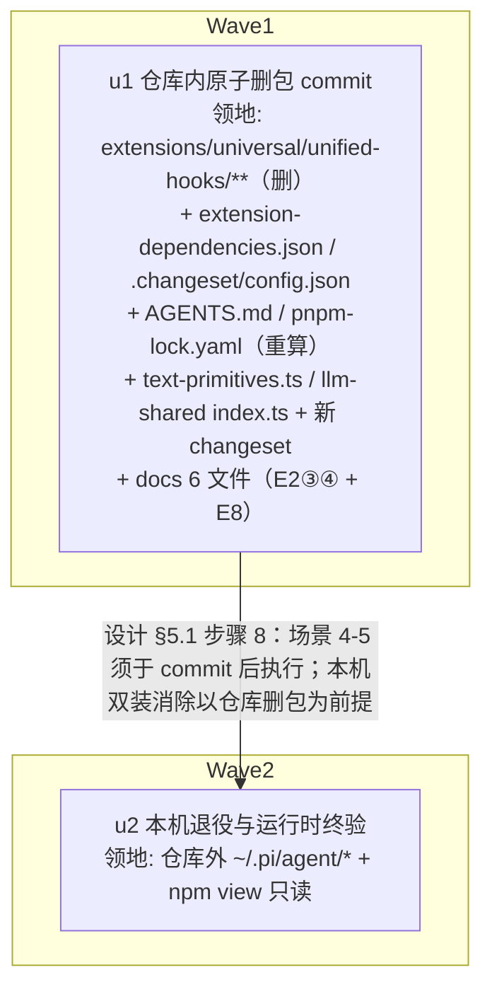

# ext-simplify-01（unified-hooks 删包 + llm-shared 清理）实施计划

基线: 3d1d396f0 | 来源设计: docs/design/ext-simplify-01-unified-hooks-llm-shared.md | 日期: 2026-09-12

审查证据: 主审 `.review/ext-simplify-01-review-r3.md`（0 must-fix, 0 suggestion）+ 影响面 `.review/ext-simplify-01-review-impact-r3.md`（0 must-fix, 0 suggestion；1 INFO 计数口径，不计数，无需修订）。设计文档 v3（286 行）双审收官，可进入实施。

## 0 章节映射

| 计划所需内容 | 设计文档实际位置（§ 编号 + 节标题原文） |
|---|---|
| 背景/目标 | 开篇（SCQA）（无编号节，含「一句话结论」blockquote）；「## 1. 背景：被设计的系统是什么」内「### 设计目标（从使用者体验倒推）」（目标 1-4）+ §1 末 In-scope / Out-of-scope 段 |
| 终态/机制 | 「## 3. 解决方案」：3.1 终态（使用者与维护者视角）/ 3.2 决策 D1：删包时机与方式（选定：现在、整包 git rm）/ 3.3 决策 D2：登记链路清理顺序与原子性（选定：单 commit 原子）/ 3.4 执行项（无取舍，位置/改动/验证）E1-E8 / 3.5 探针清单 P-dual / P-zeroimport / P-protocol / P-npm / P-single / P-changeset |
| 验收场景表 | 「## 4. 验收（真实场景，非单测非 mock）」场景 1 登记面退役 / 2 构建面健康 / 3 llm-shared 收敛且迁移窗口不动 / 4 本机单通道 / 5 历史不断链（含关键负面行为反向验证段） |
| 下一层拆分 | 「## 5. 下一层拆分」→「### 5.1 实施序列（单 commit 内的顺序）」（8 步表 + 拆分 justification） |
| 待验证检查点 | 「### 5.2 待验证检查点（设计阶段无法确定，诚实标注）」（2 项：pi uninstall 子命令形态 / pnpm 重算后 node_modules 软链残留形态） |
| （补充）场景 1 断言的白名单权威 | 「## 附录 A：历史命中白名单（删包后允许保留的 unified-hooks 引用）」 |
| （补充）out-of-scope 裁决登记 | 「## 附录 B：llm-shared 其余审计发现的处置（out-of-scope 登记）」 |

## 1 目标快照

以下全部逐字摘录自设计文档，禁止改写。

**一句话结论**（开篇 blockquote）：

> 删除 `extensions/universal/unified-hooks/` 整包及其全部登记（全仓零 import、能力已由 base-tool-enhance 逐条承接、本机双装危害已实测发生），llm-shared 仅移除 `MigrationResult` 死导出（迁移函数按日落条款保留）——单 commit 原子落地，无行为变更。

**设计目标（从使用者体验倒推）**（§1）：

1. **本机 pi 用户**：bash 工具不再被废弃包与 bte 双重拦截；session JSONL 不再写入无人消费的 `unified-hooks:loaded` entry。
2. **仓库维护者**：extensions 构建面（typecheck/lint/test、anchor 同步、junit 基建、守卫校验）不再为废弃包缴税；`rg unified-hooks` 在登记与配置面零命中。
3. **npm 生态用户**：已安装 unified-hooks 的独立用户有明确出路（npm deprecated 标记 + 指引不变），历史 session 的 `unified-hooks:tool-error` entry 仍可被 session-reader 泛化渲染读取（不断链）。
4. **llm-shared 消费者**：公共出口面不含零引用导出，permission 的旧配置迁移窗口（v2.0.0 日落条款）不受影响。

**In-scope**（§1 末，逐字）：删除 unified-hooks 整包 + 5 处登记清理 + 本机卸载；llm-shared `MigrationResult` 死导出移除；删包引发的悬空引用清扫（代码注释 §3.4-E5 + docs 活文档 §3.4-E8，第 1 轮审查扩面）。

**Out-of-scope**（§1 末，逐字）：llm-shared 其余审计发现（见附录 B 各自裁决，均不动作）；migrate.ts + permission 调用点整链删除（等 v2.0.0 日落）；npm registry 侧任何操作（不 unpublish）；bte / subagent-workflow 等包内历史出处注释清理（保留，见附录 A 白名单）。

## 2 单元列表

**执行模型**：执行单元的 subagent 禁 git（全局约束）——E1 的删除用文件系统 `rm` 完成，staging 与 commit（设计 §5.1 步骤 8）由编排方在核验后执行（`git add -A` 等价承载 `git rm` 语义）。u1 领地核验以 `ls` / `git show --stat` 于编排方 commit 时收证。

**拆分依据**：设计 §5 明示「单个下一层实施单元（一次原子 commit + 一次本机操作），无并行拆分面」——D2 原子性论证（守卫 `check-extension-dependencies.mjs` 双向校验禁止任何「目录 × 登记」不一致的中间态 commit，分步首 commit 即被 pre-commit 拦截）决定仓库内全部改动锁成单 commit = 单单元 u1；本机卸载是仓库外操作天然独立 = u2。本设计无跨单元共享契约/类型根（E6 移除的 `MigrationResult` 全仓零消费方），**u-foundation 缺席**（DAG 判据允许：确无共享契约）。

**领地核实声明**：下述全部路径与行号已于 2026-09-12 实读核实（ls / sed / rg），与设计一致；唯一注记：E5 悬空从句实跨 `text-primitives.ts` :43-44 两行（设计记 :43，以实读为准）。

| Unit | 职责 | 领地（精确文件路径） | 依赖 | 隔离 | 验收条款 |
|---|---|---|---|---|---|
| u1 | 仓库内原子删包 commit：unified-hooks 整包删除（E1）+ 登记 5 处清理（E2①②）+ guard 文档注记与历史表回写（E2③④）+ AGENTS.md 废弃段删除（E3）+ lock 重算（E4）+ 悬空注释清扫（E5）+ llm-shared 死导出移除附 minor changeset（E6）+ docs 活文档清扫（E8）＝设计 §5.1 步骤 1-7，单 commit 交付 | 见下方 u1 领地全清单（删 11 文件 + 改 10 文件 + 重算 1 文件 + 新增 1 文件） | 无 | plain | A1-A12（见下表，覆盖设计场景 1/2/3） |
| u2 | 本机退役与运行时终验：`pi uninstall`（E7）+ 设计场景 4/5 + 探针 P-single / P-npm 复核（仓库外操作，不进 commit） | 仓库外：`~/.pi/agent/settings.json`（经 pi uninstall 间接变更）；`~/.pi/agent/npm/node_modules/@zhushanwen/pi-unified-hooks`（卸载对象）；`~/.pi/agent/sessions/`（只读检索）；npm registry（`npm view` 只读）；探针用临时 session 目录（mkdtemp 自建自删） | u1 | plain | B1-B4（覆盖设计场景 4/5） |

**u1 领地全清单**（全部实读核实存在）：

- E1 删除：`extensions/universal/unified-hooks/` 整目录，tracked 文件实读清单（11 个）：`CHANGELOG.md`、`README.md`、`index.ts`、`package.json`、`vitest.config.ts`、`src/index.ts`、`src/hooks/network-timeout-guard.ts`、`src/hooks/test-timeout-guard.ts`、`src/hooks/tool-error-handler.ts`、`src/__tests__/session-start-handler.test.ts`、`src/__tests__/tool-error-handler.test.ts`；随后 `rm -rf extensions/universal/unified-hooks` 清 ignored `node_modules/` 空壳（设计 E1 验证列明示，不清则目录残留污染 E1 验证）
- E2① `extension-dependencies.json`（删 :72-81 unified-hooks 条目含 dependsOn，收尾行界以 JSON 合法为准）；E2② `.changeset/config.json`（删 :21 ignore 数组末项 `"@zhushanwen/pi-unified-hooks"`）
- E2③④ `docs/design/npm-publish-surface-guard.md`（:11 §1.1 S / :20 §1.2 全景句 / :24 §1.2 分类表三处「已 ignore」现行口径句补设计指定注记「（2026-09 ext-simplify-01 删包后 ignore 条目已移除；该包删前被 ignore 排除、删后不在磁盘，31 包计数不变）」；§6 变更历史表 :281 v7 行后追加一行 v8「ext-simplify-01 删包移除 ignore 条目，发布面计数不变」，既有行不改写）
- E3 `AGENTS.md`（删 :37「> 已废弃包：unified-hooks …」整段；:33 bte 条目内历史出处表述保留）
- E4 `pnpm-lock.yaml`（禁手改，由 `CI=true ELECTRON_SKIP_BINARY_DOWNLOAD=1 pnpm install` 重算）
- E5 `extensions/universal/structured-output/src/text-primitives.ts`（:43-44 直接删除「见 extensions/universal/unified-hooks 的 extractErrorText 及其文档」从句；保留 agent-loop.js createErrorToolResult 锚点与「SDK 事件结构无独立 errorMessage 字段」论证）
- E6 `extensions/shared/llm-shared/src/index.ts`（:8 移除 `type MigrationResult`，保留 `migrateLegacyConfig` 导出；`src/migrate.ts` :22/:34 不动）+ 新增 `.changeset/pi-llm-shared-remove-migration-result.md`（frontmatter `"@zhushanwen/pi-llm-shared": minor`，body 载明移除内容与「全仓零消费」依据）
- E8 五处：`docs/extensions/logging-conventions.md`（:158 行号引用改 git 历史锚点，:14/:162 保留）；`docs/design/base-tool-enhance.md`（:8 相对链接改纯文字「unified-hooks（已删除，git 历史即归档）」；:388 路径条目整条改写为「unified-hooks：已删除（2026-09，ext-simplify-01），原 timeout-guard 源码 `git log --follow` 可查」）；`docs/todo/extension-log-cleanup-design.md`（:142 原路径行改写为「原 unified-hooks 包 tool-error-handler.ts（已删除，`git log --follow` 可查）（tool_execution_end isError 分支）」+ P4 节首加设计指定状态行）；`docs/architecture/builtin-extension-dev-build-split.md`（:70 下方既有历史注记补「unified-hooks 已于 2026-09 删除（ext-simplify-01）」）。改写文案以设计 §3.4 E8 行为权威。

**u1 领地负清单（禁改）**：附录 A 白名单全部条目（bte `src/tool-error-audit.ts` / `force-patterns.ts` / `bash-tool.ts` / `index.ts` 及其 `__tests__`、subagent-workflow 两处注释、`extensions/shared/extension-logger/src/index.ts:222`、`packages/runtime/scripts/record-get-entries-fixtures.mjs:30`、`packages/shared/src/mandatory-extensions.json:18`、根 `README.md:138` / `README_EN.md:138`、各包 CHANGELOG）；`extensions/universal/permission/src/index.ts:102-104`（只读核对，不动）；pi 源码、npm registry 侧（Out-of-scope）。

**u1 验收条款**（A1-A12，全部可机械核验；前置检查 P 列于 §7 探针转入）：

| # | 条款 | 命令/判据 | 覆盖 |
|---|---|---|---|
| A1 | 登记/代码面命中 ⊆ 白名单 | `rg -l "unified-hooks" --glob '!**/*.md' --glob '!docs/**'` 命中集合 = 恰 11 项（现状 19 实测，本次起草复核）：extension-logger/src/index.ts、bte 6 文件（bash-tool.ts / force-patterns.ts / index.ts / tool-error-audit.ts / __tests__/force-patterns.test.ts / __tests__/tool-error-audit.test.ts）、subagent-workflow 2 文件（index.ts / injectors/subagent-list-injector.ts）、runtime/scripts/record-get-entries-fixtures.mjs、shared/mandatory-extensions.json | 场景 1 第一条 |
| A2 | 登记文件零命中 | `rg "unified-hooks" extension-dependencies.json pnpm-lock.yaml` 零命中 | 场景 1 第二条 |
| A3 | changeset config 零命中（hidden 守门，勿省略） | `rg "pi-unified-hooks" .changeset/config.json` 零命中（显式路径下 rg 不跳过 hidden，现状命中 :21） | 场景 1 第三条 |
| A4 | 目录消失 | `ls extensions/universal/ \| grep unified-hooks` 零输出 | E1 / 场景 1 |
| A5 | 构建面四连绿 | `CI=true ELECTRON_SKIP_BINARY_DOWNLOAD=1 pnpm install` → `node scripts/check-extension-dependencies.mjs` → `pnpm extensions:typecheck && pnpm extensions:lint && pnpm extensions:test` → `pnpm exec changeset status`，四者 exit 0 | 场景 2 |
| A6 | junit 计数差 −1 | 删包前采 N1=`rg -l "junit" --glob '**/vitest.config.ts' \| wc -l`（起草时点实测 38，以实施时点为准），删包后 N2=N1−1 | 场景 2 收证 |
| A7 | lock 零残留 | `grep unified pnpm-lock.yaml` 零命中 | E4 / 场景 2 |
| A8 | llm-shared 收敛 | `rg "MigrationResult" extensions/` 仅 `llm-shared/src/migrate.ts:22/:34` 两处；llm-shared 包测试绿（见 §4）；实读 `permission/src/index.ts:102-104` 日落注释原样；`.changeset/` 存在含 llm-shared 的 minor changeset 文件 | 场景 3 / E6 |
| A9 | extensions/ 面悬空路径零命中 | `rg "extensions/universal/unified-hooks" extensions/` 零命中；`rg unified-hooks extensions/universal/structured-output/` 零命中 | E5 |
| A10 | docs 活文档零悬空 | `rg "extensions/universal/unified-hooks" docs/ --glob '!docs/design/ext-simplify-*.md'` 零命中（现状恰 3 处：bte.md:8 / bte.md:388 / todo:142，经 E8 ②③④ 全消）；:158 行号锚点与 :70 表格注记机器正则不覆盖，逐一人工 diff | E8 |
| A11 | guard 文档注记 + 历史表回写 | `docs/design/npm-publish-surface-guard.md` :11/:20/:24 三处注记、:281 v7 后追加 v8 行，人工 diff 核对（既有行不改写） | E2③④ |
| A12 | AGENTS.md 废弃段消失 | `grep -n "已废弃包" AGENTS.md` 零命中；:33 bte 历史出处表述仍在 | E3 |

**u2 验收条款**（B1-B4）：

| # | 条款 | 命令/判据 | 覆盖 |
|---|---|---|---|
| B1 | settings.json 卸载到位 | `grep -n "unified" ~/.pi/agent/settings.json` 零命中且 bte 装载行仍在（现状 :37 口径，以行内容为准） | E7 / 场景 4 |
| B2 | bash 单通道 + 噪音 entry 消失 | 本地 pi CLI 探针（项目惯例命令 + stdin JSONL 发含 bash 调用的 prompt）：bash 正常执行、仅 bte 行为可见（如 force-test 自动后台）；新 session JSONL 无新增 `unified-hooks:loaded` entry（负面行为反向验证） | 场景 4 / P-single |
| B3 | 已发布物与历史 entry 不断链 | `npm view @zhushanwen/pi-unified-hooks deprecated` 仍有标记（失败 → 与删包无关另案，不阻塞）；先 `rg -l '"unified-hooks:tool-error"' ~/.pi/agent/sessions/` 检索（起草实测 672 个 JSONL）选一个旧 session 打开，`[custom:unified-hooks:tool-error]` 泛化渲染可读；仅当检索为零走兜底再造（bte 触发 bash 报错写同 customType 新 entry）并在验收记录注明口径降级 | 场景 5 / P-npm |
| B4 | 前置事实确认 | 卸载前 `grep -n "pi-unified-hooks\|pi-base-tool-enhance" ~/.pi/agent/settings.json` 确认双装现状（P-dual，若环境已变如实记录）；`pi uninstall` 子命令形态实测（§7 R1，降级路径备好） | E7 前置 / P-dual |

**设计验收场景表 → 单元覆盖对照**：场景 1→A1/A2/A3（+A4）；场景 2→A5/A6/A7；场景 3→A8；场景 4→B1/B2；场景 5→B3。五行全覆盖，无遗漏；负面行为反向验证（`unified-hooks:loaded` 零新增 / 登记面零命中）分别落 B2 与 A1-A3。

## 3 DAG 图

- 关键路径深度 2（≤4 达标）；最大反链宽度 1——不满足「≥3」，**注明任务本质串行的原因**：D2 原子性论证（守卫双向校验把「目录 × 登记」锁成不可分原子，任何中间态 commit 被 pre-commit 拦截）+ 设计 §5.1 拆分 justification 明示「无并行拆分面」，仓库内改动不可拆分为多 commit，并行度无提升空间。
- 无假并行：两单元领地零交集（u1 全在仓库内，u2 全在仓库外）；每条边带原因；u-foundation 缺席已声明（无共享契约）。

## 4 测试策略

**命令来源核实**（2026-09-12 实读）：

- 根 `package.json` :23-25：`"extensions:typecheck": "cd extensions && npx tsc --noEmit"`、`"extensions:lint": "npx eslint extensions/"`、`"extensions:test": "pnpm -r --filter '@zhushanwen/pi-*' test"`——三连为仓库既定入口，与根 AGENTS.md 一致
- `extensions/universal/unified-hooks/package.json` scripts：`typecheck: npx tsc --noEmit` / `test: vitest run`——随 E1 删包退出执行面，无单独执行项
- `extensions/shared/llm-shared/package.json` scripts：`typecheck: npx tsc --noEmit` / `test: vitest run`——包级测试从包目录运行（vitest 配置在各子包 vitest.config.ts，红线：从子包目录跑）
- junit reporter 已按仓库惯例统一配置（用例级耗时落盘 `test-results/`），A6 计数差直接可采

**增量测试（按受影响包，单元执行中跑）**：

| 包 | 触发改动 | 命令 |
|---|---|---|
| extensions/shared/llm-shared | E6 死导出移除 | `cd extensions/shared/llm-shared && pnpm vitest run`（设计场景 3 同款形态） |
| extensions/universal/structured-output | E5 注释改写 | `cd extensions/universal/structured-output && pnpm vitest run` |

（permission 零代码改动，不跑包测试，仅 A8 只读核对日落注释；跨包编译健康由全量 typecheck 承担。）

**全量测试（收尾用，u1 commit 前一次）**：A5 四连（install 重算 → 守卫脚本 → `pnpm extensions:typecheck && pnpm extensions:lint && pnpm extensions:test` → `pnpm exec changeset status`）+ A6 junit 计数差收证。

## 5 合理偏差登记表

（初始为空，执行期发现与设计的偏差逐行登记）

| Unit | 偏差内容 | 原因 | 影响 | 裁决 |
|---|---|---|---|---|
| u1 | E4 命令追加 `--no-frozen-lockfile` 一次 | 设计指定命令首跑 919ms 秒退未清 lock 中 unified-hooks importer（pnpm v10.27 对 importer 目录消失不敏感），A7 首跑失败 | 仅命令形态；仍由 pnpm 重算非手改，最终 lock 状态与设计终态一致 | 合理偏差，接受 |
| u1 | E2① 实删行界 :72-82（计划记 :72-81） | 对象含尾行 `},`，按计划「收尾行界以 JSON 合法为准」条款 | 无 | 合理偏差，接受 |
| u1 | guard 文档 v8 行日期列填 2026-09-11 | 设计注记文案均为「2026-09」粒度，未指定表内具体日 | 无 | 合理偏差，接受 |
| u2 | B3 渲染验证口径：以 session-reader 源码驱动 renderExpand 端到端替代「pi 打开旧 session」 | npm 安装版 pi-session-reader 0.2.4 为未 bundle TS 源码与仓库实现同源，口径等价；另核实 pi 本体 --export 不渲染 custom entry（与断言无关） | 无 | 合理偏差，接受 |
| u2 | B2 探针未带 `--extension <bte 本地路径>` | P-single 本义验证本机安装态单通道；带本地 bte 会与 settings.json 已装 bte 双装污染断言 | 无（两断言按安装态直验均达成） | 合理偏差，接受 |
| u1 | E8① logging-conventions.md:158 改写在设计指定文案基础上保留「明确记录：」谓语接续 | 原句以「明确记录：」引出 blockquote，照抄设计字面文案会产生无谓语句 | 行号悬空消除与教训可读性目标均达成（设计 E8① 为语义指定非逐字锁定） | 合理偏差，接受（阶段 3 一致性审查 R1 确认） |

## 6 状态表

| Unit | 状态 | 轮次 | 证据指针 |
|---|---|---|---|
| u1 | committed | 1 | 编排方核验（git status 领地比对 22+1 文件吻合 + A1/A2/A3 重跑 + typecheck/changeset status 重跑绿）→ u1 单 commit（A1-A12 全过；deviations 3 条：E4 追加 --no-frozen-lockfile（pnpm v10.27 对 importer 目录消失不敏感）/ E2① 行界 :72-82 以 JSON 合法为准 / guard v8 行日期 2026-09-11） |
| u2 | committed | 1 | 仓库外操作无 commit。B1-B4 全过：pi uninstall exit 0（removed 409 packages，R1 顶层子命令实存无降级）；settings.json 零 unified 且 bte 行在（编排方复核 grep=0 / node_modules 无该包）；P-single 单通道探针（bash 正常执行 + bte force-background 指纹 + 新 session JSONL 零 unified-hooks entry）；P-npm deprecated 标记在（0.2.9）；历史不断链（672 个 session 命中，最旧 2026-06-21，session-reader 渲染链 14 个 brief 精确渲染 `[custom:unified-hooks:tool-error]`）。deviations 2 条见 §5 |
| 阶段 5 双级验收 | pass | 1 | Gate A 全绿（8 项命令 exit 0：extensions 24 包 3987 cases 0 failed / subagent-core 2833 passed / constraints 幂等 / 3 守卫绿；零绕过信号）+ Gate B PASS（5 场景证据链逐行核验全 pass + 退役态三查抽验 pass：settings 零命中 / node_modules 无包 / npm deprecated 标记在）。报告留档 .review/stage5-gate-a-report.md、stage5-gate-b-report.md |

## 7 残留风险与变更历史

**设计 §5.2 待验证检查点逐条转入**：

- R1（→ u2 前置 B4）：`pi uninstall` 子命令形态以本机 pi 实装为准（README 形态大概率直接可用，设计已补两处本仓实读佐证：dev-link `dev-link-lib.sh` 头注释、`docs/design/file-lock-unification-and-reaper-sink.md:154` 否决的是 `pi extension uninstall` 而非顶层 `pi uninstall`）；若不存在，降级 = 编辑 settings.json 删 unified-hooks 行 + 清 `~/.pi/agent/npm/node_modules/@zhushanwen/pi-unified-hooks`。
- R2（→ u1 E4 步骤）：pnpm 重算后 node_modules workspace 软链残留——install 自清理即可；若报 store 布局翻转，按根 AGENTS.md 规则 20 恢复（`CI=true ELECTRON_SKIP_BINARY_DOWNLOAD=1 pnpm install`，与本设计无因果）。

**探针门槛落入单元**（设计 §3.5）：

| 探针 | 落点 |
|---|---|
| P-zeroimport（全仓零 import） | u1 前置检查：重跑 `rg "pi-unified-hooks" --glob '!**/*.md' --glob '!node_modules'` 确认仍无 import 语句；若出现 import → 降级路径：该引用方先迁移 bte 再删包 |
| P-protocol（bte 同 customType 写入） | u1 前置检查：实读 `bte/src/tool-error-audit.ts:7,76` 字符串未漂移；漂移 → 先对齐 bte 侧再删包 |
| P-changeset 存在性 | u1 前置检查：实读 `.changeset/config.json` ignore 含 `"@zhushanwen/pi-unified-hooks"`（起草实测 :21） |
| P-changeset 删除后合法性 | u1 验收 A5 末段：`pnpm exec changeset status` exit 0 |
| P-dual（本机双装） | u2 前置 B4 |
| P-npm（registry deprecated 标记） | u2 验收 B3（失败不阻塞，另案） |
| P-single（卸载后单通道） | u2 验收 B2 |

**新增残留风险**：

- R3：A6 计数差 −1 的前置依赖 = 实施时点 unified-hooks 的 `vitest.config.ts` 仍配 junit reporter（起草实测 N1=38 且含该包，r3 复核吻合）。若实施时差值 ≠ −1，信号指向「junit 集合已不含 unified-hooks」的真实状态变化（r3 已分析），先查该文件现状再判偏差，不直接改断言。
- R4：E6 的 minor changeset 仅在下次 llm-shared 发版时对 npm 用户生效（0.6.0 → 0.7.0）；发版时机归 merge 管线，本计划不触发发版——防「合入后 npm 面未见变化」误判。

**变更历史**：

- v1（2026-09-12）：初稿。依据设计 v3（双审 0 must-fix 收官）+ DAG 判据（`~/.agents/skills/dev-flow/references/dag-authoring.md`）起草；单元领地全部路径/行号/现状基数（19 命中、junit 38、config.json:21、lock:697）于起草时点实读核实。
- v1.1（2026-09-12）：阶段 3 一致性审查修复（impl-plan:48 计数笔误 12→10、设计附录 A 行号锚点 :222→:226 漂移更新、§5 补 E8① 措辞偏差登记）+ 阶段 5 双级验收 pass 回填（Gate A 全绿 + Gate B 退役态三查抽验 pass，报告 .review/stage5-gate-{a,b}-report.md）。
