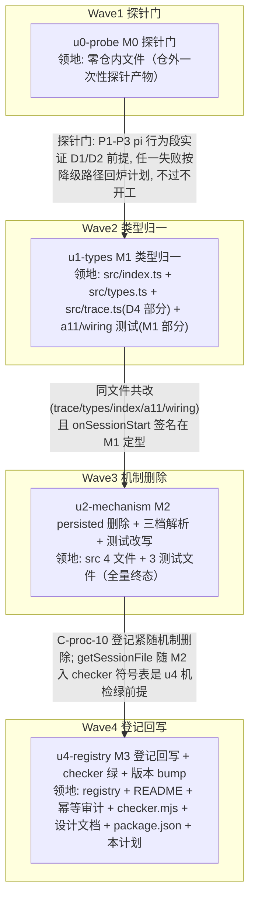

# ext-simplify-02（system-prompt-trace baseline 删除 + 类型归一）实施计划

基线: 3d1d396f0 | 来源设计: docs/design/ext-simplify-02-system-prompt-trace.md | 日期: 2026-09-12

审查证据: `.review/ext-simplify-02-review-r4.md`（主审第 4 轮聚焦复审：0 must-fix, 0 suggestions，另 2 条 INFO 不计数）+ `.review/ext-simplify-02-review-impact-r3.md`（影响面第 3 轮聚焦复审：0 must-fix, 0 suggestions，另 1 INFO）——两份报告均确认上轮修复成立、新反例未击穿，设计 v4 达到可实施状态。

拆分/DAG 判据: `~/.agents/skills/dev-flow/references/dag-authoring.md`（单元 ≤5 文件 / 领地可枚举 / 边带原因 / 隔离标注 / 写盘前自检清单）。

## 0 章节映射

计划章节对设计文档（docs/design/ext-simplify-02-system-prompt-trace.md，v4）实际 § 编号的映射（按实质特征定位）：

| 计划用途 | 设计 § | 节标题原文 |
|---|---|---|
| 背景/目标快照来源 | §1 / §2 | 「背景：被设计的系统是什么」/「设计目标」 |
| 终态与机制 | §4 / §5 / §7 | 「物理数据流（现状 vs 终态）」/「终态：使用者眼里将是什么样的」/「实现机制（把终态落到代码层）」（§7 含文件改动地图 = 本计划领地权威清单） |
| 关键决策（D1–D4） | §6（§6.1–§6.5） | 「关键决策与权衡」；其中 §6.5 为「探针清单（⛔ 实施期门：pi 行为段在 M0 开工前，终态段在 M2 后合入前）」 |
| 验收场景表 | §8（§8.2） | 「验收（真实场景，非单测非 mock）」/「验收场景」（V1–V6 表） |
| 下一层拆分/迁移阶段 | §9.1 / §9.2 | 「迁移路径」（M0–M3）/「下一层拆分」（u1–u4 单元种子） |
| 待验证检查点 | §6.5 / §9.3 | 「探针清单（⛔ 实施期门……）」/「待验证检查点」 |
| 反引号全集清单（M3 机检通道） | §6.3 D3 机检通道段 | 「D3：persisted 残留清理方式（选定：不主动删除旧文件）」内「机检通道」小节 |

## 1 目标快照

以下自设计文档 §2 逐字摘录。

**设计目标**：

1. **主链路零回归**：GUI switch / TUI resume / fork / skill reload / 重启直启五链路的留痕行为（去重、version 续接、reason 语义）与现状一致或更准。
2. **删自持久化子系统**：baseline.ts 中 PersistedBaselineEntry/File、readPersistedBaseline、writePersistedBaseline、loadBaselineFileForWrite、uniqueTmpPath、pruneSessions、MAX_BASELINE_SESSIONS 及 TraceEnv/types/index 的对应 wiring 整体移除，包内不再有第二个持久化状态源。
3. **数据层缺口修复**：`parentVersionDiffSummary` 在「重启直启 resume 后 prompt 变化」场景不再缺省（现状 persisted 只有 hash+version 无 fullText，见 baseline.a12.test.ts:190 的 `toBeUndefined()` 断言自证）。
4. **类型层归一**：Like\*Event 三接口与 SessionStartReason/SESSION_START_REASONS/normalizeSessionStartReason 删除，事件接入直接用 SDK 具名类型（与同组 msg-id-mapper/system-prompt 的既有风格一致）。
5. **悬置关闭**：fork 基线的「暂定语义，待 P2 实测定」注释随直读方案定案，不再有待验证标记。

**In-scope**：`extensions/taiji/system-prompt-trace/`（src + tests + README）+ 登记回写与悬空引用清扫四处——`docs/architecture/data-source-registry.md` §6 条目、包 `README.md`「四路径」章节、`docs/design/pi-session-start-handler-idempotency-audit.md` 历史性标注、`scripts/check-doc-symbol-drift.mjs` DOC_MODULE_MAP 登记（C-proc-10 同步纪律，见 D3）。

**Out-of-scope**（不实施，实施单元不得越界）：

- goal / smart-context / rename-session 的同模式 Like\* 归一（审计候选 3/11 的跨包部分，见各自包设计文档）；
- GUI Trace 视图对 `parentVersionDiffSummary` 的投影（该字段现状仅扩展自身测试消费，`summarizeSystemRow` 未读它——本次只保证数据层可产出，投影是独立产品决策）；
- stash 机制本身的删除（见 §6.1 被否谱系，登记为后续审计机会）；
- handler `async` 标记等 suggestion 级清理（不在审计覆盖面内）。

## 2 单元列表

拆分种子 = 设计 §9.2 下一层拆分（u1 类型归一 / u2 persisted 删除+三档解析 / u3 测试改写 / u4 登记回写）+ §9.1 迁移阶段（M0 探针门 → M1 → M2 → M3）。相对种子的结构调整（u0 新增、u3 并入 u2）见 §5 偏差登记表 D-1/D-4。

M0 探针门落位：**独立根单元 u0-probe**（u-foundation 形态的根节点）。理由：探针失败降级是设计级返工（P2 回退方案 A / P3 重审 D1 / P1 窄保留重审——§6.5 降级路径列），需要独立单元承载「门判定 + 产物留档」语义；探针不过 → 后继单元全部不派发（「不通过不开工」，设计 §9.1 M0 行）。

统一环境四要素（u0 与全部 CLI 验收场景共用，设计 §6.5，缺一不可）：

1. `PI_CODING_AGENT_DIR=<tmp agentDir>`（mktemp 自建；隔离 baseline 写动作与 extension 日志两个检查对象）
2. `XYZ_AGENT_DEBUG=1`（extension-logger 落盘开关，不开则 logs 负向检查空转假绿）
3. `--extension` 按段加载：pi 行为段双加载（npm dist 现状版本本包 + 一次性探针 extension）；终态段单加载实装本包
4. 凭据预置：`cp ~/.pi/agent/auth.json <tmp agentDir>/auth.json`（首建时执行一次，贯穿全程）

pi 入口锚定：一律 `./node_modules/.bin/pi`（cwd = 本仓根；实测 --version = 0.84.4）；禁止裸写 PATH 全局 pi（实测 0.85.1，不受 C-proc-08 版本门禁控制）。

| Unit | 职责 | 领地（精确文件路径，全部实读核实存在） | 依赖 | 隔离 | 验收条款 |
|---|---|---|---|---|---|
| u0-probe | M0 探针门：写一次性探针 extension（仅 log + fs 直读，不入包），按统一环境四要素跑设计 §6.5 P1–P3 的 **pi 行为断言段**，产物留档 | **零仓内文件**——全部产物在仓外一次性目录（mktemp tmp agentDir / tmp session-dir / 探针 extension ts / 探针脚本），验收后随 tmp 清理，产物摘录（JSONL 片段 + 日志 + 命令行）贴入实施 PR 描述 | 无（根） | plain | A0-1 入口锚定：`./node_modules/.bin/pi --version` 输出 0.84.4，记录于探针产物头。A0-2（P1）：TUI 发消息产生留痕后 /reload，探针日志记录 session_start reason=="reload" 且 getSessionFile() 指向当前 session 文件且按该路径 fs 读成功。A0-3（P2）：TUI fork 到早期 turn 后，探针记录 getSessionFile() 指向 fork 新文件且其内容范围==截断点前 entry（非源 session 文件全文）。A0-4（P3）：`--resume` 直启后探针记录 reason=="startup"、事件无 previousSessionFile、getSessionFile()==目标文件、直读最后留痕含 fullText。A0-5：四要素环境配方（tmp agentDir 路径 / auth.json 预置 / XYZ_AGENT_DEBUG=1 / 双 --extension 命令行摘录）与产物留档完整。A0-6 门判定：A0-1..A0-5 全过才解锁 u1；任一失败按 §6.5 降级路径处理（P2 回退方案 A / P3 重审 D1 / P1 窄保留重审）→ 停止派发，本计划回炉 |
| u1-types | M1 类型归一（设计 D4）：Like 三接口删除 + SDK import type + normalize 链删除 + 两 export 收敛 + 对应测试改写；纯类型层，行为零变更 | `extensions/taiji/system-prompt-trace/src/index.ts`；`extensions/taiji/system-prompt-trace/src/types.ts`；`extensions/taiji/system-prompt-trace/src/trace.ts`（仅 D4 部分：sessionStartReason 改型、mapReasonForFirstWrite 调用点类型、computePromptHash 去 export）；`extensions/taiji/system-prompt-trace/src/__tests__/trace.a11.test.ts`（M1 部分：未知 reason 用例删除、computePromptHash 断言本地化）；`extensions/taiji/system-prompt-trace/src/__tests__/index-wiring.test.ts`（M1 部分：事件 payload 类型断言随 SDK） | u0-probe | plain | A1-1 `pnpm extensions:typecheck` 绿（即设计 P4 的编译探针；失败先 `npm ls @earendil-works/pi-coding-agent` 核对 0.84.4 无漂移）。A1-2 包 src grep 零残留：SessionStartLikeEvent / SessionBeforeSwitchLikeEvent / TurnStartLikeEvent / SessionStartReason（本地联合类型）/ normalizeSessionStartReason / SESSION_START_REASONS。A1-3 parseTraceEntryData（baseline.ts）与 computePromptHash（trace.ts）去 export，函数体保留。A1-4 mapReasonForFirstWrite 保留且入参类型为 SessionStartEvent["reason"]。A1-5 trace.a11 未知 reason 用例已删、computePromptHash 断言改本地 createHash("sha256") 期望值。A1-6 包目录 `pnpm test` 绿 + 根三连绿。A1-7 diff 自查零运行时行为变更（mapReasonForFirstWrite 映射表不变、stash 逻辑不动） |
| u2-mechanism | M2 机制删除（设计 D1/D2 v5 三档）：baseline.ts 删 persisted 子系统 + trace.ts 三档解析（stash → fork 档读事件 previousSessionFile 最后留痕 → getSessionFile() 直读）+ types/index wiring（source 字段删除）+ 三个测试文件改写 + V1–V6 真实场景验收 | `extensions/taiji/system-prompt-trace/src/baseline.ts`；`extensions/taiji/system-prompt-trace/src/trace.ts`；`extensions/taiji/system-prompt-trace/src/types.ts`；`extensions/taiji/system-prompt-trace/src/index.ts`；`extensions/taiji/system-prompt-trace/src/__tests__/baseline.a12.test.ts`；`extensions/taiji/system-prompt-trace/src/__tests__/index-wiring.test.ts`（M2 部分）；`extensions/taiji/system-prompt-trace/src/__tests__/trace.a11.test.ts`（M2 部分：文件头 :8-9 悬置标记定案）。**不动** `src/diff.ts` 与包根 `index.ts`（实读确认在改动地图外） | u1-types（同文件共改 + onSessionStart 签名已定型） | plain | A2-1 删除面 grep 零残留（包 src）：PersistedBaselineEntry / PersistedBaselineFile / readPersistedBaseline / writePersistedBaseline / loadBaselineFileForWrite / emptyBaselineFile / uniqueTmpPath / pruneSessions / MAX_BASELINE_SESSIONS / BASELINE_FILENAME 及 fs/path/logger 相应 import。A2-2 PromptBaseline.source 字段整体删除、readLastPromptFromSessionFile 无 source 参数、全包 grep `\.source` 零属性读取；readLastPromptFromSessionFile 与 parseTraceEntryData 保留。A2-3 TraceContext 增 getSessionFile(): string \| undefined；onSessionStart **保留 previousSessionFile 参数**（设计 v5 三档，与现状签名同形）；解析三档（stash 命中优先 → fork 档读事件 previousSessionFile 最后留痕 → ctx.getSessionFile() 直读，miss→null）；write() 无 persisted 双写；onTurnStart 无「续命刷新小文件」调用。A2-4 baseline.ts 文件头注释改「三档」口径。A2-5 测试改写落位：a12「路径 3」两用例改直读场景且 diff 断言 toBeUndefined→toContain 反转、「路径 4」兜底保留（构造 getSessionFile 返回 undefined）、persisted 读写断言与 :270/:278 source 断言删除；wiring fork 用例（:187-213）previousSessionFile 直读断言**保留**（v5 语义一致）、「仅刷新自持久化基线版本」断言删除、**新增 previousSessionFile 三态防御用例**（fake 构造缺失/未落盘/读取失败 → null → resume v1 兜底）；a11 文件头 :8-9「暂按 resume（待 P2 实测定）」悬置标记定案；全部用例保留 a11/a12 验收 id（cw verify 匹配面不丢）。A2-6 包 `pnpm test` 绿 + 根三连绿。A2-7 **V1–V6 全场景**按 §8.2 v5.1 + §6.5 统一环境执行通过（对照表见下；V6 第二步断言 reason="change"，其 CLI 执行形态与单测承载见偏差 D-9），产物贴 PR。A2-8 §9.3 检查点 2：runtime spawn 直启链路在 dev 数据目录隔离（`~/.xyz-agent-dev`）下复跑一次通过。A2-9 P1–P3 终态断言段复跑（合入前，与 V1/V4/V6 共享产物；P2 终态段按方案 A 新断言、由 V6 执行） |
| u4-registry | M3 登记回写（设计 D3）：registry 废弃标注 + 死路径修正 + engines.json 锚点修正 + README 两档→三档改写 + 幂等审计两处标注 + checker 登记 + 设计文档反引号清单落位 + checker 绿 + changeset 声明 + 本计划状态表回填 | `docs/architecture/data-source-registry.md`；`extensions/taiji/system-prompt-trace/README.md`；`docs/design/pi-session-start-handler-idempotency-audit.md`；`scripts/check-doc-symbol-drift.mjs`；`docs/design/ext-simplify-02-system-prompt-trace.md`（SESSION_START_REASONS 残留 2 处裸写：:8 与 :195）；`.changeset/<kebab-name>.md`（新增声明，见 A4-8）；`docs/design/ext-simplify-02-system-prompt-trace.impl-plan.md`（状态表回填） | u2-mechanism（C-proc-10 登记紧随机制删除；getSessionFile 随 M2 入 checker 符号表是本单元机检绿前提） | plain | A4-1 registry :114 条目改标「已废弃（无读写方，可安全手动删除）」+ 删除清单含主文件与 system-prompt-trace-baseline.json.tmp_* glob + 条目内权威源死路径修正为 `extensions/taiji/system-prompt-trace/src/baseline.ts`。A4-2 registry :120 engines.json 条目「参照上行 … PR #186 MF2 先例」参照锚点改为直接引用或历史标注（该行豁免论证本体保留）。A4-3 README :38-46「跨重启 hash 基线四路径」章节改「三档」（删 persisted 路径；fork 档 previousSessionFile 读取描述保留——设计 v5 定案）+ :34 reason 映射表「fork / reload｜resume｜暂定，待 P2 探针实测定（A13）」行定案（P2 已实测：fork 档维持 resume 语义，M0 执行记录见设计 §6.5）。A4-4 幂等审计 :20 排查表行与 :83 §4 表行两处加历史性标注（时点审计记录不改写事实；:83「全局基线双写」注明 persisted 删除后不成立；stash 双注册残留发现注明终态仍有效）。A4-5 checker DOC_MODULE_MAP 登记两行——设计文档与本 impl-plan 成对（映射均为 `['extensions/taiji/system-prompt-trace/src']`）。A4-6 `grep -c` 核对设计文档 SESSION_START_REASONS 带反引号残留 == 0（:8/:195 两处已裸写）。A4-7 **机械验收（必判条款）**：实施前推演核对——以 checker 同款正则（反引号 span 内蛇形大写 ≥2 段 + getXxx( 形态）对设计文档与本计划提取，候选仅剩 getSessionFile（M2 后入 TraceContext 符号表）+ ENV 白名单符号（PI_CODING_AGENT_DIR / XYZ_AGENT_DEBUG / XYZ_AGENT_EXT_LOG）；随后 `node scripts/check-doc-symbol-drift.mjs` exit 0。A4-8 新增 `.changeset/` 声明文件（类型实施期按 npm 出口面实际变化定：Like 类型若不在包根出口则 patch 记录行为修复与出口收敛，在出口则 minor）；**不手改 package.json version**（本仓发布纪律：PR 阶段只加 changeset，版本号 merge 阶段统一 bump，对齐 12 号计划 D-6；本计划初稿的「package.json version patch bump」为编排方自检修正项）。A4-9 本计划 §6 状态表回填 |

**V1–V6 验收场景 → 单元覆盖对照**（设计 §8.2 全表，无遗漏无悬空）：

| 场景 | 内容 | 回溯目标 | 执行环境 | 落位单元/条款 |
|---|---|---|---|---|
| V1 | TUI 直用 pi：reload 去重（留痕仍 1 条；logs 无 error 级条目；tmp agentDir 无 baseline 写动作） | 目标 1 | CLI 统一环境 | u2 / A2-7（与 P1 终态段共享产物） |
| V2 | GUI switch 主链路（A 往返留痕不增、B 独立 v1） | 目标 1 | `pnpm dev` GUI | u2 / A2-7 |
| V3 | GUI skill 变更 reload（命中不写；prompt 实变写 resume v+1 带 diff；dev agentDir 无 baseline 写动作，路径 `~/.xyz-agent-dev/agent`） | 目标 1 + 2 | dev 运行中 | u2 / A2-7 |
| V4 | 重启直启 resume + F1 修复（命中轮零新增；变化轮 resume v+1 且 parentVersionDiffSummary 含 "+N -M lines"） | 目标 3 | CLI 统一环境（同一 tmp agentDir + `--resume`） | u2 / A2-7 + A2-8（dev 数据目录 GUI 侧变体复跑） |
| V5 | 负面行为：预置孤儿 baseline 全程不被读写（mtime 不变）+ 全新 session 首留痕 initial v1 | 目标 1 | CLI 统一环境（tmp agentDir 预置） | u2 / A2-7 |
| V6 | TUI fork 两步（§8.2 v5.1 定案）：① fork 后首 turn 配置未动 → hash 命中源最后留痕**不写**留痕（fork 文件 JSONL 零 `xyz:system-prompt` 新增）；② 配置改回后新留痕 reason="change"、version = 源最后留痕 v+1、parentVersionDiffSummary 相对源留痕 fullText 有值；防御子断言（previousSessionFile 缺失/不可读 → 首留痕 resume v1）归 wiring 单测 | 目标 1 + 5 | CLI 统一环境（实装包单 --extension，TUI） | u2 / A2-7 + A2-9（与 P2 终态段共享产物）；第二步 change 断言由 a12 扩展单测承载（偏差 D-9） |

## 3 DAG 图

拓扑性质与自检：

- 领地交集检查：u0∩其余=∅（仓外）；u1∩u2 非空（5 文件同文件共改）→ 串行边保证互斥；u2∩u4=∅；u1∩u4=∅。
- 每条边带原因（见图）；每行验收条款独立可判（命令能跑 / grep 可数 / exit code 可判）。
- 层宽 1 ≤ 并发上限 5；关键路径深度 4 层 ≤ 4。
- 最大反链宽度 1 且未走契约先行 → **任务本质串行**，原因：①u0 是设计门，探针失败分支（P2 回退方案 A / P3 重审 D1）直接改变 u2 实现形态乃至设计本体，并行派发会在门未过时烧掉后继单元的返工面；②u1/u2 五文件领地交叠（设计 §9.2 u1 justification：先行定型签名，避免类型改动与机制改动交叉）；③u4 与 u2 受 C-proc-10「登记紧随机制删除」纪律约束（放宽形态见偏差 D-2）。
- 无共享契约文件需求（无并行单元），u-foundation 形态由 u0-probe 门单元承担根节点。
- 隔离：四单元均 plain——无热点公共文件（改动收敛在单包 src/tests 与四个登记面），非实验性废弃型改动，用户未指定 worktree。实施分支与 commit 拆分遵守设计 §9.1：u1 独立 commit（类型层先行）、u2 单 commit、u4 紧随 u2 连续 commit。

## 4 测试策略

**真实命令基线（实读 `extensions/taiji/system-prompt-trace/package.json` scripts）**：

- 包内单测：`cd extensions/taiji/system-prompt-trace && pnpm test`（= `vitest run`）；包内类型检查：`pnpm typecheck`（= `npx tsc --noEmit`）。
- 根三连（AGENTS.md 常用命令）：`pnpm extensions:typecheck && pnpm extensions:lint && pnpm extensions:test`——u1/u2 验收均以三连绿为门。
- 框架红线：vitest（禁 node:test / tsx --test），配置在包内 vitest.config.ts、从包目录运行；timer 用例用 fake timers；测试禁止触碰真实数据目录（探针与验收场景全部 mktemp 自建 + PI_CODING_AGENT_DIR 隔离，天然合规）。

**既有测试基线（实读 `src/__tests__/`，4 文件全存在）**：

| 文件 | 改动归属 | 要点 |
|---|---|---|
| `baseline.a12.test.ts` | u2 | 「路径 3」两用例改档 2 直读；diff 断言 toBeUndefined（:190 自证缺陷）→ toContain 反转；persisted 读写断言与 :270/:278 source 断言删除；「路径 4」兜底保留 |
| `index-wiring.test.ts` | u1（类型断言）+ u2（fork 用例与 persisted 断言） | fork 用例（:187-213）改 ctx.sessionManager.getSessionFile() 形态；「仅刷新自持久化基线版本」断言删除；payload 类型随 SDK |
| `trace.a11.test.ts` | u1（未知 reason 用例、computePromptHash 本地化）+ u2（文件头 :8-9 悬置标记定案） | computePromptHash 断言改本地 createHash("sha256") 纯函数等价 |
| `diff.test.ts` | **不改**（diff.ts 不在改动地图；§8.1「四套单测」回归辅助面） | — |

**验收 id 守护**：vitest.config.ts 注释明确「A11/A12 验收测试（fullName 含验收 id，cw verify 按 id 匹配）」——改写/删除用例时必须保留验收 id 形态，禁止静默丢 id 导致 cw verify 匹配面缩水；确需废弃某验收 id 时在单元 deviations 显式登记。

**junit 耗时报告**：包 vitest.config.ts 已配 `reporters: ["default", "junit"]` + `outputFile.junit`（符合 AGENTS.md 用例级耗时报告规范），无需新增 reporter。

**单测定位**：设计 §8.1——单测仅作回归辅助，不计入验收；真实场景验收 = V1–V6（CLI 场景按 §6.5 统一环境四要素执行，GUI 场景 pnpm dev）。产物（JSONL 行摘录 + 日志摘录）贴 PR。

## 5 合理偏差登记表

| # | 偏差 | 相对什么 | 理由 |
|---|---|---|---|
| D-1 | u3（测试改写）并入 u2，实施单元为 u0/u1/u2/u4 四个（设计 §9.2 种子为 u1–u4 四个，组成不同） | 设计 §9.2 | 设计 u3 justification 原文「与 u2 同 commit 才能保持绿；单独拆会留红窗口」——分单元违反「committed 前测试真实跑绿」双锁不变量（非纯平移场景，无验收分级松动可用）。合并后 u2 领地 7 文件超 dag-authoring「≤5 文件」判据：触面约 1400 行（删 ~120 + 改写）远低于 ~3000 行限，超文件数原因是测试断言与终态行为原子性，显式登记豁免 |
| D-2 | 设计 §9.1「M3 与 M2 同 commit」放宽为「u4 紧随 u2 连续 commit、中间零其他单元/commit」 | 设计 §9.1 | 单元化执行模型（单元 committed 即解锁后继）与「两单元同一 commit」语义不可兼得；漂移窗口收窄为单次核验间隙，且 u4 的 checker 绿（A4-7）对登记面兜底，不产生无守卫漂移 |
| D-3 | DOC_MODULE_MAP 成对登记设计文档 + 本 impl-plan（设计 D3 机检通道只点名设计文档一行） | 设计 §6.3 D3 | checker 既有 5 对映射全部「设计文档 + .impl-plan.md 成对登记」（实读 scripts/check-doc-symbol-drift.mjs :41 确认惯例）；本计划文件自身含符号提及，不登记则永久游离机检外，与 C-proc-10 同步纪律精神不符。本计划书写已按 checker 口径自检：被删蛇形大写符号与 get 前缀提及一律裸写，登记后不会新增必红候选 |
| D-4 | M0 探针门落位为独立根单元 u0-probe（任务授权「u-foundation 或首个单元前置检查条款」两形态取前者） | 任务授权两选项 | 探针失败降级是设计级返工（P2 回退方案 A / P3 重审 D1 / P1 窄保留重审），需独立承载门判定与产物留档交付；若作为 u1 前置条款，门失败时的「计划回炉」无处安放 |
| D-5 | 包版本发布声明归入 u4 收口（设计 §9.1 提及 bump 未指定归属单元） | 设计 §9.1 | u4 为末单元，一次收口不随中间 commit 反复改；taiji 组无独立外部消费者，无中间版本消费面。编排方自检修正：初稿「手改 package.json version」违反本仓发布纪律（PR 阶段只加 changeset 文件、版本号由 merge 阶段统一 bump，与 12 号计划 D-6 同源），已改为新增 `.changeset/` 声明文件 |
| D-6 | M0 探针门失败触发设计回炉（v5/v5.1）：D2 fork 档从「getSessionFile() 直读」回退「读事件 previousSessionFile 最后留痕」（两档→三档） | 探针 A0-3 证伪（createBranchedSession hasAssistant 条件 flush + /fork 常态 position=before 路径不含 assistant → session_start 时点 fork 文件未落盘） | 设计级决策翻转已经 r5 主审（论证链闭合 + V6/P2 reason 语义修复）与 r4 影响面（辐射面核查全过）聚焦复审；本计划 u2/u4 条款已按三档同步（A2-3/A2-5/A2-7/A2-9/A4-3）；u1 不受影响（SDK 类型自带字段） |
| D-7 | u1 执行越界：baseline.ts 单行（parseTraceEntryData 去 export） | impl-plan u1 领地清单漏列该文件，但 A1-3 验收条款与设计 §7 文件地图均锚定此项（计划内部不一致） | 全仓引用仅同文件内部调用，单行零行为变更，与 u2 领地零冲突 | 合理偏差，接受（计划遗漏修正） |
| D-8 | u1 执行越界：baseline.a12.test.ts import 适配 | computePromptHash 去 export 的必然编译波及（a12:26 import 该符号），不改则 A1-6 包测试绿无法达成 | import 行换本地等价 helper + 1 行注释，零断言语义触碰，与 u2 场景改写零冲突 | 合理偏差，接受（必然波及） |
| D-9 | u2 执行：V6 第二步（change 断言）未在 CLI 真实场景执行，改由 a12 扩展单测承载 | TUI fork 交互链路（/fork 树导航后继续对话并改配置）无法在 §6.5 统一环境自动化；与设计 §8.2 V6 的 CLI 场景定位有偏差（初稿登记「=设计 v5.1 口径」有误——v5.1 移出 CLI 的是防御子断言而非 change 断言，阶段 3 一致性审查勘误） | V6 第一步（fork 后首 turn 零新增）仍在 CLI 真实场景执行；change 断言由 a12 扩展用例覆盖（fork 档命中确立 current → 配置回变 → 断言 reason="change"、version=源+1、diff 相对源 fullText）；通过标准的两个断言面均有承载 | 合理偏差，接受（承载通道变更，覆盖不缺） |
| D-10 | u2 执行：V2/V3 以 CLI 等价链路替代 `pnpm dev` GUI 执行 | 改动面行为语义（switchSession/reload 的 pi 侧基线解析）在 CLI 同源覆盖；Trace 投影 out-of-scope（设计 §2）、ReloadOrchestrator 触发链非本包改动面；A2-8 的 dev agentDir runtime-spawn 复跑补上 V3 的 agentDir 检查面 | 目标 1 验收实质不破坏；V2/V3 的 pi 侧行为断言全部落实 | 合理偏差，接受（阶段 3 一致性审查 R5 确认） |
| u2 | 合理演化三项（阶段 3 一致性审查 R1/R3/R4 确认）：① registry :114 废弃条目内先例引用联动修正（worktree-registry 先例已改 proper-lockfile 直用，避免挂失效引用）；② a12 harness 保真度重构（setSessionId → openNewSession 返回未落盘新文件，更贴近 pi 延迟落盘语义）；③ wiring 测试删 getAgentDir mock（persisted 删除后 agentDir 不再被消费，mock 面终态收缩） | 均为 C-proc-10 悬空清扫 / pi 语义保真 / 终态必然清理的合理演化，不破坏设计声明目标 | 无 | 合理偏差，接受（登记留痕） |
| u2 | 过程性微偏差三条（无验收口径影响，详见 §6 状态表 u2 行）：A2-8 spawn 形态对齐 / 判据笔误 3 处修正 / tmp 凭据清理 | 执行期环境与笔误修正 | 无 | 合理偏差，接受 |

## 6 状态表

| Unit | 状态 | commit | 备注 |
|---|---|---|---|
| u0-probe | resolved（门失败已回炉） | 1 | **A0-3（P2）门判定失败**：pi 0.84.4 createBranchedSession hasAssistant 条件 flush——常态 /fork（position=before）session_start 时点 fork 新文件未落盘，直读 null。已按降级路径回炉设计：D2 回退方案 A（fork 档读 previousSessionFile，恢复现状语义），设计 v5/v5.1 经 r5/r4 聚焦复审通过。A0-1/A0-2/A0-4/A0-5 PASS（reload/直启档直读前提成立，且 fork 事件 previousSessionFile 恒在 + 源文件已落盘含 fullText——方案 A 前提已被同次探针证实）；A0-6 按门纪律停止派发。u0 不重跑：修订方案的全部 pi 行为前提已在本轮探针覆盖，P2 终态段（方案 A 断言）归 u2/A2-9 合入前执行 | ⛔→✅ 门已处理 |
| u1-types | committed | 1 | 59cd0f320（编排方核验：领地 7 文件吻合 + 包测试 38 绿重跑 + 根 typecheck 绿）。A1-1..A1-7 全过。deviations 2 条越界已接受（见 §5）+ 划界声明 1 条 |
| u2-mechanism | committed | 1 | 编排方核验（领地 7 文件吻合 + 包测试 38 绿 + typecheck 绿 + 删除面零残留重跑）。A2-1..A2-9 执行形态：V1-V5 真实场景统一环境执行全过；V6 第一步（fork 后首 turn 零新增）真实场景执行（决定性实证：未 flush fork 文件直读 null → 首 turn 零新增 = fork 档读 previousSessionFile 命中源 v2）；V6 第二步（change 断言）因 TUI fork 交互链路无法在统一环境自动化，改由 a12 扩展单测承载（偏差 D-9；阶段 3 一致性审查发现原单测缺该覆盖，已补齐）；dev agentDir runtime-spawn 复跑零写动作。deviations 5 条见 §5 补登（D-9 V6 change 断言单测承载 / D-10 V2 V3 CLI 等价链路 / A2-8 spawn 形态对齐 / 判据笔误 3 处修正 / tmp 凭据清理） |
| u4-registry | implemented（待编排方 commit） | — | 领地 7 文件全改，A4-1..A4-9 全过：A4-1 registry 条目改标已废弃（删除清单含主文件 + `system-prompt-trace-baseline.json.tmp_*` glob）+ 死路径修正为 `extensions/taiji/system-prompt-trace/src/baseline.ts`；A4-2 engines.json 参照锚点改历史标注（豁免论证本体保留）；A4-3 README「四路径」→「三档」+ reason 表 fork/reload 行定案；A4-4 幂等审计 :20/:83 两处历史性标注；A4-5 checker DOC_MODULE_MAP 成对登记两行（映射均为 `['extensions/taiji/system-prompt-trace/src']`，追加于 12 号流水线 chat-domain 条目之后零回退）；A4-6 设计文档 SESSION_START_REASONS 带反引号残留 grep == 0（实读行号 :8/:201——本计划原载 :195 为设计时点值，v5.1 行号漂移）；A4-7 checker 同款正则推演：两文档候选仅 getSessionFile ×10（TraceContext interface 成员）+ ENV 白名单符号（PI_CODING_AGENT_DIR / XYZ_AGENT_DEBUG / XYZ_AGENT_EXT_LOG），`node scripts/check-doc-symbol-drift.mjs` exit 0；A4-8 新增 `.changeset/pi-system-prompt-trace-remove-persisted-baseline.md` 判 **patch**（Like 三接口基线即非 export，git show 3d1d396f0 核实，包出口面不变——仅行为修复 + 内部 export 收敛），未手改 package.json version；A4-9 本表回填。commit 由编排方执行（偏差 D-2：紧随 u2 连续 commit） |

## 7 残留风险与变更历史

**待验证检查点（设计 §9.3 逐条转入）**：

1. §6.5 探针 P1–P3 两段结果 → pi 行为段 = u0 / A0-2..A0-4（⛔ 开工前门）；终态段 = u2 / A2-9（合入前复跑）。设计声明其断言均有 dist 源码依据，纪律上仍以实跑为准。
2. runtime spawn 直启链路 dev 数据目录隔离复跑（V4 的 GUI 侧变体，排除打包 staging 层与直连差异）→ u2 / A2-8。
3. 已接受代价 1 的观察口径：**合入后**（非本计划任何单元的验收）若 Trace 视图观察到 reload/重开场景留痕成对重复（同 hash 两条相邻留痕），说明「首 assistant 前中断 + 重开」窗口比预估频繁，回设计重审档 2 的 flush 语义假设——登记为合入后观察项。

**已接受代价（设计 §9.3 汇总照录，实施单元不处置、不扩权）**：

1. 首 assistant 前中断窗口（仅 reload 分支产生成对重复；crash 分支重写恰一条）：现状该窗口零丢失（persisted 同步双写），终态该窗口确定多写一条；量级 <0.1% 联合先验；留痕是诊断旁路，重复仅 Trace 视图噪音。
2. 孤儿 baseline 文件（主文件 ≤10KB/agentDir 一次性 + 极小概率 tmp 残留）：不主动删除（D3），用户手动删或永留；u4 / A4-1 完成登记。
3. session_start 读大文件（reload/直启档从读小文件变读 session JSONL 全文，MB 级毫秒级非热路径）：若未来观察到启动延迟，加「只读尾部 N KB」优化（backlog，本次不做）。

**M0 门降级分支（触发即计划回炉，禁止在单元内就地消化）**：

- P1 pi 行为段失败（manager 未就位/文件不可读）→ 核对失败输出与 dist 源码断言差异；pi 行为与源码不符按版本门禁流程重验（check-pi-semantics），开工前回设计重审 D1。
- P2 pi 行为段失败 → D2 开工前回退读 previousSessionFile（审计方案 A 形态），标注「探针证伪，回退 A」，回炉本计划后重派 u2。
- P3 pi 行为段失败 → persisted 原主场景，开工前 D1 整体重审（回滚到方案 C 需重新设计评审）。
- P1 终态段失败且确认 pi 固有限制（仅 reload 档）→ fork/resume/直启三档不受影响时可缩为「reload 档保留 persisted 小文件只读（不复活写路径）」的窄保留并回设计重审 D1。
- P4（编译等价性）失败 → 检查 SDK 版本漂移（npm ls 核对 0.84.4）；确认无漂移后保留单点 import type 过渡并在设计 §6.5 登记（u1 内处理）。

**变更历史**：

- v1（2026-09-12）：初稿。依据设计 v4（两轮对抗式审查后 0 must-fix）+ dag-authoring 判据起草；单元 4 个（u0-probe / u1-types / u2-mechanism / u4-registry），全串行 DAG 深度 4 层；领地全部实读核实（src 实际 5 文件含不动面 diff.ts、包根 index.ts 为 re-export 不在改动面，registry :114/:120、幂等审计 :20/:83、设计文档 SESSION_START_REASONS 残留恰 :8/:195 两处均 grep 确认）；偏差登记 5 条（D-1..D-5）。

- v2（2026-09-12）：M0 探针门回炉同步。u0-probe 执行结果：A0-3（P2）门判定失败（pi 0.84.4 hasAssistant 条件 flush 证伪 fork 档直读），按门纪律停止派发；设计回炉 v5（D1/D2 翻转两档→三档，fork 档回退读 previousSessionFile）并经 r5 主审 + r4 影响面聚焦复审通过（v5.1 修 V6/P2 reason 语义与防御子断言落位）。本计划同步：u2-mechanism 验收条款三档化（A2-3 保留 previousSessionFile 参数 / A2-5 wiring 用例保留直读断言 + 新增三态防御用例 / A2-7 按 §8.2 v5.1 / A2-9 P2 终态段由 V6 执行）、u4-registry A4-3 README「三档」口径、偏差 D-6 登记；u1-types 不受影响。u0 不重跑（方案 A 的 pi 行为前提已由同次探针全部覆盖）。来源设计现行版本：v5.1（417 行）。
- v3（2026-09-12）：阶段 3 一致性审查修复（三区审查 02 区报告）：① §2 V1-V6 对照表 V6 行按设计 §8.2 v5.1 重写（v4 口径残留勘误）；② §3 DAG U2 标签「两档解析」→「三档解析」（D-6 同步面漏改勘误）；③ §6 状态表 u2 行矛盾声明如实化（V6 第二步 change 断言改由 a12 扩展单测承载——偏差 D-9 登记，修复 commit 补齐 a12 fork 用例覆盖并经破坏验证；「=设计 v5.1 口径」错误引用删除）；④ u4 行「14 号流水线条目」错误引用改「12 号 chat-domain 条目」；⑤ §5 补登 D-9/D-10 + 合理演化三项 + 过程性微偏差三条（u2 执行偏差 5 条此前仅状态表备注）。
