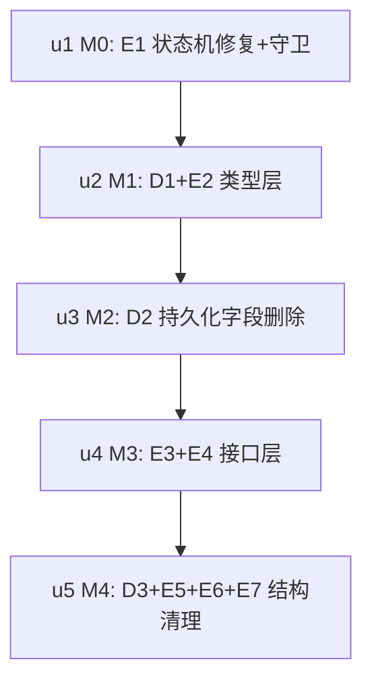

# ext-simplify-03 goal 实施计划

基线: 8c27b44d7 | 来源设计: docs/design/ext-simplify-03-goal.md | 日期: 2026-09-12
审查证据: `.review/ext-simplify-03.md`（主审聚焦复审 R1：0 must-fix）+ `.review/ext-simplify-03-impact.md`（影响面聚焦复审 R1：0 must-fix）；suggestion 已全部闭合（设计附录 v3）。

## 0 章节映射

| 内容 | 本文实际位置 |
|------|--------------|
| 背景/目标 | §1 背景 + §2 设计目标（G1-G5 + In/Out-of-scope） |
| 终态/机制 | §4 终态 + §5 决策与执行项总表（D1-D3/E1-E7 + E1 守卫设计）+ §6 实现机制 |
| 验收场景表 | §8（场景 1-8 + 宿主表面不变段） |
| 下一层拆分 | §9（9.1 迁移路径 M0-M4 / 9.2 拆分清单 U1-U5 / 9.3 文件改动地图 / 9.4 待验证） |
| 待验证检查点 | §9.4（P-like-1/P-like-2 逆变摩擦、场景 4 entry 构造校准、E3 theme 形态自由度） |

## 1 目标快照（逐字摘录设计 §2）

> **改造后维护者能做到：事件类型只认 SDK 一个权威源；状态转换只有一个执行点；持久化 schema 每个必填字段都有真实消费者；接口声明的每个成员都可直接使用（无需断言走私或记忆约定）。**
> 1. **G1 类型权威源唯一**：删 7 个 Like* 接口，事件类型 = pi SDK 具名导出；SDK 演进时编译报错而非静默漂移（验证 §8 场景 3）。
> 2. **G2 状态机防线恢复强制**：全部状态变更走 `transitionStatus` 查表；新增非法转换在代码评审外还有守卫兜底（验证 §8 场景 1）。
> 3. **G3 持久化 schema 无死重**：删 2 个 write-only 必填字段；旧数据（含已删字段）加载不 throw（验证 §8 场景 2）。
> 4. **G4 接口即事实**：UiPort 显式声明 theme（删两处断言）；SessionPort 删零消费成员。
> 5. **G5 结构税清零**：budget dimension 死字段、formatBudget 转发层、barrel/单消费方 shared 文件、port/ctx 双通道惯例——各自收敛或显式成文。

Out-of-scope（逐字）：isGui 四分支组合 helper（设计 13）；rename-session 的 TurnEndLikeEvent（设计 15）；engine/projection 其余 low 发现（移交 code-simplify，DEFAULT_BUDGET 触达时可顺带删）；message renderer 消费逻辑（只换类型不动渲染行为）。

## 2 单元列表

| Unit | 职责 | 领地（精确文件路径，均在 `extensions/universal/goal/` 下） | 依赖 | 隔离 | 验收条款 |
|---|---|---|---|---|---|
| u1 = M0/E1 | resume 改查表 + 裸赋值守卫测试用例 | src/adapters/command-adapter.ts、src/engine/__tests__/goal.test.ts | 无（根） | plain | 设计 §8 场景 1/2/3：`pnpm --filter @zhushanwen/pi-goal test` 绿（含新守卫用例，基线矩阵见 §5.4）；守卫红队验证（插入裸赋值→用例红→还原绿）证据落汇报 |
| u2 = M1/D1+E2 | 删 Like*×7 + SDK 类型贯通（index.ts/message-end.ts），renderer 走 MessageRenderer 推导 | src/index.ts、src/adapters/event-handlers/message-end.ts | u1 | plain | `pnpm extensions:typecheck` 零错（P-like-1）；index.test.ts 探针载体跑绿（P-like-2）；`pnpm --filter @zhushanwen/pi-goal test` 绿 |
| u3 = M2/D2 | 删 lastProgressTurn/objectiveUpdatedAt 四处 + P-m14-1/P-m14-2 测试 | src/engine/types.ts、src/engine/goal.ts、src/persistence.ts、src/adapters/command-adapter.ts、src/engine/__tests__/goal.test.ts（fixture 共用）、src/__tests__/deserialize-state.test.ts、src/__tests__/criteria-array-migration.test.ts、src/__tests__/schema.test.ts | u2 | plain | P-m14-1/P-m14-2 用例绿（legacy entry 含已删字段加载成功；新写入 entry 不含两字段）；包测试绿 |
| u4 = M3/E3+E4 | UiPort.theme 显式声明 + ThemeLike 上移 + SessionPort 删 2 成员（含 §9.3 全部 5 个测试 fake 同步） | src/ports.ts、src/adapters/ports.ts、src/projection/widget.ts、src/adapters/event-handlers/before-agent-start.ts、src/projection/__tests__/widget.test.ts、src/__tests__/service.test.ts、src/__tests__/goal-control-adapter.test.ts、src/__tests__/criteria-array-adapter.test.ts、src/__tests__/session.test.ts | u3 | plain | `pnpm extensions:typecheck` 零错 + 包测试全绿（fake 触达路径见设计 §9.3）；E4 后 SessionPort 仅剩 getEntries |
| u5 = M4/D3+E5+E6+E7 | 删 barrel + shared 并入 agent-end + budget dimension + formatBudget + 双通道头注 | src/index.ts、src/adapters/event-adapter.ts（删）、src/adapters/event-handlers/shared.ts（删/并入 agent-end.ts）、src/adapters/event-handlers/agent-end.ts、src/engine/budget.ts、src/projection/prompts.ts、src/engine/__tests__/budget.test.ts、src/projection/__tests__/prompts.test.ts、src/__tests__/stale-checker.test.ts | u4 | plain | 设计 §8 场景 8：包测试全绿 + `pnpm extensions:lint` 零红；event-adapter.ts/shared.ts 已删除 |

## 3 DAG 图

顺序依据 = 设计 §9.1（行为修复先行；类型/接口各成一批；结构清理最后避同文件冲突）。串行链无并行分支。

## 4 测试策略

- 增量（每单元）：`cd extensions/universal/goal && pnpm test`（= `pnpm --filter @zhushanwen/pi-goal test`）；u2/u4 加 `pnpm extensions:typecheck`；u5 加 `pnpm extensions:lint`
- 全量（收尾阶段 5）：`pnpm extensions:typecheck && pnpm extensions:lint && pnpm extensions:test`
- 验收场景（Gate B）：§8 场景 1/2/4/5/6/7 需本地 pi CLI 实测（`pi --mode rpc --session-dir <tmp> --model xiaomi-token-plan-cn/mimo-v2.5-pro --approve --extension extensions/universal/goal`）；场景 3（守卫红队）与场景 8（测试+lint）由单元证据承载

## 5 合理偏差登记表

（初始为空）

## 6 状态表

| Unit | 状态 | 轮次 | 证据指针 |
|---|---|---|---|
| u1 | committed | 1 | `df0e752b4`；401 passed；红队红/绿证据齐 |
| u2 | committed | 2 | `93272f0a9`；typecheck 0 错；401 passed；deviation：领地扩展授权删 event-adapter.ts:13 断链行（R1） |
| u3 | pending | 0 | — |
| u4 | pending | 0 | — |
| u5 | pending | 0 | — |

## 7 残留风险与变更历史

- 残留风险：①P-like-1 逆变摩擦全集待 typecheck 定案（降级路径已给：单点回退省略标注）；②场景 4 的 0.13.0 entry fixture 以 req 清单+serializeState 输出推导，必要时按 npm 实际产物校准；③E3 的 theme 形态自由度（SDK Theme 结构兼容可直接透传）。
- 变更历史：2026-09-12 初版（来源设计 v3，双审查 0 must-fix 证据齐）。
