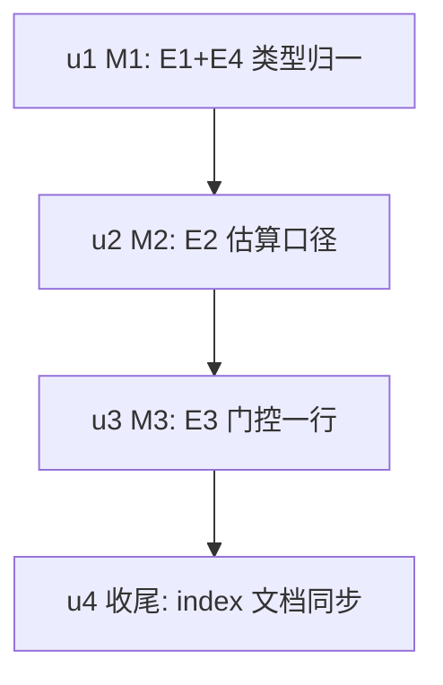

# ext-simplify-09 smart-context 实施计划

基线: 009a303d6 | 来源设计: docs/design/ext-simplify-09-smart-context.md | 日期: 2026-09-12
审查证据: `.review/ext-simplify-09.md`（主审聚焦复审 R1：0 must-fix / 0 suggestion）+ `.review/ext-simplify-09-impact.md`（影响面聚焦复审 R1：0 must-fix）；suggestion 已全部闭合（设计附录 v3）。

## 0 章节映射

| 内容 | 本文实际位置 |
|------|--------------|
| 背景/目标 | §1 背景（关键不变量表）+ §2 设计目标（G1-G4 + In/Out-of-scope） |
| 终态/机制 | §4 终态 + §5 决策与执行项（D1-D4 + §5.6 执行项总表 E1-E4 + §5.7 移交清单 T1-T6）+ §6 实现机制/文件地图/文档同步 |
| 验收场景表 | §7（场景 1-4） |
| 下一层拆分 | §8（8.1 迁移路径 M1-M3 / 8.2 拆分 U1-U4 / 8.3 待验证） |
| 待验证检查点 | §8.3（parameters cast 去留、vitest importOriginal 形态、fixture 形态约束、index.ts:153 可选链、场景 1 偏差观察） |

## 1 目标快照（逐字摘录设计 §2）

> **改造后维护者能做到：token 估算只认 pi 一个口径源、事件类型只认 SDK 一个权威源、门控规则只改一处；agent 的工具重会话不再被收缩校验误拒。**
> 1. **G1 估算口径归一（行为修复）**：被压段估算与 pi 自身核算同源（`estimateTokens`），toolCall arguments 与 thinking 块计入分母，工具重会话的合法摘要不再被误判膨胀（验证 §7 场景 1）。
> 2. **G2 类型权威源唯一**：Like\*Event×5 与 ToolInfoLike 删除，事件/工具类型 = pi SDK 类型面（包根缺席的符号经 `on()` 重载/函数体类型推断对齐，见 §5.1）；SDK 演进编译报错而非静默漂移（验证 §7 场景 3）。
> 3. **G3 门控单一来源**：D5 门控判定只在 `isGatingActive` 一处，接管 handler 不再手写第二份（验证 §7 场景 4）。
> 4. **G4 宿主表面不变**：配置 schema、compaction entry details 形状、renderer 设置页读写零变化（验证 §7 场景 5）。

Out-of-scope（逐字）：移交清单 T1–T6（§5.7，移交 code-simplify）；双模式接管机制、3 档阈值提醒、R2 降级态（本质复杂度，不动）；SimpleResponseLike 与 CompactionResultLike（不在核对面）；estimateTextTokens 维持现状。

## 2 单元列表

| Unit | 职责 | 领地（精确文件路径，均在 `extensions/universal/smart-context/` 下） | 依赖 | 隔离 | 验收条款 |
|---|---|---|---|---|---|
| u1 = M1/E1+E4 | SDK 类型归一：删 5 个 Like 接口 + BeforeCompactDecision 返回类型走推断 + 两处 cast 删除 + 直接注册 + ToolInfoLike→ToolInfo | src/compact-handler.ts、src/index.ts、src/llm.ts、src/__tests__/compact-handler.test.ts（fixture 同步：signal/timestamp/content block 数组，形态约束见设计 §8.3） | 无（根） | plain | `pnpm extensions:typecheck` 零错（P1，含设计期探针已预验的推断链）；`pnpm --filter @zhushanwen/pi-smart-context test` 绿 |
| u2 = M2/E2 | estimateShadowedTokens 重写（estimateTokens 求和 + Parameters 推导参数）+ 口径契约测试 + mock 工厂 importOriginal 化 + :341 补记 shadowedTokens | src/pure.ts、src/compact-handler.ts、src/__tests__/pure.test.ts、src/__tests__/compact-handler.test.ts | u1 | plain | P2 探针（importOriginal 形态）跑通；pure.test.ts 口径断言用例绿（toolCall-only/thinking-only > 0，旧口径下为 0）；包测试全绿 |
| u3 = M3/E3 | 门控谓词单行替换 `!isGatingActive(config, currentModelId)` + 补 import | src/compact-handler.ts | u2 | plain | 门控双用例绿（compact-handler.test.ts:79-80 空返回、tool.test.ts 门控拒绝）；包测试绿 |
| u4 = 收尾/文档同步 | ext-simplify-index.md「09 号行」裁决摘要与状态同步（设计 §6 文档同步段） | docs/design/ext-simplify-index.md | u3 | plain | index 行裁决摘要更新为「SDK 直标/省略标注推断、边界断言不可达」+ 状态列更新 |

## 3 DAG 图

顺序依据 = 设计 §8.1（U1 先行使调用点实参已是 SDK 精确类型，U2 重写无需边界 cast；U2 唯一行为变更独立验收；U3 单行等价）。

## 4 测试策略

- 增量（每单元）：`cd extensions/universal/smart-context && pnpm test`；u1/u2 加 `pnpm extensions:typecheck`
- 全量（收尾阶段 5）：`pnpm extensions:typecheck && pnpm extensions:lint && pnpm extensions:test`
- 验收场景（Gate B）：§7 场景 1/2/3 需本地 pi CLI 实测（`XYZ_AGENT_DEBUG=1 pi --mode rpc ... --extension extensions/universal/smart-context`，日志验证 `takeover ok` 双 token 字段）；场景 4 需 dev 应用设置页（可降级为配置文件直查 + entry JSONL 检查，如实记录）

## 5 合理偏差登记表

（初始为空）

## 6 状态表

| Unit | 状态 | 轮次 | 证据指针 |
|---|---|---|---|
| u1 | committed | 1 | `6018f70de`；typecheck 绿；49 passed；删除符号 grep 0 命中；cast 去留=删；deviation：fixture 多补 settings 必填字段（SDK 类型实测） |
| u2 | committed | 1 | `233b22298`；51 passed；typecheck 绿；P2 主路径跑通；deviation：逐消息 ceil 微差（pi 同源语义）+ debugLog 多行格式化 |
| u3 | committed | 1 | `f9d5b86f6`；51 passed；门控单一来源达成；deviation：index.ts:113/114 为跨界通知对比非门控双写（已核实设计基线） |
| u4 | committed | 1 | `d7f1264f0`；index.md 09 号行裁决摘要与状态已同步 |

## 7 残留风险与变更历史

- 残留风险：①projectTools 的 parameters cast 去留由 P1 typecheck 定案（报错则保留单点 cast + 注释）；②vitest importOriginal 形态（P2 降级路径已给）；③fixture 必填字段集以 tsc 报错为准逐个补齐（形态约束：content 锁定单 text 块，不得追加 thinking/toolCall 块——设计 §8.3）。
- 变更历史：2026-09-12 初版（来源设计 v3，双审查 0 must-fix 证据齐）。
- 2026-09-12 阶段 3 一致性审查后簿记修正：①u2 证据指针 shell 字面量改为真实 hash 233b22298；②u4 状态 pending→committed（d7f1264f0，当时漏翻）；③u4 领地行 :19 锚点改行号无关「09 号行」（与设计 §6 doc_error 修正在设计 v4 同步）。
- 2026-09-12 Gate B 组 2 证据（阶段 5）：场景 1 = pass（真实接管决定性证据：entry details.engine=smart-context，takeover ok 日志 summaryTokens=3990 < shadowedTokens=9075，无误拒无 inflated warn，分母与被压段 chars/4≈9538 量级相称）；场景 2 = pass（排除模型下 /compact 走原生无 takeover 日志 + compact_context 拒绝带恢复指引 + 未排除下同工具放行——isGatingActive 双入口同源）；场景 3 = pass（三连 typecheck/lint 绿；test 三连中 pi-subagent-cli 3 用例为高并行负载 timeout flaky——失败文件单独复跑全绿且失败包不在本设计改动面；CLI 事件冒烟 model_select/agent_settled/压缩接管三链路 0 error）；场景 4 = pass + 局部 blocked（配置四字段 schema 与 entry details 三字段形状逐字一致 pass；GUI 设置页子项 dev 应用未运行，blocked 如实登记，静态对照四字段引用仍在）。环境校准注记：pi 默认 keepRecentTokens=20000 门槛需隔离 agentDir settings 调低后才可触发 manual compact（环境校准非缺陷）；全局 pi CLI 0.85.1 与 worktree 实装 0.84.4 并存，CLI 验收须 --no-extensions（与 03 组 1 发现一致）。
