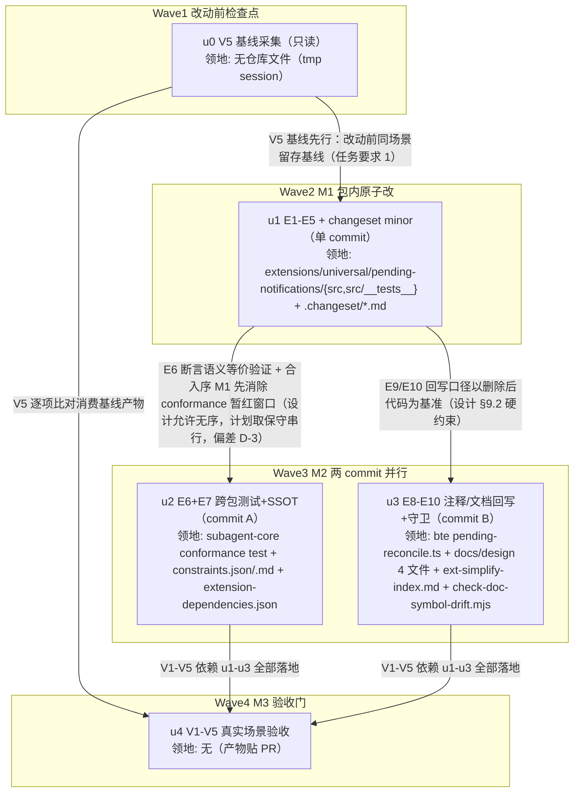

# ext-simplify-12（pending-notifications 死代码删除 + registry 现算化）实施计划

基线: 3d1d396f0 | 来源设计: docs/design/ext-simplify-12-pending-notifications.md | 日期: 2026-09-12

审查证据: 主审 `.review/ext-simplify-12-review-r2.md`（0 must-fix + 2 suggestion + 5 INFO）+ 影响面 `.review/ext-simplify-12-review-impact-r2.md`（0 must-fix + 2 suggestion + 2 INFO）。4 条 suggestion（主审：E9 补 base-tool-enhance.md:192 行为断言行、§9.3 清扫口径显式化 + R9 报告豁免登记；影响审：13 号协调约束双登记至 `ext-simplify-index.md` 13 号行、E10 清扫/回护不对称登记）已由设计文档 v3 第 2 轮修订全修（见设计文档附录「修订记录 · 第 2 轮」逐条对照，含实跑/实读自证），无未修项。

## 0 章节映射

| 计划所需 | 设计文档实际位置（§ 编号 + 节标题原文） |
|---|---|
| 背景/目标 | 开篇「开篇（SCQA）」（无编号）· §1「背景：被设计的系统是什么」· §2「设计目标」（含 In-scope / Out-of-scope 清单） |
| 终态/机制 | §5「终态：使用者眼里将是什么样的」· §6「关键决策与权衡」（6.1 D1 / 6.2 D2 / 6.3 D3 / 6.4 D4）· §7「实现机制（把终态落到代码层）」（E1-E10 执行项表 + 错误规格不变量） |
| 验收场景表 | §8.1「改动规模」（回归兜底口径）· §8.2「验收场景」（V1-V5 表 + 依赖说明） |
| 下一层拆分 | §9.1「迁移路径」（M1/M2/M3 + minor bump 裁决 + 13 号协调约束）· §9.2「下一层拆分」（u1-u5 表） |
| 待验证检查点 | §6.5「探针清单与审计修正记录」（P1-P3 探针表）· §9.3「待验证检查点（诚实标注）」（4 条） |

## 1 目标快照

**背景（设计 §1 首段逐字）**：

> pending-notifications 解决的问题是「后台异步任务的活跃状态对 LLM 不可见」：主 agent 派出 workflow run / 后台 subagent / bash 后台任务后，这些任务的生命周期跨越多个 turn，LLM 需要随时知道「还有什么在跑」来决定是否等待。本包是这条链路的落盘与查询中枢。

**目标（设计 §2 逐字，5 条）**：

1. **entries 单一权威源**：本包内不再存在第二份 pending 状态——工具投影与写入侧判断与 goal/bte/subagent-workflow 读同一份 entries 差集；「落盘了什么」与「查询到什么」在结构上不可分歧。
2. **主链路零回归**：注册/注销落盘契约（entry 形态）、`countActiveFromEntries` 签名与行为、`pending_notifications` 工具 count/list 输出语义，全部与现状一致；写侧去重语义与现状**语义等价**，附带三条显式登记的边缘差异（fork 残留跨 session 注销口径、fork 残留同 id 重复注册口径、id 复用去重窗口——均被 per-session EventBus / id 全局唯一前提约束为理论窗口，见 §6.1 边缘差异登记）。
3. **删 session 档死机器**：PENDING_TTL_MS、isExpiredEntry、expiredToFlush、TTL 回填、session_start 补 flush 循环、session_shutdown handler 及其测试用例整体移除；分档常量 `PENDING_LIFECYCLE` 一并删除（D2 裁决）。
4. **导出面收敛**：npm 具名导出从 14 个收敛到 5 个（default 出口不计；唯一消费函数 + 其签名所需类型）。
5. **SSOT 同步**：C-proc-13 ③ 的读侧消费枚举随 rebuild 删除同批回写（C-proc-10 纪律）。

**Out-of-scope（设计 §2 逐字）**：

- 13 号设计文档（`ext-simplify-13-base-tool-enhance-protocol.md`）本身的任何修改——其 D5 计划新增注释的前提在本设计终态下失效，按 §6.4 协调约束由 13 号实施批自行按本文档终态调整措辞，本文档不予代改；
- bte 对账机制本身（registry 读取、kill(pid,0) 判据）——已核实非过度，其协议重构归 13 号设计（本设计仅触及一处注释行与 `docs/design/base-tool-enhance.md` 中引用本包被删符号的段落回写）；
- cw-tool 包——同单元审计结论为职责正交、无过度设计，不出现在本设计；
- EventBus 订阅的 unsubscribers 双重清理（pi 已自动退订 + 手工兜底）——审计四问记录判为「留观」的 12 行防御，本设计不动；
- goal / subagent-workflow / core 的任何改动（它们只消费 `countActiveFromEntries`，签名不变即零影响）。

## 2 单元列表

拆分种子 = 设计 §9.1 迁移路径（M1/M2/M3）+ §9.2 u1-u5 表 + §7 E1-E10 执行项。设计 u1/u2/u3 合并为计划 u1（偏差 D-1）、设计 u4 拆为计划 u2/u3（偏差 D-2），映射与理由见 §5 偏差登记表。所有领地路径已实读核实存在（例外见偏差 D-7：无）。

| Unit | 职责（设计映射） | 领地（精确文件路径） | 依赖 | 隔离 | 验收条款 |
|---|---|---|---|---|---|
| u0 | V5 基线采集（独立检查点，任务要求「基线先行」；设计 §8.2 V5 前置步骤 + 主审第 1 轮 S 修复项） | 无仓库文件改动（只读现有代码跑真实场景；session 落 `mkdtemp` tmp 目录） | 无（根节点，先于一切代码改动） | plain | ① 改动前代码上跑通 V5 场景（真实 goal + 派后台任务）；② 三件基线产物齐：session JSONL 的 goal:log entry 序列、defer/等待通知出现次数与文案、pending 查询输出；③ 产物留存路径登记到本计划 §6 状态表（摘录贴实施 PR，不入库）；④ `git status` 干净（零仓库文件改动） |
| u1 | M1 包内原子改（设计 §9.2 u1+u2+u3 合并；E1+E2 state.ts 收敛 → E3+E4 index.ts 现算化与导出面收敛 → E5 本包测试改写；单 commit） | `extensions/universal/pending-notifications/src/state.ts`（E1+E2：删 PENDING_TTL_MS :96 / isExpiredEntry :287-300 / RebuildResult·expiredToFlush :222-227·:311 / rebuildFromEntries :302-342 / TTL 回填分支 :372-380 / PENDING_LIFECYCLE :40-44 / PendingEntry.expiresAt :62；新增 helper `hasPendingId`/`isPendingActive`；:1-15 职责头注重写） `extensions/universal/pending-notifications/src/index.ts`（E3：两 listener 前置判断改现算 :166/:198、工具 execute 改 countActiveFromEntries :277-279、session_start 缩为设 currentSessionId :214-236、session_shutdown 删除 :246-261、写入侧 expiresAt 删除 :153-161·:172-181；E4：导出块收敛 14→5 :52-67、头注重写 :19-27 与 :49-51） `extensions/universal/pending-notifications/src/__tests__/pending-notifications.test.ts`（E5：删死代码断言三用例 :207-233·:395-405 与 rebuild/registry/shutdown describe :195-272·:287-321·:394-412；存余用例改 countActiveFromEntries 等价断言；runTool mock ctx 与 appendEntryMock 联动同步 push 共享 entries 数组；新增「对账已落盘后收尾 emit 不重复落盘」用例） 新增 `.changeset/<kebab-case-name>.md`（`"@zhushanwen/pi-pending-notifications": minor`，描述 entries 单一权威源 + 死代码删除 + 导出面收窄；不在本 PR 手改 package.json version，见偏差 D-6） | u0 | plain | ① `cd extensions/universal/pending-notifications && npx tsc --noEmit` 绿；② `npx vitest run` 绿（含新增「不重复落盘」用例）；③ `rg -n "PENDING_TTL_MS\|PENDING_LIFECYCLE\|rebuildFromEntries\|createRegistry\|isExpiredEntry\|expiredToFlush\|getActive\|PendingRegistry" extensions/universal/pending-notifications/src/` 零命中；④ src/index.ts 具名导出恰 5 个（countActiveFromEntries + CountActiveOptions/CountActiveResult/PendingEntry/PendingType）；⑤ 根三连 `pnpm extensions:typecheck && pnpm extensions:lint && pnpm extensions:test` 绿；⑥ changeset 文件存在且标 minor；⑦ 已知中间态豁免：`pnpm --filter @zhushanwen/subagent-core test` 此时**预期红**（conformance 旧测试 import 被删符号），由 u2 收口，不阻塞 u1 commit（设计 §9.2 INFO-4 登记） |
| u2 | 跨包测试连带 + SSOT 回写（设计 §9.2 u4 前半；E6 conformance 改写 + E7 C-proc-13 ③ 回写；M2 commit A） | `packages/subagent-core/src/execution/engine/__tests__/conformance/registry-fork-filter.test.ts`（E6：import 改写 :30-36——PENDING_TTL_MS → 本地字面量 `10 * 3_600_000 + 1` 保「远超旧 1h TTL」语义注释；删「PENDING_LIFECYCLE 翻档断言」describe :72-75；「翻档后跨时长无 TTL 清理」:77-89 与「registry rebuild 投影」describe :133-148 改写为 countActiveFromEntries 等价断言：三类型超 TTL 仍 active / 跨 session 残留不进差集） `docs/constraints.json`（E7：C-proc-13 summary ③ 读侧消费枚举「countActiveFromEntries/subagent-workflow 后代判定/registry rebuild+工具投影/goal 守卫口径」→「…/pending_notifications 工具投影（entries 现算）/goal 守卫口径」；「禁回翻 session 档」机理表述保留） `docs/constraints.md`（E7 生成物：跑 `node scripts/render-constraints.mjs` 重新生成） `extension-dependencies.json`（E7 顺带：核实 :26 subagent-workflow 依赖项 reason「pending-notifications 消费该事件并向用户发送完成通知」——完成通知实由 subagent-workflow bg-notify-render 承担，失实则同批修正） | u1 | plain | ① `rg -n "PENDING_TTL_MS\|PENDING_LIFECYCLE\|rebuildFromEntries\|createRegistry" packages/subagent-core/src/execution/engine/__tests__/conformance/registry-fork-filter.test.ts` 零命中；② `pnpm --filter @zhushanwen/subagent-core test` 全绿（含改写后三组语义断言）；③ constraints.json C-proc-13 ③ 新措辞落位且不含「registry rebuild」；`node scripts/render-constraints.mjs` 跑过、重跑内容无 diff（生成日期戳除外——render-constraints.mjs:156 写入当日日期，晚于生成日的重跑字面必带日期行 diff；md 与 json 同步）；④ extension-dependencies.json reason 与现状一致（核实记录写入 commit message）；⑤ `pnpm extensions:typecheck` 仍绿 |
| u3 | 注释/文档回写 + 守卫登记（设计 §9.2 u4 后半；E8 bte 注释行 + E9 docs 悬空引用/行为断言失实回写 + E10 DOC_MODULE_MAP 登记；M2 commit B；单元内顺序 E8 → E9 → E10） | `extensions/universal/base-tool-enhance/src/background/pending-reconcile.ts`（E8：:113-115 注释删「pending 自身 TTL 之外的」措辞，改为「pending-notifications 已无任何 TTL 清理，差集残留由 next-session 对账重查收口」；禁写「本包」——落点在 bte 文件内会被读成 base-tool-enhance） `docs/design/chat-domain-v1x-liveness-governance.md`（E9：:102/:126/:267/:270/:346——:270「机制本体保留」处置登记按 D2 推翻后口径更新；历史事故/决策段按守卫「反引号=现行符号」约定去反引号或标注已删除） `docs/design/chat-domain-v1x-liveness-governance.impl-plan.md`（E9：:41） `docs/design/base-tool-enhance.md`（E9：:175/:191/:192/:326/:328——:175 D16 标注分档常量已删；:192「读取侧对缺失 expiresAt 回填 1h TTL」行为断言随 E1 回填分支删除更新，该行是 13 号设计事实地基、必改） `docs/design/pi-session-start-handler-idempotency-audit.md`（E9：:21——豁免依据改「handler 无写操作，双派发天然无害」） `docs/design/ext-simplify-index.md`（12 号行「PENDING_LIFECYCLE 注释失实」字样按删除后口径顺手处理——设计修订记录第 2 轮 INFO-3；13 号行协调注记已落位勿动） `scripts/check-doc-symbol-drift.mjs`（E10：DOC_MODULE_MAP 补两条 `'docs/design/chat-domain-v1x-liveness-governance.md'` 与 `'.impl-plan.md'` → `['extensions/universal/pending-notifications/src']`；bte.md 不入映射的不对称按设计 E10 边界句如实登记进脚本注释） | u1（设计 §9.2 硬约束：E9/E10 回写口径以 M1 删除后代码为基准，先行会产生反向漂移） | plain | ① `rg -n "自身 TTL" extensions/universal/base-tool-enhance/src/background/pending-reconcile.ts` 零命中；② rg 8 个被删符号（PENDING_TTL_MS / PENDING_LIFECYCLE / rebuildFromEntries / createRegistry / isExpiredEntry / expiredToFlush / getActive / PendingRegistry）× `docs/` 全目录：除显式豁免（本设计文档、本 impl-plan、`docs/todo/subagent-workflow-sidebar-sync-plan-review-r9.md:5` 历史快照）与异系统同名符号（pi.getActiveTools / statusline createRegistry / bte getActiveTasks 等，按符号所属系统判别）外归零；③ `node scripts/check-doc-symbol-drift.mjs` 实跑绿；④ `cd extensions/universal/base-tool-enhance && npx vitest run` 绿（改注释不红的实证）；⑤ `pnpm extensions:lint` 绿 |
| u4 | 真实场景验收 V1-V5（设计 §9.2 u5 / §9.1 M3 门；非单测非 mock：`pi --mode json --session-dir <tmp> --extension <本包> --extension <伴 ext> --model <真实模型> --approve` + stdin JSONL；场景/通过标准逐字照设计 §8.2 表执行） | 无代码领地（验证型；产物 = JSONL 摘录 + 查询输出，贴实施 PR） | u0（V5 比对基线）+ u2 + u3（全部落地） | plain | ① V1-V5 五场景全部 pass（各场景通过标准逐条对照设计 §8.2 表，含 V2③「恰一条 unregister entry」互斥断言、V3 三步、V4a「子 session JSONL 无本包新写 entry」、V4b 不落第二条 unregister）；② V5 与 u0 基线逐项一致（goal:log entry 序列 / defer 通知次数与文案 / pending 查询输出）；③ V1 复核 P1（appendEntry 同步入账）、V4b 复核 P2、V4a 复核 P3——探针状态回填本计划 §7；④ 产物贴 PR，状态表更新 |

## 3 DAG 图

拓扑核验：关键路径深度 = 4（u0→u1→u3→u4），满足 ≤4；最大反链宽度 = 2（u2 ∥ u3，领地互斥可并行）；无 u-contracts 单元——本任务是删除性重构而非纯平移，u1→u2/u3 的依赖是「回写口径/语义断言以删除后代码为基准」的行为依赖，非可 stub 的静态 import（契约先行禁用条件命中：会用 stub 掩盖真实行为依赖）。

Commit 映射（执行期 subagent 禁 git，commit 由主会话核验验收条款后执行）：u1 → commit 1（M1，E1-E5 + changeset 同 commit，设计 §9.1 裁决）；u2 → commit 2（M2-A，E6+E7 单 commit）；u3 → commit 3（M2-B，E8-E10 单 commit）；u4 → 无 commit（验证产物贴 PR）。

## 4 测试策略

**真实读取的测试入口**（2026-09-12 实读）：

| 层 | 命令 | 说明 |
|---|---|---|
| 本包单测 | `cd extensions/universal/pending-notifications && npx vitest run` | package.json scripts：`typecheck: "npx tsc --noEmit"` / `test: "vitest run"`；vitest.config.ts 已配 `reporters: ["default","junit"]` + junit 落盘，include `src/__tests__/**`；既有测试用 fake timers + 最小 mock ExtensionAPI（u1 改写沿用该框架，框架 vitest） |
| 根三连（回归兜底） | `pnpm extensions:typecheck && pnpm extensions:lint && pnpm extensions:test` | `extensions:test` = `pnpm -r --filter '@zhushanwen/pi-*' test`，一次覆盖本包 + goal + subagent-workflow + bte |
| conformance（跨包连带） | `pnpm --filter @zhushanwen/subagent-core test` | 包名实读 `@zhushanwen/subagent-core`；受影响用例 = `registry-fork-filter.test.ts`（u2 改写） |
| bte 对账回归 | `cd extensions/universal/base-tool-enhance && npx vitest run` | 改 :115 注释行后必须跑绿；实读 `src/__tests__/pending-reconcile.test.ts`（import 函数断言、无注释文本断言）+ `maintenance-once.test.ts`（vi.mock 模块）——影响审 R2 攻击点①证实零注释锚点，预期绿 |

**受影响测试同批改写面**（设计点名列示，全部落在对应单元领地内）：

- `extensions/universal/pending-notifications/src/__tests__/pending-notifications.test.ts`（u1/E5）：删「断言死代码是死」三用例（:207-218 U3 / :220-233 U4 / :395-405 U11）与 rebuild/registry/shutdown describe；存余用例改写到 countActiveFromEntries 等价断言；mock 联动改造（appendEntry 同步 push 进共享 entries 数组，模拟 pi SDK 同步入账——P1 的单测层镜像）；新增「bte 对账已落盘后收尾 emit 不重复落盘」用例（P2 单测层门）。
- `packages/subagent-core/.../conformance/registry-fork-filter.test.ts`（u2/E6）：import 面收窄到 `countActiveFromEntries`；「翻档事实」describe 删除（PENDING_LIFECYCLE 断言随常量删除失去对象）；两 describe 改写为差集等价断言（P3 语义覆盖）。

**消费方回归面（任务要求 2，零改动面实证）**：

- goal：`agent-end.ts:23`（import）/:202/:342（三处 countActiveFromEntries 调用，均带 currentSessionId 基准）——签名不变零改动；回归靠 `pnpm extensions:test` 全量跑含 `src/__tests__/circuit-breaker.test.ts`。
- subagent-workflow：`pi-host.ts:36`（import）/:211（端口适配 countActiveFromEntries）——回归靠 `pi-host.test.ts` / `pi-host-notify-ports.test.ts`（extensions:test 全量覆盖）。
- bte 投影：`pending-reconcile.ts` 对本包零符号依赖（直接 appendEntry）——回归靠 bte 包测试 + u4 V2 真实场景实证。

**验收测试（u4）**：真实 pi CLI + 真实模型 + 伴生 extension（subagent-workflow / base-tool-enhance），场景与通过标准逐字照设计 §8.2 V1-V5 表；V2③/V3③ 的 SIGTERM/SIGKILL 退出形态、V4 的 fork 触发源均按设计表执行，不得替换为 mock。单测与 typecheck 仅作回归辅助，不计入验收（设计 §8 章首）。

## 5 合理偏差登记表

| # | 偏差 | 理由与依据 |
|---|---|---|
| D-1 | 设计 §9.2 的 u1/u2/u3 合并为计划 u1（M1 单元，单 commit） | 设计「u1 typecheck 可独立验」不成立：实读 `src/index.ts:34-47` import 了 E1/E2 删除的全部符号（createRegistry/getActive/PENDING_LIFECYCLE/PENDING_TTL_MS/rebuildFromEntries/register/unregister/PendingRegistry），u1 单独落地必使包 typecheck 红。设计 §9.1「M1 单 commit（避免红窗口）」才是真正的原子性边界；合并后 4 文件约 1500 行，在 subagent ≤5 文件 / ~3000 行限额内 |
| D-2 | 设计 §9.2 的 u4（E6-E10）拆为计划 u2（E6+E7）+ u3（E8+E9+E10） | 设计 §9.1 M2 本就是两 commit（「E6+E7，单 commit」「E8-E10，单 commit」）；合并则 10+ 文件超 subagent 5 文件限额。拆后两单元领地互斥（u2 = subagent-core 测试 + constraints 面；u3 = bte 一行 + docs 面 + 守卫脚本），可并行派发，与 §9.1 的 M2 两 commit 结构一一对应 |
| D-3 | u2 对 u1 取串行边（设计 §9.2 称「E6/E7/E8 与 M1 无序依赖」） | DAG 规范「拿不准默认加串行边（保守正确）」；合入序 M1 先行消除「conformance 暂红中间态」的判断与沟通成本。代价仅调度串行化（u2 本可与 u1 并行的收益放弃），无正确性影响。E6 改写后仅 import countActiveFromEntries（前后均存在），先于 M1 落地技术上可行，如需抢并行可松绑此边 |
| D-4 | u3 领地 7 文件，超「≤5 文件」指引 | E9 的 4 个 docs 文件均为 ≤11 行级措辞回写 + bte 一行注释 + 一条映射登记 + index.md 一处字样，总改动量约 20 行；E9→E10 有硬依赖（登记映射后守卫实跑须绿，依赖 E9 清扫先完成）必须同单元，再拆即碎片化 |
| D-5 | V5 基线产物不入库（不新增仓库文件） | 基线 JSONL 摘录与查询输出贴实施 PR 描述 + 留存路径登记 §6 状态表；独立为 u0 检查点满足任务要求「首个开发单元的前置动作或独立检查点」的后者 |
| D-6 | changeset 只新增 `.changeset/*.md` 声明 minor，不在本 PR 手改 package.json version（保持 0.6.0） | 本仓发布纪律（AGENTS.md）：PR 阶段只加 changeset 文件（type 初判、最终人工定），版本号由 merge 阶段 changeset version 生命周期统一 bump。设计的「minor bump（0.6.0→0.7.0）」通过 changeset minor 声明兑现，随 u1 代码同 commit（任务要求 3 的「同 commit」落到 changeset 文件与代码同 commit） |
| D-7 | 导出面计数口径：任务输入写「15→5」，以设计 v3 正文「14 具名导出 → 5（default 出口不计）」为准 | 设计第 1 轮审查 INFO-2 已修正口径并全文统一（实数 src/index.ts:52-67 为 14 具名 + default 出口）；本计划目标快照与验收条款均按 14→5 |
| u1-dev-1 | session_start handler 缓存 sessionManager 到闭包 + currentEntries() helper（设计 §6.1⑤「缩为设 currentSessionId 一行」的实现细化） | 现算方案下 EventBus 回调无 ctx 参数，写侧前置判断的 entries 读取通道必须在 session_start 缓存；未 session_start 前返回空数组 = 等价历史空 registry 放行口径 | handler 仍零写操作，语义不变；验收③符号扫描不受影响 | 合理偏差，接受 |
| u1-dev-2 | safeAppendEntry 错误用例断言方向反转（原「落盘失败内存 registry 仍更新」→ 终态「落盘失败 → entries 无注册 → 工具查不到且 listener 未坏」） | 设计 §5.2 显式登记的终态行为（消除工具/守卫分裂） | 非回归，是终态语义 | 合理偏差，接受 |
| u1-dev-3 | 测试 fixture makeRegisterEntry 默认 data 移除 expiresAt 键 | 对齐终态写入形态（E5 改写面内实现细节） | 「读取侧不校验历史 expiresAt」用例改经 extra 注入该键，覆盖保留 | 合理偏差，接受 |

领地核实例外：无。所有领地路径实读核实存在，行号锚点与设计 §7 执行项表逐条吻合（E1/E2 的 state.ts 行号、E3/E4 的 index.ts 行号、E5 的测试 describe 区段、E6 的 conformance import/行号、E8 的 pending-reconcile.ts:115 原文「pending 自身 TTL 之外的」、E7 的 C-proc-13 ③ 原文枚举、E10 的 DOC_MODULE_MAP 10 条目零覆盖本组、extension-dependencies.json:26 失实 reason 原文——全部实读确认）。

## 6 状态表

| Unit | 状态 | commit | 产物/备注 |
|---|---|---|---|
| u0 V5 基线采集 | committed | 1 | 零仓库改动。基线留存 /tmp/ext-simplify-12-u0-v5-iQxi/（13 session JSONL + 3 产物 + 驱动日志，勿清理）；主基线 = sessions-v5b/。三件产物：① goal-state 状态机 active→complete/blocked + goal:log 序列 + entry 类型清单；② defer 通知 0 次（14 轮实测，触发契约锚点 agent-end.ts:202-225 登记）；③ pending 工具输出全形态（list/count/归零/空）。命令形态：pi --mode rpc + -e 显式入口 + --no-extensions 隔离。deviations 5 条见报告（CLI 0.85.1 与 u4 同版本可比；defer 0=0 比对口径成立） |
| u1 M1 包内原子改（E1-E5+changeset） | committed | 1 | 编排方核验（领地 4 文件吻合 + 包测试 32 绿重跑 + pathspec 提交）。验收①-⑦全过（删除面 rg 零命中 / 导出恰 5 / 根三连绿 / ⑦ conformance 预期红定位 u2 领地）。deviations 3 条见下 |
| u2 跨包测试+SSOT（E6+E7） | committed | 1 | 编排方核验（领地 4 文件吻合 + render 幂等复核 + drift 绿）。验收①-⑤全过（subagent-core 2833 tests 全绿收口红窗口；constraints 新措辞落位 + md5 幂等；extension-dependencies reason 三处失实修正）。deviations 3 条合理（头注行号漂移清理 / reason 修正扩围在授权内 / C-proc-13 追加删除登记属 C-proc-10 精神） |
| u3 注释/文档回写+守卫（E8-E10） | committed | 1 | 编排方核验（领地 7 文件吻合 + drift/「自身 TTL」断言重跑绿）。验收①-⑤全绿（8 符号 docs/ 扫描逐处判别归零 + bte 242 tests + lint）。deviations 4 条合理（E10 映射扩 4 模块实测自证 / ENGINE_ 白名单本体修正 / :84 顺手修正属 C-proc-10 / 去字面量+标注弥合口径差） |
| u4 真实场景验收 V1-V5 | done | 无（验证型，产物贴 PR） | 验收①-④全过（编排方核验：git 零残留改动 + 产物证据抽查一致）。V1-V5 五场景全 PASS：V1 同 turn register 落盘→list 立见（P1 PASS + 秒死轮负向对照）、V2 三段（bte 投影 count 1→0 / resume 直读 0 / SIGTERM 收殓后恰 1 条 unregister=cancelled）、V3 三步（kill -9 续存 1→孤儿自然完成同进程仍 1→二次 resume 对账收口 0）、V4a fork 子 session count=0 零新写（P3 PASS）、V4b 两条对账链 unregister count 均=1（P2 PASS）；V5 与 u0 基线 v5b 逐项一致（goal-state 序列 / goal:log 逐字段 / pending entry 形态含 background-bash:1 / 工具输出文案 / defer 0=0 / notify 四条结构）。探针 P1/P2/P3 全 PASS，§7 检查点全部关闭。产物留存 /tmp/ext-simplify-12-u4/（sessions-v1c/v2b/v3/v5 + u4-*-evidence.txt 4 份 + 驱动日志 + git 起止快照）。deviations 4 条合理：V1 subagent 以 schema 既有参数 engine=zcode 派发（pi inproc 引擎已从仓删除，register/unregister 契约与引擎无关）；V5 重跑 LLM 非确定性微差不触及比对项；u0 artifact-1 漏登 background-bash:1 属提取脚本口径（基线原始 JSONL 复核两侧一致）；跑测期间并行流水线 11 文件修改态（非本领地）未动用豁免 |
| 阶段 5 双级验收 | pass | — | Gate A 全绿 + Gate B PASS（V1-V5 证据链逐行核验全 pass + u0/u4 产物目录核实存在；真实抽验注册→归零 pass：count 1→0、register/unregister 各恰一条）。报告留档 .review/stage5-gate-a-report.md、stage5-gate-b-report.md |

## 7 残留风险与变更历史

**设计「待验证检查点」逐条转入**（设计 §6.5 探针表 + §9.3）：

| 检查点 | 内容 | 落地单元 | 失败降级 |
|---|---|---|---|
| P1（§6.5 + §9.3 条 1） | appendEntry 同步入账：listener 落盘后 getEntries() 立即可见（现算方案物理前提；已有 pi 0.84.4 dist 实读证据 agent-session.js:2022-2028 → session-manager.js:756-760） | u1 单测层镜像（mock 同步 push）+ u4 V1 真实场景复核 | 实测出现可见性滞后 → D1 重审回退方案 A（保留 registry），其余决策不受影响 |
| P2（§6.5 + §9.3） | 写侧前置判断现算与内存语义等价：重复 register 不二次落盘、已注销 id 的 unregister 不落盘 | u1 E5 等价改写用例 + 新增「对账已落盘后收尾 emit 不重复落盘」用例（实施期门）+ u4 V4b 真实场景（对账尽力补 emit 构成重复 unregister 输入） | 核对 hasPendingId/isPendingActive 与内存五件套差异点，修 helper 而非回退方案 |
| P3（§6.5 + §9.3） | 跨 session 残留过滤：fork 继承的父级注册不进工具投影 | u2 conformance 改写语义覆盖 + u4 V4a CLI fork 场景实测 | 核对工具 execute → currentSessionId 基准传参链，基准断链时优先修传参 |
| §9.3 条 2 | 文档悬空清扫不依赖守卫兜底：扫描口径 = 8 个被删符号 × docs/ 全目录 + 显式豁免清单 + 异系统同名符号判别 | u3 验收条款 ② | 无（显式执行项，非「若有则处理」） |
| §9.3 条 3 | bte 对账在本包 registry 删除后的行为（对账零符号依赖，理论零影响） | u4 V2③/V3③ 重启后查询实证 | 无（实证型检查点） |
| §9.3 条 4 | PendingEntry.expiresAt 删除 + 导出面收窄的 npm 外部消费影响——四要素已显式判定接受（workspace 零改动 / git tag v0.6.0 回退或过渡 re-export / npm 发布后收到被删符号 issue 重审 / 接受） | 无实施动作；重审触发挂 npm 发布后的 issue 观察（发布流程外遗留观察项，登记于此） | 出现外部消费者报告 → 按恢复路径处置 |

**V1-V5 → 单元覆盖对照**：V1（注册→查询→注销→归零 + P1 复核）→ u4；V2（bte 投影一致性 + 伴生收口链三段）→ u4（机制正确性由 u1 单测层先行）；V3（强杀续存与孤儿收口三步）→ u4；V4（fork 过滤 V4a / 重复 unregister V4b）→ u4 + u1（P2 单测门）+ u2（P3 conformance 覆盖）；V5（邻居系统不变量）→ u0（基线先行）+ u4（同场景重跑逐项比对）。五场景全部有承接单元，无落空。

**残留风险**：

1. u1 落地至 u2 落地之间，`pnpm --filter @zhushanwen/subagent-core test` 存在红窗口（旧 conformance 测试 import 被删符号）——合入序中间态，PR squash 合并后无感（设计 §9.2 INFO-4 登记）；执行期两单元应同批推进勿跨日滞留。
2. E10 回护不对称：E9 清扫 4 文件中仅 chat-domain 两文档获守卫机检，base-tool-enhance.md 的 `PENDING_*` 悬空不机检（扩映射实测受阻：登记即红——:93 getAgentDir / :196/:333 getEntries 为 pi SDK 符号，需外部符号白名单机制，维护税与残余风险不匹配，设计已裁决不做）——未来该文档重新引入被删符号时靠 C-proc-10 流程纪律兜底。
3. bte 对账对「registry 条目缺失」罕见路径保守不动作的静态虚报（每孤儿 bash 注册至多 1 条），属 §5.2 既有显式边界，本设计不触碰（Out-of-scope），V3 通过标准已按此校准。

**变更历史**：

- v1（2026-09-12）：初稿。基于设计 v3（0 must-fix 收敛）+ 两份 R2 审查报告（各 0 must-fix，suggestion 已全修）；领地全量实读核实（E1-E10 行号锚点、测试入口、消费方回归面、changeset/config 惯例）；设计 §9.2 u1-u5 重整为 u0-u4 五单元（偏差 D-1/D-2/D-3），DAG 关键路径深度 4、反链宽度 2。
- v1.1（2026-09-12）：u0-u4 全部完成，状态表回填；§7 探针检查点 P1/P2/P3 经 u4 真实场景复核全 PASS（失败降级路径未触发），流水线收口。
- v1.2（2026-09-12）：阶段 3 一致性审查修复（§ 镜像目标段落随设计校准三条边缘差异）+ 阶段 5 双级验收 pass 回填（Gate A 全绿 + Gate B 注册→归零抽验 pass，报告 .review/stage5-gate-{a,b}-report.md）。
- v1.3（2026-09-12）：阶段 6 design-code-sync r1 修复（b6b9c1cb0，5 条 finding + 4 涟漪，聚焦复审 must-fix==0）：bte pending-reconcile.ts 头注/emit 注释 registry 时代失实描述重写为终态口径、本包头注 emit 端三组同口径、chat-domain 两文档 6 处过时断言补删除标注/终态口径。
