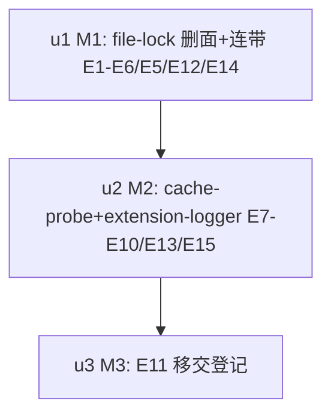

# ext-simplify-14 shared-libs 实施计划

基线: 9c04004d6 | 来源设计: docs/design/ext-simplify-14-shared-libs.md | 日期: 2026-09-12
审查证据: `.review/ext-simplify-14.md`（主审聚焦复审 R1：0 must-fix，3 suggestion 已修）+ `.review/ext-simplify-14-impact.md`（影响面聚焦复审 R2：0 must-fix）；suggestion 已全部闭合（设计附录 v4）。

## 0 章节映射

| 内容 | 本文实际位置 |
|------|--------------|
| 背景/目标 | §1 背景（锁统一架构图）+ §2 设计目标（4 条 + In/Out-of-scope，In-scope 含连带清扫 5 文件清单） |
| 终态/机制 | §4 终态（含守卫边界声明）+ §5 决策（D1-D4）+ §5.5 执行项总表 E1-E15 |
| 验收场景表 | §6（V1-V5 + V5 命令组围栏，含设计期实跑基线数字） |
| 下一层拆分 | §7（7.1 迁移路径 M1-M3 + 版本裁决 / 7.2 拆分 u1-u3 / 7.3 文件改动地图 / 7.4 待验证与已接受代价） |
| 待验证检查点 | §7.4（①external-removal 改 sync 断言形态、②worker 改 sync 竞争时序；③vitest 行为已验证 ✅） |

## 1 目标快照（逐字摘录设计 §2）

> 1. **删投机面**：file-lock 扩展包对外 API 与其真实消费面精确一致——只剩 `withFileLockSync`（2 个生产调用方全部用它），async 编排、退避公式、重复常量消失。
> 2. **声明与实装一致**：cache-probe 的 seq 字段注释与 README 不再声称不存在的消费方；extension-logger 的「三通道」描述、「参数漂移破坏互斥」注释修正为准确表述。
> 3. **导出面收敛**：三包中「外部零引用」的导出收窄，被 parity 测试与包内测试引用的锚点显式保留并登记理由。
> 4. **已核实面零回归**：sync 锁在真实跨进程竞争下行为不变（两进程并发 RMW 零丢失）；runtime 侧 async 锁（6 调用方）与 `/core` 子入口不受影响；extension-logger 机制行为不变。

Out-of-scope（逐字）：runtime 侧 file-lock.ts 的任何行为面；subagent-core 与 runtime 的任何行为面（连带清扫仅注释与登记表）；lock-core.ts 的协议与单次原语定位；extension-logger 限流/清理机制本体；cache-probe 的采集 schema；fileLog size cap 的实装（豁免登记）。

## 2 单元列表

| Unit | 职责 | 领地（精确文件路径） | 依赖 | 隔离 | 验收条款 |
|---|---|---|---|---|---|
| u1 = M1 | file-lock 删 async 面（E1-E6）+ 注释修正（E5 四处）+ 删面连带（E12 worktree-registry/data-source-registry + E14 bte 探针改写）+ file-lock version 0.2.1→0.3.0 | extensions/shared/file-lock/src/file-lock.ts、extensions/shared/file-lock/src/index.ts、extensions/shared/file-lock/src/lock-core.ts、extensions/shared/file-lock/package.json、extensions/shared/file-lock/src/__tests__/file-lock-backoff.test.ts（删）、extensions/shared/file-lock/src/__tests__/file-lock.test.ts、extensions/shared/file-lock/src/__tests__/file-lock-external-removal.test.ts、packages/runtime/src/utils/file-lock.ts（仅 :56-60 注释）、packages/runtime/test/file-lock-parity.test.ts（仅 :5 注释）、packages/subagent-core/src/execution/worktree-registry.ts（仅注释）、docs/architecture/data-source-registry.md（:110/:114）、extensions/universal/base-tool-enhance/src/__tests__/maintenance-once.test.ts | 无（根） | plain | V5-① 命令组 0 命中（基线 48 行 7 文件→归零，sleep 豁免）；V5-③ 双断言（^export 恰 1 行；withFileLock\|FileLockOptions 恰 2 行）；file-lock 包测试绿（V1 用例形态）；runtime parity 测试绿（V3）；`pnpm extensions:typecheck` 零错；bte 包测试绿（E14 改写后）；worktree-registry 零残留 |
| u2 = M2 | cache-probe（E7-E8）+ extension-logger（E9-E10、E13）+ E15 存量注释修正 + 版本 bump（cache-probe 0.1.3→0.2.0、extension-logger 0.4.1→0.5.0） | extensions/universal/cache-probe/src/index.ts、extensions/universal/cache-probe/README.md、extensions/universal/cache-probe/src/fingerprint.ts、extensions/universal/cache-probe/src/__tests__/fingerprint.test.ts、extensions/universal/cache-probe/package.json、extensions/shared/extension-logger/src/index.ts、extensions/shared/extension-logger/package.json、packages/subagent-core/src/core/logger.ts（仅 :16 注释）、extensions/shared/llm-shared/src/__tests__/config.test.ts（仅 :24 注释） | u1 | plain | V5-② 命令组 0 命中（5 个 export 声明消失、内部使用保留）；cache-probe/extension-logger 包测试绿；llm-shared 包测试绿（config.test.ts 注释改动无行为）；`pnpm extensions:typecheck && extensions:lint` 零红 |
| u3 = M3 | E11 移交登记（本表即移交清单，不实施） | 无（登记于设计 §5.5 E11 行） | u2 | plain | 登记确认：E11 未被本流水线实施，随 code-simplify 批次 |

## 3 DAG 图

顺序依据 = 设计 §7.1（锁是唯一正确性敏感面独立成单元；u2 纯文案/export 关键字级；C-proc-10 悬空引用与删符号同 commit）。

## 4 测试策略

- 增量：u1 → `cd extensions/shared/file-lock && pnpm test` + bte 包测试 + runtime 侧 `file-lock-parity.test.ts`；u2 → cache-probe/extension-logger/llm-shared 三包测试
- 全量（收尾阶段 5）：`pnpm extensions:typecheck && pnpm extensions:lint && pnpm extensions:test`
- 验收场景（Gate B）：V1（两真实进程 RMW 50 次终值 100，file-lock.test.ts 用例承载）；V2（pi CLI 实测 permission/rename-session 保存链路）；V4（cache-probe 采集 + analyze.py）；V5 命令组逐条实跑对照设计期基线

## 5 合理偏差登记表

| # | Unit | 偏差 | 定性 | 依据 |
|---|---|---|---|---|
| 1 | u1 | pnpm-lock.yaml 零变化（消费方均 workspace:* 协议） | 合理（预案未触发） | u1 汇报 |
| 2 | u1 | external-removal.test.ts 第二用例注释按 sync 语义补强一句 | 合理（§7.4 ① 预期内） | u1 汇报 |
| 3 | u1 | worktree-registry.ts 对齐目标列举补 extension 侧 pi-file-lock | 合理（列举补全） | u1 汇报 |
| 4 | u1 | 连带：scripts/check-layout-literals.mjs 登记 bundled session-reader 探测证据文案豁免（守卫恢复动作 3，存量源码字面量经 bundle 同步首次入扫域） | 合理（守卫指引路径） | commit 5cebdd5e7 |
| 5 | u2 | fingerprint.test.ts 15→14 用例：diffFingerprints(fp(), null) 分支经 buildProbeEntry 公有面不可达，语义由多字段变化用例等价承载 | 合理（设计给定改法的自然结果） | u2 汇报 |
| 6 | u1/u2 | V2（pi CLI 实测 permission/rename-session 保存链路）与 V4（cache-probe 采集 + analyze.py）无实跑证据 | 已关闭，见变更历史 Gate B 组 2（原定：阶段 5 Gate B 统一补跑，不静默跳过） | 14 区审查 unreasonable #2（medium） |

## 6 状态表

| Unit | 状态 | 轮次 | 证据指针 |
|---|---|---|---|
| u1 | committed | 1 | `5cebdd5e7`；V5-① 归零/③ 1+2 行；file-lock 17 + bte 242 + parity 4 绿；deviation：lock 零变化（workspace:*）+ external-removal 注释按 sync 语义补强 + worktree-registry 对齐目标列举补 extension 侧；连带：layout-literals 豁免登记（bundled session-reader 探测证据文案，守卫指引恢复动作 3） |
| u2 | committed | 1 | `13fcd0730`；V5-② 归零；cache-probe 22 + extension-logger 32 + llm-shared 52 绿；deviation：fingerprint.test 15→14 用例（diff null 分支经公有面不可达，语义由多字段变化用例等价承载）；lock 零变化 |
| u3 | committed（登记确认） | 0 | E11 未实施（移交 code-simplify）；登记载体 = 设计文档 §5.5 E11 行；无代码改动 |

## 7 残留风险与变更历史

- 残留风险：①file-lock-external-removal.test.ts 改 sync 后断言形态以测试绿确认（§7.4 ①）；②worker 改 sync 竞争时序等价性由 V1 终值断言兜底（§7.4 ②）；③版本 bump 后 pnpm-lock.yaml 若因 workspace 协议需要更新，随单元 commit 带上。
- 变更历史：2026-09-12 初版（来源设计 v4，双审查 0 must-fix 证据齐）。
- 2026-09-12 阶段 6 审查登记：stage-4 修复 b6c52f4d4（设计 v5 ① 契约段矛盾代码侧落地，extension 侧 `extensions/shared/file-lock/src/file-lock.ts`）；runtime 侧 `packages/runtime/src/utils/file-lock.ts` 契约段同款修正随阶段 6 F1 批次落地。
- 2026-09-12 Gate B 组 2 证据（阶段 5）：V2 = pass（隔离 agentDir 下 pi CLI 实测：/permission strict 触发 saveConfig→withFileLockSync 写 permission-ext-config.json 正确落盘；/auto-rename off 触发 rename-session-ext-config.json 落盘；config 目录 0 个 .lock 残留；两会话 0 个 ELOCKED 报错）；V4 = pass（3 个真实会话采集：baseline entry {v:2, seq:1, baseline:true, changed:['*']} + normal entry 增量形态 {seq:2, changed:['spFull']} + 跨 session skill 文件修改致 skills hash 变化；analyze.py exit 0 五部分输出正常）。本计划偏差 #6（V2/V4 待执行）就此关闭（登记表 #6 行同步置已关闭）。
