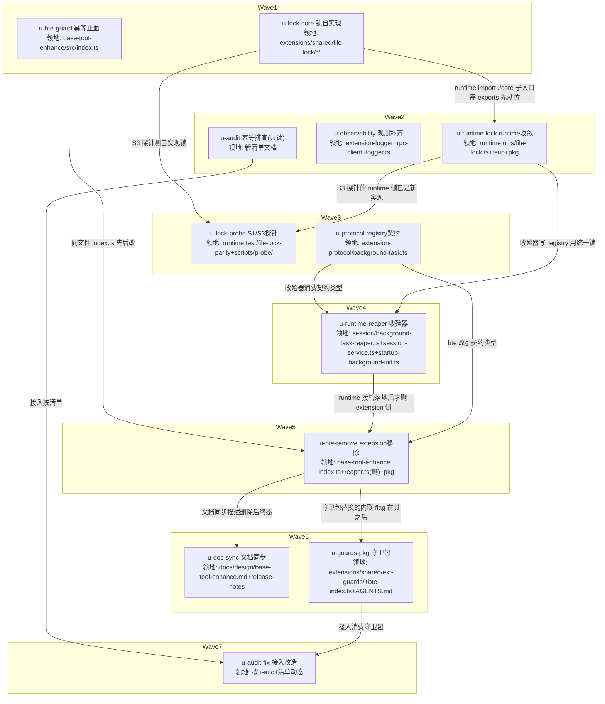

# 文件锁统一与收殓下沉 实施计划

基线: 58f2a4016 | 来源设计: docs/design/file-lock-unification-and-reaper-sink.md | 日期: 2026-09-01

## 0 章节映射

| 内容 | 设计文档实际位置 |
|------|----------------|
| 背景/目标 | §1 背景目标（G1-G4 + In/Out scope） |
| 终态/机制 | §2.3 目标态数据流 + §3.1 终态 + §3.2/§3.3 决策 D1-D4（含被否方案与探针标注） |
| 验收场景表 | §4 验收（S1-S7，批次对应见 §4 末行） |
| 下一层拆分 | §5 下一层拆分（批次 1/2/3 单元表 + 实施顺序依赖） |
| 待验证检查点 | §5 末「待验证检查点」3 条（#2 已由 Round 1 审查关闭） |

审查证据：设计文档状态行「4 轮对抗循环收敛：4M+8S → 1M+4S+2I → 1M+1S → 1I → 0」，tech-design-review agent 4 轮（R4 报告 must_fix=0），commit 58f2a4016。

## 1 目标快照（逐字摘录）

**G1（用户可见故障归零）**：冷启动后首次点击任意 session，100% 成功进入会话，不再出现「切换会话失败：pi process exited with code 1」。

**G2（职责正确）**：孤儿后台任务的收殓由 pi 生命周期的所有者（runtime）执行，extension 不再做全局扫描/全局锁；有孤儿时收殓仍然发生（功能不回归）。

**G3（防线显式）**：pi 的 factory 二调坑有统一守卫；受影响的 session_start handler 全部接入，双跑不再可能。

**G4（可观测）**：pi 进程异常退出时，完整 stderr 与 extension 日志默认落盘可查——本次排障依赖的 20 轮受控实验，下次应是一轮 grep。

**Out of scope**：不改 pi 源码/不提 PR（项目铁律）；不修 jiti（上游）；不处理 subagent relay 链路的锁（未受影响，见 §3.3 D1 备注）；不重做 extension-logger 的日志库选型。

## 2 单元列表

| Unit | 职责 | 领地（精确文件路径） | 依赖 | 隔离 | 验收条款 |
|------|------|---------------------|------|------|---------|
| u-lock-core | 锁自实现替换 @zhushanwen/pi-file-lock 内部（lock-core.ts 零依赖 mkdir-lock + 双子入口 exports + 测试平移） | `extensions/shared/file-lock/src/lock-core.ts`(新)、`src/file-lock.ts`、`src/index.ts`、`package.json`、`src/__tests__/file-lock.test.ts`、`src/__tests__/file-lock-compromise.test.ts` | 无 | plain | ① file-lock 包单测绿（mkdir/rmdir/stale 夺取/graceful-exit rmdir 兜底/async 退避参数 10×factor2 100ms~10s randomize/ELOCKED 错误码）；② `package.json` 无 proper-lockfile 依赖且 `exports` 含 `./core`；③ 对外 API 签名与默认常量导出与旧版逐项一致（对照设计 D1-A 约束清单）；④ lock-core.ts 零 import（诊断走 `opts.log` 注入） |
| u-bte-guard | base-tool-enhance 幂等止血：reapOrphanedTasks 加模块级 once flag + 入口无条件 debug 日志（reconcile 不挂 flag） | `extensions/universal/base-tool-enhance/src/index.ts`、`src/__tests__/`(新增 maintenance-once 测试) | 无 | plain | ① 单测：模拟同一进程内 session_start 双派发 → reapOrphanedTasks 仅首个派发执行、reconcilePendingEntries 每次执行；② 入口 debug 日志含 reason 与 reap 是否跳过（S6 观测通道）；③ base-tool-enhance 既有测试全绿 |
| u-runtime-lock | runtime 侧收敛：删本地 proper-lockfile 封装改 import `@zhushanwen/pi-file-lock/core`，保留本地签名适配 | `packages/runtime/src/utils/file-lock.ts`、`packages/runtime/tsup.config.ts`、`packages/runtime/package.json` | u-lock-core | plain | ① runtime 相关测试绿（file-lock-parity + utils/file-lock 全部消费方）；② `pnpm --filter runtime build` 成功且产物 bundle 无 proper-lockfile 引用（noExternal 从 proper-lockfile 换 @zhushanwen/pi-file-lock）；③ **待验证检查点 3**：workspace 协议 + ./core 子入口经 tsup 打包可达（bundle 内含 lock-core 实现）；不可达则停下上报，走设计 §5 降级路径（构建期源码拷贝 + 差异断言），禁止静默改道 |
| u-observability | 观测补齐合并单元（设计 U3-3+U3-4，同文件 rpc-client.ts 故合并）：XYZ_AGENT_EXT_LOG=1 extension 日志 INFO 落盘 + spawn env 注入；pi 异常退出全量 stderr 落盘 | `extensions/shared/extension-logger/src/index.ts`、`src/__tests__/`、`packages/runtime/src/infra/pi/rpc-client.ts`、`packages/runtime/src/infra/pi/__tests__/`、`packages/runtime/src/infra/logger.ts` | 无 | plain | ① extension-logger 单测：注入 XYZ_AGENT_EXT_LOG=1 落盘 INFO + 7 天清理；未注入保持 no-op（universal 包独立用户零影响）；② rpc-client exit handler 单测：code≠0 且非主动 kill → 写 `pi-crash-<date>-<sid>.log` 全量 stderr；正常退出不写；③ env 注入走 buildOutboundChildEnv extras，`.githooks/check_spawn_env_boundary.py` 守卫过 |
| u-audit | 10 个 session_start extension 幂等排查（只读代码，清单落盘） | `docs/design/pi-session-start-handler-idempotency-audit.md`(新，唯一写盘文件) | 无 | plain | 清单覆盖设计 §3.2-D3 列举的 10 个 extension（ask-user/system-prompt-trace/pending-notifications/cache-probe/permission/goal/plan/subagent-workflow/smart-context/todo），每条含：handler 定位 file:line、判定（必须接入/豁免）、依据（是否跨 session 副作用：写非本 session 文件/注册定时器 watcher/扫描目录/进程操作）、「必须接入」项的探针验证点；零代码改动 |
| u-lock-probe | 探针升级：parity 测试升级为 S3 三方互斥集成探针 + S1 受控复现脚本化 | `packages/runtime/test/file-lock-parity.test.ts`、`scripts/probe/`(新：file-lock-interop 探针 + S1 复现脚本) | u-lock-core、u-runtime-lock | plain | ① **S3 探针实跑绿（待验证检查点 1 的实施期门）**：Node 自实现锁 × pi binary 内嵌 proper-lockfile（spawn 真实 pi 进程或其 lock 模块）并发对同一测试文件各循环 100 次 lock→write→unlock，双方全部成功、内容无交错损坏；探针不过 = D1 不算完成，升级主 agent；② S1 受控复现脚本可执行：完整 19-extension spawn + switch_session，输出 exit code 与 stderr 捕获（供 Gate B ×10 跑） |
| u-protocol | registry 契约入 @xyz-agent/extension-protocol | `packages/extension-protocol/src/background-task.ts`(新)、`packages/extension-protocol/src/index.ts` | 无 | plain | ① 类型/schema 与 reaper.ts + base-tool-enhance 写入链现有 registry 字段逐字段核对无遗漏（终态枚举/ownerPiPid/目录布局 `<agentDir>/base-tool-enhance/<sessionId>/registry.json`）；② extension-protocol 包测试绿 |
| u-runtime-reaper | runtime 收殓器双触发面（判定逻辑移植 reaper.ts 三分支） | `packages/runtime/src/services/session/background-task-reaper.ts`(新)、`packages/runtime/src/services/session/session-service.ts`（onSessionDestroyed 挂点）、`packages/runtime/src/services/startup-background-init.ts`、`packages/runtime/test/background-task-reaper.test.ts`(新) | u-protocol、u-runtime-lock | plain | ① 单测绿：三分支判定（属主活跳过/pid 死转终态/pid 活带 start-time 防复用补杀）、registry 损坏 .corrupt 隔离 + 空表重建、收殓异常 warn 跳过不阻塞；② 触发面 A fire-and-forget（void + catch warn，不 await 销毁链）；③ 触发面 B 硬序：链式 await reapOrphanPiProcesses 完成后才执行扫描（时序单测断言顺序）；④ 顺带 rmdir stale reaper.lock 残留 |
| u-bte-remove | extension 侧移除 reaper（触发面消失） | `extensions/universal/base-tool-enhance/src/index.ts`、`src/reaper.ts`(删)、`src/__tests__/`(相关测试调整)、`package.json`(增 @xyz-agent/extension-protocol 依赖) | u-runtime-reaper、u-protocol、u-bte-guard | plain | ① reaper.ts 删除后 base-tool-enhance 测试全绿（file-lock 若不再被引用其测试保留——包本身仍存在）；② reconcilePendingEntries 仍每 session_start 执行（单测在场）；③ package.json 依赖与类型引用就位，extensions 三连绿 |
| u-doc-sync | 文档同步：base-tool-enhance 设计文档收殓章节下沉标注 + release note 卸载指引 | `docs/design/base-tool-enhance.md`、`docs/release-notes.md`（位置按 unified-hooks 先例现场核实，若先例不在该文件则新增草稿段落） | u-bte-remove | plain | ① §3.5 收殓章节标注下沉（历史沿革 + 指向 runtime 新链路 background-task-reaper）；② release note 含旧 npm 包卸载指引（`pi extension uninstall`，参照 unified-hooks 先例）；③ `node scripts/check-doc-symbol-drift.mjs` 过（C-proc-10） |
| u-guards-pkg | @zhushanwen/pi-ext-guards 守卫包 + base-tool-enhance 内联 flag 替换 | `extensions/shared/ext-guards/`(新包：package.json/src/index.ts/src/__tests__)、`extensions/universal/base-tool-enhance/src/index.ts`、`AGENTS.md`(shared 列举行) | u-bte-remove | plain | ① oncePerProcess 单测绿（key 隔离去重、fn 抛错不阻断后续 handler）；② base-tool-enhance 改引守卫后行为与 u-bte-guard 断言等价（reap 已删则该 flag 随之下线，替换为守卫包依赖接线）；③ 新包过 check-extension-dependencies.mjs（role 字段）与 extensions 三连 |
| u-audit-fix | 按 u-audit 清单接入非幂等 handler | u-audit 清单中判定「必须接入」的 extension 源文件 + 对应 `__tests__/`（派发时按清单动态填入，主 agent 核对） | u-audit、u-guards-pkg | plain | ① 每个接入项 oncePerProcess 包装后该包测试绿；② 清单文档补「实测结果」列（每个必须接入项的探针验证点实测记录）；③ extensions 三连绿 |

## 3 DAG 图

领地交集核查：u-bte-guard/u-bte-remove/u-guards-pkg 三者均改 `base-tool-enhance/src/index.ts`，由 B→I→K 串行链保证互斥；u-runtime-lock（utils+config）与 u-observability（infra/pi+infra/logger）在 runtime 内文件互斥；u-audit 全程只读。无热点公共文件跨波并行编辑（AGENTS.md 仅 u-guards-pkg 一家触碰）。

## 4 测试策略

**单元内增量**（从子包目录跑，vitest 红线遵守）：

- extensions 单包：`cd extensions/<group>/<pkg> && pnpm vitest run`
- extensions 三连（涉及 extensions 改动的单元验收必跑）：`pnpm extensions:typecheck && pnpm extensions:lint && pnpm extensions:test`
- runtime：`cd packages/runtime && pnpm vitest run <相关测试文件>`
- extension-protocol：`cd packages/extension-protocol && pnpm vitest run`
- runtime 构建验证（u-runtime-lock）：`pnpm --filter runtime build` + bundle 内容 grep 断言

**全量（Gate A 收尾）**：`pnpm lint` + extensions 三连 + `cd packages/runtime && pnpm vitest run` 全量 + `pnpm --filter runtime build` + `bash scripts/validate-runtime-bundle.sh`。

**builtin staged 刷新（Gate B 前置，勿漏）**：dev app 的 pi spawn 从 `apps/electron/resources/extensions/` staged 产物解析——extensions 源码改动后必须 `node scripts/bundle-extensions.mjs` 重新 stage（`node scripts/verify-staged-extensions.mjs` 核对），否则 S2 真机验收跑的是旧代码。

**Gate B 真实场景**：设计 §4 S1-S7 逐行签收（S1 受控复现 ×10 用 u-lock-probe 脚本；S2 dev app 真机；S4a/S4b 进程级构造；S5/S6/S7 按 §4 步骤）。批次对应：批次 1 = S1/S2/S3+S6 内联版；批次 2 = S4a/S4b/S5；批次 3 = S6 守卫版/S7。

## 5 合理偏差登记表

| 编号 | 偏差 | 依据 | 登记时间 |
|------|------|------|---------|
| D-01 | 设计 §3.3/§5 写挂点「server.ts」，实际 runtime 无此文件，onSessionDestroyed 汇聚点在 `packages/runtime/src/services/session/session-service.ts`（grep 核实） | 设计笔误修正，语义不变 | 计划期 |
| D-02 | 设计 U3-3 与 U3-4 合并为 u-observability 单元（两者共改 rpc-client.ts，同文件不可同波） | dag-authoring 同文件共改→串行；合并优于加边 | 计划期 |
| D-03 | 设计 U3-2（10 extension 排查+接入）拆为 u-audit（只读排查+清单）与 u-audit-fix（动态领地接入）两单元 | 排查结论未知无法预枚举接入领地；拆后各自验收客观可判 | 计划期 |

## 6 状态表

| Unit | 状态 | 轮次 | 证据指针 |
|------|------|------|---------|
| u-lock-core | pending | 0 | — |
| u-bte-guard | committed | 1 | 244 tests passed (13 files)；deviations: index.test.ts 一行模拟失真修复（handler 现读 event.reason）+ reap 抛错不重置 flag（失败兜底交批次 2 触发面 B，注释声明） |
| u-runtime-lock | pending | 0 | — |
| u-observability | pending | 0 | — |
| u-audit | committed | 1 | 清单 5 节落盘：必须接入 2（permission 迁移 / subagent-workflow 六项）·豁免 8（逐包行号级论证）；准则外发现 2 条留痕（system-prompt-trace turn_start 双注册、notify ledger 重复投递窗口——均超出 D3 session_start 守卫语义，后续另案） |
| u-lock-probe | pending | 0 | — |
| u-protocol | committed | 1 | 87 tests passed（6 files，新增 13）；deviations: 符号带 BackgroundTask 前缀（session-manager 先例）+ 导出 isGuard/active/terminal helper（u-runtime-reaper 读侧防御）+ MAX_TERMINAL_REGISTRY_ENTRIES 入契约（写终态 RMW 规则） |
| u-runtime-reaper | pending | 0 | — |
| u-bte-remove | pending | 0 | — |
| u-doc-sync | pending | 0 | — |
| u-guards-pkg | pending | 0 | — |
| u-audit-fix | pending | 0 | — |

## 7 残留风险与变更历史

**残留风险**（承接设计 + 计划期新增）：

1. 待验证检查点 1（S3 互斥探针实跑结果）——u-lock-probe 实施期门，不过则 D1 不算完成。
2. 待验证检查点 3（./core 子入口打包可达性）——u-runtime-lock 实施期门，失败走设计 §5 降级路径并升级用户。
3. u-audit-fix 领地动态——派发前主 agent 按 u-audit 清单填入并核对互斥。
4. 发版不在本计划内：builtin staged 已随代码刷新，npm 发版（changeset）与 release note 正式发布走用户流程。

**变更历史**：

- 2026-09-01 计划基线建立（commit 待填）。
