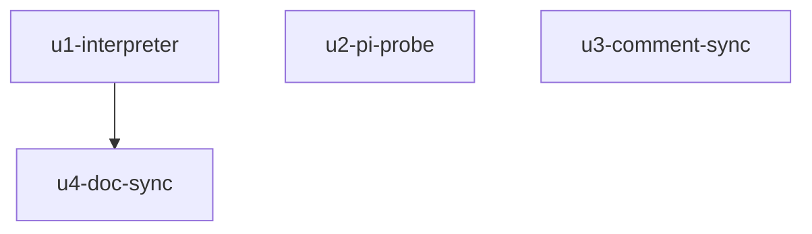

# genstats-speed-llm-window 实施计划
基线: <待填> | 来源设计: docs/design/genstats-speed-llm-window.md | 日期: 2026-09-08

## 0 章节映射
| 内容 | 本文实际位置 |
|------|--------------|
| 背景/目标 | §1 背景目标（G1-G4） |
| 终态/机制 | §2.2 根因与物理数据流 + §3.3 D1-D6 关键决策（含 D3 配对矩阵八行） |
| 验收场景表 | §4 验收（S1-S5 真实场景 + 通过标准） |
| 下一层拆分 | §5 下一层拆分（U1-U6） |
| 待验证检查点 | §5 末段「待验证」：D1 乐观偏差量级归 S1 实测锚定 |

对抗式审查证据：`.review/genstats-design-review.md`（主审 R2：0 must-fix）+ `.review/genstats-design-review-impact.md`（影响面审 R2：0 must-fix）。R1 3 must-fix + 4 suggestion 全修，R2 suggestion 4 处文字级全修（U3 八行口径 / §3.2 B 否决句重写 / D2 层③措辞 / D1 臂(b)主触发）。

## 1 目标快照（逐字摘录自设计 §1 / Out-of-scope）

> 速度样本的 durationMs 从「turn 全程墙钟（含工具执行时间）」改为「单次 LLM 请求窗口（assistant message_start → assistant message_end）」，采样点、存储、聚合、协议、renderer 全部不动。
> G1 速度数字恢复「LLM 生成速度」语义；G2 UI 口径说明「不含工具执行时间」变为真实陈述；G3 现有可靠性语义不回退（null 纪律、bogus guard、跨重启恢复、模型视角广播）；G4 存储与协议零迁移。

Out-of-scope：聚合算法、存储布局与 GC、WS 帧/RPC 协议、renderer 组件、bogus 阈值标定、streaming 实时滚动速度、i18n 文案（已是目标口径，测试锁定零改动）。

## 2 单元列表

| Unit | 职责 | 领地（精确文件路径） | 依赖 | 隔离 | 验收条款 |
|------|------|----------------------|------|------|----------|
| u1-interpreter | `turnStartedAt` 语义注释更名（LLM 窗口起算）+ 新增 `llmWindowDurationMs` 状态 + `case 'message'` 内识别 `message.message_end` 帧（payload entry.message.role==='assistant' 守卫）结算窗口 + turn-start 重锚同步清 `llmWindowDurationMs`（重锚清除不变量）+ turn-usage 消费 `llmWindowDurationMs`（消费后置 null）；同步实现 D3 八行配对矩阵单测（fake timers） | `packages/runtime/src/services/session/event-interpreter.ts`、`packages/runtime/src/__tests__/event-interpreter.test.ts` | 无（DAG 根） | plain | 八行矩阵 + role 守卫 + 双 start 重锚 + 重锚清除不变量全绿；既有 event-interpreter 用例零回归 |
| u2-pi-probe | pi-semantics 静态探针四断言：P1（assistant message_end 先于 turn_end）、P3①（agent-loop error 分支 emit message_end）、P3②（agent.js handleRunFailure 合成四事件 + failureMessage 形态 EMPTY_USAGE/空 text/assistant role）、P4（agent-loop 每 turn 迭代恰一次 streamAssistantResponse 调用） | `packages/runtime/src/infra/pi/__tests__/pi-semantics-turn-usage-model.test.ts` | 无 | plain | 四断言在实装 0.84.4 dist 上全绿；dist 不可达时 skip 不 fail（既有范式） |
| u3-comment-sync | `GenStatsSample.durationMs` 语义注释更新（LLM 窗口口径 + 防御栈引用）；gen-stats-service.ts 文件头 GS-5 口径注更新（D2 引用改指 message_end 闭合） | `packages/runtime/src/services/session/types.ts`、`packages/runtime/src/services/session/gen-stats-service.ts` | 无（纯注释，与 u1 同语义域但不同文件） | plain | 类型零变更（tsc 通过）；注释与 u1 实现一致（一致性审查复核） |
| u4-doc-sync | composer-gen-stats.md 回写：§2.2 数据流图闭合点、GS-5 口径注、D2 注释、§4 场景表速度值描述（C-proc-10） | `docs/design/composer-gen-stats.md` | u1（回写实装后事实） | plain | 图/注/表与实现一致（design-code-sync 阶段终检） |

说明：设计 §5 U6（全量验证）不设独立 unit——作为阶段 5 Gate A 由主 agent 执行。设计 §5 U5 即本表 u4。

## 3 DAG 图

wave 1：u1 ∥ u2 ∥ u3（领地两两不相交）；wave 2：u4。

## 4 测试策略

- 增量（各 unit 自验）：
  - `cd packages/runtime && npx vitest run src/__tests__/event-interpreter.test.ts`
  - `cd packages/runtime && npx vitest run src/infra/pi/__tests__/pi-semantics-turn-usage-model.test.ts`
  - `cd packages/runtime && npx vitest run src/services/session/__tests__/gen-stats-service.test.ts src/services/session/__tests__/gen-stats-store.test.ts`（u1/u3 邻接面回归）
- 全量（Gate A，阶段 5）：`cd packages/runtime && npx vitest run`
- renderer 不涉及（零改动单元）；框架 vitest，禁 node:test，fake timers 用 vi.useFakeTimers

## 5 合理偏差登记表

| # | 偏差 | 判定 | 证据 |
|---|------|------|------|

## 6 状态表

| Unit | 状态 | 轮次 | 证据指针 |
|------|------|------|----------|
| u1-interpreter | pending | 0 | |
| u2-pi-probe | pending | 0 | |
| u3-comment-sync | pending | 0 | |
| u4-doc-sync | pending | 0 | |

## 7 残留风险与变更历史

- 残留风险：①D1 乐观偏差量级待 S1 实测锚定（触发条件已定，见设计 §3.3 D1 / §5 待验证）；②真实场景验收 S1-S5 需真实模型会话，执行方式在阶段 5 落地（本地 pi CLI RPC 实测，Per AGENTS.md extension 实测纪律精神）。
- 2026-09-08：计划创建。用户评审步以用户会话内显式授权（「不需要我授权，你全权负责」+ 指定 tech-design→dev-flow→design-code-sync 全流程）代行确认：切分 4 单元、无 worktree（领地小且互斥、单机串行派发）、验收条款 = 设计 §4 五场景无遗漏。基线 commit 连同设计文档与 .review 报告一并入库（traceability，偏离 plan.md「只 add 计划文档」从宽执行并在此登记）。
