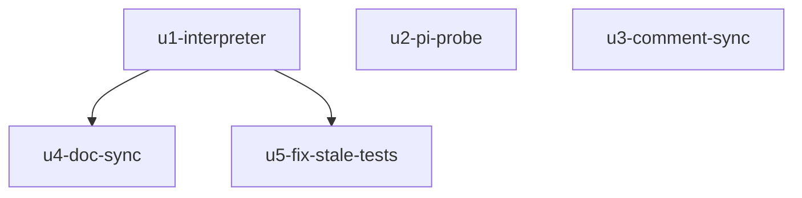

# genstats-speed-llm-window 实施计划
基线: cf64d95a3 | 来源设计: docs/design/genstats-speed-llm-window.md | 日期: 2026-09-08

## 0 章节映射
| 内容 | 本文实际位置 |
|------|--------------|
| 背景/目标 | §1 背景目标（G1-G4） |
| 终态/机制 | §2.2 根因与物理数据流 + §3.3 D1-D6 关键决策（含 D3 配对矩阵八行） |
| 验收场景表 | §4 验收（S1-S5 真实场景 + 通过标准） |
| 下一层拆分 | §5 下一层拆分（U1-U6） |
| 待验证检查点 | §5 末段「待验证」：D1 乐观偏差量级归 S1 实测锚定 |

对抗式审查证据：`.review/genstats-design-review.md`（主审 R2：0 must-fix）+ `.review/genstats-design-review-impact.md`（影响面审 R2：0 must-fix）。R1 3 must-fix + 4 suggestion 全修，R2 suggestion 4 处文字级全修（U3 八行口径 / §3.2 B 否决句重写 / D2 层③措辞 / D1 臂(b)主触发）。

## 1 目标快照（逐字摘录自设计 §1 / Out-of-scope）

> 速度样本的 durationMs 从「turn 全程墙钟（含工具执行时间）」改为「单次 LLM 请求窗口（assistant message_start → assistant message_end）」，采样点、存储、聚合、协议、renderer 全部不动。
> G1 速度数字恢复「LLM 生成速度」语义；G2 UI 口径说明「不含工具执行时间」变为真实陈述；G3 现有可靠性语义不回退（null 纪律、bogus guard、跨重启恢复、模型视角广播）；G4 存储与协议零迁移。

Out-of-scope：聚合算法、存储布局与 GC、WS 帧/RPC 协议、renderer 组件、bogus 阈值标定、streaming 实时滚动速度、i18n 文案（已是目标口径，测试锁定零改动）。

## 2 单元列表

| Unit | 职责 | 领地（精确文件路径） | 依赖 | 隔离 | 验收条款 |
|------|------|----------------------|------|------|----------|
| u1-interpreter | `turnStartedAt` 语义注释更名（LLM 窗口起算）+ 新增 `llmWindowDurationMs` 状态 + `case 'message'` 内识别 `message.message_end` 帧（payload entry.message.role==='assistant' 守卫）结算窗口 + turn-start 重锚同步清 `llmWindowDurationMs`（重锚清除不变量）+ turn-usage 消费 `llmWindowDurationMs`（消费后置 null）；同步实现 D3 八行配对矩阵单测（fake timers） | `packages/runtime/src/services/session/event-interpreter.ts`、`packages/runtime/src/__tests__/event-interpreter.test.ts` | 无（DAG 根） | plain | 八行矩阵 + role 守卫 + 双 start 重锚 + 重锚清除不变量全绿；既有 event-interpreter 用例零回归 |
| u2-pi-probe | pi-semantics 静态探针四断言：P1（assistant message_end 先于 turn_end）、P3①（agent-loop error 分支 emit message_end）、P3②（agent.js handleRunFailure 合成四事件 + failureMessage 形态 EMPTY_USAGE/空 text/assistant role）、P4（agent-loop 每 turn 迭代恰一次 streamAssistantResponse 调用） | `packages/runtime/src/infra/pi/__tests__/pi-semantics-turn-usage-model.test.ts` | 无 | plain | 四断言在实装 0.84.4 dist 上全绿；dist 不可达时 skip 不 fail（既有范式） |
| u3-comment-sync | `GenStatsSample.durationMs` 语义注释更新（LLM 窗口口径 + 防御栈引用）；gen-stats-service.ts recordSample 丢弃规则注释（:111-113）GS-5 口径注更新（D2 引用改指 message_end 闭合） | `packages/runtime/src/services/session/types.ts`、`packages/runtime/src/services/session/gen-stats-service.ts` | 无（纯注释，与 u1 同语义域但不同文件） | plain | 类型零变更（tsc 通过）；注释与 u1 实现一致（一致性审查复核） |
| u4-doc-sync | composer-gen-stats.md 回写：§2.2 数据流图闭合点、GS-5 口径注、D2 注释、§4 场景表速度值描述（C-proc-10） | `docs/design/composer-gen-stats.md` | u1（回写实装后事实） | plain | 图/注/表与实现一致（design-code-sync 阶段终检） |
| u5-fix-stale-tests（一致性审查补登记） | 邻接测试修复：gen-stats-service.test.ts 两条旧墙钟断言按 D3 新口径改写（文件头注释同步） | `packages/runtime/src/services/session/__tests__/gen-stats-service.test.ts` | u1（旧断言与新口径必然冲突） | plain | 51/51 绿（service 32 + interpreter 19 邻接回归） |

说明：设计 §5 U6（全量验证）不设独立 unit——作为阶段 5 Gate A 由主 agent 执行。设计 §5 U5 即本表 u4。

## 3 DAG 图

wave 1：u1 ∥ u2 ∥ u3（领地两两不相交）；wave 1.5：u5（u1 落地后发现旧断言冲突，补登记）；wave 2：u4。

## 4 测试策略

- 增量（各 unit 自验）：
  - `cd packages/runtime && npx vitest run src/__tests__/event-interpreter.test.ts`
  - `cd packages/runtime && npx vitest run src/infra/pi/__tests__/pi-semantics-turn-usage-model.test.ts`
  - `cd packages/runtime && npx vitest run src/services/session/__tests__/gen-stats-service.test.ts src/services/session/__tests__/gen-stats-store.test.ts`（u1/u3 邻接面回归）
- 全量（Gate A，阶段 5）：`cd packages/runtime && npx vitest run`
- renderer 不涉及（零改动单元）；框架 vitest，禁 node:test，fake timers 用 vi.useFakeTimers

## 5 合理偏差登记表

| # | 偏差 | 判定 | 证据 |
|---|------|------|------|
| 1 | u4：「GS-5 口径注」在领地内无字面命中（GS-5 登记实在 docs/design/adversarial-review-fixes.md，非 u4 领地）——领地内受其影响的旧口径表述为 D2「实装口径澄清」段，已按新口径改写并转 [HISTORICAL] 口径演变 | 合理（前任 subagent 核实 + 主 agent 复核确认）；adversarial-review-fixes.md 非本设计领地，不动 | grep "GS-5" composer-gen-stats.md 零命中；genstats-speed-llm-window.md:60 设计史 |
| 2 | u4 同域顺带同步 5 处（超 impl-plan 所列四项）：§3.1 终态示例速度公式说明 / §3.2 方案 A 风险列 duration 措辞 / D1 证据行号刷新 / D2 被否谱系补一条 [HISTORICAL 被否推论] / §5 待验证检查点 D2 探针闭合 | 合理（C-proc-10 涟漪面纪律：同类旧口径表述一并修，防残留） | git diff composer-gen-stats.md 各 hunk |
| 3 | u4 [HISTORICAL] 引文式保留 2 处旧口径字面（D2 口径演变段 / 5a 场景括号注）——保留是为记录口径演变史，非残留 | 合理（[HISTORICAL] 标记不可删纪律的同向适用） | composer-gen-stats.md D2 [HISTORICAL] 段 / §4 5a |
| 4 | u5 计划外新增单元：u1 落地后 gen-stats-service.test.ts 两条旧墙钟断言必然冲突，定向修复而非绕过 | 合理（一致性审查 reasonable #1：涟漪必然性 + 定向修复纪律） | commit f8c9052b9 |
| 5 | u1 settleLlmWindowOnMessageEnd 防御性 payload 提取（entry.message.role 逐层守卫，严于 D6 形态描述但不改行为） | 合理（一致性审查 reasonable #2：防御更深且行为等价） | event-interpreter.ts:813-818 |
| 6 | u3 GS-5 口径注按「精神延续」改写（与设计 D1 逐字对齐，非字面照搬原登记） | 合理（一致性审查 reasonable #4：与新口径逐字对齐） | gen-stats-service.ts:111-113 |
| 7 | 设计 U4「随 U1 同 commit」实际独立 commit（u3 = 673da2b98）——impl-plan 拆分优先于设计拆分建议 | 合理（impl-plan 为执行权威，独立 commit 粒度更清晰） | git log 673da2b98 |

## 6 状态表

| Unit | 状态 | 轮次 | 证据指针 |
|------|------|------|----------|
| u1-interpreter | committed | 3 | R1 实现 + R3 测试，commit 427abd30e（19/19 绿；2 条旧语义用例外移 u5） |
| u2-pi-probe | committed | 2 | commit bb73e1f91（11/11 绿，diff +102 ⊆ 领地） |
| u3-comment-sync | committed | 1 | commit 673da2b98（typecheck 绿，diff ⊆ 领地） |
| u4-doc-sync | committed | 1 | 接替重派当轮完成（sa-b6569b50）：13 处替换 65 行 +/-，旧口径字面零残留、新关键词 6 处命中、file:line 引用经主 agent 逐一核对实装；偏差 3 条入 §5 登记表 |
| u5-fix-stale-tests（新增） | committed | 1 | commit f8c9052b9（51/51 绿，diff ⊆ 领地；一致性审查补登记入 §2/§3） |
| Gate A（阶段 5） | passed | 1 | 主 agent 预跑 + 一致性审查者复跑双证据：5099/5100 绿，唯一 failure = thinking-level-effective-e2e G5（环境性：get_available_models 清单无 reasoning:false 模型；该测试文件与变更区间零交集，最后改动 f482e73b0 在基线前）——待用户签认转残留风险登记 |

## 7 残留风险与变更历史

- 残留风险：①D1 乐观偏差量级待 S1 实测锚定（触发条件已定，见设计 §3.3 D1 / §5 待验证）；②真实场景验收 S1-S5 需真实模型会话，执行方式在阶段 5 落地（本地 pi CLI RPC 实测，Per AGENTS.md extension 实测纪律精神）。
- 2026-09-09：阶段 3 一致性审查（审查者 sa-211374d2）：映射有效、6 commit 领地全部吻合、D1-D6 机制层一致、5099/5100 全量绿（唯一 failure 环境性）。产出：reasonable 4 条（§5 #4-#6 登记）+ unreasonable 1 条 low（矩阵测试⑧补 toolResult，定向修复中）+ doc_errors 6 条（主 agent 当轮全修：设计 :431→:430 / D3 措辞与缺起复合行 / U4 位置描述；composer-gen-stats 事实 2 四处 stale 行号；impl-plan u5 补登记 + Gate A 行 + u3 位置描述）。
- 2026-09-09：中断恢复校准——主会话冻结重启后核对：u1/u2/u3/u5 四 commit 均在 git log，u4 前任 subagent（sa-65aa4da2）session 仅完成核实阅读、领地文件零改动（git status 证实），按 pending 重算并接替重派（sa-b6569b50）。前任核实结论随证据包传递：GS-5 登记实在 adversarial-review-fixes.md（非 u4 领地），领地内旧口径集中处已逐条列明。
- 2026-09-08：计划创建。用户评审步以用户会话内显式授权（「不需要我授权，你全权负责」+ 指定 tech-design→dev-flow→design-code-sync 全流程）代行确认：切分 4 单元、无 worktree（领地小且互斥、单机串行派发）、验收条款 = 设计 §4 五场景无遗漏。基线 commit 连同设计文档与 .review 报告一并入库（traceability，偏离 plan.md「只 add 计划文档」从宽执行并在此登记）。
