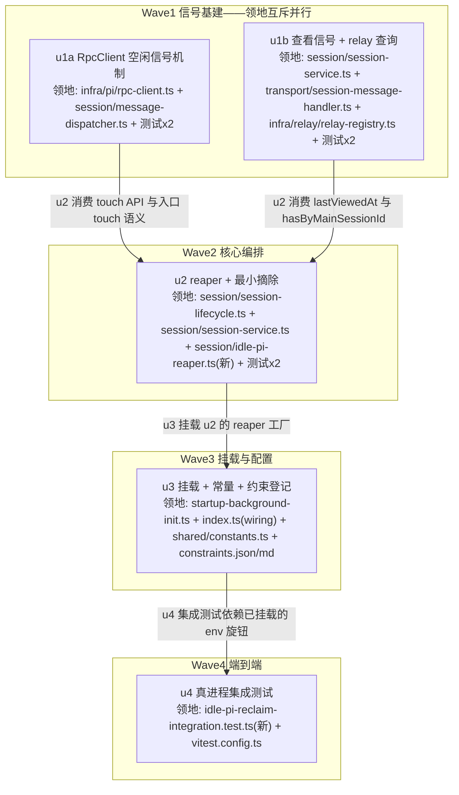

# idle pi reclamation 实施计划

基线: (本文件首次 commit hash) | 来源设计: [docs/design/idle-pi-reclamation.md](idle-pi-reclamation.md)（commit af81f289f） | 日期: 2026-09-10

## 0 章节映射

所有 subagent task 的坐标唯一来源，禁止自猜编号：

| 内容 | 设计文档实际位置 |
|------|--------------|
| 背景/目标 | §1 背景目标（§1.1 系统现状机制四事实；§1.2 设计目标 G1-G4 + In/Out-scope） |
| 终态/机制 | §3 解决方案（§3.1 终态场景一~四；§3.3 决策 D1-D8；§3.4 探针清单 P1-P8） |
| 验收场景表 | §4 验收（V1-V7 + 「负面行为验证」段） |
| 下一层拆分 | §5 下一层拆分（U1-U4 表 + 文件改动地图 + 待验证检查点） |
| 待验证检查点 | §5 末段「待验证检查点」（P1-P8 全部 + 阈值 2h/查看窗口 30min 校准） |

**对抗式审查证据（阶段 0.3）**：同会话 4 轮双审循环（`tech-design-review` 主审 + `tech-design-impact-review` 影响面审，并行派发），收敛轨迹 R1 3+4 must-fix → R2 1+1 → R3 1+1 → R4 **双报告 0 must-fix / 0 suggestion**；审查在会话内完成、报告未落盘，设计定稿 commit `af81f289f`（附录含被否谱系：removeSessionEntry 复用 / hasSubscribers 豁免 / 超时抢跑 / 冻结 / renderer 驱动）。

## 1 目标快照（逐字摘录自设计 §1.2 + In/Out-scope）

- **G1 足迹有界**：30 天运行中 pi 进程数与总 RSS 不随历史 session 数单调增长——空闲即回收，进程数由「近期活跃 session 数」决定，存在平台期。
- **G2 回收绝对安全**：任何有在途工作的 session 绝不被回收；用户在 drawer 终端跑的工作（PTY）与 pi 进程无关，结构性不受回收影响。
- **G3 恢复无感**：被回收 session 的下次使用（发消息/切换）典型 ≤3s 恢复、历史完整、**新回复的流式事件正常到达 renderer**（广播流不断）；不出现 dead UI、错误 toast、崩溃日志。
- **G4 可观测**：每次回收与恢复都留痕（日志行，含空闲时长/RSS/豁免分布），回收频率与「候选因故跳过」分布可查。

**In-scope**：runtime 侧 reaper（判定 + 最小摘除编排 + 日志）、RpcClient 空闲时间戳（含维护通道排除）、relay 按 mainSessionId 只读查询、switch 查看时间戳、dispatcher 入口 touch、restore 耗时日志、相关单测与集成测试。**renderer 零改动**。
**Out-of-scope**：renderer 内存与数据路径治理（deep-dive O2/O3）；pi 进程内部内存优化（上游）；阈值的用户设置 UI（常量 + env 覆盖先行）；自愈/看门狗（架构文档阶段三）。

## 2 单元列表

设计 §5 的 U1-U4 是编排视角拆分；本计划按**文件领地互斥 + 每单元 ≤5 文件**（全局 subagent 约束）细化为 5 单元。映射与再分配理由登记于 §5 合理偏差登记表。

| Unit | 职责 | 领地（精确文件路径） | 依赖 | 隔离 | 验收条款 |
|------|------|----------------------|------|------|----------|
| u1a | RpcClient 空闲信号机制：`lastActivityAt`（初值 = spawn 时刻）+ 出站 `sendCommand()` / 入站 `handleMessage()` 双向 touch + `sendCommand` 维护通道标记 API（维护类调用不 touch）；dispatcher `sendPrompt` 入口同步 touch（**任何 await 之前**，关 D6-1 hook/restore 窗口） | `packages/runtime/src/infra/pi/rpc-client.ts`；`packages/runtime/src/services/session/message-dispatcher.ts`；测试：`packages/runtime/src/__tests__/infra/pi/rpc-client-activity.test.ts`（新）、`packages/runtime/src/__tests__/services/message-dispatcher-entry-touch.test.ts`（新） | 无 | plain | ① 新测试绿：sendCommand/handleMessage 双向刷新 lastActivityAt；带维护标记的 sendCommand 不刷新；dispatcher 入口在首个 await 前同步 touch（fake client 断言调用序）。② `pnpm -F @xyz-agent/runtime typecheck` 绿。③ 既有 rpc-client/dispatcher 相关测试回归绿 |
| u1b | 查看信号 + relay 只读查询：session-service 侧 per-sid `lastViewedAt` Map（形态钉死 `ActiveSessionResolver` 先例：实例字段收口，禁模块级全局）+ `session.switch` 处理器记录（挂点 `handleSessionSwitch`）；`RelayRegistry.hasByMainSessionId(sid)` 只读查询 | `packages/runtime/src/services/session/session-service.ts`；`packages/runtime/src/transport/session-message-handler.ts`；`packages/runtime/src/infra/relay/relay-registry.ts`；测试：`packages/runtime/src/__tests__/infra/relay/relay-registry.test.ts`（改，补 hasByMainSessionId 用例）、`packages/runtime/test/session-viewed-at.test.ts`（新） | 无 | plain | ① 新测试绿：switch 处理器写入 lastViewedAt；Map 查询未记录 sid 返回 undefined；hasByMainSessionId 真值表（有/无该 mainSessionId 的注册条目）。② typecheck 绿。③ relay-registry 既有用例回归绿 |
| u2 | reaper + 最小摘除核心：`reclaimManagedSession(sessionId)` 七步编排（占座 try/finally / 同步豁免块 / detach / destroySession / fire-and-forget 尾扫**单段快照语义** + 定向收殓 / 最小摘除 + pendingReload 定向清 / 按拍合并广播）；七类豁免检查器；`ensureActive` 占座让路（等待不抢跑）；reaper DI 判定循环（每拍汇总日志含 `process.memoryUsage()` 水位）；restore elapsed 耗时日志；promptReload 维护标记调用点接线；lastViewedAt 清理挂点（removeSessionEntry 内） | `packages/runtime/src/services/session/session-lifecycle.ts`；`packages/runtime/src/services/session/session-service.ts`；`packages/runtime/src/services/session/idle-pi-reaper.ts`（新，DI 形态照抄 `reap-orphan-pi.ts`）；测试：`packages/runtime/src/__tests__/services/idle-pi-reaper.test.ts`（新，fake timers 判定矩阵）、`packages/runtime/test/reclaim-orchestration.test.ts`（新，编排时序） | u1a（touch API）、u1b（lastViewedAt / hasByMainSessionId） | plain | ① 判定矩阵单测绿：阈值边界 / 七类豁免各一例 / 维护通道不 touch / 入口 touch 关窗（P5、P6-①）。② 编排单测绿：占座 finally 释放、等待方不抢跑（kill await 期间并发 switch 走等待、释放后 existing 分支 no-op）、代际校验、尾扫不误杀 restore 后新 relay 子进程（P6-②③）。③ typecheck 绿。④ 既有 lifecycle/session-service 回归绿（`test/lifecycle-races.test.ts` 等） |
| u3 | 挂载与配置：startup-background-init 挂载 reaper（`setInterval(...).unref()`，对齐孤儿收殓形态）+ index.ts 组合根 wiring（deps 注入）；`XYZ_RUNTIME_PI_RECLAIM_*` 常量 SSOT（shared/constants.ts，`XYZ_` 前缀钉死 + env 覆盖）；projection 保留前提约束登记 `docs/constraints.json` + `node scripts/render-constraints.mjs` 再生成 md | `packages/runtime/src/services/startup-background-init.ts`；`packages/runtime/src/index.ts`（仅 wiring 段）；`packages/shared/src/constants.ts`；`docs/constraints.json`；`docs/constraints.md`（脚本生成物） | u2（reaper 工厂） | plain | ① `startup-background-init.test.ts` 回归绿 + 新增挂载断言（reaper start 被调用、timer unref）。② `node scripts/render-constraints.mjs` 跑过且 constraints.md diff 仅含新约束行。③ typecheck 绿（shared + runtime）。④ 常量经 `XYZ_RUNTIME_PI_RECLAIM_IDLE_MS` env 可覆盖（单测或挂载处断言） |
| u4 | 端到端集成测试（真进程）：真 pi attach → 产生 entry → 空闲（env 缩小阈值或 DI 注入短阈值）→ 回收（进程消失、零 crash log、bus 分区保留）→ restore（历史完整）→ 新回复流式事件到达订阅者（P1/P3/P7 集成形态）；REAL_PI_TESTS 登记 | `packages/runtime/src/__tests__/services/idle-pi-reclaim-integration.test.ts`（新，借 `src/__tests__/infra/relay/relay-integration.test.ts` 真进程模式 + `spawnPiFixture`）；`packages/runtime/vitest.config.ts`（REAL_PI_TESTS 登记） | u2、u3 | plain | ① 新集成测试在 real-pi 池真实跑绿（未设 `XYZ_SKIP_REAL_PI`）；设 `XYZ_SKIP_REAL_PI=1` 时 skip 不 fail。② P7 收益门结论落测试断言或计划记录（增量命中 / fallback 二选一，失败走设计降级路径并登记）。③ 全量 `npx vitest run` 绿（含新文件调度正确） |

## 3 DAG 图

- 关键路径深度 4（u1x → u2 → u3 → u4），W1 反链宽度 2。不满足宽度 ≥3 的原因：**新写代码（非纯平移/重构），契约先行压扁禁用**（dag-authoring 适用条件不满足）；信号基建 → 编排 → 挂载 → 端到端是真实运行时依赖链，任务本质部分串行，已在 W1 内穷尽并行（u1a/u1b 领地互斥零依赖）。
- 全部 plain：不触碰热点公共文件（index.ts 仅 wiring 段追加，非路由表级共改；无单元与之并行），无实验性废弃风险，用户未指定 worktree。

## 4 测试策略

命令真实来源：`packages/runtime/package.json` scripts（`test` = `vitest run`、`typecheck` = `tsc --noEmit`）；测试红线 = vitest + fake timers（timer 测试）+ fs-guard 白名单（新测试写删目标只落 `os.tmpdir()`）；real-pi 池分池契约见 `packages/runtime/vitest.config.ts` 文件头（新真进程文件必须登记 REAL_PI_TESTS）。

**增量（单元开发期内，从 `packages/runtime/` 目录执行）**：
- 单测定向：`npx vitest run <本单元测试文件>`（main 池自动匹配）
- 回归定向：`npx vitest run src/__tests__/services/ test/lifecycle-races.test.ts`（u2 后）；`npx vitest run src/services/startup-background-init.test.ts src/__tests__/infra/relay/`（u1b/u3 后）
- 类型：`npx tsc --noEmit`；shared 改动后 `pnpm -F @xyz-agent/shared typecheck`（若脚本存在，否则 runtime tsc 覆盖）
- u4：`npx vitest run --project real-pi src/__tests__/services/idle-pi-reclaim-integration.test.ts`（真进程，需模型凭据；CI/无凭据环境 `XYZ_SKIP_REAL_PI=1` 跳过）

**全量（阶段 5 Gate A，收尾场景）**：
- `cd packages/runtime && npx vitest run`（main + real-pi 两池全量）
- 仓库级：`pnpm run lint`；`node scripts/render-constraints.mjs` 幂等校验；`node scripts/check-doc-symbol-drift.mjs`（docs/design 改动触发）

## 5 合理偏差登记表（初始非空——计划期再分配，均有设计依据）

| # | 偏差 | 理由 | 设计依据 |
|---|------|------|----------|
| R1 | 设计 U1（4 文件+测试）拆为 u1a/u1b 两并行单元 | 全局 subagent 约束「每子任务 ≤5 文件」；u1a（touch 机制）与 u1b（查看信号/relay 查询）领地互斥可并行，缩短关键路径 | §5 U1 内容域自然二分（D1 前半 vs D1 lastViewedAt + D2#3/#6） |
| R2 | promptReload 维护标记**调用点**（session-service.ts:714 一带）从 u1b 移至 u2 | u1a 定义标记 API、调用点在 u1b 领地会产生跨并行单元的编译依赖；且 reaper（u2）落地前 touch 污染无可观测行为（无消费者），时序安全 | D1「实现形态：sendCommand 增加调用方标记」；机制测试在 u1a 用 DI 假调用方覆盖 |
| R3 | restore elapsed 日志、按拍合并广播、每拍水位实现落 u2（设计列在 U3） | 文件领地连续性：三者分别在 session-service.ts（u2 领地）与 reaper tick（u2 新模块）内；U3 的列举是编排视角（「挂载时这些能力就绪」）非文件归属 | D5（elapsed）、D3 第 7 步（合并广播）、D7（水位） |
| R4 | lastViewedAt 清理挂点（removeSessionEntry 内）落 u2（设计属 U1 范畴） | session-lifecycle.ts 整文件领地归 u2，避免 u1b 跨领地改一行；u1b→u2 紧邻串行，中间态残留为死数据（每 sid 一个数字，无消费者读取前无行为） | D2#6「清理挂点 = lifecycle.delete」 |
| R5 | V1-V7 真机验收不在任何 dev 单元内，作为阶段 5 Gate B 逐行签收活动执行（V6 7 天长跑项登记为交付后观察项） | 真机场景需打包版 app + 真实使用节奏，非 subagent 文件编辑任务；集成测试（u4）覆盖 V1 主干的可自动化部分 | §4 验收场景表 |
| R6 | u1a 领地修订：实际 13 文件（原计划 4 文件）——新增 `services/ports/pi-engine.ts`（IPiEngine 端口扩展 lastActivityAt/touchActivity/SendCommandOptions）+ 8 个既有测试文件（fake client 补成员 / getClient 空守卫桩） | dispatcher 依赖端口类型 IPiEngine 而非具体 RpcClient——touch API 必须上端口才能被 dispatcher 消费（结构性必需，非顺手改）；8 个测试文件是实现 IPiEngine 的 fake，接口扩展后 tsc 强制补齐。改动全为纯追加，零断言削弱（编排者已逐 diff 核验） | 设计 D1/D6-1 的消费链（dispatcher→pm.getClient→IPiEngine） |
| R7 | u3 拆为 u3a（豁免查询访问器面）+ u3b（装配 + 常量 + 约束登记）串行；u3a 领地新增 4 个薄只读访问器文件：`infra/relay/relay-registry.ts`（按 mainSessionId 枚举在册 child——u2 编排 deps 注释已声明缺口）、`services/handoff-service.ts`（inflight Map 无公开查询）、`services/session/session-delivery-registry.ts`（handle 注册表无存在性/活跃查询）、`services/session/session-service.ts`（occupancy 运行时内部态无外部读点） | 设计 D2 标注「现成」的信号中 4 项实装无公开访问器（设计快照与实装漂移，u2 已按窄接口注入隔离影响）；单 u3 合并计 10+ 文件超 subagent 上限，拆分后各 ≤6 文件且改动均为 ≤20 行薄访问器 | D2 七豁免表 + u2 代码内 [u3 装配清单] 注释 |

## 6 状态表

| Unit | 状态 | 轮次 | 证据指针 |
|------|------|------|----------|
| u1a | committed | 2 | commit 64e70ae51；tsc 绿 + 10 文件 129 用例绿。轮 1 前任速率限制中断（语义已完整，缺 1 个测试 fake 类型成员），轮 2 接替者收尾（1 文件）。偏差 R6 已入登记表 |
| u1b | committed | 1 | commit acc603d4d；session-viewed-at 6 用例 + relay-registry 26 用例绿；偏差 2 条已入登记表（挂点入口化 / 可选交叉成员） |
| u2 | committed | 1 | commit 82d7d9e12；idle-pi-reaper 22 用例 + reclaim-orchestration 14 用例 + 回归绿 + tsc 绿。dev 完成实现与测试后死于速率限制（未及汇报），编排者逐 diff 核验设计保真度并重跑全部测试后收口。附带 .githooks/check_prompt_outposts.py 指纹刷新（promptReload 加 maintenance 参数触发出站点守卫） |
| u3 | in-progress（u3a committed，u3b 待派） | 1 | u3a：commit e5ab883ac；4 薄访问器（relay 枚举 / handoff inflight / delivery depth() / occupancy 读）+ reclaim-accessors 7 用例 + 回归 76 绿 + tsc 绿。偏差：hasDeliveryActivity 用 handle.depth()（优于 isIdle 同源判定——覆盖 occupancy 看不到的回流队列窗口）；relay 返回内联结构类型（避免 infra→services 反向依赖） |
| u4 | pending | 0 | — |

## 7 残留风险与变更历史

**残留风险（实施期盯防）**：
- P7 收益门两分支都有降级路径（设计 D5/§3.4），但**结论必须落记录**——增量命中 → 收益兑现登记；fallback → 撤回 D5 增量收益声明（doc_error 走设计文档修订），不许悬而不决。
- constraints.json 登记晚于 u2 代码落点（R4 同因：领地归 u3）——同一交付内闭环，合并前齐备即可（AGENTS「先登记再写代码」以分支合并为交付边界）。
- u4 真进程测试依赖本机模型凭据与 pi 安装；若环境不可用，登记阻塞并升级用户，不得以 mock 冒充真机验收（准则 11）。

**变更历史**：
- 2026-09-10 计划创建（基线 commit 见文件头）。
