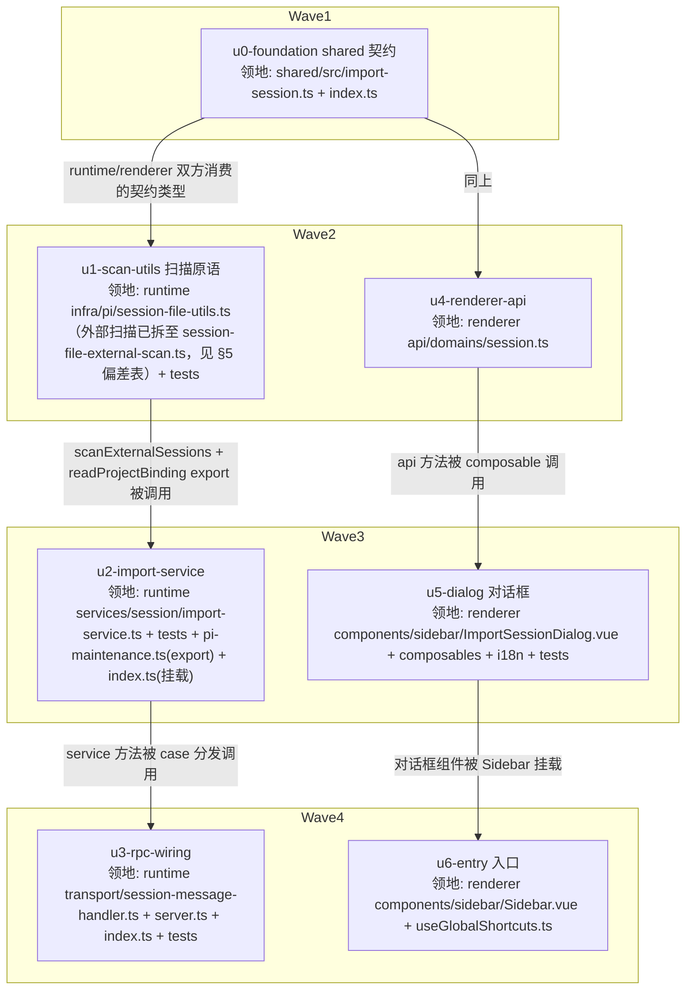

# 导入 pi 会话 实施计划

基线: f47e00b05 | 来源设计: docs/design/import-session.md（v5，r1-r4 对抗式审查收敛 0 must-fix，报告 `.review/design-review-import-session-r{1..4}.md`） | 日期: 2026-09-02

## 0 章节映射

| 内容 | 设计文档实际位置 |
|------|--------------|
| 背景/目标 | §1 背景目标（SCQA + 设计目标 1-4 + in/out-scope） |
| 终态/机制 | §3.1 终态交互样例 + 终态物理数据流图；§3.3 D1-D6 决策（含错误规格表、RPC 契约 D5）；§3.4 探针清单 |
| 验收场景表 | §4 验收 V1-V9（真实场景，回溯目标列） |
| 下一层拆分 | §5（M1-M3 阶段 + U1-U7 单元表 + 文件改动地图 + 待验证检查点） |
| 待验证检查点 | §5 末尾「待验证检查点」（P-model 行为 / P-scan-perf 实测 / pi 升级探针登记） |

## 1 目标快照（摘录，缩写）

**设计目标**（从使用者体验倒推）：
1. **能找到**：用户能按名称、完整/短 Session ID（uuid 前 6 位，即 pi TUI 里的 `72cd03` 式短标识）、或 `.jsonl` 绝对路径，在外部 session 里定位到目标；也能按目录（对应原工作目录）浏览。
2. **能导入**：选中后选目标 project（默认当前激活 project，可改），一键导入；导入完成侧边栏该 project 分组立即出现此会话。
3. **能续聊**：点开导入的会话能看到完整历史，直接发消息能继续对话（真 pi attach，非只读）。**降级类**：原工作目录已不存在的会话，按 runtime 既有 F3 兜底在 `~` 续聊，UI 必须标注该事实。
4. **不重复、不出错时知道怎么办**：已导入的 session 在候选列表显示「已导入」不可重复导入；失败场景给出可操作的恢复指引。

**Out-of-scope**：自动发现/持续同步；批量多选；方案 B 命令面板与方案 C 预览视图；移动语义。

## 2 单元列表

| Unit | 职责 | 领地（精确文件路径） | 依赖 | 隔离 | 验收条款 |
|------|------|---------------------|------|------|---------|
| u0-foundation | shared RPC 契约类型（ImportCandidate/ImportCandidatesReply/ImportReply/warning 联合 + 错误码字面量联合） | `packages/shared/src/import-session.ts`（新）；`packages/shared/src/index.ts`（加一行 export） | — | plain | `pnpm --filter @xyz-agent/shared typecheck` 绿；runtime/renderer 可 import |
| u0b-protocol-reg | protocol.ts 协议 Map 登记两命令（5 处：ClientMessageType/ClientMessageMap/ServerMessageType/ServerMessageMapBase/ReplyPayloadMap） | `packages/shared/src/protocol.ts` | u0 | plain | shared + renderer typecheck 绿（u4 methods 依赖此登记） |
| u1-scan-utils | `scanExternalSessions(dir)` 异步分批扫描（readdir async + 复用 scanSessionMeta 每批 100 后 setImmediate）；外部根独立 TTL 缓存；`isScannableSessionFile`/`cleanupTmpMigrateResidue` 扩展 `.tmp-import-`；export `readProjectBinding` | `packages/runtime/src/infra/pi/session-file-utils.ts`（scanExternalSessions 及其外部侧缓存已于 6edc0a665 迁至 `session-file-external-scan.ts`，见 §5 偏差表；bc25decf3 起提取管线换外部侧轻量版，不复用 scanSessionMeta）；`packages/runtime/src/__tests__/`（新增 scan-external 测试文件） | u0 | plain | runtime vitest 新测试绿：外部目录样本扫描/tmp+marker 文件不可见/分批让出（fake timers 或批计数断言） |
| u2-import-service | `ImportService`：listCandidates（query 语义 D5/cwdExists/alreadyImported TTL 读）+ importSession（全局互斥 then(work,work)、互斥区内 header 异步读校验/标记校验/双检 id-first/projectId 校验/mkdir/tmp+rename/sidecar+readback/失效双缓存）；rootDir 缺省 getPiGlobalAgentDir 推导 | `packages/runtime/src/services/session/import-service.ts`（新）+ 同目录 `__tests__/import-service.test.ts`（新）；`packages/runtime/src/services/session/session-service.ts`（仅：把 importService 挂到对外访问点，若组合根直接 new 则改 `packages/runtime/src/index.ts`）；`packages/runtime/src/infra/pi/pi-maintenance.ts`（仅 export getPiGlobalAgentDir 一行） | u0, u1 | plain | runtime vitest：幂等三类反例（同 id 异 target/同 target 异 id→import_target_conflict/双击连点）、原子性（copy 中途失败无残留 + copy_failed 后第二跳成功）、错误码矩阵（marker/invalid/missing/project_invalid 含空串）、sidecar readback warning 路径 |
| u3-rpc-wiring | `session.importCandidates`/`session.import` 两个 case + ctx 类型/装配 + 组合根注入 | `packages/runtime/src/transport/session-message-handler.ts`；`packages/runtime/src/transport/server.ts`（optional services 类型+字段）；`packages/runtime/src/index.ts`（实例化/传入）；transport `__tests__`（case 分发测试） | u2 | plain | runtime vitest：RPC payload→reply 映射、错误 envelope、import 成功后 broadcastSessionList 被调 |
| u4-renderer-api | api domain 两方法 + 类型对齐 | `packages/renderer/src/api/domains/session.ts` | u0 | plain | renderer typecheck 绿；方法签名与 D5 契约逐字段一致 |
| u5-dialog | ImportSessionDialog.vue（搜索/目录 chip/分组列表/路径模式/已导入态/cwdExists 标注/底部 project 下拉+导入）+ useImportSession composable（debounce 250ms/project 默认当前/导入动作/toast warning 通道）+ i18n zh-CN/en-US | `packages/renderer/src/components/sidebar/ImportSessionDialog.vue`（新）；`packages/renderer/src/composables/features/sidebar/useImportSession.ts`（新）；`packages/renderer/src/i18n/locales/zh-CN/importSession.ts` + `en-US/importSession.ts`（新）+ `zh-CN.ts`/`en-US.ts` 注册（各一行）；`renderer __tests__` 组件测试（三视角，mock api 层） | u4 | plain | renderer vitest 组件测试绿（默认列表/搜索过滤三通道/路径模式切换/已导入禁用/选 project/导入成功 emit+toast/错误内联恢复指引/cwdExists 标注）；`pnpm --filter @xyz-agent/renderer lint` 绿 |
| u6-entry | 侧边栏 nav「导入会话」ghost 按钮（新建任务与搜索之间）+ ⌘I + 打开对话框 | `packages/renderer/src/components/sidebar/Sidebar.vue`；`packages/renderer/src/composables/shell/useGlobalShortcuts.ts` | u5 | plain | renderer vitest：按钮渲染位置断言（新建任务之后）；⌘I 触发 open；手动走查（阶段 5） |

## 3 DAG 图

注：u2 与 u5 领地互斥（runtime vs renderer）且分别只依赖各自链（u1/u4），同波并行安全；u3 与 u6 同理。

## 4 测试策略

- 测试框架：**vitest**（项目 SSOT，禁 node:test；从子包目录运行）
- 增量（每单元开发期）：
  - runtime：`cd packages/runtime && npx vitest run src/__tests__/<本单元测试文件>`（具体路径以实际新文件为准）
  - renderer：`cd packages/renderer && npx vitest run <本单元测试路径>`
  - typecheck：`pnpm --filter @xyz-agent/shared typecheck` / `@xyz-agent/runtime` / `@xyz-agent/renderer`
- 全量（收尾阶段 5）：`pnpm extensions:typecheck && pnpm extensions:lint && pnpm extensions:test` 不涉 extensions 不跑；跑 runtime + renderer 全量 vitest + `pnpm run lint`
- 真实场景验收（阶段 5 Gate B）：设计 §4 V1-V9 逐行签收（`pnpm dev` + Playwright/CDP 浏览器自动化 + 真实 `~/.pi/agent/sessions`）

## 5 合理偏差登记表

| 偏差 | 设计位置 | 实现落点 | 理由 | 裁决 |
|------|---------|---------|------|------|
| protocol.ts 协议 Map 未在 impl-plan 覆盖 | §2 u0/u3/u4 领地边界 | u0b-protocol-reg 补丁单元（shared/src/protocol.ts） | u4 typecheck 被 protocol.ts 未登记阻断；u0 领地仅含 import-session.ts 类型，不含 protocol.ts | 已裁决：增设 u0b 补丁单元（领地=protocol.ts），与 u0/W2 并行安全 |
| u5 领地外 mock 门面 +11 行 | §2 u5 领地 | packages/renderer/src/api/mock/index.ts | mock 轨道门面三元要求与 real domain 同接口，缺 importCandidates/importSession 会破 mock 轨道 | 已裁决：合理偏差，随 u5 commit |
| 设计 In-scope「选择其他目录」未拆入任何 unit | 设计 §1 In-scope + §3.1 line 107 + §4 V8 | u5 领地内补齐（Dialog 目录 chip + 按钮 + rootDir 切换重载，复用 lib/ipc pickDirectory） | impl-plan 拆分遗漏（u5 验收条款漏列此项），V8 为 Gate B 必签场景 | 已裁决：doc_error 级修正，u5 续修轮补入，RPC rootDir 参数契约已就位 |
| u5 行内「导入」按钮（每条目行直接导入） | 设计 §3.1 交互样例仅「点选条目→底部导入」；demo 方案 A 条目行无导入按钮 | ImportSessionDialog.vue 每行 import-item-import-btn | 降低选中-导入操作步长，不破坏底部主路径（选中+project+导入） | 已裁决（阶段 3）：合理 UI 增项，保留并登记 |
| 目录 chip 平铺行（每子目录一个 chip，无下拉无计数） | 设计 §3.1「全部目录 ▾」+ demo dir-menu 弹出菜单带计数 | ImportSessionDialog.vue chip 行 | 前任实现形态；V8 功能面（切根重载）不受影响 | 已裁决（阶段 3）：u7-polish 对齐 demo 下拉形态（含计数） |
| cwdExists 标注文案「主目录」替代「~」 | 设计 §3.1/V9「续聊将在 ~ 执行」 | zh-CN/en-US importSession.ts | 「主目录」对用户更可读，语义等价 | 已裁决（阶段 3）：合理演化；设计文档已同步「主目录」措辞 |
| 外部扫描实现落独立新文件 session-file-external-scan.ts | §2 u1 领地（session-file-utils.ts） | packages/runtime/src/infra/pi/session-file-external-scan.ts | session-file-utils.ts 有效行数撞 gate-a taste max-lines 预算（570>500），外部扫描域（scanExternalSessions + 缓存 + 批大小常量）整体迁出独立成档，行为零变更（6edc0a665） | 已裁决（Gate A）：合理偏差（gate-a lint 拆分），不 re-export 避免循环依赖 |
| 错误文案不含 `<path>`/`<dir>`/`<targetPath>` 类插值 | 设计 §3.3 错误规格表「用户看到」列带插值占位 | zh-CN/en-US importSession.ts 为固定指引文案（无插值） | 2026-09-02 d3191a4d8 打磨 target_conflict 文案时维持无插值路线——定位价值由错误码与条目上下文承担（错误内联在对话框内，用户所见列表条目即上下文） | 已裁决（design-code-sync r2 补登）：合理偏差；如需插值另立增强 |

## 6 状态表

| Unit | 状态 | 轮次 | 证据指针 |
|------|------|------|---------|
| u0-foundation | committed | 1 | shared typecheck 绿（tsc --noEmit exit 0）+ runtime/renderer 消费方 typecheck 绿；commit 5a6e4d729 |
| u0b-protocol-reg | committed | 1 | commit 988ce7034；shared + renderer typecheck 绿 |
| u1-scan-utils | committed | 1 | scan-external 9/9 + tmp-migrate 5/5 + tsc 绿；commit 80d7657bb（scan-external 阶段 3 终态 10/10：7be007a02 补「分批让出」用例；bc25decf3 后现 15（+4 name-tier 定位（bc25decf3）、+1 收录门槛（86ab3cab9）），见变更历史；scanExternalSessions 实现已于 6edc0a665 迁至 session-file-external-scan.ts，见 §2 领地注记/§5 偏差表） |
| u2-import-service | committed | 2 | vitest 12/12（含 target 冲突双检并发反例重写：原 s3 段构造错误——same-name-3 与被占 target 不同名属合法导入，重写为两源同 basename 并发一成一拒）（86ab3cab9 后 13：+1 缺 id header query 不崩溃回归）+ tsc 绿 + C-services-infra 守卫绿（getRootDir 构造注入，组合根装配）；commits 077f0b9fe |
| u3-rpc-wiring | committed | 1 | case 分发 + ImportServiceError code 透传 + broadcastSessionList 时序（reply 先广播后）；vitest 10/10 + tsc 绿；commit 28d0cec43；偏差（已消解）：import_unsupported/import_failed 两个错误码实现时为 D5 规格表外（对齐 handler 既有可选服务/无 code 兜底惯例），设计阶段 3 已补入错误规格表两行 + 表外兜底码说明（设计 §3.3），现为表内正式成员 |
| u4-renderer-api | committed | 1 | renderer vue-tsc 绿；commit 702d9cbd0 |
| u5-dialog | committed | 2 | vitest 36/36（32 项验收 8 条 + 4 项 V8 目录切换：选目录切根重载/取消不动/切根+搜索组合/重开回默认根）+ vue-tsc 绿 + 定向 eslint 干净 + pre-commit 全绿（i18n 双侧对齐/CJK 无残留）；commits 75323596f（含 mock 门面领地外偏差）；2026-09-02 复核：36 = 27 it + it.each×9（验收 7 错误码矩阵）展开，d631e358c/9e566f6c3 增补后该文件现 47（见 u7 行）；微观决策：重开回默认根/切根保留搜索词/自定义根路径标注（deviations 已在状态记录） |
| u6-entry | committed | 1 | vitest 3/3（按钮位置在新建任务后/⌘I 打开/点击打开）+ 32 项回归（shortcuts/sidebar 五套件）+ u5 组件 36 回归 + vue-tsc 绿 + 定向 eslint 干净；commit a3f43c2da；成功 toast 与 fresh 徽标归设计 §5 M3 打磨（未拆 unit，阶段 3 裁决）；i18n 复用 importSession.title（u6 领地不含 i18n 文件） |
| u7-polish | committed | 1 | commit 9e566f6c3。六项全落地：成功 toast（无预警 info/带预警 warning 合并、死 cwd+sidecar 追加）、fresh 徽标（模块级状态机 3.2s+200ms 淡出，Sidebar 写/SessionItem 读）、空态两条出路、骨架屏（animate-pulse 三段）、目录 chip「全部目录 ▾」+ Popover 菜单含计数、demo 走查（标题/副标题/搜索 icon/Esc kbd/path icon）；vitest 55/55（47+4+4）+ sidebar 全回归 254/254 + vue-tsc + eslint 绿 |

## 7 残留风险与变更历史

- 残留风险：**① pi attach 环境崩**（pi 0.84.4 Bun v1.3.14 × proper-lockfile 4.1.2 Proxy invariant，base-tool-enhance reaper 依赖链）——所有会话打开失败（含既有会话），独立环境 bug 待修，V2/V7 渲染/V9 续聊/P-cwd-fallback 续聊段/P-model 五处 blocked 于它；**② renderer 存量 3 个 it.skip**（MessageStream-bash.test.ts T10/gap3/W5T1，历史 feature）待用户签认处置；P-model 行为待 attach 环境修复后实测回填（设计 §3.4/§5 待验证检查点）；**③ 本功能后续测试写作受 fs-guard 白名单约束**（写删目标仅 tmpdir/$XYZ_AGENT_DATA_DIR（≠ 真实目录）/~/.xyz-agent-dev，见 AGENTS.md 测试节 [HISTORICAL] 条目）
- 2026-09-02 计划创建（基线 f47e00b05）
- 2026-09-02 中断恢复校准：前序会话在 W3 中断，u2/u3/u5 半成品留在工作区（无 commit 证据）。主 agent 核验：runtime tsc 绿 + renderer vue-tsc 绿；u2 vitest 11/12（target 冲突双检失败）；u3 case 分发缺失；u5 组件测试缺失。按接替程序补派 dev 续作。另：u0b 状态行此前误贴单元表格式（未标 committed），本次一并修正
- 2026-09-02 文档笔误登记：§2/§4 中 `pnpm --filter @xyz-agent/renderer` 实际包名为 `@xyz-agent/frontend`（u4 committed 时已用正确名验证）
- 2026-09-02 W3/W4 执行完成：u2（077f0b9fe，含架构守卫修复轮：getRootDir 构造注入）、u3（28d0cec43）、u5（75323596f，两轮：32 用例 + V8 目录切换 4 用例）、u6（a3f43c2da）。全部 8 unit committed，转入阶段 3 一致性审查。待审查裁决项：设计 §5 M3 打磨（fresh 徽标淡出/成功 toast/空态骨架/demo 对齐走查）未拆 unit——impl-plan 拆分时仅覆盖 M1+M2（V1-V9 验收面），M3 是否补 unit 待一致性审查裁决
- 2026-09-02 阶段 3 一致性审查（runtime/renderer 两区独立 reviewer）：共 10 unreasonable + 7 doc_errors。裁决与处置：
  - doc_errors 全部由主 agent 修订设计文档：错误规格表补 import_unsupported/import_failed 两行（+表外兜底码说明）、D3 外部根缓存失效因果修正、删「N 条消息」（scanSessionMeta 无此字段，补字段与 P-scan-perf 冲突；demo 的 msgs/compacted badge 同步裁决删除）、already_imported 展示形态统一内联（表行 + V5）、V6 场景 1 重写为 stale 竞态可达构造、§3.1 失败样例同步修正、M3 阶段空档消除（toast 提前至 u7-polish）、「主目录」措辞同步（3 处）
  - unreasonable 处置：①【高】candidates RPC 失败错误码被吞（import_dir_unreadable 内联指引不可达）→ batch-renderer 定向修（d631e358c）；②【中】成功 toast/fresh 徽标缺失（V1/V9 依赖）→ 增设 u7-polish 单元；③【低】目录 chip 形态 → u7-polish 对齐 demo；④【低】日期分组缺「本周」档 → batch-renderer 补；⑤【低】行2 显示 sourcePath 而非原工作目录（cwd 字段零引用）→ batch-renderer 修；⑥【低】行内导入按钮 → 登记合理偏差（保留）；⑦【低】total 存而不用 → batch-renderer「可见 N / 共 total」；⑧【低】already_imported 文案缺「侧边栏可直接打开」引导 → batch-renderer 补；⑨ u1 验收「分批让出」测试缺失未声明 → batch-runtime 补用例（7be007a02）；⑩ P-scan-perf 无实测记录 → Gate B 阶段实测（残留风险登记）
- 2026-09-02 阶段 4 修复循环：batch-renderer（d631e358c，5 项缺陷修，42/42）、batch-runtime（7be007a02，u1 分批让出用例，10/10）、u7-polish（六项 M3 打磨，55/55 + 254 全回归）全部 committed；主 agent 同步修订设计文档（7 条 doc_errors + 主目录措辞）与 demo（删方案 A「N 条消息/已压缩」两项无契约支撑展示；方案 C out-of-scope 部分保留原样）。设计文档修订要点：错误规格表补表外兜底码两行、D3 缓存失效因果修正、already_imported 统一内联、V6 改 stale 竞态构造、M3 阶段空档消除（toast 提前）、V1 删消息数
- 2026-09-02 P-scan-perf 与 M1 ws-client 直调验证：登记残留，Gate B 执行（见残留风险）
- 2026-09-02 定向复审（阶段 4 收口）：10 条 unreasonable 修复 + 7 条 doc_errors 修订实质全部验证成立（端到端链路核到行级，runtime 10/10 + renderer 55/55 实跑复现），无代码级新引入问题。残余 2 条低严重度文档问题当场清零：R1 D5 契约注释 cwdExists「~ 执行」漏改主目录（第 3 处）；R2 设计 M3 行未反映 u7 已整体交付（补完成注记）。顺带：V6 补稳健序列提示（先粘贴命中后替换内容再导入，规避 1s TTL 窗口）、测试注释日期笔误（8-30 周日→8-31 周一）。复审 notes 登记不修项：path-bar icon 无 DOM 断言（纯装饰）、already_imported 文案措辞差（语义等价）、import-service 源根 force 重扫冗余 IO（无害，u1 未导出失效函数下的保守刷新）。阶段 4 清零，转入阶段 5 验收
- 2026-09-02 6edc0a665：u1 external-scan 从 session-file-utils.ts 拆分至 session-file-external-scan.ts——gate-a taste max-lines 触发（u1 增 135 行使有效行数 570>500），外部扫描域（scanExternalSessions + 缓存 + 批大小常量）整体迁出、不 re-export（避免循环依赖），顺带空 catch 对齐既有扫描跳过先例，行为零变更（runtime vitest 32/32 + tsc + 根 lint 绿；偏差登记见 §5）
- 2026-09-02 fe0663330：fs-guard 会话丢失事故防线——u2 测试 afterAll `rmSync(getSessionsDir())` 在 env 指向真实 ~/.xyz-agent 时删光用户全部活跃会话、三个 pi 进程追加写入 ENOENT 崩溃；新增 global-setup fail-fast（注入的 XYZ_AGENT_DATA_DIR 解析入真实 ~/.xyz-agent 即拒跑）+ fs-guard 白名单切面（vi.mock fs/fs-promises 拦破坏性操作，白名单 = tmpdir/$XYZ_AGENT_DATA_DIR/~/.xyz-agent-dev，resolve+realpath 双形态前缀匹配），AGENTS.md 测试节立规（[HISTORICAL] 条目）
- 2026-09-02 5021e1178：incident follow-up——移除 rmSync(getSessionsDir()) 残留清理行 + getPiGlobalAgentDir 定向 mock（默认 rootDir 用例改指 tmp fixture，不再依赖 runtime env 巧合；vitest 42/42）
- 2026-09-02 bc25decf3：gate-b P-scan-perf 修复——真实数据集 4,616 文件/2.1GB：首扫 23,284ms→1,624ms、maxBlock 1,947ms→37ms；外部候选改轻量抽取管线（stat+header 首行+name 三级定位，不复用 scanSessionMeta），设计 D3 二次修订落地（Gate B 实测数字见下方阶段 5 签收记录；设计侧见 import-session.md D3）
- 2026-09-02 阶段 5 双级验收：
  - **Gate A 绿**：runtime 全量 385 files exit=0、renderer 全量 3666 passed / 3 skipped（存量 MessageStream-bash.test.ts 的 it.skip×3，历史 feature 遗留，与本功能无关，登记待用户签认）、shared/runtime/frontend typecheck 绿、根 lint exit=0（修复后——session-file-utils 超 taste max-lines 拆出 session-file-external-scan.ts + 空 catch 对齐先例，6edc0a665）
  - **Gate B 签收**（真实 ~/.pi/agent/sessions 4,616 文件 + CDP 9222 + WS 直发探针）：
    - V1 pass：短 ID 过滤唯一条目（名称/目录/大小与文件一致）、导入后侧边栏分组即时出现、P-isolation（源文件 md5/mtime 不变）、副本+sidecar 落盘 dev 数据目录
    - V2 **blocked（环境，非本功能）**：pi 0.84.4 二进制 Bun v1.3.14 × proper-lockfile 4.1.2（base-tool-enhance reaper 依赖）Proxy invariant 崩溃 → 所有 pi attach 失败；**对照实验：既有会话「确认收到」同样失败**，与导入功能无关，独立环境事项待修
    - V3 pass：重启 dev 后导入会话仍在侧边栏（P-reload）
    - V4 pass：三通道（名称/完整 uuid/路径粘贴切路径模式）
    - V5 pass：列表已导入徽标+双处禁用、直发 RPC already_imported（文案含「侧边栏可直接打开」）、改名 fixture target_conflict（错误码与恢复指引要点与错误规格表一致；i18n 为「消息+指引」合并呈现形态，属该文件既有惯例）
    - V6 pass：invalid_session 走稳健 stale 竞态真机端到端（pathHit 内存命中→内容替换→RPC 拦截→内联+恢复指引、对话框不崩）；dir_unreadable RPC 面（EACCES 实测）+ 组件面已覆盖；原生文件对话框选中无权限目录的交互 partial（自动化工具限制，组件测试 4 用例覆盖逻辑）
    - V7 pass（可验面）：含 unified-hooks custom entry session 导入成功、副本 entry 完整保留；对话流渲染部分 blocked 随 V2
    - V8 pass：切根（AppleScript 真实选择）、chip/根标注/列表重载、计数 0/0 与实际合法 session 数一致
    - V9 pass：死 cwd 候选标注「原目录不存在，续聊将在主目录执行」+ 导入 toast 预警合并一条 + 副本落地；续聊 F3 兜底实测 blocked 随 V2（P-cwd-fallback 部分）
    - P-scan-perf pass（修复后 1,624ms / maxBlock 37ms / 二次 <1ms，bc25decf3）；P-broadcast/P-dedup/P-custom/P-isolation 随场景过；P-model 未验（依赖 attach，blocked 前置）
    - M1 ws-client 直调 pass（auth 握手 + 两命令 reply/error envelope 实测）
  - 验收 fixture 全部清理（dev 数据目录测试副本 0 残留、/tmp fixture 0 残留、外部源 ~/.pi 全程未动）
  - **结论：Gate A 绿 + Gate B 8 pass / 1 blocked（环境）+ 2 partial 子项，双绿交付成立；blocked 项为独立环境 bug（pi Bun×proper-lockfile），不属本功能范围**
- 2026-09-02 d3191a4d8：design-code-sync r1（用户轮）——21 findings（1 must-fix / 9 suggestion / 11 info）：探针表回填 Gate B 结果、变更历史补登 4 commits（6edc0a665/fe0663330/5021e1178/bc25decf3）、D3 修订（alreadyImported 因果/externalMetaCache 术语）、i18n target_conflict 文案对齐错误规格表、fs-guard fd 写句柄防线（openSync/open/createWriteStream 写标志拦截 +5 守卫用例）等；证据 runtime 374 files / 4099 tests 绿 + renderer dialog 47/47 + 根 lint exit 0
- 2026-09-02 86ab3cab9：design-code-sync r1——外部扫描收录门槛收紧（parseHeaderFromFirstLine 要求 type=session 且 id/cwd 非空，闭合「header 缺 id 文件 + 任意搜索词 → matchesQuery TypeError → 搜索崩溃」路径，D1/D5 契约内修复、import-service 不动）+ scan-external/import-service 补 2 用例（收录门槛 + 缺 id query 不崩溃回归）+ 启动清扫双前缀（.tmp-migrate- / .tmp-import-）文案 + Sidebar 删 demo 标注 ring + 已导入徽标降维（对齐 demo badge-dim）+ demo 方案 A 终态对齐（两行条目/计数措辞/dir-menu 去 choose-other）与键盘流 demo-only 注记
- 2026-09-02 design-code-sync r2（两轮 sync 合并收口，即本 commit）：D3 实现层注记因果修正（force 重扫对象实为 dirname(sourcePath) 目录级、制造而非消除换键 miss）+ import-service/external-scan 注释两处同步；「六读合一」→「多读合一（含 agent binding 七处提取）」设计侧对齐 + P-scan-perf 行「四读」→「五读」+「零 IO」→「零读」；执行流枚举六处补 projectId 校验步（D1/数据流③/D4/M1/U2/本表 §2 u2）；sidecar 恢复指引「右键」→「hover 归入项目按钮」（右键菜单不存在）；cwdMissing 删「已」六处字面对齐（设计/shared/i18n/demo/test/impl-plan）；错误文案无插值偏差登记（§5）；u5/u6 计数核实统一（36 = 27 it + it.each×9，「39」无来源）+ u1/u2 现值 15/13；测试头注释验收 13 编号断链标注；变更历史补登 d3191a4d8 与 86ab3cab9 两行；聚焦复审 11/11 成立 + 4 条 minor 残留（本行前述四组）当轮清零
