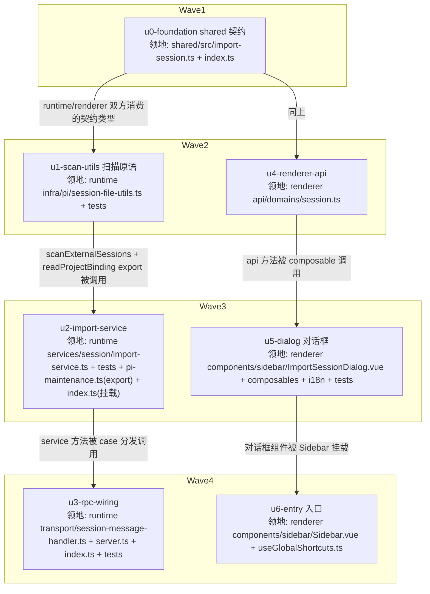

# 导入 pi 会话 实施计划

基线: f47e00b05 | 来源设计: docs/design/import-session.md（v5，r1-r4 对抗式审查收敛 0 must-fix，报告 `.review/design-review-import-session-r{1..4}.md`） | 日期: 2026-09-02

## 0 章节映射

| 内容 | 设计文档实际位置 |
|------|--------------|
| 背景/目标 | §1 背景目标（SCQA + 设计目标 1-4 + in/out-scope） |
| 终态/机制 | §3.1 终态交互样例 + 终态物理数据流图；§3.3 D1-D6 决策（含错误规格表、RPC 契约 D5）；§3.4 探针清单 |
| 验收场景表 | §4 验收 V1-V9（真实场景，回溯目标列） |
| 下一层拆分 | §5（M1-M3 阶段 + U1-U7 单元表 + 文件改动地图 + 待验证检查点） |
| 待验证检查点 | §5 末尾「待验证检查点」（P-model 行为 / P-scan-perf 实测 / pi 升级探针登记） |

## 1 目标快照（逐字摘录）

**设计目标**（从使用者体验倒推）：
1. **能找到**：用户能按名称、完整/短 Session ID（uuid 前 6 位，即 pi TUI 里的 `72cd03` 式短标识）、或 `.jsonl` 绝对路径，在外部 session 里定位到目标；也能按目录（对应原工作目录）浏览。
2. **能导入**：选中后选目标 project（默认当前激活 project，可改），一键导入；导入完成侧边栏该 project 分组立即出现此会话。
3. **能续聊**：点开导入的会话能看到完整历史，直接发消息能继续对话（真 pi attach，非只读）。**降级类**：原工作目录已不存在的会话，按 runtime 既有 F3 兜底在 `~` 续聊，UI 必须标注该事实。
4. **不重复、不出错时知道怎么办**：已导入的 session 在候选列表显示「已导入」不可重复导入；失败场景给出可操作的恢复指引。

**Out-of-scope**：自动发现/持续同步；批量多选；方案 B 命令面板与方案 C 预览视图；移动语义。

## 2 单元列表

| Unit | 职责 | 领地（精确文件路径） | 依赖 | 隔离 | 验收条款 |
|------|------|---------------------|------|------|---------|
| u0-foundation | shared RPC 契约类型（ImportCandidate/ImportCandidatesReply/ImportReply/warning 联合 + 错误码字面量联合） | `packages/shared/src/import-session.ts`（新）；`packages/shared/src/index.ts`（加一行 export） | — | plain | `pnpm --filter @xyz-agent/shared typecheck` 绿；runtime/renderer 可 import |
| u0b-protocol-reg | protocol.ts 协议 Map 登记两命令（5 处：ClientMessageType/ClientMessageMap/ServerMessageType/ServerMessageBase/ReplyPayloadMap） | `packages/shared/src/protocol.ts` | u0 | plain | shared + renderer typecheck 绿（u4 methods 依赖此登记） |
| u1-scan-utils | `scanExternalSessions(dir)` 异步分批扫描（readdir async + 复用 scanSessionMeta 每批 100 后 setImmediate）；外部根独立 TTL 缓存；`isScannableSessionFile`/`cleanupTmpMigrateResidue` 扩展 `.tmp-import-`；export `readProjectBinding` | `packages/runtime/src/infra/pi/session-file-utils.ts`；`packages/runtime/src/__tests__/`（新增 scan-external 测试文件） | u0 | plain | runtime vitest 新测试绿：外部目录样本扫描/tmp+marker 文件不可见/分批让出（fake timers 或批计数断言） |
| u2-import-service | `ImportService`：listCandidates（query 语义 D5/cwdExists/alreadyImported TTL 读）+ importSession（全局互斥 then(work,work)、互斥区内 header 异步读校验/标记校验/双检 id-first/mkdir/tmp+rename/sidecar+readback/失效双缓存）；rootDir 缺省 getPiGlobalAgentDir 推导 | `packages/runtime/src/services/session/import-service.ts`（新）+ 同目录 `__tests__/import-service.test.ts`（新）；`packages/runtime/src/services/session/session-service.ts`（仅：把 importService 挂到对外访问点，若组合根直接 new 则改 `packages/runtime/src/index.ts`）；`packages/runtime/src/infra/pi/pi-maintenance.ts`（仅 export getPiGlobalAgentDir 一行） | u0, u1 | plain | runtime vitest：幂等三类反例（同 id 异 target/同 target 异 id→import_target_conflict/双击连点）、原子性（copy 中途失败无残留 + copy_failed 后第二跳成功）、错误码矩阵（marker/invalid/missing/project_invalid 含空串）、sidecar readback warning 路径 |
| u3-rpc-wiring | `session.importCandidates`/`session.import` 两个 case + ctx 类型/装配 + 组合根注入 | `packages/runtime/src/transport/session-message-handler.ts`；`packages/runtime/src/transport/server.ts`（optional services 类型+字段）；`packages/runtime/src/index.ts`（实例化/传入）；transport `__tests__`（case 分发测试） | u2 | plain | runtime vitest：RPC payload→reply 映射、错误 envelope、import 成功后 broadcastSessionList 被调 |
| u4-renderer-api | api domain 两方法 + 类型对齐 | `packages/renderer/src/api/domains/session.ts` | u0 | plain | renderer typecheck 绿；方法签名与 D5 契约逐字段一致 |
| u5-dialog | ImportSessionDialog.vue（搜索/目录 chip/分组列表/路径模式/已导入态/cwdExists 标注/底部 project 下拉+导入）+ useImportSession composable（debounce 250ms/project 默认当前/导入动作/toast warning 通道）+ i18n zh-CN/en-US | `packages/renderer/src/components/sidebar/ImportSessionDialog.vue`（新）；`packages/renderer/src/composables/features/sidebar/useImportSession.ts`（新）；`packages/renderer/src/i18n/locales/zh-CN/importSession.ts` + `en-US/importSession.ts`（新）+ `zh-CN.ts`/`en-US.ts` 注册（各一行）；`renderer __tests__` 组件测试（三视角，mock api 层） | u4 | plain | renderer vitest 组件测试绿（默认列表/搜索过滤三通道/路径模式切换/已导入禁用/选 project/导入成功 emit+toast/错误内联恢复指引/cwdExists 标注）；`pnpm --filter @xyz-agent/renderer lint` 绿 |
| u6-entry | 侧边栏 nav「导入会话」ghost 按钮（新建任务与搜索之间）+ ⌘I + 打开对话框 | `packages/renderer/src/components/sidebar/Sidebar.vue`；`packages/renderer/src/composables/shell/useGlobalShortcuts.ts` | u5 | plain | renderer vitest：按钮渲染位置断言（新建任务之后）；⌘I 触发 open；手动走查（阶段 5） |

## 3 DAG 图

注：u2 与 u5 领地互斥（runtime vs renderer）且分别只依赖各自链（u1/u4），同波并行安全；u3 与 u6 同理。

## 4 测试策略

- 测试框架：**vitest**（项目 SSOT，禁 node:test；从子包目录运行）
- 增量（每单元开发期）：
  - runtime：`cd packages/runtime && npx vitest run src/__tests__/<本单元测试文件>`（具体路径以实际新文件为准）
  - renderer：`cd packages/renderer && npx vitest run <本单元测试路径>`
  - typecheck：`pnpm --filter @xyz-agent/shared typecheck` / `@xyz-agent/runtime` / `@xyz-agent/renderer`
- 全量（收尾阶段 5）：`pnpm extensions:typecheck && pnpm extensions:lint && pnpm extensions:test` 不涉 extensions 不跑；跑 runtime + renderer 全量 vitest + `pnpm run lint`
- 真实场景验收（阶段 5 Gate B）：设计 §4 V1-V9 逐行签收（`pnpm dev` + Playwright/CDP 浏览器自动化 + 真实 `~/.pi/agent/sessions`）

## 5 合理偏差登记表

| 偏差 | 设计位置 | 实现落点 | 理由 | 裁决 |
|------|---------|---------|------|------|
| protocol.ts 协议 Map 未在 impl-plan 覆盖 | §2 u0/u3/u4 领地边界 | u0b-protocol-reg 补丁单元（shared/src/protocol.ts） | u4 typecheck 被 protocol.ts 未登记阻断；u0 领地仅含 import-session.ts 类型，不含 protocol.ts | 已裁决：增设 u0b 补丁单元（领地=protocol.ts），与 u0/W2 并行安全 |
| u5 领地外 mock 门面 +11 行 | §2 u5 领地 | packages/renderer/src/api/mock/index.ts | mock 轨道门面三元要求与 real domain 同接口，缺 importCandidates/importSession 会破 mock 轨道 | 已裁决：合理偏差，随 u5 commit |
| 设计 In-scope「选择其他目录」未拆入任何 unit | 设计 §1 In-scope + §3.1 line 107 + §4 V8 | u5 领地内补齐（Dialog 目录 chip + 按钮 + rootDir 切换重载，复用 lib/ipc pickDirectory） | impl-plan 拆分遗漏（u5 验收条款漏列此项），V8 为 Gate B 必签场景 | 已裁决：doc_error 级修正，u5 续修轮补入，RPC rootDir 参数契约已就位 |

## 6 状态表

| Unit | 状态 | 轮次 | 证据指针 |
|------|------|------|---------|
| u0-foundation | committed | 1 | shared typecheck 绿（tsc --noEmit exit 0）+ runtime/renderer 消费方 typecheck 绿；commit 5a6e4d729 |
| u0b-protocol-reg | committed | 1 | commit 988ce7034；shared + renderer typecheck 绿 |
| u1-scan-utils | committed | 1 | scan-external 9/9 + tmp-migrate 5/5 + tsc 绿；commit 80d7657bb |
| u2-import-service | committed | 2 | vitest 12/12（含 target 冲突双检并发反例重写：原 s3 段构造错误——same-name-3 与被占 target 不同名属合法导入，重写为两源同 basename 并发一成一拒）+ tsc 绿 + C-services-infra 守卫绿（getRootDir 构造注入，组合根装配）；commits 077f0b9fe |
| u3-rpc-wiring | committed | 1 | case 分发 + ImportServiceError code 透传 + broadcastSessionList 时序（reply 先广播后）；vitest 10/10 + tsc 绿；commit 28d0cec43；偏差：import_unsupported/import_failed 两个 D5 规格表外错误码（对齐 handler 既有可选服务/无 code 兜底惯例） |
| u4-renderer-api | committed | 1 | renderer vue-tsc 绿；commit 702d9cbd0 |
| u5-dialog | committed | 2 | vitest 36/36（32 项验收 8 条 + 4 项 V8 目录切换：选目录切根重载/取消不动/切根+搜索组合/重开回默认根）+ vue-tsc 绿 + 定向 eslint 干净 + pre-commit 全绿（i18n 双侧对齐/CJK 无残留）；commits 75323596f（含 mock 门面领地外偏差）；微观决策：重开回默认根/切根保留搜索词/自定义根路径标注（deviations 已在状态记录） |
| u6-entry | committed | 1 | vitest 3/3（按钮位置在新建任务后/⌘I 打开/点击打开）+ 32 项回归（shortcuts/sidebar 五套件）+ u5 组件 39 回归 + vue-tsc 绿 + 定向 eslint 干净；commit a3f43c2da；成功 toast 与 fresh 徽标归设计 §5 M3 打磨（未拆 unit，阶段 3 裁决）；i18n 复用 importSession.title（u6 领地不含 i18n 文件） |

## 7 残留风险与变更历史

- 残留风险：P-model 行为待 M2 实测回填（设计 §3.4/§5 待验证检查点）；u2/u3 对 `session-service.ts`/`index.ts` 的挂载点以组合根实际结构为准（若发现更优挂载点，记入 §5 偏差表）
- 2026-09-02 计划创建（基线 f47e00b05）
- 2026-09-02 中断恢复校准：前序会话在 W3 中断，u2/u3/u5 半成品留在工作区（无 commit 证据）。主 agent 核验：runtime tsc 绿 + renderer vue-tsc 绿；u2 vitest 11/12（target 冲突双检失败）；u3 case 分发缺失；u5 组件测试缺失。按接替程序补派 dev 续作。另：u0b 状态行此前误贴单元表格式（未标 committed），本次一并修正
- 2026-09-02 文档笔误登记：§2/§4 中 `pnpm --filter @xyz-agent/renderer` 实际包名为 `@xyz-agent/frontend`（u4 committed 时已用正确名验证）
- 2026-09-02 W3/W4 执行完成：u2（077f0b9fe，含架构守卫修复轮：getRootDir 构造注入）、u3（28d0cec43）、u5（75323596f，两轮：32 用例 + V8 目录切换 4 用例）、u6（a3f43c2da）。全部 8 unit committed，转入阶段 3 一致性审查。待审查裁决项：设计 §5 M3 打磨（fresh 徽标淡出/成功 toast/空态骨架/demo 对齐走查）未拆 unit——impl-plan 拆分时仅覆盖 M1+M2（V1-V9 验收面），M3 是否补 unit 待一致性审查裁决
