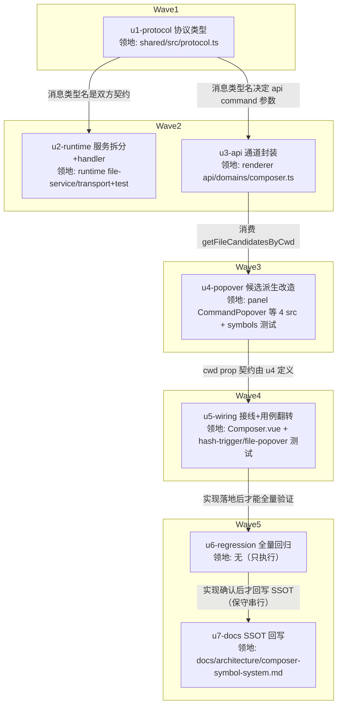

# landing-composer-session-file-symbols 实施计划

基线: 0aeb0b652 | 来源设计: docs/design/landing-composer-session-file-symbols.md | 日期: 2026-09-04

## 0 章节映射

| 内容 | 设计文档实际位置 |
|------|------------------|
| 背景/目标 | §1 背景目标（G1-G4 目标表 + In/Out scope） |
| 终态/机制 | §3 解决方案（3.1 终态 / 3.2 方案对比 / 3.3 D1-D7 决策）+ §2.7 物理数据流图 |
| 验收场景表 | §4 验收（S1-S7 含 S4a/S4b，真实场景表） |
| 下一层拆分 | §5 下一层拆分（U1-U7 单元表 + 待验证 2 条） |
| 待验证检查点 | §5 待验证（open-fetch 注入形态落点 / mock 模式行为） |

对抗式审查证据：`.review/design-review-landing-symbols-r1.md`（R1: 1 must-fix + 3 suggestions → 全修；R2 聚焦复审: 0 must-fix + 0 suggestion，**DoR 达成**）。

## 1 目标快照（逐字摘录设计 §1）

> **目标**：
> - G1 landing 态敲 `$` 弹出**当前选定目录**的文件候选，选中插绿色 file chip，随首条消息发送后 LLM 能读到文件内容
> - G2 landing 态敲 `#` 弹出**跨 cwd 全量**已有 session 候选，选中插金色 session chip（显 label），发送后 LLM 经 `session_read` 获取该 session 上下文
> - G3 `@` subagent 在 landing 维持不弹（原 D3 拍板「@ 范围限当前 session」延续，无当前 session 即无数据源）
> - G4 panel 态四符号行为零回归
>
> **Out of scope**：`@` landing 支持（G3 明确不做）；landing 态 `$` 候选的 gitignore 开关 UI（沿用 panel 默认 `showIgnored=false`）；跨目录文件候选（只列当前选定目录）。

## 2 单元列表

| Unit | 职责 | 领地（精确文件路径） | 依赖 | 隔离 | 验收条款 |
|------|------|----------------------|------|------|----------|
| u1-protocol | 新增 `file.search.cwd` 请求/reply 协议类型（foundation 共享契约根） | `packages/shared/src/protocol.ts` | 无 | plain | ①`pnpm --filter @xyz-agent/shared typecheck` 绿 ②protocol.ts 含三处映射：ClientMessageType `'file.search.cwd'` + ClientMessageMap `{ cwd: string }` + ServerMessageMap `'file.search.cwd:result': { files: FileNode[] }` 及 reply 联合/handler 映射（grep 可判） |
| u2-runtime | FileService 拆 `searchFilesInCwd(cwd)` 核心 + handler 新 case | `packages/runtime/src/services/file-service.ts` · `packages/runtime/src/transport/file-message-handler.ts` · `packages/runtime/test/file-service.test.ts` · `packages/runtime/test/file-message-handler.test.ts` | u1 | plain | `cd packages/runtime && pnpm vitest run test/file-service.test.ts test/file-message-handler.test.ts` 绿：①cwd 路新 case（合法 cwd 返回 files / 无效 cwd FileError 结构化失败）②session 路等价回归 case 全绿（searchFiles 薄包装行为不变） |
| u3-api | renderer 通道封装 `getFileCandidatesByCwd` | `packages/renderer/src/api/domains/composer.ts` | u1 | plain | ①`pnpm --filter @xyz-agent/frontend typecheck` 绿 ②函数存在且走 `command('file.search.cwd', { cwd })`（grep 可判） |
| u4-popover | 候选派生改造：`#` 删参 + `$` cwd 路（open-fetch 边沿拉）+ CommandPopover items 分支 | `packages/renderer/src/components/panel/CommandPopover.vue` · `command-popover-symbols.ts` · `command-popover-open-fetch.ts` · `command-popover-file-candidates.ts` · `packages/renderer/src/__tests__/panel/command-popover-symbols-format-age.test.ts` | u1, u3 | plain | `cd packages/renderer && pnpm vitest run src/__tests__/panel/command-popover-symbols-format-age.test.ts src/__tests__/panel/composer-file-popover.test.ts` 绿：①`buildSessionCandidates` 无 hasSessionId 参数且 landing mount（无 sid）有候选 ②`buildSubagentCandidates` 保留 hasSessionId（landing 空）③open-fetch file 路无 sid 有 cwd 时按 cwd 拉取（断言 mock 调用） |
| u5-wiring | Composer 注入 cwd prop + 翻转固化用例 | `packages/renderer/src/components/panel/Composer.vue` · `packages/renderer/src/__tests__/panel/composer-hash-trigger.test.ts` · `packages/renderer/src/__tests__/panel/composer-file-popover.test.ts` | u4 | plain | `cd packages/renderer && pnpm vitest run src/__tests__/panel/composer-hash-trigger.test.ts` 绿：①S4 翻转（landing 态 `#` 有候选渲染）②A5 用例保留且绿（`@` landing 不弹护栏）③`$` landing 触发→浮层渲染断言 |
| u6-regression | 全量回归 + 三视角终验（验证单元，无 src 改动） | （无领地——只执行命令；失败修复限前序单元领地） | u5 | plain | ①根 `pnpm test` 全绿 ②`pnpm --filter @xyz-agent/shared typecheck && pnpm --filter @xyz-agent/runtime typecheck && pnpm --filter @xyz-agent/frontend typecheck` 绿 ③根 `pnpm lint` 绿 |
| u7-docs | symbol-system SSOT 回写（C-proc-10） | `docs/architecture/composer-symbol-system.md` | u6 | plain | ①§1 Out 清单第 5 条改为仅 `@` 并链接设计文档 ②§5 待验证清单第 4 条同步修订 ③增补决策记录指向 `docs/design/landing-composer-session-file-symbols.md`（grep 可判） |

## 3 DAG 图

波次数 5，最大并发 2（≤5 兼容）。任意两单元领地交集为空 ✅（protocol.ts 仅 u1 改、CommandPopover.vue 仅 u4 改、Composer.vue 仅 u5 改——共享接线点集中律成立，故无热点冲突、全部 plain）。

## 4 测试策略

**增量（各单元验收即跑）**：
- shared：`pnpm --filter @xyz-agent/shared typecheck`（协议是纯类型，编译期即验证）
- runtime：`cd packages/runtime && pnpm vitest run test/file-service.test.ts test/file-message-handler.test.ts`（vitest 配置在子包，从子包目录跑）
- renderer：`cd packages/renderer && pnpm vitest run src/__tests__/panel/<指定文件>`（u4/u5 各自领地内文件）+ `pnpm --filter @xyz-agent/frontend typecheck`

**全量（u6）**：根 `pnpm test`（package.json:17，含 packages/apps/extensions 全部）+ shared/runtime/frontend 三包 typecheck + 根 `pnpm lint`。

**测试框架纪律**（项目 AGENTS.md）：全部 vitest；timer 用 fake timers；新测试写删目标 mkdtempSync 自建自删，禁触真实数据目录。

## 5 合理偏差登记表

| Unit | 偏差 | 理由 | 登记 |
|------|------|------|------|
| u2-runtime | interfaces.ts（原计划外）+2 行 | IFileService 精确签名接口需声明 searchFilesInCwd，handler 类型化调用必需；计划遗漏该文件归属，orchestrator 裁决划入 u2 | 计划领地列已补（本行即登记） |
| u2-runtime | showIgnored 不透传 cwd 路 | 协议 payload 仅 { cwd }（设计 Out-of-scope 定死默认 false） | 无需改设计 |
| u2-runtime | cwd 无效错误码用 not_found | FileErrorCode 枚举无 invalid_path，选现有最近似码 | 无需改设计 |
| u2-runtime | session cwd 目录已删：旧返回 [] → 新抛 not_found | stat 准入前置的必然推论；renderer 侧 load 失败降级空态（useFileSearch catch → []），用户可见行为不变（浮层空），错误信息更准确 | 合理偏差，接受 |
| u2-runtime | cwd 路 error envelope 无 details | 无 sessionId 上下文，沿用 file.read 既有先例 | 无需改设计 |
| u4-popover | hash-trigger S4 转红（u5 领地未动） | D1 删门后按设计必然翻红，S4 翻转正是 u5 验收条款① | 无需改设计 |
| u4-popover | open-fetch 直接 import api domain 而非 '@/api' 门面 | mock 域未扩 getFileCandidatesByCwd（领地外）；直接 import 有既有先例；mock 下失败降级空态符合计划待验证② | 无需改设计 |
| u4-popover | file-candidates 仅修 1 行过时注释 | 原注释与实际门不符 | 无需改设计 |
| u4-popover | cwd 拉取失败主动清空本地 ref | 防换目录后失败时残留脏候选，保证失败→无浮层恒成立，有专项用例 | 合理增强 |
| u4-popover | 落点选择：open-fetch 经 onCwdFileCandidates 回调写入 CommandPopover 本地 ref（cwdFileCandidates），未拆新文件 | 设计 §5 待验证①授权的实施期落点，script 294/300 | 状态表 u4 行所称第 5 条偏差即本条（登记补录于 design-code-sync R1） |
| u5-wiring | LP 组 fake Date 节流隔离 | open-fetch 1s 节流依赖 Date.now（模块级真实时钟），测试以 toFake:['Date']（composer-file-popover.test.ts:163 beforeEach）+ LP2 advanceTimersByTime(1001) 跳节流窗口隔离跨用例污染（:197） | 状态表 u5 行所称第 3 条偏差即本条（登记补录于 design-code-sync R1，锚点经 R2 复审修正） |
| u5-wiring | 绑定用 flow.currentCwd?.value ?? null 而非字面 prop | flow 是普通对象嵌套 ComputedRef 模板不自动解包；?. 同时防御领地外测试 mock 缺字段（退化为 S4b 空态语义） | 合理偏差，接受 |
| u5-wiring | 新断言改用 data-reka-popper-content-wrapper 真选择器 | 旧 data-radix-* 是恒 null 空选择器（旧 S4/A5/U8 该断言空洞）；仅新/翻转断言改真选择器，旧断言未动（A5 仍有 bodyRows 实体断言护栏） | 登记残留风险：旧空洞断言留待后续批清理 |
| （初始空位） | | | |

## 6 状态表

| Unit | 状态 | 轮次 | 证据指针 |
|------|------|------|----------|
| u1-protocol | committed | 1 | typecheck 绿 + grep 7 处（:111/:487/:761/:1158/:1571），commit 577cbbeed |
| u2-runtime | committed | 1+1（补接口授权轮） | vitest 18/18 + runtime typecheck 绿，commit 3a77447e6；blocker 已裁决（interfaces.ts 划入领地补 1 行）；审查返修已 commit 9ddd37eab |
| u3-api | committed | 1 | frontend typecheck 绿 + grep :41-42，commit 97ebba367 |
| u4-popover | committed | 1 | vitest 19/19 + typecheck 绿，commit b86d7cad6；5 条偏差已审（合理，见 §5） |
| u5-wiring | committed | 1 | panel 517/517 全绿 + typecheck 绿，commit f970b925b；3 条偏差合理（flow.currentCwd?.value 解包 / reka 真选择器 / fake Date 节流隔离） |
| u6-regression | committed | 1 | 全量 vitest 绿（subagent-core 6 例/TaiJi 宿主 env 注入净环境 12/12 绿；runtime thinking-e2e 1 例/基线同红实锤非本次引入）+ 三包 typecheck + lint 全绿；无领地外修复 |
| u7-docs | committed | 1 | grep 3 处链接 + diff 仅 3 hunk，commit 33a8b407b |
| 一致性审查 | 清零 | 1 轮 | A 区 2 unreasonable+2 doc_errors 已修（9ddd37eab+计划修正）；B 区 1 unreasonable 已修（daa4480d9）+0 doc_errors；reasonable 7 条入登记 |
| Gate A | PASS | 1 | 全量 vitest 绿（3 处环境性红均基线对照实锤）+ 10 包 typecheck + 双 lint + 零容忍绕过 0 命中 + 覆盖矩阵无缺口 |
| Gate B | PASS 8/8 | 1 | 真实 dev app（隔离数据目录）逐场景验证：S1/S2/S3/S4a/S4b/S5/S6/S7 全过（S2/S5 带 note：session_reader 在隔离目录读回受限、混合 chip 观察受时序限制，核心断言均过）；截图证据 /tmp/gateb-shots/ |

## 7 残留风险与变更历史

**残留风险**：
1. 设计 §5 待验证①：open-fetch 拉取结果注入 items 的形态——已落地：open-fetch 经回调写入 CommandPopover 本地 ref（u4，script 294/300）。
2. 设计 §5 待验证②：mock 模式行为——已落地：open-fetch 直接 import api domain（有先例），mock 下失败降级空态（u4 偏差登记）。
3. 设计 D5 已知边界：换目录后旧 `$` chip 相对路径漂移——登记不处理（失败可见可恢复）。
4. [阶段 3 审查新增] 存量测试空洞断言遗留：本仓 reka-ui 真实属性为 data-reka-popper-content-wrapper，存量 data-radix-* 选择器恒 null（断言空洞）。本次已修：u5 翻转/新增断言 + u4 两处负向用例（daa4480d9）。仍残留：composer-hash-trigger.test.ts:276/:475、command-popover-landing.test.ts:129、composer-slash-trigger.test.ts:191（各有 bodyRows 实体断言兑底，非裸奔）——留待后续批清理，非本计划范围。

**变更历史**：
- 2026-09-04 计划创建（来源设计 R2 复审 0 must-fix 后）。
- 2026-09-04 执行期：u1→u3/u2（W2 并行）→u4→u5 依次 committed；u2 blocker（interfaces.ts 领地外）裁决划入 u2；u4/u5 偏差全部裁决登记（含 design-code-sync R1 补录 2 条）。
- 2026-09-04 u6 全量回归：绿（subagent-core 6 例=TaiJi 宿主 env 注入，净环境 12/12 绿；runtime thinking-e2e 1 例=基线同红实锤非本次引入）；三包 typecheck + lint 绿。
- 2026-09-04 阶段 3 一致性审查（分区 A）：doc_errors 2 条修正——①u2 状态表残留 pending 行删除；②偏差登记第 1 条「计划领地列已补」与 §2 表矛盾，以本行澄清：interfaces.ts 领地补充以 §5 登记行为准，§2 领地列不改写历史。分区 A unreasonable 2 条（file-service.ts:190 注释 #→$ 术语、:231 @throws 补 permission_denied/timeout）打回 u2 定向修。
- 2026-09-05 design-code-sync R1（终态全量）：2 must-fix（F-01 偏差登记缺 2 行已补录、F-02 file.search case 注释与拆分后行为矛盾→fixer 修）+ 3 suggestion（F-03 存量 # 注释 5 处→fixer 修、F-04 基线占位符已回填 0aeb0b652、F-05 composer.ts 头注释 mock 偏差说明→fixer 修）+ 2 info（F-06 依序措辞已修、F-07 设计 U7 行 D1-D6→D1-D7 已修）；无 contested。收敛轨迹：R1 待修 7 → 聚焦复审待确认。
