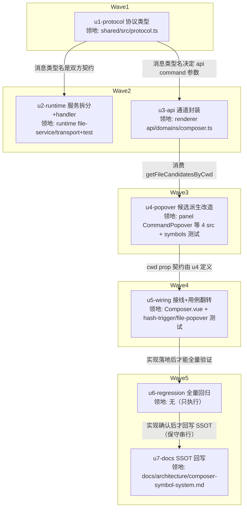

# landing-composer-session-file-symbols 实施计划

基线: <待评审后 commit> | 来源设计: docs/design/landing-composer-session-file-symbols.md | 日期: 2026-09-04

## 0 章节映射

| 内容 | 设计文档实际位置 |
|------|------------------|
| 背景/目标 | §1 背景目标（G1-G4 目标表 + In/Out scope） |
| 终态/机制 | §3 解决方案（3.1 终态 / 3.2 方案对比 / 3.3 D1-D7 决策）+ §2.7 物理数据流图 |
| 验收场景表 | §4 验收（S1-S7 含 S4a/S4b，真实场景表） |
| 下一层拆分 | §5 下一层拆分（U1-U7 单元表 + 待验证 2 条） |
| 待验证检查点 | §5 待验证（open-fetch 注入形态落点 / mock 模式行为） |

对抗式审查证据：`.review/design-review-landing-symbols-r1.md`（R1: 1 must-fix + 3 suggestions → 全修；R2 聚焦复审: 0 must-fix + 0 suggestion，**DoR 达成**）。

## 1 目标快照（逐字摘录设计 §1）

> **目标**：
> - G1 landing 态敲 `$` 弹出**当前选定目录**的文件候选，选中插绿色 file chip，随首条消息发送后 LLM 能读到文件内容
> - G2 landing 态敲 `#` 弹出**跨 cwd 全量**已有 session 候选，选中插金色 session chip（显 label），发送后 LLM 经 `session_read` 获取该 session 上下文
> - G3 `@` subagent 在 landing 维持不弹（原 D3 拍板「@ 范围限当前 session」延续，无当前 session 即无数据源）
> - G4 panel 态四符号行为零回归
>
> **Out of scope**：`@` landing 支持（G3 明确不做）；landing 态 `$` 候选的 gitignore 开关 UI（沿用 panel 默认 `showIgnored=false`）；跨目录文件候选（只列当前选定目录）。

## 2 单元列表

| Unit | 职责 | 领地（精确文件路径） | 依赖 | 隔离 | 验收条款 |
|------|------|----------------------|------|------|----------|
| u1-protocol | 新增 `file.search.cwd` 请求/reply 协议类型（foundation 共享契约根） | `packages/shared/src/protocol.ts` | 无 | plain | ①`pnpm --filter @xyz-agent/shared typecheck` 绿 ②protocol.ts 含三处映射：ClientMessageType `'file.search.cwd'` + ClientMessageMap `{ cwd: string }` + ServerMessageMap `'file.search.cwd:result': { files: FileNode[] }` 及 reply 联合/handler 映射（grep 可判） |
| u2-runtime | FileService 拆 `searchFilesInCwd(cwd)` 核心 + handler 新 case | `packages/runtime/src/services/file-service.ts` · `packages/runtime/src/transport/file-message-handler.ts` · `packages/runtime/test/file-service.test.ts` · `packages/runtime/test/file-message-handler.test.ts` | u1 | plain | `cd packages/runtime && pnpm vitest run test/file-service.test.ts test/file-message-handler.test.ts` 绿：①cwd 路新 case（合法 cwd 返回 files / 无效 cwd FileError 结构化失败）②session 路等价回归 case 全绿（searchFiles 薄包装行为不变） |
| u3-api | renderer 通道封装 `getFileCandidatesByCwd` | `packages/renderer/src/api/domains/composer.ts` | u1 | plain | ①`pnpm --filter @xyz-agent/frontend typecheck` 绿 ②函数存在且走 `command('file.search.cwd', { cwd })`（grep 可判） |
| u4-popover | 候选派生改造：`#` 删参 + `$` cwd 路（open-fetch 边沿拉）+ CommandPopover items 分支 | `packages/renderer/src/components/panel/CommandPopover.vue` · `command-popover-symbols.ts` · `command-popover-open-fetch.ts` · `command-popover-file-candidates.ts` · `packages/renderer/src/__tests__/panel/command-popover-symbols-format-age.test.ts` | u1, u3 | plain | `cd packages/renderer && pnpm vitest run src/__tests__/panel/command-popover-symbols-format-age.test.ts src/__tests__/panel/composer-file-popover.test.ts` 绿：①`buildSessionCandidates` 无 hasSessionId 参数且 landing mount（无 sid）有候选 ②`buildSubagentCandidates` 保留 hasSessionId（landing 空）③open-fetch file 路无 sid 有 cwd 时按 cwd 拉取（断言 mock 调用） |
| u5-wiring | Composer 注入 cwd prop + 翻转固化用例 | `packages/renderer/src/components/panel/Composer.vue` · `packages/renderer/src/__tests__/panel/composer-hash-trigger.test.ts` · `packages/renderer/src/__tests__/panel/composer-file-popover.test.ts` | u4 | plain | `cd packages/renderer && pnpm vitest run src/__tests__/panel/composer-hash-trigger.test.ts` 绿：①S4 翻转（landing 态 `#` 有候选渲染）②A5 用例保留且绿（`@` landing 不弹护栏）③`$` landing 触发→浮层渲染断言 |
| u6-regression | 全量回归 + 三视角终验（验证单元，无 src 改动） | （无领地——只执行命令；失败修复限前序单元领地） | u5 | plain | ①根 `pnpm test` 全绿 ②`pnpm --filter @xyz-agent/shared typecheck && pnpm --filter @xyz-agent/runtime typecheck && pnpm --filter @xyz-agent/frontend typecheck` 绿 ③根 `pnpm lint` 绿 |
| u7-docs | symbol-system SSOT 回写（C-proc-10） | `docs/architecture/composer-symbol-system.md` | u6 | plain | ①§1 Out 清单第 5 条改为仅 `@` 并链接设计文档 ②§5 待验证清单第 4 条同步修订 ③增补决策记录指向 `docs/design/landing-composer-session-file-symbols.md`（grep 可判） |

## 3 DAG 图

波次数 5，最大并发 2（≤5 兼容）。任意两单元领地交集为空 ✅（protocol.ts 仅 u1 改、CommandPopover.vue 仅 u4 改、Composer.vue 仅 u5 改——共享接线点集中律成立，故无热点冲突、全部 plain）。

## 4 测试策略

**增量（各单元验收即跑）**：
- shared：`pnpm --filter @xyz-agent/shared typecheck`（协议是纯类型，编译期即验证）
- runtime：`cd packages/runtime && pnpm vitest run test/file-service.test.ts test/file-message-handler.test.ts`（vitest 配置在子包，从子包目录跑）
- renderer：`cd packages/renderer && pnpm vitest run src/__tests__/panel/<指定文件>`（u4/u5 各自领地内文件）+ `pnpm --filter @xyz-agent/frontend typecheck`

**全量（u6）**：根 `pnpm test`（package.json:17，含 packages/apps/extensions 全部）+ shared/runtime/frontend 三包 typecheck + 根 `pnpm lint`。

**测试框架纪律**（项目 AGENTS.md）：全部 vitest；timer 用 fake timers；新测试写删目标 mkdtempSync 自建自删，禁触真实数据目录。

## 5 合理偏差登记表

| Unit | 偏差 | 理由 | 登记 |
|------|------|------|------|
| （初始为空） | | | |

## 6 状态表

| Unit | 状态 | 轮次 | 证据指针 |
|------|------|------|----------|
| u1-protocol | pending | 0 | — |
| u2-runtime | pending | 0 | — |
| u3-api | pending | 0 | — |
| u4-popover | pending | 0 | — |
| u5-wiring | pending | 0 | — |
| u6-regression | pending | 0 | — |
| u7-docs | pending | 0 | — |

## 7 残留风险与变更历史

**残留风险**：
1. 设计 §5 待验证①：open-fetch 拉取结果注入 items 的形态（prop 下传 vs ref 直连）——u4 实施期按 CommandPopover.vue script 300 行上限落点，验收条款不变。
2. 设计 §5 待验证②：mock 模式（VITE_MOCK=true）下 `file.search.cwd` 行为——u4/u5 实施时确认 mock 返回静态候选或空数组皆可（S1-S7 验收不依赖 mock）。
3. 设计 D5 已知边界：换目录后旧 `$` chip 相对路径漂移——登记不处理（失败可见可恢复）。

**变更历史**：
- 2026-09-04 计划创建（来源设计 R2 复审 0 must-fix 后）。
