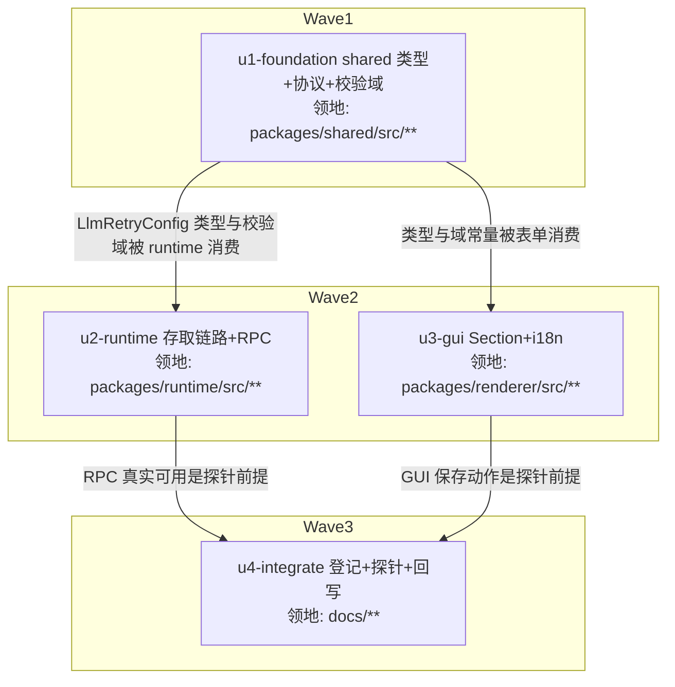

# llm-retry-settings 实施计划

基线: 3f7ddf4fa | 来源设计: docs/design/llm-retry-settings.md | 日期: 2026-08-31

## 0 章节映射

| 内容 | 本文实际位置 |
|------|--------------|
| 背景/目标 | §1 背景目标（SCQA + G1-G4 + In/Out scope） |
| 终态/机制 | §2 现状与问题分析（2.2 两层重试真实语义 + rpc 落盘写点）；§3 解决方案（3.1 终态交互 / 3.2 方案对比 / 3.3 决策 D1-D8 + 错误规格表 / 3.4 接口与数据模型） |
| 验收场景表 | §4 验收（S1-S7，含步骤与通过标准；S4 含执行方式/两编排/判定力声明） |
| 下一层拆分 | §5 下一层拆分（U1-U4 + 文件改动地图） |
| 待验证检查点 | §5 待验证检查点 P1（⛔实施期门 S6 探针）、P2（写后立刻读单测）；P3 已消解 |
| 审查证据 | docs/design/llm-retry-settings.review.md（4 轮收敛，终轮 0 must-fix，commit 7881eba1e） |

## 1 目标快照（逐字摘录自设计文档 §1）

- **G1 可发现、可修改**：不手编 JSON，在设置 GUI 中完成重试策略调整；表单值与 pi 真实生效语义一致（不出现「GUI 显示的值 pi 实际不这么读」）。
- **G2 写对地方、并发安全**：写入 xyz-agent 隔离目录的 settings.json；与 pi 子进程自身的 settings 落盘并发时互不覆盖。
- **G3 危险参数后果可见**：当前可配出「单次对话最长等待 85 分钟」的组合（见 §2 失败模式 B），GUI 必须把指数退避的后果显性化。
- **G4 生效时机可预期**：用户能预期配置改动的生效范围（新会话生效，运行中会话不变）。

**Out of scope**（逐字摘录）：per-provider / per-model 差异化重试；运行中会话热生效；独立 pi CLI（`~/.pi/agent/`）的 GUI 管理；摘要路径（compaction / branch summary）单独配置。

## 2 单元列表

| Unit | 职责 | 领地（精确文件路径） | 依赖 | 隔离 | 验收条款 |
|---|---|---|---|---|---|
| u1-foundation | shared 契约根节点：`LlmRetryConfig` / `LlmRetryProviderConfig` 类型 + D8 合法域常量 + `validateLlmRetryConfig` 纯函数 + 协议消息类型（`config.getRetryConfig` / `config.setRetryConfig` / `config.retryConfig`）。校验域定在 shared：renderer 表单与 runtime 写入侧共用同一套域常量，杜绝两端漂移（SG-1 场景的预防） | `packages/shared/src/llm-retry.ts`（新）· `packages/shared/src/protocol.ts`（增量：消息类型）· `packages/shared/src/index.ts`（导出，如需）· `packages/shared/src/__tests__/llm-retry.test.ts`（新） | 无 | plain | shared 包 `npx vitest run src/__tests__/llm-retry.test.ts` 绿：域内通过 / 越界拒绝（各字段边界）/ `provider.timeoutMs=0` 拒绝 / 缺省字段合入；既有 shared 测试无回归 |
| u2-runtime | runtime 存取链路：`SCOPE_FIELDS` 加 `retry`；infra `pi-retry-settings.ts`（D3 任意层级非 plain object 替换规则 + 六键嵌套 merge）；port `ILlmRetrySettings`；helper（ConfigService 逻辑承载，控 max-lines 500）；ConfigService 单行委托；index 注装；handler +2 case（含校验失败 D10 错误信封 + 成功 broadcast）；pi-settings-store.ts:8 失准注释修正（P3 遗留） | `packages/runtime/src/infra/pi/pi-settings-store.ts` · `packages/runtime/src/infra/pi/pi-retry-settings.ts`（新）· `packages/runtime/src/services/ports/llm-retry-settings.ts`（新）· `packages/runtime/src/services/llm-retry-config-helper.ts`（新）· `packages/runtime/src/services/config-service.ts` · `packages/runtime/src/index.ts` · `packages/runtime/src/transport/settings-message-handler.ts` · 测试：`packages/runtime/src/infra/pi/__tests__/pi-retry-settings.test.ts`（新）· `packages/runtime/src/services/__tests__/llm-retry-config.test.ts`（新）· `packages/runtime/src/transport/__tests__/settings-message-handler-llm-retry.test.ts`（新，命名可随既有 handler 测试惯例调整） | u1 | plain | ① runtime 包增量 vitest 绿：D3 merge（顶层/嵌套坏值替换、六键只 patch 已知键）、写后立刻读（P2）、handler case（get 回 configured/configured 语义、set 越界 sendError 不落盘、set 成功 reply+broadcast）；② config-service 既有测试无回归；③ 本地 `pnpm dev` 下用 WS 调试脚本调 `config.get/setRetryConfig`，实测读写 `~/.xyz-agent/pi/agent/settings.json` 的 retry 字段（Phase 1 出口；S7 前半预演） |
| u3-gui | renderer：`SystemLlmRetrySection.vue`（基础区三键 + 高级折叠区 provider 三键 + 等待预览行实时重算 + configured 徽标 + 存量超域/坏值行内标注 + 显式保存按钮 + toast + 「保存后对新会话生效」提示，交互对齐 demo html）；SystemPage 挂载；api 域转发 +2；i18n 双语键 | `packages/renderer/src/api/domains/config.ts` · `packages/renderer/src/components/settings/system/SystemLlmRetrySection.vue`（新）· `packages/renderer/src/components/settings/system/SystemPage.vue` · `packages/renderer/src/i18n/locales/zh-CN/settings.ts` · `packages/renderer/src/i18n/locales/en-US/settings.ts` · `packages/renderer/src/__tests__/settings/llm-retry-section.test.ts`（新） | u1 | plain | ① renderer 包增量 vitest 绿：Section 渲染断言（三视角，含用户可见 DOM 断言：预览行文本、折叠交互、越界 toast、开关态切预览文案）+ settings 既有测试无回归；② `pnpm dev` 打开设置→系统可见「LLM 调用」分组，手工过一遍 demo 三场景（编辑/越界/未配置） |
| u4-integrate | 收口：data-source-registry 登记 retry 字段域；S4 探针（独立 pi 进程 + GUI 两编排并发，按 §4 执行方式含报文示例/10s 轮询超时）与 S6 探针（新会话生效 / 运行中不生效）真实执行并留证据；P1 结论回写设计文档变更历史 | `docs/architecture/data-source-registry.md` · `docs/design/llm-retry-settings.md`（变更历史 + P1 回写）；探针脚本临时存放（/tmp 或项目内不提交，用完归档移除） | u2, u3 | plain | ① data-source-registry.md 含 retry 域条目（管理方/读写通道/锁协议）；② S4 编排 A/B 输出证据（文件终态 + 断言结果贴入计划状态表）；③ S6 探针结论回写（P1 消解或翻案）；④ `node scripts/check-doc-symbol-drift.mjs` 过 |

## 3 DAG 图

## 4 测试策略

- **增量（单元开发期内）**：从对应子包目录 `npx vitest run <新增/受影响测试文件>`（红线：vitest、配置在子包 vitest.config.ts、从子包目录运行；timer 用 fake timers）。lint 由 pre-commit 承担，禁跳过。
- **全量（阶段 5 Gate A，收尾场景）**：
  - `cd packages/shared && pnpm test`
  - `cd packages/runtime && pnpm test`
  - `cd packages/renderer && pnpm test`
  - 仓库根 `pnpm run lint`
  - extensions 三连不涉及（extensions/ 零改动），不跑。

## 5 合理偏差登记表

| Unit | 偏差 | 理由 | 登记时间 |
|---|---|---|---|
| u2-runtime | 领地补列 `packages/runtime/src/interfaces.ts`（IConfigService 接口声明 get/setRetryConfig） | ConfigService 单行委托必须同步接口声明，计划文件地图漏列；改动内容为接口方法声明，必要且无副作用 | 2026-08-31 |
| u2-runtime | 领地补列 `packages/runtime/src/services/worktree/worktree-service.test.ts`（mockConfigService 补 retry 两 stub） | 上行接口变更的连带必要改动：mock IConfigService 不补齐则该测试类型/运行失败 | 2026-08-31 |
| u2-runtime | infra 实现形态为 class PiRetrySettings（实现 ILlmRetrySettings），helper 纯函数承载 D3/D7 逻辑 | 同 PiExtensionSettings 先例 + D17 分层（infra 只做 I/O 编排）；行为与设计无差 | 2026-08-31 |
| 执行方式 | 单元拆小为子步串行派发（u2a1→u2b…；u3 拆 component/tests 两步），DAG 波次语义不变 | zsw zcode 引擎单轮 300s 终态观察窗为硬编码上限（ZCODE_APPSERVER_TURN_DEFAULT_TIMEOUT_MS），原 u2/u3 单任务体量单轮跑不完；u1 实测 4min 已近边缘 | 2026-08-31 |
| u2-runtime | ConfigService 对 port 采用可选注入 + 未注入抛错（生产 index.ts 恒注入，行为无差；保住既有 ConfigService 测试不破坏） | 一致性审查 A 区 reasonable；可选注入非设计字面「单行委托」但有先例且生产行为无差 | 2026-08-31 |
| u1/u2 | D8 校验纯函数最终落位 shared/llm-retry.ts（设计 §3.4 原文「放 shared 或 runtime helper，实施期定」的实现选型） | renderer 表单与 runtime 写侧编译期共享同一常量，杜绝两端漂移（SG-1 预防的更优实现） | 2026-08-31 |
| u3-gui | provider 三键用 string 输入承载「留空 = 未设」；maxRetryDelayMs 缺省显示为空 + i18n 提示默认 60000（与 D8 表「缺省显示值 60000」形式差异、语义等价且可回退） | 一致性审查 B 区 reasonable；设计 §3.4 已补注 | 2026-08-31 |
| u3-gui | Switch 用 :model-value + @update:model-value（非 v-model 简写） | 与 SystemSmartContextSection 既有组件族范式一致 | 2026-08-31 |
| u3-gui | 预览行额外展示「最长单次等待」（设计只要求累计等待） | G3 后果可见性增强 | 2026-08-31 |

## 6 状态表

| Unit | 状态 | 轮次 | 证据指针 |
|---|---|---|---|
| u1-foundation | committed | 1 | 测试：shared `npx vitest run` 22 文件 225 用例全绿（含新增 9 条）+ `tsc --noEmit` 过（dev 回报与主 agent 重跑一致）；diff 核验：4 文件 ⊆ 领地，protocol.ts 纯增量 |
| u2-runtime | committed | 1 | 测试：新增 3 测试文件 26 用例全绿（merge/configured/handler case/P2 写后立刻读）+ services/transport 回归 27 文件 325 用例全绿 + runtime `tsc --noEmit` 过；主 agent 抽查 helper D3/D7 实现、handler 范式合格；偏差 3 条见登记表 |
| u3-gui | committed | 2（dev 1 + fix 1） | 测试：新增 llm-retry-section.test.ts 8 用例全绿（三视角 DOM 断言：预览行实时重算/折叠/保存 RPC 组装/越界拦截/configured 徽标/超域行内标注）+ settings 套件 23 文件 166 用例全绿；fix 轮修 fmtDur 小时档 10 倍放大 bug（min/6→min/60，85.25 分钟正确渲染 1.4 小时）；renderer 全量 tsc 的 useCommandPopoverTrigger.ts 报错为存量（该文件未改动），与本单元无关（后经并行线修复，vue-tsc 全量 exit 0） |
| u4-integrate | committed（登记部分） | 1 | data-source-registry.md:97 retry 域条目 + 设计文档变更历史（commit e5b394f2b）；S1-S7 真实场景验收（含 S4/S6 探针）deferred to Gate B——见阶段 5 签收表 |

## 7 残留风险与变更历史

### Gate B 签收表（2026-08-31，隔离真实环境：XYZ_AGENT_DATA_DIR=/tmp/gateb/data + 真实 runtime + 真实 pi 子进程，WS 探针执行）

| 场景 | verdict | 关键证据 |
|---|---|---|
| S1 调整退避参数真实生效 | PASS | 会话重试序列 `auto_retry_start attempt=1 delay=3000 → attempt=2 delay=6000`（baseDelayMs=3000 指数翻倍精确），2 次后 `auto_retry_end success=false` 落错误 |
| S2 关闭重试失败直达 | PASS | enabled=false 保存后新会话 0 次重试，错误直接落 assistant 消息 |
| S3 不可重试错误对照 | PASS | 本地 401 服务器 + enabled=true/1 次预算：0 次重试直接失败（认证类错误不受重试配置影响） |
| S4 与 pi 子进程并发互不覆盖 | PASS | 编排 A（pi 先/xyz 后）终态 enabled=true + xyz 键正确；编排 B（xyz 先/pi 后）终态 enabled=false + xyz 的 maxRetries/baseDelayMs 未被回滚 + 未知键保留 |
| S5 隔离体系不受影响 | PASS | `~/.pi/agent/settings.json` sha256 前后一致（bf4b9375…） |
| S6 生效范围（P1 消解） | PASS | 配置改动后：旧会话（disabled 时期创建）再发消息仍 0 重试；新会话 1 次重试 delay=5000——运行中会话不受影响、新会话即时生效，D6 静态提示语义成立 |
| S7 损坏自愈 | PASS | 顶层 `retry:"abc"` 与嵌套 `provider:"abc"` 均回退默认值显示；保存后文件恢复合法对象且未知键保留；越界保存被 `set_retry_config_failed` 信封拒绝（含字段/范围/值） |

> 验收手段说明：S1 的「服务商限流」以本机关闭端口（fetch failed 命中可重试 pattern）等价触发——外部服务商 429 行为不可控，属计划残留风险预告过的手段调整；错误分类语义（可重试/不可重试）由 S1（网络类）与 S3（401）双向覆盖。

### 残留风险

- **存量（非本变更）**：renderer 全量测试中 `useChat-subagent-directive.test.ts` 2 用例失败、`MessageStream-bash.test.ts` 3 用例 skipped——涉及文件均不在本变更区间（3f7ddf4fa..HEAD 未触碰），归属并行工作线（subagent-core-convergence / turn-attribution），不阻塞本流水线交付。
- **已知限制（登记不修）**：System 页 Section 挂载期 getRetryConfig 响应与 config.retryConfig 广播并发的瞬时竞态可能以陈旧值刷新表单（瞬时、下次广播自愈）——terminal 页范式同病的既有模式，修复会偏离既有范式，单独立项处理。
- S1 探针环境的 provider 配置（type=openai-completions、models.json 投影）依赖手工修正 api 字段——runtime setProvider 对 type→api 投影的完整性属 provider 域既有逻辑，与本设计无关，未改动。

**变更历史**：

- 2026-08-31 计划创建（来源设计 db569f2ef + 审查记录 7881eba1e）。
- 2026-08-31 u1-foundation committed（b1263dd0c）；u2-runtime committed（37b124164，含 P3 注释修正）；u3-gui committed（08b348c15 + fix 412d94305/3796e9c82）；u4 登记 committed（e5b394f2b）。
- 2026-08-31 阶段 3 一致性审查：双区 reviewer（A approve / B request changes）→ 3 unreasonable 全修（412d94305）→ 定向复审 approve → 2 Minor 收尾（3796e9c82）+ 1 竞态条登记已知限制。
- 2026-08-31 阶段 5 双绿：Gate A（shared 225 / runtime 4116 / renderer 3639 绿 + lint/tsc 过，存量风险登记）+ Gate B（S1-S7 全 PASS，签收表见上）。
