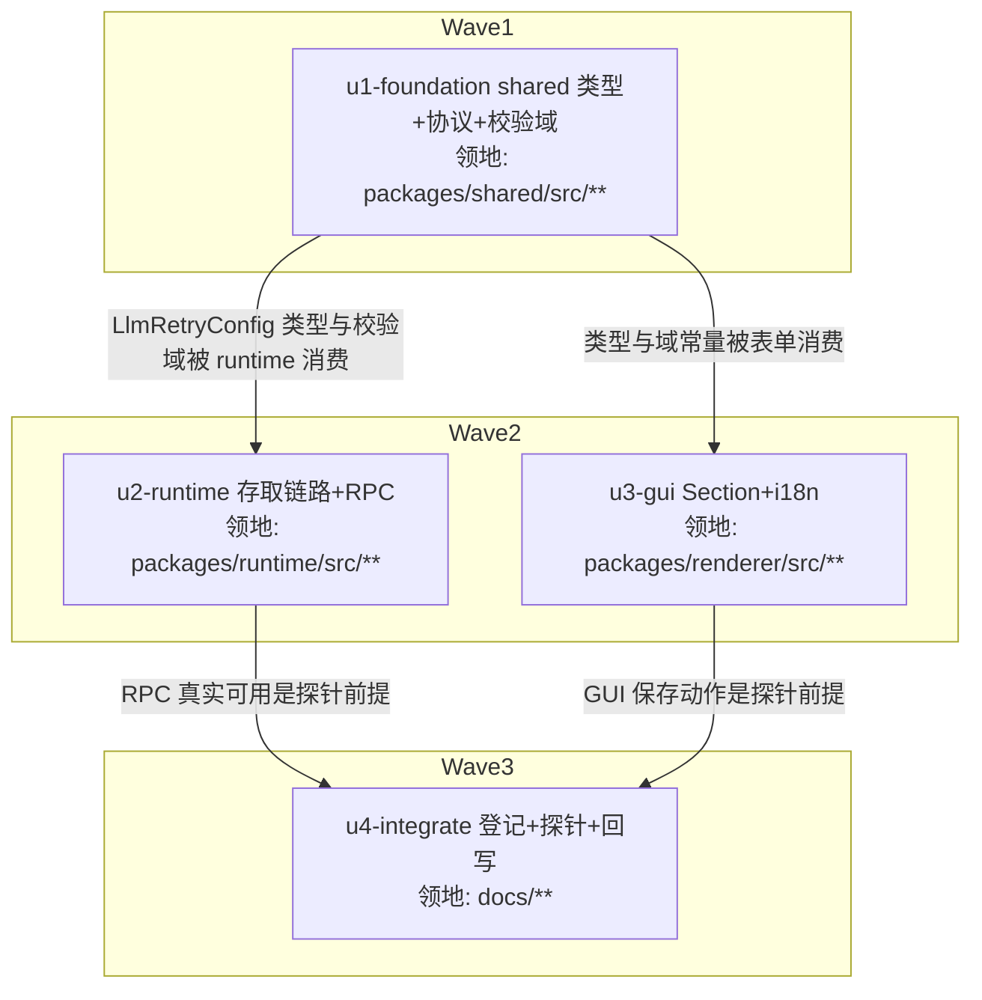

# llm-retry-settings 实施计划

基线: 3f7ddf4fa | 来源设计: docs/design/llm-retry-settings.md | 日期: 2026-08-31

## 0 章节映射

| 内容 | 本文实际位置 |
|------|--------------|
| 背景/目标 | §1 背景目标（SCQA + G1-G4 + In/Out scope） |
| 终态/机制 | §2 现状与问题分析（2.2 两层重试真实语义 + rpc 落盘写点）；§3 解决方案（3.1 终态交互 / 3.2 方案对比 / 3.3 决策 D1-D8 + 错误规格表 / 3.4 接口与数据模型） |
| 验收场景表 | §4 验收（S1-S7，含步骤与通过标准；S4 含执行方式/两编排/判定力声明） |
| 下一层拆分 | §5 下一层拆分（U1-U4 + 文件改动地图） |
| 待验证检查点 | §5 待验证检查点 P1（⛔实施期门 S6 探针）、P2（写后立刻读单测）；P3 已消解 |
| 审查证据 | docs/design/llm-retry-settings.review.md（4 轮收敛，终轮 0 must-fix，commit 7881eba1e） |

## 1 目标快照（逐字摘录自设计文档 §1）

- **G1 可发现、可修改**：不手编 JSON，在设置 GUI 中完成重试策略调整；表单值与 pi 真实生效语义一致（不出现「GUI 显示的值 pi 实际不这么读」）。
- **G2 写对地方、并发安全**：写入 xyz-agent 隔离目录的 settings.json；与 pi 子进程自身的 settings 落盘并发时互不覆盖。
- **G3 危险参数后果可见**：当前可配出「单次对话最长等待 85 分钟」的组合（见 §2 失败模式 B），GUI 必须把指数退避的后果显性化。
- **G4 生效时机可预期**：用户能预期配置改动的生效范围（新会话生效，运行中会话不变）。

**Out of scope**（逐字摘录）：per-provider / per-model 差异化重试；运行中会话热生效；独立 pi CLI（`~/.pi/agent/`）的 GUI 管理；摘要路径（compaction / branch summary）单独配置。

## 2 单元列表

| Unit | 职责 | 领地（精确文件路径） | 依赖 | 隔离 | 验收条款 |
|---|---|---|---|---|---|
| u1-foundation | shared 契约根节点：`LlmRetryConfig` / `LlmRetryProviderConfig` 类型 + D8 合法域常量 + `validateLlmRetryConfig` 纯函数 + 协议消息类型（`config.getRetryConfig` / `config.setRetryConfig` / `config.retryConfig`）。校验域定在 shared：renderer 表单与 runtime 写入侧共用同一套域常量，杜绝两端漂移（SG-1 场景的预防） | `packages/shared/src/llm-retry.ts`（新）· `packages/shared/src/protocol.ts`（增量：消息类型）· `packages/shared/src/index.ts`（导出，如需）· `packages/shared/src/__tests__/llm-retry.test.ts`（新） | 无 | plain | shared 包 `npx vitest run src/__tests__/llm-retry.test.ts` 绿：域内通过 / 越界拒绝（各字段边界）/ `provider.timeoutMs=0` 拒绝 / 缺省字段合入；既有 shared 测试无回归 |
| u2-runtime | runtime 存取链路：`SCOPE_FIELDS` 加 `retry`；infra `pi-retry-settings.ts`（D3 任意层级非 plain object 替换规则 + 六键嵌套 merge）；port `ILlmRetrySettings`；helper（ConfigService 逻辑承载，控 max-lines 500）；ConfigService 单行委托；index 注装；handler +2 case（含校验失败 D10 错误信封 + 成功 broadcast）；pi-settings-store.ts:8 失准注释修正（P3 遗留） | `packages/runtime/src/infra/pi/pi-settings-store.ts` · `packages/runtime/src/infra/pi/pi-retry-settings.ts`（新）· `packages/runtime/src/services/ports/llm-retry-settings.ts`（新）· `packages/runtime/src/services/llm-retry-config-helper.ts`（新）· `packages/runtime/src/services/config-service.ts` · `packages/runtime/src/index.ts` · `packages/runtime/src/transport/settings-message-handler.ts` · 测试：`packages/runtime/src/infra/pi/__tests__/pi-retry-settings.test.ts`（新）· `packages/runtime/src/services/__tests__/llm-retry-config.test.ts`（新）· `packages/runtime/src/transport/__tests__/settings-message-handler-llm-retry.test.ts`（新，命名可随既有 handler 测试惯例调整） | u1 | plain | ① runtime 包增量 vitest 绿：D3 merge（顶层/嵌套坏值替换、六键只 patch 已知键）、写后立刻读（P2）、handler case（get 回 configured/configured 语义、set 越界 sendError 不落盘、set 成功 reply+broadcast）；② config-service 既有测试无回归；③ 本地 `pnpm dev` 下用 WS 调试脚本调 `config.get/setRetryConfig`，实测读写 `~/.xyz-agent/pi/agent/settings.json` 的 retry 字段（Phase 1 出口；S7 前半预演） |
| u3-gui | renderer：`SystemLlmRetrySection.vue`（基础区三键 + 高级折叠区 provider 三键 + 等待预览行实时重算 + configured 徽标 + 存量超域/坏值行内标注 + 显式保存按钮 + toast + 「保存后对新会话生效」提示，交互对齐 demo html）；SystemPage 挂载；api 域转发 +2；i18n 双语键 | `packages/renderer/src/api/domains/config.ts` · `packages/renderer/src/components/settings/system/SystemLlmRetrySection.vue`（新）· `packages/renderer/src/components/settings/system/SystemPage.vue` · `packages/renderer/src/i18n/locales/zh-CN/settings.ts` · `packages/renderer/src/i18n/locales/en-US/settings.ts` · `packages/renderer/src/__tests__/settings/llm-retry-section.test.ts`（新） | u1 | plain | ① renderer 包增量 vitest 绿：Section 渲染断言（三视角，含用户可见 DOM 断言：预览行文本、折叠交互、越界 toast、开关态切预览文案）+ settings 既有测试无回归；② `pnpm dev` 打开设置→系统可见「LLM 调用」分组，手工过一遍 demo 三场景（编辑/越界/未配置） |
| u4-integrate | 收口：data-source-registry 登记 retry 字段域；S4 探针（独立 pi 进程 + GUI 两编排并发，按 §4 执行方式含报文示例/10s 轮询超时）与 S6 探针（新会话生效 / 运行中不生效）真实执行并留证据；P1 结论回写设计文档变更历史 | `docs/architecture/data-source-registry.md` · `docs/design/llm-retry-settings.md`（变更历史 + P1 回写）；探针脚本临时存放（/tmp 或项目内不提交，用完归档移除） | u2, u3 | plain | ① data-source-registry.md 含 retry 域条目（管理方/读写通道/锁协议）；② S4 编排 A/B 输出证据（文件终态 + 断言结果贴入计划状态表）；③ S6 探针结论回写（P1 消解或翻案）；④ `node scripts/check-doc-symbol-drift.mjs` 过 |

## 3 DAG 图

## 4 测试策略

- **增量（单元开发期内）**：从对应子包目录 `npx vitest run <新增/受影响测试文件>`（红线：vitest、配置在子包 vitest.config.ts、从子包目录运行；timer 用 fake timers）。lint 由 pre-commit 承担，禁跳过。
- **全量（阶段 5 Gate A，收尾场景）**：
  - `cd packages/shared && pnpm test`
  - `cd packages/runtime && pnpm test`
  - `cd packages/renderer && pnpm test`
  - 仓库根 `pnpm run lint`
  - extensions 三连不涉及（extensions/ 零改动），不跑。

## 5 合理偏差登记表

| Unit | 偏差 | 理由 | 登记时间 |
|---|---|---|---|
| （空） | | | |

## 6 状态表

| Unit | 状态 | 轮次 | 证据指针 |
|---|---|---|---|
| u1-foundation | committed | 1 | 测试：shared `npx vitest run` 22 文件 225 用例全绿（含新增 9 条）+ `tsc --noEmit` 过（dev 回报与主 agent 重跑一致）；diff 核验：4 文件 ⊆ 领地，protocol.ts 纯增量 |
| u2-runtime | pending | 0 | — |
| u3-gui | pending | 0 | — |
| u4-integrate | pending | 0 | — |

## 7 残留风险与变更历史

- **残留风险**：
  - S1/S3 依赖真实网络错误（本机关闭端口 provider / 错误 apiKey），Gate B 执行时若服务商行为变化（如错误文案不命中可重试 pattern），按 §2.2 pattern 表调整触发方式，属验收手段调整非设计变更。
  - u3 的 Section 交互细节以 demo html 为参照但不逐像素对齐（demo 定位为终态辅助理解），最终以项目 xyz-ui 规范 + 现有 Section 组件风格为准。
- **变更历史**：
  - 2026-08-31 计划创建（来源设计 db569f2ef + 审查记录 7881eba1e）。
