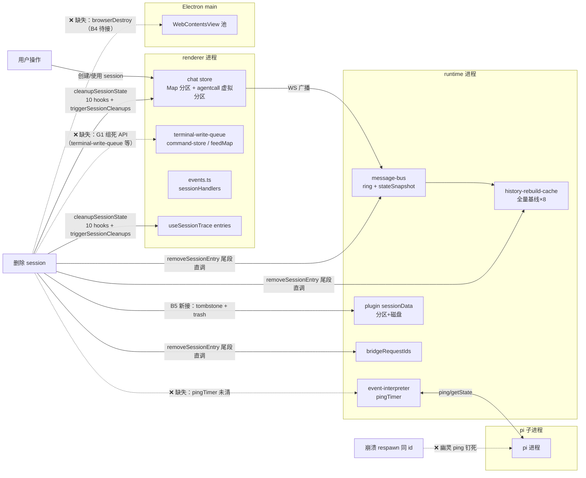

# 内存泄漏与占用治理（runtime + renderer）技术方案

> **一句话结论**：以 2026-09-14 七组并行审计的 23 项发现为输入，按「高危先行、设计取舍居中、长尾归组清扫」三批修复；核心修复面是补齐销毁编排接线与容量控制的字节维度，不动 pi RPC 协议层、不动 wire≡ring 同一截断版不变式、不动回收态广播语义。
>
> **风险分：9/10**（P 级基数 9 = 触及多会话管理/pi RPC/消息总线/插件系统均 **P0**（docs/FEATURE-PRIORITIES.md 2026-09-12 裁决）；新颖度 +1 = ring 字节记账（复用 publish 已算字节数，范式对齐既有 guardOptions 注入）；可逆性修正 0 = 全部改动 git revert 即回滚，无数据迁移/协议变更）。
>
> **当前层 → 下一层**：技术方案设计 → dev-flow 可实施单元（含领地/验收条款的 impl-plan）。
>
> **修订记录**：R2（2026-09-14）——按三审（主审 0MF+3S / 影响面审 7MF+5S / 简洁审 2MF+3S）全量修复：砍 B7「有限 C」与 B10-② 节流两个无证据组件；撤销 reclaim 清 ring、executingBash 断连清、respawn 计数删除三个有害/过度项；B5 改 trash 软删除对齐 session 本体持久性；B9 豁免源更正为 drawer control；G2 按「活性无界治 / 语料有界登记不治」分级；代价四要素与验收量化锚点补齐。

## 1 背景目标

**SCQA**：太极是 AI Agent 桌面工作台，目标用户每天 6 小时以上长跑（docs/PRODUCT.md）。**C** 2026-09-14 对 runtime 与 renderer 两进程 ~200k 行做了 7 组并行内存审计，确认 2 项高危、10 项中危、十余项低危问题。**Q** 长寿命进程（桌面常驻数天）+ 重度多会话工作流会把「慢增长」放大成用户可感知的内存水位不回落。**A** 本设计给出三批修复方案与分批交付路径。

**系统是什么**（给不熟悉内部背景的开发者）：Electron 主进程 spawn 一个 Node.js runtime 子进程（WebSocket 服务），runtime 再管理多个 pi coding agent 子进程（每 session 一个，RPC/stdio JSONL）。renderer（Vue3 + Pinia）经 WS 连 runtime，聊天状态在 `packages/core` 的 chat store 按 sessionId Map 分区，session 删除时由 `useSidebar.deleteSession → cleanupSessionState` 编排清理（renderer 侧，10 个 hooks + `triggerSessionCleanups`）；runtime 侧对应汇聚点是 `SessionService.removeSessionEntry`（session-service.ts:1191）。

**设计目标**：

1. G1：消灭两个高危项——respawn 场景的 pingTimer 泄漏（连带 pi 进程钉死）、message-bus ring 字节无界
2. G2：让「活性无界」结构（随用户工作流强度增长、与磁盘语料量无关）获得确定回收路径——销毁编排接线或容量帽
3. G3：峰值类（一次性大分配）在有低成本手段处收敛，不动协议层
4. G4：给「新增 per-session 状态必须接线销毁编排」补机械检查，防同类问题再发

**In-scope**：活性无界结构的治理 + ADR-0049 checklist 补条目（详见 §3）。
**Out-of-scope**（明确不做，含理由）：

- `packages/pi-rpc/src/frame.ts` LF 单行无上限缓冲——大帧（get_entries 全量响应）是合法协议载荷，加上限会破坏协议
- SessionList 虚拟化——性能优化非泄漏，另立议题
- useTerminal scrollback 5000 chunk——有界且是终端产品语义
- **回收态 bus 分区 ring 数据清理**——R1 曾计划 reclaim 时清 ring；三审否决：重连客户端 gap 检测层不读 ring（纯 seq 比较），清 ring 后断连窗口消息被**静默丢弃且无 gap 信号**；且 B7 字节记账后回收态 ring 驻留已有界（≤16MB/session；stateSnapshot 仅观测不驱逐，回收态 state 快照不受帽——B7 观测 warn 日志作为回收态跟进信号登记）。该项收益不再覆盖风险。回收态保留订阅/stateSnapshot 的 P3 语义维持原样
- **B10 流式渲染节流**——无已发生卡顿证据的性能优化，独立议题化，待实测数据
- 第三方库 mermaid 本体修复——只在调用侧补救

## 2 现状与问题分析

**首句结论**：问题不是零散 bug，而是四类系统性模式；23 项发现是这四类模式的具体实例，修复必须模式与实例并治，且须按「活性无界 / 语料有界」分级——后者登记不治（§2.5）。

### 2.1 模式一：清理函数写了但编排链没接（4 处实例）

renderer 侧 session 销毁编排 `cleanupSessionState`（core/src/domain/session/use-session.ts:403）有 10 个 hooks + `triggerSessionCleanups`（文件头注释「12 项」为陈旧口径）；runtime 侧汇聚点 `removeSessionEntry`（session-service.ts:1191）挂了 checkpoint/mirror/userStoppedGate/respawn.cancel/lastViewedAt/pendingReload/onSessionDestroyedHandlers/backgroundTask-reap 八类清理。但以下清理 API **存在且实现完整、全仓零调用**：

| 死 API | 本应挂的编排点 | 后果 |
|---|---|---|
| `terminal-write-queue.removeSession`（core/src/domain/drawer/terminal-write-queue.ts:70） | cleanupSessionState | 删除 session 后 sessions Map 条目（含 ≤100 条待写命令）永久残留 |
| `command-store.clearCommands`（core/src/domain/new-task-search/command-store.ts:151） | cleanupSessionState | 已删 session 的命令历史数组驻留 |
| `PluginService.clearSessionData`（plugin-service.ts:827 包装 → session-data-store.ts:113 `clearSession`） | removeSessionEntry 尾段 | **重启不自愈**：session-data/*.json 全量预载（plugin-lifecycle.ts:102 restoreFromDisk），已删 session 分量每次启动重新驻留 |
| `browserDestroy`（renderer/src/lib/ipc.ts:207 定义 + apps/electron/main/browser/browser-view-manager.ts:315 实现，destroy 幂等安全） | cleanupSessionState（renderer 侧触发 IPC） | 已删 session 的 WebContentsView（独立 Chromium 渲染进程，重页面百 MB 级）驻留至 LRU 挤出（MAX_VIEWS=3）/app 退出 |

**背景事实**：browser drawer 生产入口自 2026-09-11 起休眠（`browserUrl` 零写入方，openDrawerTab 的 url 分支随死代码删除）——B4 接线是休眠面的预备修复 + 堵「同 id 复活脏旧页面」洞（create 幂等复用旧 entry，browser-view-manager.ts:143-148），非当前用户可感知路径。

同型变体（非死 API 但清理面不全）：`useForkNoticeEffect.feedMap` 未挂 registerSessionCleanup；`extension-host-dialog.requestIdSessions` 唯一删除点在 `plugin:uiRequestExpired` 撤窗广播（extension-host-dialog.ts:155），**有效清理路径只有 respond**——`extension.ui_timeout` 是死链（registerTimeout 已不排定时器，extension-timeout-manager.ts:13-24 头注释登记）。

### 2.2 模式二：条数有界、字节无界（4 处实例）

容量控制只数条数不看字节，大帧（截图 base64、大 toolResult）场景下字节才是主导维度：

- **message-bus ring**（runtime/services/message-bus/message-bus.ts）：每 session `StreamRingBuffer`（`{buf, head, size}`，DEFAULT_RING_CAPACITY=1000，:61）存完整 `ServerMessage` 对象引用。出站守卫只截断 >32MB 帧（:309 truncate 档），**8-32MB 告警档只 console.warn 不截断**（:350-355），随后完整对象入 ring（:375 ringPush）。`session.traceEntryAppended` 不在 TOPIC_TABLE、fallback='stream' 也进 ring。理论上限 = 1000 帧 × 32MB / session。**现行不变式**（outbound-frame-registry 头注释明文登记）：wire 与 ring 存**同一份**截断版——「客户端收到截断版，ring 存截断版，断连回放与重订阅拉到的都是同一份截断版，seq 连续性 / gap 检测 / live≡reload 语义全部不被破坏」。
- **stateSnapshot**（同文件，state topic last-value 快照）：key 数固定（6 个 state topic），单值 warn 档（8-32MB）**不截断直接 set**——字节维度同样无界（理论 6×32MB/session），但覆盖式写入 + state topic 低频特性实际远低于此。本设计裁决：纳入 B7 字节记账**观测**（超预算 warn 日志），不截断不驱逐——观测先行（对齐项目「看门狗不武装先观测」哲学，AGENTS.md 规则 21）。
- **history-rebuild-cache**（runtime/services/session/history-rebuild-cache.ts:60,487）：LRU=8 条不限字节，缓存**全量** Message[]；且 `reclaimManagedSession` 刻意不清（P7 增量复用，onSessionDisposed 注释记载 2026-09-11 真机实测「回收→恢复零重建 PASS incremental」）。巨型会话单条目数十 MB。
- **agentcall 虚拟分区**（core/src/domain/chat/lru.ts:103 + store.ts:599）：`agentcall:<acsId>` 两段式虚拟 key 的消息分区**不受 LRU 管辖**——`isVirtualKeyOf` 只匹配 `subagent:{mainSid}:` 三段式前缀（agentcall 无 mainSid 命名空间，结构上无法前缀定位）；唯一清理路径是 deleteSession 的 `hooks.evictVirtualKeys` + `clearAgentCallMapping`（useSidebar.ts:135-142）。workflow 重度 session（几十个 agent call，每个是全量对话流快照——D4 契约：无 live 写入者，只读）在 session 存续期内无上限。

### 2.3 模式三：进程级 Set/Map 只增不减

- `openPiStreams`（runtime/infra/logger.ts:138）：每个 pi spawn（主 session + 每次 withEphemeralPi + 每个 relay subagent + 每次 crash log）add 一条，唯一清理点是 runtime 退出的 closeLogger。两组审计独立发现（交叉印证最强）。量级 ~0.5-2KB/条。**活性无界**（随工作流强度增长）。
- `sessionHandlers` 空 Set 残留（core/src/transport/api/events.ts:42,56）：`off()` 只 `set.delete(handler)` 不删空 Set 条目，每个订阅过的 session/虚拟 id 留 ~100B 永久残留。
- `ws-client inFlightSubscribes`（core/src/transport/ws-client.ts:175,522）：条目正常路径靠 reply 删除；reply 永不到达（断连→重连→新 id 重订）的条目只能靠 90s TTL sweep，但 sweep 唯一触发点在超界帧死路径。

（externalMetaCache / sessionMetaCache / notRepoCache / usage-stats shards / respawn 熔断计数等同位置结构经核实为**语料有界或已有裁决**，移入 §2.5 登记不治。）

### 2.4 模式四：定时器/监听器清理缺口（高危实例）

- **event-interpreter pingTimer**（runtime/services/session/event-interpreter.ts）：`dispose()`（:651）只清 settlingDelayTimer 不清 pingTimer。泄漏序列（三审全链条核实）：pi turn 中崩溃 → `onSessionExit:454` → `adapter.detach:469` → `interpreter.dispose()`（事件已退订，turn-end 永不再达）→ 5s 后 respawn（RESPAWN_DELAY_MS=5_000）为**同一 sessionId** 生成新 client → `pingPi` 是 `pm.getClient(sessionId)` 延迟解析，ping 打到新 client **必然成功** → `pingFailCount` 恒清零（:1420），3 次失败自停条件永不成立 → interval 永续。**连带效应**：泄漏的 ping 每 60s 经 getState 的 sendCommand 出站 + response 回程**双向** touch `lastActivityAt` → idle-pi-reaper 的 2h 空闲判定永不满足——**pi 子进程整体钉死**。已确认 `pingTick` 内有 `if (this.pingTimer === null) return` 守卫（:1418，SR1 防误 abort）——dispose 补清后 in-flight tick 会被该守卫拦截，修复面极小。
- **Sidebar onGlobalType**（renderer/components/sidebar/Sidebar.vue:281）：`onMounted` 内 `events.onGlobalType('app.info', ...)` 返回的退订函数被丢弃。App.vue 以 `v-if="connectionState !== 'connected'"` 卸载 AppShell——runtime 崩溃自动重启下断连重连是**设计内常态**，每次重挂泄漏一份 handler + 组件响应式子图（piVersion ref → computed → 渲染 effect）。
- **bridgeRequestIds**（runtime/services/extension-timeout-manager.ts:56 + transport/bridge-handler.ts:59）：每个 bridge 请求（tool_execute/intercept/sync/malformed）`addBridgeRequest` 登记 Set + per-session Set；`removeBridgeRequest` 全仓唯一调用点是前端误发 ui_response 的防御分支（extension-message-handler.ts:92）——runtime 内部应答的请求**正常路径零删除**，仅 session 销毁兜底清。
- **mermaid 失败路径**（ui/src/features/chat/MermaidRenderer.vue:207 + renderer/src/composables/logic/mermaid.ts:118）：mermaid 11.16 `render()` 解析失败时 throw 先于 `removeTempElements()`，临时 `#d{id}` div 残留 document.body；调用侧每次生成新唯一 id，旧残留无法被后续清理回收。流式期间不完整语法逐帧 parse 失败 → 逐帧泄漏。

### 2.5 登记不治（语料有界/已有裁决/两害相权，防过度治理）

以下结构经三审源码核实，**显式裁决本批不治理**（分类学对齐「确认有界 → 显式不治」；若未来有实测压力数据，按各条重审条件翻案）：

| 结构 | 量级（实测/推算锚） | 不治理理由 | 重审条件 |
|---|---|---|---|
| `sessionMetaCache`（session-binding-sidecar-io.ts:48） | KNOWN-LIMIT 实测「数千条 ≈ 1MB」 | 代码内显式裁决「暂不引入淘汰逻辑」，本次审计无翻案实测数据；filePath 键控语料有界 | KNOWN-LIMIT 注释自带触发条件成立时 |
| `externalMetaCache`（session-file-external-scan.ts:96） | 上限 = 磁盘 session 文件总数（实测数据集 4.6k 文件 ≈ 1.5MB） | filePath+(mtime,size) 键控，语料有界不随工作流放大 | 磁盘语料量级增长 10× 时 |
| `notRepoCache`（git-state-service.ts:84） | distinct cwd 数 × 8B 时间戳 = bytes 级 | cwd 键控，worktree 模式下几十个 | 无（量级不可能成害） |
| usage-stats shards（usage-stats-service.ts:71） | 全量 session 文件 usage rows | 已有 per-scan 清理已删文件分片（:151-153）+ filePath 键控语料有界 | 用量页聚合耗时/内存实测劣化时 |
| pi-respawn 熔断计数 + userStopped 标记 | per-sid 一个 number / 小对象 | **熔断语义优先**：removeSessionEntry 被 forceQuit/restore 复用，注释明文「清计数会破坏熔断」（session-service.ts:1236）、「标记必须存活到 restore」（:1221）；userStopped 真 delete 已由 `lifecycle.delete → gate.disposeForDelete` 覆盖（session-lifecycle.ts:865） | 熔断机制重设计时一并处理 |
| B5 新增 `clearedSessions` tombstone Set | per-delete ~百字节、重启清零 | 有意无界（防迟到写无时间上界）；按自身活性/语料分级纪律登记不治（主审 R3-S1 + 影响 S3 交叉） | tombstone 机制移除时 |
| `executingBash` 断连残留（bash-effects.ts:63） | per-sid 一个 bash 条目 | 两害相权：纳入 clearIndependentTransient 后跨断连仍在跑的 bash 指示**永久消失**（stateSnapshot 无 bash 主题、bashStart 已消费不回放），现状残留 spinner 到 turn 结束更轻 | bash 执行状态进 state topic 时 |
| `session-file-utils` 32MB 全量读 / LF 单行缓冲 | 峰值 ~100MB RSS 尖峰后释放 | 协议合法载荷 + 既有硬上界，out-of-scope | — |

**治理动作**：上表前四项各在源码注释补一行「2026-09-14 内存审计复核：量级维持可控，维持不治裁决」；executingBash 项在 bash-effects.ts 补同款裁决注释（防翻案锚——该结构本次审计即翻案过一次，R2 复审简洁审 S2）（文档性修复，成本≈0，防后续审计重复翻案）。

### 2.6 session 生命周期与内存结构驻留/释放路径（物理图）

实线 = 既有释放路径或本设计新接线；虚线 = 待接通的缺口（PSD/TWQ 现状是死 API 缺口，B5/G1 接通后变实——R2 复审 S3 修正图例与 §2.1 死 API 表的矛盾）。reclaim（空闲回收）路径维持现状不清 ring/HRC 之外的任何结构；HRC 由 B8 增补 reclaim 驱逐（字节帽联动）。

## 3 解决方案

**首句结论**：第一批 6 项机械修复（每项方案基本唯一，附被否项）；第二批 5 项做真正的方案取舍（B7 定稿纯字节记账）；第三批按模式归组并经「活性/语料」分级过滤。

### 3.1 终态（使用者视角）

修复后用户可感知的行为变化：

- 长跑数天的太极，runtime/renderer 内存水位在 session 删除后**可见回落**（原来：删除 session 后大半驻留）
- pi 崩溃自动恢复后，空闲 2h 的 session 会被正常回收（原来：崩溃过的 session 的 pi 进程永不回收）
- 删除 session 时其插件数据与 session 本体一同进系统废纸篓——从废纸篓还原两者，数据完整恢复（原来：插件数据永久驻留内存+磁盘）
- 流式输出含语法未完成的 mermaid 图，长时间会话后 UI 依旧流畅（原来：body 孤儿 div 持续累积）
- workflow 重度 session（几十个 agent call）切换使用多个 session 后，未被查看的旧 agent call 消息分区被释放；正在查看的不受影响

失败路径与恢复指引（按面精确化）：

- ring 字节预算驱逐导致的回放窗口变短：驱逐段无信号静默缺失（重连回放不含被驱逐帧）；恢复 = 用户切回该 session 时切入链步 9 触发 getHistory hydrate 补齐（交互级，一次性；非自动 refetch——实装中 reply.gap 标志客户端零消费，无自动兜底机制）
- LRU 驱逐 agentcall 分区后（豁免窗口外）：drawer 静态白屏，恢复 = 用户重选 tab 触发快照重拉（一次性交互，登记取舍）
- 删除 session 后插件数据进废纸篓：import 同 id 复活**不带**插件数据（import 只带 session 文件）——登记
- B8 字节帽超限 session 重进：走全量重建（既有路径，量级见 B8 代价四要素）

### 3.2 第一批：高杠杆机械修复（6 项）

| # | 修复 | 落点 | 方案（附被否项） |
|---|---|---|---|
| B1 | **pingTimer 泄漏** | event-interpreter.ts `dispose()` | dispose() 补 `this.stopPingLoop()`（stopPingLoop 已存在且幂等，:1388）。被否：pingTick 加 disposed 短路——已有 `pingTimer===null` 守卫覆盖，冗余；被否：pingPi 闭包捕获 client 实例做身份比对——改动面大且 dispose 补清后无场景需要 |
| B2 | **sessionHandlers 空 Set** | events.ts `off()` | delete 后 `if (set.size === 0) sessionHandlers.delete(sessionId)`。全仓无 keys 遍历消费方（三审核实），dispatchSession 对无条目 get 安全跳过，on 会重建，语义不变。被否：定期清扫——off 是唯一删除点，原地补一行即根治 |
| B3 | **Sidebar 退订** | Sidebar.vue onMounted | 保存退订函数，`onBeforeUnmount` 调用。被否：把 app.info 改为 Pinia store 全局单例——过度设计，一行退订足够 |
| B4 | **browserDestroy 接线** | use-session.ts cleanupSessionState hooks + lib/ipc.ts 调用方 | hooks 序列追加：删除 session 时 `browserDestroy(id)`，**hook 内显式 `.catch(console.warn)`**（preload invoke 透传 rejection，不 catch 会成 unhandledrejection 上报 error-reporter）。声明：目标面（browser drawer）生产入口休眠中（§2.1），本项 = 接线预备 + 堵「同 id 复活脏旧页面」洞；同 commit 修正 browser-view-manager.ts:33 陈旧头注释（称「无 LRU」实装 MAX_VIEWS=3）。被否：main 侧监听 session 删除广播——main 不应订阅 renderer 可见的公开信道 |
| B5 | **clearSessionData 接入删除链** | removeSessionEntry 尾段直调 + session-data-store tombstone | ①接线（**阶段 3 一致性审查修正（ca058f602）**）：清理挂 `lifecycle.delete()` 末尾（active/scanned 双分支共用）——原方案「`removeSessionEntry` 尾段直调」被审查推翻：该汇聚点四路复用（用户删除 / **pi 崩溃退出 onSessionExit** / forceQuit / restore 清场），无条件挂尾部会把**存活** session 的插件数据 tombstone+trash（pi 崩溃 respawn 后插件空状态、旧数据只在废纸篓——违背 §3.1「trash 绑定用户删除」与崩溃恢复目标）。收窄后 pi 崩溃/forceQuit/restore 清场三存活路径不清不碑（respawn 续写原数据）；scanned 分支用户删除随之补齐插件数据清理（§3.1 对齐）。调用形态：经模块级 `clearRemovedSessionData` 分发（SessionService↔PluginService 构造注入成环规避，非 facade 直调——facade `IPluginService.clearSessionData` 契约连同死方法已删），best-effort try/catch，didDestroy 先行、清理在后的顺序保留。②**tombstone 防异步复活（R3，主审+影响面审交叉印证）**：didDestroy 投递是 `rpcServer.notify` fire-and-forget（无完成屏障，session-api.ts:113-117），插件 worker 迟到的 `sessionData.set` RPC 无 session 存活校验（session-data-api.ts:46-48）——「先投递后清理」只防同步写；SessionDataStore 加 `clearedSessions: Set<string>`，`clearSession` 登记 tombstone（先于 trash），写 API 对已删 sid 丢弃 + warn 日志——**guard 覆盖 set 与 delete 两入口**（R4 源码自核裁决：迟到 delete 的 `getPartition(k)` 先于 oldValue undefined 短路执行，会 lazy 重建**空内存分区**——文件不复活但分区驻留；set 是文件复活主通道；get/keys 只读不守）。**摘碑双路径（R4，主审 R3-MF1 + 简洁审 INFO-1）**：① `notifySessionCreated` 收敛点（create/restoreSession/forkSession 三入口，主线程同步动作——不依赖经 worker 的异步链，失灵比复活更糟），覆盖废纸篓还原→打开；② import 落地处显式摘碑（import-service.ts doImport 尾部）——doImport 纯文件级不投 didCreate，覆盖「import 同 id 复活后未打开窗口」。③持久性对齐：`rmSync(force:true)` 改走项目 `infra/system/trash.ts`（mac 废纸篓），clearSession 变 async，调用点 `void …catch(warn)`；**trash 失败降级登记**：trash() 失败 = 文件保留原地 + 抛结构化错误，dropPartition 已先行——该 session 的 session-data 重启仍被 restoreFromDisk 预载（B5 对它不生效），接受为 best-effort 降级。被否：挂 onSessionDestroyedHandlers 回调——顺序无法约束；被否：保留 rmSync 永久删——与废纸篓还原/import 复活工作流错位（R1 方案，三审 MF3 否决） |
| B6 | **bridgeRequestIds 应答即删** | bridge-handler.ts 各应答分支 | bridge:tool_execute / bridge:intercept 的 await 完成点（成功+异常双路）调 `removeBridgeRequest(requestId)`；bridge:sync / bridge:malformed 同型补；`extensionSessionRequests` 的 per-session Set 在应答时同步删（trackSessionRequest 对偶）。被否：TTL 定期清扫——应答点明确且就在本文件 |

验收统一探针（⛔实施期门）：每项在 dev 实例暴露临时诊断日志行，验收时读取结构 size 断言归零/有界（详见 §4）。

### 3.3 第二批：需设计取舍（5 项）

**B7 ring 字节预算（高危#2）**

终态：ring 保持「最近窗口」语义，获得字节维度上限；**单帧行为完全不变**（wire≡ring 同一份的现行不变式原样保持——32MB 档既有截断照旧双写 wire 与 ring，8-32MB warn 档照旧双完整）。

| 候选 | 长期合理性 | 短期成本 | 风险 |
|---|---|---|---|
| A. ring 字节记账 + 超预算加速淘汰最旧 | 高——语义保持「最近 N 帧或 M 字节内」 | 低（publish 已算 `Buffer.byteLength(payload)`，记账复用；StreamRingBuffer 加 bytes 字段，push/淘汰同步增减；预算构造参数注入对齐 guardOptions 范式） | 5/10：大帧驱逐加速后回放窗口变短——驱逐段静默缺失、切回 hydrate 补齐（见代价四要素；R4 修正 R3 残尾） |
| B. 大帧不入 ring（阈值外只走 wire） | 中 | 低 | 4/10：**修正 R1 否决理由**——gap 检测层不读 ring（客户端纯 seq 比较 subscription-state.ts:214，服务端 gap 回执客户端从未消费），检测不坏；真实代价 = 重连客户端修复腿（回放）缺失该帧且无信号补拉，静默空洞 |
| C. warn 档帧截断版入 ring / wire 完整 + ring 截断 | 低 | 中 | 7/10：截断改变 wire 内容或打破 wire≡ring 同版不变式 |

**推荐 A（纯 A，R2 收缩）**：每 session 预算 16MB（构造参数可注入便于测试）；push 时累计字节、淘汰时扣减、超预算从最旧加速淘汰至回到预算内；stateSnapshot 纳入同款记账但**仅观测**（覆盖式当前值口径——state topic set 替换时重算差值，非累计求和，否则虚假触发 warn；超 16MB warn 日志，不驱逐——§2.2 裁决；该 warn 同时作为回收态 state 快照跟进信号）。**驱逐循环下界（R4，影响 S4）**：淘汰至「仅剩最新帧」即停、允许瞬时超调（单帧 truncated ≤32MB > 16MB 预算时不可误逐刚 push 帧或死循环）。

**被否谱系**：「有限 C（单帧 >2MB 截断入 ring、wire 完整）——击穿反例：live 客户端显示全文、重连回放收占位版，同 seq 双形态违反规则 9「live≡reload」守护方向；且无『单帧独占预算压垮窗口』的已发生证据（§2 证据全部指向总量无界），对比表否决 C 的『8MB 太激进』理由与采纳 2MB 自相矛盾」（R1 方案，简洁审 MF1 + 影响面审 MF1 联合否决）。候选 B 否决理由修正记录：非检测层依赖，是修复腿完整性 + 无信号静默空洞。

**代价四要素（已接受代价，P0-20，R3 重写恢复路径）**：量级 = 16MB 预算下单帧 15MB 场景回放窗口坍缩至 ~1-2 帧；恢复路径 = 用户切回该 session 时切入链步 9 getHistory hydrate 补齐（交互级一次性；服务端 gap=true 时返全量剩余 ring，但客户端不消费该标志——驱逐段实际为静默缺失，无自动兜底）；重审条件 = frame journal 的 warn-tier 事件周均 >10 次（crash-forensics 附录 A 既有阈值）或 A2 探针显示大帧驱逐引发的切回补齐频率周均 >5 次；显式判定 = 接受（回放尽力而为语义，live 流量不受影响，切回必恢复）。**记账口径（R3）**：截断档（>32MB）帧入 ring 的是 truncated 版另行序列化——记账须用实际入 ring 那份的字节数，不可复用外层截断前 bytes（否则高估占用致过早驱逐）。

**B8 history-rebuild-cache 字节帽 + reclaim 驱逐（中危#5）**

| 候选 | 长期合理性 | 短期成本 | 风险 |
|---|---|---|---|
| A. 单条目字节上限（超限不缓存，退化全量重建） | 高 | 低（set 前量 bytes，超限跳过缓存只返回） | 4/10：超限 session 每次重进全量重建 |
| B. 缓存也切预算窗 | 低——**破坏增量合并正确性**（代码注释明示「缓存存全量基线（增量合并正确性依赖）」） | 中 | 8/10：增量基线错位 = 会话内容错乱 |
| C. 仅 reclaim 时驱逐 | 中——峰值仍在 | 低 | 4/10：单独用治理不完整 |

**推荐 A + C**：条目字节上限 32MB（语义对齐 READ_PRECHECK_MAX_BYTES：超过此量级的 session 本就走离线分块路径；**超限时同时摘除既有条目**——实施期加固：历史 append-only，保留旧条目会使增量 delta 从旧叶子无界增长形成「冻结基线」，劣于全量重建）；`reclaimManagedSession` 时驱逐该 session 缓存条目。**被否谱系**：全量基线切窗 —— 增量合并错位（会话内容错乱）。

**与 P7 实测的张力（显式登记）**：P7 真机实测（2026-09-11）回收→恢复走缓存命中零重建；驱逐后该路径变为单次全量重建。代价四要素：量级 = 单次全量重建（实测量级待 A9 探针记录，典型大 session 数百 ms~秒级）；恢复路径 = 无需恢复（重建即路径）；重审条件 = 若回收→重激活频率实测升高（快速切换重度 session 场景），重审「回收态保留缓存」策略；显式判定 = 接受（回收态驻留 8×全量历史的内存收益 > 低频重建的 CPU 成本）。

**B9 agentcall 分区 LRU 联动（中危#6）**

终态：主 session 被 LRU 驱逐时，其全部未被查看的 agentcall 分区联动释放；正在查看的豁免。

| 候选 | 长期合理性 | 短期成本 | 风险 |
|---|---|---|---|
| A. LRU 驱逐主 session 时经 workflow 映射联动 evict | 高——复用 deleteSession 已有机制（`getAgentCallVirtualIdsByMain` 查询已存在 workflow.ts:256，钩子链已接 use-session.ts:432），新增面仅 LruEvictDeps 一个回调字段 | 中 | 5/10：豁免失效 = drawer 静态白屏不自愈 |
| B. agentcall 独立 LRU 配额 | 中 | 中 | 6/10：两套 LRU 语义交错难推理 |
| C. 字节帽逐条计量 | 低 | 高 | 7/10 |
| D. key 改三段式 `agentcall:<mainSid>:<acsId>`，isVirtualKeyOf 前缀扫描一行扩展全覆盖 | 中——机制最简 | 高——迁移面横跨 types/mutations/workflow store/SubagentTab/drawer/测试（两段式是 lru.ts/workflow.ts 多处注释登记的既有设计 M7/D6） | 7/10：改名回归风险 > 一个回调注入 |

**推荐 A**（R2 补 D 行入谱系）：`evictIfNeeded`（阈值驱逐）与 `evictSessionWithVirtual`（显式驱逐）**两路径都接线**（A6 走阈值路径）——注入纯查询回调 `agentCallEvictionsOf(mainSid)`（LruEvictDeps 单回调定稿，实装 lru.ts:131-142——豁免集在回调实现侧应用，驱逐执行面留 LRU 模块），由 chat store 装配时接 workflow store 映射。**豁免源更正（R2）**：查看态在 drawer control（control.ts:66-80 `selectedSubagentId` 等组合推导，挂 focusedSession 分区），不在 workflow store（其 `mainSessionAgentCalls` 只含「打开过」集合，当豁免源会过度豁免全部历史）；豁免查询源 = core `control.getViewedVids()`（实装经 `bindViewedVidPanels` 惰性绑定，**查询源钉死为 panel 枚举**、豁免门控三分量 `isOpen && activeTab==='subagent' && selectedSubagentId`）（逐 panel：focusedSession→drawer 分区→selectedSubagentId 组合当前选中 vid，**禁止 drawer 分区全枚举**——LRU 驱逐不清 drawer 控制分区（isOpen/selectedSubagentId 焦点切走后保留），全枚举会把曾开过 drawer 的全部 session 的 agentcall 分区永久豁免，B9 对重度用户静默失效，R2 复审 S1）；split 模式多 panel 全查（切入链第 11 步只刷新 focusedSession 一个 panel 的 recency，非焦点 panel 的 drawer 有真实被驱逐面，三审核实）。**白屏形态登记**：豁免窗口外被驱逐 = drawer `getMessages(vid)` 返回 `[]` 静态白屏，恢复 = 用户重选 tab 触发 selectedSubagentId watch 重拉快照（一次性交互）；agentcall 分区无 live 写入者（D4 只读契约），不会自愈。

**B10 mermaid 失败路径 DOM 泄漏（中危#4）**

终态：任何渲染失败后 document.body 无 `#d{id}` 残留。

推荐（R2 收缩为单一方案）：`renderMermaid`（mermaid.ts:118）改 try/finally——finally 中 `document.getElementById(\`d${id}\`)?.remove()`（成功路径 mermaid 自清，remove 不存在的元素是 no-op；失败路径补捞）。**被否**：流式 250ms trailing 节流——无已发生卡顿证据的顺手优化，独立议题待实测数据（R1 组件，简洁审 S1 砍）；被否：升级/patch mermaid——项目红线不修第三方库；被否：开 `suppressErrorRendering`——不保证清临时 div，不能作为根治依赖。

**B11 useSessionTrace 台账治理（中危#9）**

终态：seen 去重集增量维护（消灭 O(n²)）；entries 达软上限后停采集。

推荐：① `TraceSessionPartition` 增加 `seenIds: Set<string>`，`mergeAppendedEntries`（useSessionTrace.ts:179）改增量 add；② entries 软上限 5000 条，超限停止追加并标记截断；**软上限同时覆盖快照替换路径**（加载路径也是无界写点——超限保尾部 5000 条 + truncated 置位 + seenIds 重建，与增量停采同构；重拉小快照时 truncated 随权威快照复位）。**UI 形态定稿（R2）**：不新增 status 值（现状 4 值 idle/loading/ready/error，加第 5 值的改动面波及 TraceView 2 处 + useTraceJump 终态判定 + store 状态机）——截断标记复用现有降级 UI，参照 `source:'oversize'` 正交字段先例（分区上加独立 `truncated: boolean`，消费面 = TraceView 现有降级渲染分支）。被否：环形缓冲滚动丢弃——entry.id 去重依赖全量 seen 集，滚动失效致重复追加；被否：切走视图即清空——设计如此（切回继续收集），改语义超范围。

### 3.4 第三批：长尾按模式归组（经活性/语料分级过滤）

**G1 死清理 API 接线组**：terminal-write-queue.removeSession、command-store.clearCommands、useForkNoticeEffect.feedMap 接 `cleanupSessionState` hooks（同 B4 模式：加 hook + best-effort；**.catch 仅适用于 IPC/异步 hook——本组三 hook 为同步内存操作无 rejection 面，豁免 .catch**，core 侧可选成员 + `?.` 编排零破坏）；`requestIdSessions` **聚焦 respond 路径**补 delete（ui_timeout 是死链，不排定时器语义——§2.1 已标注）。

**G2 活性无界结构治理组**（语料有界项已移 §2.5）：openPiStreams 在流确认 close 后从 Set 摘除（closeLogger 兜底等待契约不变——已 close 流无在途数据）；ws-client `sweepExpiredInFlightSubscribes` 增挂重连路径（resubscribeAll 前触发一次）；§2.5 四项源码注释补审计复核行（文档性）。

**G3 峰值治理组**：subagent-extractor / workflow-extractor 加 READ_PRECHECK 预检（>32MB）→ **降级返回空列表 + 「会话过大」标记**（侧栏面板降级提示**接线遗留独立排期**——runtime 侧 oversize 正交字段已就位（extractor 返回形状），协议面 shared/core/renderer 未携带）——不做尾读部分提取（extractor 是全文扫描语义，部分提取的记录缺失面难界定，三审 INFO-3）；shell-runner 补 maxBuffer 帽对齐 git-executor（10MB，超限截断保留头尾）。

**G4 杂项组**（R2 收缩）：prematureTimeoutIds / deferFlushFailureCounts 纳入 disposeSession 清理面；quota fetch 非 2xx 时 `void resp.body?.cancel()`；skill-registry projectWatchers 加 LRU（最近 8 个 cwd，OS fd 资源 + worktree 工作方式使 distinct cwd 持续增长）；ImportSessionDialog close() 清扫描结果。（reclaim 清 ring、executingBash 断连清、respawn 计数删除三项已撤销，见 §1/§2.5。）

### 3.5 系统性防护（模式级根治）

ADR-0049 checklist（docs/adr/0049-session-isolation-map-partition.md 的 Code Review Checklist 节）追加一条机械检查（按 `SessionCleanupHooks` 接口实际形态表述，不写死 hook 数量）：「新增/修改持有 per-session 状态（含模块级 Map 分区、IPC 资源、子进程句柄、main 侧进程级资源）时，确认销毁编排（renderer 侧 cleanupSessionState hooks / runtime 侧 removeSessionEntry 汇聚点）已接线该状态的清理——纯加状态不接线的 PR 打回」。同 commit 更新 ADR 变更历史（C-proc-10）。

## 4 验收

**首句结论**：每批交付在 dev 实例（`XYZ_DEV_BACKGROUND=1 pnpm dev`）真实操作验证；探针分层口径（impl-plan §4 提速结论同步）：L1 单测面（_forTest/只读导出）随修复代码同 commit；L3 诊断日志探针并入 A9 批次同跑（⛔验收后统一降级 debug 级）。

| # | 验证场景（回溯目标） | 步骤 | 通过标准 |
|---|---|---|---|
| A1 | pi 崩溃恢复后无 pingTimer 残留（G1/B1） | dev 实例开 session 发长任务；`kill -9` pi 进程；等 5s respawn；再等 130s | 诊断日志无幽灵 ping 记录；interpreter 实例数 = 活跃 session 数；respawn 后该 session 空闲可被 reaper 回收（env 缩短 reaper 周期验证） |
| A2 | ring 字节有界（G1/B7） | 构造 8-16MB payload 帧多条（预算内驱逐路径）+ 单条 >16MB 帧（瞬时超调路径）；断连重连 | ring 探针：多帧场景 ringBytes ≤ 16MB；单帧 >16MB 场景允许瞬时超调但「仅剩最新帧即停」（不逐新帧、不死循环）且记账与实际入 ring 字节一致（truncated 版口径，R3）；wire 收到完整帧（单帧行为不变验证）；重连回放可用，驱逐段静默缺失由切回 hydrate 补齐（探针记录切回后消息完整） |
| A3 | session 删除后全链路释放（G2/B4/B5/G1） | 开 session：写插件 sessionData、跑终端命令、用命令面板、fork 出通知不读；**dev 下经 electronAPI.browserCreate 直造 view**（生产入口休眠，§2.1）；删除 session | session-data/<sid>.json **进系统废纸篓**（非消失）；terminal-write-queue/command-store/feedMap 分区 size 归零；main 侧 views.size 下降；`sessionHandlers` 无该 sid 条目（含空 Set）；**tombstone 验证**：删除后模拟插件迟到 set()/delete()（RPC 直调）被丢弃且不复活文件与内存分区；经 **import 同 id 或废纸篓还原→打开**复活 session 后 set() 恢复正常（摘碑双路径；create 生成新 sid 不适用此验收——R4 钉死路径） |（阶段 3 补充验收反例：pi 崩溃 respawn / forceQuit / restore 后插件数据**存留**——修复 ca058f602 的反例用例已落单测）
| A4 | 断连重连不泄漏 handler（G2/B3） | dev 实例连着；kill runtime 触发 supervisor 拉起 5 次 | 探针：`globalTypeHandlers.get('app.info').size === 1`；piVersion 显示正常更新 |
| A5 | bridge 请求不累积（G2/B6） | 装一个含工具的插件，触发 20 次工具调用（含失败路径） | bridgeRequestIds.size 每批调用完成后归零 |
| A6 | agentcall 分区联动驱逐 + 豁免（G2/B9） | 跑多 agent call 的 workflow；开 drawer 选中其中一个 tab；切 ≥8 个其他 session 挤出 LRU | 被驱逐主 session 的未查看 agentcall 分区释放；**正被查看的分区存活、drawer 不白屏**；关闭 drawer 后再切走，分区释放 |
| A7 | mermaid 失败不泄漏 DOM（G2/B10） | 发含语法错误 mermaid 图的消息；再发流式逐步输出 mermaid 的消息（中途 parse 失败） | 探针：`document.querySelectorAll('[id^="dmd-"]')` 渲染完成后恒为空；失败图显示既有「渲染失败」占位 |
| A8 | trace 台账有界（G2/B11） | 长会话（或灌 5000+ entries）打开 trace 视图 | entries ≤ 5000 且 `truncated` 标记走现有降级 UI；增量合并耗时探针恒 <1ms（O(n²) 消除） |
| A9 | 长跑回归 + 量化锚点（全部） | 全部修复后跑 30min 混合工作流（多 session 创建/删除/workflow/插件/终端） | **量化锚点**：删除 5 个大 session 后**静置 ≥60s**（或 dev 下显式触发 gc）再采样——runtime 侧 `process.memoryUsage().rss`、renderer 侧 devtools Memory 面板 heapStatistics 的 usedJSHeapSize——删除前后各 3 次取中位数，净回落 > 0（R2 复审 S1：防惰性 GC 假阴/假阳）；活动监视器无孤儿 pi/Chromium 进程；watermark 采样曲线在删除后可见回落（项目既有 watermark timer 数据源） |
| A10 | 存量测试全绿（全部） | `pnpm extensions:typecheck && pnpm extensions:lint && pnpm extensions:test`；runtime/renderer/core 子包 vitest | 全部通过（含 B1/B2/B6/B7/B9/B11 新增单测） |

单测分层（L1，随各单元）：B1（dispose 清 timer + respawn 序列）、B2（off 删空 key）、B5（trash 调用 + didDestroy 后顺序）、B6（应答后 Set 归零）、B7（字节记账驱逐 + 记账不截断 + 超调下界终止 + stateSnapshot 覆盖式计量）、B9（联动驱逐 + 豁免 + 两路径）、B11（增量 seen + 上限停采）各配最小单测；其余机械项以 A3 集成探针覆盖。

## 5 下一层拆分

**首句结论**：10 个 dev-flow 单元，DAG 两层——第一层 6 个可并行（领地零交集），第二层 4 个第三批单元在第一批 commit 后展开。

| Unit | 职责 | 领地（文件级） | 依赖 | 验收锚点 |
|---|---|---|---|---|
| u1 | runtime 高危批：B1 pingTimer + B5 clearSessionData（tombstone + 摘碑双路径 + trash + 尾段直调）+ B6 bridgeRequestIds | event-interpreter.ts、session-data-store.ts、session-data-api.ts（写守卫）、plugin-service.ts（setOnSessionCreated 摘碑挂点 :441）、import-service.ts（import 摘碑）、session-service.ts（尾段）、bridge-handler.ts、extension-timeout-manager.ts | - | A1/A5 + 单测（tombstone 代码注释须含「迟到 set 是唯一文件复活入口」源码依据，简洁审 INFO-2） |
| u2 | renderer/core 高杠杆批：B2 events.ts + B3 Sidebar + B4 browserDestroy 接线（含头注释修正） | events.ts、Sidebar.vue、use-session.ts（hooks 序列）、browser-view-manager.ts（仅注释） | - | A3/A4 |
| u3 | B7 ring 字节记账（纯 A + stateSnapshot 观测） | message-bus.ts、types.ts | - | A2 + 单测 |
| u4 | B8 history-rebuild-cache 字节帽 + reclaim 驱逐 | history-rebuild-cache.ts、session-lifecycle.ts（reclaim 挂点） | - | 单测 + A9 |
| u5 | B9 agentcall LRU 联动（两路径 + drawer control 豁免） | lru.ts、store.ts、workflow store 映射暴露、control.ts（豁免查询）、装配点 | - | A6 + 单测 |
| u6 | B10 mermaid finally + B11 trace 台账 | mermaid.ts、useSessionTrace.ts、TraceView（降级分支） | - | A7/A8 |
| u7 | G1 死 API 接线组 | terminal-write-queue.ts、command-store.ts、useForkNoticeEffect.ts、extension-host-dialog.ts、use-session.ts hooks | u2（同文件） | A3 |
| u8 | G2 活性无界治理 + §2.5 注释行 | logger.ts、ws-client.ts、session-file-external-scan.ts（注释）、session-binding-sidecar-io.ts（注释）、git-state-service.ts（注释）、usage-stats-service.ts（注释）、bash-effects.ts（注释） | - | A9 |
| u9 | G3 峰值组 | subagent-extractor.ts、workflow-extractor.ts、shell-runner.ts | - | A9 |
| u10 | G4 杂项组 + ADR-0049 条目 | streaming-state-machine.ts、useChat.ts、quota types.ts、skill-registry.ts、useImportSession.ts、ADR-0049 文档 | - | A9 |

justification：u1-u6 领地零交集且是三批核心，最大化并行；u7 依赖 u2（use-session.ts 同文件）；u8-u10 无依赖（R4 修正 R3 悬空引用——session-service.ts 现仅 u1 独占）。worktree 判定：全部 plain（每单元 ≤8 文件——u1=8、u8=7 为最大者，无长跑构建需求；文件数以领地表为准）。

**待验证检查点**（实施期核实，不阻塞设计）：

1. workflow store 映射暴露与 drawer control 豁免查询的精确接口形态——**已核实（2026-09-14 u5 实施定稿）：合并为单回调 `agentCallEvictionsOf` 纯查询**（renderer 装配于 features 层 `agentcall-lru-linkage.ts`，组合 workflow 映射 ∖ `getViewedVids()` 豁免集；stores import 禁令迫使外置装配）
2. trash.ts 在 runtime 子进程的废纸篓调用行为（session-data 目录路径下的删除确认进废纸篓；非 mac 平台 unlink 退化——与 session 本体同语义）
3. ring 预算 16MB 常数的实测量化（A2 验收时校准，先按设计值实施）——**已闭环（2026-09-15）：A9 按设计值通过（impl-plan §8，07be47679），维持 16MB/32MB，校准遗留 = 无**
4. skill-registry watcher LRU 驱逐时 chokidar close 的异步完成处理（u10 实施时定）

**文件改动地图**：上述 10 单元领地并集（去重 ≈43 个源文件——含注释级触碰；以领地表逐行为准）+ 1 个 ADR 文档 + 各自新增测试文件。

## 6 变更历史

- **R1（2026-09-14 初版）**：三批方案首次成文；B7 含「有限 C」单帧截断组件；G4 含 reclaim 清 ring / executingBash 断连清 / respawn 计数删除；B5 用 rmSync 永久删；G2 未做活性/语料分级。
- **R2（2026-09-14 三审后）**：9 MF + 11 S 全量修复——砍 B7「有限 C」（live≡reload 反例）与 B10-② 节流（无证据）；撤销 reclaim 清 ring（静默空洞反例）、executingBash 断连清（无恢复路径）、respawn 计数删除（熔断语义冲突）；B5 改 trash 软删除 + 尾段直调顺序约束；B4 补休眠声明/.catch/注释修正；B9 豁免源更正 drawer control + D 候选入谱系 + 两路径措辞；G2 分级（4 项移登记不治 + 注释行）；B8/B7 代价四要素；B11 定稿正交字段；A2/A3/A6/A9 验收更新（单帧不变/废纸篓/白屏豁免/量化锚点）；§2.2 补 stateSnapshot；§2.1 修正 hooks 口径 + ui_timeout 死链标注。
- **R3（2026-09-14 R2 复审后）**：主审+影响面审交叉印证的 2 MF 全修——B5 补 tombstone（didDestroy 是 rpcServer.notify fire-and-forget，同步顺序约束防不住异步插件 worker 迟到 set；clearedSessions Set + set() 丢弃 + didCreate 摘碑）与 trash 失败降级登记；B7 恢复路径如实改写（reply.gap 客户端零消费、无自动 refetch，实际 = 驱逐段静默缺失 + 切回 hydrate 补齐）+ 记账口径（truncated 版字节）。8 S 全修：viewedVids 钉死 panel 枚举源、u8 悬空依赖改 -、bash-effects 防翻案注释、§2.6 图例修正、A9 静置窗口 + heapStatistics 口径、Out-of-scope stateSnapshot 措辞收窄。收敛轨迹：R1（9MF+11S）→ R2（4MF+8S，2 个独立问题域）→ R3。
- **R4（2026-09-14 R3 复审后）**：2 MF 全修——B7 对比表 A 行风险列残尾（三审 ×3 交叉印证，对齐四要素权威口径）；B5 摘碑双路径（notifySessionCreated 收敛点主线程同步 + import 落地处显式摘碑——主审 R3-MF1 的 import 未打开窗口洞 + 简洁审 INFO-1 的同步锚要求）。7 S 全修——guard 覆盖 set+delete（R4 源码自核：delete 的 getPartition 先于 undefined 短路，重建空内存分区、文件不复活）、clearedSessions 入 §2.5 登记不治、B7 驱逐下界（仅剩最新帧即停允许瞬时超调）+ stateSnapshot 覆盖式记账口径、§2.6 图 TWQ 摘出实线分组、justification 悬空引用修正、A3 摘碑验收路径钉死（import 同 id/废纸篓还原→打开）、u1 领地补 plugin-service.ts/import-service.ts。收敛轨迹：R1（9MF+11S）→ R2（4MF+8S）→ R3（3MF+8S，2 个新问题域）→ R4（问题域清零，全部为残尾/覆盖面/登记级）。同轮追加清扫：A2 断言联动超调许可 + B7 单测锚两用例 + 领地数字校正（≤8 文件 / ≈43 并集，以领地表为准）——三审 R4 全部 0 MF，设计就绪。
