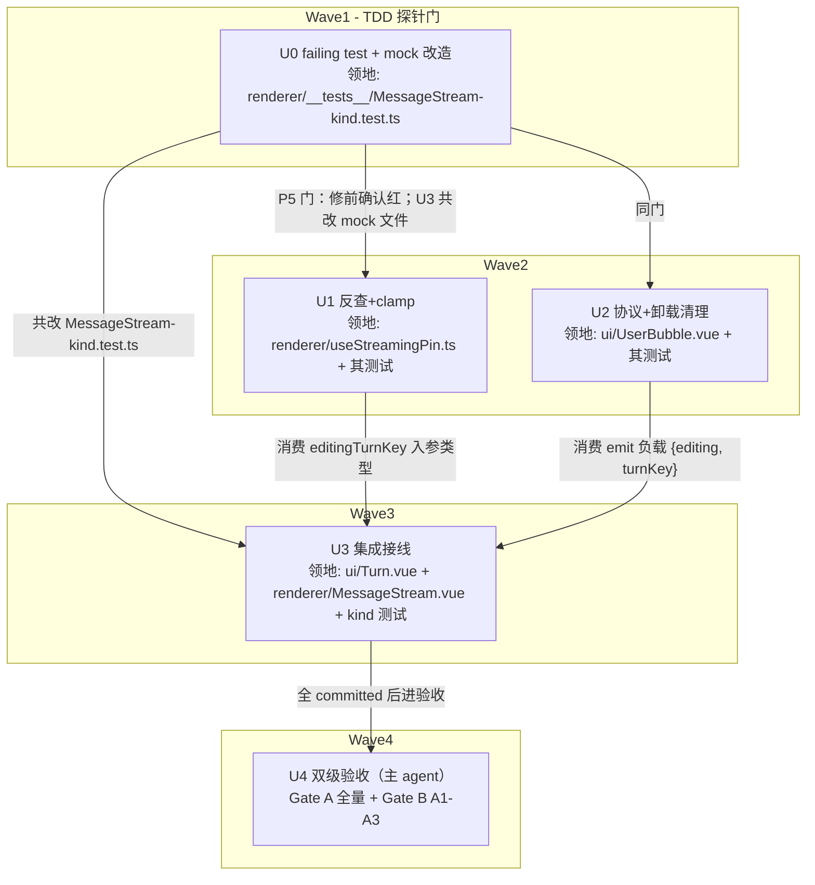

# MessageStream 编辑钉扎身份锚定 实施计划
基线: 30dfa5d6c | 来源设计: docs/design/message-stream-editing-pin-identity.md | 日期: 2026-09-02

## 0 章节映射
| 内容 | 本文实际位置 |
|------|--------------|
| 背景/目标 | §1 背景目标（G1–G4 + Scope） |
| 终态/机制 | §3 解决方案（3.1 终态 / 3.3 决策 D1–D8 / 3.4 错误规格 E1–E4 / 3.5 数据流） |
| 验收场景表 | §4 验收（A1–A3 场景表 + 单测护栏三条） |
| 下一层拆分 | §5 下一层拆分（U0–U4 + 文件改动地图 + 检查点 C1–C3） |
| 待验证检查点 | §5 末尾 C1（复现成立）/ C2（unmount emit 可达）/ C3（mock 形态） |

对抗审查证据：本会话 3 轮 tech-design-review（同一 agent 保留上下文），轨迹 0M/4S → 0M/3S → 0M/1S，第 3 轮 suggestion（E4 复现途径与 D8 矛盾）已按审查者逐字方向修复，终态 0 must-fix。未落盘独立报告文件（对话内完成），审查轨迹摘要即为证据。

## 1 目标快照（逐字摘录设计 §1）

> 设计目标：G1 消除崩溃：任何操作序列（切 session、编辑、流式、fork、后台消息入流）下对话流不再出现 keepMounted 越界渲染崩溃；G2 编辑态生命周期正确：编辑态随其组件销毁必然回收，无残留状态；G3 钉扎语义正确：钉的始终是「正在编辑 / 流式的那一回合」本身，不是某个数组位置；G4 不回归：streaming 钉扎、编辑钉扎的既有功能行为不变。

> Out-of-scope：编辑中切 session 草稿丢失；virtua 升级；parentElement 连锁错误独立修复（A1 判据兜底验证）；向 virtua 上游报告 issue（建议随实施附带，不阻塞）。

## 2 单元列表

| Unit | 职责 | 领地（精确文件路径） | 依赖 | 隔离 | 验收条款 |
|------|------|---------------------|------|------|---------|
| U0 | 测试设施改造 + failing test（P5 探针门）：mock 模拟 virtua keepMounted 渲染语义（越界 item=undefined 直传 slot）+ 解除 Turn/UserBubble 无事件 stub 打通事件链；用例「编辑→切短会话→不抛」确认红 | `packages/renderer/src/__tests__/components/MessageStream-kind.test.ts` | 无（Wave1 独占，先红后修） | plain | ① 新用例运行输出为失败（红，复现 `reading 'kind'` 类崩溃或越界渲染）；② 既有用例不因 mock 改造而破（改造后既有断言仍绿，仅新用例红） |
| U1 | useStreamingPin 身份反查 + null guard + clamp | `packages/renderer/src/composables/panel/useStreamingPin.ts`、`packages/renderer/src/__tests__/effects/use-streaming-pin.test.ts` | U0（TDD 门：确认红后才动手） | plain | `cd packages/renderer && npx vitest run src/__tests__/effects/use-streaming-pin.test.ts` 全绿，含三类新用例：身份反查命中（在场→正确索引）/ miss 不钉（不在场→无该项）/ clamp（构造越界来源→被过滤） |
| U2 | UserBubble emit 协议 +`turnKey` + `onUnmounted` 编辑态清理（C2 检查点：不可达降级 onBeforeUnmount） | `packages/ui/src/features/chat/UserBubble.vue`、`packages/ui/src/features/chat/__tests__/UserBubble.test.ts` | U0（同上）；与 U1 领地互斥可并行 | plain | `cd packages/ui && npx vitest run src/features/chat/__tests__/UserBubble.test.ts` 全绿：既有 3 处 emit 断言适配新负载（167-168/191-192 附近）+ 新增卸载清理用例（编辑态 unmount → emit `{editing:false, turnKey}`） |
| U3 | Turn.vue emits 类型收紧；MessageStream 状态改 `editingTurnKey` + handler（`editing ? turnKey : null`，禁无分支透传）+ `watch(sessionId)` 清零（D8）；U0 用例转绿 | `packages/ui/src/features/chat/Turn.vue`、`packages/renderer/src/components/panel/MessageStream.vue`、`packages/renderer/src/__tests__/components/MessageStream-kind.test.ts` | U0（共改 mock 文件）、U1（消费 editingTurnKey 入参类型）、U2（消费 emit 负载） | plain | ① `cd packages/renderer && npx vitest run src/__tests__/components/MessageStream-kind.test.ts` 全绿（U0 用例转绿）；② `cd packages/ui && npx vitest run src/features/chat/__tests__/Turn.test.ts` 全绿；③ 两包 typecheck 零错误 |
| U4 | 双级验收（非编码单元，主 agent 执行）：Gate A 全量相关套件 + Gate B 真实场景 A1–A3（Playwright 连 dev app） | 无代码领地 | U0–U3 全 committed | plain | Gate A：renderer + ui 全量 `vitest run` 绿 + 两包 typecheck 绿；Gate B：设计 §4 场景表 A1（切短会话零 TypeError + 编辑态复位）/ A2（后台入流编辑框仍在 + U3 白盒断言）/ A3（流式钉扎不回归）逐行签收 |

u-foundation 缺席说明：emit 协议类型内联于各组件 emits 声明（现状即如此），无独立共享契约文件；协议两端由 U2（源）→ U3（透传收紧）串行边覆盖。

## 3 DAG 图

## 4 测试策略

- 增量（单元开发期）：
  - `cd packages/renderer && npx vitest run src/__tests__/effects/use-streaming-pin.test.ts src/__tests__/components/MessageStream-kind.test.ts`
  - `cd packages/ui && npx vitest run src/features/chat/__tests__/UserBubble.test.ts src/features/chat/__tests__/Turn.test.ts`
  - typecheck：`cd packages/renderer && npx vue-tsc --noEmit`；`cd packages/ui && npx vue-tsc --noEmit`
- 全量（收尾 Gate A）：`cd packages/renderer && npx vitest run`；`cd packages/ui && npx vitest run`
- 框架 vitest，配置在子包 vitest.config.ts，从子包目录运行（项目 AGENTS.md 红线）

## 5 合理偏差登记表

| Unit | 偏差 | 理由 | 登记时间 |
|------|------|------|---------|
| （空） | | | |

## 6 状态表

| Unit | 状态 | 轮次 | 证据指针 |
|------|------|------|---------|
| U0 | committed | 1 | c08334b8b：新用例红（`reading 'kind'` 复现）+ 既有 6 用例绿 + 生产代码零改动（vitest 输出与 git diff 已核验） |
| U1 | pending | 0 | — |
| U2 | pending | 0 | — |
| U3 | pending | 0 | — |
| U4 | pending | 0 | — |

## 7 残留风险与变更历史

- 残留风险：C2 若 `onUnmounted` emit 不可达，U2 按 C2 降级 onBeforeUnmount（设计 §5 已授权，语义不变）；E4 双条件窄窗口残留为已接受设计决策（设计 §3.4）。
- virtua 上游 issue：随 U4 附带评估是否提交（out-of-scope，不阻塞验收）。
- 变更历史：
  - 2026-09-02 计划创建。
