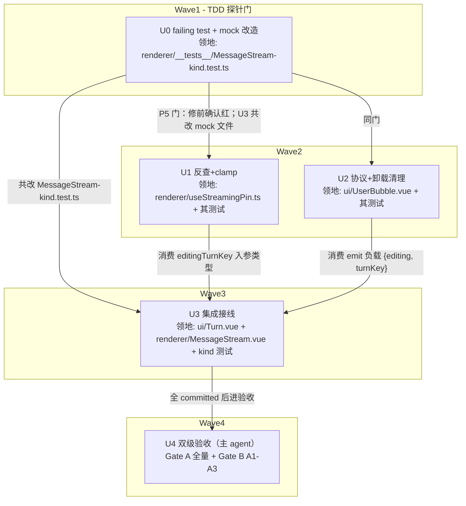

# MessageStream 编辑钉扎身份锚定 实施计划
基线: 30dfa5d6c | 来源设计: docs/design/message-stream-editing-pin-identity.md | 日期: 2026-09-02

## 0 章节映射
| 内容 | 本文实际位置 |
|------|--------------|
| 背景/目标 | §1 背景目标（G1–G4 + Scope） |
| 终态/机制 | §3 解决方案（3.1 终态 / 3.3 决策 D1–D8 / 3.4 错误规格 E1–E4 / 3.5 数据流） |
| 验收场景表 | §4 验收（A1–A3 场景表 + 单测护栏三条） |
| 下一层拆分 | §5 下一层拆分（U0–U4 + 文件改动地图 + 检查点 C1–C3） |
| 待验证检查点 | §5 末尾 C1（复现成立）/ C2（unmount emit 可达）/ C3（mock 形态） |

对抗审查证据：本会话 3 轮 tech-design-review（同一 agent 保留上下文），轨迹 0M/4S → 0M/3S → 0M/1S，第 3 轮 suggestion（E4 复现途径与 D8 矛盾）已按审查者逐字方向修复，终态 0 must-fix。未落盘独立报告文件（对话内完成），审查轨迹摘要即为证据。

## 1 目标快照（逐字摘录设计 §1）

> 设计目标：G1 消除崩溃：任何操作序列（切 session、编辑、流式、fork、后台消息入流）下对话流不再出现 keepMounted 越界渲染崩溃；G2 编辑态生命周期正确：编辑态随其组件销毁必然回收，无残留状态；G3 钉扎语义正确：钉的始终是「正在编辑 / 流式的那一回合」本身，不是某个数组位置；G4 不回归：streaming 钉扎、编辑钉扎的既有功能行为不变。

> Out-of-scope：编辑中切 session 草稿丢失；virtua 升级；parentElement 连锁错误独立修复（A1 判据兜底验证）；向 virtua 上游报告 issue（建议随实施附带，不阻塞）。

## 2 单元列表

| Unit | 职责 | 领地（精确文件路径） | 依赖 | 隔离 | 验收条款 |
|------|------|---------------------|------|------|---------|
| U0 | 测试设施改造 + failing test（P5 探针门）：mock 模拟 virtua keepMounted 渲染语义（越界 item=undefined 直传 slot）+ 解除 Turn/UserBubble 无事件 stub 打通事件链；用例「编辑→切短会话→不抛」确认红 | `packages/renderer/src/__tests__/components/MessageStream-kind.test.ts` | 无（Wave1 独占，先红后修） | plain | ① 新用例运行输出为失败（红，复现 `reading 'kind'` 类崩溃或越界渲染）；② 既有用例不因 mock 改造而破（改造后既有断言仍绿，仅新用例红） |
| U1 | useStreamingPin 身份反查 + null guard + clamp | `packages/renderer/src/composables/panel/useStreamingPin.ts`、`packages/renderer/src/__tests__/effects/use-streaming-pin.test.ts` | U0（TDD 门：确认红后才动手） | plain | `cd packages/renderer && npx vitest run src/__tests__/effects/use-streaming-pin.test.ts` 全绿，含三类新用例：身份反查命中（在场→正确索引）/ miss 不钉（不在场→无该项）/ clamp（构造越界来源→被过滤） |
| U2 | UserBubble emit 协议 +`turnKey` + `onUnmounted` 编辑态清理（C2 检查点：不可达降级 onBeforeUnmount） | `packages/ui/src/features/chat/UserBubble.vue`、`packages/ui/src/features/chat/__tests__/UserBubble.test.ts` | U0（同上）；与 U1 领地互斥可并行 | plain | `cd packages/ui && npx vitest run src/features/chat/__tests__/UserBubble.test.ts` 全绿：既有两处 emit 断言适配新负载（168/192 行）+ 新增卸载清理用例（编辑态 unmount → emit `{editing:false, turnKey}`） |
| U3 | Turn.vue emits 类型收紧；MessageStream 状态改 `editingTurnKey` + handler（`editing ? turnKey : null`，禁无分支透传）+ `watch(sessionId)` 清零（D8）；U0 用例转绿 | `packages/ui/src/features/chat/Turn.vue`、`packages/renderer/src/components/panel/MessageStream.vue`、`packages/renderer/src/__tests__/components/MessageStream-kind.test.ts` | U0（共改 mock 文件）、U1（消费 editingTurnKey 入参类型）、U2（消费 emit 负载） | plain | ① `cd packages/renderer && npx vitest run src/__tests__/components/MessageStream-kind.test.ts` 全绿（U0 用例转绿）；② `cd packages/ui && npx vitest run src/features/chat/__tests__/Turn.test.ts` 全绿；③ 两包 typecheck 零错误 |
| U4 | 双级验收（非编码单元，主 agent 执行）：Gate A 全量相关套件 + Gate B 真实场景 A1–A3（Playwright 连 dev app） | 无代码领地 | U0–U3 全 committed | plain | Gate A：renderer + ui 全量 `vitest run` 绿 + 两包 typecheck 绿；Gate B：设计 §4 场景表 A1（切短会话零 TypeError + 编辑态复位）/ A2（后台入流编辑框仍在 + U3 白盒断言）/ A3（流式钉扎不回归）逐行签收 |

u-foundation 缺席说明：emit 协议类型内联于各组件 emits 声明（现状即如此），无独立共享契约文件；协议两端由 U2（源）→ U3（透传收紧）串行边覆盖。

## 3 DAG 图

## 4 测试策略

- 增量（单元开发期）：
  - `cd packages/renderer && npx vitest run src/__tests__/effects/use-streaming-pin.test.ts src/__tests__/components/MessageStream-kind.test.ts`
  - `cd packages/ui && npx vitest run src/features/chat/__tests__/UserBubble.test.ts src/features/chat/__tests__/Turn.test.ts`
  - typecheck：`cd packages/renderer && npx vue-tsc --noEmit`；`cd packages/ui && npx vue-tsc --noEmit`
- 全量（收尾 Gate A）：`cd packages/renderer && npx vitest run`；`cd packages/ui && npx vitest run`
- 框架 vitest，配置在子包 vitest.config.ts，从子包目录运行（项目 AGENTS.md 红线）

## 5 合理偏差登记表

| Unit | 偏差 | 理由 | 登记时间 |
|------|------|------|---------|
| U1+U3 | 合并为单 commit 6ce11cfc2 | U1 新签名单独提交时 MessageStream.vue 仍传旧参（TS2353）编译红，无可编译中间态；按领地拆分会产出编译失败的 commit | 2026-09-02 |
| U2 | 审查报告称三处 emit 断言，实为两处（168/192 行） | 以源码为准；两处均已适配（设计文档 §5 文件地图已同步订正） | 2026-09-02 |
| U2 | 新增卸载用例断言形态：`toEqual([[{editing:false, turnKey:'u1'}]])`（数组唯一一条）而非「unmount 前后长度差」 | test-utils 的 unmount() 先清空 emitted 记录再卸载，长度差断言不可行；唯一性断言更强（恰好证明 emit 来自卸载钩子） | 2026-09-02 |
| U3 | P5 用例断言升级为双通道取证（编辑中 keepMounted 含编辑索引 + 切换后全部有界），超设计「断言不抛」要求 | 排除断路假绿形态（旧参被静默忽略 → 钉扎不工作 → 不崩但没钉） | 2026-09-02 |
| U3 | mock Virtualizer 用 flatMap + keyed children 复刻真实 virtua 实例复用行为 | 嵌套数组 children 会逐位置 diff 全量重建 stub（编辑态丢失）；keyed 扁平使 A2 用例的编辑态保持断言可信 | 2026-09-02 |

## 6 状态表

| Unit | 状态 | 轮次 | 证据指针 |
|------|------|------|---------|
| U0 | committed | 1 | c08334b8b：新用例红（`reading 'kind'` 复现）+ 既有 6 用例绿 + 生产代码零改动（vitest 输出与 git diff 已核验） |
| U1 | committed | 1 | 6ce11cfc2（与 U3 合并 commit，见偏差登记表第 1 条）；vitest 21 绿（主 agent 复验） |
| U2 | committed | 1 | eccfd2bb1；vitest 40 绿（UserBubble 13 + Turn 27）+ ui typecheck 0 错（主 agent 复验）；C2 结论：onUnmounted 可达（test-utils unmount 先清 emitted 记录再卸载，探针实证），无需降级 |
| U3 | committed | 1 | 6ce11cfc2；kind 测试 8 绿（U0 转绿 + A2 白盒，P5 用例含非断路取证：编辑中 keepMounted 含编辑索引）+ renderer/ui typecheck 0 错（主 agent 复验）；D3/D8 消融实验各自单独充分 |
| U4 | committed | 1 | Gate A（subagent 全量验收，2026-09-02）：renderer vitest 350 files / 3617 passed / 3 skipped（存量 it.skip，基线前已存在，与本次无关）/ exit 0；ui vitest 57 files / 551 passed / exit 0；renderer+ui vue-tsc --noEmit 与 typecheck:test 真实退出码 0；eslint 两包范围（根 config + --max-warnings 0）0；覆盖矩阵无 uncovered。Gate B（主 agent Playwright 黑盒，dev app localhost:9222，真实 runtime/pi/GLM-5.3）：A1 编辑末回合切空会话 + 5 次往返全程 0 TypeError（截图 /tmp/gateb-a1-empty-session.png）；A2 编辑中 `!echo hi` 入流，编辑框与草稿保留、0 错误（/tmp/gateb-a2-edit-during-bash.png），白盒判据由 U3 单测（keepMounted [2]→[3] 跟随）覆盖；A3 流式期间上滚两屏再滚回，150 字回复完整无断流、0 错误（/tmp/gateb-a3-stream-complete.png）。A4 打包版冒烟按设计标注随下一 beta（可选，未执行）。C2 检查点已回填：onUnmounted 可达（见 U2 行）；parentElement 连锁错误断言由 A1 全程 console 监听兜底验证（未出现） |

## 7 残留风险与变更历史

- 残留风险（Gate A 验收转入）：
  1. `MessageStream-bash.test.ts:89/129/209` 三处存量 `it.skip`（基线前已存在，其中 W5T1 streaming+bash 共存钉扎场景当前无活跃测试守护，注释仍引用旧 pinStreaming API）——历史技术债，与本次改动无关，未修。
  2. `Turn.vue` 的 edit-state-change 运行时透传无直接单测（本轮仅类型声明改动，vue-tsc 覆盖）；后续若改透传逻辑需补用例。
- 残留风险（设计转入）：E4 双条件窄窗口（emit 两级不可达 + 同 session 数据换血恢复）为已接受设计决策；编辑中切 session 草稿丢失为 out-of-scope 既有行为。
- virtua 上游 issue：未提交（out-of-scope，后续可选项）。
- Gate B 环境说明：验收会话「确认收到」（2 回合 + 1 条流式）留在 dev 数据目录（真实链路产物，未清理）；种子 JSONL 注入路线因侧栏 project 归属机制未采纳，A1 的「长→短」用「2 回合 → 空会话」构成（空会话为最严格短侧，任意索引必越界）。
- 变更历史：
  - 2026-09-02 计划创建。
  - 2026-09-02 阶段 3 一致性审查（1 轮收敛）：unreasonable 清零（1 条 low 流程项=状态回写随本次 commit 解决）；doc_errors 3 条主 agent 已修——设计 §5 U0「解除 Turn/UserBubble stub」改为「升级 Turn stub（其模板不含 UserBubble，事件链断于此）」、文件地图「三处断言」订正「两处」、UserBubble.vue C2 注释版本号 2.4.6→2.4.11；reasonable 5 条中 2 条落偏差登记表（P5 双通道取证、mock keyed 扁平）。
  - 2026-09-02 阶段 5 双级验收双绿，流水线交付。
