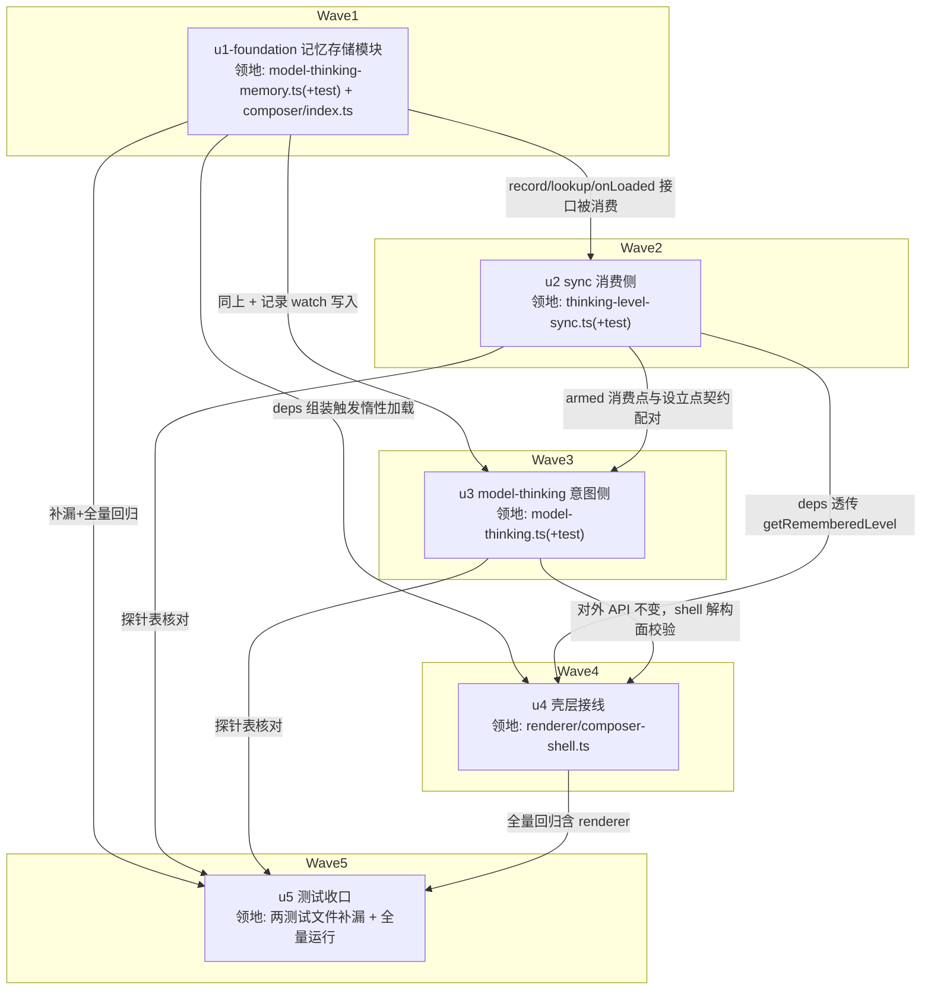

# model-thinking-level-memory 实施计划

基线: 9de8deb6a | 来源设计: docs/design/model-thinking-level-memory.md | 日期: 2026-08-31

## 0 章节映射

| 内容 | 本文实际位置 |
|------|--------------|
| 背景/目标 | §1 背景目标（SCQA + G1-G3 + In/Out scope） |
| 终态/机制 | §2 现状与问题分析（2.2 现有链路 + 关键事实①-⑤）；§3 解决方案（3.1 终态 / 3.2 方案对比 / 3.3 决策 D1-D6 + 探针表 / 3.4 数据模型与终态数据流 + 错误规格 E1-E10） |
| 验收场景表 | §4 验收（A1-A6，含步骤与通过标准） |
| 下一层拆分 | §5 下一层拆分（U1-U5 单元表 + 文件改动地图） |
| 待验证检查点 | §5 待验证检查点 1-3（探针表为实施期门；检查点 2 随 Gate B 确认） |
| 审查证据 | docs/design/model-thinking-level-memory.review.md（4 轮收敛，终轮 0 must-fix） |

## 1 目标快照（逐字摘录自设计文档 §1）

> **用户在 composer 上为每个模型调好的 thinking level 记不住——切走再切回，档位被通用规则重置，必须手动重调。本设计让「切回某模型 = 回到我上次用它时的档位」。**

- **G1 记得住**：在模型 M 上把档位调到 L 后，无论中途切过多少模型，切回 M 时档位自动是 L。
- **G2 跨重启**：重启 app 后 G1 依然成立。
- **G3 不误伤**：记忆恢复只在「我显式切换模型」时发生；切换 session 焦点、打开历史 session 不得因记忆表改写档位；记忆档位在新模型不可用时行为与现状一致（回落通用规则），不出错。

**Out of scope**（逐字摘录）：runtime / shared 协议任何改动；「最后使用的模型」记忆（runtime 已覆盖）；session 切换时跨体系档位重置的既有行为；档位记忆的管理 UI；per-project 维度的记忆。

## 2 单元列表

| Unit | 职责 | 领地（精确文件路径） | 依赖 | 隔离 | 验收条款 |
|---|---|---|---|---|---|
| u1-foundation | 记忆存储模块：reactive Map + 惰性异步预载 + `record/lookup/onLoaded` API + KV 写穿（key `xyz-agent:model-thinking-memory`）+ E1 损坏回退空表 / E6 非法值丢弃 / E7② 加载完成回调补写 | `packages/core/src/domain/composer/model-thinking-memory.ts` `packages/core/src/domain/composer/model-thinking-memory.test.ts` `packages/core/src/domain/composer/index.ts`（仅追加一行 export） | 无 | plain | `cd packages/core && pnpm vitest run src/domain/composer/model-thinking-memory.test.ts` 绿：KV round-trip / 损坏 JSON 回退空表 / 非法档位值丢弃 / KV 写失败内存表存活 / 加载完成回调触发 / key 值格式校验 |
| u2 | sync 消费侧扩展：`ThinkingLevelSyncDeps` 增 `getRememberedLevel`；watch 回调顶部 armed 消费——规则 1（过期 >5s 且 in-flight 计数为零）/ 规则 2（匹配幂等消费：命中且可用且 value≠当前 → onReset+return；否则清 armed 走既有分支）/ 规则 3（不匹配保留） | `packages/core/src/domain/composer/thinking-level-sync.ts` `packages/core/src/domain/composer/thinking-level-sync.test.ts` | u1 | plain | `cd packages/core && pnpm vitest run src/domain/composer/thinking-level-sync.test.ts` 绿：规则 1/2/3 各自行为断言 + 命中恢复经 onReset + 未命中/不可用回落既有分支 + 幂等不发声 + 既有对齐行为不回归（现有用例全绿） |
| u3 | model-thinking 意图侧扩展：armed 设立（三分支，含 `{modelId, at, callId}`）+ 规则 4 失败清 / 规则 5 成功清（均 callId 归属校验）+ in-flight callId 引用计数 + 规则 6 sessionIdRef 换绑清 + `localAuthored` 标志 + landing 跟随 watch（immediate + 变化触发，D2）+ 记录 watch（双条件门禁 + 可用性校验） | `packages/core/src/domain/composer/model-thinking.ts` `packages/core/src/domain/composer/model-thinking.test.ts` | u1, u2 | plain | `cd packages/core && pnpm vitest run src/domain/composer/model-thinking.test.ts` 绿：探针表第 1 行 armed 9 断言点序列族 + 第 2 行跟随三行为 + 早到/晚到双路径污染反例 + 记录门禁（landing/staging 不入表、已建态入表）+ 现有用例全绿 |
| u4 | 壳层接线：composer-shell 组装新 deps（memory 模块惰性加载在此触发；`getRememberedLevel` 透传） | `packages/renderer/src/composables/panel/composer-shell.ts` | u1, u2, u3 | plain | `pnpm -C packages/core typecheck` 过；`pnpm -C packages/renderer typecheck` 过；`pnpm -C packages/renderer vitest run -- silent related 或现有 composer 相关测试` 不回归 |
| u5 | 测试收口：探针表逐项核对 + composer 域全量回归 + 交叉单元用例补漏（串行末位，领地时间轴不重叠） | `packages/core/src/domain/composer/model-thinking.test.ts`（补漏） `packages/core/src/domain/composer/model-thinking-memory.test.ts`（补漏） | u1-u4 | plain | 探针表三条实施期门逐项核对清单（9 断言点 + 跟随双路径 + 非单射幂等边界）签收；`cd packages/core && pnpm test` 全绿 |

## 3 DAG 图

全串行链（每波 1 单元，并发 1 ≤ 5）。串行理由：armed 结构与 deps 签名是 u2/u3 强耦合契约（同域跨文件），消费点与设立点分离设计（D3/D4）决定意图侧必须见到消费侧接口后落地；u4 是唯一 renderer 文件必须最后接线；u5 收口。

## 4 测试策略

**测试命令（自 packages/core/package.json、packages/renderer/package.json 真实读取）**：

- 增量（单元开发期）：`cd packages/core && pnpm vitest run src/domain/composer/<对应>.test.ts`
- 渲染侧（u4）：`pnpm -C packages/renderer typecheck` + `pnpm -C packages/renderer vitest run`（composer 相关）
- 全量（收尾 Gate A，项目收尾场景）：`cd packages/core && pnpm test` && `pnpm -C packages/renderer typecheck && pnpm -C packages/renderer test`
- 框架红线：vitest；timer 相关用 fake timers；测试从子包目录运行

**Gate B（§4 验收 A1-A6）**：`pnpm dev` 真实 app + browser-automation 连 `http://localhost:9222`（截图/DOM 断言 popover chip），后端真值经 `XYZ_AGENT_DEBUG=1` 查 `~/.xyz-agent/logs/` pi-*.jsonl 的 setThinkingLevel 帧值。

## 5 合理偏差登记表

| # | 偏差内容 | 判定 | 证据 | 状态 |
|---|---|---|---|---|
| 1 | `lookup` 返回类型收窄为 `ThinkingLevel \| undefined`（契约写 `string \| undefined`） | 合理——子类型兼容，下游 u2/u3 免二次断言 | model-thinking-memory.ts lookup 签名 | 已固化 |
| 2 | `record` 在预载完成前挂起写穿、加载完成后补写收敛（契约只说「同步内存 + 异步写穿」未规定窗口时序） | 合理且必要——防局部快照覆写 KV 整表静默清除未知条目；测试锁定该语义 | model-thinking-memory.test.ts「加载窗口 record」用例 + registry #21 例外列 | 已固化 |
| 3 | taste 豁免注解 W24-EX-B（require-data-owner-annotation error 级，登记表在 u1 领地外） | 合理——主 agent 已补登记 registry #21 并同步注解为非草稿 | docs/architecture/data-source-registry.md #21 | 已闭环 |
| 4 | armed 访问器含 `at` 字段 + 导出 `ArmedModelSwitchIntent` 切片与 `ARMED_EXPIRY_MS=5000`（任务建议形状漏 at，规则 1 过期判定必需） | 合理——契约必需，u3 复用同一阈值常量 | thinking-level-sync.ts 导出 | 已固化 |
| 5 | 四个新 deps 字段全部可选 | 合理——现有 8 用例与 u4 接线前调用方不注入新字段，必填即挂 typecheck；armed null 零副作用有回归基线用例锁定 | thinking-level-sync.test.ts 回归基线用例 | 已固化 |
| 6 | `eslint --fix` 重排 watch 回调既有代码缩进（48 个 indent warning 为存量技术债，新增行延续既有风格被一并检出） | 合理——按 pre-commit「含存量全修」红线执行；`git diff -w` 证实既有代码忽略空白后零变化，纯缩进无逻辑改动 | git diff -w 复核（主 agent 核验） | 已固化 |
| 7 | 规则 6 换绑清 watch 注册在 sync watch **之前**（设计只说「换绑即作废」未规定注册序） | 合理且必要——同一 flush 内 watch job 按注册序执行，换绑清必须先于消费检查，否则换绑到恰为 armed 目标模型的 session 会在作废前被消费为伪恢复；S8 用例锁定该次序 | model-thinking.ts 注释 + S8 用例 | 已固化 |
| 8 | E7② 补写回调加 `onScopeDispose` disposed 守卫（设计未提） | 合理——split panel 实例可能在 KV 预载完成前销毁，死实例不应再被回调写入 | model-thinking.ts | 已固化 |
| 9 | S5 断言判据 =「armed 目标记忆值从不发出」而非调用总次数；测试文件顶层 beforeEach/afterEach（platform stub + u1 重置） | 合理——mock 不回写 store 致既有对齐重发与 armed 无关（测试内注释差异）；顶层 stub 消除 E2 warn 噪音不改既有用例主体 | model-thinking.test.ts | 已固化 |

## 6 状态表

| Unit | 状态 | 轮次 | 证据指针 |
|---|---|---|---|
| u1-foundation | committed | 1 | 12/12 绿（memory.test.ts）；registry #21 登记；deviations 3 条入 §5 |
| u2 | committed | 1 | 17/17 绿（8 现有 + 9 新）；deviations 3 条入 §5 |
| u3 | committed | 1 | 36/36 绿（18 现有 + 18 新，探针表 9 断言点全覆盖）；deviations 4 条入 §5 |
| u4 | pending | 0 | — |
| u5 | pending | 0 | — |

## 7 残留风险与变更历史

**残留风险**：

1. 实施环境真实模型对的 supportedLevels 同体系性未知（设计 §5 检查点 2）——影响 A1 中「无记忆首切」落点表现，不影响断言；随 Gate B 确认
2. landing memory-aware 依赖 `currentModelId` 的 landing 分支真值链（flow.currentModel / defaultModel）——u3 单测以 mock 驱动，真实链路差一步由 Gate B A2 双路径兜底
3.Gate B A1-A6 需要真实 provider 双模型环境（如 builtin:bigmodel-coding-plan 下 GLM-5.3 / GLM-5.3-Flash）——若实施环境模型不满足，以实际可用模型对等价替换（断言结构不变）

**变更历史**：

| 日期 | 事件 |
|---|---|
| 2026-08-31 | 计划创建（设计文档 commit b27c175ce，4 轮审查 0 must-fix） |
