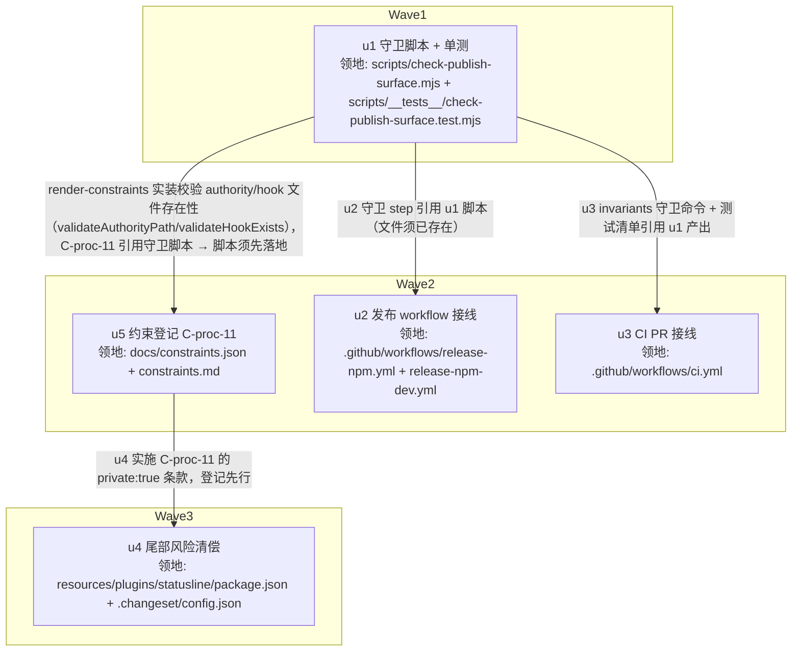

# npm 发布面一致性守卫 实施计划

基线: cb73002b1（设计文档 v4 commit）| 来源设计: docs/design/npm-publish-surface-guard.md | 日期: 2026-09-07

## 0 章节映射

| 内容 | 本文实际位置 |
|------|--------------|
| 背景/目标 | §1 背景目标（SCQA §1.1 / 受众背景 §1.2 / 设计目标 G1–G4 §1.3 / in-out scope §1.4） |
| 终态/机制 | §3 解决方案（终态+失败路径 §3.1 / 方案对比 §3.2 / 关键决策 D1–D8 §3.3 / 终态数据流 §3.4） |
| 验收场景表 | §4 验收（S1 / S1b / S2 / S3 / S4 / S5 / S6 / S6b / S7） |
| 下一层拆分 | §5 下一层拆分（u1–u5 单元表 + 文件改动地图 + 实施顺序） |
| 待验证检查点 | §5 末「待验证检查点」2 项（豁免新形态判定 / S5 CI run 安排） |

审查证据：3 轮对抗式审查收敛（主审 2+1+0 / 影响面 4+0 must-fix），第 3 轮报告 /tmp/review-publish-surface/main-r3.md 判定 0 must-fix；全部 suggestion 已在 v4 修复（变更历史 §6）。v4 = commit cb73002b1。

## 1 目标快照（逐字摘录自设计 §1.3 / §1.4）

- **G1 发布面一致性机器门（双向）**：发布现场，每个 dist 发布包 `files` 白名单的每个条目必须真实存在于磁盘且非空（幽灵条目拦截，幽灵声明方向）；包内顶层 `dist*` 产物目录必须被 `files` 白名单覆盖（产物目录反向覆盖，漏声明方向）；自包含档（`dist.bundle/`）必须真正自包含（外部依赖探针）。
- **G2 构建入口显式化**：发布 workflow 显式声明每个 dist 包的全部构建档；消除「smoke 脚本副作用 = 唯一构建入口」的隐式依赖——构建产出由显式步骤保证，验证门只负责验证。
- **G3 同型缺口清偿**：dev 预发布线补 session-delivery build 步骤；`resources/plugins/statusline` 加 `"private": true`；deprecated 的 `pi-unified-hooks` 显式加入 changeset ignore。
- **G4 防复发登记**：constraints.json 新增 C-proc-11（发布面一致性约束，含「新增产物档须同批挂守卫」条款）。

**out-of-scope**：产物契约 manifest（仅登记触发条件）；subagent-core 0.5.2 发布编排（S7 只定义验收口径）；extensions 方向守卫改造（现状健康不动）；zsw 侧 vendor 通道回归（外部仓事务）。

## 2 单元列表

| Unit | 职责 | 领地（精确文件路径） | 依赖 | 隔离 | 验收条款 |
|------|------|----------------------|------|------|----------|
| u1 守卫脚本 | check-publish-surface.mjs：动态发现 dist 发布包（packages/ 下非 private 且 files 含 `dist*` 目录条目）→ 检查项 1 幽灵条目（磁盘 stat 判定形态：目录须非空 / 文件须存在 / glob 须命中 ≥1）+ 检查项 2 自包含探针（三步判定顺序：isBuiltin 先行 → 相对路径 → 裸名红 / 子路径须命中豁免；豁免 `ajv/dist/runtime/*` 含预期计数 4 + `.default` 形态锚点，超出红、少于预期 notice）+ 检查项 3 产物目录反向覆盖（顶层 `dist*` 目录须被 files 覆盖）+ 体积估算 warning（files 条目求和 > 5MB 提示 D7 重审，不红）；配套单测（vitest + tmpdir fixture，按 check-core-dist-gate.test.mjs 惯例） | `scripts/check-publish-surface.mjs`（新）、`scripts/__tests__/check-publish-surface.test.mjs`（新） | — | plain | ① 单测绿（用例覆盖设计 u1 行清单：幽灵三形态 / 无尾斜杠目录条目非空断言 / 探针三步顺序含 `fs/promises` `node:fs/promises` 内建子路径 PASS / 裸名红 / 豁免命中绿 / 子路径未命中红 / 豁免命中数超预期红 / 命中少于预期 notice 不红 / 反向覆盖命中 / 漏声明红 / glob 零命中边界）；② 三包四档本地构建后 `node scripts/check-publish-surface.mjs` 基线绿（S3 前置断言）；③ S1 实测：临时加 files 条目不构建 → 红含恢复指引；④ S1b 实测：mkdir dist.worker + 占位 .cjs 不加 files → 红；补条目 → 绿 |
| u5 约束登记 | constraints.json 新增 C-proc-11（发布面一致性：files 白名单 ↔ 构建产出双向对齐，发布门强制；新增产物档须同批挂构建步骤、files 条目与守卫覆盖；自包含档命名约定 `dist.bundle`、非发布构建目录不得用 `dist` 前缀；非 workspace 包不经 changeset 发布线、防手滑 publish 用 private:true）→ 跑 render-constraints 重生成 md | `docs/constraints.json`、`docs/constraints.md`（生成产物，随同提交） | u1 | plain | ① constraints.json 含 C-proc-11 且 id/scope/权威源/执行方式字段与既有条目同构，authority 含 `../scripts/check-publish-surface.mjs`、enforcement machine hook 指向该脚本（u1 已产出，引用真实）；② `node scripts/render-constraints.mjs` exit 0，md 再生成含 C-proc-11；③ `node scripts/check-doc-symbol-drift.mjs` exit 0 |
| u4 尾部风险清偿 | statusline 加 `"private": true`；pi-unified-hooks 加入 changeset ignore | `resources/plugins/statusline/package.json`、`.changeset/config.json` | u5 | plain | S6b：① `node -p "require('./resources/plugins/statusline/package.json').private"` 输出 true；② `.changeset/config.json` ignore 数组含 `@zhushanwen/pi-unified-hooks`；③ 两文件 JSON 可解析 |
| u2 发布 workflow 接线 | release-npm.yml：subagent-core 两档显式构建 step + 守卫 step（publish 前）+ Summary step gates 文字补 publish surface guard；release-npm-dev.yml：session-delivery build + core 两档 + 守卫 step **全部挂 `should_publish == 'true'` 条件**，既有 `Build extension-protocol` 保持无条件不动 | `.github/workflows/release-npm.yml`、`.github/workflows/release-npm-dev.yml` | u1 | plain | ① diff 审查逐项符合 D2/D4（正式线新 step 无条件；dev 线新 step 同条件挂载 + 既有 step 零改动）；② 两 YAML 解析有效（node yaml parse exit 0）；③ 本地等价命令实证：四条 build 命令产出非空 + 守卫绿；④ 守卫 step 的调用命令与 ci.yml（u3）同源直调 |
| u3 CI PR 接线 | ci.yml invariants 段：3 包构建 + 守卫 step（同源直调，注释标注 D7 通则，参照 G4/D9-① 既有模式）；**同批**将新测试文件追加进「Test - scripts guards」step 显式文件清单（逐名列举非 glob，漏追加 = 永不运行） | `.github/workflows/ci.yml` | u1 | plain | ① invariants 段新增 step 位置正确（pnpm install 之后）且命令可直接本地复跑；② Test - scripts guards 清单含 `scripts/__tests__/check-publish-surface.test.mjs`；③ YAML 解析有效；④ 本地复跑 invariants 新增命令序列 exit 0 |

## 3 DAG 图

说明（v2 修订）：初版按设计 §5「u5 登记先行」画 u5→u1 纪律边，u5 执行者实测证伪——render-constraints.mjs 实装（行 47-61）对 authority 路径与 machine hook 做 existsSync 校验、渲染模式同样先校验后 exit 2，「登记先行引用未来脚本」机器不可通过；且设计 u5 行 justification 原文「u1 落地时同步」本就与「u5 先行」自相矛盾。裁决为 u1→u5 反转（设计文档 §5 已同批修订，见其变更历史 v5）。「先登记再写代码」纪律由「同批交付绑定」满足：u5 排 u1 后、u4 前，流水线中断时状态表可见 u5 pending。u2 与 u3 领地互斥且都只依赖 u1，与 u5 同 Wave 并行。

## 4 测试策略

**增量（单元开发期，subagent 自跑）**：

- u1：`cd /Users/zhushanwen/Code/xyz-agent-workspace/dev-0.9.15 && pnpm exec vitest run scripts/__tests__/check-publish-surface.test.mjs`；守卫本体 `node scripts/check-publish-surface.mjs`（前置：四档构建 `pnpm --filter @xyz-agent/extension-protocol run build && pnpm --filter @xyz-agent/session-delivery run build && pnpm --filter @zhushanwen/subagent-core run build && pnpm --filter @zhushanwen/subagent-core run build:bundle`）
- u5：`node scripts/render-constraints.mjs` + `node scripts/check-doc-symbol-drift.mjs`
- u2/u3：YAML 解析验证（node + js-yaml 或 python3 -c yaml.safe_load）+ 本地复跑 workflow 内命令序列
- u4：S6b 两条断言命令 + JSON 解析

**全量（收尾阶段 5，主 agent 跑）**：

- scripts guards 测试全套（ci.yml「Test - scripts guards」清单口径，含新测试）：`pnpm exec vitest run scripts/__tests__/check-unsafe-stream-writes.test.mjs scripts/__tests__/check-core-dist-gate.test.mjs scripts/__tests__/gitcode-release-sync.test.mjs scripts/__tests__/check-publish-surface.test.mjs`
- `node scripts/check-doc-symbol-drift.mjs`
- 新脚本过项目 lint（`pnpm run lint` 若覆盖 scripts/，否则 `pnpm exec eslint scripts/check-publish-surface.mjs scripts/__tests__/check-publish-surface.test.mjs` 按仓库现状）
- render-constraints 幂等（重跑无 diff）

## 5 合理偏差登记表

初始为空。执行中发现的合理不一致在此登记（必要时同步设计文档措辞并记变更历史）。

| 日期 | 单元 | 偏差内容 | 处置 |
|------|------|----------|------|
| 2026-09-07 | u5 | 计划初版按设计 §5「u5 登记先行」画 u5→u1 边；u5 执行者实测 render-constraints.mjs 实装校验 authority/hook 文件存在性（validateAuthorityPath 行 56-61 / validateHookExists 行 47-54，渲染模式同样先校验 exit 2），登记引用 u1 未来产出的守卫脚本必然 exit 2——顺序在机器门前不可通过（执行者以 /tmp 探针实证，未动仓库） | doc_errors：主 agent 反转 DAG 边为 u1→u5（§2/§3 已改）；设计文档 §5 实施顺序与 u5 行 justification 同批修订（变更历史 v5）。「先登记再写代码」纪律以「同批交付绑定」形态满足 |
| 2026-09-07 | u1 | ① blocker 处置：守卫首次跑真实仓库即抓到存量真实幽灵——@xyz-agent/extension-protocol 的 files 条目 "README.md" 磁盘从未存在（git 历史核实，0.8.x tarball 一直静默缺 README）；主 agent 创建 packages/extension-protocol/README.md（照 session-delivery README 形态，内容基于包实际导出）——领地外单文件，属 blocker 裁决处置非 subagent 越权 | 已处置：README 创建后基线绿（3 包全绿）。该发现本身是守卫价值的即时实证 |
| 2026-09-07 | u1 | ② D7 重审信号实测触发：subagent-core files 求和 8.98MB > 5MB 阈值，守卫 warning 如实回显（设计 D7 预期的机器信号） | 重审裁决（编排者，向用户汇报可推翻）：维持双档形态——8.98MB 中 dist.bundle 仅 1.36MB（15%），大头是常规 dist/ 双格式产物（npm 常规消费必需不可拆）；唯一 vendoring 消费者 zsw 依赖现有 dist.bundle 路径约定；warning 机器回显每次发布可见，形态再膨胀有信号 |
| 2026-09-07 | u1 | ③ 实现偏差（执行者登记）：globToRegExp 弃用 check-extension-files.mjs 链式 replace（其 `**/*.js` 无前缀 globstar 形态有二次替换退化 bug），改为分段转换实现同一 minimatch 语义，已注释注明 | 合理偏差：按声称语义正确实现，守卫内自洽；check-extension-files 原实现的 bug 属 extensions 方向（本设计 out-of-scope），不顺手修 |

## 6 状态表

| Unit | 状态(pending/in-progress/committed/blocked) | 轮次 | 证据指针 |
|------|--------------------------------------------|------|----------|
| u1 | committed | 1 | 单测 29/29（`pnpm exec vitest run scripts/__tests__/check-publish-surface.test.mjs`）；真实仓库基线绿（README 处置后 3 包全绿，探针 0 裸名红 + ajv 豁免恰 4 = S3 前置成立）；S1/S1b 实测红绿全路径（主 agent 核验，见偏差登记表）；D7 warning 8.98MB 如实回显 |
| u5 | committed | 2（首轮 blocked 顺序反转，二轮落地） | render exit 0（91 条，C-proc-11 authority/hook 存在性校验通过）；md 增量 2+/1-（无重排）；check-doc-symbol-drift exit 0；五点条款 summary 逐点覆盖 |
| u4 | committed | 1 | S6b 两断言 true（主 agent 复跑）；diff 最小（statusline +1 行 private 第 4 行惯例位 / ignore 数组 +1 项数组外零改动） |
| u2 | committed | 1 | 正式线步骤序 = §3.4（Build subagent-core 无条件 + guard 在 Closure/Publish 间 + Summary gates 文字同步）；dev 线三新 step 全挂 should_publish 条件、既有 Build extension-protocol 无 hunk（YAML 解析逐 step 复核）；本地守卫 exit 0 |
| u3 | committed | 1 | ci.yml 两处：invariants 新增 Build dist packages + Publish surface guard (C-proc-11)（install 后，注释含 D7 通则/两级拦截）；Test - scripts guards 清单含新测试；YAML 解析 OK；本地复跑命令序列 exit 0 + 单测 29/29 |

## 7 残留风险与变更历史

**残留风险**：

1. S5（真实 CI run）需推送测试分支——push 属用户授权事项，执行到 u3 验收时向用户确认推送安排；未获授权则以「本地复跑 invariants 命令序列 + diff 审查」为替代证据并如实登记。
2. S6 的 workflow 生效面（真实 dev 预发布 run）延后到下次 dev 预发布，设计 §4 已如实登记此形态。
3. S7（发布后终验）不在本次实施范围，随 0.5.2 发布编排执行。
4. 工作区存在认知外改动（`docs/design/update-multi-source.md` 未 staged、`packages/renderer/src/__tests__/panel/command-popover-symbols-format-age.test.ts` 已 staged）——主 agent 全程不碰；commit 一律精确路径 + pathspec（`git commit -- <paths>`），防裹挟 staged 区。

**变更历史**：

| 日期 | 变更 |
|------|------|
| 2026-09-07 | 初版：按设计 §5 拆分 u1–u5 固化为 DAG（u4 从叙述末位提前进 W2 并行，理由见 §3 说明） |
| 2026-09-07 | v2：u5→u1 依赖边反转为 u1→u5（u5 执行者实证 render-constraints 实装校验 authority/hook 存在性，登记先行引用未来脚本机器不可通过）；Wave 重排 W1={u1} / W2={u5,u2,u3} / W3={u4}；u5 验收条款补「authority/enforcement 引用真实」；详见 §5 偏差登记表 |
| 2026-09-07 | v3：阶段 3 一致性审查（三区并行 reviewer，0 unreasonable / 7 doc_errors）台账同步：§5 偏差表首行错别字「登立」改「登记」；设计文档同批 v6（指引分流说明 / D2 行号改锚 step 名称 / u3「紧随」改「依赖」）；README 三缺陷 + 守卫文案分流走阶段 4 修复批次 |
| 2026-09-07 | v4：阶段 3+4 清零——修复批次（7a9b177f8：README 示例 stats-line 类型正确三层验证 + 包结构四子域 + extractGui 语义 + 守卫 fixFor 分流，判定逻辑零改动）+ 设计 v6（6d6116ca7）；定向复审（区 A 审查者续用）4 条 doc_errors 全 closed、0 new_issues、单测 29/29 与守卫基线复跑绿 |
