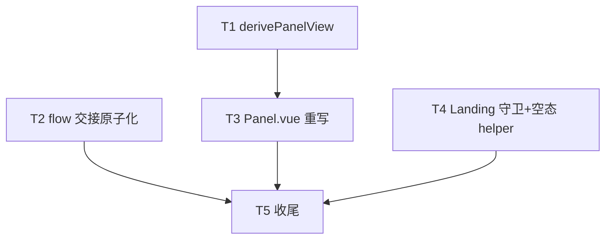

# PanelView 派生收敛与 Flow 生命周期绑定 实施计划

基线: 本文件首次 commit（见 git log） | 来源设计: docs/design/panel-view-derivation-and-flow-lifecycle.md | 日期: 2026-08-29

## 0 章节映射

| 内容 | 设计文档实际位置 |
|------|--------------|
| 背景/目标 | §1 背景目标（G1 输入面稳定 / G2 流程状态不越权 / G3 决策可穷举 + in/out scope） |
| 终态/机制 | §3.1 终态（场景 A-D）+ §3.3 决策 D1-D7 |
| 验收场景表 | §4（V1 / V1' / V2 / V3 / V3' / V4 / V5） |
| 下一层拆分 | §5（T1-T5 单元表 + 文件改动地图） |
| 待验证检查点 | §5 末尾（① Landing 渲染条件语义差异实测 ② D4 卸载守卫 overlay 时序实测 + 「turn 活跃+无消息→conversation 空白」边界组合） |

审查证据: docs/design/panel-view-derivation-and-flow-lifecycle.review.md（R1 2 must-fix → R2 1 → R3 收敛 0 must-fix）

## 1 目标快照（逐字摘录）

- **G1 输入面稳定**：会话中任何时刻 composer 可见可用；turn 状态翻转（streaming→complete）、compacting 等运行态不改变输入面的存在性。
- **G2 流程状态不越权**：新建任务流程（landing 及其 overlay）只影响「无会话承接时」的渲染，永不影响已有会话的任何渲染决策。
- **G3 决策可穷举**：输入面选择逻辑收敛为单一纯函数，全输入组合有机器守卫（组合表测试），非法组合（如有消息且 landing）在输入设计上不可表达。

Out of scope：split 多 panel 重启；flow 状态机 10 态内部重构；ask-user 交互本身；MessageStream 内部。

## 2 单元列表

| Unit | 职责 | 领地（精确文件路径） | 依赖 | 隔离 | 验收条款 |
|------|------|----------------------|------|------|----------|
| T1 | PanelView 类型 + derivePanelView 纯函数 + 全组合表测试（含回归用例「有消息+flowActive→conversation」与「dead 吞 ask-user」与「turn 活跃+无消息→conversation」） | `packages/core/src/domain/session/panel-view.ts`（新）`packages/core/src/domain/session/__tests__/panel-view.test.ts`（新） | 无（foundation） | plain | V5 |
| T2 | `transition('completed')` 上移到 pushChat 后（send 前）；flow.test.ts 增「send reject → state=completed」用例 | `packages/core/src/domain/new-task-search/flow.ts` `packages/core/src/domain/new-task-search/__tests__/flow.test.ts` | 无 | plain | 单测过 + 现有 flow 测试不破 |
| T3 | Panel.vue 模板 switch(panelView) 重写 + composer-band 判据收敛（删 isSessionActive/isCompacting 兜底；ask-user ⟺ conversation&&input；WidgetArea 映射）+ renderer 输入收集 composable | `packages/renderer/src/components/panel/Panel.vue` `packages/renderer/src/composables/features/panel/usePanelView.ts`（新）`packages/renderer/src/__tests__/panel/panel-view.test.ts`（新或并入现有 Panel 测试） | T1 | plain | V1/V2/V4 判据 + renderer 测试绿 |
| T4 | Landing onUnmounted 卸载守卫（isActive 才 cancel）+ useSidebar 删除路径 4 处空态出口统一 helper（排除 newSession L258） | `packages/renderer/src/components/new-task/Landing.vue` `packages/renderer/src/composables/features/sidebar/useSidebar.ts` | 无 | plain | V3/V3' + 相关测试绿 |
| T5 | constraints.json 登记新约束 + render-constraints 重新生成 + 全量验证 + review.md 补实施记录 | `docs/constraints.json` `docs/constraints.md`（生成） | T1-T4 | plain | 全量测试绿 + Gate A/B |

## 3 DAG 图

T1/T2/T4 首波并行（无相互依赖），T3 次波，T5 收尾。

## 4 测试策略

增量（单元开发期）：
- `cd packages/core && npx vitest run src/domain/session/__tests__/panel-view.test.ts`
- `cd packages/core && npx vitest run src/domain/new-task-search/__tests__/flow.test.ts`
- renderer Panel 相关：`cd packages/renderer && npx vitest run src/__tests__/panel/`（目录以实际存在为准，执行时核实）
- lint：`npx eslint <改动文件>` + `.githooks/vue_rules_checker.py`（.vue 改动）

全量（T5 收尾）：
- `cd packages/core && npx vitest run`
- `cd packages/renderer && npx vitest run`

## 5 合理偏差登记表

一致性审查（core 区 + renderer 区，2026-08-29）裁定的 reasonable 项汇总：

| # | 单元 | 偏差 | 裁决依据 |
|---|------|------|----------|
| 1 | T2 | transition 落点 pushChat 后 loadTree 前（窗口内自由度，loadTree fire-and-forget 无时序影响） | D3 只约束窗口 |
| 2 | T1 | 「turn 活跃+无消息」检查点以「无消息→conversation」新契约等价覆盖（新输入不含 turn 维度） | D2 删 turn 判据后组合退化 |
| 3 | T2 | TC-6e 断言强度高于 D3 探针最低要求（额外锁 reject 传播/交接三步/createInFlight 清理） | 加强锁定非偏移 |
| 4 | T3 | core session/index.ts 授权导出实际 +2 行（1 注释 + 1 export，注释符合文件惯例） | 用户授权项 |
| 5 | T3 | 模板 v-if 链等价 switch（Vue 模板无 switch 语句）+ script 侧收窄 computed 供 vue-tsc | 等价实现 |
| 6 | T3 | empty-with-session Composer 判据防御性保留（现行派生不可达，对冲规则演化） | D5 字面一致 |
| 7 | T3 | 验收用例③按行为等价落地（绑定空会话→conversation+Composer） | 与 empty-with-session 渲染结果一致 |
| 8 | T3 | 2 个既有测试（session-active-state E4 / panel-per-session-generating）按新判据更新 + flow-idle 对照用例 | 旧行为断言必然破坏面 |
| 9 | T3 | widget-area co-located 测试纳入领地（flow mock 补 isActive 零语义变化） | Panel 重写必然破坏面 |
| 10 | T2 | flow-integration 重试用例按新语义改写（retry 由 core TC-7 承接覆盖） | 物理约束下必要断言更新 |
| 11 | T2 | 补修内容被并行会话 commit 820a8700c 携带入库（diff 核验一致，内容正确） | 认知外交织，登记不处理 |
| 12 | T4 | 守卫测试追加在既有 landing.test.ts + flowMock 补齐三成员 | 文件归属正确 |
| 13 | T4 | D7-U6 用 currentCwd 等价断言（公开返回面无 pendingCwd，landing 态二者同源） | 语义等价已核实 |
| 14 | T3 | landing.test.ts T1.6 补 isActive=true（state 与 isActive 同源残留的忠实模拟）+ conversation 分支守卫断言 | 忠实模拟 |
| 15 | T5 | constraints authority 用 docs/ 相对路径（../ 前缀会触发校验失败） | 既有条目风格 |
| 16 | T5 | ui-consistency 枚举未入 _meta（脚本不校验 dimensions 枚举） | 后续可补 |
| 17 | T3 | landing.test.ts 3 旧行为用例由 T3 补修（T4 领地文件，授权扩展） | D1 必然破坏面 |

审查同时裁定的 doc_errors（3 条）与 unreasonable（4 条，含 trace 输入面 high）已在阶段 4 处理：设计文档 D1/D5/D3/V4 已由主 agent 修订（trace 裁决：恢复 trace 态输入面、派生层实现）。

## 6 状态表

| Unit | 状态 | 轮次 | 证据指针 |
|------|------|------|----------|
| T1 | committed | 1 | commit 见本行下次提交；panel-view.test.ts 5 passed（64 组合表 + 完整性守卫 + 3 回归断言）；session 域 55 passed 既有零破坏；tsc/eslint 零问题；deviations=[] |
| T2 | committed | 2 | 主体 commit 5e0db4001（flow.test.ts 14 passed 含 TC-6e）；补修轮（flow-integration.test.ts 断言对齐新语义 20 passed）内容被并行会话的认知外 commit 820a8700c 顺带携带入库（diff 与本流程核验一致 +10/-6，测试实测绿，内容正确未 revert——规则 0 登记不擅自处理）；deviations 累计 4 条待一致性审查裁决 |
| T3 | committed | 2 | panel/ 59 文件 492 用例全绿（含 panel-view.test.ts 9 用例：PV1 flow 残留免疫 / PV4 dead 吞 ask-user 等）；landing.test.ts 补修 3 旧行为用例后 18/18；renderer 全量 3594 passed 零失败；双端 typecheck 零错误；7 deviations 待一致性审查裁决（含用户授权的 core session/index.ts 一行导出） |
| T4 | pending | 0 | — |
| T5 | pending | 0 | — |

## 7 残留风险与变更历史

- 残留风险：§5 检查点①②需实施期实测（Landing 渲染条件语义差异 / overlay 卸载时序）；V1-V4 真实场景验收依赖 dev app 可运行（最后统一做）。
- 变更历史：2026-08-29 创建（设计三轮审查收敛后）。
