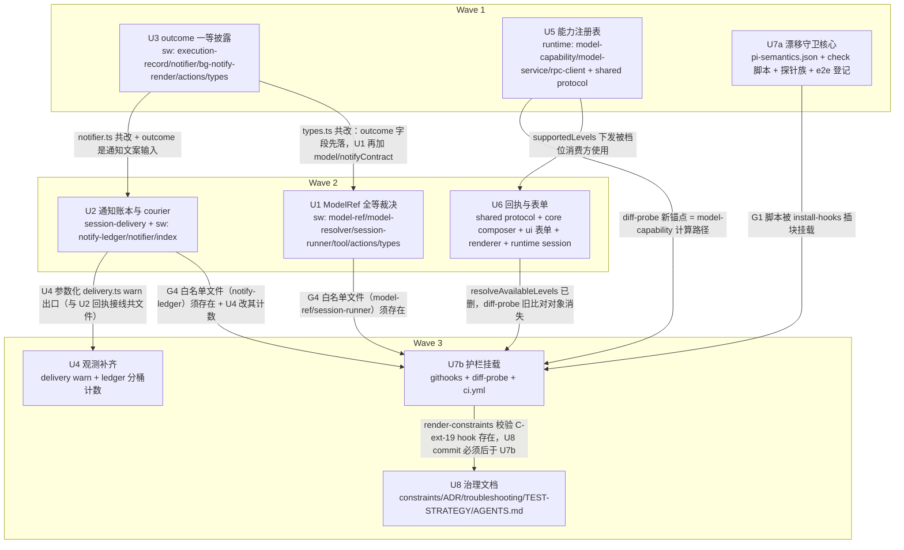

# pi 边界可靠性（双切片）实施计划

基线: 448438847ab30b4d3e17a44ac2f576990312af86 | 来源设计: docs/design/pi-boundary-reliability.md（程序层 + 切片 2）+ docs/design/subagent-dispatch-reliability.md（切片 1） | 日期: 2026-08-28

> 范围决策：两切片一次做完（用户 2026-08-28 拍板）。切片 1 的 U1-U4 与切片 2 的 U5-U8 合并为一张 DAG；U7 按护栏挂载时序拆为 U7a（守卫核心）/ U7b（挂载接线）。共 9 单元、3 波次。

## 0 章节映射

所有 subagent task 的坐标唯一来源，禁止自猜编号。

| 内容 | pi-boundary-reliability.md | subagent-dispatch-reliability.md |
|------|---------------------------|----------------------------------|
| 背景/目标 | §1 背景目标（SCQA / 问题类四判据 / G4-G5 / Scope） | §1 背景目标（SCQA / 系统是什么 / G1-G3 / Scope） |
| 终态/机制 | §3 解决方案（3.1 终态 / 3.2 方案对比 / 3.3 D1-D9） | §3 解决方案（3.1 终态 / 3.2 三域对比 / 3.3 D1-D6） |
| 验收场景表 | §4 验收（P-S1~P-S5 + 回归底线） | §4 验收（S1-S5 + 回归底线） |
| 下一层拆分 | §5 下一层拆分（U5-U8 表 + 文件改动地图） | §5 下一层拆分（U1-U4 表 + 文件地图） |
| 待验证检查点 | §5 末尾（P-C1 / P-D1 / P-D2）+ 附录 C.4（30s 轮询删除） | §5 末尾（P-A1 / P-A2 / P-B1~P-B4） |
| 事故证据 | §2（事故 B 三层根因 + 数据流图） | §2（事故 A 三层根因 + 两条链路数据流图） |

审查记录：pi-boundary-reliability.review.md（3 must-fix + 8 suggestions，全部落盘修订，must_fix==0）；subagent-dispatch-reliability.review.md（4 must-fix + 5 suggestions，全部落盘修订，must_fix==0）。D9 增补（2026-08-28）为删减性质未单走审查，已在源设计头部声明。

## 1 目标快照（逐字摘录）

**程序层一句话结论**（pi-boundary §开篇）：「xyz-agent 与 pi 之间缺少一层「语义吸收层」……本设计从终态倒推四支柱（能力注册表 / 生效回执 / 确认式送达 / 漂移守卫）+ 一套硬校验护栏与治理更新，把「同类问题」从靠人肉排查变成 CI/pre-commit 红灯。」

**切片 1 一句话结论**（subagent-dispatch §开篇）：「模型身份只接受 registry 全等精确匹配并在工具调用同步期完成裁决（模糊匹配只用于报错中的纠错建议，绝不参与采纳）、通知升级为「持久账本 + turn 边界投递」的确认式同步、outcome 提升为一等字段并收敛三处发散派生。」

**Out-of-scope**（两文档合并，逐字）：
- pi 上游（MANDATORY 不改、不提 PR、不 fork）
- renderer 模型清单数据源重构（注册表只做能力标注与对账）
- GUI 模型管理面之外的 pi 能力面（bash/compact 等）注册表化
- renderer subagent pane 消费 outcome 字段的 UI 升级（只保证向后兼容输出）
- chatMode 对话式子 agent 轮次通知协议形状（本轮仅 dedupe key 平移）
- 20+ 处既有轮询定时器全面整改（已由 D9 处置完毕）
- scheduler 触发注入账本化迁移（附录 B 待办，后续切片）

## 2 单元列表

> 领地经 explorer 实读核对（2026-08-28）；设计文档锚点漂移已在领地中按代码现状修正，偏差登记见 §5。共改文件的原则：领地列即 git add 白名单，越界即停。

| Unit | 职责 | 领地（精确文件路径） | 依赖 | 隔离 | 验收条款 |
|------|------|----------------------|------|------|----------|
| **U3** outcome 一等披露 | ExecutionRecord 增 outcome 字段并在 completeRecord 唯一写入点计算；project/list/bgResponse/notify 文案/渲染器全部切读 outcome；删三处同构 switch | sw/src/execution/execution-record.ts（:701 completeRecord）；sw/src/execution/notifier.ts；sw/src/interface/bg-notify-render.ts；sw/src/interface/subagent-actions.ts（:462 recordToListItem list 投影）；sw/src/execution/types.ts（outcome 类型）；相关测试改锚（deriveClosedDisplayParity 等） | 无 | plain | ① outcome 单测：completed/failed/cancelled 派生（含 parent-shutdown→failed 显式取舍、patchFile 判序保真「failed 优先」）；② sw src 内同构 switch 残留 grep 为 0；③ list/bgResponse JSON 增 outcome 且旧字段保留；④ deriveClosedDisplayParity 改锚后绿；⑤ extensions 三连绿 |
| **U5** 能力注册表 | runtime 新增 model-capability（pi-ai 同源离线计算 + get_available_models 在线对账 + drift 日志）；rpc-client 封装；ProviderInfo.models 增 supportedLevels；pi-ai 依赖 + tsup noExternal | runtime/src/services/model-capability.ts（新增）；runtime/src/services/model-service.ts（:47 挂面）；runtime/src/infra/pi/rpc-client.ts（:579 范式新封装，get_available_models 现零封装）；runtime/package.json；runtime/tsup.config.ts；shared/src/protocol.ts（ProviderInfo.models.supportedLevels）；新增测试 | 无 | plain | ① 离线计算单测：reasoning 缺失/false → ["off"]，正常模型 = pi-ai getSupportedThinkingLevels 同源值；② 对账单测：配置有 pi 无 / reasoning 不一致 / 大小写孪生 → drift 日志；③ runtime typecheck+test 绿 + shared typecheck 绿；④ tsup 构建含 pi-ai 成功（完整打包门在阶段 5 P-C1 收口）；⑤ 缓存键含 pi 版本 + models.json mtime + builtin-providers.json mtime |
| **U7a** 漂移守卫核心 | pi-semantics.json（附录 A 全 16 条）+ check-pi-semantics.mjs（schema/探针存在性/四包版本门禁）+ 探针测试族 + G5 real-pi e2e 登记 | docs/pi-semantics.json（新增）；scripts/check-pi-semantics.mjs（新增）；runtime/src/infra/pi/__tests__/pi-semantics-*.test.ts（新增族）；runtime/src/__tests__/equivalence/thinking-level-effective-e2e.test.ts（新增）；runtime/vitest.config.ts（:22-34 REAL_PI_TESTS 登记） | 无 | plain | ① json 16 条 schema 合法（PS-01~PS-16，probe/observe 分型，verifiedWith=0.84.1）；② 脚本 fixture 自测：schema 错 / 探针文件缺 / 四包版本不一致 → 非零退出且报错含条目 id + 恢复动作；③ 探针族绿（pi dist 可达断言 / 不可达 skip，不进 REAL_PI_TESTS 池）；④ e2e 登记 vitest.config 后 REAL_PI 池清单含它；⑤ runtime test 绿 |
| **U1** ModelRef 全等裁决 | assertCanonicalModelRef 单入口（全等 + 孪生守卫 + 问句式纠错建议）；resolver/spawn 两路径接入；buildSpawnArgs 类型收窄；start 返回 model 全等回显 + notifyContract 契约字段；description 写明大小写敏感 | sw/src/shared/model-ref.ts（新增）；sw/src/execution/model-resolver.ts；sw/src/execution/session-runner.ts（:670 buildSpawnArgs）；sw/src/execution/subprocess-agent-runner.ts；sw/src/interface/subagent-tool.ts（description）；sw/src/interface/subagent-actions.ts（:184 startHandler 回显）；sw/src/execution/types.ts（BgResponse :653 增 model/notifyContract 字段）；新增测试 | U3（types.ts 先落 outcome） | plain | ① 裁决单测族：全等放行 / 非全等同步拒单（问句候选 + 合法串全集 + 继承指引）/ case variant 首位建议 / 孪生守卫拒单（构造孪生 registry 快照，P-A2）/ strip thinking 后缀 / 继承路径 ModelRef 包装；② buildSpawnArgs 签名收窄编译期拒裸串，spawn 值 = `${provider}/${id}`；③ start 返回 model 全等回显 + notifyContract:"ledger+at-least-once"；④ description 含 case-sensitive 规则；⑤ extensions 三连绿 |
| **U2** 通知账本与 courier | notify-ledger 四步生命周期（写账/settled 投递/ack 销账/差集重放 + notifyId 幂等）；courier 单通道化（settled 边沿 + 120s 看门狗，删 steer/nextTurn）；session_start 恢复钩子；session-delivery port.send 回执口径；chatMode dedupe key 平移 | session-delivery/src/types.ts（:59 port.send 回执扩展位，旧调用方兼容）；session-delivery/src/delivery.ts（回执接线）；sw/src/execution/notify-ledger.ts（新增）；sw/src/execution/notifier.ts（四步接线）；sw/src/index.ts（session_start 恢复钩子）；相关测试（G4 字节锁定测试迁移锚点） | U3（outcome 文案输入） | plain | ① 账本单测：写账先于投递 / settled 边沿投递 / ack 后差集为空 / 重放按 notifyId 幂等 / 强杀窗口重复可识别；② courier 单通道：sw src grep 无 deliverAs:"steer"/"nextTurn" 残留（白名单外）；③ 重启恢复测试：session_start 扫账本重放、已销账零重发；④ chatMode round dedupe key `${id}:${round}` 平移且字节锁定测试新锚绿；⑤ session-delivery 测试 + extensions 三连绿 |
| **U6** 回执与表单 | protocol setThinkingLevel reply 修型 + 改状态 RPC 普查补回执；useModel 弃乐观写；删 resolveAvailableLevels（含内部消费连带）；档位切 supportedLevels；ModelListSection reasoning 开关；debug 链路日志；删 thinkingLevel 30s 轮询 | shared/src/protocol.ts（:1681 ReplyPayloadMap；普查实际命令名按代码现状：model.switch :1657、plugin 通道 :1554-1563）；core/src/domain/composer/thinking-levels.ts（删 resolveAvailableLevels + 连带 highestAvailableLevel:159 / isSameThinkingScheme:180-181 内部消费改造，其余导出保留）；core/src/domain/composer/model-thinking.ts（:144-152 切 supportedLevels）；core/src/domain/settings/use-provider-edit.ts（:546-561 addModel reasoning）；ui/src/features/settings/common/ModelListSection.vue（reasoning 开关）；renderer/src/composables/features/model/useModel.ts（:69 弃乐观写）；renderer/src/components/panel/ThinkingLevelPopover.vue（:102 切 supportedLevels）；runtime/src/services/session/session-service.ts（:624-645 链路补 debug 日志）；runtime/src/services/session/replicated-states.config.ts（删 :59 THINKING_LEVEL_POLL_INTERVAL_MS + :123 引用）；测试改锚（core/renderer thinking-levels 测试 + 新回执测试） | U5（supportedLevels 下发） | plain | ① protocol 修型：setThinkingLevel reply = {sessionId, level}；普查 model.switch/plugin 通道同口径（发现 reply 为 void 的改状态命令一律补生效值）；② useModel 消费回执、无乐观写（测试断言）；③ resolveAvailableLevels 全仓引用为 0（shim panel/thinking-levels.ts:23 re-export 自动收窄，thinking-level-sync/Popover 不动）；④ 表单：选非 all-levels 策略 → reasoning 自动 true，显式可关；⑤ 顺序硬约束：回执链路测试绿之后才删 30s 轮询，删后再跑五包全量；⑥ shared/core/ui/renderer/runtime typecheck+test 绿 |
| **U7b** 护栏挂载 | check_subagent_channels.py（G4 禁则 + 白名单）；install-hooks.sh 插块（G1/G3/G4，i18n 段后）+ 重部署；diff-probe 改目标（registry vs pi-ai 同源）；CI invariants 挂步 | .githooks/check_subagent_channels.py（新增）；.githooks/install-hooks.sh（:1021↔:1023 之间插块）；scripts/diff-probe-thinking.mjs（改比对对象：model-capability 计算路径 vs pi-ai 同源函数）；.github/workflows/ci.yml（invariants job 挂步） | U1+U2（白名单文件存在）+ U5+U6（diff-probe 锚点切换）+ U7a（G1 脚本） | plain | ① 检查器自测：白名单外 staged `deliverAs:"steer"` / `"--model"` 字面量 → exit 2 红且报错指白名单与约束 id；白名单内（model-ref.ts/session-runner.ts/notify-ledger.ts）→ 过；② install-hooks 插块后 `pnpm prepare` 重部署成功且新 hook 真实触发；③ diff-probe 新目标可跑（node scripts/diff-probe-thinking.mjs exit 0）；④ ci.yml invariants 挂步语法有效（actionlint 或等效） |
| **U4** 观测补齐 | delivery warn 出口参数化接 extensionLogger（落盘 <dataDir>/logs/）；ledger 投递计数按丢失路径分桶暴露 eventLog | session-delivery/src/delivery.ts（:394-397 warn 出口参数化）；sw/src/execution/notify-ledger.ts（分桶计数：settle rejected / 销账超时 / 重放次数）；sw/src/index.ts（eventLog 暴露，如需） | U2（ledger 存在） | plain | ① warn 不再走 console.warn，经 extensionLogger 落盘可查；② 三桶计数在 eventLog 可观测；③ 日志样例人工核对一条完整链路；④ session-delivery 测试 + extensions 三连绿 |
| **U8** 治理文档 | constraints 四条登记 + C-build-01 scope 修正 + render 重生成；ADR-0064；troubleshooting 观察项 PS 互链 + 2 条新规则；extension-conventions 两节；TEST-STRATEGY 三处；术语 4 条；AGENTS.md 索引行；feature-map 条目 | docs/constraints.json（+ 重生成 constraints.md）；docs/adr/0064-pi-semantic-absorption-layer.md（新增）；docs/troubleshooting.md；docs/extensions/extension-conventions.md；TEST-STRATEGY.md；docs/architecture/context.md；docs/extensions/glossary.md；docs/extensions/logging-conventions.md；AGENTS.md；docs/feature-map/（新条目） | U7b 先 commit（render-constraints 存在性校验 C-ext-19 hook）+ U5/U6/U7a 产物存在 | plain | ① 四条新约束（C-pi-12/C-pi-13/C-ext-19/C-proc-08）登记且 `node scripts/render-constraints.mjs` 重生成后 `select-constraints --check` PASS；② C-build-01 scope 改三精确路径全列；③ ADR-0064 按 ADR-0063 模板（H1 + 状态/日期/关联 + 背景 + 决策条）；④ troubleshooting 观察项 5 条加 PS 编号互链 + 新增观察项（PS-01/02/03/05/06/07/09）+ 历史排查规则 2 条（gc 判读 / 大小写 429）；⑤ extension-conventions「模型引用解析 [MANDATORY]」节 + 「可靠性分级」段；⑥ TEST-STRATEGY 回归基线行 + G5 归属 + `[from: pi-boundary-reliability]` topic 段 |

> sw = extensions/universal/subagent-workflow。U1 领地含 types.ts 的 BgResponse 全部新增字段（model + notifyContract）与 subagent-actions.ts 的 startHandler 回显填充——notifyContract 值虽是 U2 契约的一部分，但字段与填充属 start 返回值构造（与 model 回显同构），归 U1 避免与 U2 同波共改 types.ts/actions.ts。

## 3 DAG 图

波次推进规则：整波 committed 才开下一波；同波内单元领地互斥（已逐对核验）；U7b 与 U8 同波但 commit 顺序强制 U7b 先。

## 4 测试策略

命令均从 package.json scripts 实读（2026-08-28）。

**增量（单元开发期内，按单元领地选组）**：

| 单元 | 命令 |
|------|------|
| U1/U2/U3/U4（sw + session-delivery） | `pnpm extensions:typecheck && pnpm extensions:lint && pnpm extensions:test` +（U2/U4）session-delivery 包自身 test |
| U5/U7a | `cd packages/runtime && pnpm typecheck && pnpm test` + `cd packages/shared && pnpm typecheck` |
| U6 | shared / core / ui / renderer / runtime 五包各自 `pnpm typecheck && pnpm test`（renderer 另跑 typecheck:test） |
| U7b | 检查器自测脚本 + `pnpm prepare` 重部署验证 + ci.yml 语法检查 |

**全量（阶段 5 收尾，MANDATORY）**：
1. 根 `pnpm extensions:typecheck && pnpm extensions:lint && pnpm extensions:test`
2. 全部 packages（shared/core/ui/renderer/runtime）+ apps 若有 test script：各自 `pnpm test`
3. real-pi 池：凭证机（REAL_PI_READY）跑 vitest real-pi 分池（含 G5 e2e）
4. 打包三阶段（preflight → build → postbuild）+ `bash scripts/validate-runtime-bundle.sh`（P-C1 在此收口：bundle 增量 < 100KB + 四包版本一致断言）
5. 验收场景表逐行签收（P-S1~P-S5、S1-S5，见两设计文档 §4）

## 5 合理偏差登记表

初始预登记（explorer 实读发现的文档-代码漂移，均为「按代码现状执行」的合理偏差；doc_error 在阶段 3 一致性审查后统一回写设计文档）：

| # | 描述 | 处置 |
|---|------|------|
| R1 | 设计文档 D3④「setModel/cycleModel」在代码中不存在；实际命令为 `model.switch`（protocol.ts:439/:1657），无 cycleModel | U6 普查按 model.switch + plugin 通道（:1554-1563）执行 |
| R2 | 设计文档引用 `transport/handlers/settings-message-handler.ts` 实际在 `transport/settings-message-handler.ts`（:396-402 回传 effective 已实装）；`plugin-rpc-setup.ts` 在 `services/plugin-service/` 下 | U6 task 坐标按实际路径 |
| R3 | BgResponse（execution/types.ts:653）现状仅 status/mode/message；model 回显与 notifyContract 均为新增字段而非改字段 | U1 按新增处理 |
| R4 | resolveAvailableLevels 在 thinking-levels.ts 内部有 2 个间接消费（highestAvailableLevel:159 / isSameThinkingScheme:180-181），设计 D3③ 未列举 | U6 删除时连带改造（保持两函数行为：以 supportedLevels 或入参档位集为源） |
| R5 | U3：outcome 持久化（record-entry.ts）在领地外，存量/磁盘重建 record 无 outcome 字段 | projectOutcome 对无字段记录经同一权威函数 deriveOutcome 兜底（语义与旧三处同构 switch 等价，收敛目标不变） |
| R6 | U3：bgResponse.outcome 在 start 时点恒 undefined（终态实值经 list items[].outcome 披露） | 契约完备位落地，S5 判读走 list/通知两通路 |
| R7 | U3：设计 D6「finalizer 同处注释」的 finalizer（finalize-record.ts）在领地外 | 保真注释改固化在 deriveOutcome 与 buildLlmContent 两消费点 + 专门单测锚定 |
| R8 | U5：ProviderInfo 实际定义在 shared/src/provider.ts（非 protocol.ts，后者仅 import） | 字段加在 provider.ts，同一处字段变更 |
| R9 | U5：三处接线点领地外停手（message-broker 下发标注 / session 附着对账 / drift 广播） | 前者补 U5b 微单元；后两者归 U6 领地内承接（session-service/protocol） |
| R10 | U7a：探针族按 dist 锚点源文件分 6 文件（非每条一文件）；e2e 增加 PI_CODING_AGENT_DIR 隔离与冷启动余量 15s | 每条 PS 仍有独立 it 级断言；设计未明文的实现决策 |
| R11 | U1：RunContext 类型定义在 execution/engine/port.ts（领地外），modelRef 接入落 SAR 构造 runCtx 前的孪生守卫 + model-resolver ctxModel 分支同一守卫 | 两处共用 modelRefFromVerified，chat/workflow 两域继承路径全覆盖 |
| R12 | U1：THINKING_ORDER SSOT 迁至 shared/model-ref.ts（strip 后缀需要），model-resolver re-export 保持旧 import 路径 | 避免 shared→execution 反向依赖 |
| R13 | U1：领地外涟漪 chat-engine-routing.test.ts mock 同源化（1 处，find 特判与 getAvailable 空数组不符真实 registry 契约） | 裁决单入口以 getAvailable 为孪生复扫面，mock 失真必挂，同源化必要 |
| R14 | U2：ledger host 由 index.ts 模块级 bindNotifyLedgerHost 装配（notifier 创建点在领地外 subagent-service.ts） | 未 bind 时 notifier 完整退回内核路径，项目既有模块级注入惯例 |
| R15 | U2：notifyId 载体 = details 而非正文（D4 字面与 G4 字节锁定冲突，取后者） | 重复条目对 LLM 由同 id 同文案可识别，对系统由 details.notifyId 精确匹配 |
| R16 | U2：ledger 投递不经 delivery 内核（合并语义兑现：同款 join/batch details；时机收敛 settled 边沿/看门狗）；内核路径原样保留 | 内核 60s 滑窗与零宽容 busy 投递语义冲突 |
| R17 | 环境事实：background subagent 的 PI_SUBAGENT_* env 会污染 sw 依赖干净 env 的既有测试（此前各单元报告的 4 个 pre-existing 失败真根因） | 主 agent bash 无此变量复跑即绿；后续 subagent 跑 sw 测试须 env -u PI_SUBAGENT_* |
| R18 | U6：链路必要连带超出领地清单（composer-shell/Composer.vue/session.ts/runtime index/agent-api/i18n/plugin-types/interfaces/4 个 contract 测试）；主 agent 核验修复 2 处（model-service switchModel return-await dead-code bug、session-service.test 旧锚） | 连带均为类型/接线必要面，已随 bd01aa375 提交 |
| R19 | U7b：测试文件结构性排除（__tests__/*.test.ts）而非行级豁免 | install-hooks.sh EXTENSION_FILES 既有排除先例；行级豁免保留给源文件 |
| R20 | U7b：argv-mirror.ts 纳入 --model 文件级白名单（argv flag 解析模块，非模型身份构造） | 白名单处带职责定性注释 |
| R21 | U7b：CI 只挂 G1+G4（G3 仅 pre-commit 触发） | 审查判 unreasonable（设计 D7-G3 明文 CI 同步）——已在修复批次 A 补 G3 CI 步 |
| R22 | U7b：G3 触发用 basename 匹配 | 覆盖 core 源文件与 renderer shim 两位置，误触发无害 |
| R23 | U7b：diff-probe 用 --experimental-transform-types 自重 exec + registerHooks .js→.ts 回退 | 源文件零改动，调用方统一 node scripts/diff-probe-thinking.mjs |
| R24 | U4：warn 注入类型挂 delivery.ts 内交叉类型（DeliveryConfigWithWarn）而非 types.ts | 领地纪律；正式化并入 DeliveryConfig 留待后续 |
| R25 | U4：rejection 桶锚 ledger 受理失败分支（非内核 onSettled） | ledger 主路径不走 handle.send，内核 settle rejected 不发生 |
| R26 | U4：暴露通道用 extensionLogger + deliveryMetrics() API（非 per-record eventLog） | session 级指标挂 per-record eventLog 语义错位；设计已同步措辞 |
| R27 | U8：PS 互链映射按附录 A 权威（#4→PS-12）；PS-11 无对应既有项并入新规则② | task 描述与附录 A 不一致时按附录 A |
| R28 | U8：scheduler 无 g4-allow（实证，不在扫描面）而带豁免的是 workflow 完成通知 helpers.ts 两处 | C-ext-19 登记文本按实证写；附录 B 已补 workflow 通知待办 |

## 6 状态表

| Unit | 状态 | 轮次 | 证据指针 |
|------|------|------|----------|
| U3 | committed | 1 | 62506f39b（11 文件，sw 2865 passed；偏差 R5/R6/R7 见 §5） |
| U5 | committed | 1 | 545879857（8 文件，22/22 用例，type_leak exit 0，pi-ai 内联 ~700B；接线停手三处 → U5b/U6 承接） |
| U7a | committed | 1 | 6257a871d（16 条 registry + 探针 30 绿 + check exit 0 + e2e 登记；handoff mock 预存缺口另修 8b1bd8fb4） |
| U1 | committed | 1 | b06743f06（15 文件；sw 2926 passed 零回归；P-A2 双路径实测；偏差 R11-R13） |
| U2 | committed | 1 | 78c3cf605（10 文件；ledger 20 + delivery 67 + 三连全绿；偏差 R14-R16；PI_SUBAGENT_* env 污染发现见 R17） |
| U6 | committed | 1 | bd01aa375（40 文件；五包全绿：shared 200/core 1261/ui 546/renderer 3555/runtime 主池 3936；核验修复 2 处：model-service dead-code bug、session-service 旧锚；偏差 R18） |
| U7b | committed | 1 | 861b11c06（护栏 G1/G3/G4 挂载 + 检查器 + diff-probe 改目标 1226 models 0 mismatches + 4 处 g4-allow 豁免；偏差 R19-R23） |
| U4 | committed | 1 | d6ebb485f（warn 参数化 + 三桶计数；delivery 70/70；偏差 R24-R26） |
| U8 | committed | 1 | 796368fab（80 条约束 + ADR-0064 + 全部治理资产；render/select PASS；偏差 R27-R28） |

波次外增补单元：**U5b provider 下发标注接线**（message-broker.ts:144 + settings-message-handler.ts:66 两处 attachSupportedLevels 接线；U5 停手项，sa-dfec4245 进行中）；handoff-message-bus mock 预存缺口已修（8b1bd8fb4，175074197 漏改）。

## 7 验收记录（阶段 5）

**Gate A 全量（2026-08-28，全部 exit 0）**：extensions:typecheck/lint(0 errors)/test（sw 2932 passed）；shared 20 files；core 90 files；ui 57 files（546 tests）；renderer 346 files（3555 tests，Errors 0）；runtime tsc + 主池 357 files（3939）+ real-pi 池 12 files（38，含 G5 e2e）；P-C1 三断言收口：四包版本一致（check-pi-semantics exit 0）、pi-ai 体积（external require 零残留 + 函数内联，metafile 实测 ~0.7KB << 100KB）、行为等价（diff-probe 1226 models 0 mismatches）；validate-runtime-bundle.sh 全过（含 Plugin E2E A-E + SEC-A1~A5）。修复回流 1 次（d671fc3a9 settings-message-handler 旧 mock）已重跑全绿。

**Gate B 机器侧（2026-08-28，全过）**：P-S3①改 verifiedWith→0.80.3 → exit 1 + 报错含 16 条目 id 与重验命令，恢复后 exit 0；P-S3②篡改两级门控断言（reasoning:false 期望加 high）→ 1 failed 红，恢复后 8/8 绿；P-S4①白名单外 staged `deliverAs:"steer"` → pre-commit exit 1 + 报错指 WHITELIST_* 与 C-ext-19；P-S4②白名单外 staged `"--model"` → exit 1 + 报错指向 model-ref；两者撤销后工作区零残留。S5 的 outcome 投影与 P-S5 的「假模型仅关」已有机器等价证据（list-fields/tool-action 断言 + U5 离线计算 1226 模型 0 mismatches）。

**Gate B GUI 侧（S1-S5/P-S1/P-S2/P-S5）**：用户明示豁免（2026-08-28 验收会话拍板：暂缓、日常自然验证）——机制的构造性正确已由机器侧证据全覆盖（G5 e2e 真实 pi / P-S3、P-S4 演练 / 1226 模型同源比对 / start 同步拒单、账本四步、重启重放的结构性测试）；日常使用中出问题时按 troubleshooting.md 新增排查规则（gc 判读看 outcome / 大小写 429 排查路径）定位。

## 8 残留风险与变更历史
- ✅ P-C1（U5/阶段5）已收口（2026-08-28，证据见 §7 验收记录：四包一致 exit 0 / require 零残留 + 内联 ~0.7KB / diff-probe 1226 models 0 mismatches）；原降级路径（纯在线对账）未启用
- 待裁决（review-fix-loop 2026-08-28 复审新增）：useModel.switchModel 仍乐观写请求值 `${provider}/${modelId}`（api 层 model.switched 回执前端暂无消费方）——与 config.defaults 广播同属 C-pi-13 张力，并入待产品裁决项：裁决「显示态用生效值」则一并改 useModel 消费 reply 拆解值
- 待办（review-fix-loop 复审 S-2）：notify-ledger recoverFromSession 重放前可先对未销账号跑 collectDeliveredNotifyIds 预销账（已存在送达 entry 的条目直接销账不重投）——把「sent 后强杀/fork」窗口的重复注入面收敛到真丢失场景，属优化非正确性，后续迭代做
- review-fix-loop 2026-08-28 复审（r2）结论 approve（must-fix 0）；M-1 已修（pi-semantics PS-17 + notify-ledger 头注 + 设计文档 G2/D4/证据行三处 flush 语义限定）；M-2 证伪（所谓 8 文件未提交与 HEAD 零差异，extensions/ 零未提交）；S-3 已修（provider.ts supportedLevels 注释），S-1/S-2 登记如上；审查产物 ~/.review-fix-loop/.../wf-1787879691064-hi2z4v/batch-1/round-1/reviewer.md
- ⛔ P-A1/P-A2（U1）：ctxModel 继承路径 spawn 全等 / 孪生守卫行为验证（守卫失效 = 阻断合入，无降级）
- ⛔ P-B1~P-B4（U2/阶段5）：courier 全链路时序 / settled 竞态窗口 / 重启重放幂等 / compaction 后 entry 存活；P-B1(b) 晚于阈值时降级为「只记账 + 超时看门狗直达」
- ⛔ P-D1（U7a）：个别 probe 条目降级为「锚点存在性 + 代码形态断言」
- ⛔ P-D2（U5/阶段5）：在线对账触发面（每附着 vs withEphemeralPi）按性能实测定
- D9 增补未单走对抗式审查（源设计已声明：删减性质 + 全证据锚点 + 代码已落地测试绿）
- G4 白名单外存量：现状 notifier 走 steer（U2 合入前），故 U7b 挂载必须在 U2 之后（DAG 已保证）
- 待产品裁决（复审 new_issue）：model-service.ts switchModel 内 config.defaults 广播用请求值而非 effective——与 pi 侧 defaultModel 持久化口径（请求值）自洽，但与 C-pi-13「显示态用生效值」精神有张力；裁决前维持现状（自洽），裁决后若改 effective 需同步评估 landing Composer fallback 语义

**变更历史**：
- 2026-08-28 创建（预检 + explorer 领地核实 + 波次编排）
- 2026-08-28 基线 448438847；Wave 1 committed（U3 62506f39b / U5 545879857 / U7a 6257a871d + handoff mock 8b1bd8fb4）；增补 U5b 微单元；Wave 2 派发（U1/U2/U6 + U5b）；U5b cb582308c / U1 b06743f06 / U2 78c3cf605 committed，U6 进行中
- 2026-08-28 Wave 2 收口：U6 bd01aa375；Wave 3：U7b 861b11c06 / U4 d6ebb485f / U8 796368fab；状态表同步 6f7d6dea0。注：g4-allow 豁免实为 6 处（4 文件，subagents.ts 与 helpers.ts 各占 2）
- 2026-08-28 阶段 3 一致性审查（三区独立 reviewer）：切片 1 approve（3 Minor 代码 + 5 doc_errors）；切片 2 request changes（2 Major：model.switch 假回执 + use-model.test.ts untracked→已补 b80ab882c）；护栏治理 request changes（1 Major：G3 CI 缺失）。修复批次 A（代码 7 项）派发中；doc_errors 由主 agent 亲修（设计文档 5 处 + constraints/ADR cycleModel + 附录 B 补登记 + 附录 A 行号权威声明 + 本表 R18-R28 补登）
- 区间内混入 3 个并行会话 commit（b8eab2077/bd67077ab/8679323d7，认知外，未触碰，审查已排除其路径）
