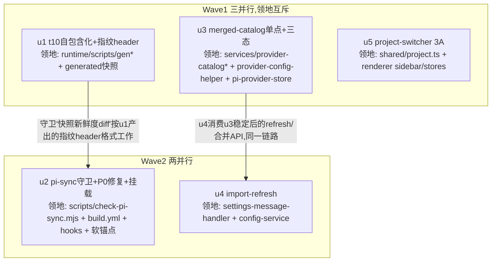

# pi 演进一致性与项目切换 实施计划

基线: d30125d1f | 来源设计: `docs/design/pi-evolution-consistency-and-project-switcher.md`（最新 a1b5da693 + 第 1、2 轮复审修订；对抗式审查累计 4 轮——初版 4 must-fix、增量评估 4 must-adjust、第 1 轮全量复审 1 must-fix + 10 suggestion、第 2 轮验证性复审 2 must-fix + 6 suggestion，全部修复；第 3 轮收敛确认 0 must-fix） | 日期: 2026-08-29

## 0 章节映射

| 内容 | 设计文档实际位置 |
|------|--------------|
| 背景/目标 | §1 背景目标（G1/G2/G3 目标表 + In/Out scope） |
| 终态/机制 | §3 解决方案（3.1 终态 ×3 / 3.2 方案对比 ×3 方向 / 3.3 决策 D1-D9） |
| 验收场景表 | §4 验收（A1-A9） |
| 下一层拆分 | §5 下一层拆分（U0-U4 + 文件改动地图） |
| 待验证检查点 | §5 末「待验证检查点」（4 项） |

单元编号说明：本计划 u1-u5 与设计 §5 的 U0-U4 映射关系——U0+U1 → u2（守卫 + P0 修复）；U2 的 D3 部分（t10 自包含化）→ u1 先行（消解「守卫新鲜度 diff 依赖新指纹格式」的串行依赖）；U2 其余 → u3；U3 → u4；U4 → u5。

## 1 目标快照（逐字摘录设计 §1）

| # | 目标 | 使用者体验表述 |
|---|------|--------------|
| G1 | 构建期派生一致性 | 开发者升级 pi 时改一处版本号，任何派生点漏同步被 CI/提交阶段机器拦截，而不是以「混装安装包」或「红测试」形式在下游暴露 |
| G2 | 运行期目录单真相 | 用户在 UI 看到并选择的任何模型（含 overlay 新模型），在默认模型校验、会话创建、pi 执行三个环节被同等认可；用户显式设置永不被静默改写 |
| G3 | 项目切换体验 | 项目切换 1 步点击完成；排序反映用户拖拽意图且跨重启稳定；徽章数字与点击后实际显示的会话数一致 |

**Out-of-scope（逐字）**：pi 升级自动化（renovate 类 bot、自动 PR）；overlay 浮出「快照外全新 provider」（D6）；问题 2 的真机验收收尾（属已实施 commit 2bcdfb756）；模型列表 UI / Provider 页交互改动。另：不重写任何拉取通道（数据获取 100% 复用 pi 自动刷 + 既有 provider-catalog-refresh.ts，用户已确认）。

## 2 单元列表

| Unit | 职责 | 领地（精确文件路径） | 依赖 | 隔离 | 验收条款 |
|------|------|---------------------|------|------|---------|
| u1 | t10 自包含化：gen 脚本把指纹（providerCount/totalModels）写入快照 header；t10 重写为「快照内容 == header 指纹 + 快照 piAiVersion == node_modules 实装」自洽断言；消除当前红态（D3） | `packages/runtime/scripts/gen-builtin-providers.mjs` `packages/runtime/scripts/__tests__/gen-builtin-providers.test.ts` `packages/runtime/src/generated/builtin-providers.json`（重生成产物） | 无 | plain | ① `cd packages/runtime && npx vitest run scripts/__tests__/gen-builtin-providers.test.ts` 全绿（当前 t10 红→绿） ② 快照 header 含指纹字段且与 providers 实际内容一致 ③ **仓库根目录**执行 `pnpm gen:builtin-providers` 后该 json git diff 为空（幂等） ④ `cd packages/runtime && npx tsc --noEmit` 过 |
| u3 | 合并目录单真相 + 三态：「快照 ⊕ overlay」合并收拢进 provider-catalog 单点（D4）；`getCatalogOverlayModels` 演进为三态 API（D5：新鲜→合并判定 / 过期→快照裁定 / 从未见过→pass-through）；pi-provider-store 的 builtinModelsById 改从合并视图构建 + `findValidDefaultModel` 三态接入 | `packages/runtime/src/services/provider-catalog.ts` `packages/runtime/src/services/provider-catalog-refresh.ts` `packages/runtime/src/services/provider-config-helper.ts` `packages/runtime/src/infra/pi/pi-provider-store.ts` `packages/runtime/src/services/__tests__/`（新测试文件） | 无（建议 u1 后合入，无代码依赖） | plain | ① 新增三态单测全绿（态1 overlay-only 模型合法 / 态2 过期条目快照裁定且允许 auto-fix / 态3 从未见过 pass-through 不改写 settings） ② 既有 `provider-catalog-refresh.test.ts` + `config-service-catalog-overlay.test.ts` 16 用例回归绿 ③ pi-provider-store 相关既有测试回归绿 ④ `npx tsc --noEmit` 过 |
| u5 | ProjectSwitcher 3A：`Project.userOrder?` 字段 + recentProjects 两段式排序 + drop 位置密集重排（D7）；2 列卡片网格重写 + 原生 HTML5 DnD + 方向键复用 reorder（D8）；badge 会话数 computed（规则与 SessionList 提取共享，设计 §3.2 badge 段）；默认项目同卡同权 | `packages/shared/src/project.ts` `packages/renderer/src/stores/project.ts` `packages/renderer/src/components/sidebar/ProjectSwitcher.vue`（重写） `packages/renderer/src/components/sidebar/SessionList.vue`（仅过滤规则换共享函数调用） `packages/renderer/src/utils/` 或 `composables/` 新文件（会话计数共享函数） 条件扩展：`packages/renderer/src/i18n/locales/*/sidebar.ts`（仅需新 key 时）、`packages/renderer/src/__tests__/`（新排序单测） 随单元 git add：`docs/page-design/project-switcher-demo.html`（前会话 untracked 产物，按约定随本单元提交，认知外文件仅 add 不改） | 无 | plain | ① renderer `pnpm test`（新排序单测：两段式/密集重排/默认项目参与/切换不重排有序段）绿 ② `pnpm run lint`（含 taste-lint / vue_rules_checker）过 ③ 组件渲染断言（三视角规范：至少一条用户可见 DOM 断言） ④ 键盘 reorder 通道断言（focus + 方向键交换位置，与拖拽同一 reorder 入口 = A5 键盘复验的开发期前置） ⑤ demo html 一并入库 |
| u2 | pi-sync 守卫：`check-pi-sync.mjs`（设计 §3.2 矩阵 8 项：build.yml env / 脚本默认值 / 快照 piAiVersion / 快照新鲜度 diff / extensions peerDeps / KNOWN_PI_API_TYPES / pi-tui 实装 / dev binary warn 级）+ CI 挂载（ci.yml invariants job，与 check-pi-semantics 同 job 同模式）+ pre-commit 按路径挂载（照 `.githooks/install-hooks.sh:1058-1077` G1 区块同模式）+ build.yml P0 修复（0.84.1→0.84.4）+ 软锚点清理（过期注释/文档版本号） | `scripts/check-pi-sync.mjs`（新） `.github/workflows/ci.yml`（invariants job 挂载） `.github/workflows/build.yml`（PI_VERSION P0 修复） `.githooks/install-hooks.sh`（pre-commit 生成逻辑，挂载实体已探明） `docs/troubleshooting.md`（仅版本锚点行） `extension-dependencies.json`（仅 reason 文本版本号，subagent 先核实纯文本性质） | u1（守卫新鲜度 diff 按新指纹格式） | plain | ① 红→绿闭环：build.yml 修复前首跑 `node scripts/check-pi-sync.mjs` 报不一致非零退出；修复后绿（=验收 A2 实战） ② 逐项负向探测（=验收 A1）：矩阵每行注入一处不一致逐项被报告，fail 级非零退出 / warn 级输出警告 ③ KNOWN_PI_API_TYPES 项若报出 0.84.4 真实漂移 → 随本单元修复常量 ④ pre-commit 挂载后本地 commit 触发守卫（改动锚点文件时） ⑤ 与 check-pi-semantics 逐项零重叠（设计 §2.1 分工声明），不并入 |
| u4 | 导入后触发刷新：`applyImportProviders` 成功路径追加 `refreshProviderCatalogs`（fire-and-forget，D9） | `packages/runtime/src/transport/settings-message-handler.ts` `packages/runtime/src/services/config-service.ts` 对应 `__tests__/` | u3（同一刷新链路，消费其稳定后的 API） | plain | ① 单测：导入成功路径触发 refresh、失败路径不触发 ② 既有导入相关测试回归绿 ③ `npx tsc --noEmit` 过 |

## 3 DAG 图

波次：W1 = u1 ∥ u3 ∥ u5（3 并发）；W2 = u2 ∥ u4（2 并发）。整波绿才开下一波。

## 4 测试策略

**增量（单元开发期内，从子包目录跑）**：
- runtime 单测：`cd packages/runtime && npx vitest run <受影响文件>`
- runtime 类型：`cd packages/runtime && npx tsc --noEmit`
- renderer 单测：`cd packages/renderer && pnpm test`（vitest run，配置在子包；只跑受影响文件时 `npx vitest run <files>`）
- 守卫脚本：`node scripts/check-pi-sync.mjs; echo $?`（exit code 断言）
- pre-commit 每次主 agent commit 时自动全链执行（正面修复原则，禁 --no-verify）

**全量（阶段 5 Gate A，收尾场景）**：
- `cd packages/runtime && npx vitest run`（runtime 全量，含 pi-protocol-contract 真实子进程测试）
- `cd packages/renderer && pnpm test` + `pnpm run lint`
- `node scripts/check-extension-dependencies.mjs`（u2 触碰 extension-dependencies.json）
- extensions 三连不跑（本次不改 extensions 源码）

**真机（阶段 5 Gate B，验收 A3-A9）**：browser-automation 连 dev app（`localhost:1420`，先核端口归属），按设计 §4 场景表逐行签收。

## 5 合理偏差登记表

初始为空。执行中发现的合理不一致（实现现实与设计措辞的良性偏差）登记于此，必要时同步设计文档。

**W1 登记（待一致性审查阶段裁决分类）**：

| # | 单元 | 偏差 | 初判 |
|---|------|------|------|
| 1 | u1 | t10 在 D3 条款外增加第三层断言「磁盘快照 == generateBuiltinProviders() 当前输出」——补齐「提取逻辑变更但版本未变」的检测盲区，无手写数字不脆弱 | 合理 |
| 2 | u3 | 既有 A6 测试第 2 用例断言演进：原「重选 builtin 首个 wasFixed:true」与 D5 态3 pass-through 直接冲突，改为 wasFixed:false 原样返回 | 合理（D5 取代） |
| 3 | u3 | auto-fix 日志 console.log → console.warn（G2/A9 以 warn 可见为通过标准） | 合理 |
| 4 | u3 | builtinModelsById 拆分：校验路径走合并视图，sanitizeInvalidProviders 保留快照索引（更名 snapshotCatalogModelsById）——MF-6 baseUrl 守卫不能吃 overlay 归一化的空 baseUrl，否则误「修复」为「删除」 | 合理（数据安全） |
| 5 | u3 | 三态判定延伸至 findValidDefaultModel 主路径（设计 D5 仅叙述 auth-only 场景）——主路径存在同族失败模式 A（default=builtin + override-only 条目重启被静默改写） | 待审（需确认设计 D5 措辞是否补主路径） |
| 6 | u5 | 旧 project-switcher.test.ts 整体重写（组件从手风琴改常驻网格，旧折叠断言全部作废） | 合理（伴随测试） |
| 7 | u5 | active 配色 demo #3f3f46 → 侧栏既有 bg-surface + text-accent token 范式（lint 禁硬编码，多主题 token 系统无对应色） | 合理 |
| 8 | u5 | tooltip 用原生 title 兜底（设计待验证检查点 3 现场决策：纯 CSS tooltip 在 sidebar 滚动容器有裁剪风险） | 合理 |
| 9 | u5 | 删除入口走右键 ContextMenu → ConfirmDialog（demo 3A 卡片无删除按钮，为不回退既有删除能力） | 合理（保功能） |
| 10 | u5 | 「新建项目出现在网格尾部」（§3.1 终态 3/A5）与 D7 两段式张力：实现按 D7——新建项目置 active + 最新 lastUsedAt，落自动序段首位（有序段之后）而非整网格尾部 | 待审（A5 真机验收措辞需对齐） |

## 6 状态表

| Unit | 状态(pending/in-progress/committed/blocked) | 轮次 | 证据指针 |
|------|--------------------------------------------|------|---------|
| u1 | committed | 1 | ceed4fa12 — t10 红→绿（11 tests），仓库根 regen 幂等验证 |
| u3 | committed | 1 | a139afad0 — 三态单测 18 新增 + services/infra 911 回归绿 |
| u5 | committed | 1 | 8b8c0519c — ordering 16 新增 + sidebar 161 绿，demo html 入库 |
| u2 | pending | 0 | — |
| u4 | pending | 0 | — |

## 7 残留风险与变更历史

**残留风险**：
0. **build.yml 混装风险窗口（已知 trade-off，显式接受）**：P0 修复（build.yml 0.84.4）安排在 W2 的 u2 而非最先——因 A2 验收要求守卫首跑于修复前（红→绿闭环）。窗口期内不打 v* 发布 tag 即无实际损害（CI 混装只影响 release 产物，日常 test job 不消费 binary 版本）；若期间需紧急发版，先手工改 build.yml:47 再继续。
1. ~~pre-commit 实体位置需探明~~ 已探明：挂载逻辑在 tracked 的 `.githooks/install-hooks.sh`（check-pi-semantics G1 区块 `:1058-1077` 为同模式先例），u2 照模式追加，改后需重跑 install-hooks.sh 使本地生效
2. KNOWN_PI_API_TYPES 守卫项可能在 0.84.4 暴露真实常量漂移——报出即修（守卫本职，非偏差）
3. demo 纯 CSS tooltip 在 sidebar 滚动容器内的裁剪——u5 按「portal 或 title 兜底」现场决策（设计待验证检查点 3）
4. pi-ai KnownApi 源码提取的稳定性（设计待验证检查点 1）——u2 实施期验证
5. `findValidDefaultModel` 在 session create 热路径的性能（设计待验证检查点 2）——u3 完成后实测确认无感知劣化
6. 真机验收 A3/A8 依赖 pi.dev 网络；A3 需断网构造——验收期注意环境切换
7. **存量问题（非本计划引入）**：`ProviderPage.vue:301 config.refreshProviderCatalogs is not a function`——commit 2bcdfb756 引入的 overlay 刷新功能在 renderer 全量测试中 settings mock 缺该函数，致 `pnpm test` exit 非零（63 unhandled errors，用例本身 3576 全 passed）。**Gate A 前必须修**（补 mock），不在任何单元领地——W2 后派独立小修任务

**变更历史**：
- 2026-08-29 计划创建。设计 §5 U0-U4 → 本计划 u1-u5 映射（t10 自包含化独立为 u1 先行，消解守卫对指纹格式的依赖；原「U0 先修复 t10 基线数字」被 D3 自包含化取代——避免改数字再重构的重复劳动）。
- 2026-08-29（merge origin/main 75534d044 后修订）：增量对抗评估（4 must-adjust）落地——① 方案 2D（runtime 直读 pi-ai）经裁决**维持 2A 快照方案**（compat 时间炸弹的构建期/运行期失败模式不对称），u1 照做、单元划分与 DAG 不变；② 守卫矩阵 7→8 项（补 pi-tui，check-pi-semantics PI_PKGS 三包缺口的补位）；③ u2 挂载实体已探明（install-hooks.sh:1058-1077 同模式），残留风险 1 消解；④ 与 check-pi-semantics 分工声明写入设计 §2.1（逐项零重叠，独立脚本不并入）。方向③ u5 经评估零影响未改动。
- 2026-08-29（第 1 轮全量复审同步修订）：① u2 领地补 `.github/workflows/ci.yml`（CI 挂载点与设计 D2 裁决对齐：ci.yml invariants job，build.yml 仅 PI_VERSION P0 修复）② 基线行更新 a1b5da693 ③ u1 验收③ 注明仓库根执行 ④ 新增残留风险 0（build.yml 修复推迟至 W2 的混装风险窗口 trade-off 显式声明）。
- 2026-08-29（第 2 轮验证性复审同步修订）：① 验收范围 A1-A8 → A1-A9（§0 映射 / §4 Gate B；设计侧 U2 独立验收补 A9）② U0-U4→u1-u5 映射表述精化（「U2 的 D3 部分 → u1」）③ u5「D9 外」错误编号引用修正 + 验收补键盘 reorder 通道断言（A5 键盘复验的开发期前置）。
- 2026-08-29（W1 完成）：u1 ceed4fa12 / u3 a139afad0 / u5 8b8c0519c 全 committed，核心测试主 agent 复验绿；偏差 10 条登记 §5（2 条待审）；新增残留风险 7（ProviderPage mock 存量问题）。另注：W1 期间用户侧并行 commit f3eb0f243（packages/ui 流式 header，与本计划领地零交集）。
