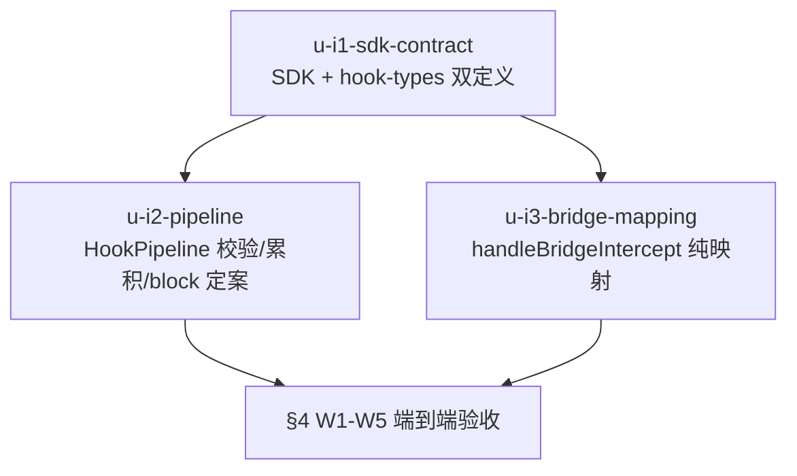

# plugin-intercept-injection 实施计划

基线: 1646a599a | 来源设计: docs/design/plugin-intercept-injection.md | 日期: 2026-09-05

## 0 章节映射

| 内容 | 设计文档实际位置 |
|------|------------------|
| 背景/目标 | §1 背景目标（G1-G4 + In/Out-of-scope） |
| 终态/机制 | §3.1 终态 · §3.3 关键决策 D1-D5 · §3.4 终态数据流 |
| 验收场景表 | §4 验收（W1-W5 行为断言表） |
| 下一层拆分 | §5 下一层拆分（I1/I2/I3 + 待验证检查点） |
| 待验证检查点 | §5 尾「待验证检查点（实施期门）」2 项 |

## 1 目标快照（逐字摘录自设计 §1）

> **一句话结论**：给插件补上「在 agent turn 前向 LLM 上下文注入内容」的端到端契约——SDK 返回 `injectedMessages`，经 hook-pipeline 透传，由 bridge-interop 映射进 intercept 回包，最终以 pi 原生 CustomMessage 进入 LLM 上下文；同时诚实定案 `blocked` 在 pi 链路的语义边界。

- **G1 注入生效**：插件作者在 `onBeforeAgentStart` hook 里返回注入内容后，下一轮 agent 回复可证明内容进入了 LLM 上下文（行为断言，非日志断言）。
- **G2 契约清晰**：注入与改写（`modifiedData`）、阻止（`proceed:false`）三个语义域互不混淆；SDK 类型自解释。
- **G3 失败诚实**：插件返回畸形注入（非字符串/空数组）时有明确的行为（丢弃+留痕，不炸 turn），错误消息指向恢复动作。
- **G4 不倒退**：bridge 通道既有行为零回归（V6 通道级验收过的链路不因生产端接入而变化）。

**Out-of-scope**：`systemPrompt` per-turn 覆盖能力的开通；pi 侧 bridge extension 改动；observe 链路；插件 UI。

## 2 单元列表

| Unit | 职责 | 领地（精确文件路径） | 依赖 | 隔离 | 验收条款 |
|------|------|---------------------|------|------|---------|
| u-i1-sdk-contract | `InterceptorResult.injectedMessages?: string[]` + JSDoc（三分域语义 + D1 契约边界 + block 诚实描述）；`HookResult.injectedMessages?: string[]`——**双定义镜像同批改**：plugin-sdk `types.ts` 与 runtime `plugin-types/hook-types.ts` 两份 | `packages/plugin-sdk/src/types.ts` `packages/runtime/src/services/plugin-service/plugin-types/hook-types.ts` | 无 | plain | 类型编译过；JSDoc 三分域齐备（G2） |
| u-i2-pipeline | HookPipeline.execute **逐插件**形状守卫（非数组整体丢弃 + 非 string 条目丢弃，warn 含 pluginId+序号）+ 累积拼接（与 transformedData 覆盖语义分叉）+ **统一处理序：校验→push→block 判定**（block 插件合法注入进已累积）+ 非 onBeforeAgentStart 误用 warn；单测（校验矩阵含 block×畸形 / block×合法注入 / 累积序 / 覆盖分叉 / block 保留 / 误用 warn） | `packages/runtime/src/services/plugin-service/hook-pipeline.ts` 同目录测试文件 | u-i1 | plain | 单测矩阵全绿；§4 W3（畸形丢弃+留痕不炸 turn） |
| u-i3-bridge-mapping | handleBridgeIntercept **纯映射**（守卫职责已移除——输入恒合法 string[]）：非 blocked 路径 `{injectedMessages:[{content}]}` 组装；**blocked 分支回包 `{blocked:true, reason, injectedMessages:<管线累积>}` 透传**（现状恒空需改）；映射矩阵单测（含 blocked×注入）；bridge-interop.ts:258-260 未定案注释替换为本设计引用 | `packages/runtime/src/services/plugin-service/bridge-interop.ts` 对应测试文件 | u-i1 | plain | 单测矩阵全绿；§4 W4/W5 |

**实施顺序**：u-i1 →（u-i2 ∥ u-i3）。

## 3 DAG 图

## 4 测试策略

- **增量（单元开发期）**：`cd packages/runtime && pnpm test`（vitest run；u-i2/u-i3 新增测试 + 既有 hook-pipeline/bridge-interop 测试不回归）。plugin-sdk 包无 typecheck script，验证用 `cd packages/plugin-sdk && npx tsc --noEmit`（一致性审查 DE1 修正）。
- **阶段收尾**：`pnpm extensions:typecheck && pnpm extensions:lint && pnpm extensions:test`（plugin-bridge 侧契约面）；全量 `pnpm test` 在阶段 5。
- **Gate B（§4 W1-W5）**：真实场景——standalone runtime + 真实 pi 进程 + 测试插件（复用 bridge 验收基建 /tmp/bridge-gate-b2 形态），行为断言非日志断言。

## 5 合理偏差登记表

（初始为空）

## 6 状态表

| Unit | 状态 | 轮次 | 证据指针 |
|------|------|------|---------|
| u-i1-sdk-contract | committed | 1 | Wave1 交付+修复轮（mock.ts 存量类型错修复）；sync-types.sh 再生路径（偏差已登记）；plugin-sdk tsc exit 0 |
| u-i2-pipeline | committed | 1 | 校验矩阵 15 测 + runtime 全量 4320 绿；统一处理序落地（校验→push→block 判定） |
| u-i3-bridge-mapping | committed | 1 | 映射矩阵 7 测 + runtime 全量绿；blocked 回包按 {content} 形态（pi 侧 isInjectedMessage 实装直读核实） |

## 7 残留风险与变更历史

- 预检证据：设计 v4 经 4 轮对抗审查收敛 0 must-fix（`.review/plugin-intercept-injection-design-review-r4.md`：0 MF/1 SG）。
- 跨文档领地：本计划与 rpc-client-early-frame-buffer / timeout 批次无文件交集，可任意并行。
- u-i2 的「逐插件守卫在 I2 管线层（非 I3 聚合层）」是 r2 审查 MF 定案（I3 无 pluginId），实施勿移位。

## 变更历史

- v1（2026-09-05）：初版。用户评审以会话指令「开始规划开发」代替（夜间托管自治态），DAG/单元表随最终汇报呈现。
- （一致性审查 reasonable 确认）①SDK 侧走 sync-types.sh 再生路径达成镜像一致（已同步设计 §5-I1）；②blocked 回包在管线累积为空时不带 injectedMessages 键（桥接层 ?? [] 恒带键，保持既有 block 回包形状 G4）；③warn 形状摘要 80 字符截断 + 循环引用兜底（WARN_SUMMARY_MAX_CHARS 具名）。
