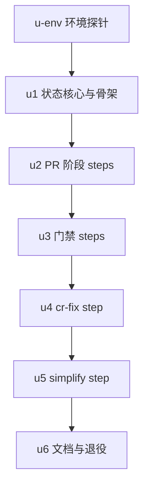

# pr-lifecycle workflow 实施计划

基线: 13ae030af | 来源设计: docs/design/pr-lifecycle-workflow.md | 日期: 2026-09-03

## 0 章节映射

| 内容 | 设计文档实际位置 |
|------|------------------|
| 背景/目标 | §1（1.2 设计目标 G1-G5 / 1.3 In-Out scope） |
| 终态/机制 | §3（3.1 终态 / 3.3 step 注册表 / 3.4 断点恢复 / 3.5 设计要点 / 3.6 决策 D1-D9 / 3.7 错误规格表） |
| 验收场景表 | §4（场景 1-10） |
| 下一层拆分 | §5（7 单元表 + 待验证清单①②③ + 探针 P1-P6） |
| 待验证检查点 | §5 待验证①②③；各 ⛔实施期标记处（P1-P6 探针、D2 降级门） |

对抗式审查证据：3 轮 tech-design-review 收敛（第 1 轮 5 must-fix + 7 suggestion → 第 2 轮 2 + 8 → 第 3 轮 0 must-fix + 4 suggestion + 2 INFO，全部当轮修复），记录在本会话审查报告中，最终态 0 must-fix。

## 1 目标快照（逐字摘录设计 §1.2 / §1.3）

> - G1 **一次调用**：主 agent 发起 run 后只做两件事——等终态通知、拿用户授权后 push。中间不需要逐步编排。
> - G2 **断点恢复**：脚本在任意环节失败/被杀后，主 agent 带 `runId` 重新发起同一个 workflow，已完成的步骤自动跳过，从断点续跑。runId 在脚本启动时创建，主 agent 有可靠通道拿到它（含脚本暴毙、无任何通知的场景）。
> - G3 **双轨收敛**：cr-fix 循环不再维护仓内移植版，复用引擎内置 `review-fix-loop`（pi/zcode 同源）。
> - G4 **code-simplify 纳入**：cr-fix 收敛后自动执行 1 轮 code-simplify（只跑一轮，不循环），产出直接落到 PR diff。
> - G5 **门禁语义不降级**：SKILL.md 现有全部硬门禁（Gate-1a / 1a.5 / 1.5 / 1.6 / 2 / 3a）在脚本内语义等价保留，包括执行顺序（coverage → metrics）与注入值契约。

> **In**：新 workflow 脚本；runId 断点恢复机制；pr-cr-fix SKILL.md 路径 2 重写；旧 `pr-review-fix.js` 退役。
> **Out**：pi 环境路径 1 的改造（预期收益是路径 1/2 可统一为同一脚本，实施期验证后顺手落地，不作为本设计交付承诺）；最终 push（永远留在主 agent + 用户授权）；引擎级原生 checkpoint 能力；merge/release 流程。

## 2 单元列表

| Unit | 职责 | 领地（精确文件路径） | 依赖 | 隔离 | 验收条款 |
|------|------|----------------------|------|------|----------|
| u-env | 前置环境验证与探针：清理 `~/.zcode/cli/config.json` plugins.dirs 残留；确认 zsw 1.2.0 CLI 可用与命令形态；探针 P1（嵌套 review-fix-loop batch1 真实派发，maxRounds=1 + 微型 diff 测试分支 `probe/prl-p1`）/ P2（自定义 runId 透传 $ARGS，/tmp 一次性脚本经绝对路径调用）/ P5（引擎 state 文件 `~/.zcode/zsw/workflow-state/<id>.jsonl` 终态格式，复用 P1/P2 产物）；P3 降为 dry-run 接口确认；P4/P6 降为 u1 实现期断言 + 验收覆盖（理由：探针期空跑全量插桩测试成本畸形）。**P1 fail → 停止，升级用户做 D2 降级决策** | 仓库零改动；探针脚本 /tmp；`~/.zcode/cli/config.json`（移除失效数组项，diff 记入变更历史） | — | plain | P1-P6 结论逐条落盘本计划变更历史；P1 结论明确「通过/触发降级」 |
| u1 | 状态核心与脚本骨架：`@pi-meta` 块 + 参数 schema（§3.5 参数合并语义）；sh() 封装（maxBuffer≥64MB，P4 断言）；state IO（原子写 + result 快照 + steps outputs 契约）；O_EXCL lockfile；resume walker（空转防护）+ 六道守卫（双通道活性 fail-closed / 工作区干净 / HEAD 外部变更 / repo / 分支 / state 存在性）+ skipSteps/allowExternalChanges。纯逻辑抽 `lib.cjs`（依赖注入 runner），测试 `test/run-tests.js` node 直跑 | `.agents/workflows/pr-lifecycle.js`（新建）；`.agents/workflows/pr-lifecycle/lib.cjs` + `.agents/workflows/pr-lifecycle/test/run-tests.js`（新建） | u-env | plain | zsw lint valid；`node test/run-tests.js` 全绿（守卫六条正反路径 / walker done-skipped-failed-pending 语义 / 原子写 / 锁接管 / engineRunId 刷新） |
| u2 | PR 阶段 steps：preflight（含工作区干净）/ static-gate / changeset（条件 step，changesetWarn 落盘）/ pr-meta（schema agent）/ skill-yaml / pr-submit（pr_url 校验）注册进 walker | 同 u1 领地（串行持有） | u1 | plain | lib 单测：mock runner 驱动各 step 成功/失败/重跑路径；条件 step 条件落盘不重算；pr-submit 幂等语义（对齐 P3 dry-run 结论） |
| u3 | 门禁 steps：constraints / coverage-1（--extra-packages 自动追加）/ metrics-1 / final-gates（三道联动 + 注入值 + real-pi 凭证预检与 skip 标记检测 P6 + 收尾工作区防线）+ gate 修复子循环骨架（≤3 轮 + agent 返回后 porcelain 非空即 failed） | 同 u1 领地 | u2 | plain | lib 单测：coverage→metrics 顺序断言；注入值传递断言；子循环 3 轮上限 + 脏工作区即停；real-pi 检测正反路径 |
| u4 | cr-fix step：batch1 组装（默认扫描 review-*.md + 维度裁剪排除表）+ nested `workflow("review-fix-loop",…)` 调用（参数对齐 P1 探针结论）+ terminated 映射（clean/converged 过；结构化失败重试 1 次；stuck/max-rounds/needs-redesign → failed 带 aggregated 路径） | 同 u1 领地 | u3 | plain | lib 单测：七种 terminated 分支全覆盖；重试恰 1 次；error 文案含 aggregated 路径与处置指引 |
| u5 | simplify step：`agents/simplify-apply.md`（覆盖声明 + 引用式摘录锚定源文件节名 + 头部维护义务）+ step 实现（simplifyMode apply/report 两模式；仅 cr-fix clean/converged 执行） | 同 u1 领地 + `.agents/skills/pr-cr-fix/agents/simplify-apply.md`（新建） | u4 | plain | simplify-apply.md 摘录条款逐条可溯源（文件+节名）；lib 单测两模式 + 非 clean 跳过路径 |
| u6 | 文档与退役：SKILL.md 路径 2 重写（单 workflow 调用 + 终态映射 + 3b 恒 --force-with-lease + simplifyMode 披露义务 + skippedSteps 披露）+ 反模式表两条改写 + `pr-review-fix.js` 删除 + code-simplify SKILL.md 上游登记一行 + zsw lint 终检 | `.agents/skills/pr-cr-fix/SKILL.md`（修改）；`.agents/workflows/pr-review-fix.js`（删除）；`~/.agents/skills/code-simplify/SKILL.md`（追加登记行；**执行前核查是否 symlink**——是则改其目标仓库源文件并在汇报中标明） | u5 | plain | grep 确认无 `script:pr-review-fix` 悬空引用；zsw lint valid；SKILL 三路径通读一致（场景 8 静态部分） |

## 3 DAG 图

串行链理由：u1-u5 共享同一脚本文件（领地互斥）；u-env 是 P1 降级门的阻塞前置。不开 worktree（改动全部在 `.agents/`，无构建/测试面交叉）。

## 4 测试策略

- **增量（每单元）**：`node --check .agents/workflows/pr-lifecycle.js`；`node .agents/workflows/pr-lifecycle/test/run-tests.js`（lib 纯函数单测，mock runner 注入，不触真实 git/网络）；zsw 1.2.0 CLI lint（命令形态由 u-env 确认后固化）。
- **全量（收尾，阶段 5）**：`pnpm run lint`（确认 `.agents/` 变更不破坏仓级检查）；本仓无针对 `.agents/` 的既有测试套件（TEST-STRATEGY 不覆盖），端到端真实性由 Gate B 承接。
- **Gate B（阶段 5 双级验收）**：设计 §4 场景 1-10 在真实测试分支执行；场景 1/4 涉及在 `github` remote 建真实 PR——**执行前向用户确认测试 PR 的处置（保留 / 关闭）**；场景 2 的形态参数（kill -9 vs abort）按 u-env 探针②结论定。

## 5 合理偏差登记表

| # | 偏差 | 理由 | 状态 |
|---|------|------|------|
| 1 | 脚本拆为入口 `pr-lifecycle.js` + 纯逻辑库 `pr-lifecycle/lib.cjs`（设计文件地图只列单文件） | 引擎 worker 内联执行入口脚本；纯逻辑入库可被 node 直测（守卫/walker 的单测必要性来自设计 §5 拆分 2「独立可验证」）；`.cjs` 后缀 + 子目录不进 workflow 顶层 `*.js` 扫描 | 待实施验证 |
| 2 | 探针 P3/P4/P6 降级（dry-run / 实现断言 / 代码读+验收覆盖） | 探针期空跑全量插桩测试（P4）与真实 PR 更新（P3 全量）成本高且验收场景 1/4 天然覆盖 | 已确认 |
| 3 | `pr-lifecycle/lib.cjs` 单测用 `node test/run-tests.js` 直跑，偏离仓级「vitest 禁 node:test」红线 | 测试对象是 `.agents/workflows/` 下的独立 .cjs 脚本，不在任何 pnpm 子包内、无 vitest 配置可挂载；运行器为自写 node 断言脚本（非 node:test 框架），mock runner 依赖注入即可覆盖，引入子包 vitest 配置反而扩大变更面 | 已确认 |
| 4 | （预留）u-env 探针发现的引擎契约偏差 | 发现即登记，联动设计文档措辞 | — |

## 6 状态表

| Unit | 状态 | 轮次 | 证据指针 |
|------|------|------|----------|
| u-env | pending | — | — |
| u1 | pending | — | — |
| u2 | pending | — | — |
| u3 | pending | — | — |
| u4 | pending | — | — |
| u5 | pending | — | — |
| u6 | pending | — | — |

## 7 残留风险与变更历史

- **风险**：① 1.2.0 对项目 `.agents/workflows/*.js` 的自动发现未证实——兜底 = SKILL 文档化绝对路径调用（引擎原生支持）；② daemon/CLI 发起与完成通知形态未定——u-env 探针②定案前 u1 不做发起侧假设；③ P1 需真实派发 8 个 review agent（微型 diff + maxRounds=1 控制成本）；④ Gate B 场景 1 建真实 PR 属对外动作，已列入执行前用户确认项。
- **变更历史**：
  - 2026-09-03 初始计划（对齐设计 §5 七单元；P3/P4/P6 降级；lib 拆分登记偏差 1/2）。
