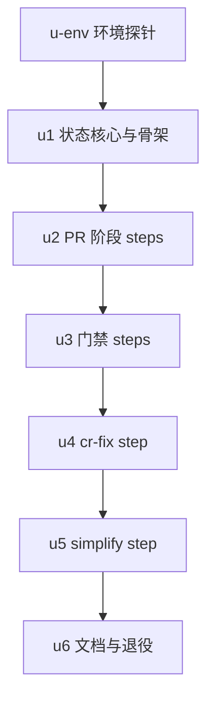

# pr-lifecycle workflow 实施计划

基线: 13ae030af | 来源设计: docs/design/pr-lifecycle-workflow.md | 日期: 2026-09-03

## 0 章节映射

| 内容 | 设计文档实际位置 |
|------|------------------|
| 背景/目标 | §1（1.2 设计目标 G1-G5 / 1.3 In-Out scope） |
| 终态/机制 | §3（3.1 终态 / 3.3 step 注册表 / 3.4 断点恢复 / 3.5 设计要点 / 3.6 决策 D1-D9 / 3.7 错误规格表） |
| 验收场景表 | §4（场景 1-10） |
| 下一层拆分 | §5（7 单元表 + 待验证清单①②③ + 探针 P1-P6） |
| 待验证检查点 | §5 待验证①②③；各 ⛔实施期标记处（P1-P6 探针、D2 降级门） |

对抗式审查证据：3 轮 tech-design-review 收敛（第 1 轮 5 must-fix + 7 suggestion → 第 2 轮 2 + 8 → 第 3 轮 0 must-fix + 4 suggestion + 2 INFO，全部当轮修复），记录在本会话审查报告中，最终态 0 must-fix。

## 1 目标快照（逐字摘录设计 §1.2 / §1.3）

> - G1 **一次调用**：主 agent 发起 run 后只做两件事——等终态通知、拿用户授权后 push。中间不需要逐步编排。
> - G2 **断点恢复**：脚本在任意环节失败/被杀后，主 agent 带 `runId` 重新发起同一个 workflow，已完成的步骤自动跳过，从断点续跑。runId 在脚本启动时创建，主 agent 有可靠通道拿到它（含脚本暴毙、无任何通知的场景）。
> - G3 **双轨收敛**：cr-fix 循环不再维护仓内移植版，复用引擎内置 `review-fix-loop`（pi/zcode 同源）。
> - G4 **code-simplify 纳入**：cr-fix 收敛后自动执行 1 轮 code-simplify（只跑一轮，不循环），产出直接落到 PR diff。
> - G5 **门禁语义不降级**：SKILL.md 现有全部硬门禁（Gate-1a / 1a.5 / 1.5 / 1.6 / 2 / 3a）在脚本内语义等价保留，包括执行顺序（coverage → metrics）与注入值契约。

> **In**：新 workflow 脚本；runId 断点恢复机制；pr-cr-fix SKILL.md 路径 2 重写；旧 `pr-review-fix.js` 退役。
> **Out**：pi 环境路径 1 的改造（预期收益是路径 1/2 可统一为同一脚本，实施期验证后顺手落地，不作为本设计交付承诺）；最终 push（永远留在主 agent + 用户授权）；引擎级原生 checkpoint 能力；merge/release 流程。

## 2 单元列表

| Unit | 职责 | 领地（精确文件路径） | 依赖 | 隔离 | 验收条款 |
|------|------|----------------------|------|------|----------|
| u-env | 前置环境验证与探针：清理 `~/.zcode/cli/config.json` plugins.dirs 残留；确认 zsw 1.2.0 CLI 可用与命令形态；探针 P1（嵌套 review-fix-loop batch1 真实派发，maxRounds=1 + 微型 diff 测试分支 `probe/prl-p1`）/ P2（自定义 runId 透传 $ARGS，/tmp 一次性脚本经绝对路径调用）/ P5（引擎 state 文件 `~/.zcode/zsw/workflow-state/<id>.jsonl` 终态格式，复用 P1/P2 产物）；P3 降为 dry-run 接口确认；P4/P6 降为 u1 实现期断言 + 验收覆盖（理由：探针期空跑全量插桩测试成本畸形）。**P1 fail → 停止，升级用户做 D2 降级决策** | 仓库零改动；探针脚本 /tmp；`~/.zcode/cli/config.json`（移除失效数组项，diff 记入变更历史） | — | plain | P1-P6 结论逐条落盘本计划变更历史；P1 结论明确「通过/触发降级」 |
| u1 | 状态核心与脚本骨架：`@pi-meta` 块 + 参数 schema（§3.5 参数合并语义）；sh() 封装（maxBuffer≥64MB，P4 断言）；state IO（原子写 + result 快照 + steps outputs 契约）；O_EXCL lockfile；resume walker（空转防护）+ 六道守卫（双通道活性 fail-closed / 工作区干净 / HEAD 外部变更 / repo / 分支 / state 存在性）+ skipSteps/allowExternalChanges。纯逻辑抽 `lib.cjs`（依赖注入 runner），测试 `test/run-tests.js` node 直跑 | `.agents/workflows/pr-lifecycle.js`（新建）；`.agents/workflows/pr-lifecycle/lib.cjs` + `.agents/workflows/pr-lifecycle/test/run-tests.js`（新建） | u-env | plain | zsw lint valid；`node test/run-tests.js` 全绿（守卫六条正反路径 / walker done-skipped-failed-pending 语义 / 原子写 / 锁接管 / engineRunId 刷新） |
| u2 | PR 阶段 steps：preflight（含工作区干净）/ static-gate / changeset（条件 step，changesetWarn 落盘）/ pr-meta（schema agent）/ skill-yaml / pr-submit（pr_url 校验）注册进 walker | 同 u1 领地（串行持有） | u1 | plain | lib 单测：mock runner 驱动各 step 成功/失败/重跑路径；条件 step 条件落盘不重算；pr-submit 幂等语义（对齐 P3 dry-run 结论） |
| u3 | 门禁 steps：constraints / coverage-1（--extra-packages 自动追加）/ metrics-1 / final-gates（三道联动 + 注入值 + real-pi 凭证预检与 skip 标记检测 P6 + 收尾工作区防线）+ gate 修复子循环骨架（≤3 轮 + agent 返回后 porcelain 非空即 failed） | 同 u1 领地 | u2 | plain | lib 单测：coverage→metrics 顺序断言；注入值传递断言；子循环 3 轮上限 + 脏工作区即停；real-pi 检测正反路径 |
| u4 | cr-fix step：batch1 组装（默认扫描 review-*.md + 维度裁剪排除表）+ nested `workflow("review-fix-loop",…)` 调用（参数对齐 P1 探针结论）+ terminated 映射（clean/converged 过；结构化失败重试 1 次；stuck/max-rounds/needs-redesign → failed 带 aggregated 路径） | 同 u1 领地 | u3 | plain | lib 单测：八种 terminated 分支全覆盖（另含未知值 fail-closed 分支）；重试恰 1 次；error 文案含 aggregated 路径与处置指引 |
| u5 | simplify step：`agents/simplify-apply.md`（覆盖声明 + 引用式摘录锚定源文件节名 + 头部维护义务）+ step 实现（simplifyMode apply/report 两模式；仅 cr-fix clean/converged 执行） | 同 u1 领地 + `.agents/skills/pr-cr-fix/agents/simplify-apply.md`（新建） | u4 | plain | simplify-apply.md 摘录条款逐条可溯源（文件+节名）；lib 单测两模式 + 非 clean 跳过路径 |
| u6 | 文档与退役：SKILL.md 路径 2 重写（单 workflow 调用 + 终态映射 + 3b 恒 --force-with-lease + simplifyMode 披露义务 + skippedSteps 披露）+ 反模式表两条改写 + `pr-review-fix.js` 删除 + code-simplify SKILL.md 上游登记一行 + zsw lint 终检 | `.agents/skills/pr-cr-fix/SKILL.md`（修改）；`.agents/workflows/pr-review-fix.js`（删除）；`~/.agents/skills/code-simplify/SKILL.md`（追加登记行；**执行前核查是否 symlink**——是则改其目标仓库源文件并在汇报中标明） | u5 | plain | grep 确认无 `script:pr-review-fix` 悬空引用；zsw lint valid；SKILL 三路径通读一致（场景 8 静态部分） |

## 3 DAG 图

串行链理由：u1-u5 共享同一脚本文件（领地互斥）；u-env 是 P1 降级门的阻塞前置。不开 worktree（改动全部在 `.agents/`，无构建/测试面交叉）。

## 4 测试策略

- **增量（每单元）**：`node --check .agents/workflows/pr-lifecycle.js`；`node .agents/workflows/pr-lifecycle/test/run-tests.js`（lib 纯函数单测，mock runner 注入，不触真实 git/网络）；zsw 1.2.0 CLI lint（命令形态由 u-env 确认后固化）。
- **全量（收尾，阶段 5）**：`pnpm run lint`（确认 `.agents/` 变更不破坏仓级检查）；本仓无针对 `.agents/` 的既有测试套件（TEST-STRATEGY 不覆盖），端到端真实性由 Gate B 承接。
- **Gate B（阶段 5 双级验收）**：设计 §4 场景 1-10 在真实测试分支执行；场景 1/4 涉及在 `github` remote 建真实 PR——**执行前向用户确认测试 PR 的处置（保留 / 关闭）**；场景 2 的形态参数（kill -9 vs abort）按 u-env 探针②结论定。

## 5 合理偏差登记表

| # | 偏差 | 理由 | 状态 |
|---|------|------|------|
| 1 | 脚本拆为入口 `pr-lifecycle.js` + 纯逻辑库 `pr-lifecycle/lib.cjs`（设计文件地图只列单文件） | 引擎 worker 内联执行入口脚本；纯逻辑入库可被 node 直测（守卫/walker 的单测必要性来自设计 §5 拆分 2「独立可验证」）；`.cjs` 后缀 + 子目录不进 workflow 顶层 `*.js` 扫描 | 已实施验证 |
| 2 | 探针 P3/P4/P6 降级（dry-run / 实现断言 / 代码读+验收覆盖） | 探针期空跑全量插桩测试（P4）与真实 PR 更新（P3 全量）成本高且验收场景 1/4 天然覆盖 | 已确认 |
| 3 | `pr-lifecycle/lib.cjs` 单测用 `node test/run-tests.js` 直跑，偏离仓级「vitest 禁 node:test」红线 | 测试对象是 `.agents/workflows/` 下的独立 .cjs 脚本，不在任何 pnpm 子包内、无 vitest 配置可挂载；运行器为自写 node 断言脚本（非 node:test 框架），mock runner 依赖注入即可覆盖，引入子包 vitest 配置反而扩大变更面 | 已确认 |
| 4 | （预留）u-env 探针发现的引擎契约偏差 | 发现即登记，联动设计文档措辞 | 见变更历史 2026-09-03 探针结论第 6 条 |
| 5 | `.review/` 自持目录在干净工作区检查中结构性排除（设计假设 `.review/` 已在目标仓 .gitignore） | 冒烟实证：目标仓若无该 gitignore 条目，脚本自建 state 目录会被 porcelain 检出自挡；改为三处统一过滤，语义只强不弱 | 已确认 |
| 6 | 幂等回放前提收紧为 state.status 与 result.status 双 awaiting-push（设计 §3.4-(3)-6 只定义了回放行为） | 防终态组装期崩溃残留的 failed result 快照借 awaiting-push 蒙混回放（恢复指引死循环）——一致性审查轮 1 reasonable，设计措辞已同步 | 已确认 |
| 7 | 空转防护分流先于工作区/HEAD 守卫（全 done 回放仅过 state/repo/分支/活性四守卫） | 回放零 git 副作用、脏工作区不进 commit/push，不要求干净更贴合场景 4「秒级幂等重跑」——一致性审查轮 1 reasonable，设计措辞已同步 | 已确认 |
| 8 | fresh 流程 latest 指针先于 state.json 落盘（设计未规定先后） | state 写盘失败时兜底通道已在位，恢复可靠性只增不减——一致性审查轮 1 reasonable | 已确认 |
| 9 | walker step 协议扩展 `{skipped, reason}` 返回形态 + changeset 防篡改重放只读落盘 outputs | 设计 §3.4-(2)「条件判定落盘、resume 永不重算」的显式化——一致性审查轮 1 reasonable | 已确认 |
| 10 | batch1 维度排除判定归主 agent 发起时决定（设计 §3.5 原写「walker 组装前按 git diff 判定」） | 脚本内不做 diff 语义判断：与 SKILL「默认全集、显式裁剪」现行语义一致，隐式裁剪不可审计；一致性审查轮 1 的裁决 = 改设计归属（登记本行 + 设计措辞已同步）而非补实现 | 已确认 |
| 11 | pr-pre-merge.sh 增加可选 `--base <ref>`（默认 main 向后兼容）；final-gates ③ 传 `--base <base>` | Gate B S1 实证：脚本硬编码 EXPECTED_BASE=main，stacked PR（base≠main）在 ③ 必然 exit 2；设计「gate 脚本零改动」假设被证伪（设计措辞已同步） | 已确认 |
| 12 | aggregatorModel 从硬编码改为透传参数（缺省跟随 run 模型） | Gate B S1 实证：设计原文默认值 `zai-coding-cn/glm-5.3-flash` 在 pi 侧为未知 provider → aggregator-failure×2；8 reviewer 默认模型全成功（设计措辞已同步） | 已确认 |
| 13 | 脚本 meta 增加 `repo` 必传参数；repoRoot 守卫先于任何落盘 | Gate B S1 实证：workdir 是 RUN_ENVELOPE_KEYS 保留键不进 $ARGS，脚本读不到发起方 workdir（设计发起命令已同步为带 --repo） | 已确认 |
| 14 | 活性守卫语义细化：主通道非终态时先 pid 裁决——pid 死 → stale state 接管放行；pid 活 → 拦截 | Gate B S2 实证：CLI 本地 kill -9 后引擎 state 永久 stale 在 running 且 daemon 未运行时 abort 出口 ENOENT 死锁（设计措辞已同步） | 已确认 |

## 6 状态表

| Unit | 状态 | 轮次 | 证据指针 |
|------|------|------|----------|
| u-env | committed | 1 | 变更历史 2026-09-03 探针结论（config 清理 + P1/P2/P3/P5 全过；P4/P6 按偏差 2 顺延）；嵌套 loop 产物 `~/.review-fix-loop/Users-zhushanwen-Code-xyz-agent-workspace-dev-0.9.13/wf-1788373060688-ll4ys7/` |
| u1 | committed | 1 | 38/39 项 lib 测试绿 + lint valid:[] + 真实引擎冒烟（fresh awaiting-push / resume 幂等回放 / engineRunId 刷新）；deviations 5 条见 u1 交付报告（返回 Promise 顶层 return / skipSteps 消费本次参数 / 空注册表直达终态 / agentAdapter 待 u2 联调 / --reviewers 废弃 flag 提示） |
| u2 | committed | 1 | 65 项测试绿（u1 38 回归 + u2 27 新增）+ lint valid + /tmp 仓真实引擎冒烟（假脚本 + 真实 LLM agent，六 step 落盘核验）；deviations 5 条（.review/ 结构性排除 / step skipped 协议 / agent 输出兜底 / 子循环轮次语义 / 真实脚本集成留 Gate B） |
| u3 | committed | 2（限额中断续作） | 80 项测试绿 + lint valid + /tmp 仓真实引擎冒烟正反两跑（real-pi 检测反向 failed 文案实证）；deviations 5 条（anyOf 字符串兼容 / final-gates extra-packages 一致性外推 / coveragePct 加权口径 / extraFixContext 按轮函数 / 入口 io 漏 env-homedir 冒烟修复）；附带实证幂等回放与断点续跑 |
| u4 | committed | 1 | 91 项测试绿（u3 80 回归 + 11 新增，八种 terminated 分支全覆盖 + 未知值 fail-closed）+ lint valid + 真实引擎冒烟 nested loop 全链 clean（真 LLM agent 13s）；deviations 3 条（冒烟超裁剪范围 / aggregatedFile 适配 batch-N/round-M 真实布局 / 未知 terminated fail-closed）；A 项回放语义修复含两处冒烟暴露遗漏（无条件重建 + result.status 回放条件） |
| u5 | committed | 1 | 99 项测试绿（u4 91 回归 + 8 新增）+ lint valid + 真实 agent 冒烟（契约内嵌 → A 档简化应用 + 独立 commit + 报告落盘全链）；simplify-apply.md 七锚点逐一核对源文真实节名；deviations 4 条（模式传参缺陷单测抓获 / 报告存在性追加防线 / mock 基座随 step 演进 / 冒烟用真 agent） |
| u6 | committed（commit 待并行 merge 窗口，见变更历史） | 1 | 路径 2 整节重写（发起/披露义务/终态映射/守卫摘要/G5 四声明）+ 反模式两条改写 + 失败恢复表改指 pr-lifecycle + pr-review-fix.js 删除（package.json 经源码证据保留：根 type:module 下 CJS require 生命线）+ script: 悬空引用清零 + 99 测试绿（u5 时点全集口径）lint valid；上游登记写入 symlink 目标仓 useful-dev-tools（未 commit，留用户） |

## 7 残留风险与变更历史

- **风险**：① ~~1.2.0 对项目 `.agents/workflows/*.js` 的自动发现未证实~~ **已证实为不发现**（scripts 用户面为空）——SKILL 文档化绝对路径调用为主路径（非兜底）；② ~~发起/通知形态未定~~ **已定案**：CLI run 恒本地同步（无后台模式），发起 = CLI + Bash run_in_background 包裹，完成 = 读 CLI 输出/stateFile；③ Gate B 场景 1 建真实 PR 属对外动作，已列入执行前用户确认项（另：当前 dev-0.9.13 分支已存在 PR #196，验收须用独立测试分支）。
- **变更历史**：
  - 2026-09-03 初始计划（对齐设计 §5 七单元；P3/P4/P6 降级；lib 拆分登记偏差 1/2）。
  - 2026-09-03 **u-env 探针结论**：① `~/.zcode/cli/config.json` plugins.dirs 残留项已移除（唯一条目指向已删除的 feat-app-server-refactor worktree，移除后数组为空）。② zsw 1.2.0 CLI 可用：`node <cache>/bin/zsw.js workflow …`；run 恒本地同步、同步面强制 lint；支持 `.js` 绝对路径 / 内置名；废弃 flag 显式报错。③ **P1 通过**：嵌套 `workflow('review-fix-loop', {targetType:'git-diff', target, batch1:<8 个 .md 逗号拼接>, maxRounds, autoCommit, skipCleanAgents})` 真实派发 8 reviewer 并行 + 聚合 + fix，`terminated=max-rounds` 正常返回；嵌套返回 `{content, parsedOutput}`，`parsedOutput` 含 `terminated/batches/totalFixed/runDir/message`；嵌套 run 有独立 engineRunId 与 `~/.review-fix-loop/<slug>/<id>/` 产物目录（待验证③落定）。**D2 降级门不触发**。④ **P2 通过**：CLI 未知 flag 透传 `$ARGS`（`--runId prw-probe-test-1` → `args.runId`）；引擎 runId 注入 `args._runId`；worker 内 `agent()` 可用。⑤ **P3 通过**（dry-run 两跑一致）：已存在 PR 检测 + 仅内容变化时 `gh pr edit` + `pr_url` 解析正常；create 路径留验收场景 1。⑥ **新引擎契约（u1 必遵）**：`@pi-meta` 块缺 `phases` 数组 → `available=false` 拒跑（typecheckMeta 强制）；lint 入口检查要求脚本直接调用 `agent()/parallel()/pipeline()` 至少一处（仅 `workflow()` 不满足）；脚本返回值必须可 structured-clone。⑦ **P5 通过**：引擎 state 文件 `~/.zcode/zsw/workflow-state/<engineRunId>.jsonl`，JSONL 每行 `{v,runId,spec,state,meta}`，活性判定读末行 `state.status`（已实证 `running`/`done`，`reason=completed`）。⑧ P4（maxBuffer）/P6（real-pi skip 标记）按偏差 2 顺延至 u1 实现断言与 Gate B。
  - 2026-09-03 P1 探针 loop 的 fix agent 对本计划的修订（基线 hash 回填 + 偏差 #3 测试运行器说明）随 commit `a9de4b4b4` 入库。
  - 2026-09-03 u1 committed：验收含真实引擎冒烟（主 agent 硬核验复跑）；偏差 1（lib 拆分）状态改「已实施验证」。lint 入口检查被 agentAdapter 内真实 agent() 调用满足，优于计划预期。
  - 2026-09-03 u2 committed（e7091744e）：新增偏差（登记表 #5）——`.review/` 脚本自持目录在 worktreeDirt 检查中结构性排除（不依赖目标仓 gitignore，设计假设在目标仓不成立时防自挡）；walker step 协议扩展 `{skipped, reason}` 返回形态。给 u3 的复用接口：`gateFixLoop` / `MAX_GATE_ROUNDS` / `MSG.gate*` 三档文案。
  - 2026-09-03 u3 执行中断一次（5h 限额），按接替程序续作原 dev 会话收尾；中断期间工作区在途改动经主 agent 核验（80 测试绿）后续作完成。
  - 2026-09-03 u3 committed（8d2cf7276）：constraints / coverage-1（--extra-packages 自动追加）/ metrics-1 / final-gates（三道联动 + real-pi 预检 + 收尾工作区防线）+ gate 修复子循环骨架；80 项测试绿 + lint valid + /tmp 仓真实引擎冒烟正反两跑（real-pi 检测反向 failed 文案实证）；deviations 5 条见 §6 状态表 u3 行；附带实证幂等回放与断点续跑。
  - 2026-09-03 u4 committed（c3d173421）：cr-fix step（batch1 组装 + nested review-fix-loop 调用 + terminated 映射八种 + 未知值 fail-closed + 自动重试恰 1 次）；91 项测试绿（u3 80 回归 + 11 新增）+ lint valid + 真实引擎冒烟 nested loop 全链 clean（真 LLM agent 13s）；deviations 3 条见 §6 状态表 u4 行。
  - 2026-09-03 u5 committed（7ccd482d9）：simplify step（apply/report 两模式 + 非 clean 跳过）+ `agents/simplify-apply.md` 固化契约（覆盖声明 + 引用式摘录，七锚点逐一核对源文真实节名）；99 项测试绿（u4 91 回归 + 8 新增）+ lint valid + 真实 agent 冒烟全链（A 档简化应用 + 独立 commit + 报告落盘）；deviations 4 条见 §6 状态表 u5 行。
  - 2026-09-03 u6 交付期发现工作区出现并行会话的认知外改动（taiji-renderer-optimize skill / .githooks / apps/electron 等，部分已 staged）——主 agent 提交一律 pathspec 精确路径，不触碰并行改动；u6 上游登记落点勘误：~/.agents/skills/code-simplify 实为 symlink（目标 useful-dev-tools/claude-code-tool/skills/code-simplify），登记写入目标仓源文件，该仓改动留用户提交。
  - 2026-09-03 **Gate B 完整验收执行（用户选择完整模式）**：验收 worktree accept-prl-gateb（git-cwt，分支 accept/prl-gateb 基于 dev-0.9.13，合成探针 diff = rename-session slug util + renderer acceptance-probe + workflow 本体）。**10 场景全部 PASS**：S1 端到端 fresh → awaiting-push（**真实 PR #197** accept/prl-gateb→dev-0.9.13，cr-fix round-2 收敛 clean，simplify applied:3/proposals:4 且 B 档探针未动，coverage 增量 100%，final-gates 全绿含 real-pi 实跑，skippedSteps 空）；S2 kill -9 中断恢复全链（latest 兜底 ✓ / state 断点 ✓ / stale-running 接管（发现并修复死锁缺陷，偏差 14）✓ / HEAD 守卫+allowExternalChanges ✓ / cr-fix 重跑 ✓）；S3 失败→修因→resume 链真实显形两次（coverage base 不一致 → --base 修复（偏差 11）；aggregator-failure → 透传修复（偏差 12）；repo 参数缺失 → --repo 修复（偏差 13））；S4 幂等回放 0.589s + 全 done 且 HEAD 外移 fail-fast（含新旧 HEAD 对照与 fresh 命令）；S5/S9 跨 worktree 守卫与隔离（state 按 repo 隔离使守卫 1 先行，指引可操作；dev 仓旧 run 零污染）；S6 simplify 恰 1 轮（state+git log 可证）、3 项 A 档独立 commit（显式路径 add）、B 档顺序 await 未动、报告格式完整；S7 max-rounds 终态 → aggregated.md 真实路径 + 双分支指引 → skipSteps 接管 → awaiting-push + skippedSteps 双条披露；S8 静态部分随 u6 完成（pi 冒烟子项按设计 Out-of-scope 记录）；S10 活性双通道拦截 + fresh 并发防护 0.567s 拦截。**验收期间定向修复 6 个真实集成缺陷**（偏差 11-14 + 入口 TDZ/engineStateDir + resolveZswCli ≥1.2.0 过滤——cache 1.2.0 于 11:21 被外部删除，CLI 入口改用插件 main worktree）；gate 修复子循环在真实链路上自发修复了 --base shift 越界 bug（51d56e152）。测试终态 111 passed（真实用例数；本计划早前记录的「222 passed」为 test runner 尾部两次独立调用 main() 的重复执行假数字 111×2，当轮修复并恢复单次执行形态）/ lint 零 findings。
  - 2026-09-03 阶段 3 一致性审查轮 1（双 reviewer 分区）：脚本区 8 unreasonable（resumeCommand 伪命令 / premerge marker 解析恒失效 / batch1 排除未登记 / findAggregatedFile 字典序 / 恒真断言 / 锁内容断言缺失 / temp 不清理 / 陈旧注释）+ 文档区 1 unreasonable（G5 声明 3 引用错位）+ 3 doc_errors（设计 §3.4-(1) resumeCommand 形态未回写探针②定案——主 agent 已修设计；SKILL constraints 归组笔误 + 失败恢复表 stuck 行缺路径限定——入 dev 修复批）+ 4 reasonable（登记表 #6-#9）。unreasonable 全部入定向修复批，修后定向复审。（本条结论 commit d59ec5c1e 晚于下一条探针期修订 commit a9de4b4b4 约 32 秒，此处按事件序排布）
