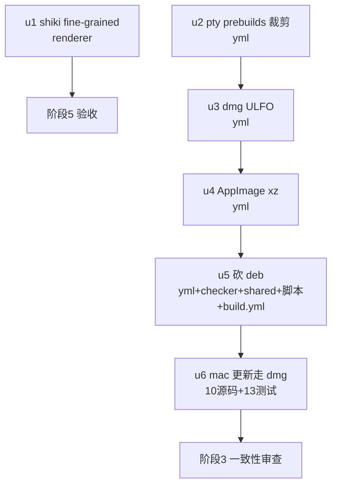

# Release 附件体积优化（第三批） 实施计划

基线: 86f944027 | 来源设计: docs/design/release-artifact-size-optimization-batch3.md | 日期: 2026-09-05
审查报告: docs/design/release-artifact-size-optimization-batch3.review.md（r1 2 must-fix 全修 → r2 0 must-fix，设计就绪）

## 0 章节映射

| 内容 | 设计文档实际位置 |
|------|------------------|
| 背景/目标 | §1 背景与目标（SCQA + In/Out-scope） |
| 终态/机制 | §3 方案（3.1 终态 / 3.2 批 A：shiki+pty / 3.3 批 B：xz+ULFO+砍deb+dmg更新 / 3.4 不做清单） |
| 验收场景表 | §4 验收（S1-S11） |
| 下一层拆分 | §5 下一层拆分（u1-u6 种子表） |
| 待验证检查点 | §5 末尾（①ULFO 收益数字 ②本地 linux AppImage 可行性 ③UpdateError UI 展示形态） |

## 1 目标快照

> 摘录自设计 §1（逐字）：

「**目标：六项改造把发布收敛为 3 附件（dmg / exe / AppImage）+ manifest，总量预期压至 ~200-320MB**（基数含第一二批收益的推算，S6 CI 实证），全程不动功能语义、不动 Electron/pi 本体、不新增依赖包。」

Out-of-scope（不立项）：Electron 本体 / pi binary（上游禁改）；mermaid 按需注册；差分更新；白名单包清理；katex 字体三格式；universal 双架构 / minify。

## 2 单元列表

| Unit | 职责 | 领地（精确文件路径） | 依赖 | 隔离 | 验收条款 |
|------|------|----------------------|------|------|----------|
| u1 | shiki fine-grained：markdown.ts import 区改 `shiki/core` + `createHighlighterCore` + 12 个静态 grammar import（shellscript 覆盖 bash/shell）+ 2 主题 import + 类型 `Highlighter`→`HighlighterCore`；新增/更新单测（13 语言逐个 + alias 断言 + fallback + 双主题） | packages/renderer/src/composables/logic/markdown.ts + packages/renderer/src/__tests__/composables/markdown*.test.ts | 无 | plain | 设计 S1（单测绿）+ S2（build:dir 后语言 chunk ≤14 文件且 ≤1.2MB、死语言 chunk 零命中）+ S3（冒烟，阶段 5 执行） |
| u2 | node-pty prebuilds 平台裁剪：electron-builder.yml 三平台段各加 files 排除（mac: `!node_modules/node-pty/prebuilds/win32-*` + `!node_modules/node-pty/prebuilds/darwin-x64`；win: `!node_modules/node-pty/prebuilds/darwin-*`；linux: darwin-* + win32-*）+ 现场注释 | apps/electron/electron-builder.yml | 无（与 u1 异文件，可并行） | plain | 设计 S4（build:dir 后 mac unpacked prebuilds 仅 darwin-arm64、pty.node/spawn-helper 在位）；S5 冒烟阶段 5 |
| u3 | dmg ULFO：mac 段加 `dmg: format: ULFO` + 注释（含与 `packager.compression: maximum` 的副面警告，引设计 §3.4） | apps/electron/electron-builder.yml | u2（同文件串行） | plain | 设计 S6（本地 `npx electron-builder --mac dmg --publish never`（前置 build:dir 产物）→ `hdiutil imageinfo` Format 含 ULFO + 体积对比记录） |
| u4 | AppImage xz：linux 段加 `appimage: compression: xz` + 注释（含语义锁定：squashfs 内部压缩、非外层归档，引设计 §3.3.1） | apps/electron/electron-builder.yml | u3（同文件串行） | plain | 设计 S7（⛔ 本地 linux AppImage 构建可行性门：mac 上 `npx electron-builder --linux AppImage` 可行则本地断言产物可执行位与体积；不可行则记录降级 S11） |
| u5 | 砍 deb：yml linux.target 删 deb + release-checker.ts ASSET_PATTERNS.linuxX64Deb 删 + packages/shared/src/update.ts linuxX64Deb 字段删 + validate-release.ts:54 key 列表删 + generate-manifest.sh:83-86 正则删 deb + build.yml:292 glob 删 + 相邻注释同步 | apps/electron/electron-builder.yml / apps/electron/main/release-checker.ts / packages/shared/src/update.ts / apps/electron/main/update/validate-release.ts / scripts/generate-manifest.sh / .github/workflows/build.yml | u4（yml 串行；release-checker 与 u6 同文件串行） | plain | main 包单测绿（grep `linuxX64Deb` 全仓清零，测试文件断言同步）+ S11 负向断言（阶段 5） |
| u6 | mac 更新走 dmg：设计 §3.3.3-A 定位链 5 处源码 + shared 类型 + validate-release key + §3.3.3-B updater 脚本 S1 段（TMPDIR mountpoint + hdiutil attach/ditto/detach + 错误信息恢复指引）+ C 删 zip target + build.yml glob/注释 + D 断供错误信息带 release 链接 + 13 个测试文件同步（以 `grep -rl macArm64Zip` 为准） | apps/electron/main/release-checker.ts / apps/electron/main/update/pick-platform-asset.ts / apps/electron/main/update/platform-updater.ts / apps/electron/main/dev/mock-release-checker.ts / packages/shared/src/update.ts / apps/electron/main/update/updater-script.ts / apps/electron/main/update/validate-release.ts / apps/electron/electron-builder.yml / .github/workflows/build.yml / apps/electron/main/update/orchestrator.ts（仅错误信息）+ 13 测试文件 | u5（同文件串行、动面最大风险最后置） | plain | 设计 S8（单测绿：模板命令序列/TMPDIR 独立 mountpoint/detach 失败不阻断/ASSET_PATTERNS dmg 匹配/MacUpdater sha256 来源）；S9/S10 阶段 5（主 agent 执行半真实脚本测试与冒烟） |

无 u-foundation：packages/shared/src/update.ts 虽是共享类型，但 u5（删字段）与 u6（改字段名）是先后串行修改而非多单元同时依赖的新增契约，串行链 u5→u6 已覆盖，无需独立契约单元。

## 3 DAG 图

波次：波1 = u1 ∥ u2（异文件并行）；波2 = u3；波3 = u4；波4 = u5；波5 = u6。串行依据：u2-u6 依次共享 yml / release-checker / shared 类型领地（AGENTS.md 规则 12 逐个 commit 逐个验证）+ u6 动面最大置末。

## 4 测试策略

增量（每单元 committed 前）：

| 命令 | 用途 | 适用单元 |
|------|------|----------|
| `pnpm --filter @xyz-agent/frontend run test` | renderer 单测（markdown 系列 7 文件） | u1 |
| `cd apps/electron && pnpm run build:dir` | mac unpacked 产物断言（chunk/prebuilds） | u1、u2（u1 的 S2 断言共用） |
| `cd apps/electron && npx electron-builder --mac dmg --publish never` + `hdiutil imageinfo <dmg>` | dmg 格式断言（S6） | u3 |
| `cd apps/electron && npx electron-builder --linux AppImage --publish never`（⛔ 可行性门） | AppImage xz 断言（S7） | u4 |
| `cd apps/electron && pnpm run test:main` | main 进程单测（release-checker/update 链） | u5、u6 |
| `grep -rl "macArm64Zip\|linuxX64Deb" --include="*.ts" apps packages` | 字段清零对账 | u5、u6 |

收尾全量：`bash scripts/validate-runtime-bundle.sh` + `bash scripts/preflight-check.sh --ci` + renderer/main 全量单测 + S3/S5/S9/S10 冒烟（主 agent 执行）。S11（CI 端到端 beta）需 push 授权，独立于本流水线。

## 5 合理偏差登记表

| Unit | 偏差 | 理由 | 登记时间 |
|------|------|------|----------|
| u1 | 领地外修改 packages/renderer/src/__tests__/markdown-renderer-incremental.test.ts（mock 契约 'shiki'→'shiki/core' 同步） | markdown.ts import 入口变化的直接下游 mock，不改则该文件 1 用例必红、「单测全绿」验收不可能达成；与 u2-u6 领地零冲突 | 2026-09-05 |
| u1 | SHIKI_LANGS 增加 export（数组值与位置不动） | langs 改收静态 grammar 对象后 SHIKI_LANGS 失去运行时消费者触发 TS6133；export 后由新测试消费，避免测试侧抄第二份清单双源漂移 | 2026-09-05 |
| u1 | 语言 grammar 未按「独立语言 chunk」产出而是内联进共享 vendor chunk | vite manualChunks 的 node_modules→vendor 归并（任务禁改 vite.config.ts）；验收语义全部满足（命中 1≤14 文件、782KB≤1.2MB、死语言零命中），数字优于设计预期 | 2026-09-05 |
| u1 | 新增领地外 packages/renderer/package.json + pnpm-lock.yaml（声明 @shikijs/langs/@shikijs/themes ^4.3.1） | pre-flight 依赖完整性检查拦截：import 未直接声明的传递依赖；lock 已有 4.3.1 解析，不引新版本 | 2026-09-05 |
| u3 | 配置位置实为顶层 dmg: 段（非 mac: 子段，schema 实测拒绝）；收益实测 -1.77% 远低于预期 -10~15% | dmg-builder 直读 packager.config.dmg（dmg.js:19）；收益低因第一二批后 dmg 以 Electron 本体为主（zlib 已压紧）。设计文档已回写（§3.3.2/S11 标准校准） | 2026-09-05 |
| u4 | 配置位置实为顶层 appImage: 段（驼峰，非 linux: 子段，schema 实测拒绝）；收益实测 -27.1% 超预期（-15~20%） | 与 u3 位置修正同型；双构建 gzip 117,491,716 B → xz 85,595,477 B（linux-arm64 本地）。设计文档已回写 | 2026-09-05 |
| u5+u6 | 合并为单个 commit d3385ee92（未按单元拆分） | 应用户要求批量验证加速；两单元在 release-checker/shared/validate-release 等同文件交错改动，hunk 拆分会产生不可独立验证的中间态；commit message 分节保留归因 | 2026-09-05 |
| u5+u6 | 阶段 2 验证合并（test:main 一次 + 双平台构建一次），未逐单元验证 | 应用户要求；规则 12 的「逐个验证」放宽，「逐个 commit」由 u1-u4 保留 | 2026-09-05 |
| u6 | S1 新错误码（dmg mount failed 等）在 renderer LAUNCH_FAILURE_ERROR_KEYS 无映射，走通用降级文案 | renderer 明确禁改（并行领地边界）；无崩溃面；设计待验证检查点③登记的实施期事实 | 2026-09-05 |
| u5+u6 | staged 12 处测试 rmSync 递归删除补 maxRetries/retryDelay（F3 flake 卫生检查拦截） | pre-commit MANDATORY 全部正面修复；多为存量，随本批测试文件 staged 被扫出 | 2026-09-05 |
| u1 | lockfile 携带 jiti peer 重解析 1.21.7→2.7.0 伴生 churn（vite/vitest/eslint dev 工具链面） | pnpm add @shikijs/* 触发的 peer 图重排；两版本仍在 lock、hoisted 单拷贝，无运行时风险（阶段 3 审查核验） | 2026-09-06 |

## 6 状态表

| Unit | 状态 | 轮次 | 证据指针 |
|------|------|------|----------|
| u1 | committed | 1 | ac01fab47（3729 用例 0 失败含 18 新增 fine-grained 用例；vite build 后语言死重 8.1MB→782KB、死语言 chunk 零命中；主 agent build:dir 复核 asar 18M→11.5M） |
| u2 | committed | 1 | db4f42fc7（三平台段排除经 build:dir 产物断言（mac unpacked prebuilds 仅 darwin-arm64）；守卫已固化进 postbuild-validate.sh（本次修复）） |
| u3 | committed | 1 | 643387668（imageinfo Format: ULFO / Ratio 0.42 + 双构建 106M→104M(-1.77%) + 挂载冒烟 ditto exec 位在位；deviation 2 条已登记） |
| u4 | committed | 1 | e94b9e17b（双构建 gzip 112.0MB→xz 81.6MB = -27.1%，两产物 file 断言均 ELF executable；位置修正已回写设计） |
| u5 | committed | 1 | d3385ee92（与 u6 合并 commit，见偏差登记；grep linuxX64Deb 清零 + 双平台构建无 deb 产物） |
| u6 | committed | 1 | d3385ee92（test:main 743 用例 0 失败含 23 个真实 hdiutil/ditto 集成用例；grep macArm64Zip 清零；typecheck 三 tsconfig 过；产物无 zip） |
| 阶段3 审查 | committed | 1 | 双区并行 reviewer：更新链路面 unreasonable 0 / doc_errors 0（12 条 reasonable 全核实）；构建面 1 major（README 指引未收敛）+ 4 minor + 3 doc_errors → 修复批次 04473fb64 + 主 agent 修 doc_errors 82461df06 |
| Gate A | committed | 1 | subagent 实跑：preflight --ci 10/10 exit 0 + validate-runtime-bundle exit 0（Plugin E2E 全 PASS）+ test:main 752 全绿（update 链路 337 用例验证 merge 交叠零失败）+ frontend 3755 全绿（shiki 18 新用例）+ 全量 38/39 包绿；唯一红灯 = extension-protocol tsc 编译 5s 超时（存量负载敏感，基点前文件零改动，有先例 d0f558b16）；lint 3E+2W 全归因存量/merge 带入（rpc-client max-lines 为 fix-zcode 侧 5 commit 增量）；零绕过违规（25 行命中逐条判定合法平台守卫） |
| Gate B | committed | 1 | 主 agent 实跑（HEAD 新鲜产物：build:dir + dmg Format=ULFO 104M）：启动不白屏；S3 bash 2 span + python 18 span（--shiki 双主题）+ mermaid SVG 渲染 ✓；S5 pty `echo PTY_OK_B3` 回显 ✓；S9 真实 ULFO dmg 换装 exit 0 + marker 消失证明真实替换 + 同 inode 双挂载边界 exit 1 且错误信息含恢复指引 ✓；S10 部分——mock 桩被 isDev 双重保护隔离在打包产物外（刻意设计，main.ts:176），断言由 update 链路 337 用例等价覆盖，真机更新链路归 S11 CI |
| S11 CI 端到端 | committed | 1 | 2026-09-06 v0.9.14-beta 实发（run 33978907331，tag bdc7b1c60）：三平台构建 + Create Release 全绿，附件 = dmg/exe/AppImage/manifest **且无 zip/deb**（负向断言语义达成）；实测 dmg 129M / exe 159M / AppImage 117M = **405MB（v0.9.13 1.1GB 的 -63%）**——略超预期区间 200-320MB，主因 exe 仅 -5.5%（NSIS 7z 自身高压缩比稀释 asar 减量，§4.2 的 0.30-0.36 压缩比估算未计该效应）；GitCode 镜像 job 失败（3 大附件 30min 单件超时，深夜跨境 <0.1MB/s）——镜像侧另案（见残留风险） |

## 7 残留风险与变更历史

- 残留风险（S11 已执行，镜像侧未闭环）：GitCode 同步 job 在 405MB 新体积下仍失败——3 大附件 3 路并发 curl PUT 全部 30min 单件超时（2026-09-06 深夜 00:53-01:23 北京，单附件有效吞吐 <0.1MB/s）。结论：runner 直传路线即使配并发优化 + 体积降 63% 仍不可靠，瓶颈在跨境链路不在并发度；候选处置 = 低峰（8-16 点）重 dispatch（幂等补齐）/ 本地中转 sync-from-github（国内上行 5-20MB/s，需 GITCODE_TOKEN 本地 export）/ release.yml 把 gitcode-sync 改 continue-on-error 防止镜像失败否决整 run（本次 verify-ci-release.sh 因 job 失败对完好产物误判 FATAL）。
- 残留风险（与本批零因果，Gate A 核实）：extension-protocol validation.test 的 tsc 编译用例 5s 超时临界（全量负载下 5981ms，间歇性红风险，建议调大 testTimeout）；lint 3E 存量（appserver-launcher 2 / check-core-dist-gate 1）+ rpc-client max-lines warning（fix-zcode merge 侧增量）——需独立任务。
- 残留风险：renderer 对三个新脚本错误码（dmg mount failed 等）走通用降级文案，恢复指引（reboot/hdiutil detach）仅在 update-result.json 与日志可见——renderer 侧接线留待后续（LAUNCH_FAILURE_ERROR_KEYS 映射，实施期检查点③的答案）。
- 2026-09-05 计划创建。设计阶段两轮对抗审查记录见 review 文件；S7 本地 linux AppImage 可行性与 S6 ULFO 收益数字为实施期门（设计 §5 待验证检查点）。
- 2026-09-05 执行波次：u1∥u2 并行（波1）→ u3 → u4（被用户中断后主 agent 收尾产物断言）→ 应用户要求改两路并行（配置面 u5/u6 yml+CI ∥ 代码面 u5/u6 TS+测试，零文件交集）+ 验证合并（test:main 一次 + 双平台构建一次）；u5+u6 合并 commit d3385ee92。
- 2026-09-05 中途事件：另一会话在本地执行 fix-zcode-subagent-failed merge（32 文件冲突），commit/全量测试被阻塞；本会话 8 文件修复备份至 /tmp 后等待，merge 由对侧完成后恢复（修复批次完好，重验后提交 04473fb64）。
- 2026-09-06 Gate A/B 完成（详见状态表）。产物实测：asar 11.5M / dmg ULFO 104M / AppImage xz 较 gzip -27.1%。
