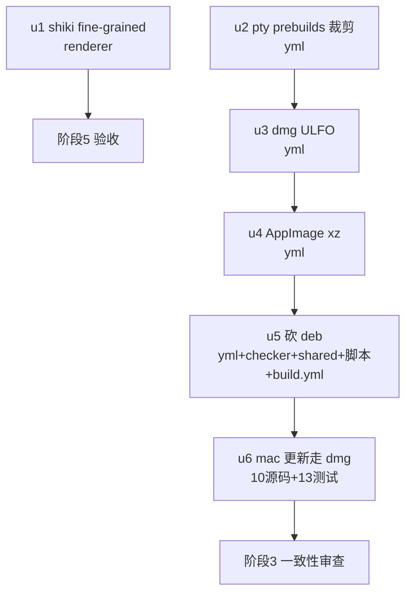

# Release 附件体积优化（第三批） 实施计划

基线: 86f944027 | 来源设计: docs/design/release-artifact-size-optimization-batch3.md | 日期: 2026-09-05
审查报告: docs/design/release-artifact-size-optimization-batch3.review.md（r1 2 must-fix 全修 → r2 0 must-fix，设计就绪）

## 0 章节映射

| 内容 | 设计文档实际位置 |
|------|------------------|
| 背景/目标 | §1 背景与目标（SCQA + In/Out-scope） |
| 终态/机制 | §3 方案（3.1 终态 / 3.2 批 A：shiki+pty / 3.3 批 B：xz+ULFO+砍deb+dmg更新 / 3.4 不做清单） |
| 验收场景表 | §4 验收（S1-S11） |
| 下一层拆分 | §5 下一层拆分（u1-u6 种子表） |
| 待验证检查点 | §5 末尾（①ULFO 收益数字 ②本地 linux AppImage 可行性 ③UpdateError UI 展示形态） |

## 1 目标快照

> 摘录自设计 §1（逐字）：

「**目标：六项改造把发布收敛为 3 附件（dmg / exe / AppImage）+ manifest，总量预期压至 ~200-320MB**（基数含第一二批收益的推算，S6 CI 实证），全程不动功能语义、不动 Electron/pi 本体、不新增依赖包。」

Out-of-scope（不立项）：Electron 本体 / pi binary（上游禁改）；mermaid 按需注册；差分更新；白名单包清理；katex 字体三格式；universal 双架构 / minify。

## 2 单元列表

| Unit | 职责 | 领地（精确文件路径） | 依赖 | 隔离 | 验收条款 |
|------|------|----------------------|------|------|----------|
| u1 | shiki fine-grained：markdown.ts import 区改 `shiki/core` + `createHighlighterCore` + 12 个静态 grammar import（shellscript 覆盖 bash/shell）+ 2 主题 import + 类型 `Highlighter`→`HighlighterCore`；新增/更新单测（13 语言逐个 + alias 断言 + fallback + 双主题） | packages/renderer/src/composables/logic/markdown.ts + packages/renderer/src/__tests__/composables/markdown*.test.ts | 无 | plain | 设计 S1（单测绿）+ S2（build:dir 后语言 chunk ≤14 文件且 ≤1.2MB、死语言 chunk 零命中）+ S3（冒烟，阶段 5 执行） |
| u2 | node-pty prebuilds 平台裁剪：electron-builder.yml 三平台段各加 files 排除（mac: `!node_modules/node-pty/prebuilds/win32-*` + `!node_modules/node-pty/prebuilds/darwin-x64`；win: `!node_modules/node-pty/prebuilds/darwin-*`；linux: darwin-* + win32-*）+ 现场注释 | apps/electron/electron-builder.yml | 无（与 u1 异文件，可并行） | plain | 设计 S4（build:dir 后 mac unpacked prebuilds 仅 darwin-arm64、pty.node/spawn-helper 在位）；S5 冒烟阶段 5 |
| u3 | dmg ULFO：mac 段加 `dmg: format: ULFO` + 注释（含与 `packager.compression: maximum` 的副面警告，引设计 §3.4） | apps/electron/electron-builder.yml | u2（同文件串行） | plain | 设计 S6（本地 `npx electron-builder --mac dmg --publish never`（前置 build:dir 产物）→ `hdiutil imageinfo` Format 含 ULFO + 体积对比记录） |
| u4 | AppImage xz：linux 段加 `appimage: compression: xz` + 注释（含语义锁定：squashfs 内部压缩、非外层归档，引设计 §3.3.1） | apps/electron/electron-builder.yml | u3（同文件串行） | plain | 设计 S7（⛔ 本地 linux AppImage 构建可行性门：mac 上 `npx electron-builder --linux AppImage` 可行则本地断言产物可执行位与体积；不可行则记录降级 S11） |
| u5 | 砍 deb：yml linux.target 删 deb + release-checker.ts ASSET_PATTERNS.linuxX64Deb 删 + packages/shared/src/update.ts linuxX64Deb 字段删 + validate-release.ts:54 key 列表删 + generate-manifest.sh:83-86 正则删 deb + build.yml:292 glob 删 + 相邻注释同步 | apps/electron/electron-builder.yml / apps/electron/main/release-checker.ts / packages/shared/src/update.ts / apps/electron/main/update/validate-release.ts / scripts/generate-manifest.sh / .github/workflows/build.yml | u4（yml 串行；release-checker 与 u6 同文件串行） | plain | main 包单测绿（grep `linuxX64Deb` 全仓清零，测试文件断言同步）+ S11 负向断言（阶段 5） |
| u6 | mac 更新走 dmg：设计 §3.3.3-A 定位链 5 处源码 + shared 类型 + validate-release key + §3.3.3-B updater 脚本 S1 段（TMPDIR mountpoint + hdiutil attach/ditto/detach + 错误信息恢复指引）+ C 删 zip target + build.yml glob/注释 + D 断供错误信息带 release 链接 + 13 个测试文件同步（以 `grep -rl macArm64Zip` 为准） | apps/electron/main/release-checker.ts / apps/electron/main/update/pick-platform-asset.ts / apps/electron/main/update/platform-updater.ts / apps/electron/main/update/dev/mock-release-checker.ts / packages/shared/src/update.ts / apps/electron/main/update/updater-script.ts / apps/electron/main/update/validate-release.ts / apps/electron/electron-builder.yml / .github/workflows/build.yml / apps/electron/main/update/orchestrator.ts（仅错误信息）+ 13 测试文件 | u5（同文件串行、动面最大风险最后置） | plain | 设计 S8（单测绿：模板命令序列/TMPDIR 独立 mountpoint/detach 失败不阻断/ASSET_PATTERNS dmg 匹配/MacUpdater sha256 来源）；S9/S10 阶段 5（主 agent 执行半真实脚本测试与冒烟） |

无 u-foundation：packages/shared/src/update.ts 虽是共享类型，但 u5（删字段）与 u6（改字段名）是先后串行修改而非多单元同时依赖的新增契约，串行链 u5→u6 已覆盖，无需独立契约单元。

## 3 DAG 图

波次：波1 = u1 ∥ u2（异文件并行）；波2 = u3；波3 = u4；波4 = u5；波5 = u6。串行依据：u2-u6 依次共享 yml / release-checker / shared 类型领地（AGENTS.md 规则 12 逐个 commit 逐个验证）+ u6 动面最大置末。

## 4 测试策略

增量（每单元 committed 前）：

| 命令 | 用途 | 适用单元 |
|------|------|----------|
| `pnpm --filter @xyz-agent/frontend run test` | renderer 单测（markdown 系列 7 文件） | u1 |
| `cd apps/electron && pnpm run build:dir` | mac unpacked 产物断言（chunk/prebuilds） | u1、u2（u1 的 S2 断言共用） |
| `cd apps/electron && npx electron-builder --mac dmg --publish never` + `hdiutil imageinfo <dmg>` | dmg 格式断言（S6） | u3 |
| `cd apps/electron && npx electron-builder --linux AppImage --publish never`（⛔ 可行性门） | AppImage xz 断言（S7） | u4 |
| `cd apps/electron && pnpm run test:main` | main 进程单测（release-checker/update 链） | u5、u6 |
| `grep -rl "macArm64Zip\|linuxX64Deb" --include="*.ts" apps packages` | 字段清零对账 | u5、u6 |

收尾全量：`bash scripts/validate-runtime-bundle.sh` + `bash scripts/preflight-check.sh --ci` + renderer/main 全量单测 + S3/S5/S9/S10 冒烟（主 agent 执行）。S11（CI 端到端 beta）需 push 授权，独立于本流水线。

## 5 合理偏差登记表

| Unit | 偏差 | 理由 | 登记时间 |
|------|------|------|----------|

## 6 状态表

| Unit | 状态 | 轮次 | 证据指针 |
|------|------|------|----------|
| u1 | pending | — | — |
| u2 | pending | — | — |
| u3 | pending | — | — |
| u4 | pending | — | — |
| u5 | pending | — | — |
| u6 | pending | — | — |

## 7 残留风险与变更历史

- 2026-09-05 计划创建。设计阶段两轮对抗审查记录见 review 文件；S7 本地 linux AppImage 可行性与 S6 ULFO 收益数字为实施期门（设计 §5 待验证检查点）。
