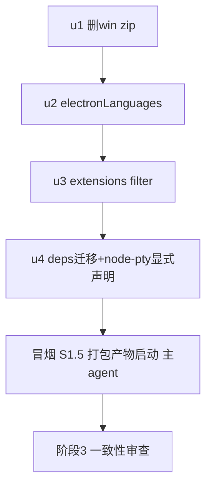

# Release 附件体积优化（第一批+第二批） 实施计划

基线: 45a581c7e | 来源设计: docs/design/release-artifact-size-optimization.md | 日期: 2026-09-05
审查报告: docs/design/release-artifact-size-optimization.review-r1.md（must_fix 结论见 §7）

## 0 章节映射

| 内容 | 设计文档实际位置 |
|------|------------------|
| 背景/目标 | §1 背景/目标 + §2 现状与根因 |
| 终态/机制 | §3 方案（3.1 修正记录 / 3.2 第一批 / 3.3 第二批 / 3.4 不做清单） |
| 验收场景表 | §4 验收（4.1 S1-S6 + 4.2 体积预期） |
| 下一层拆分 | §6 实施拆分（unit 种子表） |
| 待验证检查点 | §4.1 S1（build:dir 产物核对含 node-pty 静态断言）/ S1.5 冒烟 / S2 / S3 |

## 1 目标快照

> 摘录自设计 §1（逐字）：

「目标：把单次发布总量压到约 **420-530MB（-52%~-62%）**，不动功能、不动 Electron/pi 本体。附带收益：GitCode 镜像同步上传时间（跨境 0.4-0.8MB/s）按比例下降。

范围：本文只实施第一批（纯配置）+ 第二批（asar 瘦身）。第三批为产品决策项，只登记不实施（§5）。

Out-of-scope：Electron 本体（icudtl.dat / Framework / SwiftShader）、pi binary（[MANDATORY] 上游禁改）、mac zip→dmg 更新链路改造、砍 deb、ULMO/AppImage xz、差分更新（blockmap/latest.yml）。」

## 2 单元列表

| Unit | 职责 | 领地（精确文件路径） | 依赖 | 隔离 | 验收条款 |
|------|------|----------------------|------|------|----------|
| u1 | 删 win zip target（win.target 只留 nsis） | apps/electron/electron-builder.yml（`win:` 段 target 列表 + 相邻注释） | 无 | plain | diff 核对：win.target 仅剩 nsis；配置解析正确由 u2 的 build:dir 佐证（win zip 删除不影响 mac 产物） |
| u2 | mac/win/linux 三段各加 `electronLanguages: ["en", "zh-CN"]` | apps/electron/electron-builder.yml（`mac:`/`win:`/`linux:` 段各一行） | u1（同文件串行） | plain | 设计 S1：build:dir 成功；.app 内 Electron Framework Resources 仅剩 en.lproj/zh_CN.lproj，其余 lproj 为 0 |
| u3 | extensions filter 加 `!**/*.map`、`!**/README.md`、`!**/ARCHITECTURE.md`（禁通配 `!**/*.md`，保 SKILL.md） | apps/electron/electron-builder.yml（`extraResources` extensions filter 列表） | u2（同文件串行） | plain | 设计 S1：build:dir 后 Resources/extensions 无 *.map、包根无 README.md/ARCHITECTURE.md、skills/*/SKILL.md ≥7 个保留、目录 ≤6.5MB |
| u4 | **新增 node-pty 显式依赖（^1.0.0，对齐 runtime）** + 5 依赖挪 devDependencies（@xyz-agent/frontend、@xyz-agent/runtime、@xyz-agent/shared、undici、compare-versions）+ 重装刷新 lockfile | apps/electron/package.json、pnpm-lock.yaml | u3（打包链路串行，归因清晰） | plain | 设计 S2：validate-runtime-bundle.sh exit 0；S3：preflight-check.sh --ci 过；S1 全部断言（asar ≤25MB + unpacked 存在 node-pty 的 pty.node/spawn-helper）；构建产物对被挪包零 require |

冒烟（S1.5）不属于开发单元：u4 committed 后由主 agent 对 build:dir 产物 .app 真实启动冒烟（`open TaiJi.app --args --remote-debugging-port=9222` + browser-automation：启动/聊天收发/pty 终端/高亮/mermaid；注意打包版 3210 端口冲突）。

无 u-foundation：本批为纯配置/依赖声明改动，无共享契约节点。

## 3 DAG 图

串行依据：AGENTS.md 规则 12「打包子系统改动逐个 commit 逐个验证」+ u1-u3 同文件领地互斥。无并行、无 worktree（改动量小，单 worktree 可回滚）。

## 4 测试策略

增量（每单元 committed 前）：

| 命令 | 用途 | 适用单元 |
|------|------|----------|
| `cd apps/electron && pnpm run build:dir` | mac unpacked 产物核对（lproj/extensions/asar 体积/node-pty 存在性） | u2、u3、u4（u1 借 u2 佐证） |
| `bash scripts/validate-runtime-bundle.sh` | runtime bundle Gate | u4 |
| `bash scripts/preflight-check.sh --ci` | files 白名单/依赖一致性（CI 同款，build.yml:110） | u4 |

收尾全量：`bash scripts/validate-runtime-bundle.sh` + `bash scripts/preflight-check.sh --ci` + S1.5 打包产物启动冒烟（改动不触 src，无单测增量面；extensions/ 与 renderer 源码零改动，extensions 三连不适用）。

S6（CI 端到端发 beta）需 push 授权，独立于本流水线，完成后另行汇报。

## 5 合理偏差登记表

| Unit | 偏差 | 理由 | 登记时间 |
|------|------|------|----------|
| （空） | | | |

## 6 状态表

| Unit | 状态 | 轮次 | 证据指针 |
|------|------|------|----------|
| u1 | committed | 1 | 9b65257ea（diff 静态核验；build:dir 佐证配置解析） |
| u2 | committed | 2 | db9379a7c（r1 轮 zh-CN 连字符 mac 不匹配 zh_CN.lproj，构建断言抓出后 fix 轮改 zh_CN 下划线；重构建断言 en.lproj 560K + zh_CN.lproj 564K 在位） |
| u3 | committed | 1 | 2c5913c8c（build:dir 断言 extensions 15MB→6.2MB、.map/README/ARCHITECTURE 零残留、SKILL.md 7/7 保留） |
| u4 | committed | 1 | 3aa0dae10（preflight --ci 绿 + validate-runtime-bundle 绿 + build:dir 断言 asar 170MB→18MB、unpacked 含 node-pty pty.node/spawn-helper） |
| 冒烟 S1.5 | committed | 1 | 主 agent 执行：隔离 userData+数据目录启动 build:dir 产物（生产实例共存，runtime 自适应 3211 端口未误杀）。GLM-5.3 会话收发（22.1K token）+ shiki python 高亮 + mermaid 流程图渲染 + pty `echo PTY_OK` 回显，全部通过（截图证据 /tmp 已清理，流程见变更历史） |

## 7 残留风险与变更历史

- 残留风险：win 平台的 pdb/locale 收益无法本地实证（mac 交叉打包 win 超出本批验证面），S6 CI 发 beta 时核对 exe 数字；asar 构成（§2）数字来自本机单次构建，CI runner 环境理论上同构（同 lockfile）。
- 变更历史：
  - 2026-09-05 计划创建；u3 领地在派发前经自查修正：filter 用精确文件名排除（README.md/ARCHITECTURE.md）而非 `!**/*.md` 通配——staged extensions 含 7 个 skills/*/SKILL.md 为运行时资源（构建产物实测清单），通配会静默删除内置 skills。
  - 2026-09-05 r1 对抗审查（review-r1.md，must_fix: 2）后修复：①u4 增加 node-pty 显式 dependencies 声明（原方案迁移 runtime 会断掉 node-pty 传递收集路径，files 白名单无纳入能力，终端功能整体崩溃风险）；②冒烟场景由 pnpm dev（不经过 electron-builder 收集，验不到任何本批改动）改为 S1.5 打包产物真实启动。suggestion 3 条（包数表述统一 / alternatives 记录 / 行号数字精确化）已同步落进设计文档。
  - 2026-09-05 基线 commit 前处置环境阻塞：兄弟分支 feat-subagent-sync-collect 更新了 bare 级共享 pre-commit（新增 flake 卫生检查）但脚本不在本分支，经用户授权 cherry-pick f235bb7f2（→d404696d8）；该检查 F5 随即抓出根 package.json scripts.test 缺 --no-bail 的存量问题，已正面修复（7bd14647f）。
  - 2026-09-05 执行期应用户要求改并行：u2+u3（同文件）与 u4（异文件）两 dev 并行派发；commit 仍按 u1→u2→u3→u4 串行拆分（git apply --cached 按 hunk 拆 u2/u3）。
  - 2026-09-05 u2 验收抓出 locale 格式缺陷（轮次 2）：electron-builder ElectronFramework.js 的语言匹配为「去扩展名小写后全等或 wanted 前缀匹配」，mac lproj 目录名下划线（zh_CN）与配置连字符（zh-CN）永不匹配，产物 zh_CN.lproj 被误删；fix 轮改 mac 段 `["en","zh_CN"]`（win/linux 保持 `zh-CN`），重构建断言双 lproj 在位。副作用评估：zh_CN 性别变体（FEMININE 等 3 个）被裁属预期，Chromium 回落标准 zh_CN。
  - 2026-09-05 S1.5 冒烟执行方式：生产实例（/Applications/TaiJi.app 占 3210 + 真实数据目录）共存约束下，以 `--user-data-dir`（隔离单实例锁）+ `XYZ_AGENT_DATA_DIR`（tmpdir 自建）双隔离启动打包产物；模型配置从生产目录只读拷贝（红线只禁写/删）。runtime 端口自适应落 3211，未触碰生产进程。验证后冒烟实例进程清零、临时目录删除。
