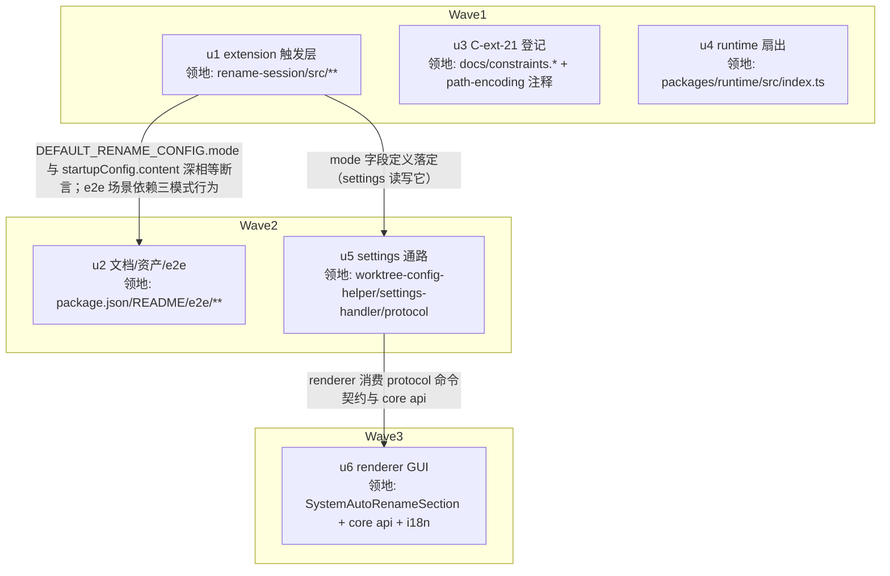

# rename-session 三模式 实施计划

基线: 本文件首次 commit（以 `git log` 本文件路径为准） | 来源设计: `docs/design/rename-session-three-modes.md`（v3.2） | 日期: 2026-09-12

## 0 章节映射

| 内容 | 设计文档实际位置 |
|------|--------------|
| 背景/目标 | 开篇（SCQA）:5 + §1 背景目标:18（4 目标 + In-scope/Out-of-scope:29-31） |
| 终态/机制 | §3 解决方案:75——§3.1 终态：使用者视角:77（含失败路径表:95）· §3.2 方案对比:108 · §3.3 关键决策 D1-D8:118 · §3.4 探针清单（⛔ 实施期门）:177 |
| 验收场景表 | §4 验收（真实场景，非单测非 mock）:187，V1-V10 |
| 下一层拆分 | §5 下一层拆分:208——§5.1 里程碑 M1-M3:210 · §5.2 单元拆分清单 u1-u6:220 · §5.3 文件改动地图:231 · §5.4 待验证检查点:249 |
| 待验证检查点 | §3.4 探针 P1-P3:177 + §5.4:249（e2e harness message_end 监听能力 / i18n 键复用或新增 / usage-page-fixes 悬空引用处置声明） |

## 1 目标快照（逐字摘录自设计 §1）

**设计目标**（从使用者体验倒推）：

1. **触发时机可选**：用户（GUI 系统设置或 pi CLI 配置文件）三选一——`first-prompt`（发出首条请求后立刻得名，不等回复）、`first-stop`（现状：首个成功 round 末）、`agent-tool`（不自动生成，注册 `rename_session` 工具由 agent 在对话中自主改名）。默认 `first-stop`（零行为迁移）。
2. **侧边栏自动更新**：任何来源的 rename（三模式自动/agent 工具/GUI 手动/pi 原生 `/name`）落库后，GUI 侧边栏无需任何其他操作即刷新；extension 不引入任何 taiji 专属通道（保持 universal 定位）。
3. **默认配置可用**：开箱（开关开 + 模型未配置）即工作——空 model ref 跟随会话主模型；只有显式配错（无效 ref）才静默跳过且日志可诊断。
4. **配置面收敛**：吸收 ext-simplify-15 rename-session 项——删 `PI_RENAME_*` env 覆盖层（0 生产 setter），配置源 4 层 → 3 层；isSubagentSession 跨包路径耦合登记 constraints.json C-ext-21。

**Out-of-scope**：ext-simplify-15 的 session-manager 部分（D2 死面删除、B1-B3 low 批——留在原 worktree 另行推进，见附录 A）；`auto-rename-enabled` flag 契约本体（[COMPAT] Remove after v1.0.0）；`/auto-rename` 命令的 mode 子命令；mode 组合形态；smart-context 等其他 extension 的同类问题。

## 2 单元列表

| Unit | 职责 | 领地（精确文件路径） | 依赖 | 隔离 | 验收条款 |
|------|------|----------------------|------|------|----------|
| u1 = M1a | extension 触发层：pure.ts（+mode 字段/normalize/默认值，−env 覆盖层）+ llm.ts（空 ref fallback `ctx.model` + isSubagentSession 注释 C-ext-21 互指）+ index.ts（message_end(role=user) 入口 + mode 分派 + 工厂闭包级 in-flight 去重 + rename_session 工具注册 + execute 内 live mode 守卫含恢复指引文案，D2/D3/D5/D6/D7-extension 侧） | `extensions/universal/rename-session/src/pure.ts`、`src/llm.ts`、`src/index.ts`、`src/__tests__/pure.test.ts`、`src/__tests__/index.test.ts`、`src/__tests__/llm.test.ts` | 无 | plain | ① `cd extensions/universal/rename-session && pnpm test` 绿；② pure.test 含 mode normalize（旧 config 无 mode→first-stop、非法值→first-stop）与 env 删除负面用例；③ index.test 覆盖三模式分派 + execute 守卫（mode≠agent-tool → isError 文案含「切回 agent-tool」）+ 工具注册条件；④ `grep -rn "PI_RENAME" extensions/universal/rename-session/src/` 0 命中；⑤ `pnpm extensions:typecheck` 绿；⑥ `grep -n "C-ext-21" extensions/universal/rename-session/src/llm.ts` 命中（D7 extension 侧注释） |
| u2 = M1b | 文档/资产/e2e：package.json startupConfig.content +mode + minor bump；README（mode 文档 + 3 源配置表 + 跟随会话模型 + **附录 A 指针一行**）；SKILL.md 同步；e2e run-a6（first-prompt）/run-a7（agent-tool）+ harness 断言函数 | `extensions/universal/rename-session/package.json`、`src/__tests__/startup-config-declaration.test.ts`、`README.md`、`skills/rename-session-ext-config/SKILL.md`、`e2e/run-a6.mjs`（新）、`e2e/run-a7.mjs`（新）、`e2e/harness.mjs`、`e2e/harness.test.mjs`、`e2e/scenarios.test.mjs`、`e2e/RESULTS.md` | u1 | plain | ① 包内 `pnpm test` 绿（含 startup-config-declaration 深相等断言：content 含 `"mode":"first-stop"` 与 pure.ts DEFAULT 一致）；② `grep -n "rename-session-three-modes" extensions/universal/rename-session/README.md` 命中（附录 A 指针）；③ run-a6/a7 脚本落位且 harness 断言函数有单测绿（真实 e2e 执行归 Gate B V2/V3）；④ package.json version 0.8.0 |
| u3 = M1c | C-ext-21 登记：constraints.json +C-ext-21（isSubagentSession 跨包路径耦合）+ render 再生成 md + path-encoding.ts 消费方注释（extension 侧 llm.ts 注释由 u1 同批落，u3 领地不含 llm.ts） | `docs/constraints.json`、`docs/constraints.md`、`packages/subagent-core/src/execution/path-encoding.ts`（仅注释） | 无 | plain | ① `node scripts/render-constraints.mjs` 跑后 git diff md 干净（id 唯一校验通过）；② C-ext-21 在 json+md 双登记；③ `grep -n "C-ext-21" packages/subagent-core/src/execution/path-encoding.ts` 命中 |
| u4 = M2a | runtime 扇出修复：onSessionRenamed 补 `broadcastSessionList()` + 空名回落 basename 派生（D4） | `packages/runtime/src/index.ts`（onSessionRenamed 段） | 无 | plain | ① `cd packages/runtime && pnpm test` 绿；② 新增用例断言 onSessionRenamed 回调触发整表广播 + name undefined 时 label 回落 basename 而非空串 |
| u5 = M2b | settings 通路：getRenameMode/setRenameMode（rmwExtConfigField 复用）+ `RENAME_MODEL_DEFAULT_CONFIG` 镜像同批加 mode + settings-message-handler `config.getRenameMode`/`config.setRenameMode` 命令 + shared protocol 类型 | `packages/runtime/src/services/worktree-config-helper.ts`、`packages/runtime/src/services/worktree-config-helper.test.ts`、`packages/runtime/src/transport/settings-message-handler.ts`、`packages/runtime/src/transport/settings-message-handler-*.test.ts`、`packages/shared/src/protocol.ts` | u1 | plain | ① `cd packages/runtime && pnpm test` 绿（helper RMW 用例 + handler 命令分派用例）；② `grep -n "RenameMode" packages/shared/src/protocol.ts` 命中；③ RENAME_MODEL_DEFAULT_CONFIG 含 mode 字段（三处默认值真相收敛） |
| u6 = M3 | renderer GUI：SystemAutoRenameSection 模式 Select + 「跟随会话模型」文案 + 切换生效提示（「工具面对新会话生效」）+ core settings api + i18n 双语 | `packages/renderer/src/components/settings/system/SystemAutoRenameSection.vue`、`packages/core/src/transport/api/domains/settings.ts`、`packages/renderer/src/i18n/locales/zh-CN/settings.ts`、`packages/renderer/src/i18n/locales/en-US/settings.ts`（各自 `__tests__` 伴生文件如触发） | u5 | plain | ① `cd packages/renderer && pnpm test` 绿 + `cd packages/core && pnpm test` 绿；② `pnpm run lint` 绿（taste-lint 无原生 HTML/emoji）；③ 组件含三模式选项 + 跟随会话模型文案（i18n 双语键齐，真实 GUI 验证归 Gate B V4/V6/V10） |

## 3 DAG 图

关键路径 u1→u5→u6 深度 3（≤4）；W1 并行 3、W2 并行 2（≤5）。u3（纯登记零行为）与 u4（runtime 独立修复）和 u1 无领地交集无数据依赖，W1 同批并行派发。

领地互斥自检：u1 含 llm.ts 全部改动（fallback + C-ext-21 注释），u3 领地不含 extension 侧文件——任意两单元领地交集为空。

## 4 测试策略

命令均从根 `package.json` scripts 与各子包真实读取：

**增量（单元开发期）**：
- u1/u2：`cd extensions/universal/rename-session && pnpm test`（vitest run）+ 根 `pnpm extensions:typecheck`
- u3：`node scripts/render-constraints.mjs`（md 再生成 + id 唯一校验）
- u4/u5：`cd packages/runtime && pnpm test`（runtime vitest，含 global-setup fs-guard，测试禁触真实数据目录）
- u6：`cd packages/renderer && pnpm test` + `cd packages/core && pnpm test` + 根 `pnpm run lint`

**Gate A 全量（阶段 5，收尾场景）**：
- `pnpm extensions:typecheck && pnpm extensions:lint && pnpm extensions:test`（extensions 三连）
- 根 `pnpm test`（全 packages/apps/extensions）
- 根 `pnpm run lint`（eslint --max-warnings 0，含 taste-lint）

**Gate B 验收场景（阶段 5，设计 §4 V1-V10 逐行签收）**：
- V1/V2/V3/V7/V8/V9：pi CLI 真实进程 + 真实模型 `xiaomi-token-plan-cn/mimo-v2.5-pro`（e2e harness，**禁 kimi**），共享临时 `PI_CODING_AGENT_DIR` 顺序跑
- V4/V5/V6/V10：GUI dev（`pnpm dev` + Playwright 连 9222）+ `~/.xyz-agent-dev` 隔离数据目录
- 探针 P1-P3（设计 §3.4，⛔ 实施期门）：随 u1 开工首日执行，结果回写设计文档；任一探针否决设计假设 → 停工上报（走 impl-plan §7 风险流程），不得静默改设计

## 5 合理偏差登记表

（初始为空；执行期合理不一致在此登记）

## 6 状态表

| Unit | 状态 | 轮次 | 证据指针 |
|------|------|------|----------|
| u1 | pending | 0 | — |
| u2 | pending | 0 | — |
| u3 | pending | 0 | — |
| u4 | pending | 0 | — |
| u5 | pending | 0 | — |
| u6 | pending | 0 | — |

## 7 残留风险与变更历史

**残留风险**：
- 探针 P1-P3 未执行（⛔ 实施期门，u1 开工首日闭环；否决设计假设即停工上报）
- e2e harness 对 message_end 事件的监听能力待确认（设计 §5.4：现有 harness 只订阅既有事件面，可能需扩展白名单——u2 实施时确认）
- GUI「跟随会话模型」文案与既有 RenameModelNotSet i18n 键的关系（复用改义 or 新键，u6 实施时按 i18n 键管理惯例定）
- V10 场景需 GUI dev 双 session + 模式切换实操，依赖 u5/u6 完成后联调（Gate B 收口）

**变更历史**：
- 2026-09-12：初版（来源设计 v3.2；tech-design 审查收敛轨迹：主审 2 轮 0 must-fix、影响面审 3 轮 1 must-fix 全修 + 第 4 轮聚焦复审）。
