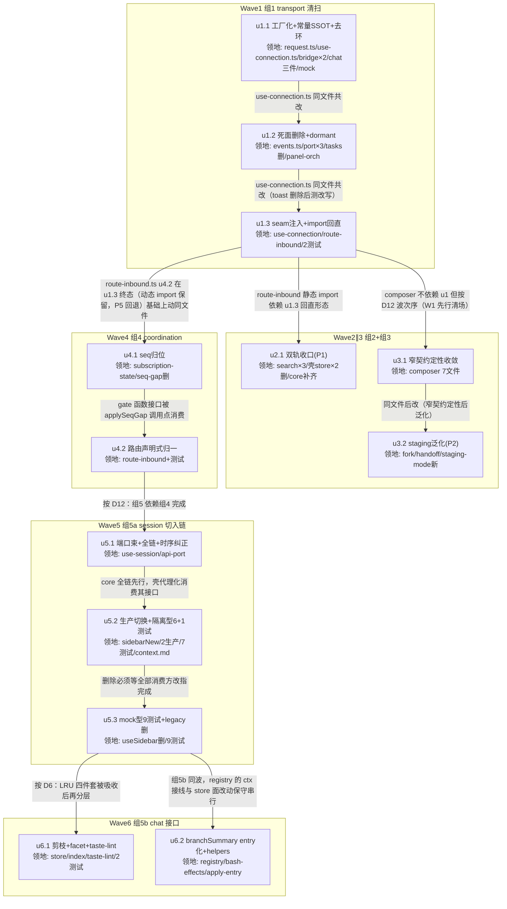

# renderer-deepening 实施计划

基线: c67842c2e | 来源设计: docs/design/renderer-deepening.md（v4, commit fb729ebe3） | 日期: 2026-09-03

## 0 章节映射

| 内容 | 设计文档实际位置 |
|------|--------------|
| 背景/目标 | §1 背景目标（SCQA + 设计目标 G1-G6 + In-scope/Out-of-scope） |
| 终态/机制 | §3.1 终态（开发者视角六场景 A-F）+ §3.2 整体策略对比 + §3.3 关键决策 D1-D13 |
| 验收场景表 | §4 验收（A1-A8 表 + 各组验收投入映射） |
| 下一层拆分 | §5 下一层拆分（波次表 13 unit 种子 + 文件改动地图 W1-W6） |
| 待验证检查点 | §5 探针清单（P0-a/b/c 已实证 ✅；P1/P2/P3/P4/P5 ⛔ 带失败降级路径） |

对抗式审查证据：`.review/renderer-deepening-review-r1.md`（R1 全量 + R2 聚焦复审，R2 总结论 **0 must-fix**）。

## 1 目标快照（逐字摘录）

- **G1 一处改**：Session 切入链、seq 协议、入站路由知识各有唯一代码载体——改一处即全效，不靠注释跨文件同步。
- **G2 一个 SSOT**：command/fileSearch 双轨收口；新增 server-push 消息类型 = 一行声明式条目 + 一个 effect 函数。
- **G3 诚实接口**：接口不宣告不存在的能力（死面清零）；chat store 消费方只学自己那面。
- **G4 测试面 = 调用面**：use-connection / seq 协议的测试经 seam 注入，不再 mock 四个模块内部。
- **G5 零行为回归**：除 §3.3 D4（切入链时序纠正）与 D13（branchSummary entry 化）两处显式声明的行为变化外，全部改动行为等价。
- **G6 每波独立可交付、可回滚**（沿用逐域绞杀纪律）。

**Out-of-scope（摘录）**：mock 轨与 real 轨语义对齐（Card 9，挂起 P3）；core root barrel 公共面治理（P6）；settings/compat-fields.ts 归位；new-task-search flow.ts 聚合返回面收窄；mobile 壳对接 core bootstrap。

**两处显式行为变化（G5 例外）**：D4 统一链采壳版时序（panel 先于 hydrate，影响面 = core.selectSession 三处消费路径）；D13 branchSummary entry 化（live 'Branched' → 与 reload `rawSummary ?? ''` 收敛一致）。

## 2 单元列表

| Unit | 职责 | 领地（精确文件路径） | 依赖 | 隔离 | 验收条款 |
|------|------|----------------------|------|------|----------|
| u1.1 | D10 不变量工厂化 + 常量 SSOT + barrel 回引去环 | `core/src/transport/api/request.ts`、`core/src/transport/use-connection.ts`、`core/src/extension-host/message-bus-bridge.ts`、`renderer/src/composables/shell/useExtensionHostBridge.ts`、`core/src/domain/chat/{lru,changeset,timers}.ts`、`core/src/transport/mock/`（grep `@xyz-agent/core` 自回引处）+ 相关测试 | — | plain | ① core+renderer typecheck/test 绿；② grep：`Object.assign(new Error` + disconnected 组合零命中（4 处归工厂）；③ EXTENSION_BRIDGE_TYPES 单点定义（core 导出，壳 import）；④ core src 内自 barrel 回引零命中 |
| u1.2 | D11 死面删除 + dormant 注释 | `core/src/transport/api/events.ts`、`core/src/transport/use-connection.ts`（toast 字段）、`renderer/src/composables/useConnection.ts`（useToast 注入）、`core/src/platform/port.ts`、`renderer/src/platform/desktop-platform.ts`、`mobile-renderer/src/platform/mobile-platform-adapter.ts`（+ mobile-shell.spec.ts）、`core/src/extension-host/builtin/tasks/`（删整目录）、`core/src/domain/session/effects/panel-orchestration.ts`（并入 api-port.ts）、`core/src/domain/session/api-port.ts`、`core/src/extension-host/activation-manager.ts` + 相关测试 | u1.1 | plain | ① core+renderer typecheck/test 绿；② grep：events.dispatch 别名 / PlatformPort.ipc / builtin/tasks / panel-orchestration 独立文件零命中；③ activation-manager 头注含 dormant 标记 |
| u1.3 | D9 ensureDispatcher 可选注入 + 动态 import 回直 + 测试改写 | `core/src/transport/use-connection.ts`（ensureDispatcher 签名）、`core/src/coordination/route-inbound.ts`（:351-363 回静态）、`core/src/transport/__tests__/use-connection-reconnect-resubscribe.test.ts`、`core/src/transport/__tests__/use-connection-clear-pending.test.ts` | u1.2 | plain | ① core test 绿；② 上述测试 vi.mock 模块数 ≤1（仅 ws-client）+ dispatcher 注入；③ route-inbound.ts 无 `await import` 的 subscribe 动态解析；④ renderer 测试全绿（P5 探针：受影响测试全量跑，失败则保留动态 import 其余照做） |
| u2.1 | D7 command/fileSearch 双轨收口（P1 前置） | `renderer/src/composables/features/search/{useSearch,useSearchJump,useFileSearch}.ts`、`renderer/src/stores/command.ts`（删）、`renderer/src/stores/fileSearch.ts`（删）、`renderer/src/composables/features/command/useCommandStore.ts`（如需壳适配微调）、壳对应测试（dev 时 grep 定位）、`core/src/domain/new-task-search/`（P1 差集补齐） | u1.3 | plain | ① P1 对等核对清单落盘（194 vs 277 差集逐条定性：core 新增 / 壳独有→先补齐）；② 壳两 store 文件不存在；③ renderer test 绿；④ grep：`stores/command`、`stores/fileSearch` import 零命中 |
| u3.1 | ComposerInputInstance 窄契约定性收敛（P2 前置一半） | `core/src/domain/composer/types.ts`、`dispatch/{send,submit,fork-mode,handoff-mode}.ts`、`context/{injection,context-chips}.ts` | u1.3 | plain | ① 窄契约定性清单落盘（6 处逐条：有意→Pick/字段级 import + 意图注释 / 漂移→删）；② core typecheck/test 绿 |
| u3.2 | D8 createStagingMode 泛化（P2 前置另一半） | `core/src/domain/composer/dispatch/{fork-mode,handoff-mode}.ts`、`core/src/domain/composer/dispatch/staging-mode.ts`（新）、`core/src/domain/composer/types.ts`（配置类型如需） | u3.1 | plain | ① P2 差异清单落盘（25% 差异逐条定性可配置性，不可配→部分泛化）；② fork/handoff 现有测试全绿不改断言（行为等价）；③ staging-mode.ts 存在且两 mode 消费 |
| u4.1 | D1 seq 协议归位 subscription-state | `core/src/coordination/subscription-state.ts`、`seq-gap.ts`（并入后删）、`core/src/coordination/` 平铺测试文件（seq-gap/subscription-state 测试合并 + MF-3 接口级新测试；注：coordination 测试平铺无 __tests__ 子目录，初版路径笔误经偏差 #8 修正） | u1.3 | plain | ① seq-gap.ts 文件不存在（判定表纯函数逐字内嵌）；② route-inbound 的 applySeqGap 缩为 gate 调用 + reconcile 触发（此步只改调用不改结构，route-inbound 主体留 u4.2）；③ core test 绿含新增 MF-3 接口级用例（feed gap → reconcile 意图 + 簿记；reconcile 失败 → 基线原位） |
| u4.2 | D2 route-inbound 声明式归一（两 commit：骨架 → error 合并） | `core/src/coordination/route-inbound.ts`、`core/src/coordination/route-inbound.test.ts`（平铺，偏差 #8 修正） | u4.1 | plain |① ROUTE_TABLE 条目为声明式 `{sessionEffect?, globalEffect?, crossSession?, payloadGuard?}`；② 'error' 单条目（sessionEffect=onSessionError + globalEffect 含 `!msg.id` 守卫）；③ CROSS_SESSION_TYPES 删（8 条 `crossSession: true` 声明）；④ 守卫两类分置：跳过型入 payloadGuard、整形型（:276 'Unknown error'）留 sessionEffect 参数构造；⑤ 坏形状锁定测试（:293-305/:348-351 等价迁移）绿 |
| u5.1 | D3/D4 sessionEntry 端口束 + core 切入链全链化 + 时序纠正 | `core/src/domain/session/use-session.ts`、`core/src/domain/session/api-port.ts`（类型）、`core/src/domain/session/__tests__/`（12 步顺序断言新增） | u4.2 | plain | ① UseSessionDeps 含 sessionEntry 端口束（全可选缺省 no-op）；② 统一链 = 壳版时序（sync/navigation 先于 hydrate）；③ 12 步顺序接口级断言（记录型 fake 端口回放调用序）绿；④ core test 绿 |
| u5.2 | D5 前半：生产切换 + 隔离入口型测试改指 + 术语登记 | `renderer/src/composables/features/sidebar/useSidebarNew.ts`（代理化）、`renderer/src/composables/panel/useChatViewDeps.ts`、`renderer/src/composables/features/trace/useTraceJump.ts`、测试 7 文件（fg6-overview / useSidebar-delete-empty-state / focused-session-id / app-bootstrap / initapp-default-cwd-session / list-load-error / session-trace/useTraceJump）、`docs/architecture/context.md` | u5.1 | plain | ① grep：useChatViewDeps/useTraceJump 无 legacy import；② resetAppBootstrap 引用零命中（改指 resetSidebarNewForTest）；③ context.md 含「Session 切入链」条目；④ renderer test 绿 |
| u5.3 | D5 后半：mock/动态型 10 测试改指 + legacy 删除 | `renderer/src/composables/features/sidebar/useSidebar.ts`（删）、mock/动态型 9 测试（MessageStream.wire / MessageStream-kind / MessageStream-subagent-force-working / SubagentDirectiveStream / use-fork-notice-stream / useHandoffEffect / use-chat-view-deps / fork-entry-behavior / subagent-tab） | u5.2 | plain | ① useSidebar.ts 文件不存在；② 全仓 grep（静态+动态+mock 三口径）`sidebar/useSidebar'` 零命中；③ renderer test 绿 |
| u6.1 | D6 chat store 剪枝 + facet 类型 + taste-lint 规则（A8） | `core/src/domain/chat/store.ts`、`core/src/domain/chat/index.ts`（facet 导出）、`taste-lint/`（新规则 + 注册）、`renderer/src/__tests__/useChat.test.ts`、`renderer/src/__tests__/stores/chat-dispose-session.test.ts` | u5.3 | plain | ① timer 三件套入 testInternals 命名空间（return 面无顶层导出），2 测试改指；② ChatStoreReaders/ChatStoreOps facet 类型导出；③ A8：临时 fixture 误用 ops 字段 → lint 报错指向 facet 文件，移除后复绿（fixture 不入库）；④ core+renderer test 绿 + `pnpm lint` 绿 |
| u6.2 | D13 branchSummary entry 化 + effects 骨架 helper + apply-entry builder | `core/src/domain/chat/effects/registry.ts`、`core/src/domain/chat/effects/bash-effects.ts`、`core/src/domain/chat/apply-entry.ts` + 相关测试 | u5.3 | plain | ① branchSummary live 链路 entry 化投影（fallback 与 reducer 收敛一致）；② live ≡ reload 新增等价用例（branch 后两路投影一致）绿；③ applyEntryFrameWithOverlay helper 存在且 ≥3 处消费；④ core test 绿；独立 commit（行为变化） |

**u-foundation 缺席声明**：各单元的契约（payloadGuard schema / sessionEntry 端口 / facet 类型 / staging config）均在其领地内就地定义并被后续单元消费（串行边承载），无并行单元共编的共享契约文件，故不设 u-foundation 根节点。

## 3 DAG 图

## 4 测试策略

**增量（单元开发期，从对应子包目录运行）**：
- core：`cd packages/core && pnpm typecheck && pnpm test`（vitest run）
- renderer：`cd packages/renderer && pnpm typecheck && pnpm test`
- 触 mobile（仅 u1.2）：root `pnpm test` 覆盖或 `pnpm --filter ./packages/mobile-renderer test`
- lint 类（u6.1）：root `pnpm lint`（taste-lint 经 eslint.config.mjs 挂载）

**全量（收尾阶段 5 Gate A）**：root `pnpm test` + `pnpm lint --max-warnings 0` + core/renderer typecheck。

**Gate B（阶段 5 真实场景）**：A1-A8 按 §4 验收表逐行签收（dev app 实跑；A1-A4/A6 需真实 runtime，必要时 CDP 取证）。

## 5 合理偏差登记表

| # | 偏差 | 定性 | 处理 |
|---|------|------|------|
| 1 | 设计 §5 原文「u1.1 与 u1.2 无文件交集可并行」——实际两者领地都含 use-connection.ts（D10① 工厂 vs D11 toast 删） | 计划级修正 | W1 内三单元全串行（u1.1→u1.2→u1.3），已在 DAG 边标注原因 |
| 2 | 设计 u5.2 原为单单元（6 测试改指+删除）；v4 修正消费面后为 2 生产+16 测试，超单 subagent 规模 | 计划级拆分（v4 已回写设计） | 拆 u5.2（生产+隔离型 7 测试）/u5.3（mock 型 9 测试+删除） |
| 3 | u1.3 ③ 动态 import 回直：P5 探针失败（renderer api 层 8 文件 39 用例红——静态图解析绕开 ws-client mock 拦截） | 设计预授权降级（D9 联动条款 + §5 P5 行） | 回退保留动态 import，:358 [HISTORICAL] 注释记录实证与失败清单；u4.1/u4.2 DAG 边原因改为「route-inbound.ts u4.2 在 u1.3 终态（动态 import 保留）基础上动同文件」 |
| 4 | u1.3 clear-pending 测试的 pending 消 mock 用 vi.spyOn(rejectAll) 而非注入 | 实现级合理偏差：use-connection 对 pendingApi.rejectAll 是顶层直接调用，注入消不掉 | spyOn 透传真实实现，断言语义 100% 保持，vi.mock 计数仍 ≤1 |
| 5 | u2.1 三处领地机械扩展：useSearchModalDeps.ts（私有 core 实例改共享壳适配，防双实例缓存分桶）、新建 useFileSearchStore.ts（共享壳适配必然产物）、slashIcons.ts 1 行死引用注释 | 达成「切换后同一数据源」目标条款的最小必要动作 | 已随 u2.1 commit；发现 CommandPopover slash 链已在 core 轨（设计例 4 描述部分过时——一致性审查期回写设计） |
| 6 | u3.1 定性偏离设计预判：send/submit 的 {getSegments} 字段不在权威接口（权威面=context 消费面），Pick 不可行，扩权收编被否（波及 dom-core/ui-mock） | 实证修正设计预期，符合设计「不追求全部合一、消灭无名分复制」精神 | 落实为保留局部声明 + 名分注释；一致性审查期回写设计 D8 措辞 |
| 7 | u3.2 净行数 +108 vs 设计 D8 效果条款「消约 300 行」：镜像重复归零（结构目标）达成，差额为类型契约 + 决策记录注释 | 设计效果估计失准，非实现偏离 | 一致性审查期回写设计 D8 效果措辞（结构目标口径替代绝对行数） |
| 8 | coordination 测试路径：计划领地写 coordination/__tests__/，实际该目录测试平铺于 coordination/ 下（u4.1/u4.2 两单元一致确认） | 计划路径笔误 | 后续单元领地按平铺约定理解；一致性审查期统一修正计划文本 |
| 9 | u4.2 ROUTE_TABLE/RouteTableEntry 导出为内部测试 seam（探针注入验证 prologue 分支与 D2-b 组合契约） | 生产无消费、有 resetSubscriptionStates 先例；不导出则组合契约不可测 | 保留导出 + 注释现状；一致性审查期评估是否登记设计 D2 附注 |
| 10 | 概念性注释漂移（行为零影响）：符号删除/迁移后的历史锚点未随刷新——一致性审查实测远超初版「约 5 处」（含 events.ts 头注、route-inbound.test ⑩ 系列与 Q1-4b、runtime 两处 seq-gap 锚点、renderer useSidebar 现状指引 8+18 处、useAppCommands stores/command 措辞等） | 审查期统一刷新（预定触发点） | 修复批次已执行（21+ 文件注释改写 + runtime 2 测试 testInternals 改指 + recordGapDispatchedSeq/RouteTableEntry 导出收编），grep 自检零失实残留（[HISTORICAL] 历史叙述豁免） |
| 15 | u3.2 捎带领地外 new-task-search 3 文件头注修正（commit 69cdb61f1 已披露但未入偏差表）：u2.1 删壳 store 后 core 头注「renderer 旧 store 保留待迁移后删除」成错误陈述，迟至 u3.2 才修 | 跨单元捎带注释修正，行为零影响 | 补登记（B-E3）；u2.1 验收条款未覆盖 core 侧注释同步是根因，后续同类收口单元应把「对侧注释同步」列入验收 |
| 16 | 汇报口径修正三则：① u2.1 commit「semantics covered by core TC-1..TC-5」承接口径过宽（findCommandByName 为薄包装无独立用例，分组语义承接成立但非 1:1）；② u3.2 行数混用两种基线各差 1（正确口径：基线 a3e19bec3 后 fork 238→150 / handoff 277→192）；③ 偏差 13「SubagentTab 逐字等价」忽略 outcomeFallbackMessages 的 i18n 依赖注入参数化（调用点求值语义等价） | 措辞精度，行为无差异 | commit message 不可追改，此处修正口径；后续批次引用这些数字时按本条口径 |
| 11 | u5.2 restoreSession 处置超出任务字面：core 未导出 runEntryChain 且 core 不在领地，保留壳侧链拷贝会复活双载体 | 合理偏差（G1 优先）| 落实为 restore RPC + core.selectSession 全链 + revive；两处等价已核验（cancelActiveFlow 对该路径 no-op；补发一次 session.switch 对已存在 session 是纯 getSummary+reply，runtime session-message-handler.ts:230-246）；一致性审查期核 runEntryChain 是否需导出供 restoreSession 精确复用（消除冗余 RPC 与 no-op 步） |
| 12 | u5.2 use-chat-view-deps.test 提前改指（原属 u5.3 领地）：生产切换架空其 legacy vi.mock，2 用例红 | 达成验收 d 的最小必要 | u5.3 mock/动态型残余清单 9→8；D7-U 系列断言按 D5 声明行为调整（startFlow 兜底放弃） |
| 13 | u6.1 四处连带：core 2 测试文件改指（设计漏数——D6① 只列 renderer 2 个，core store.test/custom-start-equivalence 经公共面消费逃生舱）、新规则打出 SubagentTab 真实误用 → 编排下沉新 composable useSubagentTabData、store.ts max-lines 豁免（既有 override 块内追加）、facet 断言类型 export（noUnusedLocals） | 规则不得为绿弱化的正面处置 + 机械必然 | SubagentTab 迁移行为逐字等价（renderer 3579 绿含 subagent-tab 用例）；一致性审查期复核迁移等价性与 max-lines 豁免 |
| 14 | u6.2 设计「D13 独立 commit」的 unit 内拆分放弃：① 行为变化与 ②③ 骨架收敛 hunks 在 registry.ts 交错，手工中间态需主 agent 编码（零编码红线） | 流程级权衡 | 单 commit 收口，行为变化在 message 显著分界 + 3 套等价测试钉住；另：sealed-guard 实际 6 处（设计估 ×8，另 3 处 findLastAssistantIndex 语义不同不收敛）、helper 拆两个（updateStreamingAssistant 与 applyEntryFrameWithOverlay 控制流不同构，强合一属过度设计）、bash-effects 实际路径 chat/ 根非 effects/（计划笔误） |

## 6 状态表

| Unit | 状态 | 轮次 | 证据指针 |
|------|------|------|----------|
| u1.1 | committed | 1 | commit 8fa0ac7d1（u1.1）；core 1280 绿 + renderer 3601 绿；grep b/c/d 全过（自回引残余 1 处为注释文本非 import） |
| u1.2 | committed | 1 | commit 8795046ba（u1.2）；core 1275 绿 + renderer 3601 绿 + mobile 21 绿；死面 grep 零命中；计划路径笔误修正（shell/useConnection → composables/useConnection）；连带授权：builtin-contributions.ts 注释锚点、mock-ws 第三 ipc 注入点 |
| u1.3 | committed | 1 | commit 6f5759e19（u1.3）；core 1275 绿 + renderer 3601 绿；vi.mock 各文件 1 处；③ P5 探针失败走设计预授权降级（动态 import 保留 + route-inbound.ts:358 [HISTORICAL] 实证），u4.x 以动态 import 保留形态为基线 |
| u2.1 | committed | 1 | commit e3c09d834（u2.1）；P1 通过（清单 docs/design/renderer-deepening.p1-parity.md，core 零补齐）；renderer 345 文件/3579 绿（-22 = 删除壳测试 7+4+11，dev 汇报导误报 8 已核正）；grep 零命中 |
| u3.1 | committed | 1 | commit a3e19bec3（u3.1）；定性：send/submit/context-chips 保留（字段不在权威面，Pick 不可行，扩权被否）+ 名分注释；fork/handoff Pick<'focus'> 化；injection 已被 ADR-0058 前序收敛（仅清注释）；core 1275 绿 + renderer typecheck 绿 |
| u3.2 | committed | 1 | commit 69cdb61f1（u3.2）；P2 过门完全泛化（20 段 diff：13 段同构骨架 + 7 类差异全部可配置，未触发降级）；staging-mode.ts 287 行 + 25 等价用例；fork 239→150 / handoff 278→192；导出面逐符号不变；core 1300 绿；净行数 +108（设计「消约 300 行」估计失准，结构目标达成） |
| u4.1 | committed | 1 | commit 855216946（u4.1）；判定表逐字内嵌（diff 核验）；seqGate 持判定+簿记+基线；applySeqGap 缩为 gate 调用+reconcile 触发；MF-3 接口级 3 用例；core 1303 绿 + runtime 4090 绿（注释残渣修正连带授权） |
| u4.2 | committed | 2 | 阶段 A commit 076e31ffe（骨架：声明式 schema + 8 条 crossSession + dispatcher 唯一 prologue + 守卫两类分置）+ 阶段 B commit 84398af0b（error 单条目合并 + 默认路径纯兜底）；route-inbound 34 用例（原 28 断言零弱化 + 新 6）；core 1309 绿；ROUTE_TABLE 导出保留为内部测试 seam（D2-b 组合契约探针必需） |
| u5.1 | committed | 1 | commit 93945c2fd（u5.1）；sessionEntry 六端口全可选（?? noop）；12 步链 = 壳版时序（D4 行为变化即时生效于 core 三消费路径）；新增 6 接口级用例（精确全序/短路/失败尾部）；core 1315 绿 + renderer typecheck 绿；结构裁量：selectSession(1-3) + runEntryChain(4-12) 镜像壳分段 |
| u5.2 | committed | 1 | commit 9d941fc4c（u5.2）；legacy 生产消费归零；restoreSession 偏差处置（restore RPC + core 全链 + 双等价核验：cancelActiveFlow no-op / 补发 switch RPC 无副作用已核 runtime handler）；use-chat-view-deps.test 提前改指（u5.3 残余 9→8）；context.md 术语登记；renderer 3579 绿 + core 1315 绿 |
| u5.3 | committed | 1 | commit 6699e8e4a（u5.3）；legacy 567 行删除；8 mock/动态型测试改指（5 死 mock 零风险 + fork-notice mock 恢复拦截 + useHandoffEffect 仅注释刷新）；三口径 grep + resetAppBootstrap 全仓零命中；renderer 3579 绿 |
| u6.1 | committed | 1 | commit 5e9743658（u6.1）；testInternals 收编（timer 三件套 + 2 逃生舱，4 测试连带改指含 core 2 个设计漏数文件）；facet 双类型 + 编译期完备/互斥断言；taste-lint 新规则 9 用例；A8 双向过（fixture 报错指向 facet SSOT → 删后复绿）；规则打出真实误用 SubagentTab → 编排下沉 useSubagentTabData；core 1315 + renderer 3579 + root lint 全绿 |
| u6.2 | committed | 1 | commit efa962462（u6.2）；D13 行为变化（'Branched' 放弃 → rawSummary ?? '' 收敛）+ 等价钉住 3 套（branch-summary-equivalence 4 + E5 族 + effects 组 3）；applyEntryFrameWithOverlay 4 处消费 + updateStreamingAssistant 6 处（设计估 ×8 修正为 ×6，另有 3 处语义不同不收敛）；apply-entry 双 builder 归一；单 commit（hunk 混合拆分放弃，偏差 #14）；core 1325 + renderer 3579 + lint 全绿 |

## 7 残留风险与变更历史

**残留风险**：
- P1（command 语义对等）：核对不通过 → 本波只做 fileSearch，command 部分挂起升级（设计已备降级）
- P2（staging 差异可配置性）：不可配 → 部分泛化（共享骨架 + 差异段保留）
- P5（renderer ws-client mock 链）：失败 → 保留动态 import 其余照做
- Gate B 场景（A1-A6）依赖 dev app + 真实 runtime，阶段 5 集中执行；单元期只跑命令级验收
- D4/D13 两处行为变化由专项验收（A2/A1 时序观察、A4 branch 段）兜底

**变更历史**：
- 2026-09-03 v1：初版计划（13 单元 / 6 波次 / DAG 含边原因）。来源：设计 v4（含实施前复核修正 D5 消费面）。
- 2026-09-03 轮 1（一致性审查 + 修复）：五区对抗式审查（A transport / B composer+search / C coordination / D session / E chat+lint）结论 = unreasonable 3 条全低危（注释刷新未执行、recordGapDispatchedSeq 死导出、RouteTableEntry 多导半张）+ doc_errors 约 12 条；修复批次清零（注释刷新 21+ 文件、导出收编 2 项、runtime 4 红用例根因为 u6.1 testInternals 收编的跨包消费面漏跑已修）；设计文档同步回写 v5；偏差表 #10 扩围落地、新增 #15/#16、#8 领地路径修正。审查另确认：两处声明行为变化（D4/D5）范围与实现精确吻合、偏差 #11 两处等价声称经源码核实成立、runEntryChain 维持不导出（导出会制造第二编排点违背 G1）。
