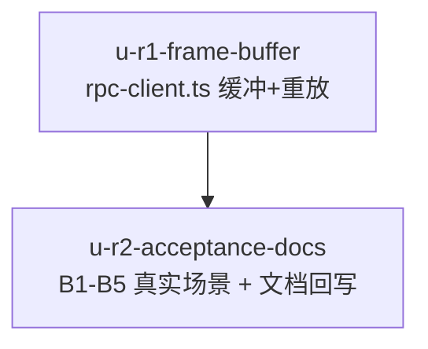

# rpc-client-early-frame-buffer 实施计划

基线: 1646a599a | 来源设计: docs/design/rpc-client-early-frame-buffer.md | 日期: 2026-09-05

## 0 章节映射

| 内容 | 设计文档实际位置 |
|------|------------------|
| 背景/目标 | §1 背景目标（G1-G4 + In/Out-of-scope） |
| 终态/机制 | §3.1 终态 · §3.3 关键决策 D1-D6 · §3.4 终态数据流 |
| 验收场景表 | §4 验收（B1-B5 真实场景表） |
| 下一层拆分 | §5 下一层拆分（R1/R2 + 待验证检查点） |
| 待验证检查点 | §5 尾「待验证检查点（实施期门）」2 项 |

## 1 目标快照（逐字摘录自设计 §1）

> **一句话结论**：把 PiRpcClient 的帧消费模型从「无消费者 = 丢弃」改为「无消费者 = 缓冲、首个消费者到达即重放」——根治 pi spawn 到 runtime adapter attach 之间所有主动帧的无条件丢失；session_start 观察链路恢复完整，bridge 启动 sync 从「每 session 恒丢首帧 + 2s 退避自愈」变为「首帧命中缓冲、毫秒级完成」。

- **G1 session_start 观察完整**：插件注册 `onPiEvent` 后，在 session 创建流程中能收到 session_start 事件（与后续事件无差别），不因 attach 时序丢失。
- **G2 启动提速**：bridge 启动 sync 首帧命中缓冲（不再依赖 2s timeout 退避自愈），spawn → 工具注册完成从 ~4.5s 降到接近 spawn→getState 的固有耗时。
- **G3 零重复零乱序**：缓冲重放不产生重复帧、帧序与 pi 输出序一致。
- **G4 有界**：缓冲有上限与生命周期；异常路径缓冲随 client 销毁释放。

**Out-of-scope**：pi 侧行为（不修改 pi）；`getState` 往返耗时优化；双通路 onPiEvent 重复触发（§2.4 登记）；SessionScanner / 前端会话列表。

## 2 单元列表

| Unit | 职责 | 领地（精确文件路径） | 依赖 | 隔离 | 验收条款 |
|------|------|---------------------|------|------|---------|
| u-r1-frame-buffer | 缓冲分支（handleMessage listener 分支前加缓冲判定：非 response 帧 + listeners 空集 + 缓冲未关闭）+ onEvent 首注册同步按序重放（per-帧 try-catch 隔离）+ 上限 256 drop-oldest+warn + 关闭标记（**一次性：关闭后 listeners 再空集不重放陈旧帧**，r2-S3）；单测（命中/序/上限/throw 隔离/一次性/第二 listener 不重放/restore 形态） | `packages/runtime/src/infra/pi/rpc-client.ts` `packages/runtime/test/` 下新增测试 | 无 | plain | 单测全绿；§4 B4（20 次 create/destroy 循环无超限 warn + buffer 空） |
| u-r2-acceptance-docs | §4 B1-B5 真实场景执行（含 restore 场景、B2 主判据「恒 1 sync 帧」+ 辅判据②同机对照 ≥4s 提速）；impl-plan 残留③收口回写；bridge 设计 D5 R1 自愈注记补「缓冲修复后 timeout 转防御层」 | `docs/design/`（rpc-client-early-frame-buffer.md · bridge-rewrite-pi-0.84.md · bridge-rewrite-pi-0.84.impl-plan.md）+ /tmp 探针脚本 | u-r1 | plain | B1-B5 逐行签收；主判据「恒 1 sync 帧」（piSessionLog 观测） |

**实施顺序**：u-r1 → u-r2。

## 3 DAG 图

## 4 测试策略

- **增量**：`cd packages/runtime && pnpm test`（新增 rpc-client 缓冲测试 + 既有全量不回归）。
- **Gate B（B1-B5）**：standalone runtime + 真实 pi 进程（复用 /tmp/bridge-gate-b2 探针基建）；B2 辅判据①观测点需 bridge:sync case 临时 debug 日志（r2-S2 探针形态，§5 检查点已登记）。
- B2 辅判据②「缩短 ≥4s」须同机对照跑法消除 getState 往返与冷启动 jiti 编译噪声。

## 5 合理偏差登记表

（初始为空）

## 6 状态表

| Unit | 状态 | 轮次 | 证据指针 |
|------|------|------|---------|
| u-r1-frame-buffer | committed | 1 | 首派限流中断，接替程序重派完成；前任源码核验保留+测试修 2 处 TS 错；runtime 全量 4298 绿 |
| u-r2-acceptance-docs | committed | 1 | B1-B5 全 pass（B2 主判据 23/23 恒 1 sync 帧；辅② A/B 4550ms→550ms 缩短 4000ms）；文档回写 3 处；证据 /tmp/r2-accept/ |

## 7 残留风险与变更历史

- 预检证据：设计 v3 经 2 轮对抗审查收敛 0 must-fix（`.review/rpc-client-early-frame-buffer-design-review-r2.md`：0 MF/4 SG/1 INFO，4 条 SG 均不影响决策）。
- **跨文档领地冲突（主 agent 编排约束）**：`packages/runtime/src/infra/pi/rpc-client.ts` 同时是 timeout-slow-flow U2（BASH_RPC_TIMEOUT_MS import + :700 bash()）与 U3（compact 常量回归）的改动目标——**u-r1/u-r2 完成前，slow-flow U2/U3 不得派发**。
- 重放 per-帧隔离 vs EventAdapter 整批隔离的不对称（r1 INFO-1）：实施期按先例对齐，冗余则简化为整批（§5 检查点 2）。

## 变更历史

- v1（2026-09-05）：初版。用户评审以会话指令「开始规划开发」代替（夜间托管自治态），DAG/单元表随最终汇报呈现。
- （一致性审查 reasonable 确认）①D1-D6 逐条与实装一致（缓冲分支/一次性关闭/无显式 destroy GC 释放）；②per-帧隔离保留裁决正确（整批 try 会中断后续帧重放，违背 D5 主表）；③超限 warn 仅首弃时点报计数后续静默（防刷屏意图达成，累计总数不落日志——事后审计另行观测）。
