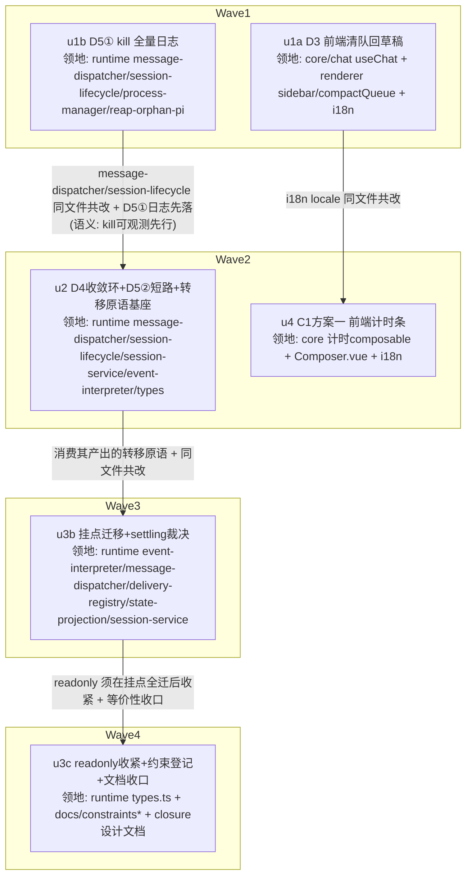

# session-dead-structural-fixes 实施计划

基线: d9be77290 | 来源设计: docs/design/session-dead-structural-fixes.md | 日期: 2026-09-11

## 0 章节映射

| 内容 | 本文实际位置 |
|------|--------------|
| 背景/目标 | §1 背景目标（1.3 设计目标 G1-G5；1.4 in/out scope） |
| 终态/机制 | §3 解决方案（3.1 终态 / 3.2 方案对比 / 3.3 决策 D1-D8 / 3.4 错误规格 / 3.5 探针清单） |
| 验收场景表 | §4 验收（4.2 场景表 V1-V8） |
| 下一层拆分 | §5 下一层拆分（PR 单元表 + 文件改动地图 + 待验证检查点） |
| 待验证检查点（无则记「无」） | §5 末段①-⑤（P-1 双场景实测 / P-2 复核 / 挂点 grep 复核 / 草稿合并细节 / L2 wire 形状——⑤ 属冻结的 u6，本轮不实施） |

## 1 目标快照（逐字摘录自设计文档 §1.3 / §1.4）

**设计目标**：
- **G1 状态不撒谎**：pi 在跑（无论是谁发起的）时，发送门、排队门、侧栏处处显示忙碌；pi 空闲时处处可发。同一件事任何两处显示不得相反。
- **G2 停止即停止**：forceQuit 后，任何机制（前端队列、extension 通知、定时任务、子代理回流）都不得让**被杀的旧执行**自动复活；排队未投的消息不丢失，交还用户处置。边界：子代理回流等**新信息送达**触发的处理 turn 不属于「旧执行复活」（L5 裁定）。
- **G3 恢复即干净**：重开 dead session 看到完整历史，不自动续跑旧 turn，可立即发新消息（同进程生命周期内；app 重启例外见 D4 被否栏，收敛环残余链例外见 D4 代价登记）。
- **G4 进展可见**：长 turn 进行中用户能看到「在做什么、多久了、产出了多少」，并可选择中止；等待用户输入（ask_user）时不被误报为停滞。
- **G5 零回归**：正常发消息 / bash / compact / handoff / subagent 投递（session_manager send / completion-backflow）行为不变；live≡reload 等价性测试套件保持全绿。

**Out of scope**：A 组三项止血（已落地 commit 5637e0088）；pi 本体修改与 provider 稳定性（C2）；subagent 域 record 模型与 chat 域统一（fix-subagent-no-notification 分支领地，仅 D8 对齐点）；任何形式的 turn 自动中止；C1 方案二（u6，被 P-3 实测阻塞，本轮冻结）。

**对抗式审查证据**：`.review/design-review-session-dead-r3.md`（must_fix=0）+ `.review/design-review-session-dead-r3-impact.md`（must_fix=0）；收敛轨迹 R1(2+3 MF) → R2(1+0 MF) → R3(0+0 MF)。

## 2 单元列表

| Unit | 职责 | 领地（精确文件路径） | 依赖 | 隔离 | 验收条款 |
|------|------|----------------------|------|------|----------|
| u1a | D3：forceQuit 清 defer 队列回 Composer 草稿 + 提示（V1①② 前端部分） | `packages/core/src/domain/chat/useChat.ts`、`packages/renderer/src/composables/features/sidebar/useSidebarSessionActions.ts`、`packages/renderer/src/composables/panel/useCompactQueue.ts`、`packages/renderer/src/i18n/locales/zh-CN.ts`、`packages/renderer/src/i18n/locales/en-US.ts` | 无 | plain | ① core+renderer vitest 增量绿 + typecheck 绿；② 新增单测覆盖「forceQuit → 队列清空 + 草稿回收 + Composer 已有内容时追加」三行为；③ 设计 §4 V1② 的 DOM 断言（草稿可见 + 提示文案）落在组件/核心层测试 |
| u1b | D5①：kill 路径全量 warn 日志（K1/K2/K3/K5/K6/K7/K8 各源，含调用源与信号链） | `packages/runtime/src/services/session/message-dispatcher.ts`、`packages/runtime/src/services/session/session-lifecycle.ts`、`packages/runtime/src/infra/pi/process-manager.ts`、`packages/runtime/src/services/reap-orphan-pi.ts` | 无 | plain | ① runtime vitest 增量绿 + typecheck 绿；② 新增单测断言每条 kill 路径触发时 logger.warn 被调用且含 source 字段（7 路径各一断言）；③ grep 确认无残留未打日志的 forceQuitSession/destroy 调用点 |
| u2 | D4+D5②+D1/D2 基座：userStopped 标记（独立 Map 宿主）+ source 参数置位分型（K1/K2）+ restoreSession 返回前 abort + 收敛环（agent_start 拦截 + settled 静默窗）+ session.restore 短路复用 + `applySessionOccupancyTransition` 原语与封闭转移表（含 announce-idle 收编，走 state-topic 通路）+ registerSession 宣告帧改调 | `packages/runtime/src/services/session/message-dispatcher.ts`、`packages/runtime/src/services/session/session-lifecycle.ts`、`packages/runtime/src/services/session/session-service.ts`、`packages/runtime/src/services/session/event-interpreter.ts`、`packages/runtime/src/services/session/types.ts` | u1b | plain | ① runtime vitest 增量绿 + typecheck 绿；② 原语单测：转移表每行至少一断言（合并/派生/去重/announce-idle 强制广播）；③ 收敛环单测：abort→settled→补发→再 abort→静默窗→清标记序列 + 「settled 未到窗满不清」边界；④ 短路单测：client 活跃时 session.restore 不清场重开；⑤ 宣告帧回归：occupancy-runtime 测试 Part D 保持绿（重订阅回放必达） |
| u3b | B1 挂点迁移：14+ 挂点改调原语（interpreter #2-#6、dispatcher #1/#7-#9/#11、deliverText 置位、agent_end 副作用、onSessionExit 全复位、A1 拒绝反转→reject-processing）+ settling 预检裁决（计忙，拒绝入队） | `packages/runtime/src/services/session/event-interpreter.ts`、`packages/runtime/src/services/session/message-dispatcher.ts`、`packages/runtime/src/services/session/session-delivery-registry.ts`、`packages/runtime/src/services/session/session-state-projection.ts`、`packages/runtime/src/services/session/session-service.ts` | u2 | plain | ① runtime vitest 增量绿 + typecheck 绿；② grep 全量复核：`updateSessionOccupancy(` 直调点清零（全部经原语）+ 三布尔直写点清零（实施期检查点③销账）；③ settling 预检单测：settling 态发送被拒转 send.rejected{busy}；④ apply-entry-equivalence 等价性套件绿 |
| u3c | readonly 收紧 + 约束登记 + 文档回写收口 | `packages/runtime/src/services/session/types.ts`、`docs/constraints.json`、`docs/constraints.md`（`node scripts/render-constraints.mjs` 重渲染）、`docs/design/session-occupancy-send-closure.md`（C-proc-10 回写） | u3b | plain | ① runtime typecheck 绿（readonly 后直写在编译期红）；② constraints.json 新增「session 忙闲状态单写原语」条目 + render 脚本重渲染 diff 一致；③ 全量等价性套件 + runtime/core/renderer/shared 四包 vitest 全绿（Gate A 预演） |
| u4 | C1 方案一：前端 turn 计时条（turn 时长/当前工具时长/已产字符）+ 阈值警示 + 中性操作项 + ask_user 豁免文案（「在等待你的输入」） | `packages/core/src/domain/chat/`（新增计时派生 composable，ADR-0049 分区范式）、`packages/renderer/src/components/panel/Composer.vue`、`packages/renderer/src/i18n/locales/zh-CN.ts`、`packages/renderer/src/i18n/locales/en-US.ts` | u1a | plain | ① core+renderer vitest 增量绿 + typecheck 绿；② 计时派生单测：事件边界驱动（delta 不计时）、ask_user pending 期豁免停滞警示（turn 时长事实照常展示——D6 原文口径）；③ 文案断言：无「卡死/无响应/异常」判断词（i18n 断言）；④ 中止操作走既有 abort 链路（接线点单测） |
| u6 | C1 方案二 L2 停滞提示帧（设计 PR-5） | — | **blocked**：P-3 实测阻塞（设计文档 §3.5 显式判定「数据不足时方案二不落地」），本轮冻结不实施；验收范围 V5② / P-3 相应排除 | — | 无（冻结） |

## 3 DAG 图

u6（冻结）不入图。

## 4 测试策略

**增量（单元开发期）**：
- runtime：`cd packages/runtime && pnpm test`（vitest run）+ `pnpm typecheck`
- core：`cd packages/core && pnpm test` + `pnpm typecheck`
- renderer：`cd packages/renderer && pnpm test` + `pnpm typecheck`
- 测试文件落位跟随各包既有 `__tests__`/`*.test.ts` 惯例；vitest 配置已带 junit reporter（`test-results/`）

**全量（收尾，Gate A）**：runtime + core + renderer + shared 四包 `pnpm test` 全量 + `apply-entry-equivalence` 等价性套件 + `pnpm run lint`（根）。extensions 三连不涉及（本设计无 extension 改动）。

**Gate B（真实场景验收）**：设计 §4 V1-V8 在 dev 环境（`pnpm dev`，真实 pi + 真实 provider / 故障注入代理）执行；P-1 探针双场景（单通知 abort 时序 + ≥2 条通知收敛环）随 V1/V4 标定，由主 agent 执行并记录。

## 5 合理偏差登记表

| Unit | 偏差 | 判定 | 联动 |
|------|------|------|------|
| u1a | i18n key 落在分段文件 locales/{zh-CN,en-US}/sidebar.ts（计划清单写的聚合入口 zh-CN.ts/en-US.ts）——项目 i18n 为分段组织 | 合理：实现文件细化，非领地外 | 领地清单以此为准 |
| u1a | 草稿回收走既有 composerInjectionStore 一次性通道（forceQuit 后 dead 占位接管、Composer 卸载，注入请求滞留槽位，restore 重开挂载时补消费落输入框）而非直写 drafts 分区 | 合理：drafts 是 Composer 实例私有分区外部不可达；时序与 V1②「点击后草稿可见」自洽 | 无 |
| u1a | 多条排队消息以空行分隔拼接（§5 检查点④实施期定稿事项） | 合理：设计授权实施期定稿 | 检查点④销账 |
| u1a | in-flight 占位不回收（依赖既有失败链回滚兜底；chat store 不在领地且为现状既有缺口） | 合理：非 D3 引入，登记现状 | 阶段 3 审查复核 |
| u1b | K7 收殓日志由 console.log 升级 console.warn（D5① 要求 warn 级，原级别在 prod info 下不落盘） | 合理：职责内级别变更 | 无 |
| u1b | K6 destroyAll 空表不打日志（降噪，配套边界单测）；日志形态 = console.warn 键值对内嵌（项目无独立 logger 库，既有惯例） | 合理 | 无 |
| u2 | 显式投递清标记只接了 sendPrompt；delivery（deliverText）与 backflow 回流的清标记**未接线**（两文件属 u3b 领地）——补线前缺口为保守方向（多拦不漏拦） | 移交：**u3b 必须补线**（已写入 u3b task 目标 C 块） | u3b 验收新增 |
| u2 | restore-abort 失败 fallback 直达 forceQuit 强杀（非错误规格字面的「走既有 abort 失败链」——避免对已超时 client 二次 abort 双倍 60s 等待）；kill 日志 source 呈 K1 形态 | 合理：收敛动作一致，代价已代码注释登记 | 阶段 3 审查复核 |
| u2 | UserStoppedGate 模块级门面（event-interpreter.ts）替代 session-service 直接导出——session-service 值导入全部子模块，直接导出成环；SessionService 构造器 configure 注入为唯一无环通路 | 合理：架构必要 | 无 |
| u2 | 存量测试兼容：gate.markUserStopped 未 configure 时降级 no-op+warn（生产不可达）；5 个存量测试 mock 补 getClient | 合理：测试兼容 | 无 |
| 基础设施 | 滚动跟随守卫（C-state-11）脚本从 main 恢复 + 3 处 findItemIndex(scrollSize) 存量归零（commit 98f5a94b4）——本分支基线早于 main 的 chat-pin-bottom-fix 合并，共享 hook 与分支进度错位；u1a commit 被拦截的正面修复，非计划单元 | 合理：基线设施修复 | 变更历史已记 |

## 6 状态表

| Unit | 状态 | 轮次 | 证据指针 |
|------|------|------|----------|
| u1a | committed | 2 | commit 5d4644cb4 + 修复轮 bdd2dc754（forcequit 测试 mock 补齐——u3c 全量门抓出的漏网回归） |
| u1b | committed | 1 | commit d879fe120（9 单测绿，Bundle 验证 + Plugin E2E 绿） |
| u2 | committed | 1 | commit bc960acb1（32 文件 473 测试绿，Bundle 验证 + Plugin E2E 绿） |
| u3b | committed | 1 | commit 2048f03ab（runtime 全量 5156 绿，等价性 core 33 + runtime 65 绿，Bundle+E2E 绿） |
| u3c | committed | 1 | commit 70ca30acc（readonly 11 处 fixture 收口归零、C-data-19 登记、closure §6 回写；runtime 5156/core 1788/shared 323/renderer 4095 全绿） |
| u4 | committed | 1 | commit 6dbb8a35b（core 1788 + panel 634 全绿，双 typecheck 绿） |
| u6 | blocked（P-3 实测阻塞，设计显式判定） | — | 设计 §3.5 P-3 / §5 PR-5 行 |

### 偏差登记表（续——执行期/阶段 3 补登，逻辑归属 §5）

| Unit/来源 | 偏差 | 判定 | 联动 |
|---|---|---|---|
| u3b | index.ts（组合根）不在领地列举但必须改：interpreter onOccupancyTransition 回调签名改封闭转移枚举 + 接线内三布尔直写改调原语——否则 grep 复核无法清零 | 合理：纯机械接线，D2 挂点迁移本体 | 领地清单补记 |
| u3b | onCompactingStateChange 回调通道保留（双通道对同一原语行幂等），单通道收敛建议随 u3c readonly 收口一并处理 | 移交：u3c 裁决执行（已写入 u3c task B 块） | u3c 验收 |
| u4 | 新增子组件 TurnProgressBar.vue（Composer.vue script 余量 ~40 行，内联必超 300 上限）+ 4 个既有测试 mock 补 2 行 + index.ts 域出口 +1 行 | 合理：最小侵入与既有 mock 先例同构 | 领地清单补记 |
| u4 | turn 活跃窗口 = occupancy.turn !== 'idle'（含 dispatching/settling），turnElapsedMs 严格 message_start(assistant) timestamp 起算 | 合理：与设计原文一致 | 无 |
| 基础设施 | C-pi-14 layout-literal 守卫（共享 hook 02:57 被并行会话 install-hooks 更新扩散）：脚本从其分支 d484b3dac 提取 + 101 文件 200 处存量 file 级临时豁免（[temp-branch-exemption]，用户裁决「豁免存量+继续」）；守卫脚本自身 commit 用一次 SKIP_ALL_CHECKS（用户授权，commit 3164782b6 message 已说明）。**合并 fix-session-reader-session-not-found 时必须整段删除临时豁免并复跑守卫** | 合理：用户裁决 | 变更历史已记；合并 PR 检查单 |

| 一致性审查 | R1 收敛环 settled 重置窗覆盖主 restore-abort 掐掉的 replay turn（设计 D4 未明确，实现计入并给出理由——「有被掐 turn」的事后信号） | 合理：v4 修订③前置的更精确实现 | 设计 D4 已同步 |
| 一致性审查 | R2 deliverText 置位收编为 'dispatching' 行并产生 occupancy 广播（原「只写布尔不广播」漂移写点的构成性消灭） | 合理：G1 方向增强，理论竞态正常时序不可达 | 设计 D2 已同步 |
| 一致性审查 | R3 restoreSession 短路条件为 ensureActive 同款判定的严格超集（+ Map 条目存在检查防半截态） | 合理：一层额外防御 | 代码注释已登记 |
| 一致性审查 | R4 kill 日志覆盖按设计 K1-K8 封闭清单满足；创建失败回滚（safeDestroy tempId/forkedId）、createSession 防御先杀、ephemeral finally 清理不属 kill 路径，不打 kill_source——u1b 验收③ grep 复查时按此排除 | 合理：语义澄清 | 本表即登记处 |
| 一致性审查 | F-R1 drain 回收范围含已提交在途条目（pi 死后确认帧永不再来，drain 是唯一出口）；F-R2 「继续等待」= snoozeWarn 抑制本 turn 警示色、事实条照常、跨 turn 复位；F-R3 清队时机精确化为 forceQuit RPC 确认成功后（失败不清队防丢失） | 合理：设计空白处的合理补全 | 设计 D3/D6 已同步 |

## 7 残留风险与变更历史

**残留风险**：
1. P-1 探针双场景实测（单通知 abort 时序 + ≥2 条通知收敛环 + 收敛窗 3s 初值校准）需真实 pi 环境，随阶段 5 Gate B 的 V1/V4 执行；若实测触发 §3.5 降级档，按设计降级路径回改 u2 并重跑受影响验收。u2 补充：replay turn 收尾超窗（pi 收尾卡顿 >3s）的极端时序残余缝 runtime 无先验信号，按本条随 P-1 标定。
2. u2 单元为关键路径最大单元（5 文件、原语+收敛环+短路三块新逻辑），dev 轮次预算按 2 轮预置，超 2 轮未绿按 SKILL 阈值冻结升级用户。（实际 1 轮绿）
3. V8 场景（≥3 轮 forceQuit/restore 循环 + 重启）依赖 pnpm dev 稳定长跑，阶段 5 执行时注意多实例端口坑（AGENTS.md：3210/9222/3310 归属确认）。
4. 【Gate B 发现·待用户裁决】steer 通道文本回收：turn 忙时按 Enter 走 steer 直投 pi 内存队列（不经 defer），forceQuit 后 steer 队列随进程消亡、文本丢失（不在 session 文件/草稿）——气泡残留已修（dde26d7fe 清 queueStates 快照），steer 文本是否纳入草稿回收涉产品语义（steer = 用户「加入当前任务」意图，非排队），留用户裁决。
5. 【Gate B 发现·低频边界】forceQuit 与在途 send RPC 竞态（<500ms 窗）：settling 窗口内发出的消息若在 drain 后到达 runtime delivery，显式投递清标记放行 → session 复活执行该消息，且与草稿回收可能双份。D4「显式投递放行」裁定的边界效应；建议后续评估 forceQuit 后短窗内到达的 send 是否应提示用户而非静默执行。
6. 【Gate B 发现·集成注意项】session.occupancy 等 session 实时帧对 ws 客户端的投递依赖 session 实例存活——pi idle 销毁后重建的实例需重新 subscribe 才有帧流；第三方集成者依赖该帧做外部监控时需注意重订阅（产品侧可评估全局 occupancy 广播通道）。
7. runtime 全量 2 例负载型 flaky（logger size 轮转 / send-queue-e2e S1 real-pi，Gate A 三次全量两次各中一例、单跑均绿）——建议后续做隔离/重试加固。

**变更历史**：
- 2026-09-11：初版计划。单元切分对设计 §5 的 PR 表做了两处映射说明：① 设计 PR-3 拆为 u2 基座（原语+转移表+宣告帧收编，因 event-interpreter/session-lifecycle 与 PR-2 同文件共改，合并以压关键路径至 4 层）+ u3b（挂点迁移）+ u3c（readonly+文档收口）；② 设计 PR-5 → u6 冻结（P-3 阻塞为设计文档显式判定，非本计划新增裁决）。
- 2026-09-11：执行期记录——基础设施阻塞修复：u1a commit 被滚动跟随守卫拦截（共享 hook 与分支基线错位 + 3 处存量违规），恢复守卫脚本 + M1 等价归零（commit 98f5a94b4，含一轮定向修复 MessageStream 行数超限），登记偏差表「基础设施」行。u1a/u1b/u2 依次 committed；u2 两条移交项（delivery/backflow 清标记补线）写入 u3b task。
- 2026-09-11：执行期记录——u3b/u4 一轮绿 committed（2048f03ab / 6dbb8a35b）。C-pi-14 layout 守卫经共享 hook 扩散拦截后续 commit，用户裁决「豁免存量+继续」：守卫脚本提取 + 101 文件临时豁免 + 一次授权 SKIP 提交（3164782b6）。u3b 验收超预期：runtime 全量 5156 测试绿（收口单元 u3c 前）。u3c（readonly 收口 + 约束登记 + 文档回写）已派发。
- 2026-09-11：u3c committed（70ca30acc，含 B 块裁决：onCompactingStateChange 保留双通道幂等，删除牵连 2 个生产接口变更判不划算；C-data-19 替代建议 id 因 render 脚本主题白名单）。u1a 修复轮（轮次 2）：u3c 全量门抓出 forcequit handler 测试 mock 漏网回归，已修复 committed。状态表全 committed（u6 冻结），转阶段 3。
- 2026-09-11：阶段 3 一致性审查（两分区独立 reviewer）返回 5 unreasonable（runtime U1 中：V7 注入开关未实现；U2/U3 低；前端 F-U1 low-medium：turn-progress 切 session 分区脱钩；F-U2 low：注入槽位覆盖丢文本）+ 3 doc_errors + 7 reasonable。处置：3 修复组并行派发（runtime 组 / turn-progress 组 / 注入组）；doc_errors 主 agent 修正（设计 §3.2 字节→字符、impl-plan u4 验收②措辞、C-data-19 summary grep 声称降级为人工复核）；reasonable 7 条登记本表并同步设计文档 D2/D3/D4/D6 表述（4 处）。
- 2026-09-11：阶段 3 修复循环收口。5 条 unreasonable 修复 committed（d3ca1b1e7 / 166fa16fd / cab38510a）+ 定向复审：前端批 pass=true（2 条 low/info 观察登记不阻塞）；runtime 批打回一轮（U1 timer 两缺陷：延迟无上界重开 v4-③ 边界缝、timer 无 dispose 幽灵置闲新 session），修复 = 复审建议忠实执行（reject-over-clamp 有合理理由：clamp 会使 V7 标定失真），committed f688d657d，42+200 测试绿。unreasonable 清零，转阶段 5。前端批 2 条 low/info 观察（startTurn 注释漂移、头部残余声明未点名在场场景）——经终态同步审查核实：两处漂移点已随 cab38510a 的头注释重写闭环（turn-progress.ts:28-30 残余声明、:220 startTurn docstring），观察销账。runtime re-review INFO（ping 看门狗/session-manager abort 仍默认 'user' source）为既有行为，AbortSource 全量分型留待后续收口。
- 2026-09-11：Gate A 首跑 FAIL（根 lint 4 项本区间引入）→ 微修复 committed（4775c0a9e）→ 复验 lint exit 0 转绿。重验范围 = lint + 新测试（未触共享接线）。测试侧四包全量绿（runtime 5169 / core 1790 / renderer 4097 / shared 323），绕过扫描零命中。Gate A risks 留档：runtime 2 例负载型 flaky（logger size 轮转 / send-queue-e2e real-pi，单跑均绿建议隔离加固）、renderer 3 个既有 skip、event-interpreter/session-service 膨胀（已豁免登记+拆分指引）。
- 2026-09-11：Gate B 完成——8 场景 7 pass + V4(c) 形态性 blocked（父 forceQuit 时子代理随父 cancel，D4 担心的 backflow 复活形态物理不存在；父存活回流正向已在 V3 验证）。P-1 标定落地：单通知 abort 精准中断（agent_start 后 20ms 到达，occupancy 3ms 收敛）；≥2 条 pending 合并为单条注入（notify-ledger 合并实锤）→ 收敛环单轮即收敛；静默窗实测 3.007s×2 与设计初值吻合；120s 看门狗未触发，D4 登记的残余链盲区维持未观测。Gate B 新发现处置：① steer 通道消息丢失 + queueStates 气泡残留（G1 状态撒谎）→ 微修复中（快照清理；steer 文本是否纳入草稿回收涉产品语义留用户裁决）；② ask_user 豁免文案实装未接通 → 微修复中（V5②）；③ forceQuit 竞态双份（<500ms 在途 send 复活 + 草稿/投递双份）→ 登记残留风险（低频边界，D4 显式投递放行的边界效应）；④ occupancy 帧重订阅注意项 → 集成面登记。V6 的 K2/K5/K7 日志点源码确认存在但真实构造受阻（pi 冻结无注入手段/CDP 确认交互未触发/孤儿未形成），与 K1/K8/K6 实测互补。
- 2026-09-11：Gate B 微修复 committed（dde26d7fe）：① forceQuit 编排清 queueStates 快照（G1 气泡残留；steer 文本草稿回收留用户裁决）② V5② 真断点 = Panel.vue AskUserOverlay/Composer 互斥挂载致观测条整体卸载（非接线断点），TurnProgressBar 提升至互斥对之外 + dead 态排除，CDP 实测等待期分型文案 + 回答后恢复计时（截图 /tmp/gateb-fix/）。受影响场景重验：V1 残留由 store 单测 + FQ 编排断言覆盖，V5② 由 CDP 实测 + U6 单测覆盖。**双绿达成：Gate A PASS + Gate B 8 场景（7 pass + V4c 形态性 blocked）**，转入阶段 6 终态同步。
