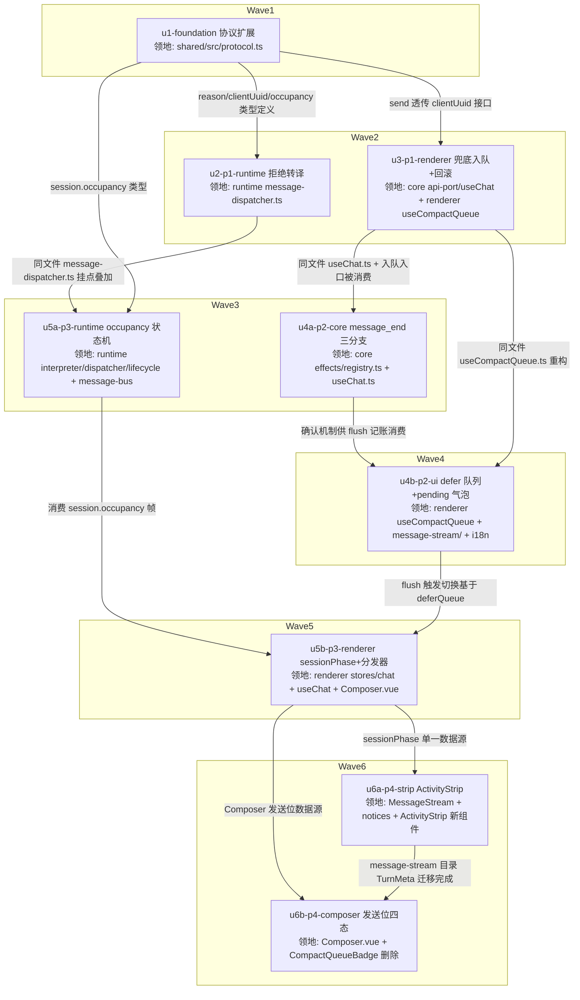

# 会话占用状态统一（occupancy）与消息发送闭环 实施计划

基线: (待填) | 来源设计: docs/design/session-occupancy-send-closure.md | 日期: 2026-09-05

## 0 章节映射

| 内容 | 本文实际位置 |
|------|--------------|
| 背景/目标 | §1 背景目标（G1-G4 + in/out-of-scope） |
| 终态/机制 | §3 解决方案（§3.1 终态五场景 / §3.3 D1-D7 决策与状态机转移表 / §3.4 协议与数据模型 / §3.5 错误规格表 / §3.6 探针） |
| 验收场景表 | §4 验收（V1-V8，真 Electron + 真 pi，禁 mock） |
| 下一层拆分 | §5（P1-P4 四阶段表 + 待验证检查点 + 迁移期双轨收口） |
| 待验证检查点 | §5「待验证检查点」清单（P-1/P-2/fork notice/100ms 档/V4a 构造/转移 #10 衔接/removeQueuedTextFromSnapshot 幂等性） |

对抗式审查证据：本会话内 tech-design-review agent 5 轮审查收敛（must-fix 轨迹 6→2→1→1→0），末轮 0 must-fix / 0 suggestions，设计就绪（DoR 通过）。审查报告未落盘，证据为会话内审查结论（收敛轨迹与被否谱系均已写入设计文档 §3.3 各决策的「被否」栏）。

## 1 目标快照（逐字摘录设计文档 §1）

**设计目标**（从使用者体验倒推）：
- **G1 忙时发送永不失败**：任何占用状态下按 Enter，消息都有确定去向（直发 / 追加当前回合 steer / 进 defer 队列），永不出现「忙」类报错。
- **G2 排队消息可见、可撤销、投递必达**：入队即出现 pending 气泡；可撤销；投递后气泡转正常态且重开 session 后一致（live ≡ reload）。
- **G3 进行中状态单一展示位**：对话流尾部统一活动条（压缩 / 命令 / 思考），消灭「提示在处理但界面无任何状态」。
- **G4 占用状态可恢复**：断连重连、切走再切回 session 后，占用状态与队列从快照恢复，不依赖广播时序。

**in-scope**：runtime 拒绝转译与 occupancy 状态机；`session.occupancy` state topic 协议；renderer 统一发送分发器与 defer 队列；pending 气泡；ActivityStrip 展示统一；Composer 发送位四态。
**out-of-scope**：pi 侧任何改动（AGENTS.md 红线）；steer / followUp 的 QueueBubble 短延迟展示语义（维持现状）；bash 的停止入口（现状独立按钮不动）；subagent 定向消息、fork / handoff 流程；compact 队列的跨重启持久化。

**实施路径**（§5）：四阶段串行交付，每阶段独立可验收/可回滚。P1+P2 消除用户痛点（不依赖协议），P3 兑现长期架构，P4 展示收口。迁移期双轨收口：P3 落地前 renderer 仍消费 session.compacting/compacted；P3 落地时 isCompacting 切 occupancy 派生、setCompacting 通路废弃；P4 清理 TurnMeta 占位与 CompactQueueBadge。

## 2 单元列表

| Unit | 职责 | 领地（精确文件路径） | 依赖 | 隔离 | 验收条款 |
|---|---|---|---|---|---|
| u1-foundation | shared 协议一次性扩展：`send.rejected` reason 联合类型（`'busy'\|'compacting'\|'processing'`）+ 可选 `clientUuid`；`message.send` RPC 透传 `clientUuid`；`session.occupancy` 消息类型（P3 消费，先行定义避免共享契约并行共改） | `packages/shared/src/protocol.ts`；`packages/shared/src/__tests__/`（协议测试如涉及） | — | plain | vitest 绿：类型编译通过 + 现有 shared 测试不回归；`send.rejected` payload 类型含三 reason 与 clientUuid 字段 |
| u2-p1-runtime | runtime 拒绝转译：sendPrompt catch 识别 pi 双字符串（"Cannot submit a prompt while compaction is in progress" → compacting；"Agent is already processing" → processing）；预检分型（命中 isCompacting → 'compacting'，其余维持 'busy'）；clientUuid 原样回带；busy 类拒绝不进 message.error 错误气泡链路 | `packages/runtime/src/services/session/message-dispatcher.ts`；`packages/runtime/src/services/session/__tests__/`（dispatcher 相关测试） | u1 | plain | vitest 绿：单测断言三种 reason 分型正确 + clientUuid 回带 + 非 busy 类 pi 错误仍走 message.error；runtime 全量不回归 |
| u3-p1-renderer | P1 renderer 侧：send 透传 clientUuid（api-port 接口 + renderer 实现）；send.rejected handler 改造——`compacting` 兜底入队（复用现有 compactQueue，useCompactQueue 的 send.rejected 订阅扩展）、乐观气泡回滚（移除未确认 appendUser 气泡）、inflight 回滚（decrement）、clientUuid 命中队列已有条目则跳过（flush 来源消歧）；`busy`/`processing` 维持 toast-only（呈现变化：不再有英文错误气泡，P3 起才静默入队） | `packages/core/src/domain/chat/api-port.ts`；`packages/core/src/domain/chat/useChat.ts`；`packages/renderer/src/composables/panel/useCompactQueue.ts`；renderer chatApi 实现文件（`packages/renderer/src/api/` 或 `lib/ws-client.ts` 内 send 实现）；各包对应测试 | u1 | plain | vitest 绿：① compacting 拒绝 → 气泡回滚 + inflight 回滚 + 入队一次（不双条目）；② busy/processing 拒绝 → 无对话流错误气泡；③ flush 来源的拒绝（clientUuid 命中）不重入队；core+renderer 全量不回归 |
| u4a-p2-core | message_end(user) 处理序三分支（D5.3 单一入口）：① defer 分区 FIFO 文本匹配（新增，命中 → 转态 + 出队 + 剔一个快照实例 + 仅 send 条目 decrementInflight + 帧消费终止）；② inflight>0 纯计数 decrement（现有零改动）；③ 腿 2 快照 includes（现有零改动）；占位三态闭环（挂/收/回滚） | `packages/core/src/domain/chat/effects/registry.ts`；`packages/core/src/domain/chat/useChat.ts`（如三分支需配合改动）；`packages/core/src/`（registry/useChat 对应测试） | u3 | plain | vitest 绿：① defer 命中转态 + send 条目计数回收；② steer 条目命中不动计数；③ 未命中 defer → 落入现有链（②③ 行为与现状逐字节等价——现有测试零改动通过）；④ 同文本碰撞数量守恒；⑤ `removeQueuedTextFromSnapshot` 幂等性（设计 §5 待验证点核实结论回填设计文档） |
| u4b-p2-ui | defer 队列 + pending 气泡：useCompactQueue 重构改名（deferQueue，符号清扫按 C-proc-10 批量同步 docs 与测试引用）；flush 重写为投递确认驱动 + per-entry 记账（D5.1-D5.2：首条 send 等价编排挂 inflight、后续 steer 不 pushPending；S1 窗口提交判定；RPC reject/未投递 → 留队 + 占位回滚）；pending 气泡组件（半透明 + Clock + hover 标注）+ 未提交态撤销（×）/已提交禁用；E2 整队保留语义退役（部分失败只重发未投递条目） | `packages/renderer/src/composables/panel/useCompactQueue.ts`；`packages/renderer/src/components/panel/message-stream/`（pending 气泡组件落点）；`packages/renderer/src/components/panel/QueueBubble.vue`（如涉及）；`packages/renderer/src/i18n/`（新 key）；`packages/core/src/domain/chat/useChat.ts`（如 flush 编排需 core 暴露等价入口）；被改名符号的 docs/测试引用（C-proc-10 清扫）；各包对应测试 | u4a | plain | vitest 绿：① 入队即 pending 气泡（用户可见 DOM 断言）；② flush 逐条提交、确认驱动出队；③ 第 2 条 steer RPC 失败 → 第 1 条已转态不重发、第 2/3 保留；④ 滞留场景（提交后无确认帧）气泡保持 pending 不误转态；⑤ 未提交 × 撤销生效、已提交 × 禁用；i18n key 完整 |
| u5a-p3-runtime | runtime occupancy 状态机 + state topic（D3 十一挂点幂等写）：#1 sendPrompt 预检通过 / #8 catch 非 busy 错（dispatcher）；#2 turn-start / #3 turn-end→settling / #4 agent-settled→idle / #5 compaction-start / #6 compaction-end 三路复位（interpreter）；#7 sendBash/bashResult（dispatcher bash 管理点）；#9 abort 全兜底复位路径；#10 session.exited/forceQuit/respawn 全复位（session-lifecycle 收敛链）；#11 abortBash/bash RPC 失败；message-bus：TOPIC_TABLE `session.occupancy`='state' + STATE_TYPE_KEY_MAP='occupancy'；每个挂点写 flag + 广播 occupancy（与现有 flag 同源同点） | `packages/runtime/src/services/session/event-interpreter.ts`；`packages/runtime/src/services/session/message-dispatcher.ts`；`packages/runtime/src/services/session/session-lifecycle.ts`；`packages/runtime/src/services/message-bus/message-bus.ts`；`packages/runtime/src/services/session/__tests__/`（interpreter/dispatcher/lifecycle 测试） | u1, u2 | plain | vitest 绿：① 11 挂点各自单测断言 occupancy 转移（含失败路径 #8/#9/#10/#11——pi 死亡时 agent_settled 不到达仍复位）；② 幂等性（乱序/重复事件不产生错误状态）；③ state topic 快照写入（message-bus 测试：重连回放含 occupancy）；④ session.compacting/compacted 事件保留不回归 |
| u5b-p3-renderer | renderer sessionPhase 投影 + 发送分发器：chat store 订阅 `session.occupancy`（state topic 快照恢复）→ sessionPhase；D6 路由表落地（Composer onSend/Enter/Alt+Enter 汇入单一分发器：turn∈{dispatching,generating}→steer；settling/compacting/bash→defer；否则直发；`/`、`!` 前缀 defer 态拒绝 toast 保留）；flush 触发从 session.compacted 切 occupancy 全 idle 且队列非空；D2 兜底扩全 reason（busy/processing 也静默入队）；isCompacting 判定切 occupancy 派生、setCompacting 通路废弃（双轨收口） | `packages/renderer/src/stores/chat.ts`；`packages/core/src/domain/chat/useChat.ts`；`packages/renderer/src/composables/panel/useCompactQueue.ts`；`packages/renderer/src/components/panel/Composer.vue`；`packages/renderer/src/composables/panel/`（发送分发器落点，如独立 composable）；setCompacting 通路废弃的关联引用清扫；各包对应测试 | u5a, u4b | plain | vitest 绿：① occupancy 帧驱动 sessionPhase（含快照恢复场景）；② D6 路由表六行逐一断言（含 threshold 形态 3 行 steer、settling 行 defer）；③ flush 触发 = occupancy idle；④ busy/processing 拒绝静默入队（P3 起全 reason）；⑤ setCompacting 通路无残留引用；core+renderer 全量不回归 |
| u6a-p4-strip | ActivityStrip 展示统一（D7）：新组件 ActivityStrip（数据源 sessionPhase，纵向堆叠优先级 compacting > bash > generating > thinking，system-notice 形态）；TurnMeta dispatching「思考中…」占位迁入；compacting/executing bash 行迁入；fork notice 定位基线实测核对（`useNoticeStack.forkNoticeBaseTop` + `COMPACTING_NOTICE_HEIGHT` 常量同步 + dev 断言） | `packages/renderer/src/components/panel/`（ActivityStrip.vue 新增）；`packages/renderer/src/components/panel/MessageStream.vue`；`packages/renderer/src/components/panel/message-stream/`（TurnMeta 占位迁移）；`packages/renderer/src/composables/panel/useMessageStreamNotices.ts`；`packages/renderer/src/composables/panel/useNoticeStack.ts`；`packages/renderer/src/i18n/`；对应测试 | u5b | plain | vitest 绿（三视角 DOM 断言）：① 单一活动条按优先级堆叠渲染四类状态；② TurnMeta 旧占位不再渲染、迁移后 fork notice 定位断言通过；③ V1-④ 阶段归属（压缩指示 = ActivityStrip）截图比对留档 |
| u6b-p4-composer | 发送位四态 + CompactQueueBadge 移除：发送位按 D6 表四态渲染（↑ send / ↑ queue 带时钟角标 / ■ stop / settling 分档）；CompactQueueBadge.vue 移除 + i18n key 与测试同批清扫（符号删除清扫纪律 C-proc-10，`node scripts/check-doc-symbol-drift.mjs` 通过） | `packages/renderer/src/components/panel/Composer.vue`；`packages/renderer/src/components/panel/CompactQueueBadge.vue`（删除）；`packages/renderer/src/i18n/`；CompactQueueBadge 引用点（Panel.vue / MessageStream.vue 等引用清扫——实施时以 grep 实际引用为准，若越出本列领地按领地锁定规则停下上报）；对应测试 | u5b, u6a | plain | vitest 绿：① 四态发送位 DOM 断言（idle→↑、steer 态→■ stop、defer 态→↑ queue 角标）；② CompactQueueBadge 组件与 i18n key 零残留；③ check-doc-symbol-drift 通过；①② 与 u6a 的活动条同屏共存截图（V4/V5 视觉断言留档） |

**单元划分依据**：设计 §5 P1-P4 是阶段级拆分，按 dev-flow 单元判据（≤5 文件/领地可枚举）细化。P1 → u1-u3；P2 → u4a（core 确认机制）+ u4b（renderer 队列与气泡）；P3 → u5a（runtime 状态机）+ u5b（renderer 投影与分发器）；P4 → u6a（活动条）+ u6b（发送位）。同文件依赖边：useChat.ts（u3→u4a→u4b→u5b 串行）、message-dispatcher.ts（u2→u5a）、useCompactQueue.ts（u3→u4b→u5b）、Composer.vue（u5b→u6b）、message-stream 目录（u4b→u6a）。

## 3 DAG 图



worktree 决策：全部 plain——无热点公共文件并行共改（唯一共享契约 protocol.ts 由 u1 独占先行）；改动非实验性（设计经 5 轮审查）。

## 4 测试策略

**红线**（AGENTS.md）：vitest（禁 node:test / tsx --test）；配置在子包 vitest.config.ts，**从子包目录运行**；timer 测试用 fake timers；测试禁触真实数据目录（写删目标必须 `mkdtempSync(join(tmpdir(),...))` 自建自删）；三视角缺一不可（每条用例至少一个用户可见 DOM 断言——renderer/core 侧适用）。

**增量**（单元开发期内）：

```bash
cd packages/shared && pnpm vitest run <相关>
cd packages/runtime && pnpm vitest run <相关>
cd packages/core && pnpm vitest run <相关>
cd packages/renderer && pnpm vitest run <相关>
```

**一致性审查/修复循环后**：受影响子包全量（`cd packages/<pkg> && pnpm vitest run`）。

**收尾全量**（阶段 5 Gate A）：根 `pnpm test`（已带 --no-bail）；另跑 `pnpm extensions:typecheck && pnpm extensions:lint`（确认未误伤 extensions/）与 `node scripts/check-doc-symbol-drift.mjs`（u4b/u6b 符号清扫后）。

**Gate B 真实验收**（设计 §4，真 Electron + 真 pi 禁 mock，`pnpm dev` + Playwright 连 9222，真实长会话 ≥50 turn）：V1（u4b 后可跑）/ V2（u3 后可跑）/ V3 + 两回归（u4b 后）/ V4a/V4b（u5b 后，V4a 构造难则降级机制审查并登记）/ V5（u5b 后）/ V6a（u3 起，u5b 后完整）/ V6b（u5a 后）/ V7（u4b 后）/ V8 探针（u5a 后，P-1 采集）。V1-④/V4-①② 的视觉断言在 u6a/u6b 后以 ActivityStrip 形态复核截图。

## 5 合理偏差登记表

| # | 单元 | 偏差内容 | 合理理由 | 登记 date |
|---|---|---|---|---|
| 1 | u5a | #8 复位范围含转译拒绝两路 | #1 先置 dispatching，不复位则永卡 dispatching 破坏 G2；设计 D3 已补注 | 2026-09-05 |
| 2 | u5a | occupancy 全等去重（值未变化不广播） | 消除 abort 兜底与 agent_settled 双 idle 刷屏；快照回放与增量去重正交不破坏 G4；设计 D3 已补注 | 2026-09-05 |
| 3 | u5a | turn-end handler 抛错兜底写 settling | 镜像 #6 兜底体例，防 turn 卡 generating；设计 D3 已补注 | 2026-09-05 |
| 4 | u2 | sendBash 预检保持 'busy' 不分型 | 设计 D2 分型主语仅 sendPrompt；bash 预检是安全网，分型用户可见增益趋零 | 2026-09-05 |
| 5 | u2 | 预检双命中 isCompacting 优先 | threshold 形态竞态拒绝归 compacting 获入队可达性；设计 D2 已补注 | 2026-09-05 |
| 6 | u4a | ① 匹配仅限已提交条目（mode!==undefined） | 未提交条目不可能产生确认帧，防同文本误配致 G2 破坏；设计 D5.3 已补注；AC7 锁定 | 2026-09-05 |
| 7 | u4a | ① 机制抽 effects/user-delivery.ts + provider 注入 | registry 超 500 行上限；provider 未注册时①跳过=现状链（失败方向安全）；同 ADR-0049 模块级单例例外 | 2026-09-05 |
| 8 | u4a | 剔快照固定 steering 维度 | defer 条目 pi 侧唯一落点走 steer；send 条目文本从不在快照天然 no-op | 2026-09-05 |
| 9 | u4b | flush 重入：在途提交或 turn 活跃 → 全并入 steer | 防活跃 run 上重复 send 双投递（D5.1 未覆盖场景）；设计 D5.1 已补注；F1 锁定 | 2026-09-05 |
| 10 | u4b | useCompactQueue/CompactQueue 符号保留不改名 | 引用面 >10（core 契约/双侧测试），C-proc-10 最小爆炸半径；defer 术语由 i18n panel.deferQueue.* + PendingBubble 承接 | 2026-09-05 |
| 11 | u4b | S1 无 clientUuid 拒绝帧按 FIFO 归属当前 await 条目 | 兼容旧 runtime/异常帧；误报方向安全（留队不丢消息）；TC9 锁定 | 2026-09-05 |
| 12 | u5b | effectivePhase 并集本地 isActive（投影 idle+本地在途→dispatching） | 防 RTT 窗口死键回退；失配窗口拒绝兜底自愈；settling/compacting/bash 仍权威帧独占；设计 D6 已补注 | 2026-09-05 |
| 13 | u5b | flush 触发 = 三维全 idle（含 bash 维度） | D6 行 6 sendRoute 解除语义确立 bash 参与；bash flag 从 occupancy 帧取得零额外接线 | 2026-09-05 |
| 14 | u5b | 分发器落点 core dispatch/send.ts + send-route 纯函数 + composer-shell 组装 | 路由判定须在 canSend 守卫前插入 onSend 内部，外层 wrapper 不可行；纯函数可断言且 P4 复用同源 | 2026-09-05 |
| 15 | u5b | 断连收口 clearOccupancy 整分区删除 + reason 文案源随收口清理 | 「断连删分区→重连快照恢复」闭环（G4）；设计 §3.4 已补注 | 2026-09-05 |
| 16 | u6a | TurnMeta 实际在 packages/ui，领地必要越界 | 占位删除必须改它+其测试；Turn.vue props 契约零改动 | 2026-09-05 |
| 17 | u6a | generating 行由 streaming 本体承担，不重复渲染 | D6 活动条列语义（行 2 活动条=streaming 本体）；避免双指示 | 2026-09-05 |
| 18 | u6a | thinking 行数据源切 occupancy turn='dispatching'（原 isWorkingTurn 本地拼装） | runtime 权威单一来源；两窄窗口（RTT 内乐观气泡已可见 / subagent 虚拟 session 不广播）为协议边界 | 2026-09-05 |
| 19 | u6a | i18n 零新增（复用 compressing/autoCompressing/executingBash/dispatching）+ 孤儿 key panel.message.thinking 清扫 | C-proc-10 | 2026-09-05 |
| 20 | u6b | settling+bash 组合归 queue（D6 表未单列） | 与行 5/6「turn 不活跃+任一维度忙」同构；设计 D6 注记已补；测试锁定 | 2026-09-05 |
| 21 | u6b | 已提交态 tooltip 挂外层 anchor span | disabled button 不派发鼠标事件，保证 D4 撤销边界 tooltip 可见 | 2026-09-05 |
| 22 | u4a/u5a/u5b/u6b | 结构性微演化（依赖面收窄/同值双读口/独立模块化/injection mock 补 sessionPhase 等） | 均无行为变化或为编译面必然后果，详见各单元状态表 deviations 栏 | 2026-09-05 |

## 6 状态表

| Unit | 状态(pending/in-progress/committed/blocked) | 轮次 | 证据指针 |
|---|---|---|---|
| u1-foundation | committed | 1 | 25ceb0980（vitest 229/229 + tsc exit 0；deviations 2 条已核：新增契约测试在预留领地内、occupancy 注释取 D3 完整语义） |
| u2-p1-runtime | committed | 2 | f51dc682f（轮 1 主体交付 + 轮 2 补 clientUuid 接线；runtime 全量 4388 绿 + pi-semantics 23 条绿；deviations 5 条已核合理——测试落点惯例 / sendBash 不分型 / rejected ack 同构 / interfaces.ts 类型面 / server-subagent 断言同步） |
| u3-p1-renderer | committed | 1 | e33324c67（core 1405 绿 / renderer 3739 绿；deviations 3 条已核合理——入队放 core 经 getCompactQueue 注入、ChatApiPort 组装点编译后果、editAndResend 透传增益；useCompactQueue.ts 零改动） |
| u4a-p2-core | committed | 1 | 2ece209bf（core 1418 绿 / renderer 3742 绿；②③零改动由既有测试零改动通过证实；deviations 6 条已核合理——provider 注入同 ADR-0049 模式、仅已提交条目参与匹配（强化 D5.3 防 G2 破坏）、机制抽 user-delivery.ts 因 registry 超行数） |
| u4b-p2-ui | committed | 1 | cdbe3ef60（core 1422 绿 / renderer 3751 绿 + doc-symbol-drift 通过；deviations 3 条已核合理——EnsureStreamSubDeps 收窄、flush 重入 isActive 判据（实现期发现 D5.1 未覆盖的活跃 run 重复 send 场景，F1 锁定）、既有测试合理同步）。流程注记：本单元 subagent 违反零 git 约束自行 commit，内容经编排者核验合格故保留，后续派发已强化约束措辞 |
| u5a-p3-runtime | committed | 1 | 732414c3e（runtime 全量 4392 绿 + bundle 验证 + plugin E2E 绿；deviations 6 条已核合理——#8 转译拒绝同样复位 turn（修正任务书预判：#1 先置 dispatching，不复位则永卡 dispatching 破坏 G2）、#10 实际挂 session-service pm.onSessionExit、types.ts/index.ts 结构必然扩展、compact-finally 兜底镜像）；respawn idle 起步已定案 |
| u5b-p3-renderer | committed | 2 | 67f2d4acc（轮 1 交付 28 文件 + 轮 2 编排者修 pre-commit：Composer.vue script 超 300 行提取 drafts 工厂 + 签名类型收窄；core 1437 绿 / renderer 3768 绿；deviations 7 条已核合理——sendRoute 并集本地 isActive 防 RTT 死键窗、分发器落 core dispatch、flush 三维全 idle、store 主体实为 core createChatStore 故 stores/chat.ts 零改动） |
| u6a-p4-strip | committed | 1 | d20a78813（ActivityStrip 16 用例绿 + ui 555 绿；deviations 6 条已核合理——TurnMeta 实际在 packages/ui 必要越界（Turn.vue 契约零改动）、generating 由 streaming 本体承担不重复渲染、thinking 数据源切 occupancy 权威（RTT/虚拟 session 两窄窗口登记）、i18n 零新增复用、fork notice 文档流定位核对结论落注释、flaky 1 例经单跑证实与改动无关） |
| u6b-p4-composer | committed | 1 | a52237ec0（发送位四态 16 用例绿 + renderer 3799 绿；deviations 5 条已核合理——settling+bash 同构归 queue、injection mock 补 sessionPhase、注释级清扫越界零逻辑、title 按 D6 规格更新、真 Electron 截图留 Gate B；零残留 grep 断言由编排者复核） |

**全部 9 单元 committed（2026-09-05），进入阶段 3 一致性审查。**

## 7 残留风险与变更历史

**残留风险**（来自设计 §5 待验证检查点，实施期对应单元处理）：
- P-1 settling 时长分布（V8，u5a 后采集）——超 P95>2s 则按设计回改展示形态。
- P-2 转译双字符串探针写入 `check-pi-semantics.mjs` 语义探针族（u2 期内完成，版本 bump 门禁保护）。
- V4a threshold 形态构造（u5b 期）：实测难构造则降级「机制审查 + 源码时序断言」并登记偏差表。
- V2 ~100ms 档 pi 行为边界（D2 已登记）：实施期真实会话记录一次作佐证，不进验收判据。
- 转移 #10 respawn 后 occupancy 初值：u5a 实施确认（预期 idle 起步，无反例即按此）。
- `removeQueuedTextFromSnapshot` 幂等性：u4a 逐行确认，结论回填设计文档 §5。
- fork notice 定位基线迁移：u6a 实测核对。

**变更历史**：
- 2026-09-05：计划创建。用户评审说明：单元切分为设计文档 §5 P1-P4 的机械细化（粒度/验收条款直接来自用户已审的 §4/§5），用户已显式指令「开始开发」——评审门以此记录通过，破土。
- 2026-09-05：全部 9 单元 committed（62d8bb1a7..a52237ec0，79 文件 +5385/-703）。u4b 存在 subagent 违反零 git 约束自行 commit（cdbe3ef60），内容经编排者核验合格保留。
- 2026-09-05：阶段 3 一致性审查（3 区独立 reviewer：shared+runtime / core / renderer+ui）返回聚合：unreasonable 9 条（R1-U1 onSessionExit 测试缺口 low / R3-U1 ActivityStrip 缺 settling 行 medium / R3-U2 remove 不设防 low / R2-U1+R3-U3 flush 来源拒绝双 toast medium / R3-U4 行 6 bash 缺集成直测 low / R3-U5 flush 失败 toast 未带原因 low / R2-U2 editAndResend 气泡不回滚 low / R2-U3 幂等结论未回填+偏差表空置 low）+ doc_errors 2 条（defer 文案压缩专用措辞失配 / session.compacting reason 职责表述歧义）+ reasonable 15 条。处理：修复批次 A（core+runtime：A1 双 toast 收窄+原因带出、A2 editAndResend 回滚、A3 onSessionExit 断言）与批次 B（renderer：B1 settling 行、B2 remove 设防、B3 行 6 直测、B4 文案泛化）并行派发；doc_errors 与 reasonable 由编排者亲改设计文档（D2 双命中/D3 三注记/D5.1 重入/D5.3 已提交限定/D6 RTT 并集+settling+bash/§3.4 reason 职责+断连收口/§3.5 文案泛化/§5 幂等性回填）并落偏差登记表 22 条。
