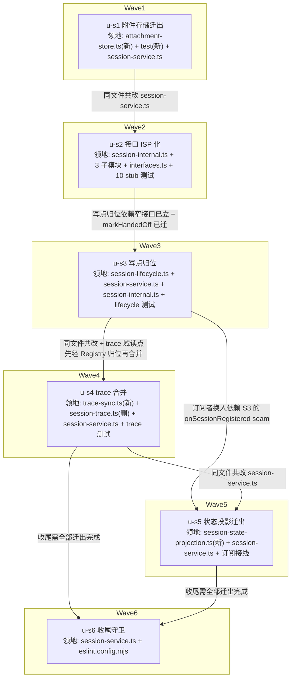

# SessionService 深化重构 实施计划

基线: 4589d0262 | 来源设计: docs/design/session-service-deepening.md | 日期: 2026-09-02

## 0 章节映射

| 内容 | 设计文档实际位置 |
|------|--------------|
| 背景/目标 | §1 背景目标（1.3 设计目标 G1-G4 / 1.4 In scope · Out of scope） |
| 终态/机制 | §3 解决方案（3.1 终态模块地图 / 3.2 方案对比 / 3.3 关键决策 D1-D6 / 3.4 错误与恢复 / 3.5 探针清单 P1-P5） |
| 验收场景表 | §4 验收（4.1 Slice 级等价性验收 / 4.2 整体收口验收场景 A/B/C / 4.3 投入说明） |
| 下一层拆分 | §5 下一层拆分（S1-S6 slice 表 + 文件改动地图） |
| 待验证检查点 | §5 末「待验证检查点」（P2 耦合面 / sessions Map 读写点清单 / S6 残余域归属） |

高频引用的补充坐标（计划期实测）：

- 调用点矩阵（lifecycle 13 / dispatcher 6 / scanner 2 / interpreter 3 / handoff 1 / 共享 4）与销毁 9 步时序契约：§3.3 D2①/D2③。
- eslint max-lines override 块：`eslint.config.mjs:74-83`，files 列表含 event-adapter.ts / extension-service.ts / session-service.ts 三项——u-s6 只删第三项（D5：event-adapter 归 C2 候选收尾）。
- ISessionService（56 方法对外接口）：`packages/runtime/src/interfaces.ts:128`。
- ISessionServiceInternal 的 stub 消费面（u-s2 领地依据，grep 实测 16 文件）：定义 `services/session/session-internal.ts`；源侧 `session-service.ts` / `session-lifecycle.ts` / `message-dispatcher.ts` / `session-scanner.ts`（另 `types.ts:10` 仅注释提及）；测试侧 10 文件 = `src/__tests__/{message-dispatcher-bash-race, message-dispatcher-bash, message-dispatcher-compact, message-dispatcher-force-quit, session-lifecycle-options, session-scanner-source}.test.ts` + `services/session/__tests__/{session-lifecycle-create-label, session-lifecycle-rename-inactive, session-lifecycle-thinking}.test.ts` + `services/session/session-lifecycle-gate.test.ts`。
- P2 探针（计划期已完成）：`writeSegmentsMetadata` 方法体（session-service.ts:2381-2427）实测只用 getAttachmentsDir / node:fs / quarantineCorruptFile，零 `this.sessions` / `this.messageBus` / 子模块引用——**通过**，u-s1 三方法全迁。
- 设计引用行号抽查全部吻合（getTraceEntries:1206 / applyContextUpdate:1584 / initializeManagedSession:1916 / registerReplicatedStates:1993 / writeImage:2292 / writeSegmentsMetadata:2381；session-service.ts 现仍 2603 行，零偏移）。
- 设计第 4 轮审查（review.md）两条 SUGGESTION 经逐字核对已在提交版 4572778b9 落文（§3.1 地图行「销毁无 lifecycle 事件——编排 wrapper 在 session-service.ts」；D2③ 与 P4「订阅扇出不设异常隔离、异常直接传播（异常传播路径一致）」），无需实施期补做。

## 1 目标快照（逐字摘录自设计 §1.3 / §1.4）

- **G1 自然家**：新增一个 session 域功能时，存在明显的归属模块，不需要、也不被允许「顺手挂到 SessionService」。
- **G2 测试面收窄**：测 session 域任一概念，stub 面降到个位数方法；单域测试不再需要构造 Facade 全家桶。
- **G3 行为等价**：这是纯重构——renderer、pi、插件系统观察到的行为逐字节不变。
- **G4 不再复发**：拆解完成后有机器守卫阻止 Facade 重新膨胀。

**In scope**：`services/session/` 内 SessionService 与其子模块（lifecycle / dispatcher / scanner / interpreter / extractor 系）的边界归正与逐域迁出；`ISessionServiceInternal` 的 ISP 化；session-service.ts 的行数守卫恢复。

**Out of scope**：① 架构审查报告的其他候选（C2 EventAdapter 协议路由、C3 port 旁路、C4 JsonStore 收编、C5 transport handler 表驱动与胖接口拆分等）各自独立成文，本文只在决策衔接处标注交接点；② renderer 侧任何改动；③ IoC 容器（ADR-0001 明确禁止，不作为候选）。

## 2 单元列表

6 单元与设计 §5 的 6 slice 一对一映射；全链串行（所有 slice 共改 session-service.ts，无并行波次）。每单元一个独立 commit（设计 D6：独立交付、独立回滚）。

| Unit | 职责 | 领地（精确文件路径） | 依赖 | 隔离 | 验收条款 |
|---|---|---|---|---|---|
| u-s1 | S1 附件存储迁出：writeImage / migrateImage / writeSegmentsMetadata 迁出为 attachment-store.ts，Facade 保留一行委托，测试随迁 | 新增 `packages/runtime/src/services/session/attachment-store.ts`；新增 `packages/runtime/src/services/session/__tests__/attachment-store.test.ts`；修改 `packages/runtime/src/services/session/session-service.ts` | — | plain | ① P2 已过（见 §0），三方法全迁，方法体内 eslint-disable 注释原样随迁 ② `cd packages/runtime && pnpm vitest run` 全绿（行为断言零修改 = P3）③ `pnpm typecheck` 绿 ④ attachment-store.test.ts 含边界用例：20MB 上限拒绝、路径穿越拒绝；其 import 不含 session-service ⑤ session-service.ts 行数 2603 → 约 2250（三方法约 350 行净迁出） |
| u-s2 | S2 接口 ISP 化：session-internal.ts 21 方法拆 lifecycle 13 / dispatcher 6 / scanner 2 三窄接口（跨消费者共享 4 方法重复声明、单一实现）；markHandedOff 迁 ISessionService（迁移非新增）；三子模块构造器收窄；stub 测试面收窄、`as unknown as` 强转消失；ISessionServiceInternal 删除 | 修改 `services/session/session-internal.ts`、`session-service.ts`、`session-lifecycle.ts`、`message-dispatcher.ts`、`session-scanner.ts`、`types.ts`（注释随迁）、`packages/runtime/src/interfaces.ts`（markHandedOff +1 行）；stub 测试 = src/__tests__ 6 文件 + services/session/ 4 文件（gate + create-label/rename-inactive/thinking）+ **test/ 目录 14 文件（偏差 #3 补全）** | u-s1 | plain | ① 三窄接口方法计数 13/6/2（接口体 grep 可验；共享 4 = detachSession / getSession / removeSessionEntry / getActiveSummaries）② `grep -r ISessionServiceInternal packages/` 为空（含注释与 re-export）③ `grep -r "as unknown as ISessionServiceInternal" packages/` 为空 ④ vitest 全绿 + typecheck 绿，行为断言零修改 ⑤ scanner 构造器类型可见面 = 2 方法 ⑥ handoff-service 零改动（绑具体类，设计 D2① 实证） |
| u-s3 | S3 写点归位：initializeManagedSession 迁 lifecycle（registerSession：session 对象构造 + sessions.set + onSessionRegistered 同步直发，订阅者组装根接线——S3 期 = Facade 按现状体内顺序 registerReplicatedStates → ensureRecordEntriesCache → reconciler）；sessions Map 所有权随迁 lifecycle；removeSessionEntry 编排权留 Facade wrapper（9 步时序契约，第 ② 步委托 lifecycle 纯删条目）；Facade 残余 ~30 处 `this.sessions` 读点改道 lifecycle 的 ISessionRegistry（Map 只读、元素视图可变语义） | 修改 `services/session/session-lifecycle.ts`、`session-service.ts`、`session-internal.ts`（+ISessionRegistry）；lifecycle 测试随迁/新建：`services/session/__tests__/session-lifecycle-*.test.ts`、`services/session/session-lifecycle-gate.test.ts`、`src/__tests__/session-lifecycle-options.test.ts` | u-s2 | plain | ① P4 探针：create/restore/fork 三路的 Map 注册、onSessionRegistered 扇出、notifySessionCreated 时序逐一一致且同步直发（异常传播路径一致：订阅扇出不设异常隔离）；销毁侧 9 步逐段比对（② 纯删条目；⑥ clearSession 垫底，:350 约束 session.exited publish 先于 clearSession）；destroyAll 不触发 dispose ② `grep -nE "sessions\.(set|delete|clear)" session-service.ts` 为空（写点全在 lifecycle）③ ISessionRegistry 无 set/delete/clear 声明 ④ vitest 全绿 + typecheck 绿，行为断言零修改 ⑤ registerSession 有 lifecycle 直接测试（gate 测试 stub 面 ≤13） |
| u-s4 | S4 trace 合并：Facade 编排半截（1206-1432）+ session-trace.ts 纯函数合并为 trace-sync.ts；补编排层直接测试（当前零覆盖） | 新增 `services/session/trace-sync.ts`、`services/session/__tests__/trace-sync.test.ts`；删除 `services/session/session-trace.ts`、`services/session/__tests__/session-trace.test.ts`（并入 trace-sync.test.ts）；修改 `services/session/__tests__/trace-parity.test.ts`、`services/session/__tests__/fetch-current-prompt.test.ts`（仅当其 import session-trace 需随迁）、`session-service.ts` | u-s3 | plain | ① session-trace.ts 消失，纯函数与编排半截同居 trace-sync.ts ② 编排层有直接测试覆盖（现状零覆盖，新增即达标）③ vitest 全绿 + typecheck 绿，行为断言零修改（trace-parity / trace 等价测试是现成行为守卫）④ session-service.ts 无 trace 编排残留（syncTraceEntries / pollOnceForPromptEntry / ensurePromptBaseline 等方法签名落位 trace-sync.ts） |
| u-s5 | S5 状态投影迁出：replicated states 快照族（1993-2197）+ context/usage 副作用域（applyContextUpdate:1584 / handleTurnEndSideEffects:1620 / fetchAndBroadcastContext:2271）迁 session-state-projection.ts；onSessionRegistered 订阅者从 Facade 换为 projection 模块自身；interpreter 消费的 3 方法（applyContextUpdate / handleTurnUsageSideEffects / handleTurnEndSideEffects）组合根接线随迁 | 新增 `services/session/session-state-projection.ts`、`services/session/__tests__/session-state-projection.test.ts`；修改 `services/session/session-service.ts`、`services/session/session-lifecycle.ts`（订阅接线换人）；组合根接线点以实施首步核验为准（设计 D2① 标注为 Facade 组合根接线面——event-interpreter.ts 本体预期不动，动到则上报）；`replicated-state.ts` / `replicated-states.config.ts` 仅当 import 需要随迁 | u-s3, u-s4 | plain | ① 快照投影族 + 副作用 3 方法实现落位 projection 模块，Facade 一行委托 ② onSessionRegistered 订阅者换为 projection 模块（S3 seam 的设计兑现，订阅体内顺序保持现状等价）③ vitest 全绿 + typecheck 绿，行为断言零修改 ④ projection 模块有直接测试 |
| u-s6 | S6 收尾：残余域（history 缓存族 / record 缓存族 / launch 参数组装 / 模型切换）逐域评估归属或留 Facade 并写明理由；移除 max-lines override 的 session-service.ts 项 | 修改 `packages/runtime/src/services/session/session-service.ts`、`eslint.config.mjs` | u-s4, u-s5 | plain | ① P5 探针：`wc -l session-service.ts` ≤ 500 ② `eslint.config.mjs` override（74-83 行块）files 列表删 session-service.ts 项、保留 event-adapter / extension-service 两项 ③ 根 `pnpm run lint` 绿 ④ vitest 全绿 + typecheck 绿 ⑤ 残余域评估结论逐域落档本计划 §7（迁出 or 留下 + 理由，依据设计检查点 3 不预判） |

执行注记：u-s2 领地 17 文件超出单次 subtask ≤5 文件约束，派发时拆连续 sub-dispatch（源侧收窄 6 文件 → stub 迁移 10 文件分两批），全部完成后按单元整体一个 commit。其余单元单次派发可覆盖。

## 3 DAG 图

- **全链串行**：6 slice 全部共改 session-service.ts（设计 D6 本就按独立交付排序），无并行波次。
- **u-foundation 缺席说明**：共享契约（session-internal.ts）的整形发生在 u-s2（链上第 2 节点、先于全部消费者单元），不存在需要先于一切单元建立的独立类型模块，故不单设。
- **worktree 决策**：全部 plain。判据（references/dag-authoring.md 决策表）：本分支 refactor-runtime-architecture 为本次重构专用分支、单元全串行无写冲突面、无实验性整体废弃风险（每 slice 独立 commit 回滚即等价物）。

## 4 测试策略

命令实读自 `packages/runtime/package.json` scripts 与项目 AGENTS.md：

- **增量**（单元开发期，dev subagent 自跑）：`cd packages/runtime && pnpm vitest run <受影响测试路径>`；类型改动伴跑 `pnpm typecheck`。
- **单元门**（每 slice commit 前，主 agent 核验重跑）：`cd packages/runtime && pnpm vitest run`（runtime 全量 = P3 探针「行为断言不修改而通过」）+ `pnpm typecheck`。
- **收尾门**（u-s6 与阶段 5 Gate A）：`cd packages/runtime && pnpm vitest run` + `pnpm typecheck` + 根 `pnpm run lint`（max-lines 守卫在根 eslint 配置）。
- **真实场景验收**（阶段 5 Gate B，剧本 = 设计 §4.1 + §4.2 场景 A/B/C + 待验证检查点回填）：`pnpm dev` 真实 app 双分支行为比对（新建 → 发消息 → 发图 → fork → 关闭重开 → 删除；S1 含图片落盘与 landing 降级专项）；场景 C 负向守卫验证（50 行无关注释被 pre-commit 拦截）。
- 框架红线：vitest（禁 `node:test` / `tsx --test`）；timer 测试用 fake timers；行为断言零修改是 P3 的定义——stub 类型引用与 stub 成员面允许随接口拆分随迁（设计 P3 措辞）。

## 5 合理偏差登记表

| # | 偏差 | 理由 | 登记时间 |
|---|---|---|---|
| 1 | 设计 §4.1 要求「每 slice 真实 app 双分支比对」；本计划落为每 slice P3 机器门（runtime 全量 vitest + typecheck）+ 阶段 5 Gate B 统一执行 §4.1/§4.2 全部真实场景（含 S1 附件 landing 降级专项） | 每 slice 一次 Electron 双分支比对 = 12 次全量 app 实跑；slice 均独立 commit，Gate B 场景 fail 可 revert 精确定位到 slice，回滚粒度不变。风险：slice 间交互引入的偏移到 Gate B 才暴露——由全量套件 + 独立 commit 兜底（用户已确认接受） | 计划期 |
| 2 | 设计 §2.1/D1 预估附件域「约 310 行 / 12%」、计划验收条款 ⑤ 据此写「2603 → 约 2250」；u-s1 实测三方法合计约 148 行 + formatTimestamp 辅助 8 行，2603 → 2467（净 -136，含委托/接线 +18） | 原预估系 2292→EOF 区域口径，含 history 域读侧 readSegmentsMetadataFile（被 :982/:1017 消费，不属附件域不可迁）与尾部辅助代码。三方法全迁事实成立（方法体逐字随迁、一行委托、契约不变），S6 ≤500 行目标不受影响。设计文档 §2.1/D1 已同步修正（doc_error 处理） | u-s1 交付 |
| 3 | u-s2 领地最初只枚举 src/ 下 10 个 stub 文件；批 2 后全量 grep 发现 packages/runtime/test/ 目录另有 14 个 stub 文件（contract-hardening / dispatcher-bus / fork-orphan-cleanup / message-dispatcher-precheck / message-dispatcher-silent-abort-destroy / runtime-wiring / session-lifecycle-attach / session-lifecycle-deletebycwd / session-lifecycle-preset / session-lifecycle-rename / session-lifecycle-w11 / session-lifecycle-w5 / session-lifecycle / session-scanner-preset） | 计划期 grep 范围漏扫 test/ 目录（枚举错误，非范围变更）——验收条款②「grep -r ISessionServiceInternal packages/ 为空」本就隐含要求这批文件清零；dev 按领地锁定上报后由主 agent 扩充领地。u-s2 领地已同步补全 | u-s2 批 2 后 |
| 4 | u-s3 波及 4 个领地外文件最小改动（13-25 行/文件）：test/contract-hardening（stub 删 initializeManagedSession + 构造第 6 参）、test/fork-orphan-cleanup（同前 + initFails 注入点迁 adapterFactory throw）、test/workspace-message-handler（2 处构造第 6 参）、__tests__/fetch-current-prompt（busy 注入原戳私有 sessions Map 强转路径，改真注册 + isGenerating 置位） | SessionLifecycle 构造器加 registerDeps 参 + ILifecycleSessionOps 移除 initializeManagedSession 的语言级波及，编译期必然；fetch-current-prompt 的「测试戳私有字段」路径不在计划期 grep（this.sessions 源码读点清单）覆盖面内——领地枚举缺口非范围变更。dev 上报 blockers 后主 agent 裁决批准，diff 逐文件核验为最小 | u-s3 交付 |
| 5 | u-s4 波及 1 个领地外文件 1 行：src/interfaces.ts:39 SessionTraceSnapshot type import 路径 session-trace → trace-sync | 删除 session-trace.ts 后该 type-only import 编译期必然断裂，不改动则 typecheck 必红，与验收 1/4 冲突；与偏差 #4 同类（编译期必然波及）。主 agent 复核 diff 仅一行路径替换后批准 | u-s4 交付 |
| 6 | u-s4 域内共享 helper isEntryNotFoundError 迁 trace-sync.ts 并 export（Facade history/record 域仍消费，经 import） | 该 helper 为 pi get_entries(since) 错误判定，非 trace 域独占；单一定义放 trace-sync + Facade import 优于 Facade 留副本（禁重复实现）；Facade→trace-sync 依赖方向已存在，无新增环 | u-s4 交付 |
| 7 | u-s4 未承接原 session-trace.test.ts 的 5 个 Facade 级用例：getTraceEntries WS reply 路由 ×2 + error envelope ×1 + fork header parentSession 两形态透传 ×2（构造完整 Facade，与 G2「测试 import 不含 session-service」冲突；RPC 补拉 ×2 已有模块级等价替代 session-model-control.test）。初版误记为「3 个」且替代守卫声称过宽（fetch-current-prompt 只覆盖 fetchCurrentSystemPrompt 链路）——阶段 3 一致性审查 R2 纠正 | parentSession ×2 已在阶段 4 修复循环补齐模块级用例（trace-sync.test +2，真实录制首行断言）；RPC 补拉 ×2 模块级替代经审查确认成立；**WS reply 路由级 getTraceEntries case 仍缺**（session-message-handler 测试无此 case）——登记 §7 残留风险，规则 7 的 WS 级守卫由 transport 层测试体系另行补位 | u-s4 交付，阶段 3 修正 |
| 8 | u-s6 相 1 评估（行级对账，eslint 计数口径 = skipBlankLines+skipComments）触发领地扩充与六域迁出裁决：session-service.ts 计数 932（物理 1862），六域迁出（record 缓存族+读侧→session-records.ts / history→并入 history-rebuild-cache.ts / fork 编排→lifecycle / launch→launch-params.ts + lifecycle buildPresetClientOptions 连带 / 模型控制→独立模块）后残余 ≈438，P5 稳过；死代码 _findAgentCallFile（39 行零引用）删除不迁移；index.ts:406 invalidateRecordEntries 组合根接线改道 | 设计检查点 3「S6 残余域归属以 S1-S5 完成后实际行数构成决定，不预判」的兑现路径；计划期 u-s6 领地仅列 2 文件是「评估后再定」的占位，非范围变更。lifecycle lint warning（512>500）以 launch 域整体迁出消解（512→约 477，真拆分优于 override——D5 被否形态教训），override 仅作实测不过时 fallback。根 lint = `eslint . --max-warnings 0`，该 warning 不解决则 u-s6 收尾门必红 | u-s6 相 1 后 |
| 9 | u-s6 批 1 波及 3 个领地外测试文件：test/session-service.test.ts（encodeDirectiveText import 改道 session-records，export 随迁编译期必然）、test/session-service-agent-call.test.ts 与 -path.test.ts（spy 观察点从 Facade 方法随迁到 records 实例——断言绑定的内部互调结构迁移后在模块内部，断言值与用例数零增删） | 与偏差 #4「断言观察点随迁语义等价」/#5「export 随迁编译期必然」同类；diff 复核最小。附带裁决记录：index.ts 组合根保持经 Facade 一行委托到达 records（物理直连需暴露私有字段违 D3，u-s5 先例）；日志前缀保留 [session-service]（P3 严格可观察等价，多数派先例；trace-sync 的 [session-trace] 前缀不回改，如需统一另立微项） | u-s6 批 1 后 |
| 10 | Gate B 场景 A（G1 演练）实测：新增 renderer 可见域能力的最小**可编译**闭合 = 5 文件，非设计 §4.2 场景 A 声明的 4 文件——新 WS 消息类型必须在 packages/shared/src/protocol.ts 注册 ClientMessageType union + ClientMessageMap payload（缺省时 typecheck 真实失败 TS2820/TS2678/TS2339），协议注册是 IDE/编译期对「case 字符串 ↔ payload 类型」的防漂移锁，非业务逻辑扩散 | G1 的实质判定（SessionService 仅 +1 行委托、逻辑归域模块、模块直测）完全达成；strict 4 文件计数与 typecheck exit 0 物理互斥属设计表述口径问题（协议注册文件在 session-service 拆解语境外）。与设计 §4.2 原文「③④ 的形态在 C5 候选落地后会变为域接口注册」演化方向一致；设计文档 §4.2 场景 A 以本条为准 | 阶段 5 Gate B |

## 6 状态表

| Unit | 状态 | 轮次 | 证据指针 |
|---|---|---|---|
| u-s1 | committed | 1 | 全量 vitest 383 files / 4103 tests passed exit 0（/tmp/u-s1-vitest-r2.log）+ typecheck 0；条款④实测通过（测试 import 无 session-service）；首次全量跑 pi-settings-store「busy-waits real subprocess」用例 1 次 fail，单跑 3/3 绿 + 文件零改动，判定环境 flake 非回归 |
| u-s2 | committed | 1 | 六批交付：源侧收窄（调用点矩阵实测 13/6/2 + 共享 4 对账 = 21）→ stub 迁移 24 测试文件（src/__tests__ 6 + test/ 14 + session 域 4）→ 宽接口删除 + markHandedOff 迁 ISessionService。单元门：全量 vitest 383/4103 绿 exit 0 + typecheck 0；条款②③ grep 全库归零（主 agent 独立复核）；gate 测试 stub 面 = 13 强转消失；handoff-service 零改动。消强转暴露并修复 6 处被掩盖的 stub 形状缺陷（均无行为断言消费） |
| u-s3 | committed | 1 | registerSession 迁入 lifecycle（含 sessions Map 所有权 3 写点 + onSessionRegistered 同步直发）+ ISessionRegistry 4 只读方法（get/has/keys/values）+ Facade 30 读点全改道（映射表落档，4 形态全覆盖无缺口）+ removeSessionEntry 9 步 wrapper（第②步委托 lifecycle 纯删）+ destroyAll 不引入 dispose。单元门：全量 384/4113 绿 exit 0 + typecheck 0；registerSession 直接测试 10 用例（含扇出异常传播/clear 无 dispose）；P4 自验全过、§3.4 降级未触发；偏差 #4（4 波及文件）批准 |
| u-s4 | committed | 1 | trace 域全族（8 方法 + traceLeafCache/traceSyncChains）+ session-trace.ts 纯函数合并 trace-sync.ts（461 行，<500 无需 override）；编排层直接测试 0→25 用例；Facade 三委托 + removeSessionEntry 第⑤步直调 onSessionDisposed；session-service.ts 2454→2217（-237）。单元门：384/4119 绿 + typecheck 0；trace-parity 断言零修改；trace-sync.test import 无 session-service（G2）。偏差 #5/#6/#7 登记（interfaces.ts 单行波及 / isEntryNotFoundError 共享 / 3 个 Facade 级集成用例以替代守卫不承接） |
| u-s5 | committed | 1 | 快照投影族（9 方法 + replicatedStates/lastPublishedStateChanged）+ 副作用 4 方法迁 session-state-projection.ts（503 行）；projection 直订 onSessionRegistered（L318 先于 record/reconciler L319，顺序等价有证据）；removeSessionEntry 第⑤步 projection.onSessionDisposed 并列 traceSync；interpreter 组合根接线核验 = index.ts:345/349/354 经 Facade 委托（index.ts 零改动，event-interpreter 零改动）；Facade 2217→1862（-355）。单元门：385/4135 绿 + typecheck 0；projection 直测 16 用例（G2 import 无 session-service）。偏差：销毁第⑤步 lastPublishedStateChanged 清理位置前移至 recordEntriesCaches 前（域归属 + 两 Map 零交互）；buildStateChangedPayload 参数类型 ManagedSession→IManagedSessionView（只读两字段均有）。预警移交 u-s6：session-lifecycle.ts eslint 计数 512>500 产生 1 warning（u-s3 起存量，hooks 只拦 error 未拦） |
| u-s6 | committed | 1 | 相 1 只读评估（行级对账 + eslint 计数口径澄清）→ 偏差 #8 六域迁出裁决 → 相 2 四批：record 域→session-records.ts（536 行 35 直测）/ history 域→history-rebuild-cache.ts 扩容（343 行 14 直测）/ launch 域→launch-params.ts（175 行 18 直测，连带消解 lifecycle 512 warning）/ fork 编排→lifecycle + micro-提取 resolveEntryIdByTimestamp→session-fork.ts（6 直测）/ model 域→session-model-control.ts（8 直测）。死代码 _findAgentCallFile 删除。**P5 全过**：session-service.ts 2603→1000 物理 / eslint 计数 457 ≤ 500（守卫恢复零 warning）；max-lines override 删 session-service.ts 项（保留 event-adapter / extension-service + [HISTORICAL] 记录）；根 lint --max-warnings 0 exit 0（lifecycle 488 < 500 同步消解）。单元门：全量 389/4216 绿 + typecheck 0 + 根 lint 0。偏差 #9（3 测试文件波及）登记 |

## 7 残留风险与变更历史

- 2026-09-02 计划建立（预检：设计结构四节齐全；对抗式审查第 4 轮 0 must-fix，报告 `docs/design/session-service-deepening.review.md`；两条 suggestion 经核对已在提交版落文）。用户评审确认：切分/隔离/验收条款 + 偏差 #1。
- 2026-09-02 u-s1 committed：附件三方法 + formatTimestamp 迁 attachment-store.ts（187 行）+ 新测试 13 用例（含大小上限/路径穿越边界）；Facade 一行委托；2603 → 2467。偏差 #2 登记，设计 §2.1/D1 行数口径同步修正。
- 2026-09-02 u-s2 committed（六批）：ISessionServiceInternal 21 方法拆 ILifecycleSessionOps 13 / IDispatcherSessionOps 6 / IScannerSessionOps 2（共享 4 重复声明单一实现；fetchAndBroadcastContext 按调用点实测归 lifecycle，与设计被否谱系预言一致）；markHandedOff 迁 ISessionService（迁移非新增）；24 个 stub 测试文件迁移、`as unknown as ISessionServiceInternal` 全库清零、gate 测试强转消失（stub 面 13）。偏差 #3（test/ 目录领地缺口）批 2 后补登。消强转连带暴露 6 处 stub 形状缺陷（async 签名/必填字段），typecheck 修复、无行为断言消费。
- 2026-09-02 u-s3 committed：写点归位落地（设计 §3.4 半深化降级未触发）。registerSession 自 Facade 逐字迁入 lifecycle + sessions Map 所有权（3 写点）；onSessionRegistered 同步直发（Facade 订阅接线，体内顺序与现状逐一等价，扇出不设异常隔离）；ISessionRegistry 只读 4 方法，Facade 30 读点全改道（检查点 2 回填：get 20 / has 6 / keys 1 / values 3，无缺口）；removeSessionEntry 9 步 wrapper 保持（第②步委托 lifecycle 纯删，clearSession 垫底）；destroyAll 不引入 dispose。ILifecycleSessionOps 13→12（initializeManagedSession 迁入后 lifecycle 内部直调）；Facade 保留 initializeManagedSession 一行委托（D3 形态，10+ 测试调用点零修改）。registerSession 直接测试新建 10 用例；4 处断言观察点随迁（语义等价，dev 逐条登记）。偏差 #4：4 个波及文件批准扩领地。session-service.ts 2467→2454。
- 2026-09-02 u-s4 committed：trace 域全族（getTraceEntries / syncTraceEntries / pollOnceForPromptEntry / ensurePromptBaseline / fetchCurrentSystemPrompt 等 8 方法 + traceLeafCache / traceSyncChains + onSessionDisposed 钩子）与 session-trace.ts 纯函数合并为 trace-sync.ts（461 行）；编排层直接测试 0→25 用例（G2：import 无 session-service）；trace-parity 仅 import 随迁、断言零修改；fetch-current-prompt 零改动经委托链路仍绿。session-service.ts 2454→2217。偏差 #5（interfaces.ts 单行 type import 波及）/#6（isEntryNotFoundError 单一定义放 trace-sync 供 Facade 消费）/#7（3 个 Facade 级集成用例以替代守卫不承接）登记。
- 2026-09-02 u-s5 committed：replicated states 快照投影族 + context/usage 副作用域合并迁 session-state-projection.ts（503 行 + 16 直测）；onSessionRegistered 订阅者换 projection 模块自身（订阅顺序等价：播种 → record → reconciler）；销毁第⑤步 projection.onSessionDisposed 与 traceSync 并列；interpreter 3 方法组合根接线核验 = index.ts:345/349/354 经 Facade 委托到达（组合根与 event-interpreter 均零改动，符合 D3）。session-service.ts 2217→1862。**移交 u-s6 裁决项**：session-lifecycle.ts 物理 1090 行 / eslint 计数 512 > 500 → 根 lint 1 warning（零警告政策冲突；u-s3 起存量，不在 max-lines override 三项清单内，设计 §3.1 未给 lifecycle 行数预算）。
- 2026-09-02 u-s6 committed（相 1 评估 + 相 2 四批）：**设计全目标达成**。①行数：session-service.ts 2603 → 1000 物理 / 457 eslint 计数（≤500，守卫恢复）；lifecycle warning 以真拆分消解（launch 域连带 + fork micro-提取到 session-fork.ts，最终 488 < 500，未动用 override）。②六域模块化：session-records.ts / history-rebuild-cache.ts（扩容）/ launch-params.ts / session-fork.ts（micro-提取）/ session-model-control.ts，新直测 4 文件 75+ 用例（全部 G2：import 无 session-service）。③守卫：max-lines override 删 session-service.ts 项（event-adapter 归 C2 / extension-service 保留 + [HISTORICAL] 记录移除溯源）；根 lint --max-warnings 0 exit 0。④死代码 _findAgentCallFile（39 行零引用）删除。⑤Facade 终态 = 装配 + 委托（D3 兑现）：残余构成 = 装配/构造/setter + 一行委托 + 已裁决留驻杂项（toSummary/findScannedSession 共享 helper、fetchContext、reload 族等）。⑥偏差 #8（六域迁出裁决 + 领地扩充）/ #9（3 测试文件波及）登记；裁决记录：index.ts 组合根经 Facade 委托到达域模块（D3 一致 + u-s5 先例）、日志前缀保留 [session-service]（P3 严格等价）。
- **流水线状态**：六单元全部 committed（4f62691b2 → 19e946709 → 11e854d91 → 86813670a → b9da19557 → 本 commit）。转入阶段 3 一致性审查。
- 2026-09-02 阶段 3 一致性审查（第 1 轮，三区并行独立 reviewer：R1 接口与写点 / R2 域模块迁移 / R3 守卫与测试面）：reasonable 26 条（全部入册——含 9 步时序逐段核验、订阅顺序等价、八模块自包含零 import、守卫注入探针实证 +50 行代码被拦截）；unreasonable 6 条（R1：ILifecycleSessionOps 死声明 12≠10；R2：trace-sync 重复 JSDoc / parentSession 用例丢失 / records 注释失真；R3：pi-protocol 溯源失真 / contract-hardening 计数过时）→ 阶段 4 修复批次 21 文件清零（全量 389/4218 绿）；doc_errors 6 条 → 主 agent 修订设计文档（§3.1 终态地图回填 S6 五模块 + 计数口径 / §4.2 场景 C 机制对齐（代码素材 + 根 lint/CI 拦截点）/ §5 文件改动地图重写 / P5 探针口径与状态 / 附带 interfaces.ts 注释由修复批次清理）。偏差 #7 措辞按 R2 纠正同步修正。
- 2026-09-02 阶段 4 修复批次 committed（3f833d176，23 文件 97+/84-）：6 条 unreasonable 全部清零——R1 死声明收敛（session-internal.ts ILifecycleSessionOps 删 detachSession/getSession → 10 成员，11 个 stub 测试文件涟漪同步清零）；R2（trace-sync.ts 重复 JSDoc 删除 + parentSession ×2 用例补齐 trace-sync.test + session-records.ts getExtensionPaths 注释失真修正）；R3（pi-protocol.ts DriftGuard 溯源修正 + interfaces.ts _findAgentCallFile 死引用清除）。doc_errors 6 条设计文档同步修订（§3.1/§4.2/§5/P5）。全量 389 files / 4218 tests 绿 + typecheck 0。
- 2026-09-02 定向复审（阶段 4 收敛门，只审 638c0921a..3f833d176 影响面）：**verdict pass**——7 项修复逐项核验 pass；涟漪一致（ILifecycleSessionOps 10 成员全消费点收敛：lifecycle 零 svc.getSession/detachSession 消费、dispatcher :264/:467 为 IDispatcherSessionOps 活实现保留、ISessionRegistry 在 lifecycle 真实使用）；无夹带（23 文件逐一定性零无关改动）；复跑 typecheck exit 0 + trace-sync.test 27 绿 + gate 及本批 14 测试文件 127 用例全绿 + `eslint session-service.ts` 单文件 exit 0（P5 机器实测）。3 条 doc_errors 均为派发转述层文件名错位（实际修复位置：A=session-internal.ts 非 session-service.ts；C=trace-sync.test.ts 非 session-records.test.ts；D=pi-protocol.ts/interfaces.ts/session-records.ts 非 session-state-projection.ts/history-rebuild-cache.ts），修复本体均正确，在此澄清台账。unreasonable 清零 → 转入阶段 5 双级验收。
- 2026-09-02 阶段 5 双级验收（入口门三机械核验过：6 单元 committed / 清零 commit 可见 / 首轮验收）：
  - **Gate A 整体测试验收（subagent）：全绿**。runtime 全量 vitest 389 files / 4218 tests exit 0（143.5s，与 §6 终态一致）+ typecheck 0 + 根 lint（eslint . --max-warnings 0）exit 0；extensions 三连不执行（diff 零触及）；零容忍扫描：skip/SKIP_* 零命中、vitest 配置零改动、eslint-disable 新增 5 处全带 `-- 理由`（attachment-store ×3 + session-state-projection ×1 超出预登记 2 处，核对均非静默吞错，仅登记）；覆盖矩阵 6 单元 × 60 文件全归属，无人认领改动区无（唯一领地外源文件 pi-protocol.ts 为阶段 4 修复批次合法产物，有 real-pi 测试 + 编译期锁守卫）；预登记 flake 未触发。
  - **Gate B §4.2 整体收口（subagent）：三场景全 pass**。场景 A（G1 演练）：真实改动演练 trace-sync 加 getTraceDepth + 接口 1 行 + Facade 仅 1 行委托 + case 1 个，SessionService 零逻辑挂载——G1 实质达成；**偏差记录**：strict「恰好 4 文件」与 typecheck exit 0 物理互斥——新 WS 消息类型必须在 shared/protocol.ts 注册（ClientMessageType union + ClientMessageMap payload，第 5 文件），最小可编译闭合 = 5 文件，与设计 §4.2 预告的「③④ 形态在 C5 落地后变为域接口注册」一致（合理偏差，入登记表 #10）。场景 B（G2）：attachment-store 直测 13 用例绿（import 无 session-service）、`as unknown as ISessionServiceInternal` 全库零命中、gate 测试 stub = 10 方法无强转（= 窄接口全集 ≤13）、全量 vitest 绿。场景 C（G4 负面验证）：class 体内注入 62 行真实代码（1000→1066 物理行），根 lint exit 1 且全仓唯一违规即 session-service.ts max-lines（520 > 500）——守卫真实生效；恢复后 eslint 单文件 exit 0。
  - **Gate B §4.1 真实 app 双分支比对（主 agent 亲测，main worktree vs 本 worktree 真实 pnpm dev + CDP 浏览器操作，无 mock）：全部环节行为一致**。新建 session / 文本消息 → LLM 回复 / 图片消息 landing（attachments/<sid>/<uuid>-image.png, needs-migrate=false）/ 图片内容分析（两轮结论同为 #C83C3C 红色）/ fork（fork 模式 → 分支 session 继承 fork 点前历史 + 独立回复 + 主线插入「已在新分支提问」标记；live 标记 reload 后消失两轮一致）/ 关闭重开 restore（侧栏恢复 + fork 自溯源标注 + 消息流 reload 一致）/ 删除（两段式确认：删除 →「确认删除？」→ 执行）。S1 landing 降级专项两轮实测：无 session 粘图 → tmpdir 暂存（needs-migrate=true）→ 发送后迁移至 attachments/<新 sid>/，sha256 逐字节一致（ba2015c0…）。LLM 工具选择差异（vision skill vs 直接 read）属模型非确定性，非 app 行为差异。
  - **验收期新发现（非本重构范围，登记残留风险）**：dev worktree 残留 `apps/electron/resources/pi/pi-darwin-arm64`（prepare-pi-resources.sh 产物经 git-cwt 缓存 symlink 注入，Bun 编译单文件 binary）时，**fork 链路 pi 子进程 crash**（Bun v1.3.14 + proper-lockfile mtime-precision.js Proxy TypeError，exit 1，普通会话不受影响）。pi 定位逻辑（find-pi-executable.ts）两分支逐字一致、`git log main..HEAD` 该文件零改动——非重构回归，归属 pi 打包产物 × Bun 运行时兼容性；**打包版 app 使用同款 Bun binary，fork 功能疑似同样受影响，需独立排查**（验收期已将该残留 symlink 移除使 dev 回退 node_modules pi，缓存本体 ~/.pi-binary-cache 完好，恢复命令 `ln -s ~/.pi-binary-cache/pi-0.84.4-darwin-arm64/pi-darwin-arm64 apps/electron/resources/pi/pi-darwin-arm64`，修复前不建议恢复）。附带环境动作：main worktree 补跑 pnpm install（pi-file-lock 新包链接缺失致基线 runtime 首次启动失败，装后正常）；两轮测试 session 已全部删除清理。
- 残留风险登记（阶段 3 产出）：
  - **WS reply 路由级 getTraceEntries case 缺失**（偏差 #7 范围）：session-message-handler 测试无 getTraceEntries 的 WS 级 case，规则 7（payload 带 sessionId）的 transport 级守卫对该方法无覆盖——行为等价由实现逐字随迁 + 模块级 27 用例守卫，transport 级补位建议列入 C5 候选范围。
  - session-lifecycle.ts eslint 计数 488（距 500 守卫余量 12）——设计性贴线（fork 编排内迁的自然结果），未来新增触发信号时须拆分或论证，属守卫正常工作而非缺陷。
  - check_pi_type_leak.py 的 strip_comments 不剥离单行闭合块注释（`/** ... */` 单行形态）——已以注释表述规避，hook 本体缺陷修正待独立微项（AGENTS.md lint 原则：规则误报修正规则本体）。
  - 构建产物 apps/electron/dist/runtime/index.cjs 残留旧 bundle 的 ISessionServiceInternal 字样——非源码，下次构建自然刷新。
- 残留风险追加：pi-settings-store.test.ts「busy-waits and acquires after a cross-process holder releases (real subprocess)」在全量并发下偶发 flake（u-s1 验收期观测 1 次；单跑 3/3 稳定绿、文件零改动、域无关）——后续单元门遇到同名失败按 flake 判定流程处理（单跑复验 + 文件零改动核对），不阻塞但计数。
- 风险预登记：
  - **u-s3 是设计认定风险最高一刀**（写点迁移 + 汇聚拆分 + 读点改道三位一体）。失败降级 = 设计 §3.4 末行半深化降级（写点留 Facade、窄接口成果保留）；若触发，u-s5 形态按设计 §3.4 降级分支调整并在此登记。
  - **u-s5 组合根接线点位置**实施首步核验（预期 Facade 内接线，event-interpreter 本体不动；动到即上报偏差）。
  - **S6 残余域归属**不预判（设计检查点 3），以 S1-S5 完成后实际行数构成决定。
  - **测试红 30 分钟定位不到** → 整体 revert 该 slice 回绿基线（设计 §3.4）；同单元 dev→fix 超 2 轮未绿 → 冻结升级用户（dev-flow 关键约束）。
