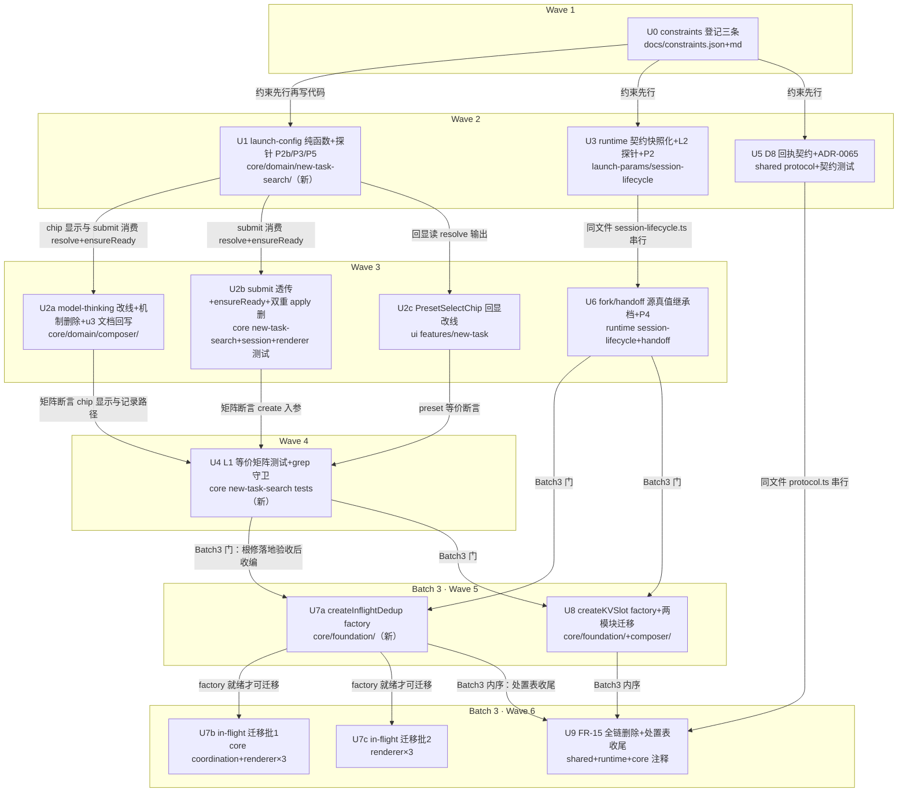

# 状态真值同步架构优化 实施计划

基线: 7fd3d100e | 来源设计: docs/design/state-truth-sync-architecture.md（v4） | 日期: 2026-09-08

审查证据（阶段 0.3）：`.review/design-review-state-truth-sync-r4.md`（主审 0 must-fix, 2 suggestions）+ `.review/design-review-state-truth-sync-impact-r4.md`（影响面 0 must-fix, 2 suggestions）——v4 附录声明 R3/R4 suggestions 全部当轮修完。

## 0 章节映射

| 内容 | 设计文档实际位置 |
|------|--------------|
| 背景/目标 | §1 背景目标（1.1 问题定义 / 1.2 设计目标 G1-G4 / 1.3 Scope） |
| 终态/机制 | §3 解决方案（3.1 终态与交互样例 / 3.2 方案对比 / 3.3 关键决策 D1-D10 / 3.4 探针清单 P1-P5） |
| 验收场景表 | §4 验收（V1-V11 真实场景表，含验证环境说明） |
| 下一层拆分 | §5 下一层拆分（Batch 1 U0-U4 / Batch 2 U5-U6 / Batch 3 U7-U9 + 文件改动地图 + 待验证检查点） |
| 待验证检查点 | §5 末尾「待验证检查点（诚实标注）」5 条（⛔ P2/P2b/P3/P4 + D2 序产品裁决） |

关键锚点勘误（侦查实测 vs 设计文档标注，已核实）：
- `flow.ts` 实际路径 = `packages/core/src/domain/new-task-search/flow.ts`（submit 透传 :264 / C-W4-3 :275-278）
- `handoff-service.ts` = `packages/runtime/src/services/handoff-service.ts`（create 调用 :273-278）
- `preset-service.ts` = `packages/runtime/src/services/preset-service.ts`（getCwdDefault 族 :418-450）
- `session-binding-fields.ts` = `packages/runtime/src/infra/pi/session-binding-fields.ts`（BINDING_FIELDS :87）
- `readEffectiveModelFromState` 实际在 `restore-seeding.ts:159-177`（设计标 :212-244 漂移）
- `model-thinking.ts` stagingModel ref 实际 :122-123；记录 watch :331-348；follow watch :281；显示链 :209

## 1 目标快照（逐字摘录）

> **用户看到的配置就是实际生效的配置，且这条等价性由结构保证、由机器守卫，不再靠人肉纪律。**

**Q（问题）**：如何让「显示值 ≡ 生效值」成为结构性成立（by construction）而非逐点修补出来的性质，同时把对账机制收敛到「只为真正的外部异步真值服务」的最小核心？

**A（答案）**：单一解析层（landing 配置的显示与创建消费同一 resolve 输出）+ 等价性机器守卫（显示 ≡ 创建入参 ≡ pi 读回值，三段等价进测试）+ 改状态回执契约机器化 + 对账机制三分处置。

**设计目标**：
- **G1 所见即所建**：landing 页 chip 区显示的模型/档位/预设，就是发送后新 session 实际生效的配置；trace 与对话流 composer 必然一致（构造性一致，非对账出来的一致）。
- **G2 改状态即见生效值**：任何「请求值 ≠ 生效值」的改状态操作（pi 钳制档位、pattern 引擎换模），UI 从回执生效值更新，永不显示请求值假值；这条纪律从人肉执行升级为机器强制。
- **G3 对账只留核心**：全库对账机制按「为外部异步真值服务（保留）/ 同构重复（收编为共享原语）/ 根修后失去存在理由（删除）」三分处置；新增 session 级状态不再需要手工发明对账。
- **G4 复发有机器拦截**：「显示 ≡ 生效」等价性进入测试与 runtime 对账探针，未来任何新链路引入发散时 CI/dev 即刻拦截，不再活到用户手里。

**In scope**（对应 C1-C5）：C1 landing 生效配置单一解析层（model/thinkingLevel/presetId/cwd）；C2「显示 ≡ 生效」等价性守卫（测试层 + runtime 对账探针）；C3 对账机制三分处置与两族共享原语抽取（in-flight 去重族、KV 单键族）；C4「改状态必回生效值」契约机器化 + 乐观/回执裁决标准；C5 fork/handoff 双入口模型继承语义统一；landing cwd 两空补 toast（D10-E7）随 C1 一并处理。

**Out of scope**：已建 session 的模型/档位切换链路（armed 意图族保护 pi 异步事件时序，保留不重构，仅受 C3 处置框架登记）；打包/环境边界家族；消息流 seq/reconcile 机制；pi 源码（MANDATORY 不改 pi）。

## 2 单元列表

| Unit | 职责 | 领地（精确文件路径） | 依赖 | 隔离 | 验收条款 |
|------|------|----------------------|------|------|----------|
| U0 | constraints.json 登记三条新约束（landing 配置单一解析点 C-rl-* / mutation 回执契约机器化 / 对账三分处置框架，FR-15 随 U9 删除在内注明）+ `node scripts/render-constraints.mjs` 重生成 md | docs/constraints.json, docs/constraints.md | — | plain | ① json parse 合法且新约束含 id/scope/authority/enforcement；② render-constraints 跑通且 md 含新条目；③ 既有 91 条不丢失 |
| U1 | core：`launch-config.ts` 新模块——`resolveLaunchConfig` 纯函数（D2 字段优先级序 + D4 lastUsedModel 有效性校验链内跳过 + provenance 标签 explicit/preset/lastUsed/memory/default）+ `isFactoryFullPreset()`（D3 出厂判定，10 个 launch 生效字段全集 + TS 映射类型穷尽守卫）+ `ensureLaunchDataReady()`（D1 五数据源就绪聚合）+ 单测（含 ⛔ 探针 P2b 覆写翻转/数组字段比对、P5① KV 延迟响应式、D2 序矩阵）+ ⛔ 探针 P3 实跑（本地 pi CLI rpc 模式死模型 create 观察，结论进汇报；若静默换模 → 上报由主 agent 决定 U3 增补校验） | packages/core/src/domain/new-task-search/launch-config.ts（新）, packages/core/src/domain/new-task-search/launch-config.test.ts（新） | U0 | plain | ① `cd packages/core && pnpm test` 绿（新增用例含 P2b 三字段覆写翻转 + P5① 延迟 KV 响应式断言 + D2 全序矩阵 + D4 失效跳过链内回落）；② `cd packages/core && pnpm typecheck` 绿；③ P3 探针结论（报错 or 静默换模）写入汇报，探针脚本不留仓库 |
| U2a | core：model-thinking.ts landing 分支改线（chip 显示读 resolveLaunchConfig 输出）+ 删 landing auto 值机制全套（follow watch :281 / localAuthored :148-154 / landing 分支 armed 设立 onModelSelect :377-393 landing 支 / 预载补写 :283-296）+ 删「生效即记录」watch 及纪元/第三形态守卫（:298-348）+ 记录点收窄为 onThinkingSelect（三分支统一：landing 记当时选中模型 / 已建记 session 当前模型 / staging 记 stagingModel）+ model-thinking.test.ts 重写（跟随 describe :681 / 记录 watch describe :756 / Gate B :836 族重写为 authored-only 语义）+ 同 commit 回写 docs/design/model-thinking-level-memory.md（C-proc-10：D2 机制废除登记 + 变更历史 + staging 试选留痕刻意反转声明） | packages/core/src/domain/composer/model-thinking.ts, packages/core/src/domain/composer/model-thinking.test.ts, docs/design/model-thinking-level-memory.md | U1 | plain | ① `cd packages/core && pnpm test` 绿（model-thinking.test.ts 全量重写后，已建态 armed 族用例保留绿——V8 回归线）；② grep 结构断言：model-thinking.ts 无 `followRememberedOrDefault` watch 注册、无记录 watch（记录仅 onThinkingSelect 路径）；③ `node scripts/check-doc-symbol-drift.mjs` 绿；④ u3 文档含 authored-only 废除条目与变更历史 |
| U2b | core+renderer：flow.ts submitFirstMessage 改为 `await ensureLaunchDataReady()` + 透传 resolveLaunchConfig 解析终值（modelOverride/thinkingLevel 恒非空、presetId 按 D3 透传——出厂 builtin:full 输出 undefined 不透传）+ 删壳层 C-W4-3 setThinkingLevel（:275-278）+ 删 create-session-flow.ts step 7 applyModel（:227-228）+ 三测试更新（flow.test.ts TC-5 / create-session-flow.test.ts TC-2/TC-4 / submit-firstmessage-createflow.test.ts） | packages/core/src/domain/new-task-search/flow.ts, packages/core/src/domain/new-task-search/__tests__/flow.test.ts, packages/core/src/domain/session/create-session-flow.ts, packages/core/src/domain/session/__tests__/create-session-flow.test.ts, packages/renderer/src/__tests__/composables/submit-firstmessage-createflow.test.ts | U1 | plain | ① `cd packages/core && pnpm test` 绿；② `cd packages/renderer && pnpm test` 绿；③ create-session-flow.test.ts 无 applyModel 编排断言（step 7 已删）；④ flow.test.ts 断言 submit 在 ensureLaunchDataReady 后 create 入参 = 加载后 resolve 输出（P5② 窗口语义） |
| U2c | ui：PresetSelectChip.vue 回显改读 resolveLaunchConfig 输出（废 B6「回显≠透传」本地 echo ref :81 与 onMounted 仅回显 :139-146；chip 显示 = 解析输出 presetId，provenance 区分 explicit/default） | packages/ui/src/features/new-task/PresetSelectChip.vue | U1 | plain | ① `cd packages/ui && pnpm test` 绿（若有该组件用例）；② `cd packages/ui && pnpm typecheck` 绿；③ 组件无本地 selectedPresetId echo 状态，回显值来自 resolve 输出 |
| U2d | （计划增补）壳层接线收口：composer-shell.ts 注入 ModelThinkingDeps.launchData（providers/presets/defaultPresetId getters）+ useNewTaskFlow.ts 注入 ports.launchConfig（presetStore refs + loadPresets + settings 单例 getters，~15 行）+ 清理死代码（CreateSessionFlowCtx.applyModel 字段与壳层构造、ports.ts SessionFlowPort.setThinkingLevel 零调用方法）——不接线则显式 preset 透传处于回归态（U2b deviation）且 landing 显示链退化（U2a deviation），lastUsedModel 的 D4 校验也依赖 providers 能力表 | packages/renderer/src/composables/panel/composer-shell.ts, packages/renderer/src/composables/features/new-task/useNewTaskFlow.ts, packages/core/src/domain/session/create-session-flow.ts, packages/core/src/domain/new-task-search/ports.ts | U2a, U2b | plain | ① `cd packages/core && pnpm test && pnpm typecheck` 绿；② `cd packages/renderer && pnpm test` 绿；③ 壳注入非空有测试断言（launchData/launchConfig 端到端到达 resolve）；④ applyModel/setThinkingLevel 死字段删除后全库 grep 零残留引用 |
| U3 | runtime：D5 契约注释强化（launch-params.ts buildPresetClientOptions :160-180 与 session-lifecycle.ts resolveCreateLaunch :433-451 的 override 语义注释——landing 路径恒传解析终值，fallback 链保留服务 fork/restore/agent-managed 入口）+ L2 对账探针（readBackCreateState :464-493 增读回值 vs create 入参比对，不一致时 `[launch-config] effective mismatch: requested=… effective=…` 结构化 warn，≤1 行/create）+ ⛔ 探针 P2 实跑（runtime 单测：merge 后 `getPreset('builtin:full')` 非 fixture 与无 preset 路径在 presetClientOptions 全字段 + extensionPaths（含顺序）+ skillPaths + 持久化字段逐面对比；不等价 → 停止 D3 透传上报，走 E8） | packages/runtime/src/services/session/launch-params.ts, packages/runtime/src/services/session/session-lifecycle.ts, packages/runtime/src/services/session/__tests__/launch-params.test.ts（P2 探针用例追加） | U0 | plain | ① `cd packages/runtime && pnpm test` 绿（含 P2 等价对比新用例）；② L2 探针单测可触发 warn 且速率受控；③ P2 结论写入汇报（等价 or 差异面清单） |
| U4 | core：L1 等价矩阵测试（输入组合矩阵：pending 有无 × lastUsed 有无/有效性 × preset 有无/默认有无，断言 chip 显示值 ≡ resolveLaunchConfig 输出 ≡ createSessionFlow create 入参）+ grep 守卫（记录路径结构性无 watch + onThinkingSelect 显式入口正常入表） | packages/core/src/domain/new-task-search/__tests__/launch-config-equivalence.test.ts（新） | U2a, U2b, U2c | plain | ① `cd packages/core && pnpm test` 绿（矩阵全组合）；② grep 守卫断言在测试内对源码文本扫描（follow/记录 watch 注册零命中即绿） |
| U5 | D8：ADR-0065 落裁决标准（后端可变换 mutation → 禁乐观写回执唯一写路径；runtime 自有数据 mutation → 允许乐观写 + reply 权威覆盖 + 失败回滚）+ shared 协议 mutation reply 类型强制（`XxxMutationReply` 命名约定 + 生效值字段类型必需）+ runtime mutation 契约测试（枚举全部 mutation RPC：model.switch / session.setThinkingLevel / preset.* / session.rename 等，逐一断言 reply 携带生效值字段，新增 mutation 不入清单即红）+ 回收 U0 尾巴（C-pi-14 authority 补登 adr/0065 路径） | docs/adr/0065-mutation-reply-effective-value.md（新）, packages/shared/src/protocol.ts, packages/runtime/src/__tests__/mutation-reply-contract.test.ts（新）, docs/constraints.json, docs/constraints.md | U0 | plain | ① `cd packages/shared && pnpm typecheck && pnpm test` 绿；② `cd packages/runtime && pnpm test` 绿（契约测试枚举全部现存 mutation 且全带生效值）；③ ADR 含裁决标准两分支与现有两域实例归属（useModel 回执侧 / usePiPresets 乐观侧）；④ C-pi-14 authority 含 adr/0065 路径且 `node scripts/render-constraints.mjs --check` 绿 |
| U6 | D6：runtime fork 继承链插档（`staging override > 源 session 当前生效值 > 源 preset > 全局默认`——resolveForkInheritedBindings :1081-1090 新增档）+ handoff 继承链（`staging override > 源当前生效值 > 全局默认`，handoff-service.ts :273-278 不新增 preset 档）+ 源真值读取复用 restore-seeding readEffectiveModelFromState（:159-177，活跃实例内存 meta / 已退出读 sidecar .model.json）+ 字段范围 modelId+thinkingLevel + ⛔ 探针 P4 场景单测（活跃源 / pi 已退出源 / 切模→死→直接 fork 三类源断言继承值；不可读回落下一档）+ renderer 快捷路径不改调用形状 | packages/runtime/src/services/session/session-lifecycle.ts, packages/runtime/src/services/handoff-service.ts, packages/runtime/test/handoff-service.test.ts（或 services/__tests__/ 下对应测试文件，fork 场景单测追加于 session-lifecycle 已有测试文件） | U3 | plain | ① `cd packages/runtime && pnpm test` 绿（P4 三类源用例 + 继承档断言）；② handoff 路径断言不继承 preset 的 tools/noSkills；③ useForkActions/useHandoffActions 零改动（语义自动变对） |
| U7a | core foundation：`createInflightDedup()` factory（Map+Promise 复用 / settle 即清 + 引用比对防误删两个全族不变量内建 / 单键退化形态支持）+ 单测 | packages/core/src/foundation/create-inflight-dedup.ts（新）, packages/core/src/foundation/create-inflight-dedup.test.ts（新） | U4, U6 | plain | ① `cd packages/core && pnpm test` 绿（并发同 key 共享同一 promise / settle 后清理 / 引用比对不误删并发场景）；② `cd packages/core && pnpm typecheck` 绿 |
| U7b | 迁移批 1（core 1 处 + renderer 3 处）：subscription-state.ts（inFlightSubscribes L70-86/L286-296/L369-372）+ useCommandSync.ts + useCompactQueue.ts + useBackgroundTasks.ts 改用 factory，行为不变 | packages/core/src/coordination/subscription-state.ts, packages/renderer/src/composables/panel/useCommandSync.ts, packages/renderer/src/composables/panel/useCompactQueue.ts, packages/renderer/src/composables/features/sidebar/useBackgroundTasks.ts | U7a | plain | ① `cd packages/core && pnpm test` 绿；② `cd packages/renderer && pnpm test` 绿；③ 四文件 grep 无手写 in-flight Map 残留 |
| U7c | 迁移批 2（renderer 3 处）：useGenStats.ts + useContextUsage.ts（entry 含 seqAtIssue 的形态）+ useProjectSkills.ts（单 Promise 变量形态）改用 factory，行为不变 | packages/renderer/src/composables/features/model/useGenStats.ts, packages/renderer/src/composables/features/model/useContextUsage.ts, packages/renderer/src/composables/features/settings/useProjectSkills.ts | U7a | plain | ① `cd packages/renderer && pnpm test` 绿；② 三文件 grep 无手写 in-flight 声明残留 |
| U8 | core foundation：`createKVSlot(key)` factory（吸收加载窗口守卫 + deferredPersist + persistChain + 写串行链）+ model-thinking-memory.ts / last-used-model.ts 迁移（对外导出签名不变：loadOnce/lookup/record/onLoaded/__resetForTesting），差异点保留（memory 版 E6 枚举校验 + isPlainObject 由调用侧/factory 参数承载） | packages/core/src/foundation/create-kv-slot.ts（新）, packages/core/src/foundation/create-kv-slot.test.ts（新）, packages/core/src/domain/composer/model-thinking-memory.ts, packages/core/src/domain/composer/last-used-model.ts, packages/core/src/domain/composer/model-thinking-memory.test.ts | U4, U6 | plain | ① `cd packages/core && pnpm test` 绿（两模块既有用例不改动语义下全绿）；② 两文件对外 API 签名与调用点不变（model-thinking.ts 零改动）；③ factory 单测覆盖写串行链 + 加载窗口守卫 |
| U9 | 删除 FR-15 perCwd 全链：protocol.ts 六处类型段 + pi-preset.ts perCwdDefaults 字段（L170/L179）+ preset-message-handler.ts 三 handler（handles 13→10）+ preset-service.ts 三方法（:418-450）与 W-RT-2 僵尸清理（:370-382 删，:351-352 defaultPresetId 清理保留）+ perCwdDefaults 存量数据 load 时惰性清除并重存（:176/:191-202）+ 测试收尾（preset-message-handler.test.ts handles/S-TR-2 清单与两 describe / preset-service.test.ts W-RT-2/W-RT-3 段选择性删 / pi-preset.test.ts 注释）+ thinking-level-sync.ts 耦合注释清理 + resolveDefaultPresetId 共享 helper 保留（仅改 :287 注释） | packages/shared/src/protocol.ts, packages/shared/src/pi-preset.ts, packages/shared/src/__tests__/pi-preset.test.ts, packages/runtime/src/transport/preset-message-handler.ts, packages/runtime/src/services/preset-service.ts, packages/runtime/test/preset-message-handler.test.ts, packages/runtime/test/preset-service.test.ts, packages/core/src/domain/composer/thinking-level-sync.ts | U5, U7a, U8 | plain | ① `cd packages/runtime && pnpm test` 绿 + `cd packages/shared && pnpm test` 绿 + `cd packages/core && pnpm test` 绿；② 反向 grep `CwdDefault|perCwdDefaults` 全库零生产引用（注释豁免清单显式列出）；③ shared+runtime typecheck 绿；④ getDefaultPresetId 僵尸回退用例（W-RT-3 it L569）保留绿 |

注：U9 领地 8 文件超出 ≤5 文件惯例，属声明例外——其中 4 个为纯删除性小改（≤15 行），实质编辑集中在 protocol.ts / preset-message-handler.ts / preset-service.ts；拆分会产生 shared 删类型而 runtime 仍引用的中间红态，不可独立验收。

### 处置表裁决（impl-plan 层，对应设计 D9「每批实施时产出全量逐机制处置表」）

**in-flight 去重族**（侦查实测 12 处，设计承诺 6+）：
- 迁移（7 处）：core subscription-state + renderer useCommandSync / useCompactQueue / useBackgroundTasks / useGenStats / useContextUsage / useProjectSkills → U7b/U7c
- 不迁移（5 处，runtime）：skill-registry / history-rebuild-cache / plugin-activator / session-records / logger——依赖方向虽可行（runtime 已依赖 @xyz-agent/core），但形态偏异（2 处单 Promise 变量、1 处对象字段 promise、logger 属 infra 基础设施牵动面大），且设计承诺面为 6+；登记后续候选，不阻塞 G3
- 防误收排除项（既有裁决认可）：core pending.ts（按 msg.id reply 相关表）、handoff-service 并发守卫（重复时抛错不共享）、useFileTree（Set 非 Promise）、useChat inflightCounts（计数器）——均非本族

**epoch 守卫族**（4 形态）：不强抽（设计 D9 原裁决），坐标登记——三元组纪元（model-thinking.ts :331-344，随 U2a 删除）、armed callId（:129-139 保留类）、seq 簿记（useContextUsage :60-64 / useGenStats :50-52）、协议级 lastSeenSeq（subscription-state :40-58）。

**KV 单键族**（2 处）：U8 迁移。差异保留声明：memory 版 persistChain 写串行链 + E6 枚举校验由 factory 参数承载，不做语义合并。

## 3 DAG 图

worktree 决策：全部 plain。唯一热点公共文件 session-lifecycle.ts（U3/U6）与 protocol.ts（U5/U9）已用串行边消解；无并行同文件编辑。

## 4 测试策略

**增量测试（单元开发期内，按领地所在包）**：
- core 单元（U1/U2a/U2b/U4/U7a/U8）：`cd packages/core && pnpm test`
- renderer 单元（U2b 测试/U7b/U7c）：`cd packages/renderer && pnpm test`
- ui 单元（U2c）：`cd packages/ui && pnpm test`
- runtime 单元（U3/U5/U6/U9）：`cd packages/runtime && pnpm test`
- shared 单元（U5/U9）：`cd packages/shared && pnpm test`
- typecheck：各包 `pnpm typecheck`（renderer 为 `vue-tsc --noEmit`）

**守卫脚本（触达时必跑）**：
- U0 后：`node scripts/render-constraints.mjs`
- U2a/U9（改 docs/design/ 或映射源码）：`node scripts/check-doc-symbol-drift.mjs`
- 收尾前：`bash scripts/validate-runtime-bundle.sh`（runtime 侧改动后）

**全量（阶段 5 Gate A）**：`pnpm test`（根，全部 packages/apps/extensions）+ `pnpm lint` + 各包 typecheck。

**vitest 约定**：测试框架 vitest（禁 node:test）；timer 测试用 fake timers；新测试写删目标必须 `mkdtempSync(join(tmpdir(), ...))` 自建自删；core/renderer 新增测试文件遵守既有 vitest config 的 junit reporter 约定。

## 5 合理偏差登记表

| # | 偏差 | 来源单元 | 理由 | 状态 |
|---|------|---------|------|------|
| 1 | in-flight 迁移面 = 7 处（core 1 + renderer 6），runtime 5 处不迁移 | 计划期裁决 | 形态偏异 + 设计承诺面 6+；登记后续候选 | 已裁决 |
| 2 | 约束 id 裁决为 C-data-17 / C-pi-14 / C-state-11（非 C-rl-* 族） | U0 | render-constraints.mjs id 正则仅认八族，C-rl 会被 exit 2 拒绝 | 已裁决 |
| 3 | 契约测试谓词限定 session 配置状态/model/preset 三域；config 设置面板域 30+ set*/toggle* 显式排除（ADR §四范围边界） | U5 | config 域是 ack+广播推回形态，无乐观写模式，不在 D8「显示≡生效」事故面；扩域 = 扩谓词显式决策 | 已裁决 |
| 4 | 6 个现存 mutation 归豁免清单（preset.setDefault/delete/recordUsage/setCwdDefault + session.rename/setProject），不补生效值字段 | U5 | U5 边界禁改 runtime 行为；rename/setProject 权威覆盖由 broadcastSessionList 全量广播承担；豁免理由逐条在 ADR §三与测试 rationale | 已裁决 |
| 5 | preset.create/update reply 回显请求值（W-TR-1 取消二次读的历史决策），非读回生效值 | U5 | ADR 已知近似登记；消费方 preset.list 重拉兜底；升级需改 runtime 行为超出 U5 边界 | 已登记 ADR |
| 6 | thinkingLevel 输出定为 value 域（memory/最高档经 thinkingLevelMap 转换，explicit/preset 原样） | U1 | 避免 value 转换散回消费方重新引入多解析点（D1 单源原则） | 已裁决 |
| 7 | cwd 预填档 provenance 标 lastUsed（五值枚举无 recent 标签） | U1 | 预填语义 = 最近使用目录的延续，与 model 链 lastUsed 同义 | 已裁决 |
| 8 | 额外导出 createLaunchConfigView（响应式机制载体）/ launchFieldEquals（@internal 测试锚定） | U1 | P5① 响应式断言需要机制载体；数组比对语义需要测试锚点 | 已裁决 |
| 9 | L2 比对抽为 launch-params.ts 导出纯函数 warnLaunchEffectiveMismatch，readBackCreateState 单行消费 | U3 | 设计只规定行为未规定形态；纯函数使单测落领地内，零行为差异 | 已裁决 |
| 10 | L2 mismatch 判定补默认：读回侧字段 undefined 时不判 mismatch（两侧皆有值且不等才记） | U3 | 读回缺失是 get_state 契约问题，不塞进「请求 vs 生效」warn | 已裁决 |
| 11 | P3 实测超出二选一：pi 把未知 model id 当 custom model 发上游，turn 级 stopReason=error + errorMessage（非静默换模非 create 报错） | U1 | 实测事实；错误可见可操作 → 不增补 U3 create 前校验（最小化原则）；死 provider 走既有 spawn 失败路径 | 已裁决（残留风险 #2 消解） |
| 12 | U6 领地扩展：test/handoff-message-bus.test.ts +3 行 mock 契约跟进 | U6 | runHandoff 新调 findScannedSession，该集成测试 mock 缺方法 TypeError；无生产语义改动 | 主 agent 已接受 |
| 13 | readEffectiveModelFromState 未直接复用：改用 findScannedSession（ScannedSession.modelId/thinkingLevel，与 seedRestoreMetaOverride sidecar 兜底同源数据链）+ 薄适配 | U6 | 前者输入形态 = get_state 回执解析器，与源真值两路径（内存 meta/sidecar）不匹配；走设计边界预留出口「签名不适合 → 薄适配不动 restore-seeding」 | 已裁决 |
| 14 | nonEmptyStr（空串归一 3 行）在 session-lifecycle.ts 与 handoff-service.ts 各持一份 | U6 | handoff 不得反向依赖 session-lifecycle 内部、launch-params/restore-seeding 禁碰——依赖方向约束下不值得为 3 行工具破界 | 已裁决 |

## 6 状态表

| Unit | 状态(pending/in-progress/committed/blocked) | 轮次 | 证据指针 |
|------|------|------|----------|
| U0 | committed | 1 | bff8d0ef8（94 条，id 裁决 C-data-17/C-pi-14/C-state-11，C-rl 族被 render 脚本正则拒绝） |
| U1 | committed | 1 | fce03ec13（49 用例；P3 结论：pi 不静默换模，turn 级报错可见，U3 无需增补校验——残留风险 #2 已消解） |
| U2a | committed | 1 | 7b5945403（62 用例重写；armed S1-S9 保留；u3 文档回写） |
| U2b | committed | 1 | 18896b518（core 1824 + renderer 4067 绿；E7 复用 onCwdFallback 通道） |
| U2c | committed | 1 | 9f79a740d（B6 废除；core barrel +1 行领地扩展已接受） |
| U2d | committed | 1 | bf7494449（壳接线 + 死代码清理 + 3 领地扩展：composer barrel KV 别名导出 / 2 mock 契约跟进；突变验证非空转） |
| U3 | committed | 1 | 63d861ca1（32 用例；P2 等价成立，D3 透传前提通过，不触发 E8——残留风险 #1 已消解） |
| U4 | committed | 2 | round1 64bd71a6c + round2 1b99920dc（等价破口 pendingPreset 通道修复，81/81 全正向绿，突变杀虫实证；core 1906 + renderer 4073） |
| U5 | committed | 1 | 8fce84d1f（ADR-0065 + 18 项清单 + 6 豁免；C-pi-14 authority 补登） |
| U6 | committed | 1 | 8f8d70b36（P4 三类源 + E9 回落全过；renderer 零改动；残留风险 #3 探针验证完成——陈旧窗口按代价声明行为） |
| U7a | committed | 1 | da67e9d4c（factory 15 用例；7 处迁移目标 API 覆盖自评无可表达缺口；exports 子路径授权给 U7b） |
| U7b | in-progress | 1 | 派发中（4 处迁移 + core package.json exports +1 行——主 agent 已裁决领地扩展） |
| U7c | pending | 0 | —（等 U7b exports 落地后派发） |
| U8 | committed | 1 | 85bdde0eb（配额中断后半成品经全量核验收口：core 120f/1935t 绿、签名逐字不变、消费方零 diff、净删 86 行） |
| U9 | in-progress | 1 | 派发中（与 U7b 领地互斥并行） |

## 7 残留风险与变更历史

### 残留风险

1. **⛔ P2（U3）**：出厂 builtin:full 与无 preset 路径在完整 launch surface 不等价 → 阻断 D3 透传（U2b 的 presetId 透传逻辑需回退），走 E8 排查。U3 在 U2b 之前完成即拦截。
2. **⛔ P3（U1）**：pi 对死模型 modelOverride 若静默换模 → U3 需增补 modelOverride 有效性校验（create 返回错误码走 E5）；U1 汇报结论后主 agent 裁决是否扩 U3 领地。
3. **⛔ P4（U6）**：sidecar 陈旧窗口（切模→死→直接 fork 读旧值）为已接受代价（设计 D6）；探针仅验证可读性与回落，不消除窗口。
4. **P5 加载窗口实测**：ensureLaunchDataReady 常态毫秒级属设计声称（⛔ P5 单测 + V1 场景实测双验证）；若 dev 环境实测显著慢（>1s），发送按钮 loading 态为实现层兜底（U2b 内按需）。
5. **provenance UI 角标**：设计 D1 称 provenance「供 UI 角标」——三批单元表与文件地图均无 chip 角标任务，按单元表执行不加 UI 新需求（防推测性功能）；provenance 输出能力落地，UI 消费留后续候选。终态 §3.1「来源可见性」措辞以现有 chip 默认样式（PresetSelectChip 默认预设回显样式）近似满足。
6. **E7 cwd 两空 toast**：设计 In scope 声明随 C1 一并处理，但三批单元表未列专属单元——归入 U2b（flow.ts submit 路径补 toast，notifyCwdFallback 空串守卫放宽），U2b task 内明确。
7. **U5 类型强化的现实偏差**：若契约测试发现现存 mutation reply 缺生效值字段（设计声称 C-pi-13 后已齐），补齐属于设计内修复；若发现某 RPC 后端原样存储无生效值语义（如 rename），按 ADR 裁决标准归类并登记清单豁免。
8. **分支名约束**：当前分支 fix-composer-model-chaos（非本任务分支名），用户指示在本工作区直接开发——全部 commit 落此分支，不切分支。

### 变更历史

- 2026-09-08：初版。来源设计 v4（R3/R4 双审 0 must-fix）；用户预授权全权负责（豁免计划评审确认步骤）；侦查实测校准 6 处锚点漂移；in-flight 族实测 12 处裁决迁 7 处；U2 拆为 U2a/b/c（≤5 文件约束）、U7 拆为 U7a/b/c。
