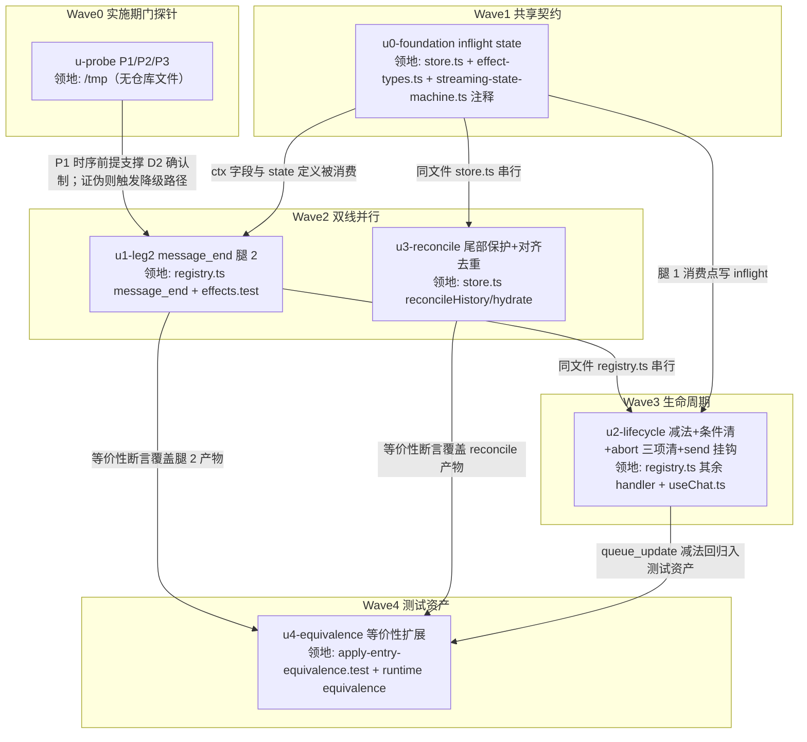

# steer/followUp 用户气泡显示链路修正 实施计划

基线: 4239651ec（来源设计定稿 commit）| 来源设计: docs/design/steer-followup-user-bubble-display.md | 日期: 2026-08-30

> 单元构成：设计的 U1-U4 细化为 6 单元（新增 u0-foundation 共享契约根节点 + u-probe 实施期门探针前置为独立单元）；设计 §5 阶段 1/2 映射为波次 W1-W4（阶段 1 = u0/u1/u2/u4，阶段 2 = u3）。

## 0 章节映射

所有 subagent task 的坐标唯一来源，禁止自猜编号。

| 内容 | steer-followup-user-bubble-display.md 实际位置 |
|------|--------------|
| 背景/目标 | §1 背景目标（SCQA / 系统是什么 / G1-G4 / in-scope·out-of-scope） |
| 终态/机制 | §3 解决方案（3.1 终态三路径 / 3.2 四方案对比 / 3.3 D1-D5 决策四件套 / 终态数据流图 / 错误规格表） |
| 验收场景表 | §4 验收（AC-1 / AC-2 / AC-2b / AC-3a·3b / AC-4 / AC-5 / AC-6 / AC-7） |
| 下一层拆分 | §5 下一层拆分（两阶段 + U1-U4 表 + 文件改动地图） |
| 待验证检查点 | §5 末尾（P1 时序探针 / P2 同源性探针 / P3 快照保真探针，各含降级路径） |

审查记录：steer-followup-user-bubble-display.review.md（Round 1: 1 must-fix + 4 suggestion + 复审重演发现 F4；Round 2 聚焦复审: 0 must-fix + 3 suggestion；全部落盘修订，must_fix==0）。

## 1 目标快照（逐字摘录）

**一句话结论**（设计文档开篇）：「streaming 中追加消息（steer/followUp）的用户气泡显示，当前由 pi 队列状态机的边沿事件（`queue_update` 帧差集）驱动——消息真实投递了但气泡可能永不出现；本设计把显示的存在性改为由**消息数据帧**（`message_end(user)`，携带完整 entry）驱动，队列帧退化为队列气泡（QueueBubble）状态与暂存对账，使四个已核实的丢失路径（含混合提交常态路径 F4）全部不再触发。」

**设计目标（G1-G4，逐字）**：
1. **G1 消息必然可见**：streaming 中追加的每条消息，投递后其用户气泡必然出现在对话流——不依赖任何单条控制帧的到达（队列帧丢失、延迟、pi 侧队列事件缺失都不影响存在性）。
2. **G2 内容不降级**（尽力）：正常路径下气泡保留原始 segments（文件/mention/skill 徽章），仅在前端暂存确已丢失时降级为 pi 落盘纯文本——降级可见但不静默。
3. **G3 live ≡ reload**：投递后的气泡与重开 session 从 entry 重放的投影逐字段一致（项目关键规则 9，现有等价性测试守卫）。
4. **G4 本地快照操作不抹除已投递消息**：切入 session 的历史刷新（reconcile/hydrate）不得把已投递的用户气泡抹掉。

**Out-of-scope（逐字）**：
- 显示时机提前（"提交即显示 pending 气泡"的 S7 原设计复活）——独立的体验增强，另立设计。
- W22 全量对账（ref ← reducer state 全类型投影收敛）——本设计是它的 user 消息前置切片，不替它做。
- steer/followUp 消息重开后的 badge 回填（msg-id-mapper 标记机制接入）——现状限制维持（D5）。
- QueueBubble UI 形态、compact 队列（useCompactQueue）、subagent 定向消息（custom 通路）——不受影响。
- pi 侧任何改动——项目规约不修改 pi 源码，pi 的队列 splice 行为按黑盒对待。

## 2 单元列表

| Unit | 职责 | 领地（精确文件路径） | 依赖 | 隔离 | 验收条款 |
|------|------|---------------------|------|------|---------|
| u-probe | P1/P2/P3 实施期门探针：pi rpc 实跑验证①投递时序 queue_update(drain) 先于 message_end(user) 且成对（P1）②skill 展开/空白边界下入队文本·投递 contentText·帧数组文本三处同源（P2）③混合提交场景 message_start(assistant) 时点 pi 队列深度 = 未投递 followUp 数（P3） | 无仓库领地（探针脚本 /tmp/probe-steer-bubble/，用完归档不入库） | 无 | plain | 三项结论（✅/⛔ + 证据 jsonl 路径）写入状态表证据列；任一证伪 → 触发设计降级路径（P1→腿 1 加已消费 multiset 守卫；P2→该场景记已知边界退化；P3→快照出口后移 get_state 对账）并在 §7 变更历史记录 |
| u0-foundation | store 新增 per-session **inflight 计数 state**（语义=已显示待确认的投递数）+ 增/减/清零 action + disposeSession 清理挂钩；effect-types.ts ctx 加 inflight 读写字段；store.ts applyMessageEvent ctx 注入（store.ts:603-624）；LRU 驱逐回调（store.ts:323-334）与 clearIndependentTransient（streaming-state-machine.ts:115-128）处加「不可重建状态豁免清理」声明注释 | packages/core/src/domain/chat/store.ts、packages/core/src/domain/chat/effect-types.ts、packages/core/src/domain/chat/streaming-state-machine.ts（仅注释）、packages/core/src/domain/chat/__tests__/store.test.ts | 无（共享契约根节点） | plain | `cd packages/core && pnpm typecheck` 绿；store.test.ts 新增 inflight 用例绿（增/减/清零、disposeSession 清、LRU 驱逐不清） |
| u1-leg2 | registry.ts message_end handler 腿 2（设计 U1 + D2）：user role 时 inflight>0 → −1 抵消跳过；inflight==0 → includes 兜底（entry.contentText ∈ 最后 queue_update 帧数组，sendMode 由命中维度推导）命中消费 1 条（drainN 回填 segments / 暂存空 entry 纯文本降级）+ **消费后从快照剔命中文本一个实例**；未命中/无快照跳过；custom/toolResult 既有守卫不动；照旧 applyEntryFrame 喂 reducer | packages/core/src/domain/chat/effects/registry.ts（仅 message_end handler）、packages/core/src/domain/chat/__tests__/effects.test.ts | u-probe（P1 时序前提）、u0-foundation（ctx 字段） | plain | typecheck 绿；effects.test.ts 新增腿 2 用例绿（抵消/命中消费+剔快照/未命中跳过/无快照跳过/暂存空纯文本降级五路径） |
| u3-reconcile | store.ts reconcileHistory/hydrate 两步合并（设计 U3 + D3）：①尾部保护段收集（streaming assistant ∨ user piEntryId 未确认）②user 正序-尾窗对齐去重（a=min(n,k)，保护段正数 1..a ↔ 基线尾部 k−a+1..k 逐位剔除）；hydrate 复用同规则 | packages/core/src/domain/chat/store.ts（仅 reconcileHistory/hydrate 函数）、packages/core/src/domain/chat/__tests__/store.test.ts | u0-foundation（同文件 store.ts 串行） | plain | typecheck 绿；store.test.ts 四类快照序列用例绿（全对齐 n=k / 部分滞后 n>k>0 / 基线多含 n<k / 全缺 k=0）+ 现有 reconcileHistory 用例零回归 |
| u2-lifecycle | registry.ts queue_update/message_start/message_complete 生命周期改写（设计 U2 + D4）：queue_update 去投递侧 reconcilePending 裁剪 + 腿 1 消费点 inflight += 实取数；message_start G-023 无条件清改条件清（快照深度==0 才清，先读后清）+ 同点僵尸清理（buffer 存量 > 快照深度清残量）；message_complete aborted 清 pendingBuffer + inflight + queueStates 三项；useChat.ts send 调用点 inflight 挂钩（乐观插入 +1 / catch 回滚 −1）+ S7 过时注释清理（:512-518 / :537-549） | packages/core/src/domain/chat/effects/registry.ts（queue_update/message_start/message_complete handler）、packages/core/src/domain/chat/useChat.ts、packages/core/src/domain/chat/__tests__/pending-drain-fifo.test.ts、packages/core/src/domain/chat/__tests__/useChat.test.ts | u1-leg2（同文件 registry.ts 串行）、u0-foundation | plain | typecheck 绿；pending-drain-fifo 零回归 + 新增用例绿（投递侧不裁剪/G-023 条件清双分支/僵尸清理/abort 三项清）；useChat.test.ts 零回归 + send 挂钩用例绿（+1 / 失败 −1） |
| u4-equivalence | 等价性测试资产扩展（设计 U4 + AC-7）：apply-entry-equivalence 扩展腿 2 插入路径 vs 文件重放路径**按字段归一**断言（id 异源不断言相等，D3 表述修正）；queue_update 减法回归用例；reconcile 快照滞后序列用例归档 | packages/core/src/domain/chat/__tests__/apply-entry-equivalence.test.ts、packages/runtime/src/__tests__/equivalence/（如涉及） | u1-leg2、u3-reconcile、u2-lifecycle（覆盖全部功能单元产物） | plain | `cd packages/core && pnpm vitest run src/domain/chat/__tests__/apply-entry-equivalence.test.ts` 绿；`cd packages/runtime && pnpm test:equivalence` 绿；现有 live≡reload 用例零回归 |

## 3 DAG 图

波次：W0 → W1 → W2（u1 ∥ u3，领地互斥）→ W3 → W4。每波 ≤2 并发，全 plain（领地互斥已足够安全；无热点公共文件——index.ts 出口与 event-adapter.ts 零改动）。

## 4 测试策略

命令真实来源：packages/core/package.json scripts（`test: vitest run`、`typecheck: tsc --noEmit`）、packages/runtime/package.json scripts（`test:equivalence`）、根 package.json（`lint`）。

**增量（各单元开发期内，从 packages/core 目录跑）**：
- 单文件：`cd packages/core && pnpm vitest run src/domain/chat/__tests__/<file>.test.ts`
- 域内回归：`cd packages/core && pnpm vitest run src/domain/chat/__tests__/`
- 类型：`cd packages/core && pnpm typecheck`

**全量（收尾/阶段 5 前）**：
- `cd packages/core && pnpm test`
- `cd packages/runtime && pnpm test:equivalence`
- 根目录 `pnpm run lint`（taste-lint + vue_rules_checker）

**Gate B 实跑验收（阶段 5）**：`pnpm dev` + browser-automation 连 `http://localhost:9222`，按设计 §4 AC-1/2/2b/3a/3b/4/5/6 场景逐条实跑（AC-4 的确定性触发 = dev 构建临时开关跳过腿 1，跑两遍）。AC-7 由 u4 测试资产覆盖。

## 5 合理偏差登记表

初始为空。格式：| 日期 | 单元 | 偏差 | 理由 | 处置 |

| 日期 | 单元 | 偏差 | 理由 | 处置 |
|------|------|------|------|------|
| 2026-08-30 | u3-reconcile | D3 已确认判据在「piEntryId 缺失或不在基线 id 集」字面规则上加 id 命中兜底（身份集 = piEntryId ∪ id 双收，isConfirmed = 任一命中） | 字面规则下 hydrate 投影 user（id 即基线 id、无 piEntryId 的形态）被误判未确认 → 保护段越过已确认 user 扩展 → 既有用例回归；overlay u-<uuid> 与基线 uuidv7 永不相交，兜底不误判 | 合理不一致登记 + 设计文档 D3 判据措辞同步修正（身份集读法，随 u3 commit） |
| 2026-08-30 | u3-reconcile | hydrate 的 load-more 切分锚改为取**基线**首条（非 merged 首条） | live 保护段可能排在 merged 头部，用 merged 首条会污染切分锚 | 合理不一致登记（实现内注释披露，不改设计——设计未规定锚取值细节） |
| 2026-08-30 | u1-leg2 | 双维度同文本命中的消费策略实现为顺序 fallback 链（steering→followUp 依次 drainN 取有货方，全空才纯文本降级） | 设计 D2 已知边界①「单 mode 误指降级」的直接改进：降级概率收敛到两 mode 暂存全空；已重演错吃反例（需 F1 + 跨 mode 同文本 + steer 暂存恰空三条件叠加，后果不劣于边界①本身） | 合理不一致登记；阶段 3 一致性审查时统一回顾 D2 边界①措辞 |
| 2026-08-30 | u1-leg2 | 腿 2 接线位置在 applyEntryFrame 之后（reducer 权威喂入前置） | 与 customStart「先喂 reducer 再投影 ref」范式一致；任务明示两序等价 | 合理不一致登记（范式对齐，无需改设计） |
| 2026-08-30 | u2-lifecycle | 僵尸清理与 abort 清空复用 ctx.reconcilePending（存量>深度判断内建、depth=0 全清），未新增 store action | 新增 action 须改 effect-types.ts（不在领地）；复用语义精确匹配 D4「裁残量/全清」 | 合理不一致登记（零越界复用，reconcilePending 获得新调用方无需 deprecated） |
| 2026-08-30 | u2-lifecycle | store.ts 改动为 reconcilePending 函数头注释更新（函数体零改动） | 投递侧调用移除后原注释与行为背离，必要文档一致性修复 | 合理不一致登记（超「仅新增 action」字面范围，已核 diff 纯注释） |
| 2026-08-30 | u2-lifecycle | pending-drain-fifo 组4 / effects TC4 由「投递侧裁剪」断言改写为「G-023 僵尸清理 / 不再调 reconcilePending」断言 | D4 行为移除的直接锁定对象；已核 diff 为换断言（非删断言），并新增组6（F3 不可逆丢失回归）/组7（腿 2 回填非降级） | 合理不一致登记（行为变更测试同步） |
| 2026-08-30 | u4-equivalence | E5 组采用真 store + applyMessageEvent 范式（custom-start-equivalence 同款）而非 W6 块纯 reducer 双序列构造 | 腿 2 插入产物是 messages ref 气泡（appendUser 路径），纯 reducer 层无法驱动；reducer 权威镜像维度在 E5a 内补齐 deep-equal 共用 | 合理不一致登记（范式对齐既有惯例） |
| 2026-08-30 | u1-leg2 | 空文本防御分支（registry.ts !text return，设计未规定） | 纯 image 等无文字 content 无入队比对语义，且规避空串文本对 includes 的病态命中；行为=跳过，与「无快照跳过」同恢复语义 | 合理不一致登记（一致性审查 reasonable #2；错误规格表不另加行） |
| 2026-08-30 | u2-lifecycle | 腿 1 两维度各自 increment 实取数（合计 = m） | 与 D2 维护点 1「按实取数 m 计」语义等价；m<N 差额与 m=0 no-op 由 TC6/TC7 锁定 | 合理不一致登记（一致性审查 reasonable #3） |
| 2026-08-30 | u1-leg2 | 剔快照「维度剔空删字段 / 全空删条目」与 queue_update 空帧删条目惯例形态对齐 | 快照深度持续充当「未投递数」镜像，G-023 条件清读数可靠 | 合理不一致登记（一致性审查 reasonable #4） |
| 2026-08-30 | u2-lifecycle（D4 修订） | abort 清理从三项清（buffer/queueStates/inflight）改为**只清 inflight**——buffer 与 queueStates 随 pi 存活队列保留 | Gate B 实测证伪 D4 前提「pi abort 确定性清队列」：pi `abort()` 不清队列，残余在下一 prompt 照常投递；三项清致残余投递时两腿皆无判据 → 一次性漏显窗口（§7 残留风险）。保留镜像使腿 1 全保真消费（segments 在，无纯文本降级），比处置建议原案「清 buffer 保留 queueStates」（走腿 2 纯文本降级）保真度更高 | 合理不一致登记 + 设计文档 D4/失败路径 B/数据流图/错误规格表/AC-5 同步修订；AC-5 语义改判（残余不丢弃，QueueBubble 持续显示真实深度）；effects.test.ts abort 用例改写（含幂等分支）；真实链路复验见 §7 变更历史 Gate B 记录 |

## 6 状态表

| Unit | 状态 | 轮次 | 证据指针 |
|------|------|------|---------|
| u-probe | committed | 0 | P1 ✅ 4/4 投递 drain 帧先于 message_end(user) 成对（隔 2 seq，events-p1.jsonl）；P2 ✅ 帧文本↔帧文本同源 3/3（plain/空白逐字节/skill 展开，pi 不 trim，events-p2*.jsonl）；P3 ✅ 快照保真 8/8 采样点（3 场景 get_state 对账，events-p3-*.jsonl）。三探针全过，无降级路径触发；证据 /tmp/probe-steer-bubble/ |
| u0-foundation | committed | 0 | e7fdf2cd5：inflight state + 4 action + ctx 注入 + D4 豁免注释 ×2；typecheck 绿；store.test.ts 68 passed（61 既有 + 7 新增） |
| u3-reconcile | committed | 0 | fc0f800e3：mergeBaselineWithLive 两步规则 + hydrate 复用；typecheck 绿；store.test.ts 76 passed（68 既有 + 8 新增，含四类快照 + 已知边界 + F2 组合）；域内回归 27 files / 530 tests 绿 |
| u1-leg2 | committed | 0 | 93a667f66：confirmUserDeliveryOnMessageEnd 腿 2 裁决（inflight 抵消/includes 兜底/纯文本降级/剔快照）；effects.test.ts 38 passed（31 既有 + 7 新增七路径）；域内回归 481 passed |
| u2-lifecycle | committed | 0 | queue_update 投递侧裁剪移除 + 腿 1 inflight +=m；G-023 条件清（F4 修复）+ 同点僵尸清理；abort 三项清；send 挂钩 ±1 + S7 注释清理；域内 22 files / 498 tests 绿（pending-drain-fifo 7 + effects 49 + useChat 35） |
| u4-equivalence | committed | 0 | apply-entry-equivalence E5a/E5b/E5c（腿 2 includes 消费 / 纯文本降级 / 腿 1——stripHetero 归一 deep-equal + id 异源形态断言 + inflight 抵消无双插）：28 passed（25 既有 + 3 新增）；runtime equivalence 18 files / 65 tests 零破坏；effect-types reconcilePending JSDoc 更正调用点 |

## 7 残留风险与变更历史

**残留风险（实施期关注）**：
- P1/P2/P3 探针任一证伪时按设计降级路径调整（u-probe 验收条款），不推翻 B-hybrid 主结构。——已消项：三探针全 ✅。
- F1 的 pi 侧镜像残留经全量帧带回前端快照的窗口（D2 边界披露）——与现状行为等同，非回归，不修。
- AC-4 的 F1 自然触发依赖 pi splice 匹配失败，诱因待实跑——验收用确定性触发（临时开关）覆盖。——**已覆盖（Gate B 第二轮，dev 开关两遍跑 PASS，见变更历史）**。
- **[Gate B 实测发现 2026-08-30 → 当日已处置] pi abort 后队列残余投递的一次性漏显窗口**：D4 假设「pi abort 确定性清队列」与 pi 实测行为偏差——pi `abort()` 不调 clearQueue（复审已核实源码），abort 后 agent loop 的队列残余（如已入队未投递的第二条同文本 steer）**仍会被投递**；此时前端已按 D4 执行三项清（buffer/queueStates/inflight），两腿皆无判据 → 该残余消息漏显（一次性）。实测恢复动作有效：切入切出触发 getHistory 快照收敛，气泡补显（Gate B 已验证）。**处置（已实施）**：abort 清理改为**只清 inflight**，pendingBuffer 与 queueStates 随 pi 存活队列保留——下一 prompt 投递时两腿正常消费（腿 1 全保真回填 segments），abort 后 QueueBubble 持续显示 = 真实队列深度；较处置建议原案「清 buffer + inflight、保留 queueStates」保真度更高（原案走腿 2 纯文本降级插入）。registry abort 分支 + store/effect-types JSDoc + effects.test.ts abort 用例改写（4 用例含幂等分支）+ 设计文档 5 处同步（D4/失败路径 B/数据流图/错误规格表 2 行/AC-5）；定向测试 168 + equivalence 28 全绿。真实链路复验随本轮 Gate B 待续场景实跑（AC-5 新语义），结果见变更历史。
- **[Gate B 观测] 纯文字 turn（无工具调用）无 steering 注入点**：streaming 中 steer 提交后挂 pi 队列，直到下一次 prompt/turn 边界才投递（与 u-probe 补充观察 #2 一致）——非 bug（pi 语义），用户感知为「steer 追加延迟生效」，QueueBubble 在此期间持续显示（G-023 条件清后行为正确）。

**变更历史**：
- 2026-08-30 计划创建（基线 4239651ec）。
- 2026-08-30 阶段 3 一致性审查清零：unreasonable 空；4 条 doc_errors 全修（①D2 边界①三处同步为顺序 fallback 语义 ②registry queue_update 注释 pendingMessageCount 消费方修正 ③u1 全空降级路径剔维度注释补句 ④错误规格表补 editAndResend 同文本碰撞理论边界披露）+ effect-types D6 注释消歧；新增 reasonable 3 条入登记表（累计 11 条）。审查区间 093b986f4..c8096e773。
- 2026-08-30 阶段 5 双级验收：Gate A 全绿（core 1310 / runtime 4090 + equivalence 65 / renderer 3625 / 根 lint 0 error；修复批次 = renderer ctx stub 同步 6 字段 + eslint dist.bundle ignores，commit 841550c9d）。Gate B 核心场景 PASS：AC-1 主路径（F4 混合提交 steer+followUp 全显示、inflight 归零）、G3/G4 切换一致性（8→8 无丢无重）、AC-2b 同文本双 steer（两条各显一次）、AC-5 abort 三项清生效、恢复动作（快照补显）有效、AC-6 send 零回归（全程 5+ 条 send 正常）。**未执行（待续）**：AC-2 全量十轮竞态（已覆盖 2 轮）、AC-3a/3b 断连族、AC-4 确定性触发两遍。新发现残留风险两条（见上）。
- 2026-08-30 D4 修订（abort 残留风险处置，Gate B 待续项之一）：abort 三项清 → 只清 inflight（pi abort 不清队列的实测前提修正，见 §7 残留风险条目处置记录）；core 定向测试 168 + equivalence 28 全绿。Gate B 待续场景（AC-2 全量十轮 / AC-3a/3b / AC-4 两遍 / AC-5 新语义复验）本轮继续实跑。
- 2026-08-30 深夜 **Gate B 第二轮（待续场景全量实跑）全部完成**，含一项真实 bug 修复：
  - **AC-2 全量十轮 PASS**（8 单 steer 轮 + 2 混合 steer+followUp 轮，全新 session；终局切入切出后前端 22 = 期望 22 = **pi SSOT 22** 三方对账一致）。**轮 3 抓到真实双计 bug**：pi 文件（基线源）对「message_end(user) 已落盘、帧在途」的消息领先 live 帧流，overlay 身份判据结构性永假（piEntryId 剥除 + id 空间不相交），基线尾部为 assistant（k=0）时数量尾窗对齐 a=0 失效 → R3-PROMPT 前端 2 条 / pi 1 条。修复 = mergeBaselineWithLive 增补**文本多重集第三判据**（正序消费 + 被消费副本从尾窗 k 排除 + dup overlay 保护段透明跳过，commit 59ca29a53；store.test.ts 3 个新回归用例 + 存量 79 + chat 族 147 全绿），设计 D3 同步修订。
  - **AC-3a 断 WS（ring 回放）PASS**：CDP Network 离线 14s，pi 文件实证投递发生在断连第 6s；恢复在线后自动重连回放，24 = 期望、steer 恰 1、inflight 归零、无丢无重（两腿「帧+快照」成对成立实测）。
  - **AC-3b 杀 runtime（restore 重建）PASS**（全新 session 重跑）：kill -9 落盘实证投递后杀 runtime（respawn ~68s）；pi 重生后**不续跑被中断回合**（turn 丢失属合理语义；首轮「回合续完」为标记串误判——标记文本在 steer 消息自身内）；恢复动作（切入切出）后分区 = user + assistant(toolCall 已窗口配对回填) + steer user，**2 user = pi SSOT 2 精确一致，无丢无重**。
  - **AC-4 确定性两遍跑 PASS**：dev 开关 `globalThis.__XYZ_STEER_SKIP_LEG1__`（commit f576fbdc3）跳过腿 1 消费；正常历史轮（腿 1）→ 跳腿 1 轮 2 条（含首尾空白边界）**腿 2 独立显示成立** → 正常回归轮无双计；终局切入切出后 8 user = pi SSOT 8 收敛。**偏差与观测**：① slash 展开变体实跑跳过（Stock cwd 下执行未知 skill 有副作用风险）——由 P2 探针 + pending-drain-fifo 单测覆盖，登记为合理偏差；② 多行空白文本经 composer 提交被吞（fill+Enter 未入队），改单行首尾空格变体；③ **composer 提交层 trim 首尾空白**（pi 存储文本已剥）——P2 结论修正为「pi 层不 trim、xyz 提交层 trim」，帧间同源不受影响（帧文本均来自 pi 已 trim 文本）；④ 跳腿 1 模式下中途 merge 曾瞬态丢 S3 overlay（display 6 / pi 8），切入切出后收敛 8——数量对齐已知边界在跳腿 1 人工模式下的窗口放大（正常模式 AC-2 十轮 + AC-3 均未出现）。
  - **AC-5 abort 新语义复验 PASS**：abort 后队列镜像保留（queue={steering:[S2]}、buf=1）、inflight 清零；**实测 nuance**：stop 时 pi 恰将 S1 投递进收口中的回合（steering 在工具边界注入，s1Once 正常显示）——断言按「残余镜像保留」而非固定条数判定；下一 prompt 后残余 S2 全保真显示恰一次，最终 12 = 期望、inflight 归零。
  - **环境事故记录（已定论，撤销独立排查）**：AC-3b 首轮 kill -9 后，~/.xyz-agent-dev 的当日会话列表与 pi session 文件回退到 8/23 状态（今日文件消失）——**2026-08-31 用户确认：文件消失系其手动删除所致，非 kill -9 竞态或并行会话干扰，无需排查**。另两条观测已于 2026-08-31 修复（见变更历史末段）：runtime supervisor respawn 68-91s（偏慢）→ supervisor stopping 残留 bug 修复后实测 1.7s；composer 提交层 trim 首尾空白 → segmentsToPrompt 去 trim 保真。恢复旧 Stock 项目 session 时 pi 因 proper-lockfile/Bun 不兼容崩溃循环（Stock 扩展环境问题，独立事项）。
  - 交付补丁链：59ca29a53（双计修复 + D3 修订）→ f576fbdc3（AC-4 dev 开关）。
- 2026-08-31 **Gate B 观测双修复**（用户定论「文件消失系手动删除」+ 指示「新观测两条要修复」；环境事故登记同步撤销待排查）：
  - **观测① composer 提交层 trim 首尾空白**：真实 trim 点 = `shared/segments.ts` `segmentsToPrompt` 内置 `.trim()`（submit 层 trim 仅做空拦截、useChat → runtime → pi 全程原文透传，AC-4 观测③的「提交层」即此）。修复 = 去 trim 保真——提交原文 → pi 入队帧 → message_end(user) → 基线落盘全链同文；空白拦截职责归调用方既有守卫（send/steer/followUp/editAndResend 的 `!text.trim()`），唯一依赖已 trim 语义的点 sendSubagentDirective 空挡 `!text` → `!text.trim()`。D3 文本判据增强：首尾空白输入不再失配、精确命中（设计文档 D3 段已补注）。subagent 定向文本带 chip→text 边界补格随行发出（语义无害，测试断言按保真更新）。测试：shared 216（含 2 断言翻转）+ core chat 507（新增保真/空白拦截 2 用例）+ renderer submit 链 10 全绿。
  - **观测② runtime respawn 68-91s**：根因 = `RuntimeSupervisor.start()` 内部 `await this.stop()`（清旧进程）markStopping 后成功路径从不复位 → stopping 恒 true → 运行期崩溃的 exit 被 onRuntimeExit 误判「主动停止」短路自动重启，只能等 liveness 探针 30s×3（60-90s）兜底（日志特征：exit 137 后紧跟 "during graceful stop — no restart"，与实测 68-91s 精确吻合）。修复 = start() 成功落定处（recordSuccess 后）复位 stopping；start() 进行中保持 true 仍正确（spawn 后 waitForHealth 期间 exit 由 start 失败路径处理，防双路重启）。dev 实测 kill -9 → respawn **1.7s**（退避 1s + 启动 0.7s，日志链 unexpectedly → 1s → Ready，无 liveness 兜底；修复前同场景 68s+）。测试：新增 `apps/electron/main/test/runtime-supervisor-crash-restart.test.ts` 3 用例（红灯反证过：移除修复行 2 用例失败、主动 stop 守卫用例仍绿），main 层 736 全绿。
