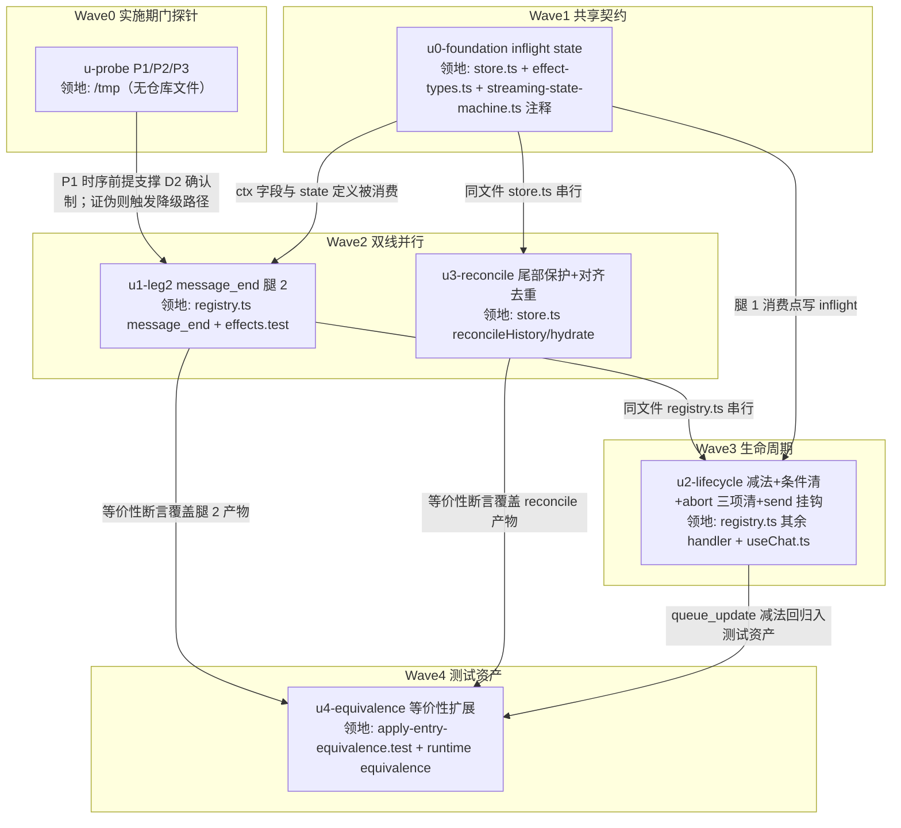

# steer/followUp 用户气泡显示链路修正 实施计划

基线: 4239651ec（来源设计定稿 commit）| 来源设计: docs/design/steer-followup-user-bubble-display.md | 日期: 2026-08-30

> 单元构成：设计的 U1-U4 细化为 6 单元（新增 u0-foundation 共享契约根节点 + u-probe 实施期门探针前置为独立单元）；设计 §5 阶段 1/2 映射为波次 W1-W4（阶段 1 = u0/u1/u2/u4，阶段 2 = u3）。

## 0 章节映射

所有 subagent task 的坐标唯一来源，禁止自猜编号。

| 内容 | steer-followup-user-bubble-display.md 实际位置 |
|------|--------------|
| 背景/目标 | §1 背景目标（SCQA / 系统是什么 / G1-G4 / in-scope·out-of-scope） |
| 终态/机制 | §3 解决方案（3.1 终态三路径 / 3.2 四方案对比 / 3.3 D1-D5 决策四件套 / 终态数据流图 / 错误规格表） |
| 验收场景表 | §4 验收（AC-1 / AC-2 / AC-2b / AC-3a·3b / AC-4 / AC-5 / AC-6 / AC-7） |
| 下一层拆分 | §5 下一层拆分（两阶段 + U1-U4 表 + 文件改动地图） |
| 待验证检查点 | §5 末尾（P1 时序探针 / P2 同源性探针 / P3 快照保真探针，各含降级路径） |

审查记录：steer-followup-user-bubble-display.review.md（Round 1: 1 must-fix + 4 suggestion + 复审重演发现 F4；Round 2 聚焦复审: 0 must-fix + 3 suggestion；全部落盘修订，must_fix==0）。

## 1 目标快照（逐字摘录）

**一句话结论**（设计文档开篇）：「streaming 中追加消息（steer/followUp）的用户气泡显示，当前由 pi 队列状态机的边沿事件（`queue_update` 帧差集）驱动——消息真实投递了但气泡可能永不出现；本设计把显示的存在性改为由**消息数据帧**（`message_end(user)`，携带完整 entry）驱动，队列帧退化为队列气泡（QueueBubble）状态与暂存对账，使四个已核实的丢失路径（含混合提交常态路径 F4）全部不再触发。」

**设计目标（G1-G4，逐字）**：
1. **G1 消息必然可见**：streaming 中追加的每条消息，投递后其用户气泡必然出现在对话流——不依赖任何单条控制帧的到达（队列帧丢失、延迟、pi 侧队列事件缺失都不影响存在性）。
2. **G2 内容不降级**（尽力）：正常路径下气泡保留原始 segments（文件/mention/skill 徽章），仅在前端暂存确已丢失时降级为 pi 落盘纯文本——降级可见但不静默。
3. **G3 live ≡ reload**：投递后的气泡与重开 session 从 entry 重放的投影逐字段一致（项目关键规则 9，现有等价性测试守卫）。
4. **G4 本地快照操作不抹除已投递消息**：切入 session 的历史刷新（reconcile/hydrate）不得把已投递的用户气泡抹掉。

**Out-of-scope（逐字）**：
- 显示时机提前（"提交即显示 pending 气泡"的 S7 原设计复活）——独立的体验增强，另立设计。
- W22 全量对账（ref ← reducer state 全类型投影收敛）——本设计是它的 user 消息前置切片，不替它做。
- steer/followUp 消息重开后的 badge 回填（msg-id-mapper 标记机制接入）——现状限制维持（D5）。
- QueueBubble UI 形态、compact 队列（useCompactQueue）、subagent 定向消息（custom 通路）——不受影响。
- pi 侧任何改动——项目规约不修改 pi 源码，pi 的队列 splice 行为按黑盒对待。

## 2 单元列表

| Unit | 职责 | 领地（精确文件路径） | 依赖 | 隔离 | 验收条款 |
|------|------|---------------------|------|------|---------|
| u-probe | P1/P2/P3 实施期门探针：pi rpc 实跑验证①投递时序 queue_update(drain) 先于 message_end(user) 且成对（P1）②skill 展开/空白边界下入队文本·投递 contentText·帧数组文本三处同源（P2）③混合提交场景 message_start(assistant) 时点 pi 队列深度 = 未投递 followUp 数（P3） | 无仓库领地（探针脚本 /tmp/probe-steer-bubble/，用完归档不入库） | 无 | plain | 三项结论（✅/⛔ + 证据 jsonl 路径）写入状态表证据列；任一证伪 → 触发设计降级路径（P1→腿 1 加已消费 multiset 守卫；P2→该场景记已知边界退化；P3→快照出口后移 get_state 对账）并在 §7 变更历史记录 |
| u0-foundation | store 新增 per-session **inflight 计数 state**（语义=已显示待确认的投递数）+ 增/减/清零 action + disposeSession 清理挂钩；effect-types.ts ctx 加 inflight 读写字段；store.ts applyMessageEvent ctx 注入（store.ts:603-624）；LRU 驱逐回调（store.ts:323-334）与 clearIndependentTransient（streaming-state-machine.ts:115-128）处加「不可重建状态豁免清理」声明注释 | packages/core/src/domain/chat/store.ts、packages/core/src/domain/chat/effect-types.ts、packages/core/src/domain/chat/streaming-state-machine.ts（仅注释）、packages/core/src/domain/chat/__tests__/store.test.ts | 无（共享契约根节点） | plain | `cd packages/core && pnpm typecheck` 绿；store.test.ts 新增 inflight 用例绿（增/减/清零、disposeSession 清、LRU 驱逐不清） |
| u1-leg2 | registry.ts message_end handler 腿 2（设计 U1 + D2）：user role 时 inflight>0 → −1 抵消跳过；inflight==0 → includes 兜底（entry.contentText ∈ 最后 queue_update 帧数组，sendMode 由命中维度推导）命中消费 1 条（drainN 回填 segments / 暂存空 entry 纯文本降级）+ **消费后从快照剔命中文本一个实例**；未命中/无快照跳过；custom/toolResult 既有守卫不动；照旧 applyEntryFrame 喂 reducer | packages/core/src/domain/chat/effects/registry.ts（仅 message_end handler）、packages/core/src/domain/chat/__tests__/effects.test.ts | u-probe（P1 时序前提）、u0-foundation（ctx 字段） | plain | typecheck 绿；effects.test.ts 新增腿 2 用例绿（抵消/命中消费+剔快照/未命中跳过/无快照跳过/暂存空纯文本降级五路径） |
| u3-reconcile | store.ts reconcileHistory/hydrate 两步合并（设计 U3 + D3）：①尾部保护段收集（streaming assistant ∨ user piEntryId 未确认）②user 正序-尾窗对齐去重（a=min(n,k)，保护段正数 1..a ↔ 基线尾部 k−a+1..k 逐位剔除）；hydrate 复用同规则 | packages/core/src/domain/chat/store.ts（仅 reconcileHistory/hydrate 函数）、packages/core/src/domain/chat/__tests__/store.test.ts | u0-foundation（同文件 store.ts 串行） | plain | typecheck 绿；store.test.ts 四类快照序列用例绿（全对齐 n=k / 部分滞后 n>k>0 / 基线多含 n<k / 全缺 k=0）+ 现有 reconcileHistory 用例零回归 |
| u2-lifecycle | registry.ts queue_update/message_start/message_complete 生命周期改写（设计 U2 + D4）：queue_update 去投递侧 reconcilePending 裁剪 + 腿 1 消费点 inflight += 实取数；message_start G-023 无条件清改条件清（快照深度==0 才清，先读后清）+ 同点僵尸清理（buffer 存量 > 快照深度清残量）；message_complete aborted 清 pendingBuffer + inflight + queueStates 三项；useChat.ts send 调用点 inflight 挂钩（乐观插入 +1 / catch 回滚 −1）+ S7 过时注释清理（:512-518 / :537-549） | packages/core/src/domain/chat/effects/registry.ts（queue_update/message_start/message_complete handler）、packages/core/src/domain/chat/useChat.ts、packages/core/src/domain/chat/__tests__/pending-drain-fifo.test.ts、packages/core/src/domain/chat/__tests__/useChat.test.ts | u1-leg2（同文件 registry.ts 串行）、u0-foundation | plain | typecheck 绿；pending-drain-fifo 零回归 + 新增用例绿（投递侧不裁剪/G-023 条件清双分支/僵尸清理/abort 三项清）；useChat.test.ts 零回归 + send 挂钩用例绿（+1 / 失败 −1） |
| u4-equivalence | 等价性测试资产扩展（设计 U4 + AC-7）：apply-entry-equivalence 扩展腿 2 插入路径 vs 文件重放路径**按字段归一**断言（id 异源不断言相等，D3 表述修正）；queue_update 减法回归用例；reconcile 快照滞后序列用例归档 | packages/core/src/domain/chat/__tests__/apply-entry-equivalence.test.ts、packages/runtime/src/__tests__/equivalence/（如涉及） | u1-leg2、u3-reconcile、u2-lifecycle（覆盖全部功能单元产物） | plain | `cd packages/core && pnpm vitest run src/domain/chat/__tests__/apply-entry-equivalence.test.ts` 绿；`cd packages/runtime && pnpm test:equivalence` 绿；现有 live≡reload 用例零回归 |

## 3 DAG 图

波次：W0 → W1 → W2（u1 ∥ u3，领地互斥）→ W3 → W4。每波 ≤2 并发，全 plain（领地互斥已足够安全；无热点公共文件——index.ts 出口与 event-adapter.ts 零改动）。

## 4 测试策略

命令真实来源：packages/core/package.json scripts（`test: vitest run`、`typecheck: tsc --noEmit`）、packages/runtime/package.json scripts（`test:equivalence`）、根 package.json（`lint`）。

**增量（各单元开发期内，从 packages/core 目录跑）**：
- 单文件：`cd packages/core && pnpm vitest run src/domain/chat/__tests__/<file>.test.ts`
- 域内回归：`cd packages/core && pnpm vitest run src/domain/chat/__tests__/`
- 类型：`cd packages/core && pnpm typecheck`

**全量（收尾/阶段 5 前）**：
- `cd packages/core && pnpm test`
- `cd packages/runtime && pnpm test:equivalence`
- 根目录 `pnpm run lint`（taste-lint + vue_rules_checker）

**Gate B 实跑验收（阶段 5）**：`pnpm dev` + browser-automation 连 `http://localhost:9222`，按设计 §4 AC-1/2/2b/3a/3b/4/5/6 场景逐条实跑（AC-4 的确定性触发 = dev 构建临时开关跳过腿 1，跑两遍）。AC-7 由 u4 测试资产覆盖。

## 5 合理偏差登记表

初始为空。格式：| 日期 | 单元 | 偏差 | 理由 | 处置 |

| 日期 | 单元 | 偏差 | 理由 | 处置 |
|------|------|------|------|------|
| 2026-08-30 | u3-reconcile | D3 已确认判据在「piEntryId 缺失或不在基线 id 集」字面规则上加 id 命中兜底（身份集 = piEntryId ∪ id 双收，isConfirmed = 任一命中） | 字面规则下 hydrate 投影 user（id 即基线 id、无 piEntryId 的形态）被误判未确认 → 保护段越过已确认 user 扩展 → 既有用例回归；overlay u-<uuid> 与基线 uuidv7 永不相交，兜底不误判 | 合理不一致登记 + 设计文档 D3 判据措辞同步修正（身份集读法，随 u3 commit） |
| 2026-08-30 | u3-reconcile | hydrate 的 load-more 切分锚改为取**基线**首条（非 merged 首条） | live 保护段可能排在 merged 头部，用 merged 首条会污染切分锚 | 合理不一致登记（实现内注释披露，不改设计——设计未规定锚取值细节） |

## 6 状态表

| Unit | 状态 | 轮次 | 证据指针 |
|------|------|------|---------|
| u-probe | committed | 0 | P1 ✅ 4/4 投递 drain 帧先于 message_end(user) 成对（隔 2 seq，events-p1.jsonl）；P2 ✅ 帧文本↔帧文本同源 3/3（plain/空白逐字节/skill 展开，pi 不 trim，events-p2*.jsonl）；P3 ✅ 快照保真 8/8 采样点（3 场景 get_state 对账，events-p3-*.jsonl）。三探针全过，无降级路径触发；证据 /tmp/probe-steer-bubble/ |
| u0-foundation | committed | 0 | e7fdf2cd5：inflight state + 4 action + ctx 注入 + D4 豁免注释 ×2；typecheck 绿；store.test.ts 68 passed（61 既有 + 7 新增） |
| u3-reconcile | committed | 0 | mergeBaselineWithLive 两步规则 + hydrate 复用；typecheck 绿；store.test.ts 76 passed（68 既有 + 8 新增，含四类快照 + 已知边界 + F2 组合）；域内回归 27 files / 530 tests 绿 |
| u1-leg2 | pending | 0 | — |
| u2-lifecycle | pending | 0 | — |
| u4-equivalence | pending | 0 | — |

## 7 残留风险与变更历史

**残留风险（实施期关注）**：
- P1/P2/P3 探针任一证伪时按设计降级路径调整（u-probe 验收条款），不推翻 B-hybrid 主结构。
- F1 的 pi 侧镜像残留经全量帧带回前端快照的窗口（D2 边界披露）——与现状行为等同，非回归，不修。
- AC-4 的 F1 自然触发依赖 pi splice 匹配失败，诱因待实跑——验收用确定性触发（临时开关）覆盖。

**变更历史**：
- 2026-08-30 计划创建（基线 4239651ec）。
