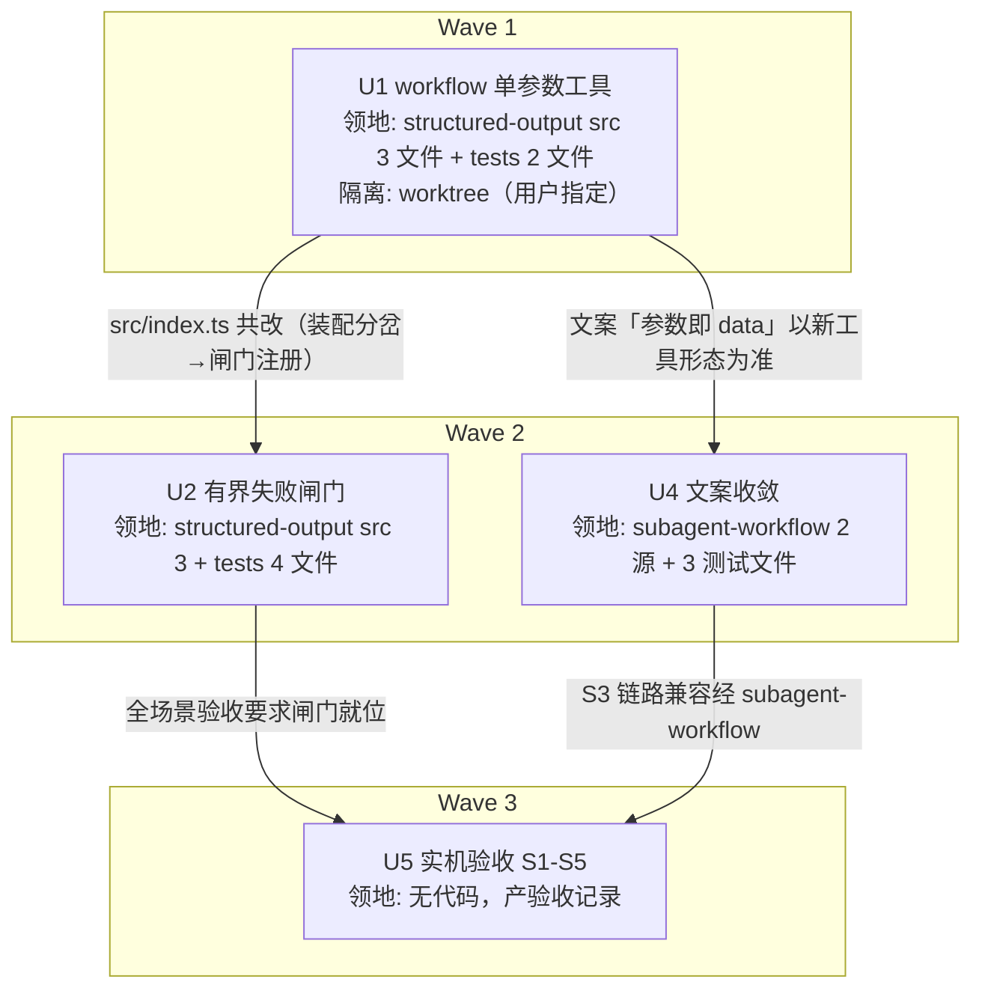

# structured-output 终态重设计 实施计划

基线: bdc4ad2ae | 来源设计: docs/design/structured-output-redesign.md（v2，审查修订版） | 审查报告: docs/design/structured-output-redesign.review.md（2 must-fix 已在 v2 落盘） | 日期: 2026-08-28

## 0 章节映射

| 内容 | 设计文档实际位置 |
|------|------------------|
| 背景/目标 | §1 背景、§2 设计目标（G1-G4 + In/Out-of-scope） |
| 终态/机制 | §5 终态、§6 关键决策 D1-D5、§7 实现机制（文件级改动地图 1-6） |
| 验收场景表 | §8（S1-S5 五场景 + 版本矩阵前置项） |
| 下一层拆分 | §10（U1-U5） |
| 待验证检查点 | §11 探针清单（P1/P2/P3-new/P4 ✅ 已证实；P5/P6 在 U1 实施期；P7' 在 U2 实施期；P8/P9 在 U5 验收前置） |

## 1 目标快照（逐字摘录，禁止改写）

> **G1 首调即成功**：模型读完任务后第一次调 structured-output 就是正确形态。不存在「按工具描述传参却被参数层拦截」的系统性第一轮浪费（当前 glm-5.3 与 deepseek 均 100% 命中此坑）。
> **G2 失败必有界**：无论模型多弱、schema 多复杂，structured-output 相关的连续失败在同签名错误第 3 次后终止子进程（当前上限 = 无上限，实测 345 次空转 40 分钟），终止原因进日志与调用记录、带恢复指引。
> **G3 接口不自相矛盾**：模型从任何信息源（工具描述 / 工具参数 schema / prompt 注入 / hook 提醒）看到的调用约定都一致——不是靠四处文案对齐维持，而是矛盾在结构上不可能存在。
> **G4 日常模式回归为零**：交互式主 agent 的自报双参数用法行为逐字节不变。

**In-scope**：`extensions/universal/structured-output/`（工具定义、execute、hook、新增闸门）；`extensions/universal/subagent-workflow/` 内三处 prompt 文案。
**Out-of-scope**：pi 上游（不修改）；`agent({schema})` API 与 `parsedOutput` 回收链路（零改动是设计约束）；emulated 引擎的 schema 仿真层；workflow 侧 schema 扁平化改造；maxTurns 兜底。

## 2 单元列表

> 单元编号沿用设计 §10 的 U1-U5；领地在设计基础上把测试文件并入实现单元（偏差 BR-1，见 §5）。

| Unit | 职责 | 领地（精确文件路径） | 依赖 | 隔离 | 验收条款 |
|------|------|----------------------|------|------|----------|
| U1 workflow 单参数工具 | tool-definition 拆双变体（workflow 变体 parameters=权威 schema，非 object 根包装 `{value}`，根级 additionalProperties 未声明时注入 false）+ execute workflow 分支改透传/解包（删权威 ajv 复核）+ 加载期防御上移（keyword-less 拒绝 + boolean true 拦截 fail-fast 于注册期）+ index.ts 装配分岔 + 对应测试改写 | `extensions/universal/structured-output/src/tool-definition.ts`、`src/execute.ts`、`src/index.ts`、`tests/prompt-quality.test.ts`、`tests/structured-output.test.ts` | 无 | **worktree**（用户指定，2026-08-28 评审） | ① `cd extensions/universal/structured-output && pnpm test` 全绿；② `pnpm extensions:typecheck` + `pnpm extensions:lint` 干净；③ 新单测覆盖：workflow 变体 parameters 注入 additionalProperties:false（未声明时）/ 尊重显式声明、非 object 根包装与解包、加载期防御 fail-fast（keyword-less / boolean true）、execute workflow 分支透传不再 ajv；④ P5/P6 探针：本地 `pi --mode rpc` 起 workflow 子进程，session JSONL 确认模型可见 parameters=权威 schema + 首调即单参数形态（失败走 §11 降级路径并上报） |
| U2 有界失败闸门 | loop-gate.ts 新增（同签名计数状态机 + 错误签名归一化 + terminal 时写日志调 `pi.shutdown()`）+ workflow-hook.ts RetryState 增 terminal 态（terminal 不 steer，未调用 steer 保留上限 2）+ index.ts workflow 模式注册闸门（`tool_execution_end`）+ 对应测试新增/重锁 | `extensions/universal/structured-output/src/loop-gate.ts`（新增）、`src/workflow-hook.ts`、`src/index.ts`、`tests/loop-gate.test.ts`（新增）、`tests/retry-state.test.ts`、`tests/characterization-hook.test.ts`、`tests/mock-pi-fixture.ts` | U1（src/index.ts 共改，串行） | plain | ① `pnpm test` 全绿（含 loop-gate 新单测：同签名计数 / 签名变化清零 / 连续 3 次 terminal→shutdown / hook terminal 不 steer）；② 三连干净；③ characterization-hook 按新行为基线重锁（非零改动全绿，断言目标变更需在 commit 说明）；④ P7' 探针：S2 形态实跑一次（不可满足 schema），检查子进程秒级退出 + 日志含 gate Terminated + 指引（失败走 §11 P7' 降级路径并上报） |
| U4 文案收敛 | 删除「do NOT pass a schema parameter」类警告，保留「必须调用工具、参数即 data」口径 | `extensions/universal/subagent-workflow/src/orchestration/agent-opts-resolver.ts`、`src/execution/session-runner.ts`、`src/execution/__tests__/session-runner-schema-env.test.ts`、`src/execution/__tests__/format-schema-instruction.test.ts`、`src/execution/engine/engines/pi/__tests__/pi-engine.test.ts` | U1（文案正确性以新工具形态为准，串行）；与 U2 领地互斥可并行 | plain | ① `cd extensions/universal/subagent-workflow && pnpm test` 全绿；② 三连干净；③ `grep -rn "do NOT pass a .schema. \|ONLY the .data. parameter" src/` 在两源文件中零命中（测试文件中文案锁同步更新） |
| U5 实机验收 | §8 五场景 + 前置探针 P8/P9 | 无代码领地；产物 = 本计划 §6 状态表证据指针 + 验收记录（追加到本文件 §7 下） | U2、U4 全 committed | plain | 前置 P9：项目 node_modules pi 0.84.1 复跑 P3-new/P1/P2 三点探针，结论登记；前置 P8：收集生产在用 schema 集合（L4-L6 取自事故 session `~/.pi/agent/sessions/--Users-zhushanwen-Stock--/2026-08-27T16-49-36-235Z_*.jsonl` + 内置 workflows 声明 schema）跑 TypeBox 编译 + enum/required/嵌套 items 关键字强制抽查。然后按 §8 逐行签收 S1-S5，每场景留命令与关键输出证据 |

**u-foundation 缺席说明**：本次无跨单元共享的新契约模块；唯一共改文件 `structured-output/src/index.ts`（U1→U2）以串行边解决。

## 3 DAG 图

波次：W1(U1) → W2(U2 ∥ U4) → W3(U5)。并发峰值 2，≤5 兼容。

## 4 测试策略

命令从项目 package.json scripts 真实读取：

| 层级 | 命令 | 使用时机 |
|------|------|----------|
| 单包增量（structured-output） | `cd extensions/universal/structured-output && pnpm test` | U1/U2 开发循环内 |
| 单包增量（subagent-workflow） | `cd extensions/universal/subagent-workflow && pnpm test` | U4 开发循环内 |
| 类型 + lint | `pnpm extensions:typecheck && pnpm extensions:lint` | 每单元 commit 前 |
| 全量三连 | `pnpm extensions:typecheck && pnpm extensions:lint && pnpm extensions:test` | 每单元 commit 前 + 收尾（U5 前置） |
| 实机探针/验收 | `pi --mode rpc --session-dir <dir> --model <m> --approve --extension <path>` + stdin JSONL；`XYZ_AGENT_DEBUG=1` 看 `~/.pi/agent/logs/` | P5/P6/P7'/S1-S5 |

测试框架红线（项目 AGENTS.md）：vitest（禁 node:test / tsx --test），timer 测试用 fake timers，三视角（构建者白盒 + 使用者黑盒 + 观察者形态）。

## 5 合理偏差登记表

| ID | 偏差 | 理由 | 状态 |
|----|------|------|------|
| BR-1 | 设计 §10 的 U3（测试改写独立单元）取消，测试文件并入 U1/U2/U4 领地 | dev-flow 阶段 2 gate 要求每单元 commit 时「测试真实跑绿」；prompt-quality 等文本锁与 description 改动必须原子演进，独立 U3 会制造「实现已 commit 但测试红」的中间态违反 gate。U3 的全量收口职责并入各单元验收条款 + U5 前置全量三连 | 已登记 |
| BR-2 | U4 领地比设计 §7.6 的「两处文案」多 3 个测试文件 | grep 证实三处测试锁定现有文案（session-runner-schema-env / format-schema-instruction / pi-engine），不改则 U4 必红 | 已登记 |
| BR-3 | U1 实际改动 7 文件：领地外增加了 `mocks/typebox.ts`（Type.Unsafe mock 增量） | vitest 将 typebox alias 到该 mock，源码用 Type.Unsafe 后 mock 必须补，与 fixture 同性质的测试基础设施。subagent 未按「停下上报」流程而顺手改，记流程违规；改动本身必要且正确 | 已登记 |
| BR-4 | U4 领地实际为 4 文件：BR-2 登记的 session-runner-schema-env / pi-engine 两测试实际不锁文案（零断言命中，未触碰）；真实第 4 处文案锁是 `src/__tests__/agent-opts-resolver-schema-prompt.test.ts`，主 agent 授权并入 | grep 实况与计划 BR-2 登记不符（U4 调查发现）；旧文案锁与源码改动必须原子演进。另 session-runner 525 行第二句警告同属清理范围 | 已登记（commit 61987934a） |

## 6 状态表

| Unit | 状态 | 轮次 | 证据指针 |
|------|------|------|----------|
| U1 | committed | 1 | feat commit `2135bbd66`（worktree feat/so-u1-single-param-tool）+ merge `a39282877`；107/107 tests + typecheck/lint 干净；P5/P6 实机探针通过（GLM-5.3-Flash，首调 {answer,confidence} / {value:[...]}，零 Validation failed）；BR-3 登记（mocks/typebox.ts 领地外必要增量）；dev 自报一次 git stash 违规已恢复无损 |
| U2 | committed | 1 | commit 后续于 8a1020ee6 之前的独立 commit（7 文件：loop-gate 新增 + workflow-hook terminal 态 + index 装配 + 4 测试文件）；128→129 测试绿；P7' 探针通过未降级（RPC 子进程 + emptyEnum → 3 次同签名 → exit 41.9s + gate entry 落盘，主 agent 独立复核 session 证据） |
| U4 | committed | 1（u4b 收尾） | commit `61987934a`（4 文件）；2933/2933 全绿 + typecheck 零错 + 验收 grep 两源文件零命中；BR-4 登记；S4 日常模式实机预验另由主 agent 完成（双参数保留 + 防御链活体） |
| U5 | committed | 1 | 验收记录见 §8 签收表；S1-S5 全过（含环境限制如实标注）；一致性审查 2 unreasonable 修复于 `8a1020ee6`，doc_errors 设计 v3 修订同步 commit |

## 7 残留风险与变更历史

**残留风险**（承接设计 §11 ⛔ 探针，均有降级路径）：

- ✅ **P9 已完成（2026-08-28，主 agent 直读 0.84.1 dist）**：① P1 `pi-ai/dist/utils/validation.js:251` TYPEBOX_KIND 分支存在；② P2 `agent-loop.js:404` validate → `:442 args: validatedArgs` → `:457 tool.execute(prepared.args)`；③ P3-new① immediate 分支（参数层失败）在 sequential/parallel 两路径均 `emitToolExecutionEnd`（348/358 等 4 处）；④ P3-new② `types.d.ts:241 shutdown()` "available in all contexts"；⑤ 顺带确认 beforeToolCall 位于 validate 之后（MUST_FIX-1 时序结论 0.84.1 同样成立）。碳上生产版本未登记，留验收记录标注「未验证」。
- ✅ **P8 已完成（2026-08-28，探针 /tmp/p8-schema-probe.mjs）**：22 个生产 schema（stock daily/weekly 13 + 内置 workflow 内联 9，覆盖全部内联对象形态）在 pi-ai 0.84.1 参数层全部编译通过；required（顶层+嵌套）、enum（顶层+嵌套，direction/plan_followup.executed 实测被拒）、类型矫正（target_price '42'→42 输出值真实矫正）均强制生效；未声明 additionalProperties 时多余字段放行（确认 D4 动机，注入 false 后行为留 S5 复验）。
- P5（动态 parameters 模型可见性）/ P6（非 object 根包装）：U1 实施期验证，失败降级 `Type.Unsafe` → `Type.Object({})` + execute 恢复 ajv（放弃 D2）。
- P7'（shutdown 后父进程终态呈现）：U2 实施期 S2 实跑，失败降级 steer 一次 + maxTurns 兜底（G2 降为分钟级）。
- 同一单元 dev→fix 超 2 轮未绿 → 冻结升级用户；一致性审查累计 ≥3 轮未收敛 → 暂停升级。

**变更历史**：

- 2026-08-28：初版计划。BR-1/BR-2 登记设计拆分与领地调整。
- 2026-08-28：用户评审通过（粒度/验收批准）；U1 隔离改 worktree（用户指定）。U2/U4/U5 保持 plain。
- 2026-08-28：验收前置 P8/P9 探针完成（结论见残留风险节）；生产 L4-L6 schema 固化为 `docs/design/structured-output-redesign.assets/l4l6-p3-schema.json`（实测 18 字段，设计文档计 17，以生产为准）。
- 2026-08-28：U1 committed（Wave 1 完成）。实机探针补充事实：P5/P6 之外发现 pi 探针命令需 `-ne` 避免与全局 npm 版同名冲突、`PI_CODING_AGENT_DIR` 可复用 xyz-agent 的 zai provider（本地 omlx 端点不可用）。
- 2026-08-28：U4 committed（BR-4 授权并入）。已知坑登记：subagent 环境跑 subagent-workflow 包测试须剥离全部 11 个 `PI_SUBAGENT_*` 环境变量（否则 vitest 继承后 SubagentService ownership guard 误报 4 失败）；波次内 harness ownership guard 将并行 subagent 记到已 gc 的 U1 名下致 message/cancel 通道被封，替代处置＝新派 one-shot subagent 收尾。S4/S5(D4) 实机预验完成（主 agent）。

## 8 U5 验收记录（2026-08-28，逐行签收）

前置探针：P9 ✅（0.84.1 dist 四点直读，见 §7 残留风险；碳上生产版本未登记，标注「未验证」）；P8 ✅（22 生产 schema 编译 0 失败 + 关键字强制实测）。

| 场景 | 结果 | 证据 |
|------|------|------|
| S1 首调即成功 | ✅ GLM-5.3-Flash 3/3 | 每 run 恰 1 次调用、首调 18 字段全齐、零 Validation failed、无 schema 字段污染（对照事故基线：glm 100% 首调被拦、错 1-2 轮）。session 证据 /tmp/pi-probe-sessions/（01-31/01-33/01-34 三文件） |
| S1 模型限制（如实标注） | ⚠️ 第二模型位未达成 | GLM-5.3 → 429 套餐无权限；deepseek-v4-flash → 401 key 失效（models-store 有目录但认证过期）；x-preview-f-free → 401 不支持。按用户指示统一用 flash 测试；deepseek 同族复现留待有该 provider 的环境（碳上） |
| S2 失败有界 | ✅ | P7' 探针（RPC 子进程 + emptyEnum 不可满足 schema）：恰 3 次同签名失败 → 子进程 exit（41.9s，vs 事故 345 次/40 分钟）；session JSONL 含 structured-output:gate terminated entry（consecutiveFailures:3 + 归一化签名 + lastError）。父进程侧走「子进程结束未产出 structured-output」失败路径（S3 失败 run 的 call.error 记录形态同构验证） |
| S3 链路兼容 | ✅ | chain workflow 端到端（RPC 常驻 + 双 dev extension）：三步 agent 全部 parsedOutput 产出并被下游消费，reason=completed；journal 原始事件 tool_start args={insights,keyPoints} 纯 data → tool_end details 透传 → isError:false；output-collector/AgentResult 零改动（diff 为空） |
| S4 日常模式回归 | ✅ | 无 env 实跑：模型自报 {schema,data} 双参数形态保留（2 次调用均双参数）；防御链活体（schema 传 JS 风格字符串被拒 → 模型自修正为对象后成功）；日常全量单测保留（129 中日常组全绿） |
| S5 负面反向 | ✅ | 全部实跑 0 次 "must have required properties schema"；D4 三层证据（单测注入断言 + P8 实测 additionalProperties:false 拒绝 + 实机：模型从 parameter schema 读到 additionalProperties:false 直接遵守并拒绝多塞字段要求）；L4-L6 schema 全部关键字在 TypeBox 参数层真实强制（P8） |

一致性审查（阶段 3-4）：2 reviewer 分区对抗审查（structured-output 区 / subagent-workflow 区），结论 8 reasonable + 2 unreasonable（1 高：workflow-hook steer 文案残留旧口径；1 低：session-runner data 反引号）+ 1 doc_errors（设计 §7.4 漏列）——全部修复/修订于 commit `8a1020ee6`（设计 v3），定向复审通过（grep 零命中 + 新口径行级确认 + 129/2935 全绿）。

波间与终验：Wave 2 后全量三连绿；修复后终验全量三连绿（typecheck exit 0 / lint 0 errors / extensions:test exit 0）。

环境事实记录（复现验收需知）：pi 探针需 `-ne`（避免与全局 npm 版同名冲突）；`PI_CODING_AGENT_DIR=~/.xyz-agent/pi/agent` 复用 zai provider；models-store.json 缓存中 zai 小写 glm-5.3-flash 与 models.json 大写变体并存曾致子进程模型解析歧义（已删缓存小写变体，备份 /tmp/models-store.json.bak，pi 自动刷新可能重建）；print 模式主进程不等后台 workflow，端到端用 RPC 常驻；const 不可满足 schema 会被模型照传常量钻空（G1 副作用），S2 用 emptyEnum。
