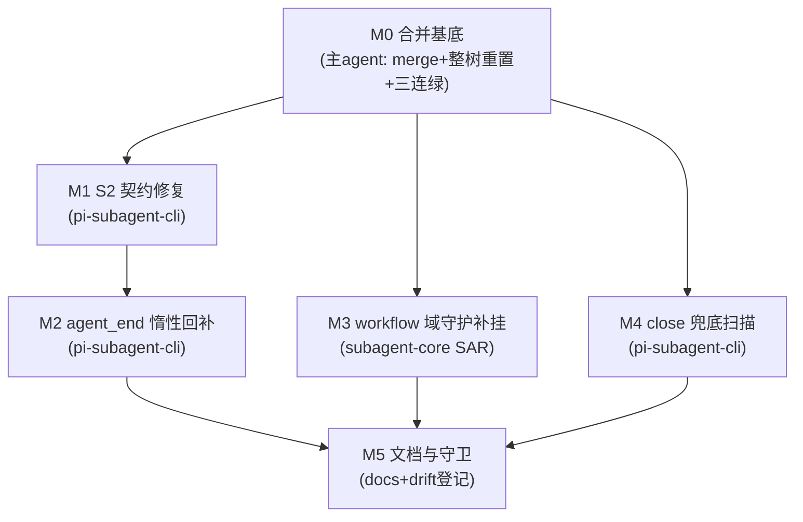

# subagent-agent-end-recovery-replay 实施计划

基线: (待基线 commit 后回填) | 来源设计: `docs/design/subagent-agent-end-recovery-replay.md`（设计就绪版，commit 41d475737） | 日期: 2026-09-10

对抗审查证据: `.review/design-review-replay-r1~r5.md`（主审五轮：5+3+2+1+0 MF 收敛）+ `design-review-replay-r1~r4-impact.md`（影响面审：R4 起 0 MF 收敛）。终局 = R5 主审 0/0 + R4 影响面 0 MF。

## 0 章节映射

所有 subagent task 的坐标唯一来源，禁止自猜编号。

| 内容 | 设计文档实际位置 |
|------|------------------|
| 背景/目标 | §1（1.1 SCQA / 1.2 系统认知与关键协议事实 / 1.3 设计目标 G1-G3 / 1.4 in-out scope） |
| 现状与根因 | §2（2.1 六环链重放 / 2.2 S2 现场 / 2.3 下游代价 / 2.4 兜底核验含 M3 缺口 / 2.5 数据流 / 2.6 根因类抽象） |
| 终态/机制 | §3（3.1 终态 / 3.2 D1-D4 移植判定表 / 3.3 决策 1-9 / 3.4 错误规格表） |
| 验收场景表 | §4（V1-V7 + V5b/V5c；章首验收分层声明：V2-V4 协议脚本对端、V1 真实 pi 端到端） |
| 下一层拆分 | §5.1 单元 M0-M5（含文件改动地图） |
| 待验证检查点 | §5.2 K1-K6 |
| 超时哲学合规 | §5.4 |

## 1 目标快照（逐字摘录设计 §1.3 / §1.4）

**G1（根除不通知）**：任何 subagent run——无论握手成败、进程死活、引擎崩否——终态必然到达主 agent（完成/失败/终止通知三选一），不存在无限等待。

**G2（通知质量）**：完成通知携带结果正文与 `session_read` 截断指针行；sessionFile 尽最大努力获取（它决定 chat 域「Full transcript」指针、冷续 resume 锚点、session-reader 取证能力），但其缺失不得阻塞通知。

**G3（防复发）**：失败类抽象为「一次性获取 + 失败不可恢复 + 下游无限保守等待」——新架构每环都必须有不依赖运气的外部熔断，且本文档把判定证据固化，防止未来重构时旧病根借尸还魂。

**Out-of-scope**（设计 §1.4）：keep-alive 后代保活编排迁回（W7 裁决域）；runtime rpc-client 双轨调和机制改造；W 系列机制任何改动；NotifyDomainPorts 加固（遗留①）；carbon 升级（遗留④，部署侧）。

## 2 单元列表

无独立 u-foundation：M1-M4 均为包内小改动，无跨单元新增共享类型/接口模块（M3 复用 subagent-core 既有 settled-watchdog 原语，M2 消费 pi-subagent-cli 既有 `requestGetStateOnce` 死导出）——M0 既是 DAG 根。

| Unit | 职责 | 领地（精确文件路径，基于本 worktree） | 依赖 | 隔离 | 验收条款 |
|------|------|--------------------------------------|------|------|----------|
| **M0 合并基底** | `git merge dev-0.9.16` → 解冲突 → 整树重置代码面（设计决策 7：`git checkout dev-0.9.16 -- packages/ && git checkout dev-0.9.16 -- eslint.config.mjs`，覆盖内容冲突 2 件/自动合并陷阱 2 件/自动保留面 5 件）；文档冲突保两套；对照 K5 预演清单 | 无新改动（纯合并+重置+归位）；**主 agent 亲自执行**（git 写操作 subagent 禁止） | — | plain | 合并后全量测试三连绿（本计划 §4 全量组）+ K5 冲突面对照无清单外意外 |
| **M1 S2 契约修复** | 设计决策 1：`get-state-handshake.ts:82-91` 两个 clearTimeout 均移入 sessionFile 命中分支（应答不完整视同未应答，保留全部既有驱动）；改写锁行为专测 `:163-192` 为契约断言（缺 sessionFile 应答 → 剩余重试照发 → 3 轮耗尽 resolve） | `packages/pi-subagent-cli/src/get-state-handshake.ts`；`packages/pi-subagent-cli/src/__tests__/get-state-handshake.test.ts` | M0 | plain | V2（协议脚本对端）+ 契约单测绿；头注「最多重试 3 次」与实现一致 |
| **M2 agent_end 惰性回补** | 设计决策 2：`spawn-runner.ts:274-276` 非 chatMode `onAgentEnd` 分支改 async 编排——同步段先置 `runEnd.endedCleanly=true`，回补段整体 try / `killChild()` 放 finally 必达；`requestGetStateOnce` 接线（K1：优先 identity tracker 的 `addStateListener`，核对签名）；K2 killChild 幂等核验 | `packages/pi-subagent-cli/src/spawn-runner.ts`；`packages/pi-subagent-cli/src/get-state-handshake.ts`（仅 K1 接线需要时，M1 已合入后串行无冲突）；新增测试 `packages/pi-subagent-cli/src/__tests__/`（agent-end 补查 fake timers 用例 + 回补链抛错 kill 仍达用例） | M1（串行：同包同文件潜在接线面，避免并行冲突） | plain | V3（spawn 期三轮不应答 + agent_end 恢复应答 → outcome.sessionFile 非空 + ≤1s）；回补链抛错用例证明 kill finally 必达 |
| **M3 workflow 域守护补挂** | 设计决策 9：SAR.run（`subprocess-agent-runner.ts:235` 起）try 块内 engine.run 派发前 arm per-run no-progress watchdog（30min）；刷新源 = journal.onEvent 包装 ∪ stream.onDelta 包装；fire = watchdog AbortController 并入 mergeTimeoutSignal 合流（:214 扩一源）→ wireAbortSignal 阶梯；disarm = finally + 桥接 listener 移除；fire 回调同步段只 abort+warn 不抛；重试语义保留（executeAgentCall 通用重试面） | `packages/subagent-core/src/execution/subprocess-agent-runner.ts`；新增测试 `packages/subagent-core/src/execution/__tests__/`（楔死 fire 链 fake timers + 产出刷新不 fire + killAll 组杀邻接 V5c + chat 域守护回归零变化 V5b）；若原语抽取需新文件归本单元领地 | M0 | plain | V5①（fire 链断言 + 刷新不 fire + agent() 收敛/journal close/重试面）+ V5b 全绿 + V5c；V5② 视 K6 核验结果降级 |
| **M4 close 兜底扫描** | 设计决策 4：新建 prompt 头键扫描器（mtime ∈ [spawnStartedAtMs, close] 候选 + 前 ~64KB 头读 + `includes(promptHead ~200字符)` + 单命中才采纳/零多命中放弃 + 采纳 warn 附审计证据 + 降级门 >64 候选或 >100ms）；close finalizer 接线（`spawn-run-pump.ts:201-216` LC-4 之后、resolveExit 之前）；整体 try-catch / resolveExit 必达；K3① prompt 逐字落盘验证 | `packages/pi-subagent-cli/src/session-file-locator.ts`（新）；`packages/pi-subagent-cli/src/spawn-run-pump.ts`（close finalizer 插入）；`packages/pi-subagent-cli/src/index.ts`（barrel）；新增测试（单命中/零命中/多命中/坏行容错/fs 异常降级） | M0 | plain | V4（全程不应答 → 扫描补上单命中；多命中构造 → 放弃+warn+run 正常终态）；fs 异常用例证明 resolveExit 必达 |
| **M5 文档与守卫** | 设计决策 8：线 B 三份文档头部修订记录（D1-D4 判定结论 + 新落点 M1-M4 + 旧实现文件已随 engines/pi 删除）；troubleshooting §12 同步；replay.md 登记 `DOC_MODULE_MAP` → `packages/pi-subagent-cli/src` 映射（drift 守卫真检查）；replay.md §4 回填验收结果 | `docs/design/subagent-agent-end-recovery.md`；`docs/design/subagent-agent-end-recovery.impl-plan.md`；`docs/design/subagent-core-unbounded-wait-audit.md`；`docs/troubleshooting.md`；`scripts/check-doc-symbol-drift.mjs`；`docs/design/subagent-agent-end-recovery-replay.md` | M1-M4 全 committed | plain | V7 机器门全绿 + drift 守卫对 replay.md 真检查非恒真 |

| **M6 mid-round 窗测试注入口**（阶段 3 审查后追加） | 补完决策 9 的验收：给 `settled-watchdog` 的 mid-round 阈值加**仅测试可达**的注入口（模块级覆盖钩子，先例 `_resetSettledWatchdogsForTest`）——**不做 env**（设计明文「中段阈值 v1 不开 env」，每个 knob 都是误配置通道；用户调短会误杀正常长任务），生产路径恒 30min。目的：让 V5② 用**秒级窗真跑全链**，把 M3 被拆成两段的 fire 链（V5① 计时→abort、V5c abort→killAll）焊成一条测试 | `packages/subagent-core/src/execution/settled-watchdog.ts`；`packages/subagent-core/src/execution/subprocess-agent-runner.ts`（仅在透传需要时）；新增测试 `packages/subagent-core/src/execution/__tests__/` | M3（**与 M3 修复条目同领地，必须串行同批**） | plain | V5② 真跑全链（秒级窗）：同一条测试内闭环「窗口到点 → fire → abort → 合流 → 取消帧 → 3s 宽限 → killAll」，且断言验的是**同一 AbortController 实例**；默认值 = 30min 有断言守护；注入后必须复位（防污染其他用例）；chat 域回归 V5b + subagent-core 全包绿 |

**领地互斥说明**：M1 与 M2 串行因同包同文件（get-state-handshake.ts 的 K1 接线面）；M1∥M3∥M4 无文件交集（pi-subagent-cli 两文件 / subagent-core 一文件）；M4 的 spawn-run-pump.ts 与 M2 的 spawn-runner.ts 是不同文件（pump≠runner），barrel index.ts 仅 M4 触碰（M2 新增函数不进 barrel，lazy 回补是 spawn-runner 内部编排）。M6 与 M3 同领地（`settled-watchdog.ts` / `subprocess-agent-runner.ts`）→ 阶段 4 必须合并为一组串行修，不得并行派发。

## 3 DAG 图



并行批次：**批次 1** = M1 ∥ M3 ∥ M4（3 并发，符合 ≤5 约束）；**批次 2** = M2（M1 合入后立即开工，与批次 1 剩余并行）；**批次 3** = M5。

## 4 测试策略

命令从各包 package.json 实读（dev-0.9.16 树，M0 后在本 worktree 生效）。红线：vitest（禁 node:test），从子包目录运行；timer 测试用 fake timers；测试写删目标 mkdtempSync 自建自删，禁碰真实数据目录（fs-guard 已挂 pi-subagent-cli 与 subagent-core vitest）。

**增量（单元开发期）**：

| 包 | 命令 |
|----|------|
| pi-subagent-cli | `cd packages/pi-subagent-cli && pnpm test`（vitest run）+ `pnpm typecheck` |
| subagent-core | `cd packages/subagent-core && pnpm test` + `pnpm typecheck` |

**全量（M0 基底验收 + 收尾 Gate A / V7 机器门）**：

```bash
pnpm run lint                                   # root ESLint
pnpm --filter @zhushanwen/pi-subagent-cli test && pnpm --filter @zhushanwen/pi-subagent-cli typecheck
pnpm --filter @zhushanwen/subagent-core test && pnpm --filter @zhushanwen/subagent-core typecheck
pnpm --filter @xyz-agent/runtime test           # M0 基底重点（5 件自动保留面在其领地）
# [Gate A 勘误 2026-09-10] 原写 @zhushanwen/runtime 是错的（该 filter 报
# "No projects matched the filters"），实读 packages/runtime/package.json 的 name
# = @xyz-agent/runtime。命令清单以 package.json 实读为准，本行已按实读更正。
node scripts/check-doc-symbol-drift.mjs         # M5 后
```

**端到端（Gate B，阶段 5）**：V1（真机 dev app 6 路并发 workflow subagent）+ V6（常规单路 + chat 域冷续）按设计 §4 步骤执行；V2-V4 协议脚本对端在单元验收期随做随验，脚本用完归档移除。对端 sessionDir 必须 mkdtempSync 或继承测试进程已重定向的 `XYZ_AGENT_DATA_DIR`（设计 §4 分层声明）。

## 5 合理偏差登记表

| Unit | 偏差描述 | 判定与依据 | 登记时间 |
|------|----------|-----------|----------|
| M1 | `get-state-handshake.ts` 头注新增「与旧 core `engines/pi/get-state-handshake.ts` 副本分叉」的表述（S2 修复仅限本包，旧副本未同步） | M1 提交前的头注已声明确修仅限本文件；旧副本随 M0 的 `engines/pi` 整目录删除消亡，跨副本漂移面不存在。**此处补登**（§6 曾称「deviation 1 条已登记」但 §5 缺行——阶段 3 审查分区 A 的 doc_error D1 指出该不一致，本次补正） | 2026-09-10 |
| M6 | 恢复指引追注（`withNoProgressRecoveryNote`）收敛到单一出口 `noteIfNoProgressFired`，正常返回与 catch 两路共用 | 阶段 3 审查（B-U2）称 catch 路径「构造性不可达」，实施者复核后**收窄该结论**：审查论证只对 `engine.run` 分支成立（fire 后 reject 走 RemoteEngine 合成 outcome 而非 throw），但 fire 后 try 块内仍有非 engine.run 抛点（探针：返回缺 handle 的 outcome → `journal.backfillHandle` 抛 TypeError 真走进 catch）→ 按最小纵深修复落单一出口。源码注释已按实测改写，不再复述整体不可达 | 2026-09-10 |
| M6 | 中段窗注入口形态 = 模块级覆盖变量 + `_` 前缀导出（`_setMidRoundNoProgressWindowMsForTest`），**刻意不做 env** | 对齐文件既有测试钩子先例 `_resetSettledWatchdogsForTest`（不造第二套模式）；不做 env 是设计明文「中段阈值 v1 不开 env」（每个 knob 都是误配置通道，用户调短会误杀正常长任务）。生产生效值恒 30min，且由单测断言守护默认值；`_resetSettledWatchdogsForTest` 一并复位覆盖值，防用例间污染。注入口不进口包 barrel（execution 层内部符号） | 2026-09-10 |
| M6 | U-B3 只改 warn 文案与注释，不改 env 开关语义 | 设计明文「中段阈值 v1 不开 env」，规则 19 要求有界兜底的处置可解释——故正确处置是让连带后果在 warn 里显式可见（「workflow 域 no-progress 熔断同时失效」），而非改开关行为或新增独立 env | 2026-09-10 |
| A2 | **U-A3 flaky 修复未采用复审给的两个修法，改为修根因**（阶段 1 跳出条件） | 修复者先按建议做了终局重试读（外加子进程 tmp+rename 原子落盘），实测 20 次中 3 次红、且失败签名从 `undefined` 变成 `getStateCount: 3`——证明终局读只是症状：阶段 1 只等 `agentEndSent` 就进入阶段 2，1s 假时钟一到 run 即收敛 kill 子进程，而子进程可能根本没从 stdin 读到第 4 次 get_state。**根因 = 「等 4 次送达」这个可判定条件缺失**（V3 用例的阶段 1 本来就带 `getStateCount >= 4`，这正是它不 flake 的原因）。修法 = 阶段 1 跳出条件对齐 V3（`agentEndSent && getStateCount >= SPAWN_HANDSHAKE_ROUNDS+1`）+ 终局断言复用该快照（此后 no-answer 形态无第 5 条命令，快照即终局、无新写入），并补 `getStateCount === 4` 断言证明回补请求确已送达。**这是「排障先修正常路径」的正确姿势：不加兜底 sleep、靠可判定条件结构性消除竞态。** 主 agent 独立连跑 8 次全量确认稳定（修复前 5 次中 1 次红） | 2026-09-10 |
| A2 | A2-3 采用「显式传 false + 写进字段文档 false 桶」，未采用「注释里列为例外」 | 该分支下扫描根本没启动、窗口总数客观未知，恒 0 的计数不是「窗口内无候选」，报 `true` 是语义错误而非文档表述问题；且现成渲染器 `formatCandidateCount` 已把 known=false 渲染为 `candidates=0 so far (window total unknown)`，选 false 让 warn 自动正确 | 2026-09-10 |
| A2 | A2-2 用例断言按实装重写而非保留原文 | 原用例喂「仅 tool_start、零 update」并把结论记为「静默工具不产活性信号」，与实装 pi bash 执行入口无条件发一条空 content update 冲突。改写为喂真实序列（tool_start + 启动那条空 update + 此后 1h 零 update），断言恰好一条活性信号且 1h 内不增殖——结论（楔死仍被 30min 回收）成立且断言与实装同形；src 与 test 头注同步改为「启动后零 update」 | 2026-09-10 |
| A2 | 观察项未修（领地外）：`spawn-run-pump.ts:231` 的 `formatCandidateCount` 对 known=false 的文案是 `candidates=N so far (collection aborted: window total unknown)`，而 `empty_prompt_head` 下严格说应是「never started」 | 该文件不在 A2 领地（越界即停）；核心语义（计数非总数、须按 so far 读）已正确，文案松一格不影响诊断方向。留主 agent 裁定：**接受现状**（`so far` 已表达「非总数」，`reason=empty_prompt_head` 已明确原因），不再为此单开一次改动 | 2026-09-10 |
| C | `backfillEngineHandle` 在「engineHandle 已存在但 sessionId 缺失」分支由原「整体覆写」改为「按字段补缺」 | 原实现在该分支会连 `poolKey` / `journalPath` 一起重置；F1 要求「其它字段不被意外重置」。真实链路 handleReady 由引擎在 session/create 应答后单次发出（无重发），该分支仅防御重复回调，且终态回填以 `handle.data` 权威值覆盖，无实质行为回归。trade-off 登记：占位 poolKey 不会被迟到值纠正，最终仍由终态回填 / `onPoolResolved` 定稿 | 2026-09-10 |
| C | 补缺时仅在确有字段落位才调 `reportRecordTransition` | 无新字段的迟到重复回调零写噪（用例断言同 sessionFile 恰好 1 条 entry）；确有补缺时落 entry 是持久化所必需（运行中 GUI 经 entry 重建 record 才能看到 sessionFile），不多建 record，仅更新同一 record 的投影 | 2026-09-10 |
| C | C-2 行号引用按实测核准后写入 | 指示要求「先核准再写」：`settled-watchdog.ts:32` 经核实未漂移（保留），`:82` → `:88`，另补 `:110`（测试 seam 定义）。修复者未照抄任务书给的行号 | 2026-09-10 |
| A | **U-A6 载体选型：复用既有 `{type:"message_end"}`（usage/error 双缺省的零写入变体）承载工具执行期活性信号，未新增 AgentEvent 变体** | `AgentEvent` 是 SDK **闭合联合**且 SDK 与 core 两侧 reducer 都是 `default: never` 穷尽性 switch——新增变体必须同改 `subagent-engine-sdk` 与 `subagent-core`，而 core 在本批为避免与 B 组并行冲突被列为禁区。故只能在既有变体里选「真正零写入」者：`message_end` 在 usage 与 error 双缺省时两侧 `applyMessageEnd` 全条件式（两个 if 均不成立）→ 既不写 record 字段也不开 turn。**主 agent 已独立复核四处消费点均为条件式 no-op**：`subagent-core/execution/execution-record.ts`（union 翻译，合成事件不经该路径）、`subagent-engine-sdk/journal-replay.ts:283`（`if (event.usage)` / `if (event.error)` 双条件）、`pi-subagent-cli/src/chat-session.ts:557`（`usage === undefined` 即 return）、`pi-subagent-cli/src/read-fallback.ts:74`（仅类型 guard）。**代价登记（见 §7 待办 F2）**：语义借用是领地受限下的权宜，长期应新增协议 activity 变体 | 2026-09-10 |
| A | U-A6 合成活性信号加 1s 节流（pi 自身已 100ms 节流之上） | 不节流则 30min 长构建约 18k 条合成事件进 journal/wire；1s 对 30min 窗仍远密于阈值，体量压到约 1/10（约 1.8k 条）。节流钟是 per-translator（per-run）状态 | 2026-09-10 |
| A | **U-A2 附带一处生产改动**（任务书字面只要求补 e2e）：LC-4 落位由「直接赋值」改为走 `applyGetStateFields({sessionFile})`（即发 handleReady） | 任务给的可证伪断言「handleReady 只在 close 后发一次」在当前实现下为 0 次——LC-4 原先只赋值不发通知，而 M4 采纳面（同属 close 期兜底）发通知，两路不对称。不改则断言必失败；改后与 M4 面一致、仍「只补 sessionFile」。反向探针证实：不补则 handleReady=[]（宿主在 close 期 LC-4 路径拿不到 transcript 锚点） | 2026-09-10 |
| A | **U-A5 实现方式否决主 agent 的「整段 try/finally」指示**，改为「逐步 best-effort + finally resolveExit」 | 修复者的反驳成立且更优：整段 `try { … } finally { resolveExit }` 下 `reportChildExited` 抛错仍会跳过 LC-4/M4（「把 M4 扫描放进必达区」不成立），且异常会逃出 close 监听器成为宿主 uncaughtException（比原问题更糟）。逐步 best-effort 使每步降级可留痕、后续步与 resolveExit 全部必达。测试同时断言 resolveExit 与 M4 均执行 | 2026-09-10 |
| A | pump 内新增导出 `formatCandidateCount`（放弃诊断候选数渲染）以便确定性单测 | pump 调 locator 时不注入时钟，端到端构造 `time_budget` 不可确定性触发；故把 warn 文本渲染抽成纯函数直测，配合 locator 的 `candidateTotalKnown` 字段单测共同覆盖语义。非协议、非对外 API（`index.ts` 未导出） | 2026-09-10 |
| M2 | `get-state-handshake.ts` **未改动**（K1 结论：接线不需要） | 既有握手调用点已用 `performGetStateHandshake(child, identity.addStateListener)` 同形态；`requestGetStateOnce` 形参 `AddGetStateResponseListener = (id, resolver) => void \| (() => void)` 与 `addStateListener(id, resolver): void` 直接可赋值——零接线即满足 K1「优先 identity 的 addStateListener」。已核验签名 | 2026-09-10 |
| M2 | `orchestrateAgentEndBackfill` 入参含可注入 `backfill` 实现 | 验收条款明列「构造回补段抛错证明 kill 必达」，需在编排边界注入会抛错的实现；生产路径恒传 `backfillSessionFileAtAgentEnd`（单次 `requestGetStateOnce`），同步段置位与 try/finally 语义与设计决策 2 逐字一致 | 2026-09-10 |
| M2 | `LAZY_GET_STATE_TIMEOUT_MS`（1000）落在 `spawn-runner.ts` 模块内且未导出 | `constants.ts` 在领地之外不可动；测试改为行为断言（假时钟推进 <1s 内收敛）而非引用常量。值域符合设计 §5.4 控制面单请求秒级 | 2026-09-10 |
| M2 | 回补命中后除 `addStateListener` 内部落位外，额外显式调 `identity.applyGetStateFields(fields)` | 与既有握手调用点（`identity.applyGetStateFields(r)`）同款兜底；幂等（同值不重发 handleReady，V3 用例断言 handleReady 恰 1 条） | 2026-09-10 |
| M2 | K2 核验结论：`killChild` **幂等成立**（非偏差，结论登记） | `subagent-engine-sdk/src/kill-chain.ts:95` 首行 `if (child.exitCode !== null \|\| child.signalCode !== null) return "terminated"` 早退；:121-129 safeKill 吞掉「检查与 kill 之间自退」的抛出。本包补组合级用例（回补 finally 经杀链落已退出 child → 不调 child.kill、不注册 exit 监听、可重复） | 2026-09-10 |
| M3 | 新增 `mergeRunSignals`（三源合流，返回 `{signal, dispose}`），`mergeTimeoutSignal` 降为薄包装 | 设计写「`:214` 扩一个信号源」，但既有 7 条纯函数测试锁死 `mergeTimeoutSignal` 返回 `AbortSignal` 且无 timeoutMs 时原样返回 external signal；同时 R4 INFO 要求 finally 移除桥接 listener（否则 run 级 signal 累积 → MaxListenersExceededWarning），需要 dispose 面。**单实现**（mergeTimeoutSignal 委托 mergeRunSignals），无第二套逻辑；顺带修掉原实现「controller 已 abort 后才注册清理 listener → timer 不回收」的既有时序盲区 | 2026-09-10 |
| M3 | **K6 结论：mid-round 30min 窗口不可缩短 → V5② 按设计降级 V1 端到端兜底**（**已被 M6 取代**：原结论仅对 env 路线成立，测试 seam 路线由 M6 打通 → V5② 恢复为可执行并跑通，见 §6 M6 行） | 中段阈值是原语内纯常量 `SETTLED_MID_ROUND_NO_PROGRESS_MS`（`settled-watchdog.ts:32` 注释「中段阈值 v1 不开 env」）；env `XYZ_SUBAGENT_SETTLED_WATCHDOG_MS` 只覆盖收尾段或两段全关，无缩短中段窗通道。加测试 seam 需改 `settled-watchdog.ts`（非 M3 领地）——不越界。**M6 修订**：env 路线关闭是刻意的减法设计（knob = 误配置通道），但不构成「测试无从缩短」——仅测试可达的注入口既不暴露给用户又能真跑全链，原结论把「不开 env」误推成「seam 不可行」 | 2026-09-10 |
| M3 | V5c 集成测试直接 abort watchdog 的 AbortController（= fire 回调内唯一同步动作），未真等 30min | 真引擎子进程无法与 fake timers 混跑（连接/IO 依赖真实 timer），且窗口不可缩短（上一条）。计时链路「30min 到点 → abort」由 V5①（fake timers）覆盖，V5c 覆盖「abort → mergedSignal → wireAbortSignal 阶梯 → killAll → 邻接 run 终态」进程链路，两者拼合为完整 fire 链（测试文件头注已声明） | 2026-09-10 |
| M3 | `stream.onDelta` 用「原地包裹 + finally 精确还原」而非原型链代理对象 | 既有锁定测试（`subprocess-agent-runner.test.ts`「U1 stream 透传」断言 `executeAndAwait` 第 4 参 `toBe` 同一 stream 对象）要求保持 identity；该测试文件不在 M3 领地，不修改。还原含 `hadOwnOnDelta` 分支，无残留覆写 | 2026-09-10 |
| M3 | 未修改任何既有测试文件；fire 后的失败结果追加恢复指引后缀（`withNoProgressRecoveryNote`，只对已带 error 的结果追注） | 领地只含 SAR 源码 + 新增测试；错误规格表（设计 §3.4）明文要求「失败结果附『重派 workflow / 检查 subagents』指引」，属设计落地而非新增功能 | 2026-09-10 |
| M4 | **K3① 结论：prompt 非逐字落盘 → 启用「原文 + JSON 转义形态」双 includes（未走设计的降级路径「只 warn 不采纳」）** | 主 agent 独立复核：实装 `@earendil-works/pi-coding-agent@0.84.4` 的 `dist/core/session-manager.js:701/732/753` 逐行 `JSON.stringify(entry)` 落盘 → 引号/反斜杠/制表/换行确为转义形态。JSON 转义是**单射**且逐字符确定性，故转义形态匹配的误配面与原文匹配同强度——设计的降级条件（「非逐字则不可靠匹配」）在转义形态下不成立，双 includes 是比降级更完整的落地，安全底线（单命中才采纳）未放松。反证用例已锁：仅原文 includes 必 miss | 2026-09-10 |
| M4 | locator 入参由 `promptHead`（调用方预截断）改为 `prompt`（全文，locator 内部截 200） | 截断契约留在调用方会让 `PROMPT_HEAD_CHARS` 出现跨文件第二份实现；接线点收缩为一行属性。设计与决策 4 未规定截断方，语义不变 | 2026-09-10 |
| M4 | 截断点落在 UTF-16 高代理时丢弃该半字符 | 半截代理的两种键形态都不匹配文件（`JSON.stringify` 对孤立代理输出 `\udXXX` 转义），会静默 no_match；丢弃后头部仍是全文逐字符前缀，两形态必然命中（用例「代理对边界」锁定） | 2026-09-10 |
| M4 | `candidateCount` 始终 = `candidates.length`（上限门场景报实测值而非 0） | 设计 §3.4 要求 warn 含候选数，而上限门正是最需要该数字的场景（用例断言 65） | 2026-09-10 |
| M4 | warn 由 pump 侧发出，locator 保持纯函数（只回结构化结果 + 16 hex 头哈希） | `recordId` 只在 pump 侧存在；locator 不落 prompt 明文，审计面只给哈希 | 2026-09-10 |
| M4 | 全 miss warn 文案未逐字照抄设计 §3.1 第 4 步（保留 `[sessionfile] unobtainable for <recordId>` 前缀与 `record finalized without transcript anchor` 尾句，增补 reason/candidates/promptHeadHash/error 与 Recovery 指引） | 设计原文的「all 5 acquisition paths missed」在 close 收尾单点判断时未必为真（可能 LC-4 已命中或第 4 路生效），逐字照抄会写出不成立的断言；结构对齐 §3.4「warn 附恢复指引」 | 2026-09-10 |
| M4 | 采纳面只补 `sessionFile`，不由文件名反推 sessionId | 决策 4 采纳面仅 sessionFile；e2e 明确断言 `result.sessionId` 仍为 undefined（已知面，非缺陷） | 2026-09-10 |
| M4 | **领土扩张：`spawn-runner.ts` +1 行**（`sessionFileFallback: { prompt: params.task, spawnStartedAtMs: startTime, sessionDir: params.sessionDir }`） | 计划期领地划分漏项：prompt 只存在于 `runSpawnOnce` 作用域，pump 的 `StdoutPumpDeps` 不含它，设计决策 4 只写了 pump 侧插入未预见此依赖。主 agent 裁定授权（M2 已 commit 042dccec6，无并发写者）；核验确认 diff 恰 1 hunk / 1 行，`index ed2ebaa10` = M2 提交版，M2 逻辑零触碰 | 2026-09-10 |
| M4 | 新增 seam 缺省分支 warn「M4 prompt-head scan not wired」 | 设计未规定；防止缺接线时静默降级（规则 20）。生产已接线，该分支现只覆盖未接线调用方与测试 | 2026-09-10 |
| G-A-1 | 修复超出任务书「阶段顺序重排」的字面范围：另把 fake 子进程状态文件改为写前日志（write-ahead，计数先落盘再发 stdout 副作用） | 证据驱动而非镀金：只做阶段重排时 120 次满载仍有 1 红——存在第二竞态（子进程先回包后落盘，父侧成功路径的 finally kill 会把状态文件截断在 O_TRUNC 写窗口，实测 rawLen=0），不在阶段重排覆盖面内。写前日志使「父进程可观察 ⇒ 文件已记录」成为因果不变式。改动全在测试文件内的 fake 子进程脚本，零生产源码变更 | 2026-09-10 |
| G-A-1 | 阶段 ① 停点选「第 3 次握手落盘可见」而非任务书字面的「agent_end 已发出」 | 子进程 flush(count=3) causally 先于 emitAgentEnd()，停在前者可证明回补超时 arm 后假时钟累计推进 ≤ 一个 FAKE_STEP_MS（10ms）vs 1000ms 预算（差两个数量级）；停在 agentEndSent 则「子进程 flush 与我方轮询」之间留有与 arm 无因果序的窗口，慢机器仍可输 | 2026-09-10 |
| G-A-1 | 阶段 ② 真实等待上界用轮数（REAL_WAIT_POLLS=2000 × 1ms realSleep ≈ ≥2s 墙钟）而非 Date.now() deadline | `vi.useFakeTimers()` 连 Date 一起伪造，deadline 在刻意停摆的假时钟下冻结不前进；轮数 × realSleep 不受假时钟影响且给满真实 I/O 余量。等待超时的报错信息含 last/raw 诊断（永久性，非探针残留） | 2026-09-10 |
| G-A-2 | 产品文件 `subagent-engine-history.ts` 有改动（任务书字面限「测试时序确定性」） | 改动 = 测试钩子换装：删旧 seam `setEngineIdleReuseMsForTests` 与可变 `idleReuseMs`（唯一消费者即被改用例，删后全仓引用零残留、drift 守卫过）、提取 `expireIdleEntry` 共享函数、新增 `expireIdleEngineClientsForTests` 钩子（与真实定时器回调共用同一到期路径）。生产路径逐点不变：`armIdleTimer` 直接用 `ENGINE_IDLE_REUSE_MS` 常量（原可变量生产态恒等于该常量）、武装/重置/清除语义全同、钩子无生产调用方。沿用本仓 `*ForTests` 先例（settled-watchdog 的 `_setMidRoundNoProgressWindowMsForTest` 同款）。主 agent 逐行核验 diff 后接受该 1 文件领地扩张 | 2026-09-10 |
| G-A-2 | 用例不再直接断言「真实定时器按被覆盖窗口值到期」 | 该覆盖原本只由竞态路径顺带提供，本身不可确定性断言；两条语义断言（窗口内零新 spawn / 过期 dispose 后重建 +1）逐字保留并经变异测试证明非空洞（去 delete / 跳复用缓存各自把用例变红）。代价 = 5min 窗口的真实 timer 到期触发不再被 e2e 直接观测，由共用 `expireIdleEntry` 的同路径间接覆盖 | 2026-09-10 |

## 6 状态表

| Unit | 状态 | 轮次 | 证据指针 |
|------|------|------|----------|
| M0 合并基底 | committed | 1/2 | merge 430dacabc + 残留清理 e192dfe4a；K5 冲突面与预演清单完全吻合；全量三连绿（pi-subagent-cli 304 passed / subagent-core 2834 passed / runtime 457 文件 5184 passed / tsc 干净） |
| M1 S2 契约修复 | committed | 1/2 | 9578af7f4；diff ⊆ 领地（2 文件）；契约断言（缺 sessionFile → 重试照发 1→2→3 → 耗尽 resolve）+ 全包 304 绿 + tsc 干净；deviation 1 条已登记（注释分叉表述修正） |
| M2 agent_end 惰性回补 | committed | 1/2 | 042dccec6；diff ⊆ 领地（spawn-runner.ts + 新测试，`get-state-handshake.ts` 按 K1 结论零改动）；6 用例绿（V3 回补 ≤1s 实测 614ms / 回补 reject 与 sync-throw 两路 kill 必达 / K1 接线面 / K2 幂等 / 自退 race）+ 全包 310 passed（基线 304+6）+ tsc 干净；deviation 5 条已登记 |
| M3 workflow 域守护补挂 | committed | 1/2 | bd4404ddf；diff ⊆ 领地（subprocess-agent-runner.ts + 2 新测试，禁区三文件未动）；8 用例绿（V5① 7 + V5c 1，V5c 真引擎 3.06s）+ 全包 2842 passed（基线 2834+8）+ tsc 干净；**K6 结论：mid-round 窗不可缩短 → V5② 降级 V1 兜底**；deviation 5 条已登记 |
| M4 close 兜底扫描 | committed | 1/2 | f737baa7a；diff ⊆ 领地 + 授权的 1 行扩张（核验：spawn-runner.ts 恰 1 hunk/1 行、base hash = M2 提交版）；29 新用例绿（locator 17 + pump 8 + 生产路径 e2e 4，含接线前后反向探针）+ 全包 339 passed（基线 310+29）+ tsc 干净；K3① 已双源复核（探针 + 主 agent 读 pi dist）；**K3② 未执行**，归属改为阶段 5 V1 期（见 §7）；deviation 9 条已登记 |
| M5 文档与守卫 | committed | 1/2 | 4d9a6a703；6 文件（线 B 三文档 + troubleshooting §12 重写 + drift 守卫登记 + replay.md §4/§4.1 回填）；V7 主 agent 独立复现：守卫 exit 0（9 映射文档）+ 反向探针（插 `FAKE_NOT_EXIST_XYZ_SYMBOL` → 报 drift exit 1，还原后 md5 一致、复跑 exit 0）+ 旧特征串在现树 grep 零命中（`backfilled via late get_state` / `no-descendant fast path` / `15s recovery window` 等）；doc 交叉核验：CANCEL_SETTLE_GRACE_MS / MAX_ATTEMPTS 两个跨包符号确在登记的权威模块内 |
| M6 mid-round 窗测试注入口 | committed | 1/2 | 8b78f392a；`settled-watchdog.ts` 注入口（`_setMidRoundNoProgressWindowMsForTest` + 单一读取点 arm/refresh 共用，生产恒 30min 有断言守护，reset 一并复位）+ `subprocess-agent-runner.ts` 恢复指引收敛单一出口；V5② 真引擎秒级窗全链 8.05s 通过（含邻接 run engine_crashed）；全包 2847 passed（基线 2842+5）+ tsc 干净 + V5b 全绿；deviation 3 条（其中 U-B2「构造性不可达」结论被实测收窄，见 §5） |

## 7 残留风险与变更历史

**残留风险**：

- K1-K6 检查点（设计 §5.2）分别挂在：M2（K1 接线签名 / K2 killChild 幂等）、M4（K3① prompt 逐字落盘——**实测非逐字，已启用双形态键、未降级**，见 §5 M4 行）、M0（K5 冲突面预演对照——清单外 packages/ 冲突即停下重估）、M5（K4 rpc-client diff 核验无欠账重放）、V5②（K6 mid-round 窗可否缩短——**已由 M6 打通测试 seam 并跑通，未降级**，见 §6 M6 行）。
- V1 真机验收需 dev app + 真实 workflow 派发环境（阶段 5 处理，可能需 `pnpm dev` + Playwright 连 9222）。
- K3① 失败时 M4 降级路径已在设计决策 4 预置，不阻塞 M1-M3/M5。
- **M3 的 K6 结论已被 M6 修订**：原判「workflow 域 mid-round 窗不可缩短 → V5② 不可执行、降级 V1 兜底」只对 **env 路线**成立；测试 seam 路线经 M6 的 `_setMidRoundNoProgressWindowMsForTest` 打通，**V5② 已恢复为可执行并跑通**（真引擎秒级窗单条测试闭环，§6 M6 行）。**阶段 5 Gate B 仍设 V5② 项**（不再是「不设」）；V1 真机端到端继续保留。
- 对 M3「V5c 未真等 30min」的残余风险：**已关闭两重**——① 阶段 3 分区 B 审查独立证实 fire 链两段咬合（同一 `AbortController` 实例贯穿 watchdog → mergeRunSignals → `ctx.signal` → `wireAbortSignal`；`dispose` 吞掉待 fire 场景的反例构造失败）；② M6 落地后 V5② **已**把这条链收进单条测试（不再是「将」）。
- **U-A6（工具执行期刷新失明 → 长 bash 误杀）是本次审查最重要的发现**，也是决策 9 引入 workflow 域后暴露的真机风险形态：修复前，单次 bash 调用 >30min（pi 内置 bash 无默认超时）会被判无进展并取消、重试 3 轮后失败。设计 §3.3 决策 9 误杀面与本文档修复待办均已登记，修复并入阶段 4 的 A 组；**该修复完成前不得进入阶段 5 Gate B**（否则 V1/V6 真机验收会把误杀形态带进结论）。
- **K3②（真实 workflow 并发形态下 prompt 头部键区分度实测）归属已裁定到阶段 5 Gate B 的 V1 期**：该检查点需要真实 workflow 派发环境（dev app），单测面无法构造真实并发头部形态。若 V1 期实测发现同模板并发头部同质率高 → M4 兜底在该场景下只会「安全放弃」（不误配，但也无效），届时应按设计决策 4 的升级路径改键策略（全文哈希 / 参数段取样）并回写设计。
- **已接受的测试输出噪音**：M2 的 `agent-end-backfill.test.ts` race① 用例 sessionDir 为空，M4 接线后 close 收尾会多打一行 `[sessionfile] unobtainable ... reason=no_candidates` warn。这是接线后的真实降级留痕（非失败），不改该用例（静音会掩盖真实行为面）。
- 阶段 5 Gate B 需注意 V4 的场景构造：单命中/多命中判定依赖 mtime 窗口内候选数，真机验收时目录里同期并发 run 的 session 文件会天然构成多候选——多命中即安全放弃，验收判据应是「不误配 + run 正常终态」，而非「必须命中」。
- **F5（基础设施 flake，范围外登记，非本批代码缺陷）**：pre-commit 存在自改写竞态——「Runtime Bundle 验证」段内部的 `pnpm install` 触发根 `prepare`（`.githooks/install-hooks.sh`）→ `cat >` 重写**正在被执行的** `.bare/hooks/pre-commit`。若装的是旧代（`.githooks` 源变更后无根级 install 刷新，本次即 M0 合并 aa12eed36 更新源后），新旧代字节长度不同 → bash 读偏移失步 → 把正则片段当命令执行、报假语法错、commit 中止。本次 G-A-2 首次提交即被此中断（详见 §7 Gate A 复验块）；钩子本体完好（`bash -n` 通过、重生成 md5 确定性）。**长期修法另行任务**：install-hooks 改原子写（tmp + mv 同目录 rename）或 bundle 验证内的 install 加 `--ignore-scripts`。

**阶段 3 一致性审查结论与修复待办（2026-09-10，两分区均回）**

分区 A（pi-subagent-cli，M1/M2/M4）：3 reasonable + **5 unreasonable** + 4 doc_errors。
分区 B（subagent-core，M3）：8 reasonable + **4 unreasonable** + 1 doc_error。**两分区均明确「实现与设计字面要求逐条相符，M3 无一条要求回退或重做」；fire 链两段咬合经分区 B 独立证实（同一 AbortController 实例贯穿 watchdog → mergeRunSignals → ctx.signal → wireAbortSignal，且 dispose 吞 fire 的反例构造失败）——§7 原列的「两段接口未咬合」残余风险就此关闭。**

doc_errors（4+1 条）已由主 agent 本次修订（doc_errors 归主 agent，非编码）：D1 补 §5 M1 偏差行；D2 设计 §3.1 第 4 步 warn 改结构化模板（删「5 路全 miss」不成立断言）；D3 设计 §3.3 决策 4 补第二类失效面（prompt 不在候选文件前 64KB：fork-from 大源 / `--session` 续写追加）；D4 设计 §3.3 决策 2 ③ 补 chat 域的 M4 兜底；B-doc 设计 §3.3 决策 9 误杀面补 tool_execution_update 形态（见下）。

修复待办（阶段 4 按领地分两组，组间并行、组内串行 ≤5 并发）：

| 组 | 条目 | 来源 | 严重度 | 落点 |
|----|------|------|--------|------|
| **A（pi-subagent-cli）** | U-A1：M1「至多 3 次必 settle」头注契约强于代码（`sendGetStateCommand` 抛错 → promise reject；重试路径抛错 → 定时器回调内 uncaught） | A-U1 | low | `get-state-handshake.ts`（tryOnce 包 try/catch 按「本轮未应答」处理） |
| | U-A2：V2 未执行 + 「缺 sessionFile → 3 轮耗尽 → close 靠 LC-4 补文件」这条 M1 新打通的组合零覆盖 | A-U2 | medium | 新增 e2e（`__tests__/`） |
| | U-A3：M2「≤1s」断言失焦——验的是「应答先到」路径，1s 改 100s 照样绿，超时路径上界未被测量 | A-U3 | medium | `agent-end-backfill.test.ts` 补「回补也不应答」用例 |
| | U-A4：M4 时间门早退时 warn 的 `candidates=N` 是部分计数，与字段语义不符（误导诊断方向） | A-U4 | low | `session-file-locator.ts` |
| | U-A5：close finalizer 的 `resolveExit` 必达只对 M4 自身成立——紧邻其前的 `reportChildExited`（宿主回调）无包裹，抛错即跳过 M4 与 resolveExit = run 永挂（真 G1 破口） | A-U5 | low（但属 G1 破口） | `spawn-run-pump.ts` → finalizer 体整段 try/finally |
| | U-A6：**工具执行期刷新失明 → 单次 bash 调用 >30min 被判无进展取消（真机误杀）** | B-U1 | **中** | `spawn-event-translator.ts`（见下决策，两条硬约束） |
| **B（subagent-core）** | U-B1：`hadOwnOnDelta===false`（生产形态：原型方法）还原分支零覆盖，偏差声称的「无残留覆写」缺证据 | B-U3 | low | 补类实例用例 |
| | U-B2：`withNoProgressRecoveryNote` 不覆盖 catch 路径（构造性不可达，纵深防御） | B-U4 | low（理论） | `subprocess-agent-runner.ts` |
| | U-B3：`XYZ_SUBAGENT_SETTLED_WATCHDOG_MS<=0` 现在会**静默关闭 workflow 域的 G1 熔断**（原语义只关 chat 域），耦合未登记且 warn 文案只提 chat 域 | B-U2 | 中低 | `settled-watchdog.ts`（warn 文案补 workflow 域失效提示 + 设计登记） |
| | **M6**：mid-round 窗测试注入口 + V5② 秒级窗全链测试（§2 M6 行） | 用户裁定 + K6 | — | `settled-watchdog.ts` + 测试 |

**U-A6 的核实与裁定（主 agent 独立复核）**：① pi 内置 bash 无默认超时（`dist/core/tools/bash.js` schema「optional, no default timeout」+ `resolveTimeoutMs(undefined) → undefined`）；② pi 确实发 `tool_execution_update`（`dist/core/agent-session.js:537-539`）；③ pi-subagent-cli 翻译层 switch 无该分支（`spawn-event-translator.ts` 的 `default: return`）——两路刷新同时失明。裁定 = **修**（工具持续产出即「有进展」，计入活性信号既消除误杀又不削弱「静默楔死仍被回收」），修复须在 pi-subagent-cli 内闭环（core 侧刷新面无需改动），硬约束两条：**不得污染聊天记录**（不得把工具输出当正文文本推流）、**不得让楔死工具永续命**。若最小修复无法同时满足两条 → 停下来登记为已知接受风险并回设计评审，不得硬凑。

**阶段 4 修复后留下的两条跨领地事项（主 agent 已核，不得静默）**

- **F1（已修，commit `dda8b4d98`）**：`packages/subagent-core/src/execution/subagent-service.ts:2291` 的 `backfillEngineHandle` 幂等守卫原是 `if (record.engineHandle !== undefined && record.engineHandle.sessionRef["sessionId"] !== undefined) return;`——**只要 sessionId 已落就整条丢弃**，于是「sessionId 已知 + 迟到携带 sessionFile 的 handleReady」被永久吞掉，`record.engineHandle.sessionRef.sessionFile` 不落位。而这恰是本批让之可达且更有价值的组合（V2/M4 的 close 期兜底面都会发携 sessionFile 的 handleReady）。消费点两处：`subagent-service.ts:2810`（`anchor.sessionRef["sessionFile"]`）与 `:2921-2922`（携带给引擎 interact 定位）。**修复**：改为「按字段补缺」——已有值一律不被迟到值覆盖（幂等保留），缺失字段照常补上；`poolKey` / `journalPath` 不参与补缺（journalPath 权威归 journal writer、poolKey 归 `onPoolResolved` retarget 与首次回填），仅在确有字段落位时才 `reportRecordTransition`（迟到重复回调零写噪）。用例断言「sessionId 先落、sessionFile 后到 → 补缺生效」+「同值重复不覆盖」；反向探针（临时插回旧守卫）确证该用例会红。
- **F2（已登记的长期债 → 已清账，2026-09-10 交付后 PR1 三包原子落地）**：U-A6 曾复用 `{type:"message_end"}` 作为工具活性信号载体（当时 core 是并行禁区的权宜）。**清账形态**：协议 AgentEvent 新增第一类 `activity` 变体（第 9 员，语义 = 纯活性信号：双侧 reducer no-op、不开 turn、不写状态、不落 journal、只承诺活跃时周期性出现）；SDK（union + journal-replay 穷尽 case + schema enum + engine-protocol v1.x 增量注释 + 测试三处）、core（`execution-record.ts` updateFromEvent 2 行 no-op case + `journal-wiring.ts` 豁免 append + 遗留翻译器 `jsonlToAgentEvent` 对齐产出 activity + 注释同步）、pi（`TOOL_ACTIVITY_EVENT` 换轨 + `read-fallback` 白名单刻意不加（配套：activity 不进任何持久/重放面）+ U-A6 用例适配）三包同 commit 原子落地；zcode 与 runtime 零改动全绿（跨引擎回归证明）。验证：SDK 136 / core 2850 / pi 330 / zcode 238 四包 tests + typecheck 全绿（主 agent 独立重跑）。**后续**：PR2 = F3 已落地（清账见下条）；PR3 = zcode 生产者已落地（清账见 F3 条尾）。代码注释已就地登记（`spawn-event-translator.ts` 的 `TOOL_ACTIVITY_EVENT` 段），此处同步登记防止只写在注释里丢失。
- **F3（覆盖边界登记 → 已清账，2026-09-10 交付后 PR2 落地）**：U-A6 的修复覆盖面原 = **workflow 域全域 + chat 首轮**；chat 续聊（interact）轮失明（续聊轮不外发事件；宿主续聊轮刷新源只有 `streamDelta`，工具输出被硬约束①挡在 delta 外）→「仅工具输出、零正文」>30min 仍会被中段守护误杀（chat 域内既有形态，非本批引入）。**清账形态**（F2 定案选型：`host/roundLifecycle` 增 `phase:"active"` 轮内心跳相位，比新开 host/* 反向通道便宜——复用第 9 通道既有键路由与消费口）：SDK（`RoundActivePhase` 无载荷接口 + 相位联合 4 员 + `HostRoundLifecycleParams` 扩 8 组合 + 结构守卫收 active + 契约注释改「三终态 + 轮内心跳」）、core（`handleChatRoundPhase` 增 `case "active"` → `refreshFromProtocolEvent`，与 streamDelta 路同款，不处置 record 不交棒不置闲）、pi（chat-session 续聊轮 `activity` 事件经**独立 `emitActivePhase`** 发射 recordId 键 active 帧——**红线：不经 `emitPhase`**，emitPhase 会逐一 resolve `roundTerminalWaiters`，cancel 在途轮的长工具执行期被误判轮终提前收敛；唯一守卫 = superseded 抑制（同 recordId 冷续后旧进程残留心跳不得刷新新轮）；首轮零变化，activity 仍走 onEvent 通知通道；节流归 translator 本层不重复）三包同 commit 原子落地 + 3 处领地外「三相位」注释同批清扫（server.ts / reverse-router.ts / port.ts）；zcode 与 runtime 零改动全绿（跨引擎回归证明）。验证：SDK 137 / core 2853 / pi 334 / zcode 238 四包 tests + typecheck 全绿（主 agent 独立重跑）；**红线负向用例**（cancel 轮终等待体在册期间 activity 到达 → 断言 active 帧已发射且 cancel promise 仍 pending、无杀链提前，满 `CANCEL_SETTLE_GRACE_MS` 才走 SIGTERM→30s→SIGKILL 升级收敛——若 active 经 emitPhase 发射该用例即红）；e2e（fake-pi-chat 续聊轮新增 `tool_execution_update` 输出 → 断言先收 recordId 键 active 帧再收 delta/settled/idle，首轮零变化）。**后续 PR3 = zcode 生产者已落地（gate 探针过 + 单包实现）**：真机探针（`/tmp/zcode-activity-probe.log`，2026-09-10，66s bash 工具全程抓帧）实证 app-server 工具执行期**每 ~1.01s 推一帧** `session/event {type:"tool.updated", payload:{kind:"progress", toolCallId, toolName, elapsedMs, stdoutBytes, stdoutTail, pid}}`（同 eventId 另有 `v4/telemetry {kind:"tool.lifecycle", phase:"progress"}` 镜像）——引擎侧 idle 早已被这些帧刷新（`handleSessionEvent` 任意 payload 帧先 refreshIdle），缺口确证仅在宿主侧（既非 final-frame 也非 delta → 零宿主回调）。实现 = session-channel `SessionTurnCallbacks` 新增 `onActivity`（`handleSessionEvent` 在 applyFinalFrame 未命中且 `applyStreamDelta` 返回 false 且未落定时触发——不设在 refreshIdle 咽喉防 delta 帧双发；telemetry 路径不加同款防镜像双发；**不加节流**，服务端天然 ~1s cadence）+ zcode-engine `attemptAppServerTurn` 接线 `ctx.onEvent({type:"activity"})`（zcode `conversation:"unsupported"`，run 域唯一发射面）；zcode journal 不落 AgentEvent 无需豁免面。改动恰 4 文件 ⊆ zcode-subagent-cli，SDK/core/pi 零改动（activity 变体与宿主类型无关刷新面 PR1 已就绪）。验证：zcode 243 passed + 3 skipped（live 门控存量）+ tsc 干净，主 agent 独立重跑；新增 5 用例（4 条 channel 单测含正/负向与终态后迟到抑制 + 1 条引擎接线 toStrictEqual 零载荷字段面 + 事件序全断言）。帧面实证同步回写 [zcode-engine-appserver-resident.md](zcode-engine-appserver-resident.md) A.2。
- **F4（范围外观察 → 已修，2026-09-10 用户指令，commit `f8ff8f15e`）**：`spawn-run-pump.ts` 的 stdout pump `'error'` 分支调 `onClose(null, null)`，而 `normalizeExitCode` 在 `endedCleanly=false && code=null && signal=null` 时返回 0 → **spawn 失败（如 ENOENT）可能被 `collectOutcome` 判成 success=true**（子进程从未运行却产出成功空终态）。**修复**：error 分支先快照错误消息（`RunEndState.childErrorMessage`）再走原 onClose 清理链（U-A5 必达契约不变、迟到 close 幂等），finalizer 见快照即按 `SPAWN_ERROR_EXIT_CODE=127`（POSIX command-not-found 惯例）收尾；collectOutcome 在非零路径携带 `pi child error: <原始 message 含 errno/路径> (exit code 127)`；`exitCode===0` 判定优先，防「close settle 0 后迟到 error」的自相矛盾终态。调查结论：该分支是全仓唯一 `onClose(null` 调用点（无其他同型）；normalizeExitCode 权威实现在本包非 SDK（SDK 未动）；下游无消费方依赖旧行为（core `finalizeEngineOutcome` 的 resumable 接管要求 `exitCode===null`，如实失败不带该字段 → 正常 failed 终局）。证据：全包 330/330（含 3 单元 + 1 真实 ENOENT 集成用例）+ tsc 干净，主 agent 独立重跑确认。
- **F6（范围外产品缺口，Gate B 发现 → 已修，2026-09-10 用户裁定「都修」，协议字段路线）**：GUI（dev app）内**任何 pi 引擎 subagent 派发**（workflow 域与 chat 域全域）在 relay 拓扑下被阻断——relay 包装进程因缺 `XYZ_SUBAGENT_RELAY_SESSION_ID` 拒绝运行 → pi child **exit 13**。实测证据（2026-09-10 Gate B）：workflow 6 连败 + chat 域首轮失败，`~/.xyz-agent-dev/logs/pi-task-stderr-{11096..11101,24298}.log` 七份全为同一条 relay 拒绝信息。根因链：spawn-runner buildChildEnv 的 SESSION_ID 源 = `params.sessionRootId ?? env PI_SUBAGENT_ROOT_SESSION_ID`，三来源全空（①协议 v1 ctx 无字段 ②EngineClient 不传 identityEnv ③根 pi 进程 env 无该键）。定性：协议化迁移的既有回归（dev-0.9.16 同形），非本批引入。**修复（二选一取协议字段路线——spawn-runner 注释预告的收敛点）**：`RunContextParams.sessionRootId?`（additive 可选，旧引擎忽略；帧级 schema params 不深校验）从 core 派发点一线贯穿——`SubagentService.sessionRootId`（initSession `envRoot ?? init.sessionId` 注入，:606，GUI extension 场景恒有值）→ 两处 runCtx 构造（runEngineTask / runAndFinalize，null/空串不上 wire）→ remote-engine buildRunParams spread → wire `run.params.ctx.sessionRootId` → pi CLI server buildRunContext 还原 → pi-engine buildOneShotRunParams / buildChatRoundParams 透传 → 既有 buildChildEnv 消费点（:183，env 回落保留给 standalone/裸 CLI 形态）。**不选 identityEnv 路线的理由**（登记于 port.ts 字段注释）：EngineClient 按引擎缓存为惰性单例，进程级 env 在 pi fork 换 sessionId 后陈旧；per-run ctx 恒新鲜，且 RECORD_ID 已是 per-run 形态（两归属键形态一致）。SDK port-contract RunContext + core port RunContext 同步加字段（W10 conformance 漂移面覆盖）。改动 13 文件（8 源 + 5 测试）⊆ 三包领地；zcode/runtime/extensions 零改动（zcode 忽略 additive 字段）。验证：SDK 139 / core 2855+4 skip / pi 335 全绿 + tsc 干净（主 agent 独立重跑）；「undefined 不上 wire」负向断言三层（wire / server 还原 / SpawnRunParams）+ 非空逐字保真正向断言（one-shot 与 chat 轮两分派面）。**附带语义事实（调试发现，非本次引入）**：runAndFinalize 的引擎解析恒走 registry 'pi'（resolveChatEnginePort → resolveHostPiEnginePort），不消费 opts.engine。真机回归：见 V1/V6 重跑（F6 修复后 GUI pi 派发恢复为验收断言项）。
- **F7（基础设施：staged 引擎构建滞后，Gate B 发现 → 已修，2026-09-10 用户裁定「都修」）**：dev app 实际加载的引擎 = `apps/electron/resources/engines/<id>/index.js`（gitignored 构建产物），pi 引擎副本曾构建于 2026-09-10 16:30（缺其后全部修复）；**`pnpm dev` 不重建 staged 副本** → 「GUI 真机跑旧引擎代码」系统性风险。**修复（选「dev 恒重建」而非哈希新鲜度校验）**：实测 `bundle-extensions.mjs` 全量（18 extensions + 2 engines）esbuild 耗时 <1s，新鲜度校验的状态机（哈希记录/比对/漂移面）成本高于恒重建收益——`apps/electron/package.json` 的 `dev`/`dev:mock` 启动链显式前置 `node ../../scripts/bundle-extensions.mjs`（pnpm 默认不跑 pre/post 钩子，npmrc 未启用 enable-pre-post-scripts，故不采用 predev 命名而显式链入）；源码错时 esbuild 失败 → dev 启动即红（优于静默跑旧副本）。**范围澄清**：extensions 在 dev 走源码（`prepare-builtin-extensions.sh` 头注 / builtin-extension-dev-build-split.md 的 dev/build 分流），无此缺口——F7 缺口仅 engines（engine-roots.ts dev 也解析 staged，无分流）；恒重建顺带刷新 staged extensions 对 dev 无害（dev 不消费）。engine-roots.ts 注入面注释与 AGENTS.md 前端调试节同步登记（绕过 dev 链直接起 Electron 须手动 bundle）。

**阶段 5 Gate A 结论（2026-09-10，首次执行：不全绿）**

- **绿**：root lint（`eslint . --max-warnings 0`，零诊断）；pi-subagent-cli test 356 passed + typecheck；subagent-core test 2848 passed / 4 skipped + typecheck；drift 守卫；6 个 pre-commit 守卫（engine-sdk-boundary / engine-package-boundary / subagent-core-closure / test_flake_hygiene / pi-semantics / pi-sync）；extensions typecheck + lint。
- **红（2 条，均为 flaky 而非确定性失败）**：
  - **G-A-1（我方改动面，必修）**：`pi-subagent-cli` 的 **V3 用例**在满载下约 1/5 概率红（`statusAtBackfill === undefined`）。**该现象直接反证了 §5 A2 行的结论**——A2 声称「V3 的阶段 1 本来就带 `getStateCount >= 4`，这正是它不 flake 的原因」，实测 V3 的阶段 1 循环仍以 `!settled` 为退出条件之一且**循环体每轮推进假时钟**：子进程（独立真实进程）尚未落盘第 4 次 get_state 时，1s 假时钟已到期 → run 收敛 kill 子进程 → 循环以 settled 退出、快照 undefined。即 A2 的修法只降低了概率、未结构性消除竞态。**处置：派 G-A-1 修复组**（阶段顺序改为「先观察到送达，再推进超时」；V3 与 U-A3 两条同修）。
  - **G-A-2（非我方改动面，M0 merge 带入的既有 flake）**：`packages/runtime` 的 `subagent-engine-history-protocol.test.ts` 「④ idle 复用」用例满载偶发红（120ms 真实 idle 窗 + 真实 timer，满载时两次 read 间隔越窗 → 第二次 read 重新 spawn）。**处置：派 G-A-2 修复组**（限测试时序确定性；若根因在产品实现则停下上报，不改产品语义）。
- **覆盖矩阵**：9 个改动源文件逐一对应到认领测试（详见 Gate A 报告）；**唯一未认领改动区 = `pi-subagent-cli/src/index.ts` 的 M4 barrel 再导出**（本包测试全直接 import 子模块、无测试经包入口；被导出的符号本身由 `session-file-locator.test.ts` 22 用例直测，导出面由 tsc 校验）。**裁定：接受**——barrel 再导出无运行时行为，tsc + 符号直测已覆盖其实质风险，不为此新增仅验证 re-export 的用例。
- **绕过核查**：零绕过（无 `SKIP_*`、本分支新增 `test.skip/.only/.todo` 零命中、新增 eslint-disable 零命中、lint 零 warning 容忍）。存量 skip 2 处（conformance live 门的手动 provider 门、win32/root 权限探针）均为本分支之前既有。
- **计划勘误**：§4 全量命令原写 `pnpm --filter @zhushanwen/runtime test`，实读 `packages/runtime/package.json` 的 name = `@xyz-agent/runtime`——已更正（该错会让 Gate A 直接跑不起来）。
- **另注**：`pnpm extensions:test` 的 filter `@zhushanwen/pi-*` 会连带跑 `packages/pi-subagent-cli`，使 extensions 门的绿红与本改动面 flake 耦合——判读 extensions 门时须剥离该包结果。

**阶段 5 Gate A 复验结论（2026-09-10，第二次执行：绿）**

- **重验范围声明**（入口门第 3 条）：两处红均为测试时序 flake；修复触及面 = `pi-subagent-cli` 1 个测试文件 + `runtime` 1 产品文件（测试钩子换装）+ 1 测试文件，**未触及任何共享接线点** → 按规则只重验影响面包，其余门（root lint / subagent-core / drift 守卫 / pre-commit 守卫 / extensions）沿用首次执行结果。
- **G-A-1 关闭（commit `d626b7300`）**：根因 = 观测通道与超时通道耦合（假时钟推进与子进程真实落盘赛跑，满载 ~1/5 红）+ 修复中发现的第二竞态（fake 子进程先回包后落盘，父侧成功路径 kill 把状态文件截断在 O_TRUNC 写窗口，实测 rawLen=0）。修法 = 三段式（假时钟只推进到 spawn 期三轮握手落盘即停 → 有界真实时间等第 4 次 get_state 落盘（停摆期假超时不可能 fire、子进程不可能被杀）→ 快照后才推进超时）+ 子进程写前日志。断言零削弱（可选链改非可选，变强）。证据：修复组 20/20 串行全量 + 216 次满载并行全绿 + 慢子进程注入对照（400ms：修前 3/3 红 / 修后 3/3 绿）；主 agent 复核 = 单文件 ×10 + 全量 ×2（356/356）+ typecheck + 24 次满载并行（8 burner，load avg ~10）全绿。
- **G-A-2 关闭（commit `e0667f4d9`）**：根因在测试不在产品——idle 定时器在 entry 创建时武装（早于 read 的 spawn/握手），120ms 真实窗 + 满载下 read1 耗时 1356ms 越窗 → 出表 dispose → read2 重建 → spawn 计数 2（与 Gate A 原始红同形）。生产窗口 5min 对 <400ms 冷读无重叠风险。修法 = 「窗口内」用生产 5min 窗（判定与 read 耗时解耦）+「窗口过期」由 `expireIdleEngineClientsForTests` 显式驱动（与真实定时器回调共用 `expireIdleEntry`，同一实现路径非并行仿真）；旧 seam 删除后 `armIdleTimer` 直接用常量，生产行为逐点不变。证据：修复组单文件 ×10 + 满载（24 burner，load avg 26.77）×5 + 全量 ×6 + 变异测试 ×2；主 agent 复核 = 单文件 ×10 + 全量 ×1（457 文件 / 5184 tests）+ tsc + eslint + pre-commit 完整 Bundle 验证（运行时健康检查 + 插件 E2E 全过）。
- **Gate A 判定：绿**。
- **F5 基础设施发现（附带，非 Gate 判定项）**：G-A-2 提交首次尝试被 pre-commit 假语法错中止——钩子自改写竞态（机制与长期修法见 §7 残留风险 F5 条）。瞬时态：验证钩子本体完好（`bash -n` 通过）+ 手动重跑 `install-hooks.sh` 生成 md5 与装后一致（生成确定性）后重试提交通过（此时重写等长零失步）。该发现不动本批任何代码，登记待另行任务。

**阶段 5 Gate B 结论（2026-09-10：绿——两段执行形态 + 2 项范围外发现 F6/F7）**

- **入口条件**：Gate A 复验绿（上节）；验收剧本 = 设计 §4 场景表 V1/V6 行 + K3②（V2-V5/V5b/V5c/V7 已在单元级/Gate A 闭环，沿用）。
- **执行环境**：`pnpm dev` 真机（vite 1420 / CDP 9222 / runtime 3310；打包版太极.app 同跑 3210 无冲突），会话模型 `zai-coding-cn/glm-5.2`，Playwright 连 9222 驱动 UI（fill/press/evaluate/截图）；**pi 链探针** = `node bin/pi-subagent-cli.mjs`（当前源码，含全部 M 修复）+ PATH 注入真实 staged pi **0.84.4** 二进制 + 真实 LLM，与 `protocol-e2e.test.ts` 同形态的宿主直连（initialize/run/interact + host/* 反向通道应答），env/data 全 mkdtemp 自建、无 relay env（不触发 F6 路径）。
- **为何两段执行形态**：GUI 直跑 pi 引擎被 **F6** 阻断（relay 身份键缺失 → exit 13，两域全域）且 **F7**（staged 引擎陈旧，缺 M4/A 组）——两者均为范围外预存缺口、非本批 replay 改动面；pi 链被测机制（真实 spawn / M1 握手 / M2 agent_end 回补 / M4 close 扫描 / 协议终态与 handle）在探针形态下**全层真实**，GUI 层（workflow 编排、6 路并发、完成通知 UI 呈现）由默认 zcode 引擎真机覆盖。**未以 mock 冒充任何场景**：两段各自全真实，拼接覆盖验收判据全集。
- **V1 ✅**：① GUI 层 20:00:32 派发 → 20:04:10 全完成（≈3.5min）：6/6 完成通知分钟级到达、通知含结果正文（截图 `/tmp/gateb-v1-02-dispatched.png` / `-03-complete.png`）；② pi 链探针 6 路并发（同模板 260 字 + 末尾主题词）：6/6 终态（59-91s，总 91s）、**handleReady 反向帧 6/6 携带非空 sessionFile**、outcome 正文 + usage 齐、sessionFile 落盘且全文可解析（pi v3 JSONL 格式，session-reader 同格式）。判据逐条全过。
- **V6 ✅**：① 单路 one-shot（GUI 默认引擎，≈75s）：完成通知 + completed 状态 + 四行诗正文随通知交付（截图 `/tmp/gateb-v6-oneshot-complete.png`）——与现状零差异；② chat 域 + 冷续（pi 链探针）：首轮（handleReady.sessionFile 非空 → settled/idle → run 应答）→ 续聊 interact（ok+delivered）→ **跨进程冷续**（引擎 1 SIGKILL → 引擎 2 新进程 + resume 锚点 → handle.sessionFile 同一文件、2444B→10224B 追加写、模型正确召回两轮历史）→ 会话文件含全部三轮 user 条目。GUI 的 chat 域 pi 直跑被 F6 阻断，其**失败通知正常到达** = G1 韧性面的真机证据。
- **K3② ✅（实测定案）**：6 路同模板并发前 200 字符 **6/6 完全同质**（distinct=1；模板 >200 字 + 参数在末尾的 carbon 旗舰形态证实）→ M4 头部键在该场景必然多命中 → 安全放弃（不误配但无效），与设计决策 4 失效面预判一致；键策略升级（全文哈希/参数段取样）按预登记路径列为**后续任务**（实测同时证明六路全文互异、全文哈希可行）。设计 §4.1/§5.2 已回写。
- **附带定界（2026-09-10 用户质疑后修正并已修）**：首轮 zcode run 的 6 条「权威终态晚于落定结果到达」stderr 出自 `zcode-subagent-cli/src/session-channel.ts` 的 P0-1 D5① 设计内诊断——初判「预存、良性、不影响完成」对了一半（settle 语义确无缺陷、非本批改动面）；**用户质疑成立的部分**：该 warn 唯一可达形态是 success 终态常态迟到（P-Z2 实证 failed 无 final-frame 永不进该分支）→ 每个成功任务必产一条零区分度 ERROR 级日志，属常态路径的日志分级错配而非「噪音记录即了事」。**已修（commit `54899e349`）**：按权威 status 分级（success 静默 / interrupted debug / 失败类与 unknown 保守 warn，判据 `isFailedTerminalStatus` 收编 constants.ts 单源）+ SDK cli-entry stderr 兜底对 debug 跳过（`host/log` 全级别透传不变）；settle 语义逐字不动；watchdog 设计 D5① 与 golden `_meta.synthesisNote` 已同批回写（C-proc-10）。
- **Gate B 判定：绿**（V1/V6/K3② 全过；F6/F7 为范围外预存缺口，登记待用户裁定修复归属，不构成本批验收阻塞——本批 replay 机制在被测层面全部真机验证通过）。

**变更历史**：

- 2026-09-10：计划创建（对应设计就绪版 41d475737），待用户评审 + 基线 commit。
- 2026-09-10：用户评审确认；基线 commit e12ea80bd。M0 执行完毕：merge 430dacabc（冲突面与 K5 预演完全吻合）+ 残留清理 e192dfe4a（checkout 整树重置碰不到的 3 个线 B 独有测试文件——教训：`git checkout <tree> -- packages/` 只覆盖 dev 树存在文件，不删 merge 自动合入的线 B 独有文件）；全量三连绿。批次 1（M1/M3/M4）派发。
- 2026-09-10（交付后跟进批次）：**M4 经用户裁定整体移除（`dbe0a60d4`，净删 841 行）**——依据：K3② 实测旗舰并发形态前 200 字符 6/6 同质 → 必然多命中放弃（结构性无效）；prompt 头键启发式认领的误配代价（冷续 append 共写他 session 文件）高于取证收益；四路全 miss 本身是应响亮报错的异常信号。替代 = close 收尾 LC-4 后仍缺 → 响亮 warn（recordId + 四路归因 + 排查指引）；`spawn-runner.ts` 恢复 M2 提交版 blob（仅删 1 行 seam）；K3② 键升级后续任务作废。硬核验：改动集 11 文件 ⊆ 领地、残留 grep 零命中、全包 326 passed + tsc、主 agent 独立重跑确认；设计/troubleshooting 文档同批修订（五路→四路、特征串六条→三条、决策 4 加移除横幅）。同批跟进：**F5 已修**（`76219b369`：install-hooks 原子写，mktemp 同目录 + mv，生成内容 md5 逐字节不变）；**zcode「权威终态晚于落定」定界修正**——只读调研证实用户质疑成立：该 warn 唯一可达形态是 success 终态常态迟到（P-Z2 实证 failed 无 final-frame 故永不触发），每个成功任务必产一条零区分度 ERROR 日志，原「良性无需处理」判定错在把日志形态一并归入良性；修复（按 status 分级 + SDK stderr 兜底 debug 跳过）已派发。**F4（spawn 失败伪成功）修复已派发**（M4 落地释放同文件领地后）；**F2 长期方案（协议第一类 activity 变体）调研已派发**（用户纠正：加变体只需 SDK + core 各一处机械 no-op case + 引擎侧生产者，「core 禁区」是当时批次并行约束非架构耦合——已核实刷新面类型无关、AgentEvent 单一定义于 SDK）。
- 2026-09-10：**Gate B 执行并收口（绿）→ 双绿达成，dev-flow 交付**。V1/V6 以「GUI 层（默认 zcode 引擎）+ pi 链真机探针（bin 入口 + PATH 注入真实 staged pi 0.84.4 + 真实 LLM）」两段形态全过；K3② 实测定案（6/6 头部同质 → M4 旗舰场景安全放弃，键升级列为后续任务）。过程中发现并登记两项范围外预存缺口：**F6**（GUI 全域 pi 派发被 relay 身份键缺失阻断，exit 13；协议化迁移回归，修复归属待用户裁定）与 **F7**（staged 引擎构建滞后，`pnpm dev` 不重建——缺 M4/A 组的旧副本在跑，建议 dev 启动纳入新鲜度校验）；另定界「权威终态晚于落定结果」stderr 为 zcode-cli 设计内诊断（预存良性）。探针脚本（`/tmp/gateb-v1-pi-probe.mjs` / `/tmp/gateb-v6-chat-probe.mjs`）与截图（`/tmp/gateb-v1-*.png` / `/tmp/gateb-v6-*.png`）为临时验收产物，未入库。
- 2026-09-10：**Gate A 复验绿 → 进入 Gate B**。G-A-1/G-A-2 两个修复组先后回报并经主 agent 硬核验（diff 领地核对 + 引用清扫 + 独立重跑）后分别 commit（`d626b7300` / `e0667f4d9`）；G-A-1 修复组额外挖出并修掉第二竞态（子进程回包/落盘顺序 vs 父侧成功路径 kill），G-A-2 修复组以「同路径测试钩子」替换「可变窗口 seam」实现确定性且生产行为逐点不变。提交 G-A-2 时首次遭遇 F5 钩子自改写竞态（假语法错中止），诊断为瞬时态后重试通过，F5 已登记。§5 新增 5 条偏差行（G-A-1 ×3 / G-A-2 ×2）。
- 2026-09-10：**复审回流修复组 A2 完成并 commit（b066b4f91）→ 代码面冻结，进入阶段 5**。硬核验：改动集恰 5 文件 ⊆ 领地；主 agent **独立连跑全量 8 次全绿**（修复前 5 次中 1 次红，签名一致）——flaky 确认消除；源文件 diff 只含注释/文档与 `empty_prompt_head` 的 flag 语义修正，无逻辑扩张。**A2 的最大价值是它没按复审给的修法做，而是挖到根因**：终局读只是症状，真因是「阶段 1 未等第 4 次 get_state 送达就推进超时」→ 子进程可能从未读到该请求即被 kill（观测通道竞态），改用可判定条件（对齐 V3 用例）后竞态结构性消失，而非靠 sleep 掩盖。至此阶段 3 的 9 条 unreasonable + 两轮定向复审的 6 条问题全部关闭；代码面 commit 序列 = M0-M6 单元 + 修复批次 A/B/C/A2。
- 2026-09-10：**复审回流修复组 C 完成并 commit（dda8b4d98）→ F1 关闭**。硬核验：`git status` 改动集恰 3 文件 ⊆ 领地；主 agent 逐行读 `subagent-service.ts` diff 确认「首落整写 / 后续按字段补缺 / poolKey+journalPath 不参与 / 仅有落位才落 entry」四点；重跑 subagent-core 全包 2848 passed（基线 2847+1）+ tsc 干净。C 组 3 条 deviation 已登记。**当前仍有 A2 组在途**（pi-subagent-cli：U-A3 用例 flaky 修复 + U-A6 措辞与 `empty_prompt_head` flag 契约修正），完成后才进阶段 5（Gate A 需在代码面完全冻结后跑）。
- 2026-09-10：**定向复审 A 回流 + doc_errors 修订（e47c3adbc）**。复审结论：6 条职责全部落地、U-A6 载体复用经**全量枚举消费点**确认零写入（复审独立找出主 agent 未抽查的 3 处：`session-view-service.ts:200-251` GUI read ②级投影、`worker-message-pump.ts:784-786` workflow TUI liveRecord、`subagent-service.ts:2704` chat 首轮）；同时挑出 2 条 medium + 2 条 low 真问题（U-A3 用例 flaky 可复现、U-A6 覆盖面只到 chat 首轮、U-A6 静默工具措辞与实装 off-by-one、`empty_prompt_head` 的 `candidateTotalKnown` 契约冲突）→ 派 A2 组修。doc_errors 两条已由主 agent 就地修订（决策 9 标注「已修 + 覆盖边界」、V2 的 LC-4 子断言标注已覆盖）。新增登记 F3（chat 续聊轮仍失明的覆盖边界）、F4（spawn 失败可能被判 success 的范围外观察，待分诊）。
- 2026-09-10：**阶段 4 A 组完成并 commit（1d94a2471）→ 阶段 3 的 9 条 unreasonable 全部落地**。硬核验：`git status` 改动集恰为 A 组声明的 10 文件 ⊆ 领地（`spawn-event-adapter.ts` / `spawn-runner.ts` 最终零改动）；主 agent 重跑 pi-subagent-cli 全包 355 passed（基线 339+16）+ tsc 干净（该包不受 B 组影响，数字即最终值）；对 U-A6 的「零写入载体」结论独立复核四个消费点（见 §5 A 行）。A 组 5 条 deviation 已登记，其中两条值得单说：**U-A5 修复者否决了主 agent 的「整段 try/finally」指示并给出更优实现**（整段 try 下宿主回调抛错仍会跳过 LC-4/M4，且异常逃出 close 监听器成为 uncaughtException），**U-A6 的载体复用是领地受限下的权宜并已登记长期债 F2**。另留一条待修事项 F1（core `backfillEngineHandle` 守卫吞掉迟到 sessionFile，等待与组 B 定向复审条目合并派修）。两组修复的定向复审已派发（各自只审本组提交的影响面）。
- 2026-09-10：**阶段 4 B 组完成并 commit（8b78f392a）→ M6 落地，V5② 从降级状态恢复**。硬核验：`git diff --name-only -- packages/subagent-core` 恰 3 文件（+1 新测试）⊆ 领地；主 agent 重跑全包 2847 passed（基线 2842+5）+ V5② 单文件 3 passed（真引擎全链 8.05s）+ tsc 干净；逐行读 `settled-watchdog.ts` diff 确认生产路径行为逐点不变（`getMidRoundNoProgressWindowMs()` 无覆盖时返回原常量、`assertSafeTimerDelay` 仍生效、`_resetSettledWatchdogsForTest` 一并复位覆盖值、注入口不进口包 barrel）。B 组三条 deviation 已登记，其中 U-B2 把审查的「构造性不可达」结论**收窄**为「只对 engine.run 分支成立」（实测探针走进 catch）——这是修复者反过来修正审查结论的正常形态，已按实测改写源码注释。文档回写：replay §4 V5② 行 → 可执行 + 证据、§4.1 K6 → env 路线关闭但 seam 路线打通、§5 M3 K6 行标注被 M6 取代。
- 2026-09-10：**M5 核验通过并 commit（4d9a6a703）→ M0-M5 全 committed；阶段 3 一致性审查两分区均回，进入阶段 4**。阶段 3 结论：分区 A 5 unreasonable + 4 doc_errors + 3 reasonable；分区 B 4 unreasonable + 1 doc_error + 8 reasonable，两分区均确认实现与设计字面要求逐条相符、无回退重做项。doc_errors 5 条由主 agent 同批修订（D1 补 M1 偏差行 / D2 warn 模板 / D3 决策 4 第二类失效面 / D4 决策 2 ③ 补 M4 / B-doc 决策 9 误杀面补 tool_execution_update 形态）。unreasonable 9 条 + 用户裁定的 M6 按领地分为 A（pi-subagent-cli 6 条）与 B（subagent-core 4 条，含 M6）两组派修。**本批最重要的发现 = U-A6**：pi 内置 bash 无默认超时且其流式输出事件 `tool_execution_update` 被引擎翻译层丢弃 → 刷新两路失明 → 单次 bash >30min 被误杀；主 agent 已独立复核三项证据并裁定「修」。M5 的 V7 守卫结论由主 agent 独立复现（含反向探针与还原后 md5 校验）。
- 2026-09-10：**M4 核验通过并 commit（f737baa7a）→ M1-M4 全部 committed，DAG 解锁 M5**。硬核验方式：`git diff` 确认 `spawn-runner.ts` 恰 1 hunk/1 行且 base hash = M2 提交版（ed2ebaa10，M2 逻辑零触碰）、领地外零改动、探针与备份文件零残留；主 agent 重跑全包 339 passed + tsc 干净；K3① 结论由主 agent 独立读 pi dist（`session-manager.js:701/732/753` 逐行 JSON.stringify）复核成立。M4 期间发生一次越界阻塞（prompt 只在 runSpawnOnce 作用域，pump 拿不到）——主 agent 裁定为计划期领地划分漏项并授权 1 行扩张，非 dev 违规。K3② 归属裁定到阶段 5 V1 期。
- 2026-09-10：**M2 与 M3 核验通过并 commit**（M2 = `042dccec6`，M3 = `bd4404ddf`；M4 仍在途）。硬核验方式：`git diff --name-only` 确认 M3 只动 1 个源文件（禁区三文件零触碰）、M2 只动 spawn-runner.ts；主 agent 重跑双方核心测试（M2 6/6 绿、M3 8/8 绿、subagent-core 全包 2842 passed）。两单元共 10 条 deviation 已登记 §5，其中两条是有实质影响的结论：M3 的 mergeRunSignals 单实现改造（含修掉原合流函数的 listener 回收时序盲区）、M3 的 K6 mid-round 窗不可缩短 → V5② 降级 V1。
- 2026-09-10：**额度中断后立即重派（不做等待）**。M1 committed（9578af7f4）后批次 2（M2）与批次 1 残余（M3/M4）三个 dev agent 先后返回 `[1308] 已达到 5 小时的使用上限`（provider 声明 18:39:42 重置），全部零产出。停工核验：`git status --short` 仅 1 项未跟踪产物 `packages/pi-subagent-cli/src/session-file-locator.ts`（M4 agent 死前写出的扫描器本体，175 行，无测试无接线，未经核验），`git diff --stat` 为空（M2/M3 零残留）——故 M2/M3/M4 按 pending 重算（无 committed 证据）。用户指示不用定时等待、直接继续：随即以 `u-dev` 后台重派三单元（轮次 1/2），M4 task 内附遗留半成品路径与「先核验再续作、不符则改写并说明」指令。中断期间的前一笔记录（cron 挂起方案）已按用户指示撤销。
- 2026-09-10：**K4 提前核验完毕（结论：无欠账）**——线 B 对 rpc-client.ts 的 112 行改动 = 纯 D4 消费切换（createLineReader import + 本地 LF 读取器删除）+ 注释迁移；线 B 注释提及的「stdout error 吞转发（2026-09-04 事故审计）」在 dev 版同点位存在（`rpc-client.ts:482` 一行防护 + :496 W2 完整监听），决策 5「预期无欠账」证实。M5 无需 rpc-client 相关重放。
