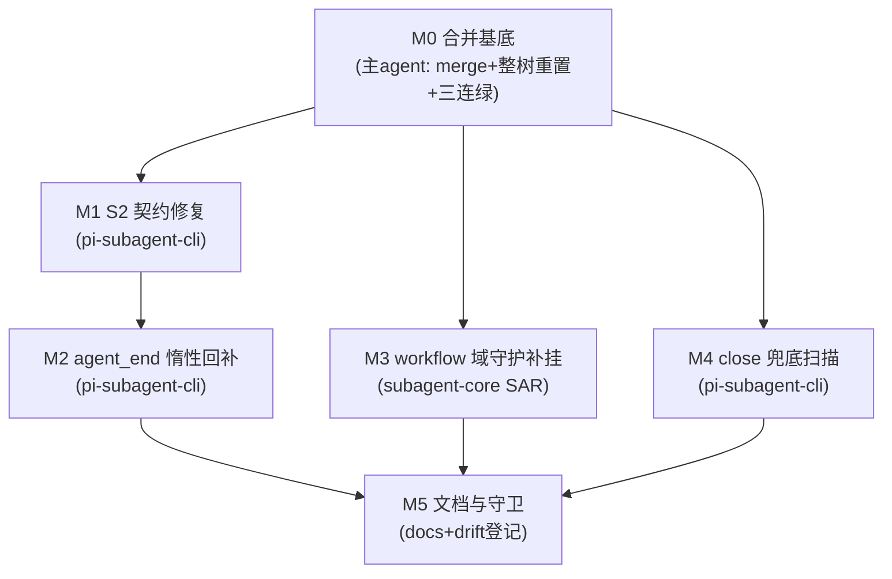

# subagent-agent-end-recovery-replay 实施计划

基线: (待基线 commit 后回填) | 来源设计: `docs/design/subagent-agent-end-recovery-replay.md`（设计就绪版，commit 41d475737） | 日期: 2026-09-10

对抗审查证据: `.review/design-review-replay-r1~r5.md`（主审五轮：5+3+2+1+0 MF 收敛）+ `design-review-replay-r1~r4-impact.md`（影响面审：R4 起 0 MF 收敛）。终局 = R5 主审 0/0 + R4 影响面 0 MF。

## 0 章节映射

所有 subagent task 的坐标唯一来源，禁止自猜编号。

| 内容 | 设计文档实际位置 |
|------|------------------|
| 背景/目标 | §1（1.1 SCQA / 1.2 系统认知与关键协议事实 / 1.3 设计目标 G1-G3 / 1.4 in-out scope） |
| 现状与根因 | §2（2.1 六环链重放 / 2.2 S2 现场 / 2.3 下游代价 / 2.4 兜底核验含 M3 缺口 / 2.5 数据流 / 2.6 根因类抽象） |
| 终态/机制 | §3（3.1 终态 / 3.2 D1-D4 移植判定表 / 3.3 决策 1-9 / 3.4 错误规格表） |
| 验收场景表 | §4（V1-V7 + V5b/V5c；章首验收分层声明：V2-V4 协议脚本对端、V1 真实 pi 端到端） |
| 下一层拆分 | §5.1 单元 M0-M5（含文件改动地图） |
| 待验证检查点 | §5.2 K1-K6 |
| 超时哲学合规 | §5.4 |

## 1 目标快照（逐字摘录设计 §1.3 / §1.4）

**G1（根除不通知）**：任何 subagent run——无论握手成败、进程死活、引擎崩否——终态必然到达主 agent（完成/失败/终止通知三选一），不存在无限等待。

**G2（通知质量）**：完成通知携带结果正文与 `session_read` 截断指针行；sessionFile 尽最大努力获取（它决定 chat 域「Full transcript」指针、冷续 resume 锚点、session-reader 取证能力），但其缺失不得阻塞通知。

**G3（防复发）**：失败类抽象为「一次性获取 + 失败不可恢复 + 下游无限保守等待」——新架构每环都必须有不依赖运气的外部熔断，且本文档把判定证据固化，防止未来重构时旧病根借尸还魂。

**Out-of-scope**（设计 §1.4）：keep-alive 后代保活编排迁回（W7 裁决域）；runtime rpc-client 双轨调和机制改造；W 系列机制任何改动；NotifyDomainPorts 加固（遗留①）；carbon 升级（遗留④，部署侧）。

## 2 单元列表

无独立 u-foundation：M1-M4 均为包内小改动，无跨单元新增共享类型/接口模块（M3 复用 subagent-core 既有 settled-watchdog 原语，M2 消费 pi-subagent-cli 既有 `requestGetStateOnce` 死导出）——M0 既是 DAG 根。

| Unit | 职责 | 领地（精确文件路径，基于本 worktree） | 依赖 | 隔离 | 验收条款 |
|------|------|--------------------------------------|------|------|----------|
| **M0 合并基底** | `git merge dev-0.9.16` → 解冲突 → 整树重置代码面（设计决策 7：`git checkout dev-0.9.16 -- packages/ && git checkout dev-0.9.16 -- eslint.config.mjs`，覆盖内容冲突 2 件/自动合并陷阱 2 件/自动保留面 5 件）；文档冲突保两套；对照 K5 预演清单 | 无新改动（纯合并+重置+归位）；**主 agent 亲自执行**（git 写操作 subagent 禁止） | — | plain | 合并后全量测试三连绿（本计划 §4 全量组）+ K5 冲突面对照无清单外意外 |
| **M1 S2 契约修复** | 设计决策 1：`get-state-handshake.ts:82-91` 两个 clearTimeout 均移入 sessionFile 命中分支（应答不完整视同未应答，保留全部既有驱动）；改写锁行为专测 `:163-192` 为契约断言（缺 sessionFile 应答 → 剩余重试照发 → 3 轮耗尽 resolve） | `packages/pi-subagent-cli/src/get-state-handshake.ts`；`packages/pi-subagent-cli/src/__tests__/get-state-handshake.test.ts` | M0 | plain | V2（协议脚本对端）+ 契约单测绿；头注「最多重试 3 次」与实现一致 |
| **M2 agent_end 惰性回补** | 设计决策 2：`spawn-runner.ts:274-276` 非 chatMode `onAgentEnd` 分支改 async 编排——同步段先置 `runEnd.endedCleanly=true`，回补段整体 try / `killChild()` 放 finally 必达；`requestGetStateOnce` 接线（K1：优先 identity tracker 的 `addStateListener`，核对签名）；K2 killChild 幂等核验 | `packages/pi-subagent-cli/src/spawn-runner.ts`；`packages/pi-subagent-cli/src/get-state-handshake.ts`（仅 K1 接线需要时，M1 已合入后串行无冲突）；新增测试 `packages/pi-subagent-cli/src/__tests__/`（agent-end 补查 fake timers 用例 + 回补链抛错 kill 仍达用例） | M1（串行：同包同文件潜在接线面，避免并行冲突） | plain | V3（spawn 期三轮不应答 + agent_end 恢复应答 → outcome.sessionFile 非空 + ≤1s）；回补链抛错用例证明 kill finally 必达 |
| **M3 workflow 域守护补挂** | 设计决策 9：SAR.run（`subprocess-agent-runner.ts:235` 起）try 块内 engine.run 派发前 arm per-run no-progress watchdog（30min）；刷新源 = journal.onEvent 包装 ∪ stream.onDelta 包装；fire = watchdog AbortController 并入 mergeTimeoutSignal 合流（:214 扩一源）→ wireAbortSignal 阶梯；disarm = finally + 桥接 listener 移除；fire 回调同步段只 abort+warn 不抛；重试语义保留（executeAgentCall 通用重试面） | `packages/subagent-core/src/execution/subprocess-agent-runner.ts`；新增测试 `packages/subagent-core/src/execution/__tests__/`（楔死 fire 链 fake timers + 产出刷新不 fire + killAll 组杀邻接 V5c + chat 域守护回归零变化 V5b）；若原语抽取需新文件归本单元领地 | M0 | plain | V5①（fire 链断言 + 刷新不 fire + agent() 收敛/journal close/重试面）+ V5b 全绿 + V5c；V5② 视 K6 核验结果降级 |
| **M4 close 兜底扫描** | 设计决策 4：新建 prompt 头键扫描器（mtime ∈ [spawnStartedAtMs, close] 候选 + 前 ~64KB 头读 + `includes(promptHead ~200字符)` + 单命中才采纳/零多命中放弃 + 采纳 warn 附审计证据 + 降级门 >64 候选或 >100ms）；close finalizer 接线（`spawn-run-pump.ts:201-216` LC-4 之后、resolveExit 之前）；整体 try-catch / resolveExit 必达；K3① prompt 逐字落盘验证 | `packages/pi-subagent-cli/src/session-file-locator.ts`（新）；`packages/pi-subagent-cli/src/spawn-run-pump.ts`（close finalizer 插入）；`packages/pi-subagent-cli/src/index.ts`（barrel）；新增测试（单命中/零命中/多命中/坏行容错/fs 异常降级） | M0 | plain | V4（全程不应答 → 扫描补上单命中；多命中构造 → 放弃+warn+run 正常终态）；fs 异常用例证明 resolveExit 必达 |
| **M5 文档与守卫** | 设计决策 8：线 B 三份文档头部修订记录（D1-D4 判定结论 + 新落点 M1-M4 + 旧实现文件已随 engines/pi 删除）；troubleshooting §12 同步；replay.md 登记 `DOC_MODULE_MAP` → `packages/pi-subagent-cli/src` 映射（drift 守卫真检查）；replay.md §4 回填验收结果 | `docs/design/subagent-agent-end-recovery.md`；`docs/design/subagent-agent-end-recovery.impl-plan.md`；`docs/design/subagent-core-unbounded-wait-audit.md`；`docs/troubleshooting.md`；`scripts/check-doc-symbol-drift.mjs`；`docs/design/subagent-agent-end-recovery-replay.md` | M1-M4 全 committed | plain | V7 机器门全绿 + drift 守卫对 replay.md 真检查非恒真 |

**领地互斥说明**：M1 与 M2 串行因同包同文件（get-state-handshake.ts 的 K1 接线面）；M1∥M3∥M4 无文件交集（pi-subagent-cli 两文件 / subagent-core 一文件）；M4 的 spawn-run-pump.ts 与 M2 的 spawn-runner.ts 是不同文件（pump≠runner），barrel index.ts 仅 M4 触碰（M2 新增函数不进 barrel，lazy 回补是 spawn-runner 内部编排）。

## 3 DAG 图



并行批次：**批次 1** = M1 ∥ M3 ∥ M4（3 并发，符合 ≤5 约束）；**批次 2** = M2（M1 合入后立即开工，与批次 1 剩余并行）；**批次 3** = M5。

## 4 测试策略

命令从各包 package.json 实读（dev-0.9.16 树，M0 后在本 worktree 生效）。红线：vitest（禁 node:test），从子包目录运行；timer 测试用 fake timers；测试写删目标 mkdtempSync 自建自删，禁碰真实数据目录（fs-guard 已挂 pi-subagent-cli 与 subagent-core vitest）。

**增量（单元开发期）**：

| 包 | 命令 |
|----|------|
| pi-subagent-cli | `cd packages/pi-subagent-cli && pnpm test`（vitest run）+ `pnpm typecheck` |
| subagent-core | `cd packages/subagent-core && pnpm test` + `pnpm typecheck` |

**全量（M0 基底验收 + 收尾 Gate A / V7 机器门）**：

```bash
pnpm run lint                                   # root ESLint
pnpm --filter @zhushanwen/pi-subagent-cli test && pnpm --filter @zhushanwen/pi-subagent-cli typecheck
pnpm --filter @zhushanwen/subagent-core test && pnpm --filter @zhushanwen/subagent-core typecheck
pnpm --filter @zhushanwen/runtime test          # M0 基底重点（5 件自动保留面在其领地）
node scripts/check-doc-symbol-drift.mjs         # M5 后
```

**端到端（Gate B，阶段 5）**：V1（真机 dev app 6 路并发 workflow subagent）+ V6（常规单路 + chat 域冷续）按设计 §4 步骤执行；V2-V4 协议脚本对端在单元验收期随做随验，脚本用完归档移除。对端 sessionDir 必须 mkdtempSync 或继承测试进程已重定向的 `XYZ_AGENT_DATA_DIR`（设计 §4 分层声明）。

## 5 合理偏差登记表

| Unit | 偏差描述 | 判定与依据 | 登记时间 |
|------|----------|-----------|----------|
| (空) | | | |

## 6 状态表

| Unit | 状态 | 轮次 | 证据指针 |
|------|------|------|----------|
| M0 合并基底 | committed | 1/2 | merge 430dacabc + 残留清理 e192dfe4a；K5 冲突面与预演清单完全吻合；全量三连绿（pi-subagent-cli 304 passed / subagent-core 2834 passed / runtime 457 文件 5184 passed / tsc 干净） |
| M1 S2 契约修复 | in-progress | 0/2 | 批次 1 派发 |
| M2 agent_end 惰性回补 | pending | 0/2 | — |
| M3 workflow 域守护补挂 | in-progress | 0/2 | 批次 1 派发 |
| M4 close 兜底扫描 | in-progress | 0/2 | 批次 1 派发 |
| M5 文档与守卫 | pending | 0/2 | — |

## 7 残留风险与变更历史

**残留风险**：

- K1-K6 检查点（设计 §5.2）分别挂在：M2（K1 接线签名 / K2 killChild 幂等）、M4（K3① prompt 逐字落盘——非逐字则 M4 降级为「只 warn 不采纳」并登记）、M0（K5 冲突面预演对照——清单外 packages/ 冲突即停下重估）、M5（K4 rpc-client diff 核验无欠账重放）、V5②（K6 mid-round 窗可否缩短——不可则降级 V1 兜底）。
- V1 真机验收需 dev app + 真实 workflow 派发环境（阶段 5 处理，可能需 `pnpm dev` + Playwright 连 9222）。
- K3① 失败时 M4 降级路径已在设计决策 4 预置，不阻塞 M1-M3/M5。

**变更历史**：

- 2026-09-10：计划创建（对应设计就绪版 41d475737），待用户评审 + 基线 commit。
